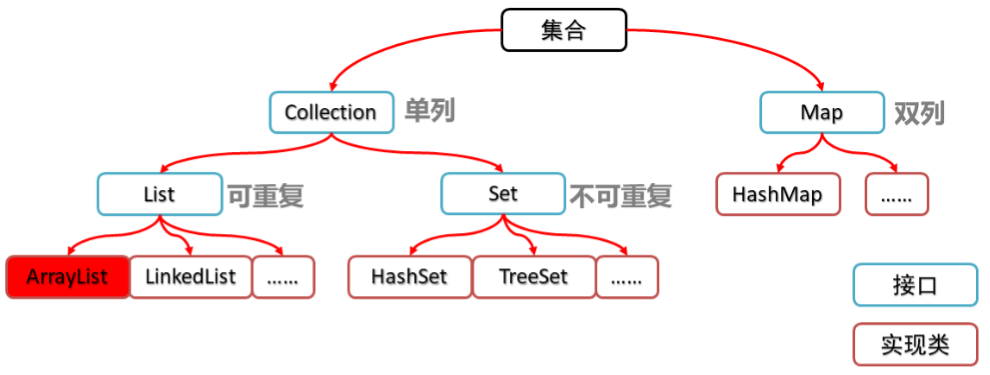

# 14_ 集合01

## 1.Collection集合

1. **概念：**collenction继承了Iterable接口（迭代器），实现了其中的方法，所以Colloection内所有的东西都可以使用**hasNext(), next(),remove() **方法去遍历数据，值得注意的是，只能存储引用类型，并且只能存储单个数据

2. 集合类的体系图：

   

3. collection集合的基本使用

   ```java
   public class CollectionDemo01 {
       public static void main(String[] args) {
           //创建Collection集合的对象
           Collection<String> c = new ArrayList<String>();
   
           //添加元素：boolean add(E e)
           c.add("hello");
           c.add("world");
           c.add("java");
   
           //输出集合对象
           System.out.println(c);
       }
   }
   ```

4. collection集合的常用方法

   | 方法名                     | 说明                               |
   | -------------------------- | ---------------------------------- |
   | boolean add(E e)           | 添加元素                           |
   | boolean remove(Object o)   | 从集合中移除指定的元素             |
   | void   clear()             | 清空集合中的元素                   |
   | boolean contains(Object o) | 判断集合中是否存在指定的元素       |
   | boolean isEmpty()          | 判断集合是否为空                   |
   | int   size()               | 集合的长度，也就是集合中元素的个数 |

5. Collection集合的遍历【应用】

   迭代器的介绍

   - 迭代器，集合的专用遍历方式
   - Iterator<E> iterator()：返回此集合中元素的迭代器，通过集合的iterator()方法得到
   - 迭代器是通过集合的iterator()方法得到的，所以我们说它是依赖于集合而存在的

   Collection集合的遍历

   ```java
   public class IteratorDemo {
       public static void main(String[] args) {
           //创建集合对象
           Collection<String> c = new ArrayList<>();
   
           //添加元素
           c.add("hello");
           c.add("world");
           c.add("java");
           c.add("javaee");
   
           //Iterator<E> iterator()：返回此集合中元素的迭代器，通过集合的iterator()方法得到
           Iterator<String> it = c.iterator();
   
           //用while循环改进元素的判断和获取
           while (it.hasNext()) {
               String s = it.next();
               System.out.println(s);
           }
       }
   }
   ```

6. 集合使用步骤图解

   

7. 集合的案例-Collection集合存储学生对象并遍历【应用】

   - 案例需求

     创建一个存储学生对象的集合，存储3个学生对象，使用程序实现在控制台遍历该集合

   - 代码实现

     - 学生类

       ```java
       public class Student {
           private String name;
           private int age;
       
           public Student() {
           }
       
           public Student(String name, int age) {
               this.name = name;
               this.age = age;
           }
       
           public String getName() {
               return name;
           }
       
           public void setName(String name) {
               this.name = name;
           }
       
           public int getAge() {
               return age;
           }
       
           public void setAge(int age) {
               this.age = age;
           }
       }
       ```

     - 测试类

       ```java
       public class CollectionDemo {
           public static void main(String[] args) {
               //创建Collection集合对象
               Collection<Student> c = new ArrayList<Student>();
       
               //创建学生对象
               Student s1 = new Student("林青霞", 30);
               Student s2 = new Student("张曼玉", 35);
               Student s3 = new Student("王祖贤", 33);
       
               //把学生添加到集合
               c.add(s1);
               c.add(s2);
               c.add(s3);
       
               //遍历集合(迭代器方式)
               Iterator<Student> it = c.iterator();
               while (it.hasNext()) {
                   Student s = it.next();
                   System.out.println(s.getName() + "," + s.getAge());
               }
           }
       }
       ```

### 1.List

List存储元素的特点：有序可重复，什么样的顺序存的，取出来也是什么顺序**（有顺序，无规律）**

- List集合特有方法

  | 方法名                          | 描述                                   |
  | ------------------------------- | -------------------------------------- |
  | void add(int index,E   element) | 在此集合中的指定位置插入指定的元素     |
  | E remove(int   index)           | 删除指定索引处的元素，返回被删除的元素 |
  | E set(int index,E   element)    | 修改指定索引处的元素，返回被修改的元素 |
  | E get(int   index)              | 返回指定索引处的元素                   |

- ArrayList：底层是数组结构实现，**查询快、增删慢**

  底层采用的是数组存储元素的。适合数据查询，不适合数据频繁增删。

  数组存储元素类型都是统一的，相同类型的元素在底层占用空间大小是一致的，数据存储在空间排列上是有规律的，通过数组首元素的地址加上偏移量就能够得到数据的位置，所以查询效率高，随机增删数据会涉及到后面元素的位移。

- LinkedList：底层是链表结构实现，**查询慢、增删快**

  底层数据结构是双向链表，链表适合频繁增删，不适合查询

  特有方法：

  | 方法名                    | 说明                             |
  | ------------------------- | -------------------------------- |
  | public void addFirst(E e) | 在该列表开头插入指定的元素       |
  | public void addLast(E e)  | 将指定的元素追加到此列表的末尾   |
  | public E getFirst()       | 返回此列表中的第一个元素         |
  | public   E getLast()      | 返回此列表中的最后一个元素       |
  | public E removeFirst()    | 从此列表中删除并返回第一个元素   |
  | public   E removeLast()   | 从此列表中删除并返回最后一个元素 |

- Vector(基本不用)

  底层数据结构和ArrayList是一致的。线程是安全的。一般情况下不会使用集合自带的安全机制，Verctor效率不高，所以现在用的比较少
  
- 集合的案例-List集合存储学生对象并遍历【应用】

  - 需求：创建一个存储学生对象的集合，存储3个学生对象，使用程序实现在控制台遍历该集合

  - 代码实现

    - 学生类

      ```java
      public class Student {
          private String name;
          private int age;
      
          public Student() {
          }
      
          public Student(String name, int age) {
              this.name = name;
              this.age = age;
          }
      
          public String getName() {
              return name;
          }
      
          public void setName(String name) {
              this.name = name;
          }
      
          public int getAge() {
              return age;
          }
      
          public void setAge(int age) {
              this.age = age;
          }
      }
      ```

    - 测试类

      ```java
      public class ListDemo {
          public static void main(String[] args) {
              //创建List集合对象
              List<Student> list = new ArrayList<Student>();
      
              //创建学生对象
              Student s1 = new Student("林青霞", 30);
              Student s2 = new Student("张曼玉", 35);
              Student s3 = new Student("王祖贤", 33);
      
              //把学生添加到集合
              list.add(s1);
              list.add(s2);
              list.add(s3);
      
              //迭代器方式
              Iterator<Student> it = list.iterator();
              while (it.hasNext()) {
                  Student s = it.next();
                  System.out.println(s.getName() + "," + s.getAge());
              }
              
              System.out.println("--------");
      
              //for循环方式
              for(int i=0; i<list.size(); i++) {
                  Student s = list.get(i);
                  System.out.println(s.getName() + "," + s.getAge());
              }
      
          }
      }
      ```

- 列表迭代器

  - ListIterator介绍

    - 通过List集合的listIterator()方法得到，所以说它是List集合特有的迭代器
    - 用于允许程序员沿任一方向遍历的列表迭代器，在迭代期间修改列表，并获取列表中迭代器的当前位置

  - 示例代码

    ```java
    public class ListIteratorDemo {
        public static void main(String[] args) {
            //创建集合对象
            List<String> list = new ArrayList<String>();
    
            //添加元素
            list.add("hello");
            list.add("world");
            list.add("java");
    
            //获取列表迭代器
            ListIterator<String> lit = list.listIterator();
            while (lit.hasNext()) {
                String s = lit.next();
                if(s.equals("world")) {
                    lit.add("javaee");
                }
            }
    
            System.out.println(list);
    
        }
    }
    ```

- 增强for循环

  定义格式

  ```java
  for(元素数据类型 变量名 : 数组/集合对象名) {
      循环体;
  }
  ```

  

  ```java
  public class ForDemo {
      public static void main(String[] args) {
          int[] arr = {1,2,3,4,5};
          for(int i : arr) {
              System.out.println(i);
          }
          
          System.out.println("--------");
  
          String[] strArray = {"hello","world","java"};
          for(String s : strArray) {
              System.out.println(s);
          }
          
          System.out.println("--------");
  
          List<String> list = new ArrayList<String>();
          list.add("hello");
          list.add("world");
          list.add("java");
  
          for(String s : list) {
              System.out.println(s);
          }
          
          System.out.println("--------");
  
          //内部原理是一个Iterator迭代器
          /*
          for(String s : list) {
              if(s.equals("world")) {
                  list.add("javaee"); //ConcurrentModificationException
              }
          }
          */
      }
  ```

- 集合的案例-List集合存储学生对象三种方式遍历【应用】

  - 需求：	创建一个存储学生对象的集合，存储3个学生对象，使用程序实现在控制台遍历该集合

  - 代码实现

    - 学生类

      ```java
      public class Student {
          private String name;
          private int age;
      
          public Student() {
          }
      
          public Student(String name, int age) {
              this.name = name;
              this.age = age;
          }
      
          public String getName() {
              return name;
          }
      
          public void setName(String name) {
              this.name = name;
          }
      
          public int getAge() {
              return age;
          }
      
          public void setAge(int age) {
              this.age = age;
          }
      }
      ```

    - 测试类

      ```java
      public class ListDemo {
          public static void main(String[] args) {
              //创建List集合对象
              List<Student> list = new ArrayList<Student>();
      
              //创建学生对象
              Student s1 = new Student("林青霞", 30);
              Student s2 = new Student("张曼玉", 35);
              Student s3 = new Student("王祖贤", 33);
      
              //把学生添加到集合
              list.add(s1);
              list.add(s2);
              list.add(s3);
      
              //迭代器：集合特有的遍历方式
              Iterator<Student> it = list.iterator();
              while (it.hasNext()) {
                  Student s = it.next();
                  System.out.println(s.getName()+","+s.getAge());
              }
              System.out.println("--------");
      
              //普通for：带有索引的遍历方式
              for(int i=0; i<list.size(); i++) {
                  Student s = list.get(i);
                  System.out.println(s.getName()+","+s.getAge());
              }
              System.out.println("--------");
      
              //增强for：最方便的遍历方式
              for(Student s : list) {
                  System.out.println(s.getName()+","+s.getAge());
              }
          }
      }
      ```

      

### 2. Set

- Set集合的特点
  - 元素存取无序
  - 没有索引、只能通过迭代器或增强for循环遍历
  - 不能存储重复元素

- HashSet

  数据结构：哈希散列表

- SortedSet

  无序，不可重复。存储进去的元素按照大小进行排序
  
- Set集合的基本使用

  ```java
  public class SetDemo {
      public static void main(String[] args) {
          //创建集合对象
          Set<String> set = new HashSet<String>();
  
          //添加元素
          set.add("hello");
          set.add("world");
          set.add("java");
          //不包含重复元素的集合
          set.add("world");
  
          //遍历
          for(String s : set) {
              System.out.println(s);
          }
      }
  }
  ```

  1. 哈希值

     - 哈希值简介

       ​	是JDK根据对象的地址或者字符串或者数字算出来的int类型的数值

     - 如何获取哈希值

       ​	Object类中的`public int hashCode()`：返回对象的哈希码值

     - 哈希值的特点

       - 同一个对象多次调用hashCode()方法返回的哈希值是相同的
       - 默认情况下，不同对象的哈希值是不同的。而重写hashCode()方法，可以实现让不同对象的哈希值相同

     - 获取哈希值的代码

       - 学生类

         ```java
         public class Student {
             private String name;
             private int age;
         
             public Student() {
             }
         
             public Student(String name, int age) {
                 this.name = name;
                 this.age = age;
             }
         
             public String getName() {
                 return name;
             }
         
             public void setName(String name) {
                 this.name = name;
             }
         
             public int getAge() {
                 return age;
             }
         
             public void setAge(int age) {
                 this.age = age;
             }
         
             @Override
             public int hashCode() {
                 return 0;
             }
         }
         ```

       - 测试类

         ```java
         public class HashDemo {
             public static void main(String[] args) {
                 //创建学生对象
                 Student s1 = new Student("林青霞",30);
         
                 //同一个对象多次调用hashCode()方法返回的哈希值是相同的
                 System.out.println(s1.hashCode()); //1060830840
                 System.out.println(s1.hashCode()); //1060830840
                 System.out.println("--------");
         
                 Student s2 = new Student("林青霞",30);
         
                 //默认情况下，不同对象的哈希值是不相同的
                 //通过方法重写，可以实现不同对象的哈希值是相同的
                 System.out.println(s2.hashCode()); //2137211482
                 System.out.println("--------");
         
                 System.out.println("hello".hashCode()); //99162322
                 System.out.println("world".hashCode()); //113318802
                 System.out.println("java".hashCode()); //3254818
         
                 System.out.println("world".hashCode()); //113318802
                 System.out.println("--------");
         
                 System.out.println("重地".hashCode()); //1179395
                 System.out.println("通话".hashCode()); //1179395
             }
         }
         ```

  2. HashSet集合概述和特点

     - HashSet集合的特点

       - 底层数据结构是哈希表
       - 对集合的迭代顺序不作任何保证，也就是说不保证存储和取出的元素顺序一致
       - 没有带索引的方法，所以不能使用普通for循环遍历
       - 由于是Set集合，所以是不包含重复元素的集合

     - HashSet集合的基本使用

       ```java
       public class HashSetDemo01 {
           public static void main(String[] args) {
               //创建集合对象
               HashSet<String> hs = new HashSet<String>();
       
               //添加元素
               hs.add("hello");
               hs.add("world");
               hs.add("java");
       
               hs.add("world");
       
               //遍历
               for(String s : hs) {
                   System.out.println(s);
               }
           }
       }
       ```

  3. HashSet集合保证元素唯一性源码分析

     - HashSet集合保证元素唯一性的原理

       ​	1.根据对象的哈希值计算存储位置

       ​            如果当前位置没有元素则直接存入

       ​            如果当前位置有元素存在，则进入第二步

       ​     2.当前元素的元素和已经存在的元素比较哈希值

       ​            如果哈希值不同，则将当前元素进行存储

       ​            如果哈希值相同，则进入第三步

       ​     3.通过equals()方法比较两个元素的内容

       ​            如果内容不相同，则将当前元素进行存储

       ​            如果内容相同，则不存储当前元素

     - HashSet集合保证元素唯一性的图解

       

  4. HashSet集合存储学生对象并遍历

     1. 需求：

        - 创建一个存储学生对象的集合，存储多个学生对象，使用程序实现在控制台遍历该集合
        - 要求：学生对象的成员变量值相同，我们就认为是同一个对象

     2. 代码实现

        - 学生类

          ```java
          public class Student {
              private String name;
              private int age;
          
              public Student() {
              }
          
              public Student(String name, int age) {
                  this.name = name;
                  this.age = age;
              }
          
              public String getName() {
                  return name;
              }
          
              public void setName(String name) {
                  this.name = name;
              }
          
              public int getAge() {
                  return age;
              }
          
              public void setAge(int age) {
                  this.age = age;
              }
          
              @Override
              public boolean equals(Object o) {
                  if (this == o) return true;
                  if (o == null || getClass() != o.getClass()) return false;
          
                  Student student = (Student) o;
          
                  if (age != student.age) return false;
                  return name != null ? name.equals(student.name) : student.name == null;
              }
          
              @Override
              public int hashCode() {
                  int result = name != null ? name.hashCode() : 0;
                  result = 31 * result + age;
                  return result;
              }
          }
          ```

        - 测试类

          ```java
          public class HashSetDemo02 {
              public static void main(String[] args) {
                  //创建HashSet集合对象
                  HashSet<Student> hs = new HashSet<Student>();
          
                  //创建学生对象
                  Student s1 = new Student("林青霞", 30);
                  Student s2 = new Student("张曼玉", 35);
                  Student s3 = new Student("王祖贤", 33);
          
                  Student s4 = new Student("王祖贤", 33);
          
                  //把学生添加到集合
                  hs.add(s1);
                  hs.add(s2);
                  hs.add(s3);
                  hs.add(s4);
          
                  //遍历集合(增强for)
                  for (Student s : hs) {
                      System.out.println(s.getName() + "," + s.getAge());
                  }
              }
          }
          ```

  5. LinkedHashSet集合概述和特点【应用】

     - LinkedHashSet集合特点

       - 哈希表和链表实现的Set接口，具有可预测的迭代次序
       - 由链表保证元素有序，也就是说元素的存储和取出顺序是一致的
       - 由哈希表保证元素唯一，也就是说没有重复的元素

     - LinkedHashSet集合基本使用

       ```java
       public class LinkedHashSetDemo {
           public static void main(String[] args) {
               //创建集合对象
               LinkedHashSet<String> linkedHashSet = new LinkedHashSet<String>();
       
               //添加元素
               linkedHashSet.add("hello");
               linkedHashSet.add("world");
               linkedHashSet.add("java");
       
               linkedHashSet.add("world");
       
               //遍历集合
               for(String s : linkedHashSet) {
                   System.out.println(s);
               }
           }
       }
       ```


## 2.Set集合排序

- TreeSet集合概述

  - 元素有序，可以按照一定的规则进行排序，具体排序方式取决于构造方法
    - TreeSet()：根据其元素的自然排序进行排序
    - TreeSet(Comparator comparator) ：根据指定的比较器进行排序
  - 没有带索引的方法，所以不能使用普通for循环遍历
  - 由于是Set集合，所以不包含重复元素的集合

- TreeSet集合基本使用

  ```java
  public class TreeSetDemo01 {
      public static void main(String[] args) {
          //创建集合对象
          TreeSet<Integer> ts = new TreeSet<Integer>();
  
          //添加元素
          ts.add(10);
          ts.add(40);
          ts.add(30);
          ts.add(50);
          ts.add(20);
  
          ts.add(30);
  
          //遍历集合
          for(Integer i : ts) {
              System.out.println(i);
          }
      }
  }
  ```

## 3.自然排序Comparable的使用

- 案例需求

  - 存储学生对象并遍历，创建TreeSet集合使用无参构造方法
  - 要求：按照年龄从小到大排序，年龄相同时，按照姓名的字母顺序排序

- 实现步骤

  - 用TreeSet集合存储自定义对象，无参构造方法使用的是自然排序对元素进行排序的
  - 自然排序，就是让元素所属的类实现Comparable接口，重写compareTo(T o)方法
  - 重写方法时，一定要注意排序规则必须按照要求的主要条件和次要条件来写

- 代码实现

  - 学生类

    ```java
    public class Student implements Comparable<Student> {
        private String name;
        private int age;
    
        public Student() {
        }
    
        public Student(String name, int age) {
            this.name = name;
            this.age = age;
        }
    
        public String getName() {
            return name;
        }
    
        public void setName(String name) {
            this.name = name;
        }
    
        public int getAge() {
            return age;
        }
    
        public void setAge(int age) {
            this.age = age;
        }
    
        @Override
        public int compareTo(Student s) {
    //        return 0;
    //        return 1;
    //        return -1;
            //按照年龄从小到大排序
           int num = this.age - s.age;
    //        int num = s.age - this.age;
            //年龄相同时，按照姓名的字母顺序排序
           int num2 = num==0?this.name.compareTo(s.name):num;
            return num2;
        }
    }
    ```

  - 测试类

    ```java
    public class TreeSetDemo02 {
        public static void main(String[] args) {
            //创建集合对象
            TreeSet<Student> ts = new TreeSet<Student>();
    
            //创建学生对象
            Student s1 = new Student("xishi", 29);
            Student s2 = new Student("wangzhaojun", 28);
            Student s3 = new Student("diaochan", 30);
            Student s4 = new Student("yangyuhuan", 33);
    
            Student s5 = new Student("linqingxia",33);
            Student s6 = new Student("linqingxia",33);
    
            //把学生添加到集合
            ts.add(s1);
            ts.add(s2);
            ts.add(s3);
            ts.add(s4);
            ts.add(s5);
            ts.add(s6);
    
            //遍历集合
            for (Student s : ts) {
                System.out.println(s.getName() + "," + s.getAge());
            }
        }
    }
    ```

## 4.比较器排序Comparator的使用

- 案例需求

  - 存储学生对象并遍历，创建TreeSet集合使用带参构造方法
  - 要求：按照年龄从小到大排序，年龄相同时，按照姓名的字母顺序排序

- 实现步骤

  - 用TreeSet集合存储自定义对象，带参构造方法使用的是比较器排序对元素进行排序的
  - 比较器排序，就是让集合构造方法接收Comparator的实现类对象，重写compare(T o1,T o2)方法
  - 重写方法时，一定要注意排序规则必须按照要求的主要条件和次要条件来写

- 代码实现

  - 学生类

    ```java
    public class Student {
        private String name;
        private int age;
    
        public Student() {
        }
    
        public Student(String name, int age) {
            this.name = name;
            this.age = age;
        }
    
        public String getName() {
            return name;
        }
    
        public void setName(String name) {
            this.name = name;
        }
    
        public int getAge() {
            return age;
        }
    
        public void setAge(int age) {
            this.age = age;
        }
    }
    ```

  - 测试类

    ```java
    public class TreeSetDemo {
        public static void main(String[] args) {
            //创建集合对象
            TreeSet<Student> ts = new TreeSet<Student>(new Comparator<Student>() {
                @Override
                public int compare(Student s1, Student s2) {
                    //this.age - s.age
                    //s1,s2
                    int num = s1.getAge() - s2.getAge();
                    int num2 = num == 0 ? s1.getName().compareTo(s2.getName()) : num;
                    return num2;
                }
            });
    
            //创建学生对象
            Student s1 = new Student("xishi", 29);
            Student s2 = new Student("wangzhaojun", 28);
            Student s3 = new Student("diaochan", 30);
            Student s4 = new Student("yangyuhuan", 33);
    
            Student s5 = new Student("linqingxia",33);
            Student s6 = new Student("linqingxia",33);
    
            //把学生添加到集合
            ts.add(s1);
            ts.add(s2);
            ts.add(s3);
            ts.add(s4);
            ts.add(s5);
            ts.add(s6);
    
            //遍历集合
            for (Student s : ts) {
                System.out.println(s.getName() + "," + s.getAge());
            }
        }
    }
    ```

    

## 5.成绩排序案例

- 案例需求

  - 用TreeSet集合存储多个学生信息(姓名，语文成绩，数学成绩)，并遍历该集合
  - 要求：按照总分从高到低出现

- 代码实现

  - 学生类

    ```java
    public class Student {
        private String name;
        private int chinese;
        private int math;
    
        public Student() {
        }
    
        public Student(String name, int chinese, int math) {
            this.name = name;
            this.chinese = chinese;
            this.math = math;
        }
    
        public String getName() {
            return name;
        }
    
        public void setName(String name) {
            this.name = name;
        }
    
        public int getChinese() {
            return chinese;
        }
    
        public void setChinese(int chinese) {
            this.chinese = chinese;
        }
    
        public int getMath() {
            return math;
        }
    
        public void setMath(int math) {
            this.math = math;
        }
    
        public int getSum() {
            return this.chinese + this.math;
        }
    }
    ```

  - 测试类

    ```java
    public class TreeSetDemo {
        public static void main(String[] args) {
            //创建TreeSet集合对象，通过比较器排序进行排序
            TreeSet<Student> ts = new TreeSet<Student>(new Comparator<Student>() {
                @Override
                public int compare(Student s1, Student s2) {
    //                int num = (s2.getChinese()+s2.getMath())-(s1.getChinese()+s1.getMath());
                    //主要条件
                    int num = s2.getSum() - s1.getSum();
                    //次要条件
                    int num2 = num == 0 ? s1.getChinese() - s2.getChinese() : num;
                    int num3 = num2 == 0 ? s1.getName().compareTo(s2.getName()) : num2;
                    return num3;
                }
            });
    
            //创建学生对象
            Student s1 = new Student("林青霞", 98, 100);
            Student s2 = new Student("张曼玉", 95, 95);
            Student s3 = new Student("王祖贤", 100, 93);
            Student s4 = new Student("柳岩", 100, 97);
            Student s5 = new Student("风清扬", 98, 98);
    
            Student s6 = new Student("左冷禅", 97, 99);
    //        Student s7 = new Student("左冷禅", 97, 99);
            Student s7 = new Student("赵云", 97, 99);
    
            //把学生对象添加到集合
            ts.add(s1);
            ts.add(s2);
            ts.add(s3);
            ts.add(s4);
            ts.add(s5);
            ts.add(s6);
            ts.add(s7);
    
            //遍历集合
            for (Student s : ts) {
                System.out.println(s.getName() + "," + s.getChinese() + "," + s.getMath() + "," + s.getSum());
            }
        }
    }
    ```

## 6.不重复的随机数案例

- 案例需求

  - 编写一个程序，获取10个1-20之间的随机数，要求随机数不能重复，并在控制台输出

- 代码实现

  ```java
  public class SetDemo {
      public static void main(String[] args) {
          //创建Set集合对象
  //        Set<Integer> set = new HashSet<Integer>();
          Set<Integer> set = new TreeSet<Integer>();
  
          //创建随机数对象
          Random r = new Random();
  
          //判断集合的长度是不是小于10
          while (set.size()<10) {
              //产生一个随机数，添加到集合
              int number = r.nextInt(20) + 1;
              set.add(number);
          }
  
          //遍历集合
          for(Integer i : set) {
              System.out.println(i);
          }
      }
  }
  ```

  

## 2.collection集合的基本操作

```java
//创建一个集合 没有使用泛型规定参数类型
Collection collection = new ArrayList();//多态
collection.add(123);//int也可以存  自动装箱为包装类对象然后在添加到集合中
collection.add("宋天");
collection.add(true);
```

1. 实际应用中，一个集合一般情况下只存储一种类型的数据，可以用泛型来约束集合中的元素类型
2. 泛型就是把类型当做参数传递，可以在代码编译阶段对代码进行检查	

```java
Collection<String> collection2 = new ArrayList<String>();//规定是String
collection2.add("宋天");
System.out.println(collection);//输出[123, 宋天, true]   而不是具体的值
```

输出的是具体值的原因：

1. collection指向的是ArrayList集合的对象
2. 调用println方法的时候，把collection的变量值，即ArrayList的对象的引用作为println()方法的实参
3. 在println()方法打印对象的时候，会调用ArrayList的toString()方法，找不到toString方法时需要去父级寻找

```java
//常用基本操作
 * add() 添加元素
 * clear() 清空结合
 * contains() 判断元素是否存在
 * isEmaty() 判断是否为空
 * Iterator<E> 创建迭代器
 * remove(Object o) 删除元素
 * int size() 集合长度
 * toArray() 将集合转化为数组
 
System.out.println(collection.isEmpty());//判断是否为空 false
System.out.println(collection.size());//长度 3
System.out.println(collection.contains("宋天"));//判断元素是否存在 true
System.out.println(collection.remove("宋天"));//删除元素 删除成功返回true，失败返回false
collection.toArray();//将集合转化为数组
collection.clear();//清空

```

## 3. 并发修改异常【应用】

- 出现的原因

  ​	迭代器遍历的过程中，通过集合对象修改了集合中的元素，造成了迭代器获取元素中判断预期修改值和实际修改值不一致，则会出现：ConcurrentModificationException

- 解决的方案

  ​	用for循环遍历，然后用集合对象做对应的操作即可

- 案例

  ```java
  public class ListDemo {
      public static void main(String[] args) {
          //创建集合对象
          List<String> list = new ArrayList<String>();
  
          //添加元素
          list.add("hello");
          list.add("world");
          list.add("java");
  
          //遍历集合，得到每一个元素，看有没有"world"这个元素，如果有，我就添加一个"javaee"元素，请写代码实现
  //        Iterator<String> it = list.iterator();
  //        while (it.hasNext()) {
  //            String s = it.next();
  //            if(s.equals("world")) {
  //                list.add("javaee");
  //            }
  //        }
  
          for(int i=0; i<list.size(); i++) {
              String s = list.get(i);
              if(s.equals("world")) {
                  list.add("javaee");
              }
          }
  
          //输出集合对象
          System.out.println(list);
      }
  }
  ```

  

## 3. Map<key,value>集合

Map<K,V>，一次添加一对元素（又称键值对）。K是键，V是值。

- HashMap

  哈希表/散列表HashMap中的key就等同与set

- Hashtable

  线程安全，效率不高，用的较少，但是它的子类Properties用的较多

  Properties：

  属性类，也是key和value形式存储的，但是存储类型只能是字符串类型的

- SortedMap

  key中存储的元素特点是无序，不可重复的，但是可以按照元素的大小排序，相当于SortedSet。

  TreeMap是SortedMap的实现类，TreeMap中的key就是一个TreeSet

## 4. 单项链表

每个元素都称作节点（Entry），每个节点都由两部分组成。

1. 单项链表每一个节点在内存中存储的空间上存储是没有规律的

2. Object就是集合存储的引用类型

3. 0X1234是下一个元素的内存地址

   

- 为什么单项列表查询效率低？

  因为单项链表每个元素在内存中存储的空间上是没有规律的，也没有顺序，如果想要获取到某个元素，要从头往后遍历，找到为止

- 为什么单项链表增删效率高？

  因为链表每个元素存储的空间是没有顺序的，删除或者添加某个元素，只要让指针重新指向即可，不需要将其他元素位移，所以增删效率高

## 5.双向链表

头部内存地址是上一个元素的内存地址，尾部的内存地址是下一个元素的内存地址，中间的是数据的地址而不是具体的数据