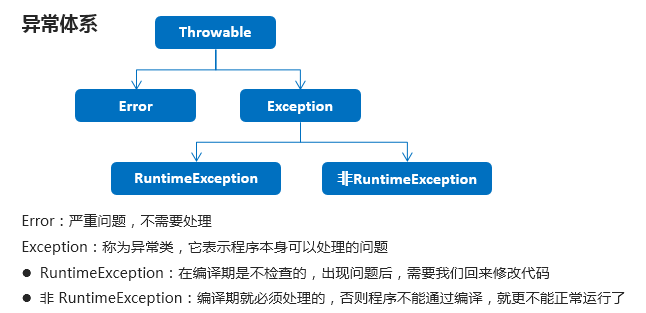

# 17_ 异常

异常继承图



## 1. 异常的概念

- 异常就是模拟现实世界中的不正常事件
- java中用类来模拟异常

## 2.异常机制的作用

- 当程序发生异常事件之后，为我们输出了详细信息，通过这个信息可以对事件进行处理，使得程序变得更加的健壮性

## 3.异常处理的两种方式

1. 声明抛出 throws

   会阻断代码继续执行

   throw --》手动抛出异常

2. 捕捉try catch

   不会阻断代码继续执行

   语法：

   ```java
   try{
   	可能出现异常的代码
   }catch(异常类型1 变量1){
   	处理异常的代码
   }catch(异常类型2 变量2){
   	处理异常的代码
   }catch(异常类型3 变量3){
   	处理异常的代码
   }
   //可以写多个 但是必须是从上到下 从小到大捕捉
   ```

案例：

```java
package com.itstar.exception;

import java.io.FileInputStream;
import java.io.FileNotFoundException;
import java.io.IOException;

/*
 * 	异常的第二种处理方式 捕捉 try.....catch...
 * 
 * 	语法 
 * 		try{
 * 			可能出现异常的代码
 * 		}catch(异常类型1 变量1){
 * 			处理异常的代码
 * 		}catch(异常类型2 变量2){
 * 			处理异常的代码
 * 		}catch(异常类型3 变量3){
 * 			处理异常的代码
 * 		}
 * 	 
 * 		1. catch 语句块 可有多个,但是需要从上到下,从小到大
 * 	    2. try... catch...最多执行一个catch语句块,执行后结束
 * 
 * */
public class ExceptionTest04 {
	
	public static void main(String[] args) {

		//编译不通过,FileNotFoundException 没有被处理
//		try {
//			FileInputStream fileInputStream = new FileInputStream("c:/ttttt.txt");
//		} catch (NullPointerException e) {
//			e.printStackTrace();
//		}
		
		//代码编译无法通过,还有IOException没有被处理
//		try {
//			FileInputStream fileInputStream = new FileInputStream("");
//			fileInputStream.read();
//		} catch (FileNotFoundException e) {
//			e.printStackTrace();
//		} 
		
		//代码编译通过 IOExpetion 是父类异常
//		try {
//			FileInputStream fileInputStream = new FileInputStream("");
//			fileInputStream.read();
//		} catch (IOException e) {
//			e.printStackTrace();
//		}
		
		//代码无法编译 
		//catch 语句块可以写多个但是必须是从上到下从小到大捕捉
//		try {
//			FileInputStream fileInputStream = new FileInputStream("");
//			fileInputStream.read();
//		} catch (IOException e) {
//			e.printStackTrace();
//		} catch (FileNotFoundException e) {
//			e.printStackTrace();
//		}
		
		FileInputStream fileInputStream = null;

			try {
				//程序执行到此处发生了一个FileNotFoundException类型的异常
				//jvm 会自定创建一个FileNotFoundException类型的对象,将对象的内存地址赋值给catch语句块的e
				fileInputStream = new FileInputStream("我爱你亲爱的宝宝");
				//上面的代码出现了异常,try语句块代码不再执行,直接进入到 catch语句块中
				System.out.println("lalall");
			
			} catch (FileNotFoundException e) {
				//e 内存地址指向堆中的对象 FileNotFoundException
				//FileNotFoundException 将 Object 中的toString方法重写了
				System.out.println(e);
				//e.printStackTrace();
			}
			
			try {
				fileInputStream.read();
			} catch (IOException e) {
				e.printStackTrace();
			}
			
			
			
			//System.out.println("厉害了我的哥!");

	}
	
}

```

## 4. 关于getMessage 和 PrintStackTrack

```java
public class ExceptionTest01 {
	public static void main(String[] args) {
		try {
			FileInputStream file = new FileInputStream("c:/sss.txt");
		} catch (FileNotFoundException e) {
			// TODO Auto-generated catch block
			//打印异常的堆栈信息 一般情况下会用这个
			e.printStackTrace();
            /*
            java.io.FileNotFoundException: c:\sss.txt (系统找不到指定的文件。)
			at java.base/java.io.FileInputStream.open0(Native Method)
			at java.base/java.io.FileInputStream.open(FileInputStream.java:219)
			at java.base/java.io.FileInputStream.<init>(FileInputStream.java:157)
			at java.base/java.io.FileInputStream.<init>(FileInputStream.java:112)
			at day16/day16.ExceptionTest01.main(ExceptionTest01.java:16) 
            */
			
//			String messString = e.getMessage();
//			System.out.println(messString);//c:\sss.txt (系统找不到指定的文件。)
			
//			e.printStackTrace();
		}
		
	}
}

```

## 5.  finally 语法的使用

1. 直接和try语句块使用

   `try...finally`		`try...catch....finally`

   特性：一定会被执行

2. 因为finally是一定会执行的，所以通常为了保证某一资源一定会得到释放，会选择使用finally

## 6.Throwable成员方法（应用）

1. 常用方法

   | 方法名                        | 说明                              |
   | ----------------------------- | --------------------------------- |
   | public String getMessage()    | 返回此 throwable 的详细消息字符串 |
   | public String toString()      | 返回此可抛出的简短描述            |
   | public void printStackTrace() | 把异常的错误信息输出在控制台      |

2. 示例代码

   ```java
   public class ExceptionDemo02 {
       public static void main(String[] args) {
           System.out.println("开始");
           method();
           System.out.println("结束");
       }
   
       public static void method() {
           try {
               int[] arr = {1, 2, 3};
               System.out.println(arr[3]); //new ArrayIndexOutOfBoundsException();
               System.out.println("这里能够访问到吗");
           } catch (ArrayIndexOutOfBoundsException e) { //new ArrayIndexOutOfBoundsException();
   //            e.printStackTrace();
   
               //public String getMessage():返回此 throwable 的详细消息字符串
   //            System.out.println(e.getMessage());
               //Index 3 out of bounds for length 3
   
               //public String toString():返回此可抛出的简短描述
   //            System.out.println(e.toString());
               //java.lang.ArrayIndexOutOfBoundsException: Index 3 out of bounds for length 3
   
               //public void printStackTrace():把异常的错误信息输出在控制台
               e.printStackTrace();
   //            java.lang.ArrayIndexOutOfBoundsException: Index 3 out of bounds for length 3
   //            at com.itheima_02.ExceptionDemo02.method(ExceptionDemo02.java:18)
   //            at com.itheima_02.ExceptionDemo02.main(ExceptionDemo02.java:11)
   
           }
       }
   }
   ```

## 7.编译时异常和运行时异常的区别（记忆）

- 编译时异常
  - 都是Exception类及其子类
  - 必须显示处理，否则程序就会发生错误，无法通过编译
- 运行时异常
  - 都是RuntimeException类及其子类
  - 无需显示处理，也可以和编译时异常一样处理

## 8.throws方式处理异常（应用）

1. 定义格式：

   ```java
   public void 方法() throws 异常类名 {
       
   }
   ```

2. 示例

   ```java
   public class ExceptionDemo {
       public static void main(String[] args) {
           System.out.println("开始");
   //        method();
           try {
               method2();
           }catch (ParseException e) {
               e.printStackTrace();
           }
           System.out.println("结束");
       }
   
       //编译时异常
       public static void method2() throws ParseException {
           String s = "2048-08-09";
           SimpleDateFormat sdf = new SimpleDateFormat("yyyy-MM-dd");
           Date d = sdf.parse(s);
           System.out.println(d);
       }
   
       //运行时异常
       public static void method() throws ArrayIndexOutOfBoundsException {
           int[] arr = {1, 2, 3};
           System.out.println(arr[3]);
       }
   }
   ```

3. 注意事项

   - 这个throws格式是跟在方法的括号后面的
   - 编译时异常必须要进行处理，两种处理方案：try...catch …或者 throws，如果采用 throws 这种方案，将来谁调用谁处理
   - 运行时异常可以不处理，出现问题后，需要我们回来修改代码

## 9.throws和throw的区别

1. throws：用来声明一个方法可能产生的所有异常，不做任何处理而是将异常往上传，谁调用我我就抛给谁。
   -   用在方法声明后面，跟的是异常类名
   -   可以跟多个异常类名，用逗号隔开
   -   表示抛出异常，由该方法的调用者来处理
   -   throws表示出现异常的一种可能性，并不一定会发生这些异常
2. throw：则是用来抛出一个具体的异常类型。
   -  用在方法体内，跟的是异常对象名
   - 只能抛出一个异常对象名
   - 表示抛出异常，由方法体内的语句处理
   -  throw则是抛出了异常，执行throw则一定抛出了某种异常 

## 10.自定义异常

1. 自定义异常类

   ```java
   public class ScoreException extends Exception {
   
       public ScoreException() {}
   
       public ScoreException(String message) {
           super(message);
       }
   
   }
   ```

2. 老师类

   ```java
   public class Teacher {
       public void checkScore(int score) throws ScoreException {
           if(score<0 || score>100) {
   //            throw new ScoreException();
               throw new ScoreException("你给的分数有误，分数应该在0-100之间");
           } else {
               System.out.println("成绩正常");
           }
       }
   }
   ```

3. 测试类

   ```java
   public class Demo {
       public static void main(String[] args) {
           Scanner sc = new Scanner(System.in);
           System.out.println("请输入分数：");
   
           int score = sc.nextInt();
   
           Teacher t = new Teacher();
           try {
               t.checkScore(score);
           } catch (ScoreException e) {
               e.printStackTrace();
           }
       }
   }
   ```

   