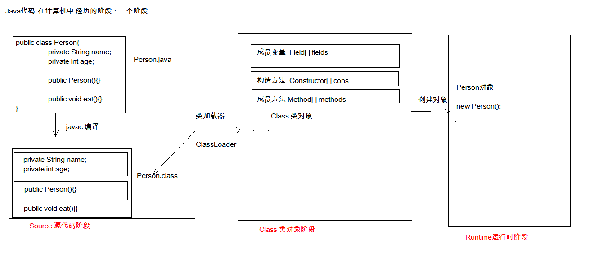

# 26-反射



# 1.反射的概念

- 框架：半成品的软件。可以在框架的基础上进行软件开发，简化代码

- 反射：将类的各个组成部分封装为其他对象，这就是反射机制

  好处：

  - 可以在程序运行的过程中操作这些对象
  - 可以解耦，提高程序的可扩展性

# 2. 获取class对象的方式

1. `class.forName(“全类名”)`：将字节码文件加载进内存，返回class对象
2. `类名.class`：通过类名的属性class获取
3. `对象.getClass`：该方法在Object类中定义着。

```java
       /**
         *  1. `class.forName(“全类名”)`：将字节码文件加载进内存，返回class对象
         *  2. `类名.class`：通过类名的属性class获取
         *  3. `对象.getClass`：该方法在Object类中定义着。
         */

        // 此方式多用于配置文件，将类名定义在配置文件中。读取文件，加载类
        Class<?> c1 = Class.forName("reflect.Persion");
        System.out.println(c1); // class reflect.Persion

        // 多用于参数的传递
        Class<Persion> c2 = Persion.class;
        System.out.println(c2); // class reflect.Persion

        // 多用于对象的获取字节码的方式
        Persion p = new Persion();
        Class<? extends Persion> c3 = p.getClass();
        System.out.println(c3); // class reflect.Persion

//        比较三个对象
        System.out.println(c1 == c2);//true
        System.out.println(c1 == c3);//true
        System.out.println(c2 == c3);//true

        /**
         * 结论：同一个字节码文件在一次程序运行过程中，只会被加载一次
         */
```

# 3. Class对象的功能

**获取功能：**

1. 获取成员变量们

   ```java
   Field[] getFields() ：获取所有public修饰的成员变量
   Field getField(String name)   获取指定名称的 public修饰的成员变量
   Field[] getDeclaredFields()  获取所有的成员变量，不考虑修饰符
   Field getDeclaredField(String name)   获取指定的成员变量
   ```

2. 获取构造方法们

   ```java
   Constructor<?>[] getConstructors()  
   Constructor<T> getConstructor(类<?>... parameterTypes)  
   Constructor<T> getDeclaredConstructor(类<?>... parameterTypes)  
   Constructor<?>[] getDeclaredConstructors()  
   ```

3. 获取成员方法们

   ```java
   Method[] getMethods()  
   Method getMethod(String name, 类<?>... parameterTypes)  
   Method[] getDeclaredMethods()  
   Method getDeclaredMethod(String name, 类<?>... parameterTypes)  
   ```

4. 获取类名

   ```java
   String getName()  
   ```

**操作成员变量**

- 设置值
  ```java
  void set(Object obj, Object value)  
  ```

- 获取值

  ```java
  get(Object obj) 
  ```

- 忽略访问权限修饰符的安全检查， 暴力反射
  ```java
  setAccessible(true) 
  ```

**操作构造方法**

创建对象

```java
T newInstance(Object... initargs)  
```

如果使用空参数构造方法创建对象，操作可以简化：**Class对象的newInstance方法**

```java
package reflect;

import java.lang.reflect.Constructor;
import java.lang.reflect.Field;
import java.lang.reflect.Method;

/**
 * @Class:javaE.reflect.getClasss
 * @Descript:Class对象的功能
 * @Author:宋天
 * @Date:2020/3/28
 */
public class getClasss {
    public static void main(String[] args) throws Exception {

        Class<Persion> p = Persion.class;

        // 获取成员变量们
        Field[] fields = p.getFields();
        for (Field field : fields) {
            System.out.println(field); // public java.lang.String reflect.Persion.a
        }
        Field a = p.getField("a");
        System.out.println(a); //public java.lang.String reflect.Persion.a

        //获取成员变量a的值
        Persion persion = new Persion();
        Object o = a.get(persion);
        System.out.println(o); // null

        //设置a的值
        a.set(persion,"asdasdasda");
        System.out.println(persion); // Persion{name='null', age=0, a='asdasdasda', b='null', c='null', d='null'}


        //获取所有的成员变量
        Field[] d = p.getDeclaredFields();
        for (Field f : d) {
            System.out.println(f);
            /**
             * private java.lang.String reflect.Persion.name
             * private int reflect.Persion.age
             * public java.lang.String reflect.Persion.a
             * protected java.lang.String reflect.Persion.b
             * java.lang.String reflect.Persion.c
             * private java.lang.String reflect.Persion.d
             *
             */
        }

        //  获取指定的成员变量
        Field d1 = p.getDeclaredField("d");
        //忽略访问缺陷修饰符的安全检查，注意一定要在获取成员变量的值之前进行暴力反射
        d1.setAccessible(true); // 暴力反射，没有这行代码，下面的内容会报错
        Object o1 = d1.get(persion);
        System.out.println(o1);// null


        // 获取构造方法，注意，根据构造函数的参数不同，返回的构造器对象也不同
        Constructor<Persion> c = p.getConstructor();
        System.out.println(c); // public reflect.Persion()

        // 创建构造器对象
        Persion p1 = c.newInstance();
        System.out.println(p1); // Persion{name='null', age=0, a='null', b='null', c='null', d='null'}
        //只有空参构造可以这样简化，通过class对象的newInstance方法
        Persion persion1 = p.newInstance();
        System.out.println(persion1);// Persion{name='null', age=0, a='null', b='null', c='null', d='null'}


        // 获取成员方法们,会返回该方法全部的
        Method[] methods = p.getMethods();
        for (Method method : methods) {
            System.out.println(method);
            /**
             * public java.lang.String reflect.Persion.toString()
             * public java.lang.String reflect.Persion.getName()
             * public void reflect.Persion.setName(java.lang.String)
             * public void reflect.Persion.setAge(int)
             * public int reflect.Persion.getAge()
             * public final void java.lang.Object.wait() throws java.lang.InterruptedException
             * public final void java.lang.Object.wait(long,int) throws java.lang.InterruptedException
             * public final native void java.lang.Object.wait(long) throws java.lang.InterruptedException
             * public boolean java.lang.Object.equals(java.lang.Object)
             * public native int java.lang.Object.hashCode()
             * public final native java.lang.Class java.lang.Object.getClass()
             * public final native void java.lang.Object.notify()
             * public final native void java.lang.Object.notifyAll()
             */
        }

        // 获取单个方法
        Method m1 = p.getMethod("eat");
        System.out.println(m1);// public void reflect.Persion.eat()
        // 执行这个方法 (无参)
        Persion persion2 = new Persion();
        m1.invoke(persion2); // eat...

        // 执行这个方法 (有参)
        Method m2 = p.getMethod("eat",String.class);
        m2.invoke(persion2,"ssss"); // eat...ssss


        //获取类名
        String name = p.getName();
        System.out.println(name);//reflect.Persion
    }
}

```

# 4.配置类对象

```java
//加载配置文件
Properties pro = new Properties();
//加载配置文件，转换为一个集合
//获取本类对象对应的类加载器
ClassLoader classLoader = test.class.getClassLoader();
//注意这个配置文件的路径得是在src根目录下
InputStream r1 = classLoader.getResourceAsStream("pro.properties");
pro.load(r1);
```

# 5. 案例

通过加载配置类文件快速使用类方法

```java
package reflect;

import java.io.IOException;
import java.io.InputStream;
import java.lang.reflect.Method;
import java.util.Properties;

/**
 * @Class:javaE.reflect.test
 * @Descript:
 * @Author:宋天
 * @Date:2020/3/28
 */
public class test {
    public static void main(String[] args) throws Exception {
        //1. 加载配置文件
        Properties pro = new Properties();
        //加载配置文件，转换为一个集合
        //获取test文件的类对象对应的类加载器
        ClassLoader classLoader = test.class.getClassLoader();
        //注意这个配置文件的路径得是在src根目录下
        InputStream r1 = classLoader.getResourceAsStream("pro.properties");
        pro.load(r1);


        //2. 获取配置文件中定义的对象
        String className = pro.getProperty("className");
        String methodName = pro.getProperty("methodName");

        //3. 加载该类进内存
        Class<?> cls = Class.forName(className);
        //4. 创建对象
        Object obj = cls.newInstance();
        //5. 获取方法对象
        Method method = cls.getMethod(methodName);
        //6. 执行方法
        method.invoke(obj);

    }
}

```

pro.properties

```java
className=reflect.Persion
methodName=eat
```

