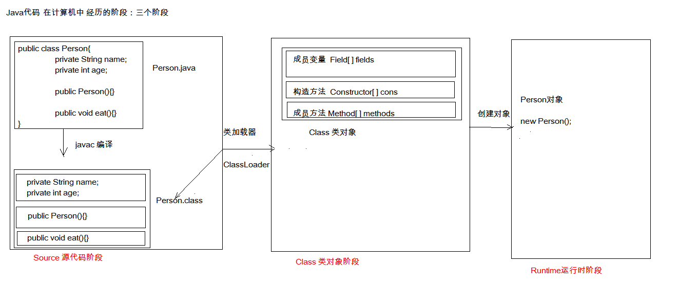

# 26-反射，Junit，注解



# 1.反射的概念

- 框架：半成品的软件。可以在框架的基础上进行软件开发，简化代码

- 反射：将类的各个组成部分封装为其他对象，这就是反射机制

  好处：

  - 可以在程序运行的过程中操作这些对象
  - 可以解耦，提高程序的可扩展性

# 2. 获取class对象的方式

1. `class.forName(“全类名”)`：将字节码文件加载进内存，返回class对象
2. `类名.class`：通过类名的属性class获取
3. `对象.getClass`：该方法在Object类中定义着。

```java
       /**
         *  1. `class.forName(“全类名”)`：将字节码文件加载进内存，返回class对象
         *  2. `类名.class`：通过类名的属性class获取
         *  3. `对象.getClass`：该方法在Object类中定义着。
         */

        // 此方式多用于配置文件，将类名定义在配置文件中。读取文件，加载类
        Class<?> c1 = Class.forName("reflect.Persion");
        System.out.println(c1); // class reflect.Persion

        // 多用于参数的传递
        Class<Persion> c2 = Persion.class;
        System.out.println(c2); // class reflect.Persion

        // 多用于对象的获取字节码的方式
        Persion p = new Persion();
        Class<? extends Persion> c3 = p.getClass();
        System.out.println(c3); // class reflect.Persion

//        比较三个对象
        System.out.println(c1 == c2);//true
        System.out.println(c1 == c3);//true
        System.out.println(c2 == c3);//true

        /**
         * 结论：同一个字节码文件在一次程序运行过程中，只会被加载一次
         */
```

# 3. Class对象的功能

**获取功能：**

1. 获取成员变量们

   ```java
   Field[] getFields() ：获取所有public修饰的成员变量
   Field getField(String name)   获取指定名称的 public修饰的成员变量
   Field[] getDeclaredFields()  获取所有的成员变量，不考虑修饰符
   Field getDeclaredField(String name)   获取指定的成员变量
   ```

2. 获取构造方法们

   ```java
   Constructor<?>[] getConstructors()  
   Constructor<T> getConstructor(类<?>... parameterTypes)  
   Constructor<T> getDeclaredConstructor(类<?>... parameterTypes)  
   Constructor<?>[] getDeclaredConstructors()  
   ```

3. 获取成员方法们

   ```java
   Method[] getMethods()  
   Method getMethod(String name, 类<?>... parameterTypes)  
   Method[] getDeclaredMethods()  
   Method getDeclaredMethod(String name, 类<?>... parameterTypes)  
   ```

4. 获取类名

   ```java
   String getName()  
   ```

**操作成员变量**

- 设置值
  ```java
  void set(Object obj, Object value)  
  ```

- 获取值

  ```java
  get(Object obj) 
  ```

- 忽略访问权限修饰符的安全检查， 暴力反射
  ```java
  setAccessible(true) 
  ```

**操作构造方法**

创建对象

```java
T newInstance(Object... initargs)  
```

如果使用空参数构造方法创建对象，操作可以简化：**Class对象的newInstance方法**

```java
package reflect;

import java.lang.reflect.Constructor;
import java.lang.reflect.Field;
import java.lang.reflect.Method;

/**
 * @Class:javaE.reflect.getClasss
 * @Descript:Class对象的功能
 * @Author:宋天
 * @Date:2020/3/28
 */
public class getClasss {
    public static void main(String[] args) throws Exception {

        Class<Persion> p = Persion.class;

        // 获取成员变量们
        Field[] fields = p.getFields();
        for (Field field : fields) {
            System.out.println(field); // public java.lang.String reflect.Persion.a
        }
        Field a = p.getField("a");
        System.out.println(a); //public java.lang.String reflect.Persion.a

        //获取成员变量a的值
        Persion persion = new Persion();
        Object o = a.get(persion);
        System.out.println(o); // null

        //设置a的值
        a.set(persion,"asdasdasda");
        System.out.println(persion); // Persion{name='null', age=0, a='asdasdasda', b='null', c='null', d='null'}


        //获取所有的成员变量
        Field[] d = p.getDeclaredFields();
        for (Field f : d) {
            System.out.println(f);
            /**
             * private java.lang.String reflect.Persion.name
             * private int reflect.Persion.age
             * public java.lang.String reflect.Persion.a
             * protected java.lang.String reflect.Persion.b
             * java.lang.String reflect.Persion.c
             * private java.lang.String reflect.Persion.d
             *
             */
        }

        //  获取指定的成员变量
        Field d1 = p.getDeclaredField("d");
        //忽略访问缺陷修饰符的安全检查，注意一定要在获取成员变量的值之前进行暴力反射
        d1.setAccessible(true); // 暴力反射，没有这行代码，下面的内容会报错
        Object o1 = d1.get(persion);
        System.out.println(o1);// null


        // 获取构造方法，注意，根据构造函数的参数不同，返回的构造器对象也不同
        Constructor<Persion> c = p.getConstructor();
        System.out.println(c); // public reflect.Persion()

        // 创建构造器对象
        Persion p1 = c.newInstance();
        System.out.println(p1); // Persion{name='null', age=0, a='null', b='null', c='null', d='null'}
        //只有空参构造可以这样简化，通过class对象的newInstance方法
        Persion persion1 = p.newInstance();
        System.out.println(persion1);// Persion{name='null', age=0, a='null', b='null', c='null', d='null'}


        // 获取成员方法们,会返回该方法全部的
        Method[] methods = p.getMethods();
        for (Method method : methods) {
            System.out.println(method);
            /**
             * public java.lang.String reflect.Persion.toString()
             * public java.lang.String reflect.Persion.getName()
             * public void reflect.Persion.setName(java.lang.String)
             * public void reflect.Persion.setAge(int)
             * public int reflect.Persion.getAge()
             * public final void java.lang.Object.wait() throws java.lang.InterruptedException
             * public final void java.lang.Object.wait(long,int) throws java.lang.InterruptedException
             * public final native void java.lang.Object.wait(long) throws java.lang.InterruptedException
             * public boolean java.lang.Object.equals(java.lang.Object)
             * public native int java.lang.Object.hashCode()
             * public final native java.lang.Class java.lang.Object.getClass()
             * public final native void java.lang.Object.notify()
             * public final native void java.lang.Object.notifyAll()
             */
        }

        // 获取单个方法
        Method m1 = p.getMethod("eat");
        System.out.println(m1);// public void reflect.Persion.eat()
        // 执行这个方法 (无参)
        Persion persion2 = new Persion();
        m1.invoke(persion2); // eat...

        // 执行这个方法 (有参)
        Method m2 = p.getMethod("eat",String.class);
        m2.invoke(persion2,"ssss"); // eat...ssss


        //获取类名
        String name = p.getName();
        System.out.println(name);//reflect.Persion
    }
}

```

# 4.配置类对象

```java
//加载配置文件
Properties pro = new Properties();
//加载配置文件，转换为一个集合
//获取本类对象对应的类加载器
ClassLoader classLoader = test.class.getClassLoader();
//注意这个配置文件的路径得是在src根目录下
InputStream r1 = classLoader.getResourceAsStream("pro.properties");
pro.load(r1);
```

# 5. 案例

通过加载配置类文件快速使用类方法

```java
package reflect;

import java.io.IOException;
import java.io.InputStream;
import java.lang.reflect.Method;
import java.util.Properties;

/**
 * @Class:javaE.reflect.test
 * @Descript:
 * @Author:宋天
 * @Date:2020/3/28
 */
public class test {
    public static void main(String[] args) throws Exception {
        //1. 加载配置文件
        Properties pro = new Properties();
        //加载配置文件，转换为一个集合
        //获取test文件的类对象对应的类加载器
        ClassLoader classLoader = test.class.getClassLoader();
        //注意这个配置文件的路径得是在src根目录下
        InputStream r1 = classLoader.getResourceAsStream("pro.properties");
        pro.load(r1);


        //2. 获取配置文件中定义的对象
        String className = pro.getProperty("className");
        String methodName = pro.getProperty("methodName");

        //3. 加载该类进内存
        Class<?> cls = Class.forName(className);
        //4. 创建对象
        Object obj = cls.newInstance();
        //5. 获取方法对象
        Method method = cls.getMethod(methodName);
        //6. 执行方法
        method.invoke(obj);

    }
}

```

pro.properties

```java
className=reflect.Persion
methodName=eat
```

# 6.Junit

测试分类：

1. 黑盒测试：不需要写代码，给输入值，看程序是否能够输出期望的值。
2. 白盒测试：需要写代码的。关注程序具体的执行流程。

junit使用：白盒测试：

1. 定义一个测试类

   ```java
   public class test {
       public int  addTest(int a,int b){
           return a + b ;
       }
   }
   ```

2. 定义测试方法，给方法添加@Test 

   ```java
   import org.junit.Test;
   public class Test01 {
       /**
        * 测试
        */
         @Test
       public void testAdd() throws ClassNotFoundException {
           test test = new test();
           int result = test.addTest(1, 2);
       }
   }
   ```

   

Assert.assertEquals(期望的结果,运算的结果);

-  @Before:
   修饰的方法会在测试方法之前被自动执行

  * @After:

    修饰的方法会在测试方法执行之后自动被执行

```java
import org.junit.After;
import org.junit.Assert;
import org.junit.Before;
import org.junit.Test;

/**
 * @Class:Junit.test.Test01
 * @Descript:
 * @Author:宋天
 * @Date:2020/3/11
 */
public class Test01 {

    @Before
    public void init(){
        /**
        * 用于资源申请，所有测试方法在执行之前都会执行该方法
        */
        System.out.println("初始化方法");
    }
    /**
     * 测试
     */
    @Test
    public void testAdd() throws ClassNotFoundException {
        test test = new test();
        int result = test.addTest(1, 2);
        //断言，断言这个测试结果是4，结果报错
        Assert.assertEquals(3,result);
        System.out.println("========");
    }

    @After
    public void end(){
        /**
        * 释放资源，在所有测试方法执行完毕之后，都会自动执行该方法
        */
        System.out.println("结束方法");
    }
}

```

# 7.注解

概念：说明程序的。给计算机看的

注释：用文字描述程序的。给程序员看的

定义：注解（Annotation），也叫元数据。一种代码级别的说明。它是JDK1.5及以后版本引入的一个特性，与类、接口、枚举是在同一个层次。它可以声明在包、类、字段、方法、局部变量、方法参数等的前面，用来对这些元素进行说明，注释。

概念描述：

- JDK1.5之后的新特性
- 说明程序的
- 使用注解：@注解名称

作用分类：

1. 编写文档：通过代码里标识的注解生成文档【生成文档doc文档】

   命令行通过`javadoc 文件名`的方式生成文档

   ```java
   /**
    * @Class: Junit.test.demo
    * @Descript: 注解javadoc 演示
    * @Author: 宋天
    * @Date: 2020/4/4
    */
   public class demo {
       /**
        * 计算两数的和
        * @param a 参数1
        * @param b 参数2
        * @return 两数和
        */
       public int add(int a,int b){
           return a + b;
       }
   
   }
   ```

2. 代码分析：通过代码里标识的注解对代码进行分析【使用反射】

3. 编译检查：通过代码里标识的注解让编译器能够实现基本的编译检查【Override】

**预定义注解：**

1.  @Override	：检测被该注解标注的方法是否是继承自父类(接口)的

2. @Deprecated：该注解标注的内容，表示已过时

3.  @SuppressWarnings：压制警告

   一般传递参数all  @SuppressWarnings("all")

**自定义注解**
格式：

```java
元注解
public @interface 注解名称{
	属性列表;
}
```

本质：注解本质上就是一个接口，该接口默认继承Annotation接口

```java
示例：
public interface MyAnno extends java.lang.annotation.Annotation {}
```

定义了属性，在使用时需要给属性赋值

1.  如果定义属性时，使用default关键字给属性默认初始化值，则使用注解时，可以不进行属性的赋值。
2.  如果只有一个属性需要赋值，并且属性的名称是value，则value可以省略，直接定义值即可。
3. 数组赋值时，值使用{}包裹。如果数组中只有一个值，则{}可以省略
   	

示例：

```java
//自定义注解
public @interface MyAnno {
    int show1();//基本数据类型
    String show2() default  "张三"; //字符串 设置默认值
    Person per(); // 枚举类
    MyAnno2 anno2();//注解类
    String[] strs();//数组

}
//注解类
public @interface MyAnno2 {

}
//枚举类
public enum Person {
    p1,p2;
}
//使用
@MyAnno(show1 = 1, per = Person.p1 , anno2 = @MyAnno2  , strs = {} )
public class worker {

}
```

**元注解：**用于描述注解的注解

- @Target：描述注解能够作用的位置

  ```java
  @Target(value = {ElementType.TYPE,ElementType.FIELD}) // 表示MyAnnoDemo注解只能作用于类上
  public @interface MyAnnoDemo {
  }
  ```

  ElementType取值：

     * TYPE：可以作用于类上
     * METHOD：可以作用于方法上
     * FIELD：可以作用于成员变量上

- @Retention：描述注解被保留的阶段

  >  @Retention(RetentionPolicy.RUNTIME)：当前被描述的注解，会保留到class字节码文件中，并被JVM读取到

- @Documented：描述注解是否被抽取到api文档中

- @Inherited：描述注解是否被子类继承

**在程序使用(解析)注解：**获取注解中定义的属性值

 1. 获取注解定义的位置的对象  （Class，Method,Field）

 2. 获取指定的注解

    getAnnotation(Class)，其实就是在内存中生成了一个该注解接口的子类实现对象

    ```java
    public class ProImpl implements Pro{
        public String className(){
            return "test.Demo1";
        }
        public String methodName(){
            return "show";
        }
    }
    ```

	3. 调用注解中的抽象方法获取配置的属性值

示例：

```java
//描述需要执行的类名和方法名
@Target({ElementType.TYPE})
@Retention(RetentionPolicy.RUNTIME)
public @interface Pro {
    String className();
    String methodName();
}

@Pro(className = "test.demo01",methodName = "show")
public class ReflectTest {
    public static void main(String[] args) {
        //1. 解析注解
        // 获取该类的字节码文件对象
        Class<ReflectTest> reflectTestClass = ReflectTest.class;
        //2. 获取上面的注解对象
        //实际上就是在内存中生成了一个该注解接口的子类实现对象
        Pro annotation = reflectTestClass.getAnnotation(Pro.class);
        //3. 调用注解对象中定义的抽象方法，获取返回值
        String className = annotation.className();
        String methodName = annotation.methodName();


        System.out.println(className);// test.demo01
        System.out.println(methodName);// show


    }
}

```

# 8.注解案例

```java
package cn.itcast.annotation.demo;


/**
 * 小明定义的计算器类
 */
public class Calculator {

    //加法
    @Check
    public void add(){
        String str = null;
        str.toString();
        System.out.println("1 + 0 =" + (1 + 0));
    }
    //减法
    @Check
    public void sub(){
        System.out.println("1 - 0 =" + (1 - 0));
    }
    //乘法
    @Check
    public void mul(){
        System.out.println("1 * 0 =" + (1 * 0));
    }
    //除法
    @Check
    public void div(){
        System.out.println("1 / 0 =" + (1 / 0));
    }


    public void show(){
        System.out.println("永无bug...");
    }

}

```

```java
package cn.itcast.annotation.demo;


import java.lang.annotation.ElementType;
import java.lang.annotation.Retention;
import java.lang.annotation.RetentionPolicy;
import java.lang.annotation.Target;

@Retention(RetentionPolicy.RUNTIME)
@Target(ElementType.METHOD)
public @interface Check {
}

```

```java
package cn.itcast.annotation.demo;


import java.io.BufferedWriter;
import java.io.FileWriter;
import java.io.IOException;
import java.lang.reflect.InvocationTargetException;
import java.lang.reflect.Method;

/**
 * 简单的测试框架
 *
 * 当主方法执行后，会自动自行被检测的所有方法(加了Check注解的方法)，判断方法是否有异常，记录到文件中
 */
public class TestCheck {


    public static void main(String[] args) throws IOException {
        //1.创建计算器对象
        Calculator c = new Calculator();
        //2.获取字节码文件对象
        Class cls = c.getClass();
        //3.获取所有方法
        Method[] methods = cls.getMethods();

        int number = 0;//出现异常的次数
        BufferedWriter bw = new BufferedWriter(new FileWriter("bug.txt"));


        for (Method method : methods) {
            //4.判断方法上是否有Check注解
            if(method.isAnnotationPresent(Check.class)){
                //5.有，执行
                try {
                    method.invoke(c);
                } catch (Exception e) {
                    //6.捕获异常

                    //记录到文件中
                    number ++;

                    bw.write(method.getName()+ " 方法出异常了");
                    bw.newLine();
                    bw.write("异常的名称:" + e.getCause().getClass().getSimpleName());
                    bw.newLine();
                    bw.write("异常的原因:"+e.getCause().getMessage());
                    bw.newLine();
                    bw.write("--------------------------");
                    bw.newLine();

                }
            }
        }

        bw.write("本次测试一共出现 "+number+" 次异常");

        bw.flush();
        bw.close();


    }

}

```

