# 27-jvm优化-01

以下所有关于jvm优化的内容全部基于jdk1.8

# 1.JVM的运行参数

在jvm中有很多的参数可以进行设置，这样可以让jvm在各种环境中都能高效的运行。绝大部分的参数保持默认即可

## 1.1 三种参数类型

jvm的参数类型分为三类，分别是：

- 标准参数
  - -help
  - -version
- -X参数（非标准参数）
  - -Xint
  - -Xcomp
- -XX参数（使用率高）
  - -XX:newSize
  - -xx:+UseSerialGc

## 1.2 标准参数

jvm的标准参数，一般都是很稳定的，在未来的JVM版本中不会改变，可以使用`java -help`检索出所有的标准参数

```shell
[root@node01 ~]# java -help
用法: java [-options] class [args...]
           (执行类)
   或  java [-options] -jar jarfile [args...]
           (执行 jar 文件)
其中选项包括:
    -d32	  使用 32 位数据模型 (如果可用)
    -d64	  使用 64 位数据模型 (如果可用)
    -server	  选择 "server" VM
                  默认 VM 是 server,
                  因为您是在服务器类计算机上运行。


    -cp <目录和 zip/jar 文件的类搜索路径>
    -classpath <目录和 zip/jar 文件的类搜索路径>
                  用 : 分隔的目录, JAR 档案
                  和 ZIP 档案列表, 用于搜索类文件。
    -D<名称>=<值>
                  设置系统属性
    -verbose:[class|gc|jni]
                  启用详细输出
    -version      输出产品版本并退出
    -version:<值>
                  警告: 此功能已过时, 将在
                  未来发行版中删除。
                  需要指定的版本才能运行
    -showversion  输出产品版本并继续
    -jre-restrict-search | -no-jre-restrict-search
                  警告: 此功能已过时, 将在
                  未来发行版中删除。
                  在版本搜索中包括/排除用户专用 JRE
    -? -help      输出此帮助消息
    -X            输出非标准选项的帮助
    -ea[:<packagename>...|:<classname>]
    -enableassertions[:<packagename>...|:<classname>]
                  按指定的粒度启用断言
    -da[:<packagename>...|:<classname>]
    -disableassertions[:<packagename>...|:<classname>]
                  禁用具有指定粒度的断言
    -esa | -enablesystemassertions
                  启用系统断言
    -dsa | -disablesystemassertions
                  禁用系统断言
    -agentlib:<libname>[=<选项>]
                  加载本机代理库 <libname>, 例如 -agentlib:hprof
                  另请参阅 -agentlib:jdwp=help 和 -agentlib:hprof=help
    -agentpath:<pathname>[=<选项>]
                  按完整路径名加载本机代理库
    -javaagent:<jarpath>[=<选项>]
                  加载 Java 编程语言代理, 请参阅 java.lang.instrument
    -splash:<imagepath>
                  使用指定的图像显示启动屏幕
```

### 1.2.1 实战

**实战1：查看jvm版本**

```shell
[root@node01 ~]# java -version
java version "1.8.0_141"
Java(TM) SE Runtime Environment (build 1.8.0_141-b15)
Java HotSpot(TM) 64-Bit Server VM (build 25.141-b15, mixed mode)

# -showversion参数是表示，先打印版本信息，再执行后面的命令，在调试时非常有用，后面会使用到。
```

**实战2：通过-D设置系统属性参数**

```java
public class TestJVM {
    public static void main(String[] args) {
        String str = System.getProperty("str");
        if (str == null) {
            System.out.println("itcast");
        } else {
            System.out.println(str);
        }
    }
}
```

- 本地通过idea直接执行结果是 itcast

- 上传至服务器再次进行测试

  ```shell
  [root@bigdata111 file]# javac TestJVM.java 
  [root@bigdata111 file]# java TestJVM
  itcast
  [root@bigdata111 file]# java -Dstr=123 TestJVM
  123
  ```

### 1.2.2 -server与-client参数

可以通过-server或-client设置jvm的运行参数

- 他们的区别是server VM 的初始堆空间会大一些，默认使用的是并行垃圾回收器，**启动慢运行快**
- Client VM相对来说会保守一点，初始堆空间会小一些，使用串行的垃圾回收器，他的目标是为了让jvm的启动速度更快，但运行速度会比Server模式慢些
- JVM在启动的时候会根据硬件和操作系统自动选择使用Server还是Client类型的JVM
- 32位操作系统
  - 如果是windows系统，不论硬件配置如何，都默认使用client类型的jvm
  - 如果是其他操作系统上，机器配置有2GB以上的内存同时有2个以上cpu的话默认使用server模式，否则使用client模式
- 62位操作系统
  - 只有server类型，不支持client类型

测试：

```shell
[root@bigdata111 file]# java -client -showversion TestJVM
java version "1.8.0_144"
Java(TM) SE Runtime Environment (build 1.8.0_144-b01)
Java HotSpot(TM) 64-Bit Server VM (build 25.144-b01, mixed mode)

itcast
[root@bigdata111 file]# java -server -showversion TestJVM
java version "1.8.0_144"
Java(TM) SE Runtime Environment (build 1.8.0_144-b01)
Java HotSpot(TM) 64-Bit Server VM (build 25.144-b01, mixed mode)

itcast

#由于机器是64位系统，所以不支持client模式
```

## 1.3 -X参数

JVM的-X参数是非标准参数，在不同版本的jvm中，参数可能会有所不同，可以通过java -X 查看非标准参数

```shell
[root@node01 test]# java -X
    -Xmixed           混合模式执行 (默认)
    -Xint             仅解释模式执行
    -Xbootclasspath:<用 : 分隔的目录和 zip/jar 文件>
                      设置搜索路径以引导类和资源
    -Xbootclasspath/a:<用 : 分隔的目录和 zip/jar 文件>
                      附加在引导类路径末尾
    -Xbootclasspath/p:<用 : 分隔的目录和 zip/jar 文件>
                      置于引导类路径之前
    -Xdiag            显示附加诊断消息
    -Xnoclassgc       禁用类垃圾收集
    -Xincgc           启用增量垃圾收集
    -Xloggc:<file>    将 GC 状态记录在文件中 (带时间戳)
    -Xbatch           禁用后台编译
    -Xms<size>        设置初始 Java 堆大小
    -Xmx<size>        设置最大 Java 堆大小
    -Xss<size>        设置 Java 线程堆栈大小
    -Xprof            输出 cpu 配置文件数据
    -Xfuture          启用最严格的检查, 预期将来的默认值
    -Xrs              减少 Java/VM 对操作系统信号的使用 (请参阅文档)
    -Xcheck:jni       对 JNI 函数执行其他检查
    -Xshare:off       不尝试使用共享类数据
    -Xshare:auto      在可能的情况下使用共享类数据 (默认)
    -Xshare:on        要求使用共享类数据, 否则将失败。
    -XshowSettings    显示所有设置并继续
    -XshowSettings:all
                      显示所有设置并继续
    -XshowSettings:vm 显示所有与 vm 相关的设置并继续
    -XshowSettings:properties
                      显示所有属性设置并继续
    -XshowSettings:locale
                      显示所有与区域设置相关的设置并继续

-X 选项是非标准选项, 如有更改, 恕不另行通知。
```

### 1.3.1 -Xint、-Xcomp、-Xmixed

- 在解释模式(interpreted mode)下，-Xint标记会强制JVM执行所有的字节码，当然这会降低运行速度，通常低10倍或更多
- -Xcomp参数与-Xint正好相反，JVM在第一次使用时会把所有的字节码编译成本地代码，从而带来最大程度的优化
  - 然而，很多应用在使用-Xcomp也会有一些性能损失，当然这比使用-Xint损失的少，原因是-Xcomp没有让JVM启用JIT编译器的全部功能，JIT编译器可以对是否需要编译作出判断，如果所有的代码都进行编译的话，对于一些只执行一次的代码就没有意义了
- -Xmined是混合模式，将解释模式与编译模式进行混合使用，由JVM自己决定，这是JVM默认的模式，也是推荐使用的模式

示例：强制设置运行模式

```shell
#强制设置为解释模式
[root@node01 test]# java  -showversion -Xint TestJVM
java version "1.8.0_141"
Java(TM) SE Runtime Environment (build 1.8.0_141-b15)
Java HotSpot(TM) 64-Bit Server VM (build 25.141-b15, interpreted mode)

itcast


#强制设置为编译模式
[root@node01 test]# java  -showversion -Xcomp TestJVM
java version "1.8.0_141"
Java(TM) SE Runtime Environment (build 1.8.0_141-b15)
Java HotSpot(TM) 64-Bit Server VM (build 25.141-b15, compiled mode)

itcast
#注意：编译模式下，第一次执行会比解释模式下执行慢一些，注意观察。


#默认的混合模式
[root@node01 test]# java  -showversion TestJVM
java version "1.8.0_141"
Java(TM) SE Runtime Environment (build 1.8.0_141-b15)
Java HotSpot(TM) 64-Bit Server VM (build 25.141-b15, mixed mode)

itcast
```

## 1.4 -XX参数

-XX参数也是非标准参数，主要用于JVM的调优和debug操作

-XX参数的使用方式有两种，一种是boolean类型，一种是非boolean类型

- boolean类型
  - 格式：`-XX:[+/-]<name> `表示启用或者禁用<name>属性
  - 如：-XX:+DisableExplicitGC 表示禁用手动调用gc操作，也就是说调用System.gc()无效
- 非boolean类型
  - 格式：`-XX:<name>=<value>`  表示\<name>属性的值为\<value>
  - 如：-XX:NewRatio=1 表示新生代和老年代的比值

用法：

```
[root@bigdata111 file]# java -version -XX:+DisableExplicitGC TestJVM
java version "1.8.0_144"
Java(TM) SE Runtime Environment (build 1.8.0_144-b01)
Java HotSpot(TM) 64-Bit Server VM (build 25.144-b01, mixed mode)
```

## 1.5 -Xms与-Xmx参数

-Xms与-Xmx分别是设置jvm的堆内存的初始大小和最大大小

- -Xmx1048m：等价于`-XX:MaxHeapSize`，设置JVM最大堆内存为2048M
- -Xms512m：等价于`-XX:InitalHeapSize`，设置JVM初始堆内存为512M

适当的调整JVM的内存大小，可以充分利用服务器资源，让程序跑的更快。

```
[root@node01 test]# java -Xms512m -Xmx2048m TestJVM
itcast
```

## 1.6 查看JVM的运行参数

有些时候我们需要查看JVM的运行参数，这个需求可能存在2中情况

- 运行java命令时打印出运行参数
- 查看正在运行的java进程的参数

### 1.6.1 运行java命令时打印参数

运行java命令时打印参数，需要添加`-XX:+PrintFlagsFinal`参数 即可

```shell
[root@node01 test]# java -XX:+PrintFlagsFinal -version
[Global flags]
    uintx AdaptiveSizeDecrementScaleFactor          = 4                                   {product}
    uintx AdaptiveSizeMajorGCDecayTimeScale         = 10                                  {product}
    uintx AdaptiveSizePausePolicy                   = 0                                   {product}
    uintx AdaptiveSizePolicyCollectionCostMargin    = 50                                  {product}
    uintx AdaptiveSizePolicyInitializingSteps       = 20                                  {product}
    uintx AdaptiveSizePolicyOutputInterval          = 0                                   {product}
    uintx AdaptiveSizePolicyWeight                  = 10                                  {product}
    uintx AdaptiveSizeThroughPutPolicy              = 0                                   {product}
    uintx AdaptiveTimeWeight                        = 25                                  {product}
     bool AdjustConcurrency                         = false                               {product}
     bool AggressiveOpts                            = false                               {product}
     intx AliasLevel                                = 3                                   {C2 product}
     bool AlignVector                               = true                                {C2 product}
     intx AllocateInstancePrefetchLines             = 1                                   {product}
     intx AllocatePrefetchDistance                  = 256                                 {product}
     intx AllocatePrefetchInstr                     = 0                                   {product}
     
     …………………………略…………………………………………
     
    
     bool UseXmmI2D                                 = false                               {ARCH product}
     bool UseXmmI2F                                 = false                               {ARCH product}
     bool UseXmmLoadAndClearUpper                   = true                                {ARCH product}
     bool UseXmmRegToRegMoveAll                     = true                                {ARCH product}
     bool VMThreadHintNoPreempt                     = false                               {product}
     intx VMThreadPriority                          = -1                                  {product}
     intx VMThreadStackSize                         = 1024                                {pd product}
     intx ValueMapInitialSize                       = 11                                  {C1 product}
     intx ValueMapMaxLoopSize                       = 8                                   {C1 product}
     intx ValueSearchLimit                          = 1000                                {C2 product}
     bool VerifyMergedCPBytecodes                   = true                                {product}
     bool VerifySharedSpaces                        = false                               {product}
     intx WorkAroundNPTLTimedWaitHang               = 1                                   {product}
    uintx YoungGenerationSizeIncrement              = 20                                  {product}
    uintx YoungGenerationSizeSupplement             = 80                                  {product}
    uintx YoungGenerationSizeSupplementDecay        = 8                                   {product}
    uintx YoungPLABSize                             = 4096                                {product}
     bool ZeroTLAB                                  = false                               {product}
     intx hashCode                                  = 5                                   {product}
java version "1.8.0_141"
Java(TM) SE Runtime Environment (build 1.8.0_141-b15)
Java HotSpot(TM) 64-Bit Server VM (build 25.141-b15, mixed mode)
```

有上述的信息可以看出 ，参数有boolean类型和数字类型，值的操作符是`=` 或 `:=`，分别代表默认值和被修改的值

示例：

```shell
java -XX:+PrintFlagsFinal -XX:+VerifySharedSpaces -version

     intx ValueMapInitialSize                       = 11                                  {C1 product}
     intx ValueMapMaxLoopSize                       = 8                                   {C1 product}
     intx ValueSearchLimit                          = 1000                                {C2 product}
     bool VerifyMergedCPBytecodes                   = true                                {product}
     bool VerifySharedSpaces                       := true                                {product}
     intx WorkAroundNPTLTimedWaitHang               = 1                                   {product}
    uintx YoungGenerationSizeIncrement              = 20                                  {product}
    uintx YoungGenerationSizeSupplement             = 80                                  {product}
    uintx YoungGenerationSizeSupplementDecay        = 8                                   {product}
    uintx YoungPLABSize                             = 4096                                {product}
     bool ZeroTLAB                                  = false                               {product}
     intx hashCode                                  = 5                                   {product}
java version "1.8.0_141"
Java(TM) SE Runtime Environment (build 1.8.0_141-b15)
Java HotSpot(TM) 64-Bit Server VM (build 25.141-b15, mixed mode)

#可以看到VerifySharedSpaces这个参数已经被修改了。
```

### 1.6.2 查看正在运行的JVM参数

如果想要查看正在运行的JVM就需要借助于jinfo命令查看

首先启动一个tomcat用于测试，观察运行的jvm参数

```
 cd /tmp/
 rz 上传
 tar -xvf apache-tomcat-7.0.57.tar.gz 
 cd apache-tomcat-7.0.57
 cd bin/
 ./startup.sh
 
 #http://192.168.40.133:8080/ 进行访问
```

```shell
#查看所有的参数，用法：jinfo -flags <进程id>

#通过jps 或者  jps -l 查看java进程
[root@node01 bin]# jps
6346 Jps
6219 Bootstrap
[root@node01 bin]# jps -l
6358 sun.tools.jps.Jps
6219 org.apache.catalina.startup.Bootstrap
[root@node01 bin]#

[root@node01 bin]# jinfo -flags 6219
Attaching to process ID 6219, please wait...
Debugger attached successfully.
Server compiler detected.
JVM version is 25.141-b15
Non-default VM flags: -XX:CICompilerCount=2 -XX:InitialHeapSize=31457280 -XX:MaxHeapSize=488636416 -XX:MaxNewSize=162529280 -XX:MinHeapDeltaBytes=524288 -XX:NewSize=10485760 -XX:OldSize=20971520 -XX:+UseCompressedClassPointers -XX:+UseCompressedOops -XX:+UseFastUnorderedTimeStamps -XX:+UseParallelGC 
Command line:  -Djava.util.logging.config.file=/tmp/apache-tomcat-7.0.57/conf/logging.properties -Djava.util.logging.manager=org.apache.juli.ClassLoaderLogManager -Djava.endorsed.dirs=/tmp/apache-tomcat-7.0.57/endorsed -Dcatalina.base=/tmp/apache-tomcat-7.0.57 -Dcatalina.home=/tmp/apache-tomcat-7.0.57 -Djava.io.tmpdir=/tmp/apache-tomcat-7.0.57/temp

#查看某一参数的值，用法：jinfo -flag <参数名> <进程id>
[root@node01 bin]# jinfo -flag MaxHeapSize 6219
-XX:MaxHeapSize=488636416

```

# 2. JVM内存模型

## 2.1 JDK1.7 的堆内存模型

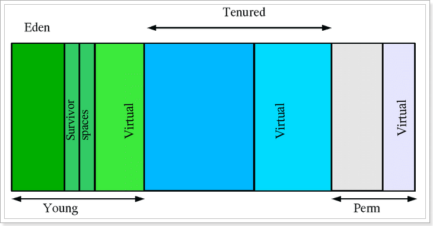

- Young 年轻区

  Young区被划分为三个部分，Eden区和两个大小严格相同的Survior区，其中Survivor区间中，某一时刻只有其中一个是被使用的，另外一个留做垃圾收集时复制对象用，在Eden区间变满的时候，GC就会将存活的对象移到空闲的Survivor区间中，根据JVM的策略，在经过几次垃圾收集后，仍然存活于Survivor的对象将被移动到Tenured区间

- Tenured年老区

  Thured区主要保存生命周期长的对象，一般是一些老的对象，当一些对象在Young复制转移一定的次数以后，对象就会被转移到Tenured区，一般如果系统中用了application级别的缓存，缓存中的对象往往会被转移到这一区间

- Perm永久区

  Perm主要保存class，method，filed对象，这部分的空间一般不会溢出，除非一次性加载了很多类，不过在涉及到热部署的应用服务器的时候，有时候会遇到`java.lang.OutOfMemoryError : PermGen space`的错误，造成这个错误的很大原因就有可能是每次都重新部署，但是重新部署以后，类的class没有被卸载掉，这样就造成了大量的class对象保存在了perm中，这种情况下，一般重新启动应用服务器可以解决问题

- Virtual区

  最大内存和初始内存的差值，就是Virtual区

## 2.2 JDK1.8的堆内存模型

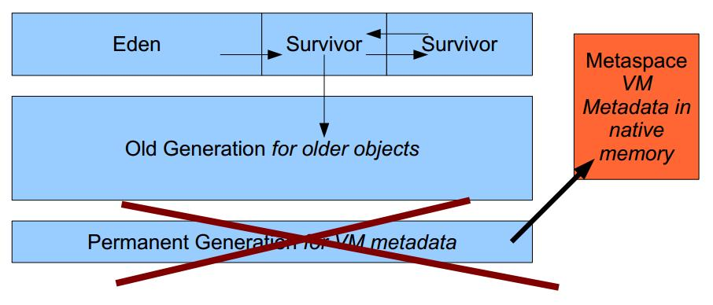

由上图可以看出 ，jdk1.8的内存模型是由两部分组成，年轻代+年老代

年轻代：Eden + 2*Survivor

年老代：OldGen

在jdk1.8中变化最大的Perm区，用Metaspace（元数据空间）进行了替换。需要特别说明的是：Metaspace所占用的内存空间不是在虚拟机内部，而是在本地内存中，这也是与jdk1.7的永久代最大的区别所在

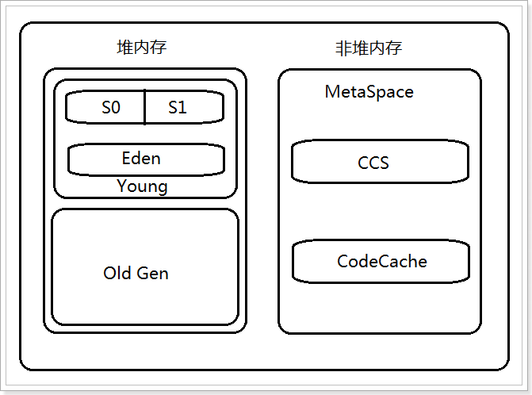

## 2.3 为什么要废弃1.7中的永久区

官网给出了解释：http://openjdk.java.net/jeps/122

```
This is part of the JRockit and Hotspot convergence effort. JRockit customers do not need to configure the permanent generation (since JRockit does not have a permanent generation) and are accustomed to not configuring the permanent generation.

移除永久代是为融合HotSpot JVM与 JRockit VM而做出的努力，因为JRockit没有永久代，不需要配置永久代。
```

现实使用中，由于永久代内存经常不够用或发生内存泄漏，爆出异常`java.lang.OutOfMemoryError: PermGen。`

基于此，将永久区废弃，而改用元空间，改为了使用本地内存空间

## 2.4 通过jstat命令进行查看堆内存使用情况

jstat命令可以查看堆内存各部分的使用量，以及加载类的数量。命令的格式如下：

```
jstat \[-命令选项] \[vmid] \[间隔时间/毫秒] \[查询次数]
```

### 2.4.1 查看Class加载统计

```
[root@node01 ~]# jps
7080 Jps
6219 Bootstrap

[root@node01 ~]# jstat -class 6219
Loaded  Bytes  Unloaded  Bytes     Time   
  3273  7122.3        0     0.0       3.98
```

说明：

- Loaded：加载class的数量
- Bytes：所占用空间大小
- Unloaded：未加载数量
- Bytes：未加载占用空间
- Time：时间

### 2.4.2 查看编译统计

```
[root@node01 ~]# jstat -compiler 6219
Compiled Failed Invalid   Time   FailedType FailedMethod
    2376      1       0     8.04          1 org/apache/tomcat/util/IntrospectionUtils setProperty
```

说明：

- Compiled：编译数量。
- Failed：失败数量
- Invalid：不可用数量
- Time：时间
- FailedType：失败类型
- FailedMethod：失败的方法

### 2.4.3 垃圾回收统计

```
[root@node01 ~]# jstat -gc 6219
 S0C    S1C    S0U    S1U      EC       EU        OC         OU       MC     MU    CCSC   CCSU   YGC     YGCT    FGC    FGCT     GCT   
9216.0 8704.0  0.0   6127.3 62976.0   3560.4   33792.0    20434.9   23808.0 23196.1 2560.0 2361.6      7    1.078   1      0.244    1.323

#也可以指定打印的间隔和次数，每1秒中打印一次，共打印5次
[root@node01 ~]# jstat -gc 6219 1000 5
 S0C    S1C    S0U    S1U      EC       EU        OC         OU       MC     MU    CCSC   CCSU   YGC     YGCT    FGC    FGCT     GCT   
9216.0 8704.0  0.0   6127.3 62976.0   3917.3   33792.0    20434.9   23808.0 23196.1 2560.0 2361.6      7    1.078   1      0.244    1.323
9216.0 8704.0  0.0   6127.3 62976.0   3917.3   33792.0    20434.9   23808.0 23196.1 2560.0 2361.6      7    1.078   1      0.244    1.323
9216.0 8704.0  0.0   6127.3 62976.0   3917.3   33792.0    20434.9   23808.0 23196.1 2560.0 2361.6      7    1.078   1      0.244    1.323
9216.0 8704.0  0.0   6127.3 62976.0   3917.3   33792.0    20434.9   23808.0 23196.1 2560.0 2361.6      7    1.078   1      0.244    1.323
9216.0 8704.0  0.0   6127.3 62976.0   3917.3   33792.0    20434.9   23808.0 23196.1 2560.0 2361.6      7    1.078   1      0.244    1.323
```

说明：

- S0C：第一个Survivor区的大小（KB）
- S1C：第二个Survivor区的大小（KB）
- S0U：第一个Survivor区的使用大小（KB）
- S1U：第二个Survivor区的使用大小（KB）
- EC：Eden区的大小（KB）
- EU：Eden区的使用大小（KB）
- OC：Old区大小（KB）
- OU：Old使用大小（KB）
- MC：方法区大小（KB）
- MU：方法区使用大小（KB）
- CCSC：压缩类空间大小（KB）
- CCSU：压缩类空间使用大小（KB）
- YGC：年轻代垃圾回收次数
- YGCT：年轻代垃圾回收消耗时间
- FGC：老年代垃圾回收次数
- FGCT：老年代垃圾回收消耗时间
- GCT：垃圾回收消耗总时间

# 3. jmap的使用以及内存溢出分析

前面通过jstat可以对jvm堆的内存进行统计分析，而jmap可以获取到更加详细的内容，如：内存使用情况的汇总、对内存溢出的定位与分析。

## 3.1 查看内存使用情况

```shell
[root@node01 ~]# jmap -heap 6219
Attaching to process ID 6219, please wait...
Debugger attached successfully.
Server compiler detected.
JVM version is 25.141-b15

using thread-local object allocation.
Parallel GC with 2 thread(s)

Heap Configuration: #堆内存配置信息
   MinHeapFreeRatio         = 0
   MaxHeapFreeRatio         = 100
   MaxHeapSize              = 488636416 (466.0MB)
   NewSize                  = 10485760 (10.0MB)
   MaxNewSize               = 162529280 (155.0MB)
   OldSize                  = 20971520 (20.0MB)
   NewRatio                 = 2
   SurvivorRatio            = 8
   MetaspaceSize            = 21807104 (20.796875MB)
   CompressedClassSpaceSize = 1073741824 (1024.0MB)
   MaxMetaspaceSize         = 17592186044415 MB
   G1HeapRegionSize         = 0 (0.0MB)

Heap Usage: # 堆内存的使用情况
PS Young Generation #年轻代
Eden Space:
   capacity = 123731968 (118.0MB)
   used     = 1384736 (1.320587158203125MB)
   free     = 122347232 (116.67941284179688MB)
   1.1191416594941737% used
From Space:
   capacity = 9437184 (9.0MB)
   used     = 0 (0.0MB)
   free     = 9437184 (9.0MB)
   0.0% used
To Space:
   capacity = 9437184 (9.0MB)
   used     = 0 (0.0MB)
   free     = 9437184 (9.0MB)
   0.0% used
PS Old Generation #年老代
   capacity = 28311552 (27.0MB)
   used     = 13698672 (13.064071655273438MB)
   free     = 14612880 (13.935928344726562MB)
   48.38545057508681% used

13648 interned Strings occupying 1866368 bytes.
```

## 3.2 查看内存中对象数量及大小

```shell
#查看所有对象，包括活跃以及非活跃的
jmap -histo <pid> | more

#查看活跃对象
jmap -histo:live <pid> | more

[root@node01 ~]# jmap -histo:live 6219 | more

 num     #instances         #bytes  class name
----------------------------------------------
   1:         37437        7914608  [C
   2:         34916         837984  java.lang.String
   3:           884         654848  [B
   4:         17188         550016  java.util.HashMap$Node
   5:          3674         424968  java.lang.Class
   6:          6322         395512  [Ljava.lang.Object;
   7:          3738         328944  java.lang.reflect.Method
   8:          1028         208048  [Ljava.util.HashMap$Node;
   9:          2247         144264  [I
  10:          4305         137760  java.util.concurrent.ConcurrentHashMap$Node
  11:          1270         109080  [Ljava.lang.String;
  12:            64          84128  [Ljava.util.concurrent.ConcurrentHashMap$Node;
  13:          1714          82272  java.util.HashMap
  14:          3285          70072  [Ljava.lang.Class;
  15:          2888          69312  java.util.ArrayList
  16:          3983          63728  java.lang.Object
  17:          1271          61008  org.apache.tomcat.util.digester.CallMethodRule
  18:          1518          60720  java.util.LinkedHashMap$Entry
  19:          1671          53472  com.sun.org.apache.xerces.internal.xni.QName
  20:            88          50880  [Ljava.util.WeakHashMap$Entry;
  21:           618          49440  java.lang.reflect.Constructor
  22:          1545          49440  java.util.Hashtable$Entry
  23:          1027          41080  java.util.TreeMap$Entry
  24:           846          40608  org.apache.tomcat.util.modeler.AttributeInfo
  25:           142          38032  [S
  26:           946          37840  java.lang.ref.SoftReference
  27:           226          36816  [[C
  。。。。。。。。。。。。。。。。。。。。。。。。。。。。。。。
  
#对象说明
B  byte
C  char
D  double
F  float
I  int
J  long
Z  boolean
[  数组，如[I表示int[]
[L+类名 其他对象
```

## 3.3 将内存使用情况dump到文件中

有些时候我们需要将jvm当前内存中的情况dump到文件中，然后对它进行分析，jmap也是支持dump到文件中的。

```shell
#用法：
jmap -dump:format=b,file=dumpFileName <pid>

#示例
jmap -dump:format=b,file=/tmp/dump.dat 6219
```

## 3.4 通过jhat对dump文件进行分析

上面我们将jvm的内存dump到文件中，这个文件是一个二进制的文件，不方便查看，这时我们可以借助于jhat工具进行查看。

```shell
#用法：
jhat -port <port> <file>

#示例：
[root@node01 tmp]# jhat -port 9999 /tmp/dump.dat 
Reading from /tmp/dump.dat...
Dump file created Mon Sep 10 01:04:21 CST 2018
Snapshot read, resolving...
Resolving 204094 objects...
Chasing references, expect 40 dots........................................
Eliminating duplicate references........................................
Snapshot resolved.
Started HTTP server on port 9999
Server is ready.
```

打开浏览器进行访问：http://192.168.40.133:9999/

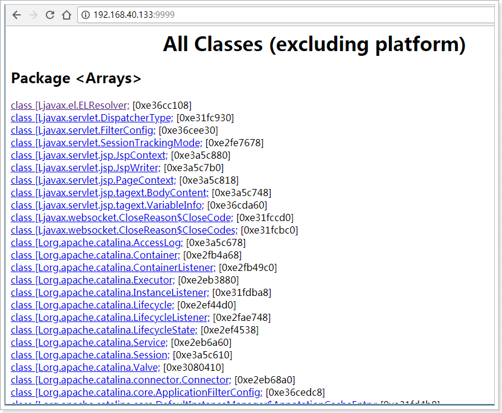

在最后面有OQL查询功能。

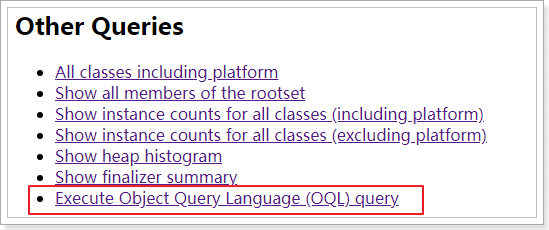

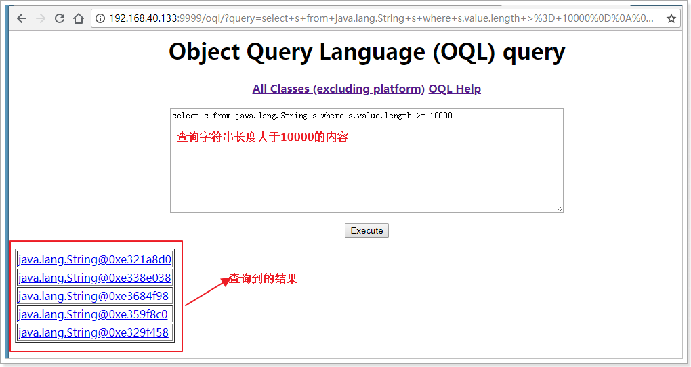

## 3.5 通过MAT工具的对dump文件进行分析

### 3.5.1 MAT工具介绍

MAT(Memory Analyzer Tool)，一个基于Eclipse的内存分析工具，是一个快速、功能丰富的JAVA heap分析工具，它可以帮助我们查找内存泄漏和减少内存消耗。使用内存分析工具从众多的对象中进行分析，快速的计算出在内存中对象的占用大小，看看是谁阻止了垃圾收集器的回收工作，并可以通过报表直观的查看到可能造成这种结果的对象。

官网地址：https://www.eclipse.org/mat/


### 3.5.2 下载安装

下载地址：https://www.eclipse.org/mat/downloads.php

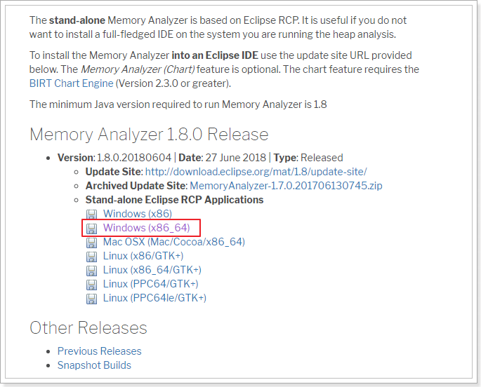

将下载得到的MemoryAnalyzer-1.8.0.20180604-win32.win32.x86_64.zip进行解压：

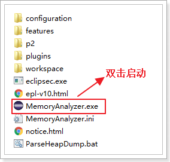

### 3.5.3 使用

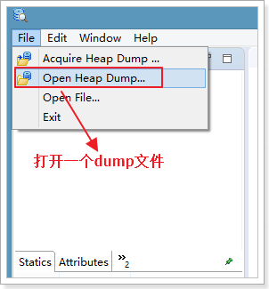

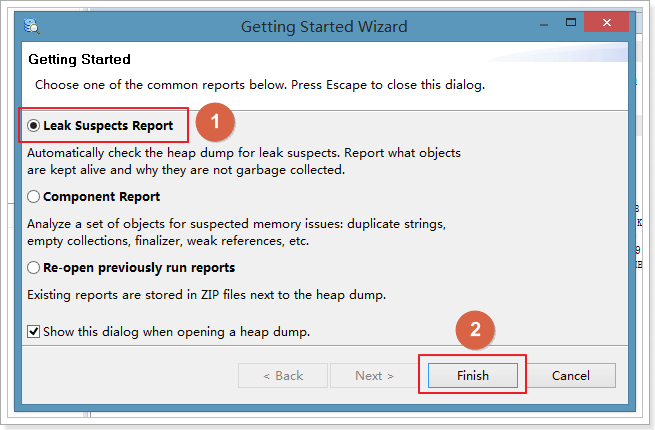

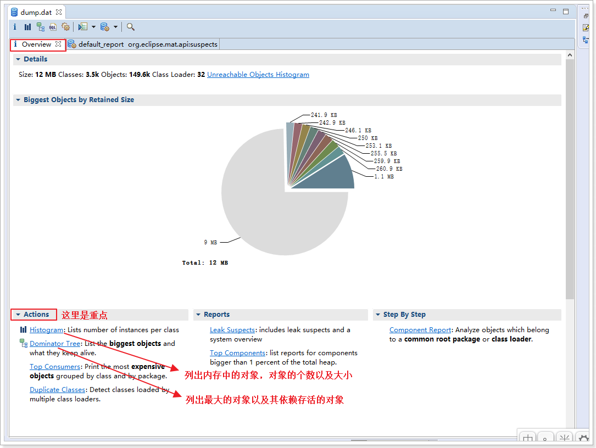

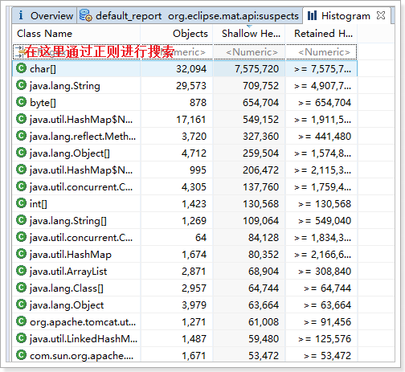


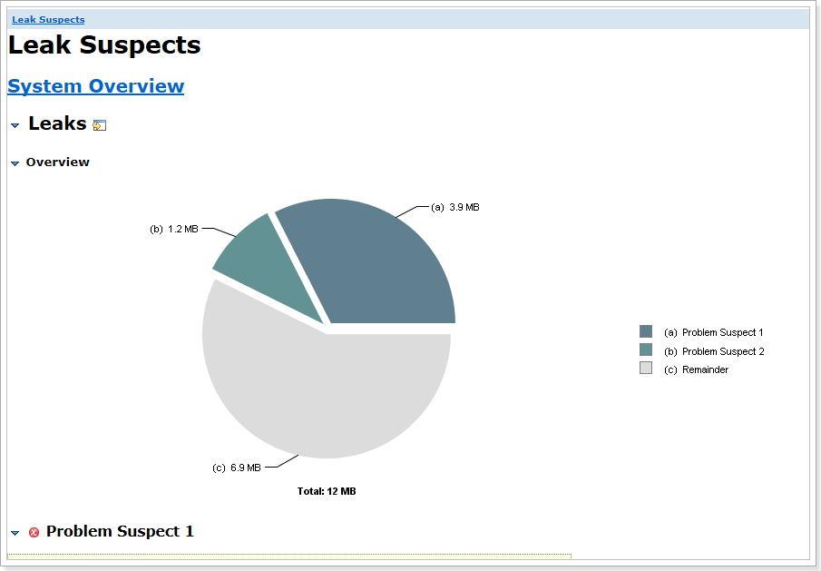

# 4.实战：内存溢出的定位与分析

内存溢出在实际的生产环境中经常会遇到，比如，不断的将数据写入到一个集合中，出现了死循环，读取超大的文件等等，都可能会造成内存溢出。

如果出现了内存溢出，首先我们需要定位到发生内存溢出的环节，并且进行分析，是正常还是非正常情况，如果是正常的需求，就应该考虑加大内存的设置，如果是非正常需求，那么就要对代码进行修改，修复这个bug。

首先，我们得先学会如何定位问题，然后再进行分析。如何定位问题呢，我们需要借助于jmap与MAT工具进行定位分析。

接下来，我们模拟内存溢出的场景。

## 4.1 模拟内存溢出

编写代码，向List集合中添加100万个字符串，每个字符串由1000个UUID组成。如果程序能够正常执行，最后打印ok。

```java
package cn.itcast.jvm;

import java.util.ArrayList;
import java.util.List;
import java.util.UUID;

public class TestJvmOutOfMemory {

    public static void main(String[] args) {
        List<Object> list = new ArrayList<>();
        for (int i = 0; i < 10000000; i++) {
            String str = "";
            for (int j = 0; j < 1000; j++) {
                str += UUID.randomUUID().toString();
            }
            list.add(str);
        }
        System.out.println("ok");
    }
}

```

为了演示效果，我们将设置执行的参数，这里使用的是Idea编辑器。

 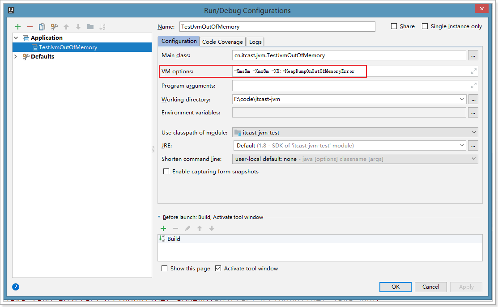

```shell
#参数如下：
-Xms8m -Xmx8m -XX:+HeapDumpOnOutOfMemoryError
```

## 4.2 运行测试

测试结果如下：

```shell
java.lang.OutOfMemoryError: Java heap space
Dumping heap to java_pid5348.hprof ...
Heap dump file created [8137186 bytes in 0.032 secs]
Exception in thread "main" java.lang.OutOfMemoryError: Java heap space
	at java.util.Arrays.copyOf(Arrays.java:3332)
	at java.lang.AbstractStringBuilder.ensureCapacityInternal(AbstractStringBuilder.java:124)
	at java.lang.AbstractStringBuilder.append(AbstractStringBuilder.java:448)
	at java.lang.StringBuilder.append(StringBuilder.java:136)
	at cn.itcast.jvm.TestJvmOutOfMemory.main(TestJvmOutOfMemory.java:14)

Process finished with exit code 1
```

可以看到，当发生内存溢出时，会dump文件到java_pid5348.hprof。 

 

## 4.3 导入MAT工具中进行分析

 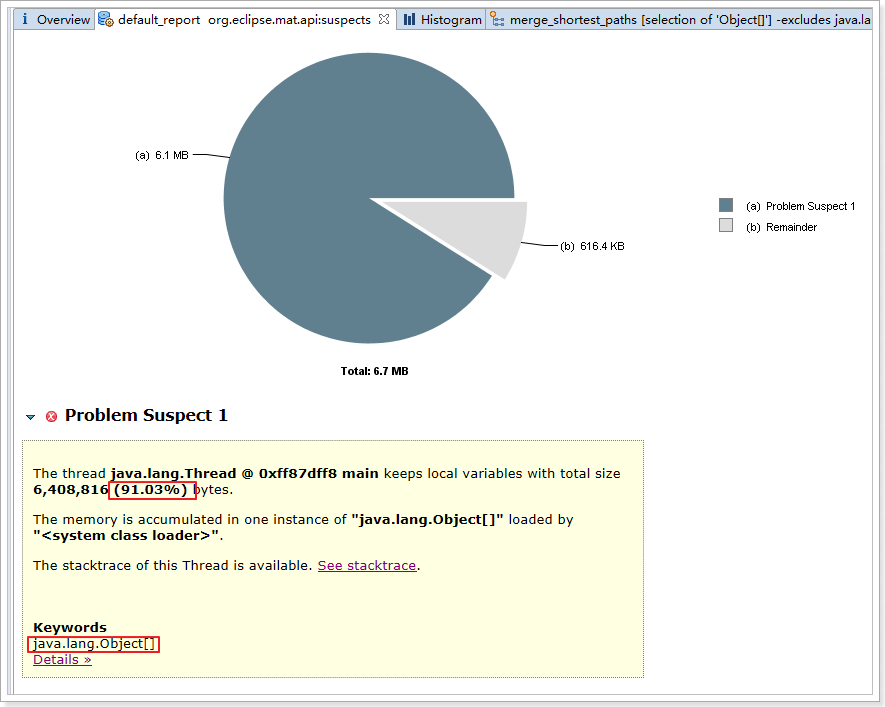

可以看到，有91.03%的内存由Object[]数组占有，所以比较可疑。

分析：这个可疑是正确的，因为已经有超过90%的内存都被它占有，这是非常有可能出现内存溢出的。

查看详情：

 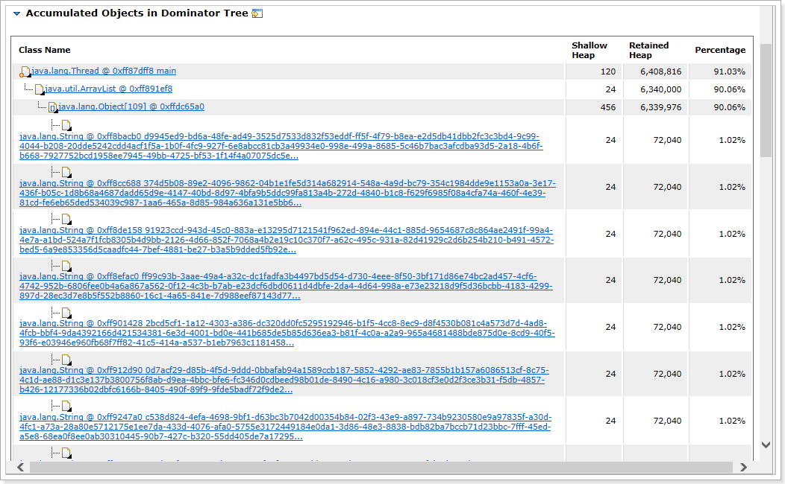

可以看到集合中存储了大量的uuid字符串。

# 5. jstack的使用

有些时候我们需要查看下jvm中的线程执行情况，比如，发现服务器的CPU的负载突然增高了、出现了死锁、死循环等，我们该如何分析呢？

由于程序是正常运行的，没有任何的输出，从日志方面也看不出什么问题，所以就需要看下jvm的内部线程的执行情况，然后再进行分析查找出原因。

这个时候，就需要借助于jstack命令了，jstack的作用是将正在运行的jvm的线程情况进行快照，并且打印出来：

```shell
#用法：jstack <pid>

[root@node01 bin]# jstack 2203
Full thread dump Java HotSpot(TM) 64-Bit Server VM (25.141-b15 mixed mode):

"Attach Listener" #24 daemon prio=9 os_prio=0 tid=0x00007fabb4001000 nid=0x906 waiting on condition [0x0000000000000000]
   java.lang.Thread.State: RUNNABLE

"http-bio-8080-exec-5" #23 daemon prio=5 os_prio=0 tid=0x00007fabb057c000 nid=0x8e1 waiting on condition [0x00007fabd05b8000]
   java.lang.Thread.State: WAITING (parking)
	at sun.misc.Unsafe.park(Native Method)
	- parking to wait for  <0x00000000f8508360> (a java.util.concurrent.locks.AbstractQueuedSynchronizer$ConditionObject)
	at java.util.concurrent.locks.LockSupport.park(LockSupport.java:175)
	at java.util.concurrent.locks.AbstractQueuedSynchronizer$ConditionObject.await(AbstractQueuedSynchronizer.java:2039)
	at java.util.concurrent.LinkedBlockingQueue.take(LinkedBlockingQueue.java:442)
	at org.apache.tomcat.util.threads.TaskQueue.take(TaskQueue.java:104)
	at org.apache.tomcat.util.threads.TaskQueue.take(TaskQueue.java:32)
	at java.util.concurrent.ThreadPoolExecutor.getTask(ThreadPoolExecutor.java:1074)
	at java.util.concurrent.ThreadPoolExecutor.runWorker(ThreadPoolExecutor.java:1134)
	at java.util.concurrent.ThreadPoolExecutor$Worker.run(ThreadPoolExecutor.java:624)
	at org.apache.tomcat.util.threads.TaskThread$WrappingRunnable.run(TaskThread.java:61)
	at java.lang.Thread.run(Thread.java:748)

"http-bio-8080-exec-4" #22 daemon prio=5 os_prio=0 tid=0x00007fab9c113800 nid=0x8e0 waiting on condition [0x00007fabd06b9000]
   java.lang.Thread.State: WAITING (parking)
	at sun.misc.Unsafe.park(Native Method)
	- parking to wait for  <0x00000000f8508360> (a java.util.concurrent.locks.AbstractQueuedSynchronizer$ConditionObject)
	at java.util.concurrent.locks.LockSupport.park(LockSupport.java:175)
	at java.util.concurrent.locks.AbstractQueuedSynchronizer$ConditionObject.await(AbstractQueuedSynchronizer.java:2039)
	at java.util.concurrent.LinkedBlockingQueue.take(LinkedBlockingQueue.java:442)
	at org.apache.tomcat.util.threads.TaskQueue.take(TaskQueue.java:104)
	at org.apache.tomcat.util.threads.TaskQueue.take(TaskQueue.java:32)
	at java.util.concurrent.ThreadPoolExecutor.getTask(ThreadPoolExecutor.java:1074)
	at java.util.concurrent.ThreadPoolExecutor.runWorker(ThreadPoolExecutor.java:1134)
	at java.util.concurrent.ThreadPoolExecutor$Worker.run(ThreadPoolExecutor.java:624)
	at org.apache.tomcat.util.threads.TaskThread$WrappingRunnable.run(TaskThread.java:61)
	at java.lang.Thread.run(Thread.java:748)

"http-bio-8080-exec-3" #21 daemon prio=5 os_prio=0 tid=0x0000000001aeb800 nid=0x8df waiting on condition [0x00007fabd09ba000]
   java.lang.Thread.State: WAITING (parking)
	at sun.misc.Unsafe.park(Native Method)
	- parking to wait for  <0x00000000f8508360> (a java.util.concurrent.locks.AbstractQueuedSynchronizer$ConditionObject)
	at java.util.concurrent.locks.LockSupport.park(LockSupport.java:175)
	at java.util.concurrent.locks.AbstractQueuedSynchronizer$ConditionObject.await(AbstractQueuedSynchronizer.java:2039)
	at java.util.concurrent.LinkedBlockingQueue.take(LinkedBlockingQueue.java:442)
	at org.apache.tomcat.util.threads.TaskQueue.take(TaskQueue.java:104)
	at org.apache.tomcat.util.threads.TaskQueue.take(TaskQueue.java:32)
	at java.util.concurrent.ThreadPoolExecutor.getTask(ThreadPoolExecutor.java:1074)
	at java.util.concurrent.ThreadPoolExecutor.runWorker(ThreadPoolExecutor.java:1134)
	at java.util.concurrent.ThreadPoolExecutor$Worker.run(ThreadPoolExecutor.java:624)
	at org.apache.tomcat.util.threads.TaskThread$WrappingRunnable.run(TaskThread.java:61)
	at java.lang.Thread.run(Thread.java:748)

"http-bio-8080-exec-2" #20 daemon prio=5 os_prio=0 tid=0x0000000001aea000 nid=0x8de waiting on condition [0x00007fabd0abb000]
   java.lang.Thread.State: WAITING (parking)
	at sun.misc.Unsafe.park(Native Method)
	- parking to wait for  <0x00000000f8508360> (a java.util.concurrent.locks.AbstractQueuedSynchronizer$ConditionObject)
	at java.util.concurrent.locks.LockSupport.park(LockSupport.java:175)
	at java.util.concurrent.locks.AbstractQueuedSynchronizer$ConditionObject.await(AbstractQueuedSynchronizer.java:2039)
	at java.util.concurrent.LinkedBlockingQueue.take(LinkedBlockingQueue.java:442)
	at org.apache.tomcat.util.threads.TaskQueue.take(TaskQueue.java:104)
	at org.apache.tomcat.util.threads.TaskQueue.take(TaskQueue.java:32)
	at java.util.concurrent.ThreadPoolExecutor.getTask(ThreadPoolExecutor.java:1074)
	at java.util.concurrent.ThreadPoolExecutor.runWorker(ThreadPoolExecutor.java:1134)
	at java.util.concurrent.ThreadPoolExecutor$Worker.run(ThreadPoolExecutor.java:624)
	at org.apache.tomcat.util.threads.TaskThread$WrappingRunnable.run(TaskThread.java:61)
	at java.lang.Thread.run(Thread.java:748)

"http-bio-8080-exec-1" #19 daemon prio=5 os_prio=0 tid=0x0000000001ae8800 nid=0x8dd waiting on condition [0x00007fabd0bbc000]
   java.lang.Thread.State: WAITING (parking)
	at sun.misc.Unsafe.park(Native Method)
	- parking to wait for  <0x00000000f8508360> (a java.util.concurrent.locks.AbstractQueuedSynchronizer$ConditionObject)
	at java.util.concurrent.locks.LockSupport.park(LockSupport.java:175)
	at java.util.concurrent.locks.AbstractQueuedSynchronizer$ConditionObject.await(AbstractQueuedSynchronizer.java:2039)
	at java.util.concurrent.LinkedBlockingQueue.take(LinkedBlockingQueue.java:442)
	at org.apache.tomcat.util.threads.TaskQueue.take(TaskQueue.java:104)
	at org.apache.tomcat.util.threads.TaskQueue.take(TaskQueue.java:32)
	at java.util.concurrent.ThreadPoolExecutor.getTask(ThreadPoolExecutor.java:1074)
	at java.util.concurrent.ThreadPoolExecutor.runWorker(ThreadPoolExecutor.java:1134)
	at java.util.concurrent.ThreadPoolExecutor$Worker.run(ThreadPoolExecutor.java:624)
	at org.apache.tomcat.util.threads.TaskThread$WrappingRunnable.run(TaskThread.java:61)
	at java.lang.Thread.run(Thread.java:748)

"ajp-bio-8009-AsyncTimeout" #17 daemon prio=5 os_prio=0 tid=0x00007fabe8128000 nid=0x8d0 waiting on condition [0x00007fabd0ece000]
   java.lang.Thread.State: TIMED_WAITING (sleeping)
	at java.lang.Thread.sleep(Native Method)
	at org.apache.tomcat.util.net.JIoEndpoint$AsyncTimeout.run(JIoEndpoint.java:152)
	at java.lang.Thread.run(Thread.java:748)

"ajp-bio-8009-Acceptor-0" #16 daemon prio=5 os_prio=0 tid=0x00007fabe82d4000 nid=0x8cf runnable [0x00007fabd0fcf000]
   java.lang.Thread.State: RUNNABLE
	at java.net.PlainSocketImpl.socketAccept(Native Method)
	at java.net.AbstractPlainSocketImpl.accept(AbstractPlainSocketImpl.java:409)
	at java.net.ServerSocket.implAccept(ServerSocket.java:545)
	at java.net.ServerSocket.accept(ServerSocket.java:513)
	at org.apache.tomcat.util.net.DefaultServerSocketFactory.acceptSocket(DefaultServerSocketFactory.java:60)
	at org.apache.tomcat.util.net.JIoEndpoint$Acceptor.run(JIoEndpoint.java:220)
	at java.lang.Thread.run(Thread.java:748)

"http-bio-8080-AsyncTimeout" #15 daemon prio=5 os_prio=0 tid=0x00007fabe82d1800 nid=0x8ce waiting on condition [0x00007fabd10d0000]
   java.lang.Thread.State: TIMED_WAITING (sleeping)
	at java.lang.Thread.sleep(Native Method)
	at org.apache.tomcat.util.net.JIoEndpoint$AsyncTimeout.run(JIoEndpoint.java:152)
	at java.lang.Thread.run(Thread.java:748)

"http-bio-8080-Acceptor-0" #14 daemon prio=5 os_prio=0 tid=0x00007fabe82d0000 nid=0x8cd runnable [0x00007fabd11d1000]
   java.lang.Thread.State: RUNNABLE
	at java.net.PlainSocketImpl.socketAccept(Native Method)
	at java.net.AbstractPlainSocketImpl.accept(AbstractPlainSocketImpl.java:409)
	at java.net.ServerSocket.implAccept(ServerSocket.java:545)
	at java.net.ServerSocket.accept(ServerSocket.java:513)
	at org.apache.tomcat.util.net.DefaultServerSocketFactory.acceptSocket(DefaultServerSocketFactory.java:60)
	at org.apache.tomcat.util.net.JIoEndpoint$Acceptor.run(JIoEndpoint.java:220)
	at java.lang.Thread.run(Thread.java:748)

"ContainerBackgroundProcessor[StandardEngine[Catalina]]" #13 daemon prio=5 os_prio=0 tid=0x00007fabe82ce000 nid=0x8cc waiting on condition [0x00007fabd12d2000]
   java.lang.Thread.State: TIMED_WAITING (sleeping)
	at java.lang.Thread.sleep(Native Method)
	at org.apache.catalina.core.ContainerBase$ContainerBackgroundProcessor.run(ContainerBase.java:1513)
	at java.lang.Thread.run(Thread.java:748)

"GC Daemon" #10 daemon prio=2 os_prio=0 tid=0x00007fabe83b4000 nid=0x8b3 in Object.wait() [0x00007fabd1c2f000]
   java.lang.Thread.State: TIMED_WAITING (on object monitor)
	at java.lang.Object.wait(Native Method)
	- waiting on <0x00000000e315c2d0> (a sun.misc.GC$LatencyLock)
	at sun.misc.GC$Daemon.run(GC.java:117)
	- locked <0x00000000e315c2d0> (a sun.misc.GC$LatencyLock)

"Service Thread" #7 daemon prio=9 os_prio=0 tid=0x00007fabe80c3800 nid=0x8a5 runnable [0x0000000000000000]
   java.lang.Thread.State: RUNNABLE

"C1 CompilerThread1" #6 daemon prio=9 os_prio=0 tid=0x00007fabe80b6800 nid=0x8a4 waiting on condition [0x0000000000000000]
   java.lang.Thread.State: RUNNABLE

"C2 CompilerThread0" #5 daemon prio=9 os_prio=0 tid=0x00007fabe80b3800 nid=0x8a3 waiting on condition [0x0000000000000000]
   java.lang.Thread.State: RUNNABLE

"Signal Dispatcher" #4 daemon prio=9 os_prio=0 tid=0x00007fabe80b2000 nid=0x8a2 runnable [0x0000000000000000]
   java.lang.Thread.State: RUNNABLE

"Finalizer" #3 daemon prio=8 os_prio=0 tid=0x00007fabe807f000 nid=0x8a1 in Object.wait() [0x00007fabd2a67000]
   java.lang.Thread.State: WAITING (on object monitor)
	at java.lang.Object.wait(Native Method)
	- waiting on <0x00000000e3162918> (a java.lang.ref.ReferenceQueue$Lock)
	at java.lang.ref.ReferenceQueue.remove(ReferenceQueue.java:143)
	- locked <0x00000000e3162918> (a java.lang.ref.ReferenceQueue$Lock)
	at java.lang.ref.ReferenceQueue.remove(ReferenceQueue.java:164)
	at java.lang.ref.Finalizer$FinalizerThread.run(Finalizer.java:209)

"Reference Handler" #2 daemon prio=10 os_prio=0 tid=0x00007fabe807a800 nid=0x8a0 in Object.wait() [0x00007fabd2b68000]
   java.lang.Thread.State: WAITING (on object monitor)
	at java.lang.Object.wait(Native Method)
	- waiting on <0x00000000e3162958> (a java.lang.ref.Reference$Lock)
	at java.lang.Object.wait(Object.java:502)
	at java.lang.ref.Reference.tryHandlePending(Reference.java:191)
	- locked <0x00000000e3162958> (a java.lang.ref.Reference$Lock)
	at java.lang.ref.Reference$ReferenceHandler.run(Reference.java:153)

"main" #1 prio=5 os_prio=0 tid=0x00007fabe8009000 nid=0x89c runnable [0x00007fabed210000]
   java.lang.Thread.State: RUNNABLE
	at java.net.PlainSocketImpl.socketAccept(Native Method)
	at java.net.AbstractPlainSocketImpl.accept(AbstractPlainSocketImpl.java:409)
	at java.net.ServerSocket.implAccept(ServerSocket.java:545)
	at java.net.ServerSocket.accept(ServerSocket.java:513)
	at org.apache.catalina.core.StandardServer.await(StandardServer.java:453)
	at org.apache.catalina.startup.Catalina.await(Catalina.java:777)
	at org.apache.catalina.startup.Catalina.start(Catalina.java:723)
	at sun.reflect.NativeMethodAccessorImpl.invoke0(Native Method)
	at sun.reflect.NativeMethodAccessorImpl.invoke(NativeMethodAccessorImpl.java:62)
	at sun.reflect.DelegatingMethodAccessorImpl.invoke(DelegatingMethodAccessorImpl.java:43)
	at java.lang.reflect.Method.invoke(Method.java:498)
	at org.apache.catalina.startup.Bootstrap.start(Bootstrap.java:321)
	at org.apache.catalina.startup.Bootstrap.main(Bootstrap.java:455)

"VM Thread" os_prio=0 tid=0x00007fabe8073000 nid=0x89f runnable 

"GC task thread#0 (ParallelGC)" os_prio=0 tid=0x00007fabe801e000 nid=0x89d runnable 

"GC task thread#1 (ParallelGC)" os_prio=0 tid=0x00007fabe8020000 nid=0x89e runnable 

"VM Periodic Task Thread" os_prio=0 tid=0x00007fabe80d6800 nid=0x8a6 waiting on condition 

JNI global references: 43
```

## 5.1 线程的状态

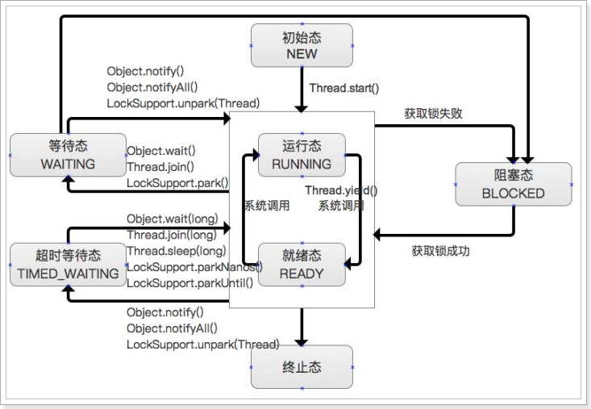

在Java中线程的状态一共被分成6种：

- 初始态（NEW）
  - 创建一个Thread对象，但还未调用start()启动线程时，线程处于初始态。

- 运行态（RUNNABLE），在Java中，运行态包括 就绪态 和 运行态。

  - 就绪态
    - 该状态下的线程已经获得执行所需的所有资源，只要CPU分配执行权就能运行。
    - 所有就绪态的线程存放在就绪队列中。

  - 运行态
    - 获得CPU执行权，正在执行的线程。
    - 由于一个CPU同一时刻只能执行一条线程，因此每个CPU每个时刻只有一条运行态的线程。

- 阻塞态（BLOCKED）
  - 当一条正在执行的线程请求某一资源失败时，就会进入阻塞态。
  - 而在Java中，阻塞态专指请求锁失败时进入的状态。
  - 由一个阻塞队列存放所有阻塞态的线程。
  - 处于阻塞态的线程会不断请求资源，一旦请求成功，就会进入就绪队列，等待执行。

- 等待态（WAITING）
  - 当前线程中调用wait、join、park函数时，当前线程就会进入等待态。
  - 也有一个等待队列存放所有等待态的线程。
  - 线程处于等待态表示它需要等待其他线程的指示才能继续运行。
  - 进入等待态的线程会释放CPU执行权，并释放资源（如：锁）
- 超时等待态（TIMED_WAITING）
  - 当运行中的线程调用sleep(time)、wait、join、parkNanos、parkUntil时，就会进入该状态；
  - 它和等待态一样，并不是因为请求不到资源，而是主动进入，并且进入后需要其他线程唤醒；
  - 进入该状态后释放CPU执行权 和 占有的资源。
  - 与等待态的区别：到了超时时间后自动进入阻塞队列，开始竞争锁。
- 终止态（TERMINATED）
  - 线程执行结束后的状态。

## 5.2 实战：死锁问题

如果在生产环境发生了死锁，我们将看到的是部署的程序没有任何反应了，这个时候我们可以借助jstack进行分析，下面我们实战下查找死锁的原因。

### 5.2.1、构造死锁

编写代码，启动2个线程，Thread1拿到了obj1锁，准备去拿obj2锁时，obj2已经被Thread2锁定，所以发送了死锁。

```java
public class TestDeadLock {

    private static Object obj1 = new Object();

    private static Object obj2 = new Object();


    public static void main(String[] args) {
        new Thread(new Thread1()).start();
        new Thread(new Thread2()).start();
    }

    private static class Thread1 implements Runnable{
        @Override
        public void run() {
            synchronized (obj1){
                System.out.println("Thread1 拿到了 obj1 的锁！");

                try {
                    // 停顿2秒的意义在于，让Thread2线程拿到obj2的锁
                    Thread.sleep(2000);
                } catch (InterruptedException e) {
                    e.printStackTrace();
                }

                synchronized (obj2){
                    System.out.println("Thread1 拿到了 obj2 的锁！");
                }
            }
        }
    }

    private static class Thread2 implements Runnable{
        @Override
        public void run() {
            synchronized (obj2){
                System.out.println("Thread2 拿到了 obj2 的锁！");

                try {
                    // 停顿2秒的意义在于，让Thread1线程拿到obj1的锁
                    Thread.sleep(2000);
                } catch (InterruptedException e) {
                    e.printStackTrace();
                }

                synchronized (obj1){
                    System.out.println("Thread2 拿到了 obj1 的锁！");
                }
            }
        }
    }

}

```

### 5.2.2 在linux上运行

```shell
[root@node01 test]# javac TestDeadLock.java 
[root@node01 test]# ll
总用量 28
-rw-r--r--. 1 root root  184 9月  11 10:39 TestDeadLock$1.class
-rw-r--r--. 1 root root  843 9月  11 10:39 TestDeadLock.class
-rw-r--r--. 1 root root 1567 9月  11 10:39 TestDeadLock.java
-rw-r--r--. 1 root root 1078 9月  11 10:39 TestDeadLock$Thread1.class
-rw-r--r--. 1 root root 1078 9月  11 10:39 TestDeadLock$Thread2.class
-rw-r--r--. 1 root root  573 9月   9 10:21 TestJVM.class
-rw-r--r--. 1 root root  261 9月   9 10:21 TestJVM.java

[root@node01 test]# java TestDeadLock
Thread1 拿到了 obj1 的锁！
Thread2 拿到了 obj2 的锁！
#这里发生了死锁，程序一直将等待下去
```

### 5.2.3 使用jstack进行分析

```shell
[root@node01 ~]# jstack 3256
Full thread dump Java HotSpot(TM) 64-Bit Server VM (25.141-b15 mixed mode):

"Attach Listener" #11 daemon prio=9 os_prio=0 tid=0x00007f5bfc001000 nid=0xcff waiting on condition [0x0000000000000000]
   java.lang.Thread.State: RUNNABLE

"DestroyJavaVM" #10 prio=5 os_prio=0 tid=0x00007f5c2c008800 nid=0xcb9 waiting on condition [0x0000000000000000]
   java.lang.Thread.State: RUNNABLE

"Thread-1" #9 prio=5 os_prio=0 tid=0x00007f5c2c0e9000 nid=0xcc5 waiting for monitor entry [0x00007f5c1c7f6000]
   java.lang.Thread.State: BLOCKED (on object monitor)
	at TestDeadLock$Thread2.run(TestDeadLock.java:47)
	- waiting to lock <0x00000000f655dc40> (a java.lang.Object)
	- locked <0x00000000f655dc50> (a java.lang.Object)
	at java.lang.Thread.run(Thread.java:748)

"Thread-0" #8 prio=5 os_prio=0 tid=0x00007f5c2c0e7000 nid=0xcc4 waiting for monitor entry [0x00007f5c1c8f7000]
   java.lang.Thread.State: BLOCKED (on object monitor)
	at TestDeadLock$Thread1.run(TestDeadLock.java:27)
	- waiting to lock <0x00000000f655dc50> (a java.lang.Object)
	- locked <0x00000000f655dc40> (a java.lang.Object)
	at java.lang.Thread.run(Thread.java:748)

"Service Thread" #7 daemon prio=9 os_prio=0 tid=0x00007f5c2c0d3000 nid=0xcc2 runnable [0x0000000000000000]
   java.lang.Thread.State: RUNNABLE

"C1 CompilerThread1" #6 daemon prio=9 os_prio=0 tid=0x00007f5c2c0b6000 nid=0xcc1 waiting on condition [0x0000000000000000]
   java.lang.Thread.State: RUNNABLE

"C2 CompilerThread0" #5 daemon prio=9 os_prio=0 tid=0x00007f5c2c0b3000 nid=0xcc0 waiting on condition [0x0000000000000000]
   java.lang.Thread.State: RUNNABLE

"Signal Dispatcher" #4 daemon prio=9 os_prio=0 tid=0x00007f5c2c0b1800 nid=0xcbf runnable [0x0000000000000000]
   java.lang.Thread.State: RUNNABLE

"Finalizer" #3 daemon prio=8 os_prio=0 tid=0x00007f5c2c07e800 nid=0xcbe in Object.wait() [0x00007f5c1cdfc000]
   java.lang.Thread.State: WAITING (on object monitor)
	at java.lang.Object.wait(Native Method)
	- waiting on <0x00000000f6508ec8> (a java.lang.ref.ReferenceQueue$Lock)
	at java.lang.ref.ReferenceQueue.remove(ReferenceQueue.java:143)
	- locked <0x00000000f6508ec8> (a java.lang.ref.ReferenceQueue$Lock)
	at java.lang.ref.ReferenceQueue.remove(ReferenceQueue.java:164)
	at java.lang.ref.Finalizer$FinalizerThread.run(Finalizer.java:209)

"Reference Handler" #2 daemon prio=10 os_prio=0 tid=0x00007f5c2c07a000 nid=0xcbd in Object.wait() [0x00007f5c1cefd000]
   java.lang.Thread.State: WAITING (on object monitor)
	at java.lang.Object.wait(Native Method)
	- waiting on <0x00000000f6506b68> (a java.lang.ref.Reference$Lock)
	at java.lang.Object.wait(Object.java:502)
	at java.lang.ref.Reference.tryHandlePending(Reference.java:191)
	- locked <0x00000000f6506b68> (a java.lang.ref.Reference$Lock)
	at java.lang.ref.Reference$ReferenceHandler.run(Reference.java:153)

"VM Thread" os_prio=0 tid=0x00007f5c2c072800 nid=0xcbc runnable 

"GC task thread#0 (ParallelGC)" os_prio=0 tid=0x00007f5c2c01d800 nid=0xcba runnable 

"GC task thread#1 (ParallelGC)" os_prio=0 tid=0x00007f5c2c01f800 nid=0xcbb runnable 

"VM Periodic Task Thread" os_prio=0 tid=0x00007f5c2c0d6800 nid=0xcc3 waiting on condition 

JNI global references: 6


Found one Java-level deadlock:
=============================
"Thread-1":
  waiting to lock monitor 0x00007f5c080062c8 (object 0x00000000f655dc40, a java.lang.Object),
  which is held by "Thread-0"
"Thread-0":
  waiting to lock monitor 0x00007f5c08004e28 (object 0x00000000f655dc50, a java.lang.Object),
  which is held by "Thread-1"

Java stack information for the threads listed above:
===================================================
"Thread-1":
	at TestDeadLock$Thread2.run(TestDeadLock.java:47)
	- waiting to lock <0x00000000f655dc40> (a java.lang.Object)
	- locked <0x00000000f655dc50> (a java.lang.Object)
	at java.lang.Thread.run(Thread.java:748)
"Thread-0":
	at TestDeadLock$Thread1.run(TestDeadLock.java:27)
	- waiting to lock <0x00000000f655dc50> (a java.lang.Object)
	- locked <0x00000000f655dc40> (a java.lang.Object)
	at java.lang.Thread.run(Thread.java:748)

Found 1 deadlock.
```

在输出的信息中，已经看到，发现了1个死锁，关键看这个：

```shell
"Thread-1":
	at TestDeadLock$Thread2.run(TestDeadLock.java:47)
	- waiting to lock <0x00000000f655dc40> (a java.lang.Object)
	- locked <0x00000000f655dc50> (a java.lang.Object)
	at java.lang.Thread.run(Thread.java:748)
"Thread-0":
	at TestDeadLock$Thread1.run(TestDeadLock.java:27)
	- waiting to lock <0x00000000f655dc50> (a java.lang.Object)
	- locked <0x00000000f655dc40> (a java.lang.Object)
	at java.lang.Thread.run(Thread.java:748)
```

可以清晰的看到：

- Thread2获取了 <0x00000000f655dc50> 的锁，等待获取 <0x00000000f655dc40> 这个锁
- Thread1获取了 <0x00000000f655dc40> 的锁，等待获取 <0x00000000f655dc50> 这个锁
- 由此可见，发生了死锁。

# 6. VisualVM工具的使用

VisualVM，能够监控线程，内存情况，查看方法的CPU时间和内存中的对 象，已被GC的对象，反向查看分配的堆栈(如100个String对象分别由哪几个对象分配出来的)。

VisualVM使用简单，几乎0配置，功能还是比较丰富的，几乎囊括了其它JDK自带命令的所有功能。

- 内存信息
- 线程信息
- Dump堆（本地进程）
- Dump线程（本地进程）
- 打开堆Dump。堆Dump可以用jmap来生成。
- 打开线程Dump
- 生成应用快照（包含内存信息、线程信息等等）
- 性能分析。CPU分析（各个方法调用时间，检查哪些方法耗时多），内存分析（各类对象占用的内存，检查哪些类占用内存多）
- ……

## 6.1 启动

在jdk的安装目录的bin目录下，找到jvisualvm.exe，双击打开即可。

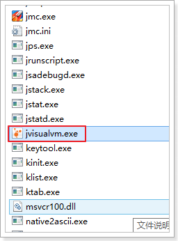

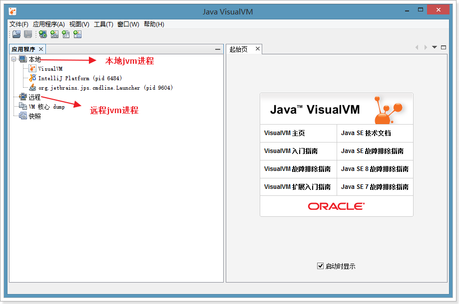

## 6.2 查看本地进程

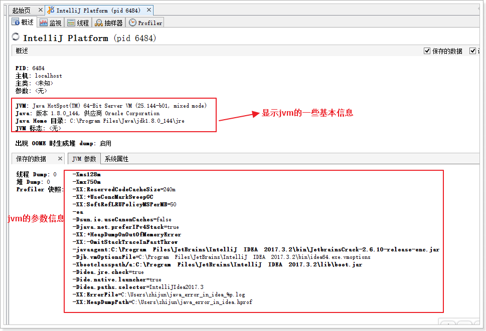

## 6.3、查看CPU、内存、类、线程运行信息

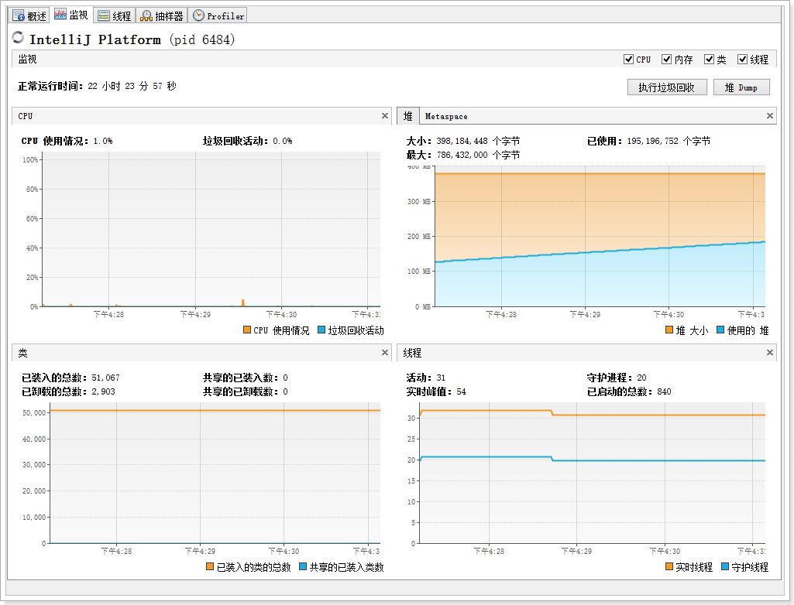

## 6.4 查看线程想抢

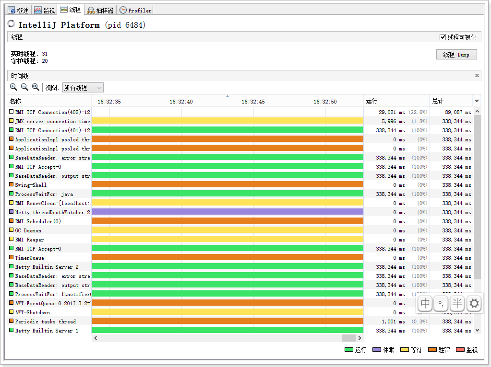

也可以点击右上角Dump按钮，将线程的信息导出，其实就是执行的jstack命令。

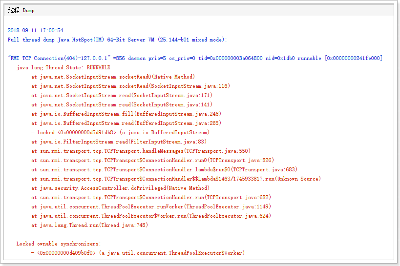

发现，显示的内容是一样的。

## 6.5、抽样器

抽样器可以对CPU、内存在一段时间内进行抽样，以供分析。

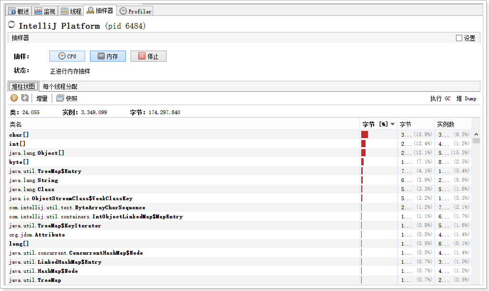

## 6.6 监控远程的jvm

VisualJVM不仅是可以监控本地jvm进程，还可以监控远程的jvm进程，需要借助于JMX技术实现。

### 6.6.1 什么是JMX？

JMX（Java Management Extensions，即Java管理扩展）是一个为应用程序、设备、系统等植入管理功能的框架。JMX可以跨越一系列异构操作系统平台、系统体系结构和网络传输协议，灵活的开发无缝集成的系统、网络和服务管理应用。

### 6.6.2 监控远程的tomcat

想要监控远程的tomcat，就需要在远程的tomcat进行对JMX配置，方法如下：

```shell
#在tomcat的bin目录下，修改catalina.sh，添加如下的参数

JAVA_OPTS="-Dcom.sun.management.jmxremote -Dcom.sun.management.jmxremote.port=9999 -Dcom.sun.management.jmxremote.authenticate=false -Dcom.sun.management.jmxremote.ssl=false"

#这几个参数的意思是：
#-Dcom.sun.management.jmxremote ：允许使用JMX远程管理
#-Dcom.sun.management.jmxremote.port=9999 ：JMX远程连接端口
#-Dcom.sun.management.jmxremote.authenticate=false ：不进行身份认证，任何用户都可以连接
#-Dcom.sun.management.jmxremote.ssl=false ：不使用ssl
```

保存退出，重启tomcat。

### 6.6.3、使用VisualJVM连接远程tomcat

添加远程主机：

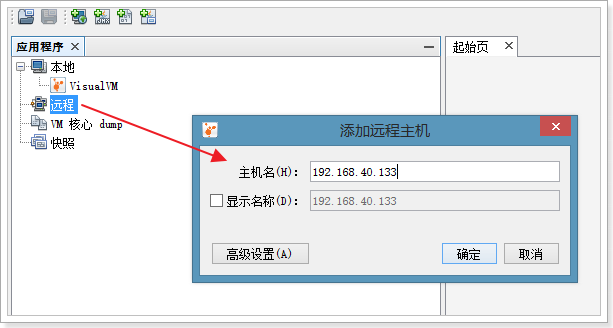

在一个主机下可能会有很多的jvm需要监控，所以接下来要在该主机上添加需要监控的jvm：

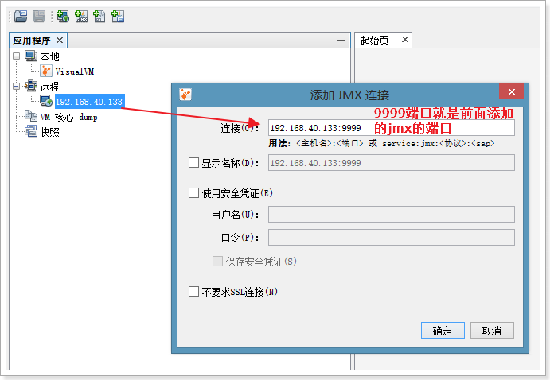

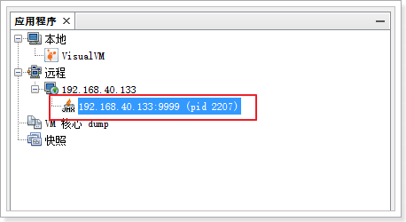

连接成功。使用方法和前面就一样了，就可以和监控本地jvm进程一样，监控远程的tomcat进程。

