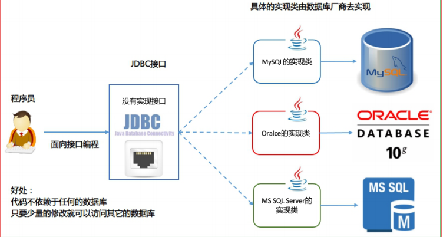
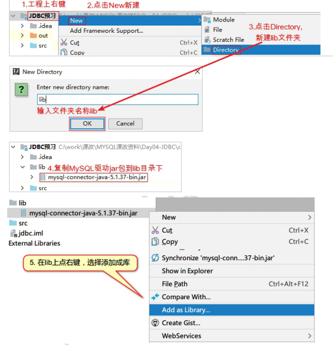

# 30-JDBC

# 1.jdbc入门

 **客户端操作mysql的方式**

1. 使用第三方客户端来访问 MySQL：SQLyog、Navicat、SQLWave、MyDB Studio、EMS SQL Manager for MySQL
2. 使用 MySQL 自带的命令行方式
3. 通过 Java 来访问 MySQL 数据库 

**什么是jdbc**

全称：Java DataBase Connectivity  Java 数据库连接， Java语言操作数据库

JDBC规范定义接口，具体的实现由各大数据库厂商来实现

JDBC 是 Java 访问数据库的标准规范，真正怎么操作数据库还需要具体的实现类，也就是**数据库驱动**。每个数据库厂商根据自家数据库的通信格式编写好自己数据库的驱动。所以我们只需要会调用 JDBC 接口中的方法即可，**数据库驱动由数据库厂商提供**

 **JDBC本质：**其实是官方（sun公司）定义的一套操作所有关系型数据库的规则，即接口。各个数据库厂商去实现这套接口，提供数据库驱动jar包。我们可以使用这套接口（JDBC）编程，真正执行的代码是驱动jar包中的实现类。

使用JDBC的好处：

- 程序员如果要开发访问数据库的程序，只需要会调用 JDBC 接口中的方法即可，不用关注类是如何实现的。
- 使用同一套 Java 代码，进行少量的修改就可以访问其他 JDBC 支持的数据库



**使用JDBC开发使用到的包：**

- java.sql 所有与 JDBC 访问数据库相关的接口和类
- javax.sql 数据库扩展包，提供数据库额外的功能。如：连接池
- 数据库的驱动 由各大数据库厂商提供，需要额外去下载，是对 JDBC 接口实现的类

**JDBC 的核心 API：**

- DriverManager 类
  - 管理和注册数据库驱动
  - 得到数据库连接对象
- Connection 接口 一个连接对象，可用于创建 Statement 和 PreparedStatement 对象
- Statement 接口 一个 SQL 语句对象，用于将 SQL 语句发送给数据库服务器。
- PreparedStatemen 接口 一个 SQL 语句对象，是 Statement 的子接口
- ResultSet 接口 用于封装数据库查询的结果集，返回给客户端 Java 程序

# 2.JDBC使用




## 2.1 JDBC初步使用

方法说明：

Class.forName(数据库驱动实现类) ：加载和注册数据库驱动，数据库驱动由 mysql 厂商
`"com.mysql.jdbc.Driver"`

从 JDBC3 开始，目前已经普遍使用的版本。可以不用注册驱动而直接使用。Class.forName
这句话可以省略

```java
public class jdbcDemo {
    public static void main(String[] args) throws Exception {
        //1. 导入驱动jar包
        //2.注册驱动
        // mysql 8.0 版本需要将 com.mysql.jdbc.Driver 更换为 com.mysql.cj.jdbc.Driver。
        Class.forName("com.mysql.cj.jdbc.Driver");
        //3. 获取数据库连接对象
        //mysql 8.0版本 不需要建立 SSL 连接的，需要显式关闭 useSSL=false，最后还需要设置 CST，也就是设置时区 serverTimezone=UTC
        Connection con = DriverManager.getConnection("jdbc:mysql://localhost:3306/sys?useSSL=false&serverTimezone=UTC", "root", "password");
        //4.定义sql语句
        String sql = "select * from account";
        //5. 获取sql执行对象
        Statement statement = con.createStatement();
        //6.执行sql
        boolean execute = statement.execute(sql);
        //处理结果
        System.out.println(execute);
        //7. 释放资源
        statement.close();
        con.close();
    }
}

```

## 2.2 详解JDBC中各个对象

### 2.2.1 DriverManager 驱动管理对象

静态方法：

- `Connection getConnection (String url, String user, String password)`

   通过连接字符串，用户名，密码来得到数据库的连接对象

- `Connection getConnection (String url, Properties info) `

  通过连接字符串，属性对象来得到连接对象

参数说明：

- `String user`登录的用户名

- ` String password `登录的密码

- `String url` 连接字符串 URL 不同的数据库 URL 是不同的。

  ```java
  mysql 的写法jdbc:mysql://localhost:3306/数据库[?参数名=参数值]
  
  mysql8.0版本的写法：
  jdbc:mysql://localhost:3306/sys?useSSL=false&serverTimezone=UTC
         
  ```

- 驱动类的字符串名

  ```shell
  # mysql 8.0
  com.mysql.cj.jdbc.Driver
  # mysql 8.0之前
  com.mysql.jdbc.Driver
  ```

### 2.2.2 connection 数据库连接对象

Connection 作用：Connection 接口，具体的实现类由数据库的厂商实现，代表一个连接对象

1. 功能：获取执行sql 的对象
   - Statement createStatement()
   - PreparedStatement prepareStatement(String sql)  
2. 管理事务
   - 开启事务：setAutoCommit(boolean autoCommit) ：调用该方法设置参数为false，即开启事务
   - 提交事务：commit() 
   - 回滚事务：rollback() 

### 2.2.3 Statement 执行sql的对象

执行SQL

1. `boolean execute(String sql)` ：可以执行任意的sql ，返回布尔值
3. `ResultSet executeQuery(String sql) ` ：执行DQL，也就是select语句，返回结果集对象
3. `int executeUpdate(String sql) `：执行DML（insert、update、delete）语句、DDL(create，alter、drop)语句，返回值：影响的行数，可以通过这个影响的行数判断DML语句是否执行成功 返回值>0的则执行成功，反之，则失败。

```java
// 注册驱动，可省略，因为DriverManager已实现此功能
Class.forName("com.mysql.cj.jdbc.Driver");
// 获取数据库连接对象
Connection con = DriverManager.getConnection("jdbc:mysql://localhost:3306/sys?useSSL=false&serverTimezone=UTC", "root", "password");
// 定义sql
String sql = "insert into account values (null,'wangmazi',23.0)";
// 获取sql执行对象
Statement statement = con.createStatement();
// 执行sql
int i = statement.executeUpdate(sql);
System.out.println(i);// 1 返回受影响的行数 
// 释放资源
statement.close();
con.close();
```

### 2.2.4 ResultSet：结果集对象,封装查询结果

- boolean next(): 游标向下移动一行，判断当前行是否是最后一行末尾(是否有数据)，如果是，则返回false，如果不是则返回true

		* getXxx(参数):获取数据
	
	Xxx：代表数据类型   如： int getInt() ,	String getString()
	
* 参数：

  * int：代表列的编号,从1开始   如： getString(1)
  * String：代表列名称。 如： getDouble("balance")

* 使用步骤：

  *  游标向下移动一行
  * 判断是否有数据
  *  获取数据

  ```java
   //循环判断游标是否是最后一行末尾。
   while(rs.next()){
   //获取数据
       int id = rs.getInt(1);
       String name = rs.getString("name");
       double balance = rs.getDouble(3);
  
      System.out.println(id + "---" + name + "---" + balance);
  }
  ```

### 2.2.5 PreparedStatement 执行sql的对象

SQL注入问题：在拼接sql时，有一些sql的特殊关键字参与字符串的拼接。会造成安全性问题

eg：输入用户随便，输入密码：a' or 'a' = 'a

```sql
select * from user where username = 'fhdsjkf' and password = 'a' or 'a' = 'a' 
```

**解决sql注入问题：使用PreparedStatement对象来解决**

预编译的SQL：参数使用?作为占位符

```JAVA
 Connection connection  = DriverManager.getConnection("jdbc:mysql://localhost:3306/sys?useSSL=false&serverTimezone=UTC", "root", "password");

String sql = "select * from account where NAME = ? and balance = ?";
// 获取执行sql语句的对象
PreparedStatement pre = connection.prepareStatement(sql);
//给？赋值 参数1：？的位置，参数2：？的值
pre.setString(1,"张三"); // ？的位置编号 从1 开始
pre.setString(2,"1000");
 //接受返回结果，不需要传递sql语句
 ResultSet resultSet = pre.executeQuery();
//处理数据 
while(resultSet.next()){ //游标向下移动
    //获取数据
    int id = resultSet.getInt(1);
    String name = resultSet.getString("name");
    double balance = resultSet.getDouble(3);

    System.out.println(id + "---" + name + "---" + balance);
}
connection.close();
pre.close();
resultSet.close();
```

### 2.2.6 案例

```java
public class jdbcDemo04 {
    public static void main(String[] args) throws Exception{
        Connection con = null;
        PreparedStatement pre1 = null;
        PreparedStatement pre2 = null;
        try{
            //获取连接对象
            Class.forName("com.mysql.cj.jdbc.Driver");
            con= DriverManager.getConnection("jdbc:mysql://localhost:3306/sys?useSSL=false&serverTimezone=UTC", "root", "password");

            // 开启事务
            con.setAutoCommit(false);

            //定义sql
            String sql1 = "update account set balance = balance - ? where id = ?";
            String sql2 = "update account set balance = balance + ? where id = ?";

            //获取执行sql对象
            pre1 = con.prepareStatement(sql1);
            pre2 = con.prepareStatement(sql2);
            // 设置参数
            pre1.setDouble(1,500);
            pre1.setDouble(2,1);

            pre2.setDouble(1,500);
            pre2.setDouble(2,2);

            //执行sql
            pre1.executeUpdate();

            //手动制造异常
            int i = 3/0;

            pre2.executeUpdate();

            //没有异常则提交事务
            con.commit();

        }catch (Exception e){
            try{
                if (con != null){
                    // 事务回滚
                    con.rollback();
                }
            }catch (SQLException e1){
                e1.printStackTrace();
            }
            e.printStackTrace();
        }finally {
            if (con!=null){
                try{
                    con.close();
                }catch (Exception e){
                    e.printStackTrace();
                }
            }
            if (pre1!=null){
                try{
                    pre1.close();
                }catch (Exception e){
                    e.printStackTrace();
                }
            }
            if (pre2!=null){
                try{
                    pre2.close();
                }catch (Exception e){
                    e.printStackTrace();
                }
            }
        }

    }
}

```

## 2.3 抽取JDBC工具类

目的：简化书写

分析：
1. 注册驱动也抽取

2. 抽取一个方法获取连接对象
	* 需求：不想传递参数（麻烦），还得保证工具类的通用性。
	* 解决：配置文件，放在src路径在
	
	```shell
	jdbc.properties
	# 内容如下
	url=jdbc:mysql://localhost:3306/sys?useSSL=false&serverTimezone=UTC
	user=root
	password=password
	```
	
3. 抽取一个方法释放资源

   ```java
   public class JDBCUtils {
       //1. 定义成员变量
       private static DataSource ds;
   
       static{
   
          try {
                //1. 创建Properties集合类
              Properties pro = new Properties();
              //2. 加载配置文件
   			ClassLoader classLoader = JDBCUtils.class.getClassLoader();//类加载器
               URL res  = classLoader.getResource("jdbc.properties");
               String path = res.getPath();
               pro.load(new FileReader(path));
              
               //3. 获取数据，赋值
               url = pro.getProperty("url");
               user = pro.getProperty("user");
               password = pro.getProperty("password");
               driver = pro.getProperty("driver");
              //4. 注册驱动
               Class.forName(driver);
              
          } catch (IOException e) {
               e.printStackTrace();
           } catch (Exception e) {
              e.printStackTrace();
          }
       }
   
       //获取连接
       public static Connection getConnection() throws SQLException {
   
           return DriverManager.getConnection(url, user, password);
       }
       // 释放资源
       public static void close(Statement stmt, Connection conn){
           // 这里简化了代码，直接调用了另外一个close的重载方法
           close(null,stmt,conn);
       }
       // 释放资源
        public static void close(ResultSet rs,Statement stmt, Connection conn){
           if( rs != null){
               try {
                   rs.close();
               } catch (SQLException e) {
                   e.printStackTrace();
               }
           }
   
           if( stmt != null){
               try {
                   stmt.close();
               } catch (SQLException e) {
                   e.printStackTrace();
               }
           }
   
           if( conn != null){
               try {
                   conn.close();
               } catch (SQLException e) {
                   e.printStackTrace();
               }
           }
       }
   }
   
   ```

4. 使用练习

   需求：

   - 通过键盘录入用户名和密码
   - 判断用户是否登录成功

   ```sql
   select * from user where username = "" and password = "";
   如果这个sql有查询结果，则成功，反之，则失败
   ```

   步骤：

   - 创建数据库表 user，并插入一些数据

     ```sql
     CREATE TABLE USER(
         id INT PRIMARY KEY AUTO_INCREMENT,
         username VARCHAR(32),
         PASSWORD VARCHAR(32)
     );
     
     INSERT INTO USER VALUES(NULL,'zhangsan','123');
     INSERT INTO USER VALUES(NULL,'lisi','234');
     ```

   - 代码实现

     ```java
     public class JDBCDemo9 {
     
         public static void main(String[] args) {
             //1.键盘录入，接受用户名和密码
             Scanner sc = new Scanner(System.in);
             System.out.println("请输入用户名：");
             String username = sc.nextLine();
             System.out.println("请输入密码：");
             String password = sc.nextLine();
             //2.调用方法
             boolean flag = new JDBCDemo9().login(username, password);
             //3.判断结果，输出不同语句
             if(flag){
                 //登录成功
                 System.out.println("登录成功！");
             }else{
                 System.out.println("用户名或密码错误！");
             }
             
              /**
     		 * 登录方法
     		 */
             public boolean login(String username ,String password){
                 if(username == null || password == null){
                     return false;
                 }
                 //连接数据库判断是否登录成功
                 Connection conn = null;
                 Statement stmt =  null;
                 ResultSet rs = null;
                 //1.获取连接
                 try {
                     conn =  JDBCUtils.getConnection();
                     //2.定义sql
                     String sql = "select * from user where username = '"+username+"' and password = '"+password+"' ";
                     //3.获取执行sql的对象
                     stmt = conn.createStatement();
                     //4.执行查询
                     rs = stmt.executeQuery(sql);
                     //5.判断
                     /* if(rs.next()){//如果有下一行，则返回true
     			                return true;
     			            }else{
     			                return false;
     			            }*/
                     return rs.next();//如果有下一行，则返回true
     
                 } catch (SQLException e) {
                     e.printStackTrace();
                 }finally {
                     JDBCUtils.close(rs,stmt,conn);
                 }
     
                 return false;
             }
         }  
     }
     ```

     

## 2.4 JDBC 控制事务

事务：一个包含多个步骤的业务操作。如果这个业务操作被事务管理，则这多个步骤要么同时成功，要么同时失败。

操作步骤：
1. 开启事务
2. 提交事务
3. 回滚事务

使用Connection对象来管理事务
* 开启事务：setAutoCommit(boolean autoCommit) ：调用该方法设置参数为false，即开启事务
	
	在执行sql之前开启事务
* 提交事务：commit() 
	
	当所有sql都执行完提交事务
* 回滚事务：rollback() 
	
	在catch中回滚事务

```java
public class jdbcDemo04 {
    public static void main(String[] args) throws Exception{
        Connection con = null;
        PreparedStatement pre1 = null;
        PreparedStatement pre2 = null;
        try{
            //获取连接对象
            Class.forName("com.mysql.cj.jdbc.Driver");
            con= DriverManager.getConnection("jdbc:mysql://localhost:3306/sys?useSSL=false&serverTimezone=UTC", "root", "password");

            // 执行操作之前，开启事务
            con.setAutoCommit(false);

            //定义sql
            String sql1 = "update account set balance = balance - ? where id = ?";
            String sql2 = "update account set balance = balance + ? where id = ?";

            //获取执行sql对象
            pre1 = con.prepareStatement(sql1);
            pre2 = con.prepareStatement(sql2);
            // 设置参数
            pre1.setDouble(1,500);
            pre1.setDouble(2,1);

            pre2.setDouble(1,500);
            pre2.setDouble(2,2);

            //执行sql
            pre1.executeUpdate();

            //手动制造异常
            int i = 3/0;

            pre2.executeUpdate();

            //没有异常则提交事务
            con.commit();

            //需要抓一个大的异常
        }catch (Exception e){
            try{
                if (con != null){
                    // 事务回滚
                    con.rollback();
                }
            }catch (SQLException e1){
                e1.printStackTrace();
            }
            e.printStackTrace();
        }finally {
            if (con!=null){
                try{
                    con.close();
                }catch (Exception e){
                    e.printStackTrace();
                }
            }
            if (pre1!=null){
                try{
                    pre1.close();
                }catch (Exception e){
                    e.printStackTrace();
                }
            }
            if (pre2!=null){
                try{
                    pre2.close();
                }catch (Exception e){
                    e.printStackTrace();
                }
            }
        }

    }
}

```

# 3.数据库连接池

**概念：**其实就是一个容器(集合)，存放数据库连接的容器。

当系统初始化好后，容器被创建，容器中会申请一些连接对象，当用户来访问数据库时，从容器中获取连接对象，用户访问完之后，会将连接对象归还给容器。

**好处：**

1. 节约资源
2. 用户访问高效

标准接口：DataSource   javax.sql包下的

 **方法：**

- 获取连接：getConnection()
-  归还连接：Connection.close()。如果连接对象Connection是从连接池中获取的，那么调用Connection.close()方法，则不会再关闭连接了。而是**归还连接**

注意：一般我们不去实现它，有数据库厂商来实现

- C3P0：数据库连接池技术
- Druid：数据库连接池实现技术，由阿里巴巴提供的

## 3.1 C3P0 

 步骤：

1. 导入jar包 (两个)

    项目根目录下创建libs目录，将下列jar包导入，并右键项目该目录，选择 add as Library，然后点击OK即可

    ```
    c3p0-0.9.5.2.jar 
    mchange-commons-java-0.2.12.jar
    
    # 别忘了SQL的jar包。
    mysql-connector-java-8.0.12.jar 
    ```

2. 导入配置文件

    定义配置文件：` c3p0.properties `或者 `c3p0-config.xml`，直接将文件放在src根目录下

    ```xml
       <c3p0-config>
         <!-- 使用默认的配置读取连接池对象 -->
         <default-config>
         	<!--  连接参数 -->
           <property name="driverClass">com.mysql.cj.jdbc.Driver</property>
           <!--  注意这里的数据库要指定自己的 -->
           <property name="jdbcUrl">jdbc:mysql://localhost:3306/sys?useSSL=false&amp;serverTimezone=Hongkong&amp;characterEncoding=utf-8&amp;autoReconnect=true</property>
        <property name="user">root</property>
           <property name="password">password</property>
     
           <!-- 连接池参数 -->
           <!-- 初始化申请的连接数量 --> 
           <property name="initialPoolSize">5</property>
           <!-- 最大连接数量-->
           <property name="maxPoolSize">10</property>
           <!-- 超时时间 -->
           <property name="checkoutTimeout">3000</property>
         </default-config>
       
         <named-config name="otherc3p0"> 
           <!--  连接参数 -->
           <property name="driverClass">com.mysql.cj.jdbc.Driver</property>
           <property name="jdbcUrl">jdbc:mysql://localhost:3306/sys?useSSL=false&amp;serverTimezone=Hongkong&amp;characterEncoding=utf-8&amp;autoReconnect=true</property>
           <property name="user">root</property>
           <property name="password">password</property>
           
           <!-- 连接池参数 -->
           <!-- 初始化申请的连接数量 --> 
           <property name="initialPoolSize">5</property>
           <!-- 最大连接数量-->
           <property name="maxPoolSize">8</property>
           <!-- 超时时间 -->
           <property name="checkoutTimeout">1000</property>
         </named-config>
       </c3p0-config>
    ```

3. 创建核心对象 数据库连接池对象 ComboPooledDataSource

4. 获取连接： getConnection

基本使用：获取连接对象

```java
public class test {
    public static void main(String[] args) throws SQLException {
        // 1. 创建数据库连接池对象，使用默认配置
        DataSource ds = new ComboPooledDataSource();
        // 2. 获取连接对象
        Connection connection = ds.getConnection();
        // 3. 打印
        System.out.println(connection);
   	// com.mchange.v2.c3p0.impl.NewProxyConnection@17d99928 [wrapping: com.mysql.cj.jdbc.ConnectionImpl@3834d63f]
   }
}
```

案例：

```java
public class c3p0Demo01 {
    public static void main(String[] args) throws SQLException {
        // 1. 创建数据库连接池对象，使用默认配置
        DataSource ds = new ComboPooledDataSource();

        //  使用指定名称配置，一般使用默认配置
//        ComboPooledDataSource ds = new ComboPooledDataSource("otherc3p0"); //写在配置文件里面的属性值


        //2. 获取连接对象
        // 注意：最大连接数为配置文件中配置的，如果一次性获取超过该数量的连接，则会在超时时间后报错
        // 解决方法就是归还连接
        for (int i = 1; i <= 11; i++) {
            Connection connection = ds.getConnection();
            System.out.println(i +" : " + connection);

            if (i == 5){
                // 测试时可观察打印内容第5条和第6条输出结果的hash值相同
                connection.close();//归还本次连接到连接池中
            }

        }
    }
}

```

## 3.2  Druid 

步骤：

1. 导入jar包 druid-1.0.9.jar，具体方式同c3p0一样

2. 定义配置文件：

   是properties形式的，可以叫任意名称，可以放在任意目录下，因为需要手动加载该文件

   druid.properties

   ```shell
   driverClassName=com.mysql.cj.jdbc.Driver
   url=jdbc:mysql://localhost:3306/sys?useUnicode=true&characterEncoding=utf-8&useSSL=false&serverTimezone=GMT%2B8
   username=root
   password=password
   # 初始化连接数量
   initialSize=5
   # 最大连接数
   maxActive=10
   # 最大等待时间
   maxWait=3000
   ```

3. 加载配置文件 Properties

4. 获取数据库连接池对象：通过工厂来来获取  DruidDataSourceFactory

5. 获取连接：getConnection

基本使用：

```java
public class druidDemo01 {
    public static void main(String[] args) throws Exception {

        //1. 加载配置文件
        Properties pro = new Properties();
        InputStream is = druidDemo01.class.getClassLoader().getResourceAsStream("druid.properties");
        pro.load(is);
        //2. 获取连接池对象
        DataSource dataSource = DruidDataSourceFactory.createDataSource(pro);
        //3.获取连接
        Connection connection = dataSource.getConnection();
        System.out.println(connection);// com.mysql.cj.jdbc.ConnectionImpl@51565ec2
    }
}
```

定义工具类对象，方便代码不在重复

```java
public class JDBCUtils {
    //1. 定义成员变量
    private static DataSource ds;

    static{

       try {
             //1. 加载配置文件
           Properties pro = new Properties();
           pro.load(JDBCUtils.class.getClassLoader().getResourceAsStream("druid.properties"));
             //2. 获取dataSource
           ds = DruidDataSourceFactory.createDataSource(pro);
       } catch (IOException e) {
            e.printStackTrace();
        } catch (Exception e) {
           e.printStackTrace();
       }
    }

    //获取连接
    public static Connection getConnection() throws SQLException {

        return ds.getConnection();
    }
    // 释放资源
    public static void close(Statement stmt, Connection conn){
        close(null,stmt,conn);
    }
    // 释放资源
    public static void close( ResultSet rs,Statement stmt, Connection conn){
        if(rs != null){
            try {
                rs.close();
            } catch (SQLException e) {
                e.printStackTrace();
            }
        }
        if(stmt != null){
            try {
                stmt.close();
            } catch (SQLException e) {
                e.printStackTrace();
            }
        }
        if (conn != null){
            try {
                conn.close();// 归还
            } catch (SQLException e) {
                e.printStackTrace();
            }
        }

    }
    /**
     * 获取连接池
     */
    public static DataSource getDataSource(){
        return ds;
    }
}

```

```java
public class druidDemo02 {
    public static void main(String[] args) throws Exception {
        Connection con = null;
        PreparedStatement pstmt = null;
        try {
            //1. 加载配置文件
            con = JDBCUtils.getConnection();
            //2.定义sql
            String sql = "insert into account values(null,?,?)";
            //3.获取pstmt对象
            pstmt = con.prepareStatement(sql);
            //4.给？赋值
            pstmt.setString(1,"王麻子");
            pstmt.setDouble(2,3000);
            //5.执行sql
            int i = pstmt.executeUpdate();
            System.out.println(i);
        }catch (Exception e){
            e.printStackTrace();
        }finally {
            JDBCUtils.close(pstmt,con);
        }
    }
}

```

# 4.Spring JDBC

Spring框架对JDBC的简单封装。提供了一个JDBCTemplate对象简化JDBC的开发

步骤：

 1. 导入jar包，当然还有SQL的jar包，这里不再赘述

    ```
    commons-logging-1.2.jar
    spring-beans-5.0.0.RELEASE.jar
    spring-core-5.0.0.RELEASE.jar
    spring-jdbc-5.0.0.RELEASE.jar
    spring-tx-5.0.0.RELEASE.jar
    ```

 2. 创建JdbcTemplate对象。依赖于数据源DataSource

    ```java
    public class jdbcTemplateDemo01 {
        public static void main(String[] args) {
            //1. 创建jdbcTemplate
            // 注：这里的JDBCUtils是我们上面封装的类
            JdbcTemplate jdbcTemplate = new JdbcTemplate(JDBCUtils.getDataSource());
            //3.调用方法
            String sql = "update account set balance = 5000 where id = ?";
            // 参数1：SQL语句 参数2：SQL语句中 ? 对应的值
            // 第二个参数是一个args，对应每一个 ? 的值，依次写入即可
            int update = jdbcTemplate.update(sql, 3);// 返回执行状态值，成功1，失败0 
            System.out.println(update);
        }
    }
    
    ```

3. 调用JdbcTemplate的方法来完成CRUD的操作
  * `update()`:执行DML语句。增、删、改语句
  * `queryForMap()`:查询结果将结果集封装为map集合，将列名作为key，将值作为value 将这条记录封装为一个map集合
  	* 注意：**这个方法查询的结果集长度只能是1**
  * `queryForList()`:查询结果将结果集封装为list集合
  	* 注意：将每一条记录封装为一个Map集合，再将Map集合装载到List集合中
  * `query()`:查询结果，将结果封装为JavaBean对象
  	* query的参数：RowMapper

    		一般我们使用BeanPropertyRowMapper实现类。可以完成数据到JavaBean的自动封装
    		* new BeanPropertyRowMapper<类型>(类型.class)
  * `queryForObject`：查询结果，将结果封装为对象
  	* 一般用于聚合函数的查询

练习：

```java
public class jdbcTemplateDemo02 {
     // 创建jdbcTemplate
    private JdbcTemplate jdbcTemplate =  new JdbcTemplate(JDBCUtils.getDataSource());

    // 修改数据
    @Test
    public void test1(){
        String sql = "update account set balance = 5000 where id = ?";
        int update = jdbcTemplate.update(sql, 4);
        System.out.println(update);
    }
    // 插入数据
    @Test
    public void test2(){
        String sql = "insert into account values(?,?,?)";
        int lisi = jdbcTemplate.update(sql, null, "lisi", 2000);
        System.out.println(lisi);
    }
    //删除数据
    @Test
    public void test3(){
        String sql = "delete from account where id = ?";
        int update = jdbcTemplate.update(sql, 4);
        System.out.println(update);
    }
    
    // 查询数据，并将数据封装为Map集合
    // 问题：如果有两条数据则不能封装为Map集合
    @Test
    public void testMap(){
        String sql = "select * from account where id = ?";
        Map<String, Object> map = jdbcTemplate.queryForMap(sql, 3);
        System.out.println(map); // {id=3, NAME=王麻子, balance=5000.0}
    }
    
    // 查询所有记录，将其封装为List
    @Test
    public void testList(){
        String sql = "select * from account";
        // 将每一条记录封装为一个Map集合，再将多个Map集合装载到List集合中
        List<Map<String, Object>> list = jdbcTemplate.queryForList(sql);

        for (Map<String, Object> stringObjectMap : list) {
            System.out.println(stringObjectMap);
        }
        /**
         * {id=1, NAME=张三, balance=1000.0}
         * {id=2, NAME=李四, balance=1000.0}
         * {id=3, NAME=王麻子, balance=5000.0}
         * {id=5, NAME=王麻子, balance=3000.0}
         * {id=6, NAME=lisi, balance=2000.0}
         * {id=7, NAME=lisi, balance=2000.0}
         */
    }
    
    // 查询所有数据，并封装为list 自定义封装类
    @Test
    public void test4(){
        String sql = "select * from account";
        List<account> list =  jdbcTemplate.query(sql, new RowMapper<account>() {

            @Override
            public account mapRow(ResultSet resultSet, int i) throws SQLException {
                // ResultSet 结果集对象
                account account = new account();
                int id = resultSet.getInt("id");
                String name = resultSet.getString("name");
                double balance = resultSet.getDouble("balance");

                account.setId(id);
                account.setName(name);
                account.setBalance(balance);

                return account;
            }
        });
        for (account account : list) {
            System.out.println(account);
            
             /**
             * account{id=1, name='张三', balance=1000.0}
             * account{id=2, name='李四', balance=1000.0}
             * account{id=3, name='王麻子', balance=5000.0}
             * account{id=5, name='王麻子', balance=3000.0}
             * account{id=6, name='lisi', balance=2000.0}
             * account{id=7, name='lisi', balance=2000.0}
             */
        

        }
    }

    // 查询数据，使用自带的封装，可以实现代码简化
    // 注意：使用BeanPropertyRowMapper时，自定义的成员变量类型必须使用引用类型的封装类，eg：Integer
    @Test
    public void test5(){
        String sql = "select * from account";
        //注：基本数据类型，不能接收null值，只有引用类型的封装类才可以，所以accout的成员变量类型必须更改为引用类型才可
        List<account> query = jdbcTemplate.query(sql, new BeanPropertyRowMapper<account>(account.class));
        for (account account : query) {
            System.out.println(account);
            
            /**
             * account{id=1, name='张三', balance=1000.0}
             * account{id=2, name='李四', balance=1000.0}
             * account{id=3, name='王麻子', balance=5000.0}
             * account{id=5, name='王麻子', balance=3000.0}
             * account{id=6, name='lisi', balance=2000.0}
             * account{id=7, name='lisi', balance=2000.0}
             */
        }
    }

    //查询总记录数
    @Test
    public void test6(){
        String sql = "select count(id) from account";
        // queryForObject 一般用来执行聚合函数
        Long aLong = jdbcTemplate.queryForObject(sql, long.class);
        System.out.println(aLong);// 6
    }

   
}

```

```java
public class account {
    private Integer id;
    private String name;
    private Double balance;

    public account() {
    }

    public account(Integer id, String name, Double balance) {
        this.id = id;
        this.name = name;
        this.balance = balance;
    }

    @Override
    public String toString() {
        return "account{" +
                "id=" + id +
                ", name='" + name + '\'' +
                ", balance=" + balance +
                '}';
    }

    public Integer getId() {
        return id;
    }

    public void setId(Integer id) {
        this.id = id;
    }

    public String getName() {
        return name;
    }

    public void setName(String name) {
        this.name = name;
    }

    public Double getBalance() {
        return balance;
    }

    public void setBalance(Double balance) {
        this.balance = balance;
    }
}

```

