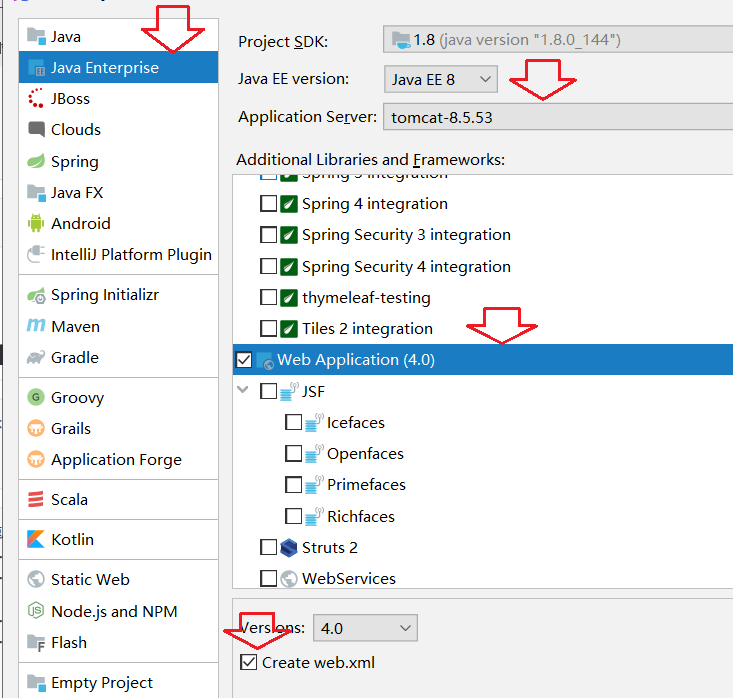
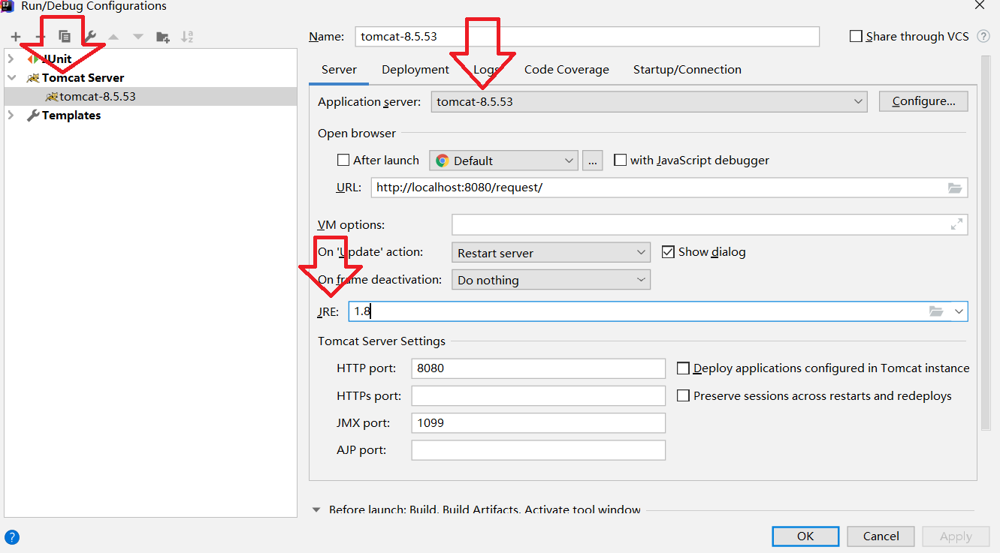
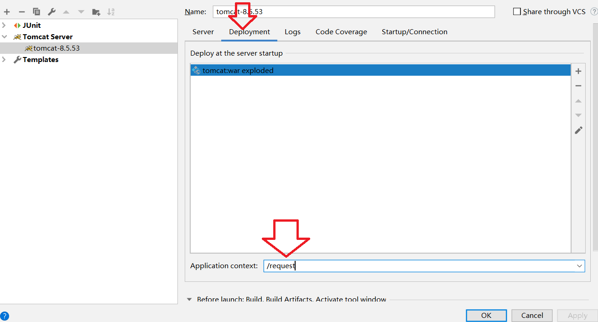
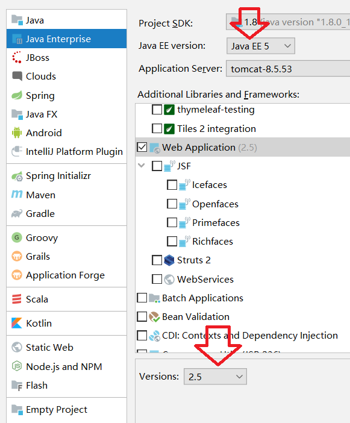

# 31-Tomcat&servlet

# 1.Tomcat

## 1.1 web相关概念

1. 软件架构

   - C/S：客户端/服务器端
   -  B/S：浏览器/服务器端

2. 资源分类

   - 静态资源：所有用户访问后，得到的结果都是一样的，称为静态资源.静态资源可以直接被浏览器解析

     如： html,css,JavaScript

   - 动态资源:每个用户访问相同资源后，得到的结果可能不一样。称为动态资源。动态资源被访问后，需要先转换为静态资源，在返回给浏览器

     如：servlet/jsp,php,asp....

3. 网络通信三要素

   1. IP：电子设备(计算机)在网络中的唯一标识。

   2. 端口：应用程序在计算机中的唯一标识。 0~65536

   3. 传输协议：规定了数据传输的规则

      基础协议

      - tcp:安全协议，三次握手。 速度稍慢
      - udp：不安全协议。 速度快

## 1.2 web服务器软件

 服务器：安装了服务器软件的计算机
* 服务器软件：接收用户的请求，处理请求，做出响应
* web服务器软件：接收用户的请求，处理请求，做出响应
* 在web服务器软件中，可以部署web项目，让用户通过浏览器来访问这些项目

**常见的java相关的web服务器软件**

-  webLogic：oracle公司，大型的JavaEE服务器，支持所有的JavaEE规范，收费的。

* webSphere：IBM公司，大型的JavaEE服务器，支持所有的JavaEE规范，收费的。
* JBOSS：JBOSS公司的，大型的JavaEE服务器，支持所有的JavaEE规范，收费的。
* Tomcat：Apache基金组织，中小型的JavaEE服务器，仅仅支持少量的JavaEE规范servlet/jsp。开源的，免费的。

**JavaEE：**Java语言在企业级开发中使用的技术规范的总和，一共规定了13项大的规范

 **静态项目和动态项目：**

动态项目目录结构

- 项目的根目录
  - WEB-INF目录：
  - web.xml：web项目的核心配置文件
  -  classes目录：放置字节码文件的目录
  -  lib目录：放置依赖的jar包

## 1.3 安装tomcat

找到tomcat，选择想要下载的tomcat版本，选择zip包下载即可

之后解压到需要安装的目录即可

本地启动可以执行bin目录下的start.bat文件

关于日志文件乱码问题：

在conf目录下logging.properties中进行如下修改

```
encoding = GBK
```

原来的应该是utf-8，将此文件内全部的这个属性换为GBK即可

## 1.4 IDEA创建项目

重点的几个步骤：



编辑Run配置





# 2.Server applet 初解

概念：运行在服务器端的小程序
* Servlet就是一个接口，定义了Java类被浏览器访问到(tomcat识别)的规则。
* 将来我们自定义一个类，实现Servlet接口，复写方法。

## 2.1 快速入门

1. 在src下创建一个包servlet

2. 定义一个类ServletDemo01，实现servlet接口

   ```java
   package servlet;
   
   import javax.servlet.*;
   import javax.servlet.annotation.WebServlet;
   import java.io.IOException;
   
   /**
    * @Class:tomcat.servlet.ServletDemo01
    * @Descript:
    * @Author:宋天
    * @Date:2020/4/7
    */
   public class ServletDemo01 implements Servlet {
   
       /**
        * 初始化方法，在servlet被创建时执行，只执行一次
        * @param servletConfig
        * @throws ServletException
        */
       @Override
       public void init(ServletConfig servletConfig) throws ServletException {
           System.out.println("初始化");
       }
   
       /**
        * 获取ServletConfig对象
        * ServletConfig ： Servlet的配置对象
        * @return
        */
       @Override
       public ServletConfig getServletConfig() {
           return null;
       }
   
       /**
        * 提供服务的方法，每一次servlet被访问时执行
        * @param servletRequest
        * @param servletResponse
        * @throws ServletException
        * @throws IOException
        */
       @Override
       public void service(ServletRequest servletRequest, ServletResponse servletResponse) throws ServletException, IOException {
           System.out.println("hello world");
       }
   
   
       /**
        * 获取Servlet的一些信息，如：版本，作者等。。
        * @return
        */
       @Override
       public String getServletInfo() {
           return null;
       }
       /**
        *销毁方法，在服务正常关闭时，执行，只执行一次
        * @return
        */
       @Override
       public void destroy() {
           System.out.println("关闭");
       }
   }
   
   ```

3. 实现接口中的抽象方法

4. 在web目录下找到web.xml，配置servlet

   ```xml
   <!-- 配置servlet-->
   <servlet>
       <servlet-name>demo1</servlet-name>
       <servlet-class>servlet.ServletDemo01</servlet-class>
   </servlet>
   
   <servlet-mapping>
       <servlet-name>demo1</servlet-name>
       <url-pattern>/demo1</url-pattern>
   </servlet-mapping>
   ```

5. 浏览器地址访问

   ```shell
   http://localhost:8080/request/demo1
   ```

   在idea中可以看到如下输出

   ```
   初始化
   hello world
   ```

## 2.2 servlet执行原理

1. 当服务器接受到客户端浏览器的请求后，会解析请求URL路径，获取访问的Servlet的资源路径
2. 查找web.xml文件，是否有对应的`<url-pattern>`标签体内容。
3. 如果有，则在找到对应的`<servlet-class>`全类名
4. tomcat会将字节码文件加载进内存，并且创建其对象
5. 调用其方法

## 2.3 servlet生命周期方法

1. 被创建：执行init方法，只执行一次

   - Servlet什么时候被创建？
     默认情况下，第一次被访问时，Servlet被创建

   - 可以配置执行servlet的创建时机

     在web.xml文件中的servlet标签下进行配置，添加如下标签

     ```xml
     <load-on-startup>5</load-on-startup>
     ```

     说明：指定servlet的创建时机

     1. 第一次被访问时创建   该标签值为负数
     2. 在服务器启动时创建   该标签值为0或正整数

   - 关于init方法，只执行一次，说明一个Servlet在内存中只存在一个对象，Servlet是单例的

     -  多个用户同时访问时，可能存在线程安全问题。
     - 解决：尽量不要在Servlet中定义成员变量。即使定义了成员变量，也不要对修改值

2. 提供服务：执行service方法，执行多次

    每次访问Servlet时，Service方法都会被调用一次。

3. 被销毁：执行destroy方法，只执行一次

   -  Servlet被销毁时执行。服务器关闭时，Servlet被销毁
   - 只有服务器正常关闭时，才会执行destroy方法。
   - destroy方法在Servlet被销毁之前执行，一般用于释放资源

## 2.4 servlet 3.0 

好处：支持竹节配置，可以不需要在web.xml文件中进行配置了。

步骤：

1. 方法和之前基本一样，只需要注意一点

   随着选择的javaEE版本不同，servlet版本也不同，所以我们需要**选择至少javaEE 1.7以上的版本**

   

2. 定义一个类，实现servlet接口

3. 实现抽象方法

4. 再类上使用用@WebServlet注解，进行配置

   ```
   @WebServlet("资源路径")
   ```

   关于此注解源码

   ```java
   @Target({ElementType.TYPE})
   @Retention(RetentionPolicy.RUNTIME)
   @Documented
   public @interface WebServlet {
       String name() default "";//相当于<Servlet-name>
   
       String[] value() default {};//代表urlPatterns()属性配置
   
       String[] urlPatterns() default {};//相当于<url-pattern>
   
       int loadOnStartup() default -1;//相当于<load-on-startup>
   
       WebInitParam[] initParams() default {};
   
       boolean asyncSupported() default false;
   
       String smallIcon() default "";
   
       String largeIcon() default "";
   
       String description() default "";
   
       String displayName() default "";
   }
   
   ```

完整代码

```java
package servlet;

import javax.servlet.*;
import javax.servlet.annotation.WebServlet;
import java.io.IOException;

/**
 * @Class:tomcat.servlet.ServletDemo01
 * @Descript:
 * @Author:宋天
 * @Date:2020/4/7
 */
@WebServlet("/demo2")
public class ServletDemo01 implements Servlet {

    /**
     * 初始化方法，在servlet被创建时执行，只执行一次
     * @param servletConfig
     * @throws ServletException
     */
    @Override
    public void init(ServletConfig servletConfig) throws ServletException {
        System.out.println("初始化");
    }

    /**
     * 获取ServletConfig对象
     * ServletConfig ： Servlet的配置对象
     * @return
     */
    @Override
    public ServletConfig getServletConfig() {
        return null;
    }

    /**
     * 提供服务的方法，每一次servlet被访问时执行
     * @param servletRequest
     * @param servletResponse
     * @throws ServletException
     * @throws IOException
     */
    @Override
    public void service(ServletRequest servletRequest, ServletResponse servletResponse) throws ServletException, IOException {
        System.out.println("hello world");
    }


    /**
     * 获取Servlet的一些信息，如：版本，作者等。。
     * @return
     */
    @Override
    public String getServletInfo() {
        return null;
    }
    /**
     *销毁方法，在服务正常关闭时，执行，只执行一次
     * @return
     */
    @Override
    public void destroy() {
        System.out.println("关闭");
    }
}

```

## 2.5 IDEA与tomcat的相关配置

1. IDEA会为每一个tomcat部署的项目单独建立一份配置文件

   查看执行servlet时，项目的日志信息的最上面

   ```shell
   Using CATALINA_BASE:   "C:\Users\宋天\.IntelliJIdea2019.3\system\tomcat\Unnamed_tomcat"
   ```

2. **工作空间项目** 和 **tomcat部署的web项目**

   - tomcat真正访问的是“tomcat部署的web项目”，"tomcat部署的web项目"对应着"工作空间项目" 的web目录下的所有资源
   - WEB-INF目录下的资源不能被浏览器直接访问。

3. 断点调试

   和一般的java项目中的调试不同的是，需要选择执行按钮旁边的小虫子启动debug

# 3.Servlet体系结构

Servlet的体系结构：

- Servlet -- 接口

- GenericServlet -- 抽象类

- HttpServlet -- 抽象类

## 3.1 GenericServlet

GenericServlet：将Servlet接口中其他的方法做了默认空实现，只将service()方法作为抽象

将来定义Servlet类时，可以继承GenericServlet，实现service()方法即可

```java
@WebServlet("/demo02")
public class ServletDemo02 extends GenericServlet {

    @Override
    public void service(ServletRequest servletRequest, ServletResponse servletResponse) throws ServletException, IOException {
        System.out.println("demo02");
    }
}
```

使用步骤：浏览器访问如下

```
http://localhost:8080/request/demo02
```

观察控制台输出如下内容

```java
demo02
```

## 3.2 HttpServlet 

HttpServlet：对http协议的一种封装，简化操作
1. 定义类继承HttpServlet
2. 复写doGet/doPost方法

```java
@WebServlet("/demo03")
public class ServletDemo03 extends HttpServlet {

    @Override
    protected void doGet(HttpServletRequest req, HttpServletResponse resp) throws ServletException, IOException {
        System.out.println("doGet....");
    }

    @Override
    protected void doPost(HttpServletRequest req, HttpServletResponse resp) throws ServletException, IOException {
        System.out.println("doPost....");
    }
}
```

使用步骤1：浏览器访问如下

```
http://localhost:8080/request/demo03
```

观察控制台输出如下内容，即默认是采用get方法

```java
doGet....
```

使用步骤2：

1. 在web根目录下创建login.html文件，写入如下内容

   ```html
   <!DOCTYPE html>
   <html lang="en">
   <head>
       <meta charset="UTF-8">
       <title>Title</title>
   </head>
   <body>
   <form action="/request/demo03" method="post">
       用户名:<input type="text" name="username"> <br>
       密码:<input type="password" name="password"><br>
   
       <input type="submit" value="登录">
   </form>
   </body>
   </html>
   ```

2. 重启servlet服务

3. 浏览器地址访问

   ```
   http://localhost:8080/request/login.html
   ```

   随意输入内容，然后点击提交

4. 此时观察控制台输出就已经是

   ```
   doPost....
   ```

   原因：from表单提交的方式是post，如果更改为get，那么结果也就不同了

## 3.3 Servlet相关配置

urlpartten：Servlet访问路径

- 一个Servlet可以定义多个访问路径 ： @WebServlet({"/d4","/dd4","/ddd4"})
- 路径定义规则：
  1. /xxx：路径匹配
  2. /xxx/xxx:多层路径，目录结构
  3. *.do：扩展名匹配

示例：

```java

//@WebServlet({"/d1","/d2","/d3"})
//@WebServlet("/d1/d2")
//@WebServlet("/*") //所有目录
@WebServlet("*.do")//以.do结尾的路径
public class ServletDemo04 extends HttpServlet {
    @Override
    protected void doGet(HttpServletRequest req, HttpServletResponse resp) throws ServletException, IOException {
        System.out.println("demo04");
    }
}

```

测试：

1. 重启servlet
2. 浏览器访问上面的配置项，查看控制台输出内容

# 4.HTTP

概念：Hyper Text Transfer Protocol 超文本传输协议

传输协议：定义了，客户端和服务器端通信时，发送数据的格式

特点：

1. 基于TCP/IP的高级协议
2. 默认端口号:80
3. 基于请求/响应模型的:一次请求对应一次响应
4. 无状态的：每次请求之间相互独立，不能交互数据

历史版本：

* 1.0：每一次请求响应都会建立新的连接
* 1.1：复用连接

**请求的消息数据格式**

1. 请求行

   ```
   请求方式 请求url 请求协议/版本
   
   GET /login.html HTTP/1.1
   ```

   HTTP协议有7中请求方式，常用的有2种

   - GET
     1. 请求参数在请求行中，在url后。
     2. 请求的url长度有限制的
     3. 不太安全
   - POST
     1. 请求参数在请求体中
     2. 请求的url长度没有限制的
     3. 相对安全

2. 请求头：客户端浏览器高速服务器一些信息

   格式：

   ```
   请求头名称：请求头值
   ```

   常见的请求头：

   - User-Agent：浏览器告诉服务器，我访问你使用的浏览器版本信息

     可以在服务器端获取该头的信息，解决浏览器的兼容性问题

   - Referer：http://localhost:8080/request/login2.html

     告诉服务器，我（当前请求）从哪里来？

     Referer：此路径是当前所在网址。

     作用：

     1. 防盗链
     2. 统计工作

3. 请求空行

   空行，就是用于分割POST请求的请求头，和请求体的

4. 请求体（正文）

   封装POST请求消息的请求参数的

5. 字符串格式

   ```shell
   POST /login.html HTTP/1.1
   Host: localhost
   User-Agent: Mozilla/5.0 (Windows NT 6.1; Win64; x64; rv:60.0) Gecko/20100101 Firefox/60.0
   Accept: text/html,application/xhtml+xml,application/xml;q=0.9,*/*;q=0.8
   Accept-Language: zh-CN,zh;q=0.8,zh-TW;q=0.7,zh-HK;q=0.5,en-US;q=0.3,en;q=0.2
   Accept-Encoding: gzip, deflate
   Referer: http://localhost/login.html
   Connection: keep-alive
   Upgrade-Insecure-Requests: 1
   username=zhangsan
   ```

# 5.Request

说明：Request是Servlet继承HttpServlet抽象类后，需要实现的两个方法之一

request对象和response对象的原理
1. request和response对象是由服务器创建的。我们来使用它们
2. request对象是来获取请求消息，response对象是来设置响应消息

**request对象继承体系结构**

```
ServletRequest -- 接口
	 继承
HttpServletRequest -- 接口
	实现
org.apache.catalina.connector.RequestFacade 类(tomcat)
```

## 5.1 request功能

获取请求消息数据

1. 获取请求行数据

   GET /day14/demo1?name=zhangsan HTTP/1.1

   方法：

   - 获取请求方式 ：GET

     ```java
     //1. 获取请求方式
     String method = request.getMethod();
     System.out.println(method); // GET
     ```

   - 获取虚拟目录：/request

     ```java
     //2. 获取虚拟目录
     String contextPath = request.getContextPath();
     System.out.println(contextPath); // /request
     ```

   - 获取Servlet路径: /demo1

     ```java
      //3. 获取servlet路径
      String servletPath = request.getServletPath();
      System.out.println(servletPath ); // RequestDemo01
     ```

   - 获取get方式请求参数：username=zhangsan&password=123

     ```java
      //4. 获取get方式请求参数
      String queryString = request.getQueryString();
      System.out.println(queryString); // username=zhangsan&password=123
     ```

   - 获取请求URI：/request/RequestDemo01

     ```java
     //5.获取请求API
     StringBuffer requestURL = request.getRequestURL(); // 统一资源定位符
     String requestURI = request.getRequestURI();// 统一资源标识符
     System.out.println(requestURI); // /request/RequestDemo01
     System.out.println(requestURL);// http://localhost:8080/request/RequestDemo01
     ```

     URL：统一资源定位符 ：http://localhost:8080/request/RequestDemo01 中华人民共和国

     URI：统一资源标识符 : /request/RequestDemo01 共和国

   - 获取协议及版本：HTTP/1.1

     ```java
     //6.获取协议及版本
     String protocol = request.getProtocol();
     System.out.println(protocol); // HTTP/1.1
     ```

   - 获取客户机的IP地址：

     ```java
      //7.获取客户机的IP地址
      String remoteAddr = request.getRemoteAddr();
      System.out.println(remoteAddr); //0:0:0:0:0:0:0:1
     ```

2. 获取请求头数据

   ```java
    // 获取所有请求头名称
   Enumeration<String> headerNames = request.getHeaderNames();
   //遍历
   while (headerNames.hasMoreElements()){
       String name = headerNames.nextElement();
       //根据名称获取请求头的值
       String header = request.getHeader(name);
       System.out.println(header);
   }
   ```

   ```java
   /**
   获取请求头数据 user-agent
   */
    // 获取所有请求头名称
   String header = request.getHeader("user-agent");
   //判断agent的浏览器版本
   if (header.contains("Chrome")){
   	//谷歌
   	System.out.println("谷歌");
   }else if(header.contains("Firefox")){
   	//火狐
   	System.out.println("火狐");
   }
   ```

   ```java
     /**
     获取请求头数据 referer
     请求来源
     */
   
   // 获取所有请求头名称
   String header = request.getHeader("referer");
   System.out.println(header); //http://localhost:8080/request/login.html
   
   //防盗链
   if (header != null){
   	if (header.contains("request")){
   	//正常访问，只有当请求访问的路径中包含request才会输出以下内容
   		System.out.println("正在播放。。。");
   		response.setContentType("text/html;charset=utf-8");
   		response.getWriter().write("播放电影");
   	}else{
   		// 非正常访问
   		System.out.println("请访问正版");
   	}
   }
   ```

3. 获取请求体数据

   注意：只有POST请求方式，才有请求体，该请求体中封装了POST请求的请求参数

   步骤

   1. 获取流对象

      ```java
      BufferedReader getReader()：获取字符输入流，只能操作字符数据
      ServletInputStream getInputStream()：获取字节输入流，可以操作所有类型数据---》此方法暂不演示，之后的文件下载案例在做示范
      ```

      ```java
       //获取请求消息体 --请求参数
       //1.获取字符流
       BufferedReader reader = request.getReader();
       //2.读取数据
       String line = null;
       while ((line = reader.readLine()) != null){
       	System.out.println(line); // username=qqq&password=qqqq
       }
      ```

   2. 在从流对象中拿数据

## 5.2 其他功能

1. 获取请求参数通用方式：

   不论get还是post请求方式都可以使用下列方法来获取请求参数

   ```java
   // 设置流的字符集，不设置的话get方式下中文会乱码
   request.setCharacterEncoding("utf-8");
   // 根据参数名称获取参数值
   String username = request.getParameter("username"); //无论post，还是get都可以通用的
   System.out.println("post");
System.out.println(username);
   ```
   
   ```java
   // 根据参数名称获取参数值的数组
   String[] hobbies = request.getParameterValues("hobby");
   for (String hobby : hobbies) {
       System.out.println(hobby);
}
   ```
   
   ```java
    //获取所有请求的参数名称
   Enumeration<String> parameterNames = request.getParameterNames();
   while (parameterNames.hasMoreElements()){
       String name = parameterNames.nextElement();
       System.out.println(name);
       String value = request.getParameter(name);
       System.out.println(value);
       /**
        * username
        * 111
        * password
        * qqqq
        * hobby
        * game
        */
}
   ```
   
   ```java
   //获取所有参数的map集合
   Map<String, String[]> parameterMap = request.getParameterMap();
   //遍历
   Set<String> keyset = parameterMap.keySet();
   for (String name : keyset) {
       //获取键，获取值
       String[] values = parameterMap.get(name);
       System.out.println(name);
       for (String value : values) {
           System.out.println(value);
       }
       System.out.println("==========");
   }
}
   ```

   此时可以发现，既然通用，那么就可以这样使用
   
   ```java
   package servlet.request;
   
   import javax.servlet.ServletException;
   import javax.servlet.annotation.WebServlet;
   import javax.servlet.http.HttpServlet;
   import javax.servlet.http.HttpServletRequest;
   import javax.servlet.http.HttpServletResponse;
   import java.io.IOException;
   import java.util.Map;
   import java.util.Set;
   
   /**
    * @Class:tomcat.${PACKAGE_NAME}.${NAME}
    * @Descript:
    * @Author:宋天
    * @Date:2020/4/7
    */
   @WebServlet("/RequestDemo06")
   public class RequestDemo06 extends HttpServlet {
       protected void doPost(HttpServletRequest request, HttpServletResponse response) throws ServletException, IOException {
      
           //获取所有参数的map集合
           Map<String, String[]> parameterMap = request.getParameterMap();
           //遍历
           Set<String> keyset = parameterMap.keySet();
           for (String name : keyset) {
               //获取键，获取值
               String[] values = parameterMap.get(name);
               System.out.println(name);
               for (String value : values) {
                   System.out.println(value);
               }
               System.out.println("==========");
           }
       }
   
       protected void doGet(HttpServletRequest request, HttpServletResponse response) throws ServletException, IOException {
           //get 获取请求参数
           // 根据参数名称获取参数值
   //        String username = request.getParameter("username");
   //        System.out.println("get");
   //        System.out.println(username);
   
           //既然通用就可以这样使用
           this.doPost(request,response);
       }
   }

   ```
   
2. 请求转发

   一种在服务器内部的资源跳转方式

   步骤：

   1. 通过request对象获取请求转发器对象：`RequestDispatcher getRequestDispatcher(String path)`
   2. 使用RequestDispatcher对象来进行转发：`forward(ServletRequest request,ServletResponse response)`

   ```java
   @WebServlet("/RequestDemo08")
   public class RequestDemo08 extends HttpServlet {
       protected void doPost(HttpServletRequest request, HttpServletResponse response) throws ServletException, IOException {
           System.out.println("RequestDemo08被访问了。。。。");
           //转发到demo07资源
           //获取请求转发对象
          RequestDispatcher requestDispatcher = request.getRequestDispatcher("/RequestDemo07");
           // 进行转发操作
          requestDispatcher.forward(request,response);
   
       }
   
       protected void doGet(HttpServletRequest request, HttpServletResponse response) throws ServletException, IOException {
           this.doPost(request,response);
   
       }
   }
   ```

   特点：

   - 浏览器地址栏路径不发生变化
   - 只能转发到当前服务器内部资源中。
   - 转发是一次请求

3. 共享数据：

   - 域对象：一个有作用范围的对象，可以在范围内共享

   - request域：代表一次请求的范围，一般用于请求转发的多个资源中共享数据

   - 方法：

     ```java
     void setAttribute(String name,Object obj):存储数据
     Object getAttitude(String name):通过键获取值
     void removeAttribute(String name):通过键移除
     ```

   示例：

   ```java
   @WebServlet("/RequestDemo08")
   public class RequestDemo08 extends HttpServlet {
       protected void doPost(HttpServletRequest request, HttpServletResponse response) throws ServletException, IOException {
           //存储数据到哦request域中
           request.setAttribute("msg","hello");
   
           request.getRequestDispatcher("/RequestDemo09").forward(request,response);
       }
   
       protected void doGet(HttpServletRequest request, HttpServletResponse response) throws ServletException, IOException {
           this.doPost(request,response);//需要调用才会输出
   
       }
   }
   
   ```

   ```java
   @WebServlet("/RequestDemo09")
   public class RequestDemo09 extends HttpServlet {
       protected void doPost(HttpServletRequest request, HttpServletResponse response) throws ServletException, IOException {
           System.out.println("RequestDemo09被访问了。。。。");
   
          //获取数据
           Object msg = request.getAttribute("msg");
           System.out.println(msg);// hello
       }
   
       protected void doGet(HttpServletRequest request, HttpServletResponse response) throws ServletException, IOException {
           this.doPost(request,response);
   
       }
   }
   
   ```

   浏览器访问：

   ```
   http://localhost:8080/request/RequestDemo08
   ```

   此时控制台输出

   ```java
   RequestDemo09被访问了。。。。
   hello
   ```

4. 获取ServletContext：

   ```java
   @WebServlet("/RequestDemo10")
   public class RequestDemo10 extends HttpServlet {
       protected void doPost(HttpServletRequest request, HttpServletResponse response) throws ServletException, IOException {
           ServletContext servletContext = request.getServletContext();
           System.out.println(servletContext); //org.apache.catalina.core.ApplicationContextFacade@19665289
       }
   
       protected void doGet(HttpServletRequest request, HttpServletResponse response) throws ServletException, IOException {
           this.doPost(request,response);
   
       }
   }
   
   ```

## 5.3 案例：用户登录

用户登录案例需求：

1. 编写login.html登录页面

   username & password 两个输入框

2. 使用Druid数据库连接池技术,操作mysql，sys数据库中user表

3. 使用JdbcTemplate技术封装JDBC

4. 登录成功跳转到SuccessServlet展示：登录成功！用户名,欢迎您

5. 登录失败跳转到FailServlet展示：登录失败，用户名或密码错误

步骤

1. 在web目录创建登录页面

   ```html
   <!DOCTYPE html>
   <html lang="en">
   <head>
       <meta charset="UTF-8">
       <title>Title</title>
   </head>
   <body>
   <form action="/request/loginServlet" method="get">
       用户名:<input type="text" name="username"> <br>
       密码:<input type="password" name="password"><br>
   
       <input type="submit" value="登录">
   
   </form>
   </body>
   </html>
   ```

2. 创建数据库环境

   ```sql
   REATE DATABASE sys;
   USE sys;
   CREATE TABLE USER(
       id INT PRIMARY KEY AUTO_INCREMENT,
       username VARCHAR(32) UNIQUE NOT NULL,
       password VARCHAR(32) NOT NULL
   );
   ```

   任意插入username和password数据

3. 导入jar包

   - web目录下的WEB-INF目录下创建lib目录，导入如下jar包

     ```
     commons-beanutils-1.8.0.jar
     commons-logging-1.2.jar
     druid-1.0.9.jar
     mchange-commons-java-0.2.12.jar
     mysql-connector-java-8.0.12.jar
     spring-beans-5.0.0.RELEASE.jar
     spring-core-5.0.0.RELEASE.jar
     spring-jdbc-5.0.0.RELEASE.jar
     spring-tx-5.0.0.RELEASE.jar
     ```

   - 将该目录add as Library

4. src根目录下创建druid.properties配置文件

   ```java
   driverClassName=com.mysql.cj.jdbc.Driver
   url=jdbc:mysql://localhost:3306/sys?useUnicode=true&characterEncoding=utf-8&useSSL=false&serverTimezone=GMT%2B8
   username=root
   password=password
   initialSize=5
   maxActive=10
   maxWait=3000
   ```

5. 创建user类

   ```java
   package domain;
   
   /**
    * @Class:tomcat.domain.User
    * @Descript:实体类
    * @Author:宋天
    * @Date:2020/4/8
    */
   
   /**
    * 用户的实体类
    */
   public class User {
   
       private int id;
       private String username;
       private String password;
   
   
   
       public int getId() {
           return id;
       }
   
       public void setId(int id) {
           this.id = id;
       }
   
       public String getUsername() {
           return username;
       }
   
       public void setUsername(String username) {
           this.username = username;
       }
   
       public String getPassword() {
           return password;
       }
   
       public void setPassword(String password) {
           this.password = password;
       }
   
       @Override
       public String toString() {
           return "User{" +
                   "id=" + id +
                   ", username='" + username + '\'' +
                   ", password='" + password + '\'' +
                   '}';
       }
   }
   
   ```

6. 创建工具类

   ```java
   package domain.utils;
   
   import com.alibaba.druid.pool.DruidDataSourceFactory;
   
   import javax.sql.DataSource;
   import java.io.IOException;
   import java.io.InputStream;
   import java.sql.Connection;
   import java.sql.SQLException;
   import java.util.Properties;
   
   
   /**
    * @Class:tomcat.domain.JDBCUtils
    * @Descript: JDBC工具类，使用Druid连接池
    * @Author:宋天
    * @Date:2020/4/8
    */
   /**
    * JDBC工具类 使用Durid连接池
    */
   public class JDBCUtils {
       private static DataSource ds ;
       static {
           try {
               //1.加载配置文件
               Properties pro = new Properties();
               //使用ClassLoader加载配置文件，获取字节输入流
               InputStream is =
                       JDBCUtils.class.getClassLoader().getResourceAsStream("druid.properties");
               pro.load(is);
           //2.初始化连接池对象
               ds = DruidDataSourceFactory.createDataSource(pro);
           } catch (IOException e) {
               e.printStackTrace();
           } catch (Exception e) {
               e.printStackTrace();
           }
       }
       /**
        * 获取连接池对象
        */
       public static DataSource getDataSource(){
           return ds;
       }
       /**
        * 获取连接Connection对象
        */
       public static Connection getConnection() throws SQLException {
           return ds.getConnection();
       }
   }
   ```

7. 创建类userDao，提供login方法

   ```java
   package domain;
   
   import domain.utils.JDBCUtils;
   import org.springframework.dao.DataAccessException;
   import org.springframework.jdbc.core.BeanPropertyRowMapper;
   import org.springframework.jdbc.core.JdbcTemplate;
   
   /**
    * @Class:tomcat.domain.UserDao
    * @Descript:操作数据库中user表的类
    * @Author:宋天
    * @Date:2020/4/8
    */
   /**
    * 操作数据库中User表的类
    */
   public class UserDao {
       //声明JDBCTemplate对象共用
       private JdbcTemplate template = new JdbcTemplate(JDBCUtils.getDataSource());
       /**
        * 登录方法
        * @param loginUser 只有用户名和密码
        * @return user包含用户全部数据,没有查询到，返回null
        */
       public User login(User loginUser){
           try {
               //1.编写sql
               String sql = "select * from user where username = ? and password = ?";
               //2.调用query方法
               User user = template.queryForObject(sql,
                       new BeanPropertyRowMapper<User>(User.class),
                       loginUser.getUsername(), loginUser.getPassword());
               return user;
           } catch (DataAccessException e) {
               e.printStackTrace();//记录日志
               return null;
           }
       }
   }
   
   ```

8. 编写userTest类，进行测试

   ```java
   package domain;
   
   import org.junit.Test;
   
   /**
    * @Class:tomcat.domain.userTest
    * @Descript:
    * @Author:宋天
    * @Date:2020/4/8
    */
   public class userTest {
       @Test
       public void testLogin(){
           User user = new User();
           user.setUsername("admin");
           user.setPassword("admin");
           System.out.println(user);
   
           UserDao dao = new UserDao();
           User login = dao.login(user);
           System.out.println(login);
           System.out.println(dao);
       }
   }
   ```

   如果能正确输出，就证明没问题

9. 编写LoginServlet类

   ```java
   package domain;
   
   import org.apache.commons.beanutils.BeanUtils;
   
   import javax.servlet.ServletException;
   import javax.servlet.annotation.WebServlet;
   import javax.servlet.http.HttpServlet;
   import javax.servlet.http.HttpServletRequest;
   import javax.servlet.http.HttpServletResponse;
   import java.io.IOException;
   import java.lang.reflect.InvocationTargetException;
   import java.util.Map;
   
   /**
    * @Class:tomcat.${PACKAGE_NAME}.${NAME}
    * @Descript:
    * @Author:宋天
    * @Date:2020/4/8
    */
   @WebServlet("/loginServlet")
   public class loginServlet extends HttpServlet {
       protected void doPost(HttpServletRequest request, HttpServletResponse response) throws ServletException, IOException {
   
           //1. 设置编码
           request.setCharacterEncoding("utf-8");
           //2.获取请求参数
   //        String username = request.getParameter("username");
   //        String password = request.getParameter("password");
   //
   //        //3.封装user对象
   //        User loginUser = new User();
   //        loginUser.setUsername(username);
   //        loginUser.setPassword(password);
   
   //        System.out.println(loginUser);
   
           //2.获取所有请求参数
           Map<String, String[]> Map = request.getParameterMap();
           //3. 创建user对象
           User loginUser = new User();
           //使用BeanUtils封装
           try {
               BeanUtils.populate(loginUser,Map);
           } catch (IllegalAccessException e) {
               e.printStackTrace();
           } catch (InvocationTargetException e) {
               e.printStackTrace();
           }
   
           //4. 调用userDao的login方法
           UserDao dao = new UserDao();
           User login = dao.login(loginUser);
           System.out.println(login);
   
           //5.判断user
           if(login == null){
               //登录失败
               //转发
               request.getRequestDispatcher("/failServlet").forward(request,response);
           }else {
               //登录成功，存储数据
               request.setAttribute("user",login);
               //转发
               request.getRequestDispatcher("/successServlet").forward(request,response);
           }
       }
   
       protected void doGet(HttpServletRequest request, HttpServletResponse response) throws ServletException, IOException {
           this.doPost(request,response);
   
       }
   }
   
   ```

10. 编写FailServlet和SuccessServlet类

    ```java
    @WebServlet("/failServlet")
    public class failServlet extends HttpServlet {
        protected void doPost(HttpServletRequest request, HttpServletResponse response) throws ServletException, IOException {
            //给页面写一句话
    
            //设置编码
            response.setContentType("text/html;charset=utf-8;");
            //输出
            response.getWriter().write("登录失败，用户名或密码错误");
        }
    
        protected void doGet(HttpServletRequest request, HttpServletResponse response) throws ServletException, IOException {
            this.doPost(request,response);
        }
    }
    
    ```

    ```java
    @WebServlet("/successServlet")
    public class successServlet extends HttpServlet {
        protected void doPost(HttpServletRequest request, HttpServletResponse response) throws ServletException, IOException {
            //获取request域中共享的user对象
            User user = (User) request.getAttribute("user");
            if (user!=null){
                //给页面写一句话
                //设置编码
                response.setContentType("text/html;charset=utf-8;");
                //输出
                response.getWriter().write("登录成功! "+ user.getUsername() +"，欢迎光临");
            }
    
        }
    
        protected void doGet(HttpServletRequest request, HttpServletResponse response) throws ServletException, IOException {
            this.doPost(request,response);
        }
    }
    
    ```

# 6.HTTP协议响应消息数据

上面已经说过了请求消息：客户端发送给服务器端的数据

**数据格式：**

1. 请求行
2. 请求头
3. 请求空行
4. 请求体

接下来就是响应消息：服务器端发送给客户端的数据

数据格式：

1. 响应行

   - 组成：协议/版本 响应状态码 状态码描述
   - 响应状态码：服务器告诉客户端浏览器本次请求和响应的一个状态。
     1.  状态码都是3位数字
     2. 分类
        - 1xx：服务器就收客户端消息，但没有接受完成，等待一段时间后，发送1xx多状态码
        - 2xx：成功。代表：200
        - 3xx：重定向。代表：302(重定向)，304(访问缓存)
        - 4xx：客户端错误。
          1. 404（请求路径没有对应的资源）
          2. 405：请求方式没有对应的doXxx方法
        - 5xx：服务器端错误。代表：500(服务器内部出现异常)

2. 响应头

   - 格式：头名称 ： 值

   - 常见的响应头

     - Content-Type：服务器告诉客户端本次响应体数据格式以及编码格式
     - Content-disposition：服务器告诉客户端以什么格式打开响应体数据
     - 值：

     ```
     in-line:默认值,在当前页面内打开
     attachment;filename=xxx：以附件形式打开响应体。文件下载
     ```

3. 响应空行

4. 响应体：传输的数据

**响应字符串格式：**

```
HTTP/1.1 200 OK
Content-Type: text/html;charset=UTF-8
Content-Length: 101
Response对象
Date: Wed, 06 Jun 2018 07:08:42 GMT
<html>
<head>
<title>$Title$</title>
</head>
<body>
hello , response
</body>
</html>
```

# 7.Response对象

功能：设置响应消息

1. 设置响应行
   - 格式：HTTP/1.1 200 ok
   - 设置状态码：setStatus(int sc)

   ```java
   //1.设置状态码为302
   response.setStatus(302);
   ```

2. 设置响应头

   ```java
   //2.设置响应头为location      
   response.setHeader("location","/request/responseDemo02");
   ```

3. 设置响应体

   使用步骤

   - 获取输出流

     - 字符输出流：PrintWriter getWriter()

       ```java
       @WebServlet( "/responseDemo04")
       public class responseDemo04 extends HttpServlet {
           protected void doPost(HttpServletRequest request, HttpServletResponse response) throws ServletException, IOException {
               //1.获取字符输出流
               PrintWriter pw = response.getWriter(); // 默认获取的编码是GBK
               //2. 输出数据
               pw.write("<h1>asdasd</h1>");
               pw.write("德玛西亚！");//默认情况下会乱码，原因：编解码使用的字符集不一致
           }
       
           protected void doGet(HttpServletRequest request, HttpServletResponse response) throws ServletException, IOException {
               this.doPost(request,response);
           }
       }
       ```

     - 字节输出流：ServletOutputStream getOutputStream()

       ```java
       @WebServlet( "/responseDemo05")
       public class responseDemo05 extends HttpServlet {
           protected void doPost(HttpServletRequest request, HttpServletResponse response) throws ServletException, IOException {
               response.setContentType("text/html;charset=utf-8");
               //1. 字节输出流
               ServletOutputStream outputStream = response.getOutputStream();
               //2.输出数据
               outputStream.write("hello".getBytes());
               outputStream.write("德玛西亚".getBytes("utf-8"));
           }
       
           protected void doGet(HttpServletRequest request, HttpServletResponse response) throws ServletException, IOException {
               this.doPost(request,response);
           }
       }
       
       ```

       

     

## 7.1 重定向

重定向：资源跳转的方式

```java
@WebServlet( "/responseDemo01")
public class responseDemo01 extends HttpServlet {
    protected void doPost(HttpServletRequest request, HttpServletResponse response) throws ServletException, IOException {
        System.out.println("responseDemo01.....");
        // 访问responseDemo01，会自动跳转到responseDemo02资源
        //1.设置状态码为302
//        response.setStatus(302);
//        //2.设置响应头为location
//        response.setHeader("location","/request/responseDemo02");


        //存值
        request.setAttribute("msg","aaa");
        
        //动态获取虚拟目录
        String contextPath = request.getContextPath();
        System.out.println(contextPath); // /request
        
        //简单的重定向方法
        response.sendRedirect(contextPath + "/responseDemo02");
    }

    protected void doGet(HttpServletRequest request, HttpServletResponse response) throws ServletException, IOException {
        this.doPost(request,response);
    }
}

```

```java
@WebServlet( "/responseDemo02")
public class responseDemo02 extends HttpServlet {
    protected void doPost(HttpServletRequest request, HttpServletResponse response) throws ServletException, IOException {
        System.out.println("responseDemo02.....");

        Object msg = request.getAttribute("msg");
        System.out.println(msg);//null，无法共享数据
    }

    protected void doGet(HttpServletRequest request, HttpServletResponse response) throws ServletException, IOException {
        this.doPost(request,response);
    }
}

```

重定向的特点：redirect

- 地址栏发生变化
- 重定向可以访问其他站点(服务器)的资源
- 重定向是两次请求。不能使用request对象来共享数据

转发的特点：forward

- 转发地址栏路径不变
- 转发只能访问当前服务器下的资源
  ServletContext对象：
- 转发是一次请求，可以使用request对象来共享数据

**以上两点也算是面试题，一般这样问：forward 和 redirect 区别**

## 7.2 路径写法

路径分类

- 相对路径：通过相对路径不可以确定唯一资源

  - 如：`./index.html`

  - 不以`/`开头，以`.`开头路径

  - 规则：找到当前资源和目标资源之间的相对位置关系

    ```
    ./   当前目录
    ../  后退一级目录
    ```

- 绝对路径：通过绝对路径可以确定唯一资源

  - 如：

    ```
    http://localhost:8080/request/responseDemo02 
    
    /request/responseDemo02
    ```

  - 以/开头的路径为绝对路径

  - 规则：判断定义的路径是给谁用的？判断请求将来从哪儿发出

    -  给客户端浏览器使用：需要加虚拟目录(项目的访问路径)

      - 建议虚拟目录动态获取：`request.getContextPath()`
      - `<a> `, `<form>` 重定向...

    - 给服务器使用：不需要加虚拟目录

      转发路径

## 7.3 服务器输出字符数据到浏览器

步骤：
1. 获取字符输出流
2. 输出数据

存在问题：乱码

解决方法：

1. PrintWriter pw = response.getWriter();获取的流的默认编码是ISO-8859-1
2. 设置该流的默认编码
3. 告诉浏览器响应体使用的编码

```java
@WebServlet( "/responseDemo04")
public class responseDemo04 extends HttpServlet {
    protected void doPost(HttpServletRequest request, HttpServletResponse response) throws ServletException, IOException {
        // 在获取流对象之前，设置流的默认编码：GBK，存在问题：万一编码是其他的呢？
//        response.setCharacterEncoding("GBK");

        //告诉浏览器，服务器发送的消息体数据的编码，建议浏览器使用该编码解码
//        response.setHeader("content-type","text/html;charset=utf-8");
        //简单形式，设置编码，在获取流之前设置
        response.setContentType("text/html;charset=utf-8");

        //1.获取字符输出流
        PrintWriter pw = response.getWriter(); // 默认获取的编码是GBK
        //2. 输出数据
        pw.write("<h1>asdasd</h1>");
        pw.write("德玛西亚！");// 会乱码，编解码使用的字符集不一致
    }

    protected void doGet(HttpServletRequest request, HttpServletResponse response) throws ServletException, IOException {
        this.doPost(request,response);
    }
}
```

## 7.4 验证码

1. 本质：图片

2. 目的：防止恶意表单注册

```java
package servlet.Response;

import javax.imageio.ImageIO;
import javax.servlet.ServletException;
import javax.servlet.annotation.WebServlet;
import javax.servlet.http.HttpServlet;
import javax.servlet.http.HttpServletRequest;
import javax.servlet.http.HttpServletResponse;
import java.awt.*;
import java.awt.image.BufferedImage;
import java.io.IOException;
import java.util.Random;

/**
 * @Class:tomcat.${PACKAGE_NAME}.${NAME}
 * @Descript:
 * @Author:宋天
 * @Date:2020/4/9
 */
@WebServlet( "/responseDemo06")
public class responseDemo06 extends HttpServlet {
    protected void doPost(HttpServletRequest request, HttpServletResponse response) throws ServletException, IOException {
        int width = 100;
        int height = 50;
        // 1. 创建对象，在内存中画图
        BufferedImage image = new BufferedImage(width,height,BufferedImage.TYPE_3BYTE_BGR);
        //2. 美化图片
        //填充背景色
        Graphics g = image.getGraphics();//画笔对象
        g.setColor(Color.PINK);//设置画笔颜色
        g.fillRect(0,0,width,height);

        //画边框
        g.setColor(Color.BLUE);
        g.drawRect(0,0,width-1,height-1);//会溢出来所以减一

        //验证码出现的可能
        String str = "QWERTYUIOPASDFGHJKLZXCVNMqwertyuiopasdfghklzxcvbnm0123456789";
        //生成随机角表
        Random random = new Random();
        for (int i = 1; i <= 4; i++) {
            int index = random.nextInt(str.length());
            //获取字符
            char ch = str.charAt(index);//随机字符
            // 写验证码
            g.drawString(ch+"",width/5*i,height/2);
        }

        //画干扰线
        g.setColor(Color.green);
        //随机生成坐标点
        for (int i = 0; i < 10; i++) {
            int x1 = random.nextInt(width);
            int x2 = random.nextInt(width);
            int y1 = random.nextInt(height);
            int y2 = random.nextInt(height);
            g.drawLine(x1,y1,x2,y2);
        }
        //3. 将图片输出到页面展示
        ImageIO.write(image,"jpg",response.getOutputStream());
    }

    protected void doGet(HttpServletRequest request, HttpServletResponse response) throws ServletException, IOException {
        this.doPost(request,response);
    }
}

```

```html
<!DOCTYPE html>
<html lang="en">
<head>
    <meta charset="UTF-8">
    <title>Title</title>
</head>
<body>

<a id="change" href="">看不清换一张</a>
</body>
<script>
    window.onload = function () {
        //1. 获取图片对象
        let img = document.getElementById("img");
        //2.绑定单击事件
        img.onclick = function () {
            //加时间戳
            let time = new Date().getTime();
            
            img.src="/request/responseDemo06?" + time;
            //这样做意义是浏览器请求的时候，如果路径一样那么会加载缓存的图片，只要路径不一样就不会加载缓存的图片了

        }

    }
</script>
</html>
```

# 8.ServletContext对象

概念：代表整个web应用，可以和程序的容器(服务器)来通信

1.  获取：
   1. 通过request对象获取

      ```
      request.getServletContext();
      ```

   2. 通过HttpServlet获取

      ```
      this.getServletContext();
      ```

   示例：

   ```java
   @WebServlet("/servletContextDemo01")
   public class ServletContextDemo01 extends HttpServlet {
       protected void doPost(HttpServletRequest request, HttpServletResponse response) throws ServletException, IOException {
   
           //1.通过request对象获取
           ServletContext context1 = request.getServletContext();
           //2.通过HttpServlet对象获取
           ServletContext context2 = this.getServletContext();
   
           System.out.println(context1 == context2 );// true
           System.out.println(context1);// org.apache.catalina.core.ApplicationContextFacade@89c2702
           System.out.println(context2);// org.apache.catalina.core.ApplicationContextFacade@89c2702
       }
   
       protected void doGet(HttpServletRequest request, HttpServletResponse response) throws ServletException, IOException {
           this.doPost(request,response);
       }
   }
   
   ```

2. 功能：

   1. 获取MIME类型

      MIME类型:在互联网通信过程中定义的一种文件数据类型

      格式： 大类型/小类型 text/html image/jpeg

      获取示例 ：`String getMimeType(String file)`

      ```java
      @WebServlet("/servletContextDemo02")
      public class ServletContextDemo02 extends HttpServlet {
          protected void doPost(HttpServletRequest request, HttpServletResponse response) throws ServletException, IOException {
              //2.通过HttpServlet对象获取
              ServletContext context2 = this.getServletContext();
              //3. 定义文件名称
              String fileName = "a.jpg";
              //4. 获取MIME类型
              String mimeType = context2.getMimeType(fileName);
              System.out.println(mimeType);// image/jpeg
          }
      
          protected void doGet(HttpServletRequest request, HttpServletResponse response) throws ServletException, IOException {
              this.doPost(request,response);
          }
      }
      ```

   2. 域对象：共享数据

      ```java
      setAttribute(String name,Object value)
      getAttribute(String name)
      removeAttribute(String name)
          
      ServletContext对象范围：所有用户所有请求的数据
      ```

      示例：

      ```java
      @WebServlet("/servletContextDemo03")
      public class ServletContextDemo03 extends HttpServlet {
          protected void doPost(HttpServletRequest request, HttpServletResponse response) throws ServletException, IOException {
              //2.通过HttpServlet对象获取
              ServletContext context2 = this.getServletContext();
              //设置数据
              context2.setAttribute("msg","hahahaha");
          }
      
          protected void doGet(HttpServletRequest request, HttpServletResponse response) throws ServletException, IOException {
              this.doPost(request,response);
          }
      }
      ```

      ```java
      @WebServlet("/servletContextDemo04")
      public class ServletContextDemo04 extends HttpServlet {
          protected void doPost(HttpServletRequest request, HttpServletResponse response) throws ServletException, IOException {
              //2.通过HttpServlet对象获取
              ServletContext context2 = this.getServletContext();
              //获取数据
              Object msg = context2.getAttribute("msg");
              System.out.println(msg);// 成功获取数据  hahahaha
          }
      
          protected void doGet(HttpServletRequest request, HttpServletResponse response) throws ServletException, IOException {
              this.doPost(request,response);
          }
      }
      ```

   3. 获取文件的真实(服务器)路径

      ```java
      String getRealPath(String path)
      String b = context.getRealPath("/b.txt");//web目录下资源访问
      System.out.println(b);
      String c = context.getRealPath("/WEB-INF/c.txt");//WEB-INF目录下的资源访问
      System.out.println(c);
      String a = context.getRealPath("/WEB-INF/classes/a.txt");//src目录下的资源访问
      System.out.println(a);
      ```

      示例：

      ```java
      @WebServlet("/servletContextDemo05")
      public class ServletContextDemo05 extends HttpServlet {
          protected void doPost(HttpServletRequest request, HttpServletResponse response) throws ServletException, IOException {
              //2.通过HttpServlet对象获取
              ServletContext context2 = this.getServletContext();
              //获取文件的服务器路径
              String realPath = context2.getRealPath("a.txt");// web目录下资源访问
              System.out.println(realPath);// F:\学习\tomcat\out\artifacts\tomcat_war_exploded\a.txt
      
              String realPath1 = context2.getRealPath("/WEB-INF/file/b.txt");// WEB-INF目录下资源访问
              System.out.println(realPath1);// F:\学习\tomcat\out\artifacts\tomcat_war_exploded\WEB-INF\file\b.txt
      
              String realPath2 = context2.getRealPath("/WEB-INF/classes/c.txt");// src目录下资源访问
              System.out.println(realPath2);// F:\学习\tomcat\out\artifacts\tomcat_war_exploded\WEB-INF\classes\c.txt
      
              File file = new File(realPath);
          }
      
          protected void doGet(HttpServletRequest request, HttpServletResponse response) throws ServletException, IOException {
              this.doPost(request,response);
          }
      }
      
      ```

# 9. 案例：文件下载

文件下载需求：
1. 页面显示超链接
2. 点击超链接后弹出下载提示框
3. 完成图片文件下载

步骤：

1. web目录下创建download.html文件

   ```html
   <!DOCTYPE html>
   <html lang="en">
   <head>
       <meta charset="UTF-8">
       <title>Title</title>
   </head>
   <body>
   <a href="/request/downLoadServlet?filename=1.jpg">图片1</a>
   <a href="/request/downLoadServlet?filename=2.jpg">图片2</a>
   <a href="/request/downLoadServlet?filename=九尾.jpg">图片3</a>
   </body>
   </html>
   ```

2. web目录下创建img文件夹，放入准备好的两张图片

3. 创建downLoadServlet类

   ```java
   @WebServlet("/downLoadServlet")
   public class downLoadServlet extends HttpServlet {
       protected void doPost(HttpServletRequest request, HttpServletResponse response) throws ServletException, IOException {
           //1.获取请求参数，文件名称
           String filename = request.getParameter("filename");
           //2.使用字节输入流加载文件进内存
   
           //找到文件服务器路径
           ServletContext con = this.getServletContext();
           String realPath = con.getRealPath("/img/" + filename);
           System.out.println(realPath);
           // 用字节流关联
           FileInputStream fis = new FileInputStream(realPath);
   
           //3. 设置response的响应头
           //设置响应头类型content-type
           String mimeType = con.getMimeType(filename);//获取文件的mime类型
           response.setHeader("content-type",mimeType);
           //设置响应头打开方式 content-disposition
           // 解决中文文件名问题
           //1.使用user-agent请求头
           String agent = request.getHeader("user-agent");
           //2.使用工具类方法编码文件名即可
           filename = DownLoadUtils.getFileName(agent, filename);
           response.setHeader("content-disposition","attachment;filename="+filename);
   
           //4.将输入流的数据写出到输出流中
           ServletOutputStream outputStream = response.getOutputStream();
           byte[] buff = new byte[1024 * 8];
           int len = 0;
           while ((len = fis.read(buff))!= -1){
               outputStream.write(buff,0,len);
           }
           fis.close();
   
       }
   
       protected void doGet(HttpServletRequest request, HttpServletResponse response) throws ServletException, IOException {
           this.doPost(request,response);
       }
   }
   
   ```

   