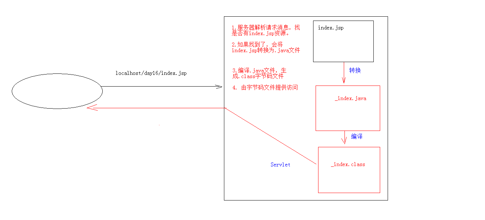

32-Cookie、Session、EL及JSTL

# 1.会话技术

会话：一次会话中包含多次请求和响应。

一次会话：浏览器第一次给服务器资源发送请求，会话建立，直到有一方断开为止

功能：在一次会话的范围内的多次请求间，共享数据

方式：

1. 客户端会话技术：cookie
2. 服务器端会话技术：session

# 2. cookie 

概念：客户端会话技术，将数据保存到客户端


## 2.1 cookie快速入门

1. 创建cookie对象，绑定数据

   语法：

   ```java
   new Cookie(String name, String value) 
   ```

   示例：

   ```java
   //1.创建cookie对象
   Cookie c = new Cookie("msg", "hello");
   ```

2. 发送cookie对象

   语法：

   ```java
    response.addCookie(Cookie cookie) 
   ```

   示例：

   ```java
   //2.发送cookie
   response.addCookie(c);
   ```

3. 获取cookie，拿到数据

   语法：

   ```java
   Cookie[]  request.getCookies()  
   ```

   示例：

   ```java
   //3. 获取cookies
   Cookie[] cookies = request.getCookies();
   //获取数据，遍历cookies
   if(cookies != null){
       for (Cookie cookie : cookies) {
           String name = cookie.getName();
           String value = cookie.getValue();
           System.out.println(name +"  " + value); // msg  hello
       }
   }
   ```

## 2.2 cookie 细节

1. 实现原理

    基于响应头set-cookie和请求头cookie实现

2. 一次是否可以发送多个cookie？

   可以创建多个Cookie对象，使用response调用多次addCookie方法发送cookie即可。

3. cookie在浏览器中保存多长时间？

   - 默认情况下，当浏览器关闭后，cookie数据被销毁

   - 持久化存储：

     语法：

     ```
     etMaxAge(int seconds)
     1. 正数：将Cookie数据写到硬盘的文件中。持久化存储。并指定cookie存活时间，时间到后，cookie文件自动失效
     2. 负数：默认值
     3. 零：删除cookie信息
     ```

     示例：

     ```java
     //1.创建cookie对象
     Cookie c = new Cookie("msg", "hello");
     //2. 设置cookie的存活时间
     c.setMaxAge(30);// 将cookie持久化到硬盘，30秒后删除cookie文件
     c.setMaxAge(-1);// 默认，关闭浏览器时清除cookie
     c.setMaxAge(0);// 删除cookie
     ```

4. cookie能够存储中文？

   - 在tomcat 8 之前 cookie中不能直接存储中文数据。

     需要将中文数据转码---一般采用URL编码(%E3)

   - 在tomcat 8 之后，cookie支持中文数据。特殊字符还是不支持，建议使用URL编码存储，URL解码解析

   - 案例：上次访问时间

     ```java
     @WebServlet("/cookieDemo05")
     public class cookieDemo05 extends HttpServlet {
         protected void doPost(HttpServletRequest request, HttpServletResponse response) throws ServletException, IOException {
             //设置响应的消息体数据格式及编码
             response.setContentType("text/html;charset=utf-8");
             //1. 获取所有cookie
             Cookie[] cookies = request.getCookies();
             boolean flag = false;//没有cookie为lastTime
             //2.遍历cookie
             if (cookies!=null && cookies.length > 0){
                 for (Cookie cookie : cookies) {
                     //3.获取cookie名称
                     String name = cookie.getName();
                     //4. 判断名称是不是；lastTime
                     if("lastTime".equals(name)){
                         //有cookie，不是第一次访问
                         flag = true;// 有lastTime的cookie
     
                         // 设置cookie的value
                         // 获取当前时间的字符串，重新设置cookie的值，并重新发送
                         Date date = new Date();
                         SimpleDateFormat sdf = new SimpleDateFormat("yyyy年MM月dd日 HH:mm:ss"); //如果不做处理，这里的空格会报错
                         String str_date = sdf.format(date);
                         System.out.println("编码前："+str_date);  // 编码前：2020年04月10日 10:02:14
                         //URL编码
                         str_date = URLEncoder.encode(str_date,"utf-8");
                         System.out.println("编码后："+str_date); // 编码后：2020%E5%B9%B404%E6%9C%8810%E6%97%A5+10%3A02%3A14
                         cookie.setValue(str_date);
                         //设置cookie存活时间
                         cookie.setMaxAge(60*60*24*30);//1个月
                         response.addCookie(cookie);
     
                         //响应数据
                         //获取cookie的value
                         String value = cookie.getValue();
                         System.out.println("解码前："+value); // 解码前：2020%E5%B9%B404%E6%9C%8810%E6%97%A5+10%3A02%3A14
                         value = URLDecoder.decode(value ,"utf-8");
                         System.out.println("解码后："+value); // 解码后：2020年04月10日 10:02:14
                         response.getWriter().write("<h1>欢迎回来，您上次访问时间为："+ value +"</h1>");
                         break;
                     }
                 }
             }
     
             if(cookies == null ||  cookies.length == 0 || flag == false ){
                 //第一次访问
                 // 设置cookie的value
                 // 获取当前时间的字符串，重新设置cookie的值，并重新发送
                 Date date = new Date();
                 SimpleDateFormat sdf = new SimpleDateFormat("yyyy年MM月dd日 HH:mm:ss");
                 String str_date = sdf.format(date);
                 System.out.println("编码前："+str_date);// 编码前：2020年04月10日 10:01:47
                 //URL编码
                 str_date = URLEncoder.encode(str_date,"utf-8");
                 System.out.println("编码后："+str_date);// 编码后：2020%E5%B9%B404%E6%9C%8810%E6%97%A5+10%3A01%3A47
                 Cookie cookie = new Cookie("lastTime", str_date);
                 cookie.setValue(str_date);
                 //设置cookie存活时间
                 cookie.setMaxAge(60*60*24*30);//1个月
                 response.addCookie(cookie);
     
                 response.getWriter().write("<h1>欢迎您首次访问</h1>");
             }
     
         }
     
         protected void doGet(HttpServletRequest request, HttpServletResponse response) throws ServletException, IOException {
             this.doPost(request, response);
         }
     }
     
     ```

5. cookie共享问题？

   - 假设在一个tomcat服务器中，部署了多个web项目，那么在这些web项目中cookie能不能共享？

     - 默认情况下cookie不能共享
     - `setPath(String path) `：设置cookie的获取范围。默认情况下，设置当前的虚拟目录

     ```java
     // 设置cookie共享
     c.setPath("/"); // /代表当前项目根路径
     ```

   - 不同的tomcat服务器间cookie共享问题？

     - `setDomain(String path)` ：如果设置一级域名相同，那么多个服务器之间cookie可以共享

     ```java
     setDomain(".baidu.com")
     // 那么tieba.baidu.com和news.baidu.com中cookie可以共享
     ```

6. cookie的特点和作用

   - cookie存储数据在客户端浏览器
   -  浏览器对于单个cookie 的大小有限制(4kb) 以及 对同一个域名下的总cookie数量也有限制(20个)
   - 作用：
     -  cookie一般用于存出少量的不太敏感的数据
     - 在不登录的情况下，完成服务器对客户端的身份识别

# 3. JSP入门学习

概念：Java Server Pages： java服务器端页面

- 可以理解为：一个特殊的页面，其中既可以指定定义html标签，又可以定义java代码
- 用于简化书写

原理： JSP本质上就是一个Servlet



## 3.1 JSP脚本

JSP定义Java代码的方式

1. <%  代码 %>

   定义的java代码，在service方法中。service方法中可以定义什么，该脚本中就可以定义什么。

   ```jsp
   <%
          System.out.println("hello jsp");
   %>
   ```

2.  <%! 代码 %>

   定义的java代码，在jsp转换后的java类的成员位置。

3. <%= 代码 %>

   定义的java代码，会输出到页面上。输出语句中可以定义什么，该脚本中就可以定义什么。

## 3.2 JSP内置对象

在jsp页面中不需要获取和创建，可以直接使用的对象
jsp一共有9个内置对象

| 变量名      | 真实类型            | 作用                                         |
| ----------- | ------------------- | -------------------------------------------- |
| pageContext | PageContext         | 当前页面共享数据，还可以获取其他八个内置对象 |
| request     | HttpServletRequest  | 一次请求访问的多个资源(转发)                 |
| session     | HttpSession         | 一次会话的多个请求间                         |
| application | ServletContext      | 所有用户间共享数据                           |
| response    | HttpServletResponse | 响应对象                                     |
| page        | Object              | 当前页面(Servlet)的对象  this                |
| out         | JspWriter           | 输出对象，数据输出到页面上                   |
| config      | ServletConfig       | Servlet的配置对象                            |
| exception   | Throwable           | 异常对象                                     |

**关于：out**

字符输出流对象。可以将数据输出到页面上。和response.getWriter()类似

`response.getWriter()`和`out.write()`的区别：

- 在tomcat服务器真正给客户端做出响应之前，会先找response缓冲区数据，再找out缓冲区数据。
- response.getWriter()数据输出永远在out.write()之前

## 3.3 指令

作用：用于配置JSP页面，导入资源文件

格式：`<%@ 指令名称 属性名1=属性值1 属性名2=属性值2 ... %>`

分类：

1. page：配置JSP页面的

   ```jsp
   <%@ 指令名称 属性名1=属性值1 属性名2=属性值2 ... %>
   ```

   -  contentType：等同于response.setContentType()
     - 设置响应体的mime类型以及字符集
     - 设置当前jsp页面的编码（只能是高级的IDE才能生效，如果使用低级工具，则需要设置pageEncoding属性设置当前页面的字符集）
   - import：导包
   - errorPage：当前页面发生异常后，会自动跳转到指定的错误页面
   - isErrorPage：标识当前也是是否是错误页面。
     - true：是，可以使用内置对象exception
     -  false：否。默认值。不可以使用内置对象exception

2. include：页面包含的。导入页面的资源文件

   ```jsp
    <%@include file="top.jsp"%>
   ```

3.  taglib：导入资源

   ```jsp
    <%@ taglib prefix="c" uri="http://java.sun.com/jsp/jstl/core" %>
   ```

## 3.4 注释

-  html注释：
    		`<!-- -->`只能注释html代码片段
-  jsp注释：推荐使用
    		`<%-- --%>`可以注释所有

# 4.Session

概念：服务器端会话技术，在一次会话的多次请求间共享数据，将数据保存在服务器端的对象中。HttpSession


## 4.1 session 入门

1. 获取HttpSession对象

   ```java
    // 1. 获取session
   HttpSession session = request.getSession();
   ```

2. 使用HttpSession对象：

   语法：

   ```java
   Object getAttribute(String name)   //获取数据
   void setAttribute(String name, Object value)//设置数据
   void removeAttribute(String name)  // 删除
   ```

   示例：

   ```java
   @WebServlet("/sessionDemo01")
   public class sessionDemo01 extends HttpServlet {
       protected void doPost(HttpServletRequest request, HttpServletResponse response) throws ServletException, IOException {
           // 使用session共享数据
   
           // 1. 获取session
           HttpSession session = request.getSession();
           // 2. 存储数据
           session.setAttribute("msg","hello session");
       }
   
       protected void doGet(HttpServletRequest request, HttpServletResponse response) throws ServletException, IOException {
           this.doPost(request, response);
       }
   }
   ```

   ```java
   @WebServlet("/sessionDemo02")
   public class sessionDemo02 extends HttpServlet {
       protected void doPost(HttpServletRequest request, HttpServletResponse response) throws ServletException, IOException {
           // 使用session共享数据
   
           // 1. 获取session
           HttpSession session = request.getSession();
           ///2. 获取数据
           Object msg = session.getAttribute("msg");
           System.out.println(msg); // hello session
       }
   
       protected void doGet(HttpServletRequest request, HttpServletResponse response) throws ServletException, IOException {
           this.doPost(request, response);
       }
   }
   ```

## 4.2 session 细节

1. 原理

   Session的实现是依赖于Cookie的。

2. 当客户端关闭后，服务器不关闭，两次获取session是否为同一个？

   - 默认情况下。不是。

   - 如果需要相同，则可以创建Cookie,键为JSESSIONID，设置最大存活时间，让cookie持久化保存。

   示例：

   ```java
   @WebServlet("/sessionDemo03")
   public class sessionDemo03 extends HttpServlet {
       protected void doPost(HttpServletRequest request, HttpServletResponse response) throws ServletException, IOException {
           // 1. 获取session
           HttpSession session = request.getSession();
   
           //期望客户端关闭后，session也能相同
           Cookie c = new Cookie("JSESSIONID", session.getId());
           c.setMaxAge(60*60);
           response.addCookie(c);
           System.out.println(session);
       }
   
       protected void doGet(HttpServletRequest request, HttpServletResponse response) throws ServletException, IOException {
           this.doPost(request, response);
       }
   }
   ```

3. 客户端不关闭，服务器关闭后，两次获取的session是同一个吗？

   不是同一个，但是要确保数据不丢失。tomcat自动完成以下工作

   - session的钝化：

     在服务器正常关闭之前，将session对象系列化到硬盘上

   - session的活化：

     在服务器启动后，将session文件转化为内存中的session对象即可。

4. session什么时候被销毁？

   - 服务器关闭

   - session对象调用invalidate() 。

   - session默认失效时间 30分钟

     选择性配置修改：tomcat服务器的web.xml文件，也可以选择项目中的web.xml

     ```xml
     <session-config>
     	<session-timeout>30</session-timeout>
     </session-config>
     ```

5. session的特点：

   -  session用于存储一次会话的多次请求的数据，存在服务器端
   -  session可以存储任意类型，任意大小的数据

6. session与cookie的区别

   - session存储数据在服务器端，Cookie在客户端
   - session没有数据大小限制，Cookie有
   - session数据安全，Cookie相对于不安全

# 5. 案例：验证码登录

案例需求：

1.  访问带有验证码的登录页面login.jsp
2. 用户输入用户名，密码以及验证码。
   -  如果用户名和密码输入有误，跳转登录页面，提示:用户名或密码错误
   - 如果验证码输入有误，跳转登录页面，提示：验证码错误
   - 如果全部输入正确，则跳转到主页success.jsp，显示：用户名,欢迎您


实现：

- login.jsp

  ```jsp
  <%@ page contentType="text/html;charset=UTF-8" language="java" %>
  <html>
  <head>
      <title>login</title>
  
  
      <script>
          window.onload = function(){
              document.getElementById("img").onclick = function(){
                  this.src="/request/checkCodeServlet?time="+new Date().getTime();
              }
          }
  
  
      </script>
  
  
      <style>
          div{
              color: red;
          }
  
      </style>
  </head>
  <body>
  
      <form action="/request/loginServlet1" method="post">
          <table>
              <tr>
                  <td>用户名</td>
                  <td><input type="text" name="username"></td>
              </tr>
              <tr>
                  <td>密码</td>
                  <td><input type="password" name="password"></td>
              </tr>
              <tr>
                  <td>验证码</td>
                  <td><input type="text" name="checkCode"></td>
              </tr>
              <tr>
                  <td colspan="2"></td>
              </tr>
              <tr>
                  <td colspan="2"><input type="submit" value="登录"></td>
              </tr>
          </table>
  
  
      </form>
  
      ${requestScope.cc_error}
      ${requestScope.login_error}
  
  <%--    <div><%=request.getAttribute("cc_error") == null ? "" : request.getAttribute("cc_error")%></div>--%>
  <%--    <div><%=request.getAttribute("login_error") == null ? "" : request.getAttribute("login_error") %></div>--%>
  
  </body>
  </html>
  
  ```

- User类

  ```java
  package domain;
  
  /**
   * @Class:tomcat.domain.User
   * @Descript:实体类
   * @Author:宋天
   * @Date:2020/4/8
   */
  
  /**
   * 用户的实体类
   */
  public class User {
  
      private int id;
      private String username;
      private String password;
  
      public User(String username, String password) {
          this.username = username;
          this.password = password;
      }
  
      public User() {
      }
  
      public int getId() {
          return id;
      }
  
      public void setId(int id) {
          this.id = id;
      }
  
      public String getUsername() {
          return username;
      }
  
      public void setUsername(String username) {
          this.username = username;
      }
  
      public String getPassword() {
          return password;
      }
  
      public void setPassword(String password) {
          this.password = password;
      }
  
      @Override
      public String toString() {
          return "User{" +
                  "id=" + id +
                  ", username='" + username + '\'' +
                  ", password='" + password + '\'' +
                  '}';
      }
  }
  
  ```

- sql类

  ```java
  package domain;
  
  import domain.utils.JDBCUtils;
  import org.springframework.dao.DataAccessException;
  import org.springframework.jdbc.core.BeanPropertyRowMapper;
  import org.springframework.jdbc.core.JdbcTemplate;
  
  /**
   * @Class:tomcat.domain.UserDao
   * @Descript:操作数据库中user表的类
   * @Author:宋天
   * @Date:2020/4/8
   */
  /**
   * 操作数据库中User表的类
   */
  public class UserDao {
      //声明JDBCTemplate对象共用
      private JdbcTemplate template = new JdbcTemplate(JDBCUtils.getDataSource());
      /**
       * 登录方法
       * @param loginUser 只有用户名和密码
       * @return user包含用户全部数据,没有查询到，返回null
       */
      public User login(User loginUser){
          try {
              //1.编写sql
              String sql = "select * from user where username = ? and password = ?";
              //2.调用query方法
              User user = template.queryForObject(sql,
                      new BeanPropertyRowMapper<User>(User.class),
                      loginUser.getUsername(), loginUser.getPassword());
              return user;
          } catch (DataAccessException e) {
              e.printStackTrace();//记录日志
              return null;
          }
      }
  }
  
  ```

- loginServlet1

  ```java
  package session.checkCode;
  
  import domain.User;
  import domain.UserDao;
  
  import javax.servlet.ServletException;
  import javax.servlet.annotation.WebServlet;
  import javax.servlet.http.HttpServlet;
  import javax.servlet.http.HttpServletRequest;
  import javax.servlet.http.HttpServletResponse;
  import javax.servlet.http.HttpSession;
  import java.io.IOException;
  
  /**
   * @Class:tomcat.${PACKAGE_NAME}.${NAME}
   * @Descript:
   * @Author:宋天
   * @Date:2020/4/8
   */
  @WebServlet("/loginServlet1")
  public class loginServlet1 extends HttpServlet {
      protected void doPost(HttpServletRequest request, HttpServletResponse response) throws ServletException, IOException {
  
          //1. 设置编码
          request.setCharacterEncoding("utf-8");
          //2.获取请求参数
          String username = request.getParameter("username");
          String password = request.getParameter("password");
          String checkCode = request.getParameter("checkCode");
          //3. 先获取生成的验证码
          HttpSession session = request.getSession();
          String checkCode_session = (String)session.getAttribute("checkCode_Session");
          //删除session中存储的验证码
          session.removeAttribute("checkCode_Session");
  
          //4.封装user对象
          User loginUser = new User();
          loginUser.setUsername(username);
          loginUser.setPassword(password);
          System.out.println(loginUser);
          //5.调用userDao的login方法
          UserDao dao = new UserDao();
          User login = dao.login(loginUser);
          System.out.println(login);
  
          //6.. 判断验证码是否正确
          if (checkCode_session != null && checkCode_session.equalsIgnoreCase(checkCode)){
  
              //验证码正确
              //忽略大小写比较
              // 判断用户名和密码是否一致
              if (login != null){
                  //登录成功
                  //存储信息，用户信息
                  session.setAttribute("user",username);
                  //重定向到success.jsp
                  response.sendRedirect(request.getContextPath()+"/success.jsp");
              }else {
                  //登录失败
                  //存储提示信息到request
                  request.setAttribute("login_error","用户名或密码错误");
                  //转发到登录页面
                  request.getRequestDispatcher("/login.jsp").forward(request,response);
              }
  
          }else{
              //验证码不一致
              //存储提示信息到request
              request.setAttribute("cc_error","验证码错误");
              //转发到登录页面
              request.getRequestDispatcher("/login.jsp").forward(request,response);
          }
  
      }
  
      protected void doGet(HttpServletRequest request, HttpServletResponse response) throws ServletException, IOException {
          this.doPost(request,response);
  
      }
  }
  
  ```

- checkCodeServlet

  ```java
  package session.checkCode;
  
  import javax.imageio.ImageIO;
  import javax.servlet.ServletException;
  import javax.servlet.annotation.WebServlet;
  import javax.servlet.http.HttpServlet;
  import javax.servlet.http.HttpServletRequest;
  import javax.servlet.http.HttpServletResponse;
  import java.awt.*;
  import java.awt.image.BufferedImage;
  import java.io.IOException;
  import java.util.Random;
  
  /**
   * @Class:tomcat.${PACKAGE_NAME}.${NAME}
   * @Descript:
   * @Author:宋天
   * @Date:2020/4/9
   */
  @WebServlet( "/checkCodeServlet")
  public class checkCodeServlet extends HttpServlet {
      protected void doPost(HttpServletRequest request, HttpServletResponse response) throws ServletException, IOException {
          int width = 100;
          int height = 50;
          // 1. 创建对象，在内存中画图
          BufferedImage image = new BufferedImage(width,height,BufferedImage.TYPE_3BYTE_BGR);
          //2. 美化图片
          //填充背景色
          Graphics g = image.getGraphics();//画笔对象
          g.setColor(Color.PINK);//设置画笔颜色
          g.fillRect(0,0,width,height);
  
          //画边框
          g.setColor(Color.BLUE);
          g.drawRect(0,0,width-1,height-1);//会溢出来所以减一
  
          //验证码出现的可能
          String str = "QWERTYUIOPASDFGHJKLZXCVNMqwertyuiopasdfghklzxcvbnm0123456789";
          //生成随机角表
          Random random = new Random();
          StringBuilder sb = new StringBuilder();
          for (int i = 1; i <= 4; i++) {
              int index = random.nextInt(str.length());
              //获取字符
              char ch = str.charAt(index);//随机字符
              sb.append(ch);
              // 写验证码
              g.drawString(ch+"",width/5*i,height/2);
          }
          String checkCode_Session = sb.toString();
          //将验证码存入session
          request.getSession().setAttribute("checkCode_Session",checkCode_Session);
  
          //画干扰线
          g.setColor(Color.green);
          //随机生成坐标点
          for (int i = 0; i < 10; i++) {
              int x1 = random.nextInt(width);
              int x2 = random.nextInt(width);
              int y1 = random.nextInt(height);
              int y2 = random.nextInt(height);
              g.drawLine(x1,y1,x2,y2);
          }
  
          //3. 将图片输出到页面展示
          ImageIO.write(image,"jpg",response.getOutputStream());
      }
  
      protected void doGet(HttpServletRequest request, HttpServletResponse response) throws ServletException, IOException {
          this.doPost(request,response);
      }
  }
  
  ```

# 6.MVC 开发模式简介


1.  jsp演变历史

   - 早期只有servlet，只能使用response输出标签数据，非常麻烦
   - 后来又jsp，简化了Servlet的开发，如果过度使用jsp，在jsp中即写大量的java代码，有写html表，造成难于维护，难于分工协作
   - 再后来，java的web开发，借鉴mvc开发模式，使得程序的设计更加合理性

2. MVC

   - M：Model，模型。JavaBean

     完成具体的业务操作，如：查询数据库，封装对象

   -  V：View，视图。JSP

     展示数据

   - C：Controller，控制器。Servlet

     -  获取用户的输入
     - 调用模型
     - 将数据交给视图进行展示

3. 优缺点

   - 优缺点

     - 耦合性低，方便维护，可以利于分工协作
     -  重用性高

   - 缺点

     使得项目架构变得复杂，对开发人员要求高

# 7.EL表达式

概念：Expression Language 表达式语言

作用：替换和简化jsp页面中java代码的编写

语法：`${表达式}`

注意：

jsp默认支持el表达式的。如果要忽略el表达式
1. 设置jsp中page指令中：`isELIgnored="true" `忽略当前jsp页面中所有的el表达式
2. `${表达式} `：忽略当前这个el表达式

## 7.1 使用

1. 运算

   运算符

   - 算数运算符： + - * /(div) %(mod)
   - 比较运算符： > < >= <= == !=
   - 逻辑运算符： &&(and) ||(or) !(not)
   - 空运算符： empty
     - 功能：用于判断字符串、集合、数组对象是否为null或者长度是否为0
     -  ${empty list}:判断字符串、集合、数组对象是否为null或者长度为0
     - ${not empty str}:表示判断字符串、集合、数组对象是否不为null 并且 长度>0

2. 获取值

   -  el表达式只能从域对象中获取值

   - 语法：

     ```
     ${域名称.键名}  从指定域中获取指定键的值
     ```

     域名称

     1. pageScope		--> pageContext
     2. requestScope 	--> request
     3. sessionScope 	--> session
     4. applicationScope --> application（ServletContext）

     示例：

     ```jsp
     <%
     // 在域中存储数据
     request.setAttribute("name","张三");
     session.setAttribute("age","22");
     %>
     
     ${requestScope.name}
     ${sessionScope.age}
     ${requestScope.sex}  <%-- 不输出任何东西，不会报错 -- %>
     ```

3. 获取对象：List集合、Map集合的值

   -  对象：${域名称.键名.属性名}

     ```jsp
       <%
              User user = new User();
              user.setUsername("张三");
              user.setPassword("123");
     
              request.setAttribute("u",user);
      %>
     ${requestScope.u.username}
     ```

     

   -  List集合：${域名称.键名[索引]}

     示例：

     ```jsp
          <%
              List list = new ArrayList<>();
              list.add(1);
              list.add(2);
              list.add(3);
              list.add(user);
              request.setAttribute("list",list);
     
          %>
     
     ${list}
     ${list[0]}
     ${list[10]} <!--越界不报错-->
     ```

   - Map集合：

     -  ${域名称.键名.key名称}
     -  ${域名称.键名["key名称"]}

     示例：

     ```jsp
      <%
      Map map = new HashMap<>();
      map.put("name","李四");
      map.put("sex","男");
      map.put("user",user);
      request.setAttribute("map",map);
     %>
          
     ${map}
     ${map.sex}
     ${map["name"]}
     ${map.user.username} 
     ```

4. 隐式对象

   - el表达式中有11个隐式对象

   - pageContext：

     - 获取jsp其他八个内置对象
     - ${pageContext.request.contextPath}：动态获取虚拟目录

     ```jsp
     ${pageContext.request} 
     
     ${pageContext.request.contextPath}
     ```

# 8.JSTL

概念：JavaServer Pages Tag Library  JSP标准标签库

是由Apache组织提供的开源的免费的jsp标签		<标签>

作用：用于简化和替换jsp页面上的java代码


使用步骤：

1. 导入jstl相关jar包

2.  引入标签库：taglib指令：  <%@ taglib %>

   ```jsp
   <%@taglib prefix="c" uri="http://java.sun.com/jsp/jstl/core" %>
   ```

3. 使用标签

## 8.1  常用的JSTL标签

1. if：相当于java代码的if语句

   属性： test 必须属性，接受boolean表达式

   - 如果表达式为true，则显示if标签体内容，如果为false，则不显示标签体内容
   -  一般情况下，test属性值会结合el表达式一起使用

   ```jsp
   <%@taglib prefix="c" uri="http://java.sun.com/jsp/jstl/core" %>
   <%--
   c:if标签：
    test属性，接受Boolean表达式
    如果表达式 为true，则显示if标签体内容，反之则不显示
   --%>
   
   <c:if test="true">
       真。。。
   </c:if>
   
   <%-- 一般情况下，test属性值会结合el表达式一起使用--%>
   <%
       //判断request域中的一个list集合是否为空，如果不为空则遍历集合
       List list = new ArrayList<>();
       list.add("aaa");
       request.setAttribute("list",list);
       request.setAttribute("number",3);
   %>
   <c:if test="${not empty list}">
       真。。。
   </c:if>
   
   <c:if test="${number % 2 != 0}">
       ${number}为奇数
   </c:if>
   
   ```

   注意：`c:if`标签没有else情况，想要else情况，则可以在定义一个`c:if`标签

2. choose：相当于java代码的switch语句

   -  使用choose标签声明         			相当于switch声明
   - 使用when标签做判断         			相当于case
   - 使用otherwise标签做其他情况的声明    	相当于default

   ```jsp
   <%@taglib prefix="c" uri="http://java.sun.com/jsp/jstl/core" %>
   <%--
   完成数字编号对应的星期几案例
   --%>
   <%
       request.setAttribute("number",3);
   %>
   <c:choose>
       <c:when test="${number == 1}">星期一</c:when>
       <c:when test="${number == 2}">星期二</c:when>
       <c:when test="${number == 3}">星期三</c:when>
       <c:when test="${number == 4}">星期四</c:when>
       <c:when test="${number == 5}">星期五</c:when>
       <c:when test="${number == 6}">星期六</c:when>
       <c:when test="${number == 7}">星期七</c:when>
   
       <c:otherwise>数字输入有误</c:otherwise>
   </c:choose>
   
   ```

3.  foreach：相当于java代码的for语句

   - for循环操作

     属性：

     - begin 开始值

     - end 结束值

     - var 临时变量

     - step 步长

     - varStatus 循环状态对象

       - index ： 容器中元素的索引，从0开始

       - count ： 循环次数，从1开始

     ```jsp
     <c:forEach begin="1" end="10" var="i" step="1" varStatus="s">
     
         ${i}<br>
         ${s.index}<br>
         ${s.count}<br> 
     </c:forEach>
     ```

   - 遍历容器
     属性：

     - items 容器对象
     - var 容器中元素的临时变量
     - varStatus 循环状态对象
       -  index ： 容器中元素的索引，从0开始
       - count ： 循环次数，从1开始

     ```jsp
     <%
         List list = new ArrayList();
         list.add("aaa");
         list.add("bbb");
         list.add("ccc");
         list.add("ddd");
         request.setAttribute("list",list);
     %>
     <c:forEach items="${list}" var="str" varStatus="s">
         ${s.index}
         ${s.count}
         ${str}
     </c:forEach>
     ```


## 8.2 练习

需求：在request域中有一个存有User对象的List集合。需要使用jstl+el将list集合数据展示到jsp页面的表格table中

```jsp
<%@ page import="java.util.ArrayList" %>
<%@ page import="java.util.List" %>
<%@ page import="domain.User" %><%--
  Created by IntelliJ IDEA.
  User: 宋天
  Date: 2020/4/11
  Time: 8:38
  To change this template use File | Settings | File Templates.
--%>
<%@ page contentType="text/html;charset=UTF-8" language="java" %>
<%@taglib prefix="c" uri="http://java.sun.com/jsp/jstl/core" %>
<html>
<head>
    <title>Title</title>
</head>
<body>

<%--
练习：在request域中存有一个user对象的list集合，需要使用jstl+el将list集合数据展示到jsp页面的表格table中
--%>
<%
    List list = new ArrayList();
    list.add(new User("张三","123"));
    list.add(new User("李四","456"));
    list.add(new User("王五","789"));
    request.setAttribute("list",list);
%>

<table border="1" width="500" align="center">
    <tr>
        <th>编号</th>
        <th>账户</th>
        <th>密码</th>
    </tr>
<%--    数据--%>
    <c:forEach items="${list}" var="user" varStatus="s">
        <c:if test="${s.count % 2 == 0}">
            <tr bgcolor="aqua">
                <td>${s.count}</td>
                <td>${user.username}</td>
                <td>${user.password}</td>
            </tr>
        </c:if>

        <c:if test="${s.count % 2 != 0}">
            <tr bgcolor="#7fffd4">
                <td>${s.count}</td>
                <td>${user.username}</td>
                <td>${user.password}</td>
            </tr>
        </c:if>
    </c:forEach>

</table>

</body>
</html>

```

# 9. 三层架构


1. 界面层(表示层)：用户看的得界面。用户可以通过界面上的组件和服务器进行交互
2. 业务逻辑层：处理业务逻辑的。
3. 数据访问层：操作数据存储文件。

# 10.Filter

概念：

- 生活中的过滤器：净水器,空气净化器，土匪、
-  web中的过滤器：当访问服务器的资源时，过滤器可以将请求拦截下来，完成一些特殊的功能。

作用：一般用于完成通用的操作。如：登录验证、统一编码处理、敏感字符过滤...

## 10.1 Filter使用

步骤：

- 定义一个类，实现接口Filter
- 复写方法
- 配置拦截路径
  - web.xml
  - 注解

示例：

```java
@WebFilter("/*") //访问所有资源之前，都会执行该过滤器
public class FilterDemo03 implements Filter {
    // 在服务器关闭后，Filter对象被销毁。如果服务器正常关闭，则执行destroy方法
    public void destroy() {
        System.out.println("destroy");
    }

    //每一次请求被拦截资源时都会执行，
    public void doFilter(ServletRequest req, ServletResponse resp, FilterChain chain) throws ServletException, IOException {

        System.out.println("doFilter....");

        //放行
        chain.doFilter(req, resp);

    }

    //在服务器启动后创建。会创建filter对象，然后调用init方法，只执行一次
    public void init(FilterConfig config) throws ServletException {
        System.out.println("init...");
    }

}

```

## 10.2 Filter细节

1. web.xml配置

   ```xml
   <filter>
       <filter-name>demo01</filter-name>
       <filter-class>filter.filterDemo01</filter-class>
   
   </filter>
   <filter-mapping>
           <filter-name>demo01</filter-name>
       	<!-- 拦截路径 -->
           <url-pattern>/*</url-pattern>
   </filter-mapping>
   ```

2. 过滤器执行流程

   - 执行过滤器
   - 执行放行后的资源
   -  回来执行过滤器放行代码下边的代码

3. 过滤器生命周期方法

   - init：在服务器启动后，会创建Filter对象，然后调用init方法。只执行一次。用于加载资源
   - doFilter：每一次请求被拦截资源时，会执行。执行多次
   - destroy：在服务器关闭后，Filter对象被销毁。如果服务器是正常关闭，则会执行destroy方法。只执行一次。用于释放资源

4. 过滤器配置详解

   - 拦截路径配置：

     ```
     1. 具体资源路径： /index.jsp   只有访问index.jsp资源时，过滤器才会被执行
     2. 拦截目录： /user/*	访问/user下的所有资源时，过滤器都会被执行
     3. 后缀名拦截： *.jsp		访问所有后缀名为jsp资源时，过滤器都会被执行
     4. 拦截所有资源：/*		访问所有资源时，过滤器都会被执行
     ```

   - 拦截方式配置：资源被访问的方式

     注解配置：设置dispatcherTypes属性

     ```
     1. REQUEST：默认值。浏览器直接请求资源
     2. FORWARD：转发访问资源
     3. INCLUDE：包含访问资源
     4. ERROR：错误跳转资源
     5. ASYNC：异步访问资源
     ```

     示例：

     ```
     @WebFilter(value = "/*",dispatcherTypes = DispatcherType.FORWARD)
     @WebFilter(value = "/*",dispatcherTypes = {DispatcherType.FORWARD,DispatcherType.ERROR})
     ```

     web.xml配置： 设置`<dispatcher></dispatcher>`标签即可

     示例：

     ```xml
     <filter>
         <filter-name>demo01</filter-name>
         <filter-class>filter.filterDemo01</filter-class>
     
     </filter>
     <filter-mapping>
         <filter-name>demo01</filter-name>
         <url-pattern>/*</url-pattern>
         <dispatcher>ERROR</dispatcher>
     </filter-mapping>
     ```

5. 过滤器链（配置多个过滤器）

   - 执行顺序：如果有两个过滤器：过滤器1和过滤器2

     ```
     1. 过滤器1
     2. 过滤器2
     3. 资源执行
     4. 过滤器2
     5. 过滤器1 
     ```

   - 过滤器先后顺序问题：

     - 注解配置：按照类名的字符串比较规则比较，值小的先执行

       如： AFilter 和 BFilter，AFilter就先执行了。

     - web.xml配置： `<filter-mapping>`标签谁定义在上边，谁先执行

## 10.3 案例：登录验证

需求：

1. 访问case案例的资源。验证其是否登录
2. 如果登录了，则直接放行。
3. 如果没有登录，则跳转到登录页面，提示"您尚未登录，请先登录"。

直接在case模块下添加如下类即可

```java
@WebFilter("/*")
public class loginFilter implements Filter {
    public void destroy() {
    }

    public void doFilter(ServletRequest req, ServletResponse resp, FilterChain chain) throws ServletException, IOException {
        //强制转换
        HttpServletRequest request = (HttpServletRequest) req;
        // 1. 获取资源请求路径
        String uri = request.getRequestURI();
        //2. 判断是否包含登录相关资源路径，要注意排除掉css,JS,图片，验证码等资源
        if (uri.contains("/login.jsp") || uri.contains("/loginServlet") || uri.contains("/css/") || uri.contains("/js/") || uri.contains("/fonts/") || uri.contains("/checkCodeServlet") ){
            //包含，用户就是想要登录。放行
            chain.doFilter(req, resp);
        }else {
            // 不包含，需要验证用户是否登录
            //3. 从获取session中获取user
            Object user = request.getSession().getAttribute("user");
            if(user!=null){
                //登录了
                chain.doFilter(req, resp);
            }else {
                //没登录
                request.setAttribute("login_msg","您尚未登录，请登录！");
                request.getRequestDispatcher("/login.jsp").forward(request,resp);
            }
        }


    }

    public void init(FilterConfig config) throws ServletException {

    }

}
```

## 10.4 增强对象的功能

增强对象的功能：设计模式：一些通用的解决固定问题的方式

 **代理模式**

概念

- 真实对象：被代理的对象
- 代理对象：
- 代理模式：代理对象代理真实对象，达到增强真实对象功能的目的

**实现方式：**

- 静态代理：有一个类文件描述代理模
- 动态代理：在内存中形成代理类

**实现步骤：**

- 代理对象和真实对象实现相同的接口
- 代理对象 = Proxy.newProxyInstance();
- 使用代理对象调用方法。
- 增强方法

**增强方式：**

- 增强参数列表
- 增强返回值类型
- 增强方法体执行逻辑	

示例：

1. 定义一个接口saleComputer

   ```java
   public interface saleComputer {
       public String sale(double money);
       public void show();
   }
   ```

2. 定义接口实现类Lenovo

   ```java
   public class Lenovo implements saleComputer{
       @Override
       public String sale(double money) {
           System.out.println("花了"+money+"元买了联想电脑。。");
           return "联想";
       }
   
       @Override
       public void show() {
           System.out.println("展示电脑");
       }
   }
   ```

3. 创建ProxyTest测试类

   ```java
   package filter;
   
   import java.lang.reflect.InvocationHandler;
   import java.lang.reflect.Method;
   import java.lang.reflect.Proxy;
   
   /**
    * @Class:tomcat.filter.ProxyTest
    * @Descript:
    * @Author:宋天
    * @Date:2020/4/13
    */
   public class ProxyTest {
       public static void main(String[] args) {
           //1.创建真实对象
           Lenovo lenovo = new Lenovo();
   
           //动态代理增强Lenovo对象
           /**
            * 参数：
            * 1. 类加载器   真实对象.getClass().getClassLoader()
            * 2. 接口数组    真实对象.getClass().getInterfaces()
            * 3. 处理器       new InvocationHandler() 需要实现一个方法
            */
           saleComputer proxyInstance = (saleComputer)Proxy.newProxyInstance(lenovo.getClass().getClassLoader(), lenovo.getClass().getInterfaces(), new InvocationHandler() {
               //代理逻辑编写的方法，代理对象调用的所有方法都会触发该方法执行
   
               /**
                *
                * @param proxy 代理对象
                * @param method 代理对象调用的方法，被封装的对象
                * @param args  代理对象调用的方法时，传递的实际参数
                * @return
                * @throws Throwable
                */
               @Override
               public Object invoke(Object proxy, Method method, Object[] args) throws Throwable {
                   System.out.println("invoke方法执行。。。");
   
                   System.out.println(method.getName());
                   System.out.println(args[0]);
   
                   //1. 增强参数
                   //判断是否是sale方法
                   if (method.getName().equals("sale")){
                       //1.增强参数
                       double money = (double) args[0];
                       money = money * 0.85;
                       //使用真实对象调用方法
                       String invoke = (String)method.invoke(lenovo, money);
   
   
                       //2. 增强参数列表
                       return invoke +"_键盘";
                   }else {
                       //使用真实对象调用方法
                       Object invoke = method.invoke(lenovo, args);
                       return invoke;
                   }
   
               }
           });
   
           //2.调用方法
           String sale = proxyInstance.sale(10000);
           System.out.println(sale);
   //        proxyInstance.show();
   
       }
   }
   ```

4. 输出结果

   ```
   invoke方法执行。。。
   sale
   10000.0
   花了8500.0元买了联想电脑。。
   联想_键盘
   ```

   

## 10.5 案例：敏感词过滤

1. 过滤器类

   ```java
   @WebFilter("/*")
   public class FilterWorks implements Filter {
       public void destroy() {
       }
   
       public void doFilter(ServletRequest req, ServletResponse resp, FilterChain chain) throws ServletException, IOException {
           // 创建代理对象，增强getParameter方法
           ServletRequest proxy_req = (ServletRequest)Proxy.newProxyInstance(req.getClass().getClassLoader(), req.getClass().getInterfaces(), new InvocationHandler() {
               @Override
               public Object invoke(Object proxy, Method method, Object[] args) throws Throwable {
                   // 增强getParameter方法
                   //判断是否是getParameter方法
                   if (method.getName().equals("getParameter")){
                       System.out.println(method.getName());
                       //增强返回值
                       String value = (String)method.invoke(req, args);
                       if (value != null){
                           for (String str : list) {
                               if (value.contains(str)){
                                   value = value.replaceAll(str,"**");
                               }
                           }
                       }
                       return value;
   
                       //判断方法名是 getParameterMap
                       //判断方法名是否是 getParameterValue
                       // 。。。。
                   }
                   return method.invoke(req,args);
               }
           });
           chain.doFilter(proxy_req, resp);
       }
   
       private List<String> list = new ArrayList<>();//敏感词汇集合
       public void init(FilterConfig config) throws ServletException {
           try {
               //1.加载文件
               ServletContext servletContext = config.getServletContext();
               String realPath = servletContext.getRealPath("/WEB-INF/classes/敏感词汇.txt");
               //2. 读取文件
               //设置编码
               InputStreamReader isr = new InputStreamReader(new FileInputStream(realPath), "UTF-8");
               BufferedReader br = new BufferedReader(isr);
               //3.将文件的每一行添加进list
               String line = null;
               while ((line = br.readLine()) != null){
                   list.add(line);
               }
               br.close();
               System.out.println(list);
           } catch (Exception e) {
               e.printStackTrace();
           }finally {
   
           }
   
       }
   
   }
   
   ```

2. servlet类

   ```java
   @WebServlet("/servletTest")
   public class ServletTest extends HttpServlet {
       protected void doPost(HttpServletRequest request, HttpServletResponse response) throws ServletException, IOException {
           String name = request.getParameter("name");
           String msg = request.getParameter("msg");
           System.out.println(name +"  " + msg);
       }
   
       protected void doGet(HttpServletRequest request, HttpServletResponse response) throws ServletException, IOException {
           this.doPost(request, response);
       }
   }
   
   ```

3. src目录下创建文件敏感词汇.txt，并添加以下内容

   ```
   笨蛋
   坏蛋
   ```

4. 测试方法

   浏览器访问地址后面手动加入name和msg即可

   示例：http://localhost:8080/case/servletTest?msg=笨蛋和坏蛋&name=张三

5. 查看输出可以发现两个关键词都变成了**

# 11.Listener

概念：web的三大组件之一。

事件监听机制

-  事件	：一件事情

-  事件源 ：事件发生的地方

- 监听器 ：一个对象

- 注册监听：将事件、事件源、监听器绑定在一起。 当事件源上发生某个事件后，执行监听器代码

- ServletContextListener：监听ServletContext对象的创建和销毁

  方法：
  ```java
  void contextDestroyed(ServletContextEvent sce)：ServletContext对象被销毁之前会调用该方法
  void contextInitialized(ServletContextEvent sce)：ServletContext对象创建后会调用该方法
  ```

使用步骤：

1. 定义一个类，实现ServletContextListener接口

2. 复写方法

3. 配置

  - web.xml

    ```xml
    <listener>
    	<listener-class>filter.listenerDemo01</listener-class>
    </listener>
    ```

  - 注解：

    ```
    @WebListener
    ```

示例：

src目录下创建文件applicationContext.xml

```xml
<?xml version="1.0" encoding="" ?>
<bean>

</bean>
```

web.xml中配置如下

```xml
<!--    指定初始化参数-->
    <context-param>
        <param-name>contextConfigLocation</param-name>
        <param-value>/WEB-INF/classes/applicationContext.xml</param-value>
    </context-param>
```

```java
@WebListener
public class listenerDemo01 implements ServletContextListener {
    /**
     * 监听ServletContext对象创建的。  ServletContext对象服务器启动后自动创建
     * 服务器启动后自动调用
     * @param servletContextEvent
     */
    @Override
    public void contextInitialized(ServletContextEvent servletContextEvent) {
        //1.加载资源文件
        //获取servletContext对象
        ServletContext servletContext = servletContextEvent.getServletContext();
        //2.加载资源文件
        String contextConfigLocation = servletContext.getInitParameter("contextConfigLocation");
        //3.获取真实路径
        String realPath = servletContext.getRealPath(contextConfigLocation);
        //4.加载进内存
        try {
            FileInputStream fis = new FileInputStream(realPath);
            System.out.println(fis);
        } catch (FileNotFoundException e) {
            e.printStackTrace();
        }

        System.out.println("ServletContext创建了。。。。");
    }

    /**
     * 在服务器关闭后，ServletContext对象被销毁，当服务器正常关闭后该方法调用
     * @param servletContextEvent
     */
    @Override
    public void contextDestroyed(ServletContextEvent servletContextEvent) {
        System.out.println("ServletContext销毁了。。。。");
    }
}
```


# 12.综合练习

具体代码查看tomcat下case模块