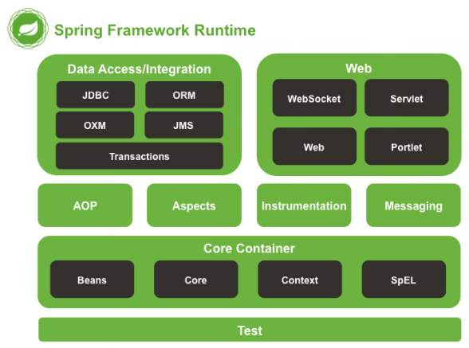
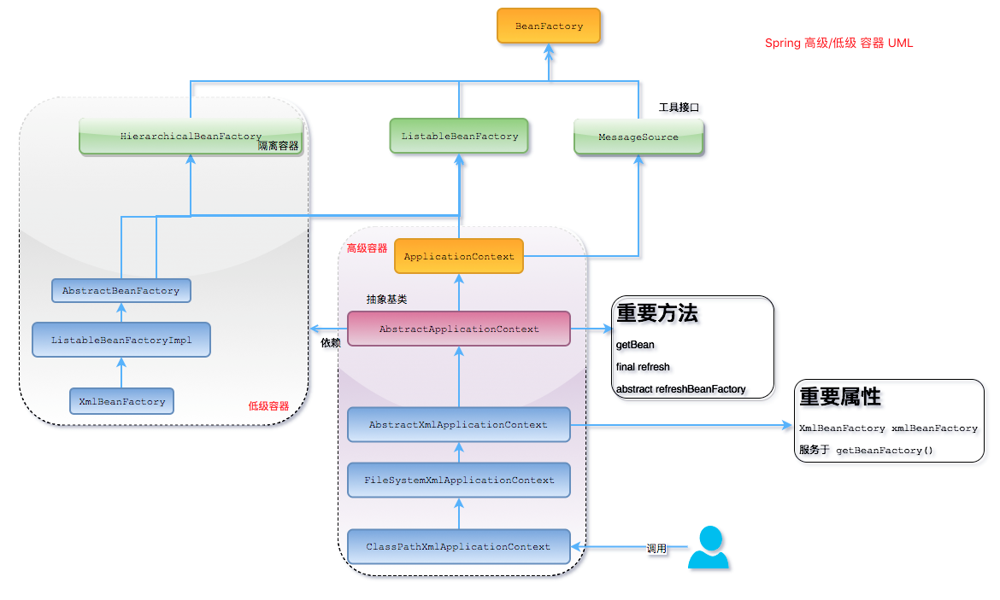
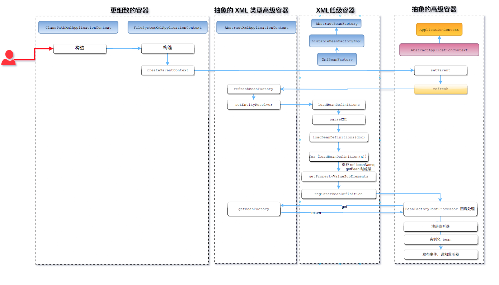
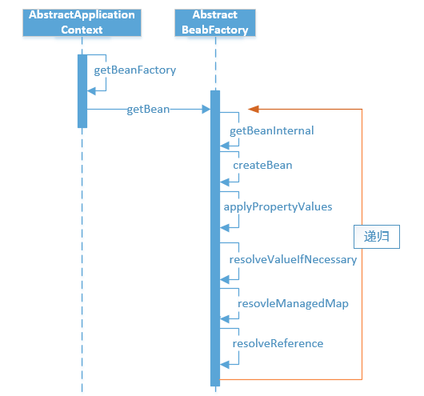
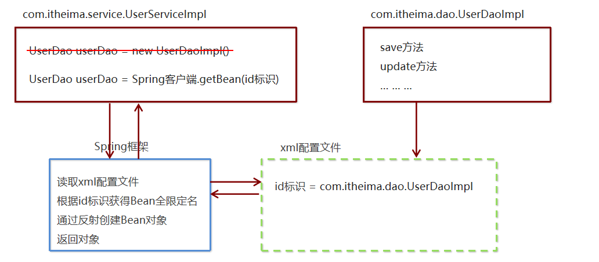
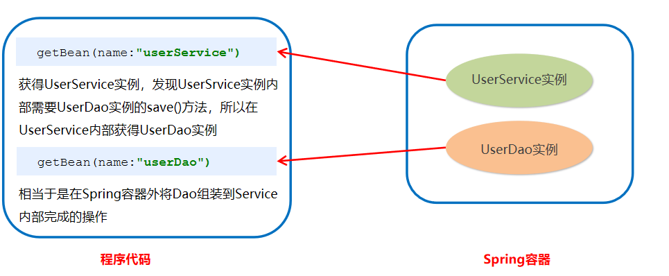
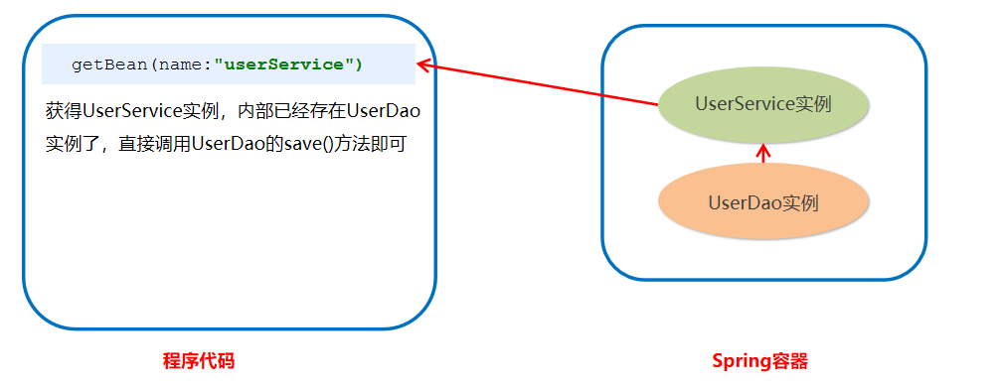
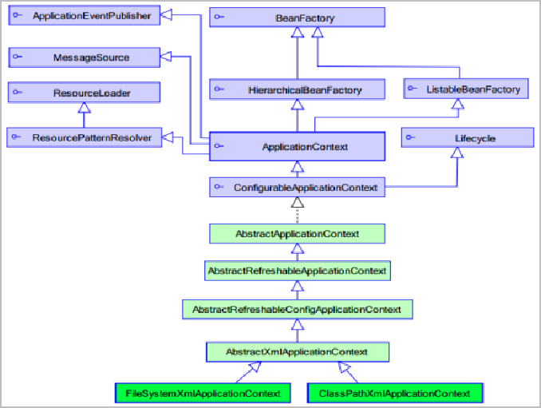
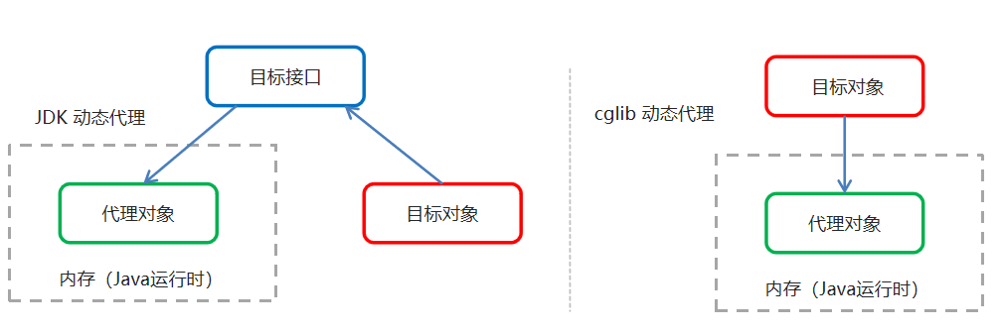

33-Spring

# 1. Spring 简介

1. spring 是什么

   Spring是分层的 Java SE/EE应用 full-stack 轻量级开源框架，以 IoC（Inverse Of Control：反转控制）和 AOP（Aspect Oriented Programming：面向切面编程）为内核。提供了展现层 SpringMVC 和持久层 Spring JDBCTemplate 以及业务层事务管理等众多的企业级应用技术，还能整合开源世界众多著名的第三方框架和类库，逐渐成为使用最多的Java EE 企业应用开源框架。

2. spring的优势

   - 方便解耦，简化开发

     通过 Spring 提供的 IoC容器，可以将对象间的依赖关系交由 Spring 进行控制，避免硬编码所造成的过度耦合。用户也不必再为单例模式类、属性文件解析等这些很底层的需求编写代码，可以更专注于上层的应用

   - AOP 编程的支持

     通过 Spring的 AOP（面向切面） 功能，方便进行面向切面编程，许多不容易用传统 OOP （面向对象）实现的功能可以通过 AOP 轻松实现。

   - 声明式事务的支持

     可以将我们从单调烦闷的事务管理代码中解脱出来，通过声明式方式灵活的进行事务管理，提高开发效率和质量。

   - 方便程序的测试

     可以用非容器依赖的编程方式进行几乎所有的测试工作，测试不再是昂贵的操作，而是随手可做的事情。
     
   - 方便集成各种优秀框架

     Spring 可以降低各种框架的使用难度，提供了对各种优秀框架（Struts、Hibernate、Hessian、Quartz
     等）的直接支持

   - 降低 JavaEE API 的使用难度

     Spring 对 JavaEE API（如 JDBC、JavaMail、远程调用等）进行了薄薄的封装层，使这些 API 的
     使用难度大为降低

   

3. spring的体系结构

   

# 2.IOC（控制反转）的概念和作用

## 2.1 程序的耦合和解耦

### 2.1.1 什么是程序的耦合

**耦合性**(Coupling)，也叫耦合度，是对模块间关联程度的度量。耦合的强弱取决于模块间接口的复杂性、调用模块的方式以及通过界面传送数据的多少。**模块间的耦合度是指模块之间的依赖关系，包括控制关系、调用关系、数据传递关系**。**模块间联系越多，其耦合性越强，同时表明其独立性越差**( 降低耦合性，可以提高其独立性)。耦合性存在于各个领域，而非软件设计中独有的，但是我们只讨论软件工程中的耦合。

在软件工程中，耦合指的就是就是对象之间的依赖性。对象之间的耦合越高，维护成本越高。因此对象的设计应使类和构件之间的耦合最小。软件设计中通常用耦合度和内聚度作为衡量模块独立程度的标准。**划分模块的一个准则就是高内聚低耦合。**

耦合分类：

- 内容耦合。

  当一个模块直接修改或操作另一个模块的数据时，或一个模块不通过正常入口而转入另一个模块时，这样的耦合被称为内容耦合。内容耦合是最高程度的耦合，应该避免使用之。

- 公共耦合。

  两个或两个以上的模块共同引用一个全局数据项，这种耦合被称为公共耦合。在具有大量公共耦合的结构中，确定究竟是哪个模块给全局变量赋了一个特定的值是十分困难的

- 外部耦合 。

  一组模块都访问同一全局简单变量而不是同一全局数据结构，而且不是通过参数表传递该全局变量的信息，则称之为外部耦合。

- 控制耦合 。

  一个模块通过接口向另一个模块传递一个控制信号，接受信号的模块根据信号值而进行适当的动作，这种耦合被称为控制耦合

- 标记耦合 。

  若一个模块 A 通过接口向两个模块 B 和 C 传递一个公共参数，那么称模块 B 和 C 之间存在一个标记耦合。

- 数据耦合。

  模块之间通过参数来传递数据，那么被称为数据耦合。数据耦合是最低的一种耦合形式，系统中一般都存在这种类型的耦合，因为为了完成一些有意义的功能，往往需要将某些模块的输出数据作为另一些模块的输入数据。

- 非直接耦合 。两个模块之间没有直接关系，它们之间的联系完全是通过主模块的控制和调用来实现的

**总结：**

耦合是影响软件复杂程度和设计质量的一个重要因素，在设计上我们应采用以下原则：**如果模块间必须存在耦合，就尽量使用数据耦合，少用控制耦合，限制公共耦合的范围，尽量避免使用内容耦合。**

**内聚与耦合：**

内聚标志一个模块内各个元素彼此结合的紧密程度，它是信息隐蔽和局部化概念的自然扩展。内聚是从功能角度来度量模块内的联系，一个好的内聚模块应当恰好做一件事。它描述的是模块内的功能联系。耦合是软件结构中各模块之间相互连接的一种度量，耦合强弱取决于模块间接口的复杂程度、进入或访问一个模块的点以及通过接口的数据。 程序讲究的是低耦合，高内聚。**就是同一个模块内的各个元素之间要高度紧密，但是各个模块之间的相互依存度却要不那么紧密。**

内聚和耦合是密切相关的，同其他模块存在高耦合的模块意味着低内聚，而高内聚的模块意味着该模块同其他
模块之间是低耦合。在进行软件设计时，应力争做到高内聚，低耦合。

**示例：**

-  账户的业务层实现类

  ```java
  // 账户的业务层实现类
  public class AccountServiceImpl implements IAccountService {
      private IAccountDao accountDao = new AccountDaoImpl();
  }
  ```

  上面的代码表示：
  业务层调用持久层，并且此时业务层在依赖持久层的接口和实现类。如果此时没有持久层实现类，编译将不能通过。这种编译期依赖关系，应该在我们开发中杜绝。我们需要优化代码解决。

- 早期我们的 JDBC 操作，注册驱动时，我们为什么不使用 DriverManager 的 register 方法，而是采
  用 Class.forName 的方式？

  ```java
  public static void main(String[] args) throws Exception {
      //1.注册驱动
      //DriverManager.registerDriver(new com.mysql.jdbc.Driver());
      Class.forName("com.mysql.jdbc.Driver");
      //2.获取连接
      //3.获取预处理 sql 语句对象
      //4.获取结果集
      //5.遍历结果集
  }
  ```

  原因就是：
  我们的类依赖了数据库的具体驱动类（MySQL），如果这时候更换了数据库品牌（比如 Oracle），需要修改源码来重新数据库驱动。这显然不是我们想要的。

### 2.1.2 解决程序耦合的思路

当时我们在学习 jdbc 时，是通过反射来注册驱动的，代码如下：

```java
Class.forName("com.mysql.jdbc.Driver");//此处只是一个被写死的字符串
```

此时的好处是，我们的类中不再依赖具体的驱动类，此时就算删除 mysql 的驱动 jar 包，依然可以编译（运行就不要想了，没有驱动不可能运行成功的）。同时，也产生了一个新的问题，mysql 驱动的全限定类名字符串是在 java 类中写死的，一旦要改还是要修改源码。**解决这个问题也很简单，使用配置文件配置。**

### 2.1.3 工厂模式解耦

在实际开发中我们可以把三层的对象都使用配置文件配置起来，当启动服务器应用加载的时候，让一个类中的方法通过读取配置文件，把这些对象创建出来并存起来。在接下来的使用的时候，直接拿过来用就好了。那么，**这个读取配置文件，创建和获取三层对象的类就是工厂。**

## 2.2 控制反转 Inversion Of Control

**IOC的作用：削减计算机程序的耦合(解除我们代码中的依赖关系）。**

上面的解耦的思路有 2 个问题：

1. 存哪里去？

   - 分析：由于我们是很多对象，肯定要找个集合来存。这时候有 Map 和 List 供选择。
      到底选 Map 还是 List 就看我们有没有查找需求。有查找需求，选 Map。
   - 答：在应用加载时，创建一个 Map，用于存放三层对象。我们把这个 map 称之为容器。

2. 什么是工厂？

   工厂就是负责给我们从容器中获取指定对象的类。这时候我们获取对象的方式发生了改变。

   - 原来：我们在获取对象时，都是采用 new 的方式。**是主动的。**
   - 现在：我们获取对象时，同时跟工厂要，有工厂为我们查找或者创建对象。是被动的。

   **这种被动接收的方式获取对象的思想就是控制反转，它是 spring 框架的核心之一。**

   

**IOC的概念：**IoC(Inversion of Control) 控制反转，即“不用打电话过来，我们会打给你”。

实现方式有两种： 依赖查找（DL）和依赖注入（DI）

- DI 是 Spring 使用的方式，容器负责组件的装配。
- DL 已经被抛弃，因为他需要用户自己去是使用 API 进行查找资源和组装对象。即有侵入性。

Spring 的 IoC 设计支持以下功能：

- 依赖注入
- 依赖检查
- 自动装配
- 支持集合
- 指定初始化方法和销毁方法
- 支持回调某些方法（但是需要实现 Spring 接口，略有侵入）

对于 IoC 来说，最重要的就是容器。容器管理着 Bean 的生命周期，控制着 Bean 的依赖注入。

### 2.2.1 高级，低级容器

Spring 作者 Rod Johnson 设计了两个接口用以表示容器。

- BeanFactory

  BeanFactory 粗暴简单，可以理解为就是个 HashMap，Key 是 BeanName，Value 是 Bean 实例。通常只提供注册（put），获取（get）这两个功能。，是 Spring 容器中的顶层接口。

- ApplicationContext

  ApplicationContext 是BeanFactory的子接口。他继承了多个接口。ApplicationContext意思是 “应用上下文”， **代表着整个大容器的所有功能。**该接口定义了一个 **refresh 方法，此方法是所有阅读 Spring 源码的人的最熟悉的方法，用于刷新整个容器，即重新加载/刷新所有的 bean。**

- BeanFactory和ApplicationContext的区别

  - ApplicationContext：只要一读取配置文件，默认情况下就会创建对象。
  - BeanFactory：什么使用什么时候创建对象。

- ApplicationContext 接口的实现类

  - `ClassPathXmlApplicationContext：`

    它是从类的根路径下加载配置文件 推荐使用这种

  - `FileSystemXmlApplicationContext：`

    它是从磁盘路径上加载配置文件，配置文件可以在磁盘的任意位置。

  - `AnnotationConfigApplicationContext:`

    当我们使用注解配置容器对象时，需要使用此类来创建 spring 容器。它用来读取注解。



### 2.2.2 Spring IoC 的初始化过程

ClassPathXmlApplicationContext 的构造过程，**实际就是 Spring IoC 的初始化过程**。



1. 用户构造 ClassPathXmlApplicationContext（简称 CPAC）
2. CPAC 首先访问了 “抽象高级容器” 的 final 的 refresh 方法，这个方法是模板方法。所以要回调子类（低级容器）的 refreshBeanFactory 方法，这个方法的作用是使用低级容器加载所有 BeanDefinition 和  Properties 到容器中。
3. 低级容器加载成功后，高级容器开始处理一些回调，例如 Bean 后置处理器。回调 setBeanFactory 方法。或者注册监听器等，发布事件，实例化单例 Bean 等等功能，这些功能，随着 Spring 的不断升级，功能越来越多 。

简单说就是：

1. 低级容器 加载配置文件（从 XML，数据库，Applet），并解析成 BeanDefinition 到低级容器中。
2. 加载成功后，高级容器启动高级功能，例如接口回调，监听器，自动实例化单例，发布事件等等功能。

当我们创建好容器，就会使用 getBean 方法，获取 Bean，而 getBean 的流程如下：



从图中可以看出，getBean 的操作都是在低级容器里操作的。其中有个递归操作，这个是什么意思呢？

假设 ： 当 Bean_A 依赖着 Bean_B，而这个 Bean_A 在加载的时候，其配置的 ref = “Bean_B” 在解析的时候只是一个占位符，被放入了 Bean_A 的属性集合中，当调用 getBean 时，需要真正 Bean_B 注入到 Bean_A 内部时，就需要从容器中获取这个 Bean_B，因此产生了递归。

为什么不是在加载的时候，就直接注入呢？因为加载的顺序不同，很可能 Bean_A 依赖的 Bean_B 还没有加载好，也就无法从容器中获取，你不能要求用户把 Bean 的加载顺序排列好，这是不人道的。

所以，Spring 将其分为了 2 个步骤：

1. 加载所有的 Bean 配置成 BeanDefinition 到容器中，如果 Bean 有依赖关系，则使用占位符暂时代替。
2. 然后，在调用 getBean 的时候，进行真正的依赖注入，即如果碰到了属性是 ref 的（占位符），那么就从容器里获取这个 Bean，然后注入到实例中 —— 称之为依赖注入。

可以看到，依赖注入实际上，只需要 “低级容器” 就可以实现。

**所以 ApplicationContext refresh 方法里面的操作不只是 IoC，是高级容器的所有功能（包括 IoC），IoC 的功能在低级容器里就可以实现。**


# 3. Spring快速入门

简单了解Spring的开发基本步骤：



spring程序开发步骤

1. 导入Spring开发的基本包坐标

   创建Maven项目，导入Spring依赖

   ```xml
   <dependencies>
       <dependency>
           <groupId>org.springframework</groupId>
           <artifactId>spring-context</artifactId>
           <version>5.0.5.RELEASE</version>
       </dependency>
       <dependency>
           <groupId>junit</groupId>
           <artifactId>junit</artifactId>
           <version>4.10</version>
           <scope>test</scope>
       </dependency>
   </dependencies>
   ```

2. 编写Dao接口和实现类

   - 创建dao包，编写dao接口

     ```java
     public interface UserDao {
         void save();
     }
     ```

   - 在dao包下创建impl包，编写dao接口的实现类

     ```java
     public class UserDaoImpl implements UserDao {
         @Override
      	public void save() {
             System.out.println("save running....");
         }
     }
     ```

3. 创建Spring核心配置文件

   - 在项目的resource包内创建application.xml文件

   - 步骤：右键resource包，选择New -> XML Configuration File -> Spring Config

   如下：

   ```xml
   <?xml version="1.0" encoding="UTF-8"?>
   <beans xmlns="http://www.springframework.org/schema/beans"
          xmlns:xsi="http://www.w3.org/2001/XMLSchema-instance"
          xsi:schemaLocation="http://www.springframework.org/schema/beans http://www.springframework.org/schema/beans/spring-beans.xsd">
   	
   </beans>
   ```

4. 让 spring 管理资源，在配置文件中配置UserDaoImpl

   在application.xml文件中添加如下内容

   ```xml
   <!-- 配置 userDao --> 
   <bean id="UserDaoImpl" class="dao.impl.UserDaoImpl"></bean>
   ```

   解释：

   - bean 标签：用于配置让 spring 创建对象，并且存入 ioc 容器之中

   - id：对象的唯一标识
   - class：指定要创建对象的全限定

5. 测试，使用Spring的API获得Bean实例

   在test包内创建测试文件UserDemoTest，并添加如下内容

   ```java
   @Test
   public void test1(){
       // 创建对象，加载application.xml配置文件，获取Spring容器
       ApplicationContext app = new ClassPathXmlApplicationContext("application.xml");
       // 根据bean的id获取对象，传入的参数是在xml文件中配置的id名
       // 这里可以强转是因为在application.xml文件中配置的是UserDaoImpl类，此类是UserDao的实现类
       UserDao UserDaoImpl = (UserDao) app.getBean("UserDaoImpl");
       // 调用save方法
       UserDaoImpl.save(); // save running....
       System.out.println(UserDaoImpl); // dao.impl.UserDaoImpl@6b57696f
   }
   ```

# 4. Spring配置文件

## 4.1 Bean标签基本配置

- 用于配置对象交由Spring来创建

- 默认情况下它调用的是类中的无参构造，如果没有无参构造函数，则不能创建成功

- 基本属性：

  - id：Bean实例在Spring容器中的唯一标识
  - class：Bean的全类名

- 示例：

  1. 在UserDaoImpl类中添加无参构造方法

     ```java
     public UserDaoImpl(){
         System.out.println("无参构造。。。");
     }
     ```

  2. 配置application.xml文件的bean标签

     ```xml
     <bean id="UserDaoImpl" class="dao.impl.UserDaoImpl"></bean>
     ```

  3. 测试

     ```java
     @Test
     public void test1(){
         // 创建对象，加载application.xml配置文件
         ApplicationContext app = new ClassPathXmlApplicationContext("application.xml");
         // 获得Bean实例，传入的参数是在xml文件中配置的id名
         // 这里可以强转是因为在application.xml文件中配置的是UserDaoImpl类，此类是UserDao的实现类
         UserDao UserDaoImpl = (UserDao) app.getBean("UserDaoImpl"); // 无参构造。。。
         // 调用save方法
         UserDaoImpl.save(); // save running....
         System.out.println(UserDaoImpl); // dao.impl.UserDaoImpl@6b57696f
         
         
         /**
          * 无参构造。。。
          * save running....
          * dao.impl.UserDaoImpl@6b57696f
          */
     
     }
     ```

     

## 4.2 Bean标签范围配置

- scope ： 指对象的作用范围。取值如下

  | 取值范围       | 说明                                                         |
  | -------------- | ------------------------------------------------------------ |
  | singleton      | 默认值，单例的                                               |
  | prototype      | 多例的                                                       |
  | request        | WEB 项目中，Spring 创建一个 Bean 的对象，将对象存入到 request 域中 |
  | session        | WEB 项目中，Spring 创建一个 Bean 的对象，将对象存入到 session 域中 |
  | global session | WEB 项目中，应用在 Portlet 环境，如果没有 Portlet 环境那么globalSession 相当于 session |

- 说明

  - 当scope的取值为singleton时（单例对象）

    1. Bean的实例化个数：1个

    2. Bean的实例化时机：当Spring核心文件被加载时，实例化配置的Bean示例

    3. Bean的生命周期

       - 对象创建：当应用加载，创建容器时，对象被创建
       - 对象运行：只要容器在，对象一直活着
       - 对象销毁：当应用卸载，销毁容器时，对象就被销毁了

    4. 示例：

       - 修改application.xml配置文件的Bean标签内容

         ```xml
         <bean id="UserDaoImpl" class="dao.impl.UserDaoImpl" scope="singleton"></bean>
         ```

       - 测试

         ```java
         @Test
         public void test1(){
             // 创建对象，加载application.xml配置文件
             ApplicationContext app = new ClassPathXmlApplicationContext("application.xml");
             // 传入的是在xml文件中配置的id名
             UserDao userDao = (UserDao) app.getBean("UserDao");
             UserDao userDao1 = (UserDao) app.getBean("UserDao");
             userDao.save();
         
             System.out.println(userDao);
             System.out.println(userDao1);
             
             	/**
                  * 无参构造。。。
                  * save running....
                  * dao.impl.UserDaoImpl@6b57696f
                  * dao.impl.UserDaoImpl@6b57696f
                  *
                  */
         
         }
         ```

  - 当scope的取值为prototype时（多例对象）

    1. Bean的实例化个数：多个

    2. Bean的实例化时机：当调用getBean()方法时，实例化Bean

    3. Bean的生命周期

       - 对象创建：当使用对象时，创建新的对象实例
       - 对象运行：只要对象在使用中，就一直活着
       - 对象销毁：当对象长时间不用时，会被Java的垃圾回收器回收

    4. 示例：

       - 修改application.xml配置文件的Bean标签内容

         ```xml
         <bean id="UserDaoImpl" class="dao.impl.UserDaoImpl" scope="prototype"></bean>
         ```

       - 测试

         ```java
         @Test
         public void test1(){
             // 创建对象，加载application.xml配置文件
             ApplicationContext app = new ClassPathXmlApplicationContext("application.xml");
             // 传入的是在xml文件中配置的id名
             UserDao userDao = (UserDao) app.getBean("UserDao");
             UserDao userDao1 = (UserDao) app.getBean("UserDao");
             userDao.save();
         
             System.out.println(userDao);
             System.out.println(userDao1);
             
                 /**
                  * 无参构造。。。
                  * 无参构造。。。
                  * save running....
                  * dao.impl.UserDaoImpl@6b57696f
                  * dao.impl.UserDaoImpl@5bb21b69
                  *
                  */
         
         }
         ```

## 4.3 Bean生命周期配置

- init-methon：指定类中的初始化方法名称
- destory-method：指定类中销毁方法名称

示例：

1. 在UserDaoImpl类中添加如下方法

   ```java
   public void init(){
        System.out.println("初始化方法。。。");
    }
   public void destroy(){
       System.out.println("销毁方法。。。");
   }
   ```

2. 配置application.xml文件的Bean标签

   ```xml
   <bean id="UserDao" class="dao.impl.UserDaoImpl" init-method="init" destroy-method="destroy">
   ```

3. 测试

   ```java
   @Test
   public void test2(){
   
       /**
       * destroy销毁方法未打印内容是因为
       * 1. 这里并不是tomcat服务器，test2方法执行结束就释放掉了
       * 2. destroy方法还没来得及打印就关闭了
       * 3. 如果希望打印可以按照如下方法做
       *
       */
       // 注意这里并未使用ApplicationContext的接口类，而是采用其实现类，如果需要使用ApplicationContext，则需要向下转型
       ClassPathXmlApplicationContext con = new ClassPathXmlApplicationContext("application.xml");
       // 手动执行销毁方法
       con.close();// 销毁方法。。。
   
        	/**
            * 无参构造。。。
            * 初始化方法。。。
            * 销毁方法。。。
            */
   }
   ```

## 4.4 Bean实例化的三种方式

### 4.4.1 无参构造方法实例化

使用无参构造方法实例化，会根据默认无参构造方法来创建类对象，如果bean中没有默认无参构造函数，将会创建失败

1. 在UserDaoImpl类中添加无参构造方法

   ```java
   public UserDaoImpl(){
       System.out.println("无参构造。。。");
   }
   ```

2. 配置application.xml文件的bean标签

   ```xml
   <bean id="UserDaoImpl" class="dao.impl.UserDaoImpl"></bean>
   ```

3. 测试

   ```java
   @Test
   public void test1(){
       // 创建对象，加载application.xml配置文件
       ApplicationContext app = new ClassPathXmlApplicationContext("application.xml");
       // 获得Bean实例，传入的参数是在xml文件中配置的id名
       // 这里可以强转是因为在application.xml文件中配置的是UserDaoImpl类，此类是UserDao的实现类
       UserDao UserDaoImpl = (UserDao) app.getBean("UserDaoImpl"); // 无参构造。。。
       // 调用save方法
       UserDaoImpl.save(); // save running....
       System.out.println(UserDaoImpl); // dao.impl.UserDaoImpl@6b57696f
       
       
       /**
        * 无参构造。。。
        * save running....
        * dao.impl.UserDaoImpl@6b57696f
        */
   
   }
   ```

### 4.4.2 工厂静态方法实例化

spring 管理静态工厂，使用静态工厂的方法创建对象，工厂的静态方法返回Bean实例

1. 创建包factory，并在其下创建名为staticFactory的类

   ```java
   public class staticFactory {
       public static UserDao getUserDaoImpl(){
           return new UserDaoImpl();
       }
   }
   ```

2. 配置application.xml文件，使用`factory-method`指定工厂方法

   ```xml
   <!--创建工厂对象  静态 -->
   <bean id="UserDao" class="factory.staticFactory" factory-method="getUserDaoImpl"></bean>
   ```

   使用 StaticFactory 类中的静态方法 getUserDaoImpl创建对象，并存入 spring 容器

   - id 属性：指定 bean 的 id，用于从容器中获取
   - class 属性：指定静态工厂的全限定类名
   - factory-method 属性：指定生产对象的静态方法

3. 测试

   ```java
   @Test
   public void test3(){
       ApplicationContext app = new ClassPathXmlApplicationContext("application.xml");
       UserDao userDao = (UserDao) app.getBean("UserDao");
       userDao.save(); // save running....
   }
   ```

### 4.4.3 工厂实例方法实例化

spring 管理实例工厂，使用实例工厂的方法创建对象，工厂的非静态方法返回Bean实例

1. 在factory包下创建名为publicFatory的类

   ```java
   public class publicFactory {
       public UserDao getUserDaoImpl(){
       	return new UserDaoImpl();
       }
   }
   ```

2. 配置application.xml文件，使用`factory-bean`指定工厂对象，使用`factory-method`指定工厂方法

   ```xml
   <!--创建工厂对象  非静态-->
   <bean id="factory" class="factory.publicFactory"></bean>
   <bean id="UserDao" factory-bean="factory" factory-method="getUserDaoImpl"></bean>
   ```

   先把工厂的创建交给 spring 来管理。然后在使用工厂的 bean 来调用里面的方法

   - factory-bean 属性：用于指定实例工厂 bean 的 id。
   - factory-method 属性：用于指定实例工厂中创建对象的方法。

3. 测试

   ```java
   @Test
   public void test3(){
       ApplicationContext app = new ClassPathXmlApplicationContext("application.xml");
       UserDao userDao = (UserDao) app.getBean("UserDao");
       userDao.save(); // save running....
   }
   ```

## 4.5 Bean的依赖注入

概念：

依赖注入：Dependency Injection。它是 spring 框架核心 ioc 的具体实现。

我们的程序在编写时，通过控制反转，把对象的创建交给了 spring，但是代码中不可能出现没有依赖的情况。ioc 解耦只是降低他们的依赖关系，但不会消除。例如：我们的业务层仍会调用持久层的方法

那这种业务层和持久层的依赖关系，在使用 spring 之后，就让 spring 来维护了。

简单的说，就是坐等框架把持久层对象传入业务层，而不用我们自己去获取

### 4.5.1 依赖注入入门

1. 创建包service，并创建userService的接口类

   ```java
   public interface userService {
       public void save();
   }
   ```

2. 在service包下创建impl包，并创建userServiceImpl实现类，并在save方法内部调用UserDao的save方法

   ```java
   public class userServiceImpl implements userService {
       @Override
       public void save() {
           ApplicationContext app = new ClassPathXmlApplicationContext("application.xml");
           UserDao userDao = (UserDao) app.getBean("UserDao");
           userDao.save(); // save running....
           System.out.println("userService的save方法执行。。。");
       }
   }
   
   ```

3. 配置application.xml的bean标签，将userServiceImpl的创建权交给spring

   注：userDao类之前已经创建过了，这里不再重复

   ```xml
   <bean id="UserDao" class="dao.impl.UserDaoImpl" ></bean>
   <bean id="userService" class="service.impl.userServiceImpl"></bean>
   ```

4. 测试

   ```java
   @Test
   public void test5(){
       ApplicationContext app = new ClassPathXmlApplicationContext("application.xml");
       userService userService = (userService) app.getBean("userService");
       userService.save(); // userService的save方法执行。。。
   }
   ```

### 4.5.2 依赖注入分析

1. 目前UserService实例和UserDao实例都存在与Spring容器中，当前的做法是在容器外部获得UserService实例和UserDao实例，然后在程序中进行结合。

   

2. 因为UserService和UserDao都在Spring容器中，而最终程序直接使用的是UserService，所以可以在Spring容器中，将UserDao设置到UserService内部。

   

### 4.5.3 依赖注入概念

1. 依赖注入（Dependency Injection）：它是 Spring 框架核心 IOC 的具体实现。
2. 在编写程序时，通过控制反转，把对象的创建交给了 Spring，但是代码中不可能出现没有依赖的情况。
   IOC 解耦只是降低他们的依赖关系，但不会消除。例如：业务层仍会调用持久层的方法。
3. 那这种业务层和持久层的依赖关系，在使用 Spring 之后，就让 Spring 来维护了。
   简单的说，就是坐等框架把持久层对象传入业务层，而不用我们自己去获取。

### 4.5.4 依赖注入方式1--set方法

顾名思义，就是在类中提供需要注入成员的 set 方法。具体代码如

1. 接口类

   ```java
   public interface userService {
       public void save();
   }
   ```
   
   ```java
   public interface UserDao {
       void save();
   }
   ```
   
2. 实现类，在userServiceImpl类中添加set方法，并在save方法中调用

   ```java
   public class UserDaoImpl implements UserDao {
       @Override
       public void save() {
           System.out.println("save running....");
       }
   }
   ```

   ```java
   public class userServiceImpl implements userService {
       private UserDao userDao;
   
   //    使用set方法注入
       public void setUserDao(UserDao userDao) {
           this.userDao = userDao;
       }
       
       @Override
       public void save() {
           System.out.println("userService的save方法执行。。。");
           userDao.save();
       }
   }
   ```

3. 配置application.xml的Bean标签，调用set方法进行注入

   ```xml
   <!--set注入方法-->
   <bean id="UserDao" class="dao.impl.UserDaoImpl" ></bean>
   <bean id="userService" class="service.impl.userServiceImpl">
       <!--将UserDap对象注入到userService中，userService中需要配置set方法-->
       <!--注意：这里的name标签内容是属性值，即set方法改变后的名字，ref是注入的对象（id标识）-->
       <property name="userDao" ref="UserDao"></property>
   </bean>
   ```

   property 标签

   - name：找的是类中 set 方法后面的部分（属性值）
   - ref：给属性赋值是其他 bean 类型的
   - value：给属性赋值是基本数据类型和 string 类型的

   实际开发中，此种方式用的较多

4. 测试

   ```java
   @Test
   public void test5(){
       ApplicationContext app = new ClassPathXmlApplicationContext("application.xml");
       userService userService = (userService) app.getBean("userService");
       userService.save();
       
       	/**
            * userService的save方法执行。。。
            * save running....
            */
   }
   ```

### 4.5.5 依赖注入方式2--构造方法

顾名思义，就是使用类中的构造函数，给成员变量赋值。注意，赋值的操作不是我们自己做的，而是通过配置
的方式，让 spring 框架来为我们注入。具体代码如下

1. 接口类

   ```java
   public interface userService {
       public void save();
   }
   ```

   ```java
   public interface UserDao {
       void save();
   }
   ```

2. 实现类，在userServiceImpl类中创建有参构造

   ```java
   public class UserDaoImpl implements UserDao {
       @Override
       public void save() {
           System.out.println("save running....");
       }
   }
   ```

   ```java
   public class userServiceImpl implements userService {
       private UserDao userDao;
   
   //    使用构造方法注入
       public userServiceImpl(UserDao userDao) {
           this.userDao = userDao;
       }
       @Override
       public void save() {
           System.out.println("userService的save方法执行。。。");
           userDao.save();
       }
   }
   ```

   注意：使用构造函数的方式，给 userService 中的属性传值

   **要求：类中需要提供一个对应参数列表的构造函数**

3. 配置application.xml的Bean标签，调用set方法进行注入

   ```xml
   <!-- 构造方法注入-->
   <bean id="UserDao" class="dao.impl.UserDaoImpl" ></bean>
   <bean id="userService" class="service.impl.userServiceImpl">
       <!-- name值是constructor的参数名称，ref是注入的对象，传入bean的id -->
       <constructor-arg name="userDao" ref="UserDao"></constructor-arg>
   </bean>
   ```

   constructor-arg 标签

   - index：指定参数在构造函数参数列表的索引位置
   - type：指定参数在构造函数中的数据类型
   - **name：指定参数在构造函数中的名称，用这个找给谁赋值**
   - value：它能赋的值是基本数据类型和 String 类型
   - **ref：它能赋的值是其他 bean 类型，也就是说，必须得是在配置文件中配置过的 bean**

4. 执行测试方法

   ```java
   @Test
   public void test5(){
       ApplicationContext app = new ClassPathXmlApplicationContext("application.xml");
       userService userService = (userService) app.getBean("userService");
       userService.save();
       
       	/**
            * userService的save方法执行。。。
            * save running....
            */
   }
   ```

### 4.5.6  依赖注入方式3--p命名空间

此种方式是通过在 xml 中导入 p 名称空间，使用` p:propertyName `来注入数据，它的**本质仍然是调用类中的**
**set 方法实现注入功能。**

1. 接口类

   ```java
   public interface userService {
       public void save();
   }
   ```

   ```java
   public interface UserDao {
       void save();
   }
   ```

2. 实现类

   ```java
   public class UserDaoImpl implements UserDao {
       @Override
       public void save() {
           System.out.println("save running....");
       }
   }
   
   ```

   ```java
   public class userServiceImpl implements userService {
       private UserDao userDao;
   
   //  使用set方法注入
       public void setUserDao(UserDao userDao) {
           this.userDao = userDao;
       }
   
       @Override
       public void save() {
           System.out.println("userService的save方法执行。。。");
           userDao.save();
       }
   }
   ```

3. 配置application.xml，记得引入p命名空间

   ```xml
   <beans xmlns="http://www.springframework.org/schema/beans"
          xmlns:p="http://www.springframework.org/schema/p"
          xmlns:xsi="http://www.w3.org/2001/XMLSchema-instance"
          xsi:schemaLocation=" http://www.springframework.org/schema/beans 
                              http://www.springframework.org/schema/beans/spring-beans.xsd">
   
       
       <!--p命名空间注入-->
       <bean id="UserDao" class="itcast.dao.impl.UserDaoImpl" ></bean>
       
       <!--userDao-ref中的userDao是userService中set方法的属性名-->
       <bean id="userService" class="itcast.service.impl.userServiceImpl" p:userDao-ref="UserDao"></bean>
   
   </beans>
   ```

4. 测试类

   ```java
   @Test
   public void test6(){
       ApplicationContext app = new ClassPathXmlApplicationContext("application.xml");
       userService userService = (userService) app.getBean("userService");
       userService.save();
       
       	/**
            * userService的save方法执行。。。
            * save running....
            */
   }
   ```

   

## 4.6 Bean依赖注入的数据类型

上面的操作都是注入的引用Bean，除了对象的引用可以注入，普通数据类型，集合等都可以在容器中进行注入。

注入数据的三种数据类型 

- 普通数据类型
- 引用数据类型
- 集合数据类型

### 4.6.1 普通数据类型的注入

1. 在UserDaoImpl 实现类中添加如下私有方法，并添加set方法

   ```java
   public class UserDaoImpl implements UserDao {
       private String username;
       
        public void setUsername(String username) {
           this.username = username;
       }
       
       @Override
       public void save() {
           System.out.println("username---"+username);
           System.out.println("save running....");
       }
   }
   ```

2. 配置application.xml文件

   ```xml
   <!--普通数据类型注入-->
   <bean id="UserDao" class="dao.impl.UserDaoImpl">
       <property name="username" value="lisi"></property>
   </bean>
   ```

3. 测试

   ```java
   @Test
   public void test4(){
       ApplicationContext app = new ClassPathXmlApplicationContext("application.xml");
       UserDao userDao = (UserDao) app.getBean("UserDao");
       userDao.save();
           /**
            * username---lisi
            * save running....
            */
   }
   ```

### 4.6.2 List 类型的注入

集合数据类型（`List<String>`）的注入

1. 在UserDaoImpl 实现类中添加如下list方法，并添加set方法

   ```java
   public class UserDaoImpl implements UserDao {
       private List<String>  strList;
       
       public void setStrList(List<String> strList) {
           this.strList = strList;
       }
       
       @Override
       public void save() {
           System.out.println("save running....");
           System.out.println(strList);
       }
   }
   ```

2. 配置application.xml文件

   ```xml
   <!--list数据类型注入-->
   <bean id="UserDao" class="dao.impl.UserDaoImpl">
       <property name="strList">
           <list>
               <value>111</value>
               <value>222</value>
               <value>333</value>
           </list>
       </property>
   </bean>
   ```

3. 测试

   ```java
   @Test
   public void test4(){
       ApplicationContext app = new ClassPathXmlApplicationContext("application.xml");
       UserDao userDao = (UserDao) app.getBean("UserDao");
       userDao.save();
           /**
            * save running....
            * [111, 222, 333]
            */
   }
   ```

集合数据类型（`List<user>`）的注入

1. 创建domain包，并在其内创建user类

   ```java
   public class user {
       private String name;
       private int age;
   
       public String getName() {
           return name;
       }
   
       public void setName(String name) {
           this.name = name;
       }
   
       public int getAge() {
           return age;
       }
   
       public void setAge(int age) {
           this.age = age;
       }
   
       @Override
       public String toString() {
           return "user{" +
                   "name='" + name + '\'' +
                   ", age=" + age +
                   '}';
       }
   }
   ```

2. 在UserDaoImpl 实现类中添加如下私有变量和set方法

   ```java
   public class UserDaoImpl implements UserDao {
       private List<user> userList;
   
       public void setUserList(List<user> userList) {
           this.userList = userList;
       }
       
       @Override
       public void save() {
           System.out.println("save running....");
           System.out.println(userList);
       }
   }
   
   ```

3. 配置application.xml文件

   ```xml
   <!--List<user>类型注入-->
   <bean id="UserDao" class="dao.impl.UserDaoImpl">
       <property name="userList">
           <list>
               <bean class="domain.user">
                   <property name="name" value="wangmazi"></property>
                   <property name="age" value="30"></property>
               </bean>
               <ref bean="u1"></ref>
               <ref bean="u2"></ref>
           </list>
       </property>
   </bean>
   
   <bean id="u1" class="domain.user">
       <property name="name" value="lisi"></property>
       <property name="age" value="12"></property>
   </bean>
   <bean id="u2" class="domain.user">
       <property name="name" value="zhangsan"></property>
       <property name="age" value="20"></property>
   </bean>
   ```

4. 测试

   ```java
   @Test
   public void test4(){
       ApplicationContext app = new ClassPathXmlApplicationContext("application.xml");
       UserDao userDao = (UserDao) app.getBean("UserDao");
       userDao.save();
       
       /**
       * save running....
       * [user{name='wangmazi', age=30}, user{name='lisi', age=12}, user{name='zhangsan', age=20}]
       */
   }
   ```

### 4.6.3 Map 类型的注入

1. 在UserDaoImpl 实现类中添加如下map方法，并添加set方法

   ```java
   public class UserDaoImpl implements UserDao {
       private Map<String, user> strMap;
       
       public void setStrMap(Map<String, user> strMap) {
           this.strMap = strMap;
       }
       
       @Override
       public void save() {
           System.out.println("save running....");
           System.out.println(strMap);
       }
   }
   ```

2. 配置application.xml文件

   ```xml
   <!--map数据类型注入-->
   <bean id="UserDao" class="dao.impl.UserDaoImpl">
       <property name="strMap">
           <map>
               <entry key="user1" value-ref="u1"></entry>
               <entry key="user2" value-ref="u2"></entry>
           </map>
       </property>
   </bean>
   
    <bean id="u1" class="domain.user">
        <property name="name" value="lisi"></property>
        <property name="age" value="12"></property>
   </bean>
   <bean id="u2" class="domain.user">
       <property name="name" value="zhangsan"></property>
       <property name="age" value="20"></property>
   </bean>
   ```

3. 测试

   ```java
   @Test
   public void test4(){
       ApplicationContext app = new ClassPathXmlApplicationContext("application.xml");
       UserDao userDao = (UserDao) app.getBean("UserDao");
       userDao.save();
       	/**
            * save running....
            * {user1=user{name='lisi', age=12}, user2=user{name='zhangsan', age=20}}
            */
   }
   ```

### 4.6.4 Properties类型的注入

1. 在UserDaoImpl 实现类中添加如下map方法，并添加set方法

   ```java
   public class UserDaoImpl implements UserDao {
       private Properties pros;
       
       public void setPros(Properties pros) {
           this.pros = pros;
       }
       
       @Override
       public void save() {
           System.out.println("save running....");
           System.out.println(pros);
       }
   }
   ```

2. 配置application.xml文件

   ```xml
   <!--Properties数据类型注入-->
   <bean id="UserDao" class="dao.impl.UserDaoImpl">
       <property name="pros">
           <props>
               <prop key="p1">aaa</prop>
               <prop key="p2">bbb</prop>
               <prop key="p3">ccc</prop>
           </props>
       </property>
   </bean>
   ```

3. 测试

   ```java
   @Test
   public void test4(){
       ApplicationContext app = new ClassPathXmlApplicationContext("application.xml");
       UserDao userDao = (UserDao) app.getBean("UserDao");
       userDao.save();
       	/**
            * save running....
            * {p3=ccc, p2=bbb, p1=aaa}
            */
   }
   ```

## 4.7 引入其他配置文件

实际开发中，Spring的配置内容非常多，这就导致Spring配置很繁杂且体积很大，所以，可以将部分配置拆解到其他配置文件中，而在Spring主配置文件通过import标签进行加载

1. 创建配置文件test.xml，并添加如下内容

   ```xml
   <bean id="UserDao" class="dao.impl.UserDaoImpl" ></bean>
   ```

2. 在application.xml配置文件中添加如下内容

   ```xml
   <import resource="test.xml"></import>
   ```

3. 测试

   ```java
    @Test
    public void test4(){
        ApplicationContext app = new ClassPathXmlApplicationContext("application.xml");
        UserDao userDao = (UserDao) app.getBean("UserDao");
        userDao.save();
        
        /**
        * save running....
        */
    }
   ```


## 4.8 配置文件的知识要点

```xml
<bean> 标签
    id 属性：在容器中Bean实例的唯一标识，不允许重复
    class 属性：要实例化的Bean的全限定名
    scope 属性：Bean的作用范围，常用是Singlenton(默认)和prototype
    <property> 标签：属性注入
        name 属性：属性名称
        value 属性：注入的普通属性值
        ref 属性：注入的对象引用值
        <list> 标签
        <set> 标签
        <array> 标签
        <map> 标签
        <properties> 标签
        <properties> 标签
    <constructor-arg> 标签
<import> 标签：导入其他的Spring的分文件
```

注：在注入集合数据时，只要结构相同，标签可以互换 

# 5. Spring相关API

## 5.1 ApplicationContext的继承体系

applicationContext：接口类型，代表应用上下文，可以通过其实例获得Spring容器中的Bean对象



## 5.2 ApplicationContext的实现类

1. ClassPathXmlApplicationContext

   说明：它是从类的更路劲下加载配置文件（推荐使用）

2. FileSystemXmlApplicationContext

   说明：它是从磁盘路径上加载配置文件，配置文件可以在磁盘的任意位置

3. AnnotationConfigApplicationContext

   说明：当使用注解配置容器对象时，需要使用此类来创建Spring容器对象。它用来读取注解配置

## 5.3 getBean() 方法使用

```java
// 当参数的数据类型是字符串时，表示根据Bean的id从容器中获得Bean实例，返回的是Object，需要强转。
public Object getBean(String name) throws BeansException {
    assertBeanFactoryActive();
    return getBeanFactory().getBean(name);
}
// 参数的数据类型是Class类型时，表示根据类型从容器中匹配Bean实例，当容器中相同类型的Bean有多个时，此方法会报错
public <T> T getBean(Class<T> requiredType) throws BeansException {
    assertBeanFactoryActive();
    return getBeanFactory().getBean(requiredType);
}
```

示例：

```java
@Test
public void test7(){
    // 报错，路径不对
    // ApplicationContext app = new FileSystemXmlApplicationContext("application.xml");

    ApplicationContext app = new ClassPathXmlApplicationContext("application.xml");

    // UserDao userDao = (UserDao) app.getBean("UserDao");

    // 注意：如果在Spring容器中存在多个UserDao对象，则会报错
    UserDao userDao = app.getBean(UserDao.class);
    userDao.save();
}
```

# 6. Spring配置数据源

## 6.1 数据源（连接池）的作用

- 数据源(连接池)是提高程序性能如出现的
- 事先实例化数据源，初始化部分连接资源
- 使用连接资源时从数据源中获取
- 使用完毕后将连接资源归还给数据源
- 常见的数据源(连接池)：DBCP、C3P0、BoneCP、Druid等

## 6.2 使用Spring配置数据源开发

使用数据源开发步骤：

- 导入数据源的坐标和数据库驱动坐标
- 创建数据源对象
- 设置数据源的基本连接数据
- 使用数据源获取连接资源和归还连接资源

1. 导入数据源

   ```xml
   <dependencies>
       <dependency>
           <groupId>org.springframework</groupId>
           <artifactId>spring-context</artifactId>
           <version>5.0.5.RELEASE</version>
       </dependency>
       <dependency>
           <groupId>mysql</groupId>
           <artifactId>mysql-connector-java</artifactId>
           <version>8.0.15</version>
       </dependency>
       <dependency>
           <groupId>c3p0</groupId>
           <artifactId>c3p0</artifactId>
           <version>0.9.1.2</version>
       </dependency>
       <dependency>
           <groupId>com.alibaba</groupId>
           <artifactId>druid</artifactId>
           <version>1.0.29</version>
       </dependency>
       <dependency>
           <groupId>junit</groupId>
           <artifactId>junit</artifactId>
           <version>4.10</version>
           <scope>test</scope>
       </dependency>
   </dependencies>
   ```

2. 创建C3P0连接池和druid连接池

   ```java
   /**
    * c3p0数据源测试
    */
   @Test
   public void test1() throws PropertyVetoException, SQLException {
       ComboPooledDataSource dataSource = new ComboPooledDataSource();
       dataSource.setDriverClass("com.mysql.cj.jdbc.Driver");
       dataSource.setJdbcUrl("jdbc:mysql://localhost:3306/sys?useSSL=false&serverTimezone=UTC");
       dataSource.setUser("root");
       dataSource.setPassword("password");
   
       Connection connection = dataSource.getConnection();
       System.out.println(connection);
       connection.close();
   }
   
   /**
    * druid数据源测试
    */
   @Test
   public void test2() throws SQLException {
       DruidDataSource dataSource = new DruidDataSource();
       dataSource.setDriverClassName("com.mysql.cj.jdbc.Driver");
       dataSource.setUrl("jdbc:mysql://localhost:3306/sys?useSSL=false&serverTimezone=UTC");
       dataSource.setUsername("root");
       dataSource.setPassword("password");
   
       Connection connection = dataSource.getConnection();
       System.out.println(connection);
       connection.close();
   }
   ```

3. 提取jdbc.properties配置文件

   - 在resources文件下创建jdbc.properties配置文件

     ```properties
     jdbc.driver=com.mysql.cj.jdbc.Driver
     jdbc.url=jdbc:mysql://localhost:3306/sys?useSSL=false&serverTimezone=UTC&allowPublicKeyRetrieval=true
     jdbc.username=root
     jdbc.password=password
     ```

   - 读取jdbc.properties配置文件创建连接池

     ```java
     /**
      * 读取配置文件访问数据源
      */
     @Test
     public void test3() throws PropertyVetoException, SQLException {
         // 读取配置文件
         ResourceBundle rb = ResourceBundle.getBundle("jdbc");
         String driver = rb.getString("jdbc.driver");
         String url = rb.getString("jdbc.url");
         String username = rb.getString("jdbc.username");
         String password = rb.getString("jdbc.password");
     
         // 创建数据源对象，设置连接参数
         ComboPooledDataSource dataSource = new ComboPooledDataSource();
         dataSource.setDriverClass(driver);
         dataSource.setJdbcUrl(url);
         dataSource.setUser(username);
         dataSource.setPassword(password);
     
         // 获取连接
         Connection connection = dataSource.getConnection();
         System.out.println(connection); // com.mchange.v2.c3p0.impl.NewProxyConnection@7a79be86
         connection.close();
     }
     ```

4. 使用Spring配置数据源

   可以将DataSource的创建权交由Spring容器去完成

   - DataSource有无参构造方法，而Spring默认就是通过无参构造方法实例化对象的

   - DataSource要想使用需要通过set方法设置数据库连接信息，而Spring可以通过set方法进行字符串注入

   使用步骤：

   - 创建application.xml配置文件，添加如下内容

     注意：xml配置文件内无法直接使用&符号，而本机配置是mysql8.0版本，又必须需要用到，则可以使用`&amp;` 其意思就是&符号

     ```xml
     <bean id="dataSource" class="com.mchange.v2.c3p0.ComboPooledDataSource">
         <property name="driverClass" value="com.mysql.cj.jdbc.Driver"></property>
         <property name="jdbcUrl" value="jdbc:mysql://localhost:3306/sys?useSSL=false&amp;serverTimezone=UTC"></property>
         <property name="user" value="root"></property>
         <property name="password" value="password"></property>
     </bean>
     ```

   - 测试

     ```java
     /**
     * 使用spring容器产生数据源对象，配置c3p0数据源
     */
     @Test
     public void test4() throws SQLException {
         ApplicationContext app = new ClassPathXmlApplicationContext("application.xml");
     
         // 两种写法皆可
         DataSource dataSource = (DataSource) app.getBean("dataSource");
         // DataSource dataSource = app.getBean(DataSource.class);
     
         Connection connection = dataSource.getConnection();
         System.out.println(connection);// com.mchange.v2.c3p0.impl.NewProxyConnection@3d36e4cd
         connection.close();
     }
     ```

5. 抽取jdbc配置文件

   `applicationContext.xml`加载`jdbc.properties`配置文件获得连接信息。

   首先，需要引入context命名空间和约束路径：

   ```
   命名空间：xmlns:context="http://www.springframework.org/schema/context"
   约束路径：http://www.springframework.org/schema/context http://www.springframework.org/schema/context/spring-context.xsd
   ```

   使用方法：

   ```xml
   <context:property-placeholder location="classpath:xx.properties"/>
   <property name="" value="${key}"/>
   ```

   示例

   - 配置application.xml文件

     ```xml
     <?xml version="1.0" encoding="UTF-8"?>
     <beans xmlns="http://www.springframework.org/schema/beans"
            xmlns:xsi="http://www.w3.org/2001/XMLSchema-instance"
            xmlns:context="http://www.springframework.org/schema/context"
            xsi:schemaLocation=
                    "http://www.springframework.org/schema/beans http://www.springframework.org/schema/beans/spring-beans.xsd
                     http://www.springframework.org/schema/context  http://www.springframework.org/schema/context/spring-context.xsd">
     
     
     <!--加载外部的properties文件-->
     <context:property-placeholder location="classpath:jdbc.properties"></context:property-placeholder>
     <bean id="dataSource" class="com.mchange.v2.c3p0.ComboPooledDataSource">
        <property name="driverClass" value="${jdbc.driver}"></property>
        <property name="jdbcUrl" value="${jdbc.url}"></property>
        <property name="user" value="${jdbc.username}"></property>
        <property name="password" value="${jdbc.password}"></property>
     </bean>
     ```

   - 测试

     ```java
     /**
      * 使用spring容器产生数据源对象，配置c3p0数据源
      */
     @Test
     public void test4() throws SQLException {
         ApplicationContext app = new ClassPathXmlApplicationContext("application.xml");
     
         // 两种写法皆可
         DataSource dataSource = (DataSource) app.getBean("dataSource");
         // DataSource dataSource = app.getBean(DataSource.class);
     
         Connection connection = dataSource.getConnection();
         System.out.println(connection); // com.mchange.v2.c3p0.impl.NewProxyConnection@8e0379d
         connection.close();
     }
     ```

# 7. Spring注解开发

Spring是轻代码而重配置的框架，配置比较繁重，影响开发效率，所以注解开发是一种趋势，注解代替xml配置文件可以简化配置，提高开发效率。

Spring原始注解主要是替代`<Bean>`的配置

| 注解           | 说明                                                 |
| :------------- | :--------------------------------------------------- |
| @Component     | 把资源让 spring 来管理。相当于在 xml 中配置一个 bean |
| @Controller    | 使用在web层类上用于实例化Bean                        |
| @Service       | 使用在service层类上用于实例化Bean                    |
| @Repository    | 使用在dao层上用于实例化Bean                          |
| @Autowired     | 使用在字段上用于根据类型依赖注入                     |
| @Qualifier     | 结合@AutoWired一起使用，用于根据名称进行依赖注入     |
| @Resource      | 相当于@Qualifier+@AutoWired，按照名称进行注入        |
| @Value         | 注入普通属性                                         |
| @Scope         | 标注Bean的作用范围                                   |
| @PostConstruct | 使用在方法上标注该方法是Bean的初始化方法             |
| @PreDestory    | 使用在方法上标注该方法是Bean的销毁方法               |

- @Component

  作用：把资源让 spring 来管理。相当于在 xml 中配置一个 bean。

  属性：value：指定 bean 的 id。如果不指定 value 属性，默认 bean 的 id 是当前类的类名。首字母小写

- @Controller @Service @Repository

  他们三个注解都是针对一个的衍生注解，他们的作用及属性都是一模一样的

  他们只不过是提供了更加明确的语义化。

  - @Controller：一般用于表现层的注解。

  - @Service：一般用于业务层的注解。

  - @Repository：一般用于持久层的注解。

  细节：如果注解中有且只有一个属性要赋值时，且名称是 value，value 在赋值是可以不写。

- 用于注入数据的

  相当于：`<property name="" ref=""> 或者 <property name="" value="">`

  - @Autowire

    作用：
    自动按照类型注入。当使用注解注入属性时，set 方法可以省略。它只能注入其他 bean 类型。当有多个类型匹配时，使用要注入的对象变量名称作为 bean 的 id，在 spring 容器查找，找到了也可以注入功。找不到就报错

  - @Qualifier

    作用：
    在自动按照类型注入的基础之上，再按照 Bean 的 id 注入。它在给字段注入时不能独立使用，必须和@Autowire 一起使用；但是给方法参数注入时，可以独立使用。
    属性：value：指定 bean 的 id。

  - @Resource

    作用：直接按照 Bean 的 id 注入。它也只能注入其他 bean 类型。
    属性：name：指定 bean 的 id。

  - @Value

    作用：注入基本数据类型和 String 类型数据的
    属性：value：用于指定值

- 用于改变作用范围的：

  相当于：`<bean id="" class="" scope="">`

  @Scope

  作用：指定 bean 的作用范围。
  属性：value：指定范围的值。
  取值：singleton ，prototype ，request ，session， globalsession

- 和生命周期相关的：(了解) 

  相当于：`<bean id="" class="" init-method="" destroy-method="" />`

  - @PostConstruct

    作用：用于指定初始化方法。

  - @PreDestroy

    作用：用于指定销毁方法


## 7.1 注解测试

1. 配置application.xml

   使用注解进行开发时，需要在applicationContext.xml中配置组件扫描，作用是指定哪个包及其子包下的Bean需要进行扫描以便识别使用注解配置的类、字段和方法。

   ```xml
   <context:component-scan base-package="itcast"></context:component-scan>
   ```

2. 创建相关测试类，并添加注解

   创建包itcast，在其下分别创建dao，service和config包

   - 在dao包下创建接口类userDao

     ```java
     public interface userDao {
         void save();
     }
     ```

   - 在dao包下在创建impl包，在其内创建userDao的实现类userDaopImpl

     使用`@Compont`或`@Repository`标识userDaoImpl需要Spring进行实例化。

     ```java
     //<bean id="userDao" class="itcast.dao.impl.userDaoImpl"></bean>
     @Repository("userDao")
     public class userDaoImpl implements userDao {
         @Override
         public void save() {
             System.out.println("userDaoImpl ....");
         }
     }
     ```

   - 在service包下创建接口类userService

     ```java
     public interface userService {
         void save();
     }
     ```

   - 在service包下在创建impl包，在其内创建userService的实现类userServiceImpl

     1. 使用`@Compont`或`@Service`标识userServiceImpl需要Spring进行实例化
     2. 使用`@Autowired`或者`@Autowired+@Qulifier`或者`@Resource`进行userDao的注入
     3. 使用`@Value`进行字符串的注入
     4. 使用`@Scope`标注Bean的范围
     5. 使用`@PostConstruct`标注初始化方法，使用`@PreDestroy`标注销毁方法

     ```java
     // <bean id="userService" class="itcast.service.impl.userServiceImpl"></bean>
     @Service("userService")
     // 注意：当配置了@Scope("prototype")  时，spring容器不会负责销毁容器对象，即 Spring 不会调用destroy所指定的方法，所以需要去掉 scope 属性，使用默认的 singleton
     @Scope("prototype") // 配置单例或多例
     public class userServiceImpl implements userService {
     // @Value("itcast") // 将字符串赋值给变量
     // 注意：如果使用如下方式需要配置PropertySource注解，这里仅做演示，暂不配置，详情见5.4内容的dataSourceConfiguration类    
         @Value("${jdbc.driver}") // 从spring容器中找对应的变量，赋值给变量
         private String name;
     
         //<property name="userDao" ref="userDao"></property>
     //    @Autowired  // 按照数据类型从spring容器中进行匹配的，存在问题：如果有多个同样的类型怎么办，解决方法：搭配Qualifier指定类型
     //    @Qualifier("userDao") // 按照id值从容器中进行匹配
     
         @Resource(name = "userDao") // 相当于 Autowired + Qualifier
         private userDao userDao;
     
         // 使用注解进行配置的时候 set方法可以省略不写
     //    public void setUserDao(userDao userDao) {
     //        this.userDao = userDao;
     //    }
     
         
         @PostConstruct // 初始化方法， 英文含义 构造器之后
         public void init(){
             System.out.println("初始化方法。。。");
         }
         @PreDestroy // 销毁方法， 英文含义  销毁之前
         public void destory(){
             System.out.println("销毁方法。。。");
         }
     
         @Override
         public void save() {
             System.out.println(name);
             System.out.println("userServiceImpl ....");
             userDao.save();
         }
     }
     ```

3. 测试

   ```java
   /**
    * 使用注解
    * @throws SQLException
    */
   @Test
   public void test5() throws SQLException {
       ApplicationContext app = new AnnotationConfigApplicationContext(SpringConfiguration.class);
       userService bean = app.getBean(userService.class);
       bean.save();
       
       /**
        * 初始化方法。。。
        * com.mysql.cj.jdbc.Driver
        * userServiceImpl ....
        * userDaoImpl ....
        */
   
   }
   ```

## 7.2 新注解

使用上面5.3的注解还不能全部替代xml配置文件，还需要使用注解替代的配置如下：

- 非自定义的Bean的配置：`<bean>`
- 加载properties文件的配置：`<context:property-placeholder>`
- 组件扫描的配置：`<context:component-scan`>
- 引入其他文件：`<import>`

| 注解            | 说明                                                         |
| --------------- | ------------------------------------------------------------ |
| @Configuration  | 用于指定当前类是一个Spring配置类，当创建容器时会从该类上加载注解 |
| @ComponentScan  | 用于指定 Spring 在初始化容器时要扫描的包。<br/>作用和在 Spring 的 xml 配置文件中的<br/><context:component-scan base-package="com.itheima"/>一样 |
| @Bean           | 使用在方法上，标注将该方法的返回值存储到Spring容器中         |
| @PropertySource | 用于加载.properties文件的配置                                |
| @Import         | 用于导入其他的配置类                                         |

新注解说明：

-  @Configuration

  作用：用于指定当前类是一个 spring 配置类，当创建容器时会从该类上加载注解。获取容器时需要使用`AnnotationApplicationContext(有@Configuration 注解的类.class)`。
  属性：`value`：用于指定配置类的字节码

- @ComponentScan

  作用：
  用于指定 spring 在初始化容器时要扫描的包。作用和在 spring 的 xml 配置文件中的：`<context:component-scan base-package="com.itheima"/>`是一样的。
  属性：basePackages：用于指定要扫描的包。和该注解中的 value 属性作用一样。

- @Bean

  作用：该注解只能写在方法上，表明使用此方法创建一个对象，并且放入 spring 容器。
  属性：name：给当前`@Bean `注解方法创建的对象指定一个名称(即 bean 的 id）。

- @PropertySource

  作用：用于加载.properties 文件中的配置。例如我们配置数据源时，可以把连接数据库的信息写到properties 配置文件中，就可以使用此注解指定 properties 配置文件的位置。
  属性：`value[]`：用于指定 properties 文件位置。如果是在类路径下，需要写上` classpath:`

- @Import

  作用：用于导入其他配置类，在引入其他配置类时，可以不用再写`@Configuration` 注解。当然，写上也没问题。
  属性：`value[]`：用于指定其他配置类的字节码。

- 通过注解获取容器：

  ```java
  ApplicationContext app = 
      new AnnotationConfigApplicationContext(SpringConfiguration.class);
  ```

代码测试：

1. 在之前创建的config包下创建名为SpringConfiguration的类

   ```java
   // 标志该类是Spring的核心配置类
   @Configuration
   
   // <context:component-scan base-package="itcast"></context:component-scan>
   @ComponentScan("itcast")
   
   // 可以配置多个，以逗号分隔
   @Import({dataSourceConfiguration.class})
   public class SpringConfiguration {
   
   
   }
   ```

2. 在config包下创建名为dataSourceConfiguration的类

   ```java
   // <context:property-placeholder location="classpath:jdbc.properties"></context:property-placeholder>
   @PropertySource("classpath:jdbc.properties")
   public class dataSourceConfiguration {
       @Value("${jdbc.driver}")
       private String driver;
       @Value("${jdbc.url}")
       private String url;
       @Value("${jdbc.username}")
       private String username;
       @Value("${jdbc.password}")
       private String password;
   
       // Spring 会将当前方法的返回值以指定名称存储到Spring当中
       @Bean("dataSource")
       public DataSource getDataSource() throws PropertyVetoException, SQLException {
           ComboPooledDataSource dataSource = new ComboPooledDataSource();
           dataSource.setDriverClass(driver);
           dataSource.setJdbcUrl(url);
           dataSource.setUser(username);
           dataSource.setPassword(password);
   
           return dataSource;
       }
   }
   
   ```

3. 测试

   ```java
   /**
    * 使用注解
    * @throws SQLException
    */
   @Test
   public void test5() throws SQLException {
       ApplicationContext app = new AnnotationConfigApplicationContext(SpringConfiguration.class);
       userService bean = app.getBean(userService.class);
       bean.save();
   
       DataSource dataSource = (DataSource) app.getBean("dataSource");
       Connection connection = dataSource.getConnection();
       System.out.println(connection);
       connection.close();
   
       /**
        * 初始化方法。。。
        * com.mysql.cj.jdbc.Driver
        * userServiceImpl ....
        * userDaoImpl ....
        * com.mchange.v2.c3p0.impl.NewProxyConnection@1bb5a082
        */
   
   }
   ```

## 7.2 Spring集成Junit

**问题引入：**

在测试类中，每个测试方法都有以下两行代码：

```java
ApplicationContext ac = new ClassPathXmlApplicationContext("bean.xml");
IAccountService as = ac.getBean("accountService",IAccountService.class);
```

这两行代码的作用是获取容器，如果不写的话，直接会提示空指针异常。所以又不能轻易删掉。

**解决思路分析：**

- 针对上述问题，我们需要的是程序能自动帮我们创建容器。一旦程序能自动为我们创建 spring 容器，我们就无须手动创建了，问题也就解决了。
- 我们都知道，junit 单元测试的原理（在 web 阶段课程中讲过），但显然，junit 是无法实现的，因为它自己都无法知晓我们是否使用了 spring 框架，更不用说帮我们创建 spring 容器了。不过好在，junit 给我们暴露了一个注解，可以让我们替换掉它的运行器。
- 这时，我们需要依靠 spring 框架，因为它提供了一个运行器，可以读取配置文件（或注解）来创建容器。我们只需要告诉它配置文件在哪就行了

**为什么不把测试类配到 xml 中：**

在解释这个问题之前，先解除大家的疑虑，配到 XML 中能不能用呢？

答案是肯定的，没问题，可以使用。那么为什么不采用配置到 xml 中的方式呢？

这个原因是这样的：

- 第一：当我们在 xml 中配置了一个 bean，spring 加载配置文件创建容器时，就会创建对象。
- 第二：测试类只是我们在测试功能时使用，而在项目中它并不参与程序逻辑，也不会解决需求上的问题，所以创建完了，并没有使用。那么存在容器中就会造成资源的浪费。所以，基于以上两点，我们不应该把测试配置到 xml 文件中。

**集成Junit配置步骤：**

1. 导入spring集成Junit坐标

   注意：junit的版本必须高于4.11

   ```xml
   <dependency>
       <groupId>org.springframework</groupId>
       <artifactId>spring-test</artifactId>
       <version>5.0.5.RELEASE</version>
   </dependency>
    <dependency>
        <groupId>junit</groupId>
        <artifactId>junit</artifactId>
        <version>4.12</version>
   </dependency>
   ```

2. 使用@Runwith注解

   解释：`@RunWith(SpringJUnit4ClassRunner.class)`让测试运行于Spring测试环境

   ```java
   @RunWith(SpringJUnit4ClassRunner.class)
   public class springTest {
   }
   ```

3. 使用@ContextConfiguration指定配置文件或配置类

   ```java
   //@ContextConfiguration("classpath:application.xml")
   @ContextConfiguration(classes = SpringConfiguration.class)
   @RunWith(SpringJUnit4ClassRunner.class)
   public class springTest {
   }
   ```

4. 使用@AutoWired注入需要测试的对象，并测试

   ```java
   @RunWith(SpringJUnit4ClassRunner.class)
   //@ContextConfiguration("classpath:application.xml")
   @ContextConfiguration(classes = {SpringConfiguration.class})
   public class SpringJunitTest {
       @Autowired
       private userService userService;
   
       @Autowired
       private DataSource dataSource;
   
       @Test
       public void test1() throws SQLException {
           userService.save();
       }
       /**
        * 初始化方法。。。
        * com.mysql.cj.jdbc.Driver
        * userServiceImpl ....
        * userDaoImpl ....
        * 销毁方法。。。。
        */
       
   
   }
   ```

@ContextConfiguration 注解：

- locations 属性：用于指定配置文件的位置。如果是类路径下，需要用 classpath:表明
- classes 属性：用于指定注解的类。当不使用 xml 配置时，需要用此属性指定注解类的位置。

# 8. Spring的AOP

## 8.1 什么是AOP

AOP 为 Aspect Oriented Programming 的缩写，意思为面向切面编程，是通过预编译方式和运行期动态代理实现程序功能的统一维护的一种技术。

AOP 是 OOP 的延续，是软件开发中的一个热点，也是Spring框架中的一个重要内容，是函数式编程的一种衍生范型。**利用AOP可以对业务逻辑的各个部分进行隔离，从而使得业务逻辑各部分之间的耦合度降低，提高程序的可重用性，同时提高了开发的效率。**

作用：在程序运行期间，在不修改源码的情况下对方法进行功能增强

优势：减少重复代码，提高开发效率，并且便于维护

## 8.2 动态代理

实际上，AOP 的底层是通过 Spring 提供的的动态代理技术实现的。在运行期间，Spring通过动态代理技术动态的生成代理对象，代理对象方法执行时进行增强功能的介入，在去调用目标对象的方法，从而完成功能的增强。

动态代理的特点：

- 字节码随用随创建，随用随加载。
- 它与静态代理的区别也在于此。因为静态代理是字节码一上来就创建好，并完成加载。
- 装饰者模式就是静态代理的一种体现

常用的动态代理技术：

- JDK 代理 : 基于接口的动态代理技术

  提供者：JDK 官方的 Proxy 类。

  要求：被代理类最少实现一个接口。

- cglib 代理：基于父类的动态代理技术

  提供者：第三方的 CGLib，如果报 asmxxxx 异常，需要导入 asm.jar。

  要求：被代理类不能用 final 修饰的类（最终类）



## 8.3 JDK动态代理

1. 创建接口

   ```java
   public interface targetInterface {
       void save();
   }
   ```

2. 实现接口

   ```java
   public class target implements targetInterface{
       @Override
       public void save() {
           System.out.println("save running ....");
       }
   }
   ```

3. 创建增强方法类

   ```java
   public class advice {
   
       public void before(){
           System.out.println("前置增强。。。");
       }
   
       public void after(){
           System.out.println("后置增强。。。");
       }
   }
   ```

4. 创建测试类

   ```java
   public class ProxyTest {
       public static void main(String[] args) {
           target target = new target();
           advice advice = new advice();
   
           // 返回值  动态生成的代理对象
           targetInterface pro = (targetInterface) Proxy.newProxyInstance(
                   target.getClass().getClassLoader(), // 目标对象类加载器
                   target.getClass().getInterfaces(), // 目标对象相同的接口字节码对象数组
                   new InvocationHandler() {
                       @Override
                       public Object invoke(Object proxy, Method method, Object[] args) throws Throwable {
                          /**
                           * 执行被代理对象的任何方法，都会经过该方法。
                           * 此方法有拦截的功能。
                           * 
                           * 参数：
                           * proxy：代理对象的引用。不一定每次都用得到
                           * method：当前执行的方法对象
                           * args：执行方法所需的参数
                           * 返回值：
                           * 当前执行方法的返回值
                           */
                           advice.before();
                           Object invoke = method.invoke(target, args);// 执行目标方法
                           advice.after();
                           return invoke;
                       }
                   }
           );
           
          
   
           // 调用代理对象的方法
           pro.save();
           
           /**
            * 前置增强。。。
            * save running ....
            * 后置增强。。。
            */
       }
   }
   ```

- 代理：间接。
- 获取代理对象：要求，被代理类最少实现一个接口
- 创建的方式`Proxy.newProxyInstance(三个参数)`， 参数含义：
  - ClassLoader：和被代理对象使用相同的类加载器。
  - Interfaces：和被代理对象具有相同的行为。实现相同的接口。
  - InvocationHandler：如何代理。

## 8.4 cglib动态代理

1. 创建普通类

   ```java
   public class target  {
       public void save() {
           System.out.println("save running ....");
       }
   }
   ```

2. 创建增强类

   ```java
   public class advice {
   
       public void before(){
           System.out.println("前置增强。。。");
       }
   
       public void after(){
           System.out.println("后置增强。。。");
       }
   }
   
   ```

3. 创建测试类

   ```java
   public class ProxyTest {
       public static void main(String[] args) {
          final target tar = new target();
          final advice adv = new advice();
   
           // 返回值  动态生成的代理对象
   
           //1. 创建增强器
           Enhancer enhancer = new Enhancer();
           //2. 设置父类（目标）
           enhancer.setSuperclass(target.class);
           //3. 设置回调
           enhancer.setCallback(new MethodInterceptor() {
               @Override
               public Object intercept(Object o, Method method, Object[] objects, MethodProxy methodProxy) throws Throwable {
                   adv.before();
                   Object invoke = method.invoke(tar, args);
                   adv.after();
                   return invoke;
                   
                  /**
                   * 执行被代理对象的任何方法，都会经过该方法。在此方法内部就可以对被代理对象的任何方法进行增强。
                   * 参数：
                   * 前三个和基于接口的动态代理是一样的。
                   * MethodProxy：当前执行方法的代理对象。
                   * 返回值：当前执行方法的返回值
                   */
               }
           });
   
           // 4. 创建代理对象
           target proxy = (target) enhancer.create();
   
           proxy.save();
           
           /**
            * 前置增强。。。
            * save running ....
            * 后置增强。。。
            */
   
       }
   }
   
   ```

基于子类的动态代理
* 要求：被代理对象不能是最终类
* 用到的类：Enhancer
* 用到的方法：create(Class, Callback)
* 方法的参数：
  - Class：被代理对象的字节码
  * Callback：如何代理

## 8.5 Spring中的AOP【掌握】

Spring 的 AOP 实现底层就是对上面的动态代理的代码进行了封装，封装后我们只需要对需要关注的部分进行代码编写，并通过配置的方式完成指定目标的方法增强。

AOP相关术语

- Target(目标对象)：代理的目标对象

- Proxy(代理)：一个类被AOP织入增强后，就产生了一个结果代理类

- Joinpoint(连接点)：所谓连接点就是指那些被拦截到的点。在Spring中，这些点指的是方法，因为Spring只支持方法类型的连接点**（目标对象所有的方法）**

- Pointcut(切入点)：所谓切入点就是指我们要对那些Joinpoint进行拦截的定义**（真正被增强的方法）**

- Advice(通知/增强)：所谓通知就是指拦截到Joinpoint之后要做的事情就是通知**（对需要增强的方法添加逻辑，封装业务逻辑的方法）**

- Introduction(引介)

  引介是一种特殊的通知在不修改类代码的前提下, Introduction 可以在运行期为类动态地添加一些方
  法或 Field

- Aspect(切面)：是切入点和通知（引介）的结合**（目标方法加增强方法）**

- Weaving(织入)：是指把增强应用到目标对象来创建新的代理对象的过程。Spring采用动态代理织入，而AspectJ采用编译期织入和类装载期织入**（织入是动词，将切入点和通知结合的过程就是织入，在spring中通过配置体现）**

**AOP开发需要明确的事项：**

1. 需要编写的内容

   - 编写核心业务带密码（目标类的目标方法）
   - 编写切面类，切面类中有通知（增强功能方法）
   - 在配置文件中，配置织入关系，即将哪些通知与哪些连接点进行结合

2. AOP技术实现内容

   Spring框架监控切入点方法的执行。一旦监控到切入点方法被运行，使用代理机制 ，动态创建目标对象的代理对象，根据通知类别，在代理对象的对应位置，将通知对应的功能织入，完成完整的代码逻辑运行

3. AOP底层使用哪种代理方式

   在 spring 中，框架会根据目标类是否实现了接口来决定采用哪种动态代理的方式。

**AOP知识要点：**

- aop：面向切面编程
- aop底层实现：基于JDK的动态代理 和 基于Cglib的动态代理
- aop重点概念：
  - Pointcut（切入点）：被增强的方法
  - Advice（通知/增强）：封装增强业务逻辑的方法
  - Aspect（切面）：切点+通知
  - Weaving（织入）：将切点与通知结合的过程
- 开发明确事项
  - 谁是切点（切点表达式配置）
  - 谁是通知（切面类中的增强方法）
  - 将切点和通知进行织入配置

# 9. 基于XML的AOP开发

## 9.1 引入案例

1. 导入AOP相关坐标

   ```xml
   <dependency>
       <groupId>org.springframework</groupId>
       <artifactId>spring-core</artifactId>
       <version>5.0.5.RELEASE</version>
   </dependency>
   <dependency>
       <groupId>org.aspectj</groupId>
       <artifactId>aspectjweaver</artifactId>
       <version>1.8.13</version>
   </dependency>
   <dependency>
       <groupId>org.springframework</groupId>
       <artifactId>spring-test</artifactId>
       <version>5.0.5.RELEASE</version>
   </dependency>
   <dependency>
       <groupId>org.springframework</groupId>
       <artifactId>spring-context</artifactId>
       <version>5.0.5.RELEASE</version>
   </dependency>
   <dependency>
       <groupId>junit</groupId>
       <artifactId>junit</artifactId>
       <version>4.12</version>
       <scope>test</scope>
   </dependency>
   ```

2. 创建目标接口和目标类（内部有切点）

   ```java
   public interface targetInterface {
       void save();
   }
   ```

   ```java
   public class target implements targetInterface{
       @Override
       public void save() {
   //        int i = 1/0;
           System.out.println("save running ....");
       }
   }
   ```

3. 创建切面类（内部有增强方法）

   ```java
   public class advice {
   
       public void before(){
           System.out.println("前置增强。。。");
       }
   
       public void afterReturning(){
           System.out.println("后置增强。。。");
       }
   
   //    ProceedingJoinPoint 正在执行的连接点--切点
   // spring 框架为我们提供了一个接口：ProceedingJoinPoint，它可以作为环绕通知的方法参数。在环绕通知执行时，spring 框架会为我们提供该接口的实现类对象，我们直接使用就行。
       public Object around(ProceedingJoinPoint pjp) throws Throwable {
           System.out.println("环绕前。。。");
           Object proceed = pjp.proceed();// 切点方法
           System.out.println("环绕后。。。");
   
           return proceed;
       }
   
       public void Throwing(){
           System.out.println("异常抛出增强。。。");
       }
       public void fly(){
           System.out.println("最终增强。。。");
       }
   
   }
   ```

4. 将目标类和切面类的对象权交给Spring，配置application.xml文件

   - 首先导入aop命名空间

     ```xml
      xmlns:aop="http://www.springframework.org/schema/aop"
     
      http://www.springframework.org/schema/aop http://www.springframework.org/schema/aop/spring-aop.xsd
     ```

   - 配置织入关系

     ```xml
     <!--    目标对象-->
     <bean id="target" class="itcast.aop.target"></bean>
     <!--    切面对象-->
     <bean id="advice" class="itcast.aop.advice"></bean>
     <!--    配置织入，告诉spring框架 哪些方法（切点）需要进行增强-->
     <aop:config>
         <!--        声明切面-->
         <aop:aspect ref="advice">
             <!--切面：切点+通知  含义：当访问save方法时，需要进行前置增强，增强的逻辑代码中在advice下的before中封装着-->
             <aop:before method="before" pointcut="execution(public void itcast.aop.target.save())"></aop:before>
             <!--前置增强通知-->
             <aop:before method="before" pointcut="execution(* itcast.aop.*.*(..))"></aop:before>
             <!--后置增强通知-->
             <aop:after-returning method="afterReturning" pointcut="execution(* itcast.aop.*.*(..))"></aop:after-returning>
             <!--环绕通知-->
             <aop:around method="around" pointcut="execution(* itcast.aop.*.*(..))"></aop:around>
             <!--异常抛出通知-->
             <aop:after-throwing method="Throwing" pointcut="execution(* itcast.aop.*.*(..))"></aop:after-throwing>
             <!--最终增强-->
             <aop:after method="fly" pointcut="execution(* itcast.aop.*.*(..))"></aop:after>
     
         </aop:aspect>
     </aop:config>
         
     ```

5. 测试代码

   ```java
   @RunWith(SpringJUnit4ClassRunner.class)
   @ContextConfiguration("classpath:application.xml")
   public class appTest {
       @Autowired
       private targetInterface target;
       @Test
       public void test1(){
           target.save();
           /**
            * 环绕前。。。
            * 前置增强。。。
            * save running ....
            * 环绕后。。。
            * 最终增强。。。
            * 后置增强。。。
            */
           
           
           /**  去掉save方法内的注释后输入如下内容：
            * 环绕前。。。
            * 前置增强。。。
            * 最终增强。。。
            * 异常抛出增强。。。
            */
       }
   }
   ```

## 9.2 XML通知的类型

1. 切入点表达式的写法

   ```
   execution([修饰符] 返回值类型 包名.类名.方法名(参数))
   ```

   -  访问修饰符可以省略
   -  返回值类型、包名、类名、方法名可以使用星号`* ` 代表任意
   - 包名与类名之间一个点` . `代表当前包下的类，两个点` .. `表示当前包及其子包下的类
   - 参数列表可以使用两个点` ..` 表示任意个数，任意类型的参数列表

   注：通常情况下，我们都是对业务层的方法进行增强，所以切入点表达式都是切到业务层实现类。
   `execution(* com.itheima.service.impl.*.*(..))`

   示例：

   ```xml
   execution(public void com.itheima.aop.Target.method())	
   execution(void com.itheima.aop.Target.*(..))
   execution(* com.itheima.aop.*.*(..))
   execution(* com.itheima.aop..*.*(..))
   execution(* *..*.*(..))
   ```

2. 通知的类型

   ```
   <aop:通知类型 method=“切面类中方法名” pointcut=“切点表达式"></aop:通知类型>
   ```

   | 名称         | 标签                    | 说明                                                         |      |
   | ------------ | ----------------------- | ------------------------------------------------------------ | ---- |
   | 前置通知     | `<aop:before>`          | 用于配置前置通知。指定增强的方法在切入点方法之前执行         |      |
   | 后置通知     | `<aop:after-returning>` | 用于配置后置通知。指定增强的方法在切入点方法之后执行         |      |
   | 环绕通知     | `<aop:around>`          | 用于配置环绕通知。指定增强的方法在切入点方法之前和之后都执行 |      |
   | 异常抛出通知 | `<aop:throwing>`        | 用于配置异常抛出通知。指定增强的方法在出现异常时执行         |      |
   | 最终通知     | `<aop:after>`           | 用于配置最终通知。无论增强方式执行是否有异常都会执行         |      |
   
3. 标签详解

   - aop:config

     作用：用于声明开始 aop 的配置

   - aop:aspect

     作用：用于配置切面。

     属性：

     - id：给切面提供一个唯一标识。
     - ref：引用配置好的通知类 bean 的 id。

   - aop:pointcut

     作用：用于配置切入点表达式。就是指定对哪些类的哪些方法进行增强。

     属性：

     - expression：用于定义切入点表达式。
     - id：用于给切入点表达式提供一个唯一标识

   - aop:before

     作用：用于配置前置通知。指定增强的方法在切入点方法之前执行

     属性：

     - method:用于指定通知类中的增强方法名称
     - ponitcut-ref：用于指定切入点的表达式的引用
     - poinitcut：用于指定切入点表达式

     执行时间点：切入点方法执行之前执行

   - aop:after-returning

     作用：用于配置后置通知

     属性：

     - method：指定通知中方法的名称。
     - pointct：定义切入点表达式
     - pointcut-ref：指定切入点表达式的引用

     执行时间点：切入点方法正常执行之后。它和异常通知只能有一个执行

   - aop:after-throwing

     作用：用于配置异常通知

     属性：

     - method：指定通知中方法的名称。
     - pointct：定义切入点表达式
     - pointcut-ref：指定切入点表达式的引用

     执行时间点：切入点方法执行产生异常后执行。它和后置通知只能执行一个

   - aop:after

     作用：用于配置最终通知

     属性：

     - method：指定通知中方法的名称。
     - pointct：定义切入点表达式
     - pointcut-ref：指定切入点表达式的引用

     执行时间点：无论切入点方法执行时是否有异常，它都会在其后面执行

   - aop:around

     作用：用于配置环绕通知

     属性：

     - method：指定通知中方法的名称。
     - pointct：定义切入点表达式
     - pointcut-ref：指定切入点表达式的引用

     说明：它是 spring 框架为我们提供的一种可以在代码中手动控制增强代码什么时候执行的方式。
     注意：通常情况下，环绕通知都是独立使用的

     

## 9.3 切点表达式的抽取

当多个增强的切点表达式相同时，可以将切点表达式进行抽取，在增强中使用 pointcut-ref 属性代替 pointcut 属性来引用抽取后的切点表达式。

修改application.xml配置文件

```xml
<!--    目标对象-->
<bean id="target" class="itcast.aop.target"></bean>
<!--    切面对象-->
<bean id="advice" class="itcast.aop.advice"></bean>
<!--    配置织入，告诉spring框架 哪些方法（切点）需要进行增强-->
<aop:config>
<!--        声明切面-->
    <aop:aspect ref="advice">

    	<!--抽取切入点表达式-->
        <aop:pointcut id="myAdvice" expression="execution(* itcast.aop.*.*(..))"/>
        <!--引入切入点表达式-->
        <aop:after method="fly" pointcut-ref="myAdvice"></aop:after>
        <aop:around method="around" pointcut-ref="myAdvice"></aop:around>
        <aop:after-returning method="afterReturning" pointcut-ref="myAdvice"></aop:after-returning>
        <aop:before method="before" pointcut-ref="myAdvice"></aop:before>

    </aop:aspect>
</aop:config>
```

## 9.4 知识总结

1. aop织入的配置

   ```xml
   <aop:config>
       <!--声明切面-->
       <aop:aspect ref="切面类">
           <aop:after method="通知方法名称" pointcut="切入点表达式"></aop:after>
       </aop:aspect>
   </aop:config>
   ```

2. 通知的类型：

   - 前置通知：`<aop:before>`
   - 后置通知：`<aop:after-returning>`
   - 环绕通知：`<aop:around>`
   - 异常抛出通知：`<aop:throwing>`
   - 最终通知：`<aop:after>`

3. 切点表达式的写法

   ```
   execution([修饰符] 返回值类型 包名.类名.方法名(参数))
   ```

# 10. 基于注解的AOP开发

1. 导入坐标

   上面已经导入过了，此处省略

2. 创建目标接口和目标类（内部有切点），并将目标类的对象创建权交给 spring

   ```java
   public interface targetInterface {
       void save();
   }
   ```

   ```java
   @Component("target")
   public class target implements targetInterface {
       @Override
       public void save() {
   //        int i = 1/0;
           System.out.println("save running ....");
       }
   }
   ```

3. 创建切面类（内部有增强方法），并将切面类的对象创建权交给 spring

   ```java
   @Component("advice")
   @Aspect // 标注为切面类
   public class advice {
   
       @Before("execution(* itcast.anno.*.*(..))")
       public void before(){
           System.out.println("前置增强。。。");
       }
   
       @AfterReturning("execution(* itcast.anno.*.*(..))")
       public void afterReturning(){
           System.out.println("后置增强。。。");
       }
   
       @Around("execution(* itcast.anno.*.*(..))")
   //    ProceedingJoinPoint 正在执行的连接点--切点
       public Object around(ProceedingJoinPoint pjp) throws Throwable {
           System.out.println("环绕前。。。");
           Object proceed = pjp.proceed();// 切点方法
           System.out.println("环绕后。。。");
   
           return proceed;
       }
   
       @AfterThrowing("execution(* itcast.anno.*.*(..))")
       public void Throwing(){
           System.out.println("异常抛出增强。。。");
       }
       
       @After("execution(* itcast.anno.*.*(..))")
       public void fly(){
   
           System.out.println("最终增强。。。");
       }
   }
   
   ```

4. 新建配置文件application-context.xml

   ```xml
   <?xml version="1.0" encoding="UTF-8"?>
   <beans xmlns="http://www.springframework.org/schema/beans"
          xmlns:xsi="http://www.w3.org/2001/XMLSchema-instance"
          xmlns:aop="http://www.springframework.org/schema/aop"
          xmlns:context="http://www.springframework.org/schema/context"
          xsi:schemaLocation="
          http://www.springframework.org/schema/beans http://www.springframework.org/schema/beans/spring-beans.xsd
          http://www.springframework.org/schema/aop http://www.springframework.org/schema/aop/spring-aop.xsd
          http://www.springframework.org/schema/context http://www.springframework.org/schema/context/spring-context.xsd
   ">
   
   <!--    组件扫描-->
       <context:component-scan base-package="itcast.anno"></context:component-scan>
   <!--    aop自动代理-->
       <aop:aspectj-autoproxy></aop:aspectj-autoproxy>
   </beans>
   ```

5. 测试代码

   ```java
   @RunWith(SpringJUnit4ClassRunner.class)
   @ContextConfiguration("classpath:application-context.xml")
   public class appTest {
       @Autowired
       private targetInterface target;
       @Test
       public void test1(){
           target.save();
           
           
           /**
            * 环绕前。。。
            * 前置增强。。。
            * save running ....
            * 环绕后。。。
            * 最终增强。。。
            * 后置增强。。。
            */
       }
   }
   ```

## 10.1 注解通知的类型

通知的配置语法：`@通知注解(“切点表达式")`

| **名称**     | **注解**        | **说明**                                                     |
| ------------ | --------------- | ------------------------------------------------------------ |
| 前置通知     | @Before         | 用于配置前置通知。指定增强的方法在切入点方法之前执行         |
| 后置通知     | @AfterReturning | 用于配置后置通知。指定增强的方法在切入点方法之后执行         |
| 环绕通知     | @Around         | 用于配置环绕通知。指定增强的方法在切入点方法之前和之后都执行 |
| 异常抛出通知 | @AfterThrowing  | 用于配置异常抛出通知。指定增强的方法在出现异常时执行         |
| 最终通知     | @After          | 用于配置最终通知。无论增强方式执行是否有异常都会执行         |

- @Aspect

  作用：把当前类声明为切面类。

- @Before

  作用：把当前方法看成是前置通知。

  属性：value：用于指定切入点表达式，还可以指定切入点表达式的

- @AfterReturning

  作用：把当前方法看成是后置通知。

  属性：value：用于指定切入点表达式，还可以指定切入点表达式的引用

- @AfterThrowing

  作用：把当前方法看成是异常通知。

  属性：value：用于指定切入点表达式，还可以指定切入点表达式的引用

- @After

  作用：把当前方法看成是最终通知。

  属性：value：用于指定切入点表达式，还可以指定切入点表达式的引用

- @Around

  作用：把当前方法看成是环绕通知。

  属性：value：用于指定切入点表达式，还可以指定切入点表达式的引用

- @Pointcut

  作用：指定切入点表达式

  属性：value：指定表达式的内容

## 10.2 切点表达式抽取

同 xml 配置 aop 一样，我们可以将切点表达式抽取。抽取方式是在切面内定义方法，在该方法上使用`@Pointcut`注解定义切点表达式，然后在在增强注解中进行引用。具体如下：

在advice类中进行如下改变：

```java
@Component("advice")
@Aspect // 标注为切面类
public class advice {

//    @Before("execution(* itcast.anno.*.*(..))")
    @Before("advice.pointcut()")
    public void before(){
        System.out.println("前置增强。。。");
    }

//    定义切点表达式
    @Pointcut("execution(* itcast.anno.*.*(..))")
    public void pointcut(){
		// 这里没内容是因为不需要里面有内容，这个方法的作用就只是为了spring读取此注解
    }
}
```

## 10.3 不使用xml的配置方式

创建如下类作为配置类

```java
@Configuration
@ComponentScan("itcast.anno")
@EnableAspectJAutoProxy
public class SpringConfiguration {
}
```

进行测试

```java
@RunWith(SpringJUnit4ClassRunner.class)
//@ContextConfiguration("classpath:application-context.xml")
// 指定配置类
@ContextConfiguration(classes= SpringConfiguration.class)
public class appTest {
    @Autowired
    private targetInterface target;
    @Test
    public void test1(){
        target.save();

        /**
         * 环绕前。。。
         * 前置增强。。。
         * save running ....
         * 环绕后。。。
         * 最终增强。。。
         * 后置增强。。。
         */

        /** 取消注释掉save方法后
         * 环绕前。。。
         * 前置增强。。。
         * 最终增强。。。
         * 异常抛出增强。。。
         */
    }

}
```

## 10.4 知识总结

- 注解AOP开发步骤
  1. 使用`@Aspect`标注切面类
  2. 使用`@通知注解`标注通知方法
  3. 在配置文件中配置aop自动代理`<aop:aspectj-autoproxy/>`
- **通知注解的类型也需要牢记**

# 11.  Spring 中的 JdbcTemplate

## 11.1 JdbcTemplate 基本使用

概述：

它是spring框架中提供的一个对象，是对原始繁琐的Jdbc API对象的简单封装。spring框架为我们提供了很多的操作模板类。例如：

- 操作关系型数据的JdbcTemplate和HibernateTemplate
- 操作nosql数据库的RedisTemplate
- 操作消息队列的JmsTemplate等等。

示例：

1. 导入坐标

   ```xml
   <dependency>
       <groupId>org.springframework</groupId>
       <artifactId>spring-jdbc</artifactId>
       <version>5.0.5.RELEASE</version>
   </dependency>
   <dependency>
       <groupId>org.springframework</groupId>
       <artifactId>spring-tx</artifactId>
       <version>5.0.5.RELEASE</version>
   </dependency>
   <dependency>
       <groupId>c3p0</groupId>
       <artifactId>c3p0</artifactId>
       <version>0.9.1.1</version>
   </dependency>
   <dependency>
       <groupId>mysql</groupId>
       <artifactId>mysql-connector-java</artifactId>
       <version>8.0.15</version>
   </dependency>
   ```

2. 创建account表和实体类

   ```sql
   create table account(id int,name varchar(20),balance double);
   
   insert into account values(null,'tom',1000.0),(null,'lucy',1000.0);
   ```

   ```java
   public class Account {
       private String name;
       private double balance;
   
       public String getName() {
           return name;
       }
   
       public void setName(String name) {
           this.name = name;
       }
   
       public double getBalance() {
           return balance;
       }
   
       public void setBalance(double balance) {
           this.balance = balance;
       }
   
       public Account(String name, double balance) {
           this.name = name;
           this.balance = balance;
       }
   
       public Account() {
       }
   
       @Override
       public String toString() {
           return "Account{" +
                   "name='" + name + '\'' +
                   ", balance=" + balance +
                   '}';
       }
   }
   ```
   
3. 创建测试类

   ```java
   public class JdbcTemplateTest {
       @Test
       public void test1() throws PropertyVetoException, SQLException {
           // 创建数据源对象
           ComboPooledDataSource dataSource = new ComboPooledDataSource();
           dataSource.setDriverClass("com.mysql.cj.jdbc.Driver");
           dataSource.setJdbcUrl("jdbc:mysql://localhost:3306/sys?useSSL=false&serverTimezone=UTC");
           dataSource.setUser("root");
           dataSource.setPassword("password");
   		// 创建Template
           JdbcTemplate jdbc = new JdbcTemplate();
           // 设置数据源
           jdbc.setDataSource(dataSource);
           // 执行操作
           int i = jdbc.update("insert into account values(null,'12',22.0)");
           System.out.println(i);
   
       }
   }
   
   ```

4. Spring产生JdbcTemplate

   JdbcTemplate 对象的创建，参考源码可以知道除了默认构造函数之外，都需要提供一个数据源。既然有set方法，依据我们之前学过的依赖注入，我们可以在配置文件中配置这些对象

   ```java
   public JdbcTemplate() {
       
   }
   public JdbcTemplate(DataSource dataSource) {
       setDataSource(dataSource);
    afterPropertiesSet();
   }
public JdbcTemplate(DataSource dataSource, boolean lazyInit) {
       setDataSource(dataSource);
       setLazyInit(lazyInit);
       afterPropertiesSet();
   }
   ```
   
   
   
   - 创建jdbc.properties
   
     ```properties
     jdbc.driver=com.mysql.cj.jdbc.Driver
     jdbc.url=jdbc:mysql://localhost:3306/sys?useSSL=false&serverTimezone=UTC&allowPublicKeyRetrieval=true
     jdbc.username=root
     jdbc.password=passwrd
     ```
   
   - 配置application.xml文件
   
     ```xml
  xmlns:context="http://www.springframework.org/schema/context"
     
  http://www.springframework.org/schema/context http://www.springframework.org/schema/context/spring-context.xsd
     
     
     <!--    加载外部properties文件-->
     <context:property-placeholder location="classpath:jdbc.properties"></context:property-placeholder>
     <!--    数据源对象-->
     <bean id="dataSource" class="com.mchange.v2.c3p0.ComboPooledDataSource">
         <property name="driverClass" value="${jdbc.driver}"></property>
         <property name="jdbcUrl" value="${jdbc.url}"></property>
         <property name="user" value="${jdbc.username}"></property>
         <property name="password" value="${jdbc.password}"></property>
     </bean>
     
     <bean id="jdbcTemplate" class="org.springframework.jdbc.core.JdbcTemplate">
     	<property name="dataSource" ref="dataSource"></property>
     </bean>
     ```
   
   - 测试
   
     ```java
     @RunWith(SpringJUnit4ClassRunner.class)
     @ContextConfiguration("classpath:application.xml")
     public class JdbcTemplateTest {
         @Test
         public void test1() throws PropertyVetoException, SQLException {
             // 创建数据源对象
             ComboPooledDataSource dataSource = new ComboPooledDataSource();
             dataSource.setDriverClass("com.mysql.cj.jdbc.Driver");
             dataSource.setJdbcUrl("jdbc:mysql://localhost:3306/sys?useSSL=false&serverTimezone=UTC");
             dataSource.setUser("root");
             dataSource.setPassword("password");
     
             JdbcTemplate jdbc = new JdbcTemplate();
             jdbc.setDataSource(dataSource);
             int i = jdbc.update("insert into account values(null,'12',22.0)");
             System.out.println(i);
     
         }
         @Test
         public void test2(){
             ApplicationContext app = new ClassPathXmlApplicationContext("application.xml");
             JdbcTemplate template = app.getBean(JdbcTemplate.class);
             template.update("insert into account values(null,?,?)","14",2.0);
         }
     
     
         @Autowired
         private JdbcTemplate jdbcTemplate;
     
         @Test
         public void test3(){
             List<Account> query = jdbcTemplate.query("select * from account", new BeanPropertyRowMapper<Account>(Account.class));
             System.out.println(query);
         }
     
         @Test
         public void test4(){
             Account query = jdbcTemplate.queryForObject("select * from account where name = ? ", new BeanPropertyRowMapper<Account>(Account.class), "李四");
             System.out.println(query);
         }
         @Test
         public void test5(){
             int i = jdbcTemplate.update("update account set balance=? where name=?", 200.0, "李四");
             System.out.println(i);
         }
         @Test
         public void test6(){
             int i = jdbcTemplate.update("delete from account where name=?",  "李四");
             System.out.println(i);
         }
         @Test
         public void test7(){
             Long aLong = jdbcTemplate.queryForObject("select count(*) from account", Long.class);
             System.out.println(aLong);
         }
     }
     
     ```


## 11.2  编程式事务控制相关对象

1. PlatformTransactionManager 

   PlatformTransactionManager 接口是 spring 的事务管理器，它里面提供了我们常用的操作事务的方法。

   | 方法                                                         | 说明               |
   | ------------------------------------------------------------ | ------------------ |
   | TransactionStatus getTransaction(TransactionDefination defination) | 获取事务的状态信息 |
   | void commit(TransactionStatus status)                        | 提交事务           |
   | void rollback(TransactionStatus status)                      | 回滚事务           |

   **注意：**
   PlatformTransactionManager 是接口类型，不同的 Dao 层技术则有不同的实现类

2. TransactionDefinition

   TransactionDefinition 是事务的定义信息对象，里面有如下方法：

   | **方法**                     | **说明**           |
   | ---------------------------- | ------------------ |
   | int getIsolationLevel()      | 获得事务的隔离级别 |
   | int getPropogationBehavior() | 获得事务的传播行为 |
   | int getTimeout()             | 获得超时时间       |
   | boolean isReadOnly()         | 是否只读           |

   - 事务隔离级别

     设置隔离级别，可以解决事务并发产生的问题，如脏读、不可重复读和虚读。

     | 隔离级别                   | 说明                                                         |
     | -------------------------- | ------------------------------------------------------------ |
     | ISOLATION_DEFAULT          | 使用后端数据库默认的隔离级别                                 |
     | ISOLATION_READ_UNCOMMITTED | 允许读取尚未提交的更改。可能导致脏读、但幻影或不可重复读。   |
     | ISOLATION_READ_COMMITTED   | 从已经提交的并发事务读取。                                   |
     | ISOLATION_REPEATABLE_READ  | 对相同字段的多次读取的结果是一致的，除非数据被当前事务本身改变。 |
     | ISOLATION_SERIALIZABLE     | 完全服从ACID的隔离级别，确保不发生脏读、不可重复读和幻读。   |

   - 事务传播行为

     | 事务传播行为  | 说明                                                         |
     | ------------- | ------------------------------------------------------------ |
     | REQUIRED      | 如果当前没有事务，就新建一个事务，如果已经存在一个事务中，加入到这个事务中。一般的选择（默认值） |
     | SUPPORTS      | 支持当前事务，如果当前没有事务，就以非事务方式执行（没有事务） |
     | MANDATORY     | 使用当前的事务，如果当前没有事务，就抛出异常                 |
     | REQUERS_NEW   | 新建事务，如果当前在事务中，把当前事务挂起。                 |
     | NOT_SUPPORTED | 以非事务方式执行操作，如果当前存在事务，就把当前事务挂起     |
     | NEVER         | 以非事务方式运行，如果当前存在事务，抛出异常                 |
     | NESTED        | 如果当前存在事务，则在嵌套事务内执行。如果当前没有事务，则执行 REQUIRED 类似的操作 |
     | 超时时间：    | 默认值是-1，没有超时限制。如果有，以秒为单位进行设置         |
     | 是否只读：    | 建议查询时设置为只读                                         |

3. TransactionStatus

   TransactionStatus 接口提供的是事务具体的运行状态，方法介绍如下。

   | **方法**                   | **说明**       |
   | -------------------------- | -------------- |
   | boolean hasSavepoint()     | 是否存储回滚点 |
   | boolean isCompleted()      | 事务是否完成   |
   | boolean isNewTransaction() | 是否是新事务   |
   | boolean isRollbackOnly()   | 事务是否回滚   |

## 11.3 基于XML的声明式事务控制

概念：

Spring 的声明式事务顾名思义就是**采用声明的方式来处理事务**。这里所说的声明，就是指在配置文件中声明，用在 Spring 配置文件中声明式的处理事务来代替代码式的处理事务。

作用：

- 事务管理不侵入开发的组件。具体来说，业务逻辑对象就不会意识到正在事务管理之中，事实上也应该如此，因为事务管理是属于系统层面的服务，而不是业务逻辑的一部分，如果想要改变事务管理策划的话，也只需要在定义文件中重新配置即可
- 在不需要事务管理的时候，只要在设定文件上修改一下，即可移去事务管理服务，无需改变代码重新编译，这样维护起来极其方便

**注意：Spring 声明式事务控制底层就是AOP。**

明确事项：

- 谁是切点
- 谁是通知
- 谁是切面

实现声明式事务控制的实现

案例：银行转账

1. 创建applocation.xml配置文件，引入tx命名空间

   ```xml
   xmlns:tx="http://www.springframework.org/schema/tx" 
   
   http://www.springframework.org/schema/tx http://www.springframework.org/schema/tx/spring-tx.xsd
   ```

2. 配置事务增强

   ```xml
   <!--    数据源-->
   <bean id="dataSource" class="com.mchange.v2.c3p0.ComboPooledDataSource">
       <property name="driverClass" value="com.mysql.cj.jdbc.Driver"/>
       <property name="jdbcUrl" value="jdbc:mysql://localhost:3306/sys?useSSL=false&amp;serverTimezone=UTC&amp;allowPublicKeyRetrieval=true"/>
       <property name="user" value="root"/>
       <property name="password" value="password"/>
   </bean>
   
   <bean id="jdbcTemplate" class="org.springframework.jdbc.core.JdbcTemplate">
       <property name="dataSource" ref="dataSource"/>
   </bean>
   
   <bean id="accountDao" class="itcast.dao.impl.AccountDaoImpl">
       <property name="jdbcTemplate" ref="jdbcTemplate"/>
   </bean>
   
   <!--    目标对象-->
   <bean id="accountService" class="itcast.service.impl.AccountServiceImpl">
       <property name="accountDao" ref="accountDao"/>
   </bean>
   
   ```

3. 实现dao层业务逻辑

   - 创建dao包，并创建dao接口类

     ```java
     public interface AccountDao {
     
         public void out(String outMan,double money);
         public void in(String inMan,double money);
     
     }
     ```

   - 在dao包下创建impl包，并实现接口

     ```java
     public class AccountDaoImpl implements AccountDao {
         
         private JdbcTemplate jdbcTemplate;
         public void setJdbcTemplate(JdbcTemplate jdbcTemplate) {
             this.jdbcTemplate = jdbcTemplate;
         }
     
         public void out(String outMan, double balance) {
             jdbcTemplate.update("update account set balance=balance-? where name=?",balance,outMan);
         }
     
         public void in(String inMan, double balance) {
             jdbcTemplate.update("update account set balance=balance+? where name=?",balance,inMan);
         }
     }
     ```

4. 创建domain包，封装java对象

   ```java
   public class Account {
   
       private String name;
       private double balance;
   
       public String getName() {
           return name;
       }
   
       public void setName(String name) {
           this.name = name;
       }
   
       public double getMoney() {
           return balance;
       }
   
       public void setMoney(double balance) {
           this.balance = balance;
       }
   }
   ```

5. 实现业务层代码

   - 创建service包，并创建接口类

     ```java
     public interface AccountService {
     
         public void transfer(String outMan,String inMan,double money);
     
     }
     
     ```

   - 在service包下创建impl包，并实现接口

     ```java
     public class AccountServiceImpl implements AccountService {
     
         private AccountDao accountDao;
         public void setAccountDao(AccountDao accountDao) {
             this.accountDao = accountDao;
         }
     
         public void transfer(String outMan, String inMan, double money) {
             accountDao.out(outMan,money);
     //        int i = 1/0;
             accountDao.in(inMan,money);
         }
     }
     ```

6. 测试，创建包controller，并在其内创建测试方法

   ```java
   public class AccountController {
       public static void main(String[] args) {
           ApplicationContext app = new ClassPathXmlApplicationContext("applicationContext.xml");
           AccountService accountService = app.getBean(AccountService.class);
           accountService.transfer("tom","lucy",500);
       }
   
   }
   ```

   说明：分别取消位于AccountServiceImpl类中的注释代码，然后查看运行结果

   结果：

   1. 取消掉注释后运行结果：代码报错，此时数据库中 **tom值为500，lucy值为1000**，再将数据重新设置为1000
   2. 注释掉` int i = 1/0;`的结果为：代码运行正常，此时数据库中 **tom值为500，lucy值为1500**

   解释：因为没有控制事务，所以才会出现如上异常

7. 添加事务，再次配置application.xml文件，添加如下内容

   ```xml
   <!--    平台事务管理器-->
   <bean id="transactionManager" class="org.springframework.jdbc.datasource.DataSourceTransactionManager">
       <!-- 平台事务管理器是通过dataSource进行操作事务的，transactionManager的底层会通过dataSource获取connection，从而获取事务的控制 -->
       <property name="dataSource" ref="dataSource"></property>
   </bean>
   
   <!--    通知，事务的增强-->
   <!--    transaction-manager 指定dao层使用的平台事务管理器-->
   <tx:advice id="myAdvice" transaction-manager="transactionManager">
       <!--        设置事务的属性信息-->
       <tx:attributes>
           <!--
                   参数：
                   isolation="DEFAULT" 事务的隔离级别
                   propagation="REQUIRED" 事务的传播行为
                   timeout="-1" 超时时间
                   read-only="false" 是否只读
               -->
           <tx:method name="*" />
           <!--以update开头的方法-->
           <tx:method name="update*" />
       </tx:attributes>
   </tx:advice>
   
     <!-- 织入配置-->
   <aop:config >
       <!-- spring专门为事务的增强提了一个配置，aop:advisor也是切面，但是这是一个通知的切面-->
       <aop:advisor advice-ref="myAdvice" pointcut="execution(* itcast.service.impl.*.*(..))"></aop:advisor>
   </aop:config>
   ```

   `<tx:method>`说明：代表切点方法的事务参数的配置，例如：

   ```xml
   <tx:method name="transfer" isolation="REPEATABLE_READ" propagation="REQUIRED" timeout="-1" read-only="false"/>
   ```

   - name：切点方法名称
   - isolation：指定事务的隔离级别。默认值是使用数据库的默认隔离级别。
   - propogation：指定事务的传播行为。
   - timeout：指定超时时间。默认值为：-1。永不超时。
   - read-only：是否是只读事务。默认 false，不只读。
   - rollback-for：用于指定一个异常，当执行产生该异常时，事务回滚。产生其他异常，事务不回滚。
     没有默认值，任何异常都回滚。
   - no-rollback-for：用于指定一个异常，当产生该异常时，事务不回滚，产生其他异常时，事务回
     滚。没有默认值，任何异常都回滚。

8. 再次运行测试，依旧分别运行两次注释前后的代码，查看结果可知，如果代码异常，则事务不会提交

## 11.4 基于注解配置声明式事务控制

1. 配置AccountDaoImpl类

   ```java
   @Repository("accountDao")
   public class AccountDaoImpl implements AccountDao {
       
      @Autowired
       private JdbcTemplate jdbcTemplate;
       
       public void setJdbcTemplate(JdbcTemplate jdbcTemplate) {
           this.jdbcTemplate = jdbcTemplate;
       }
   
       public void out(String outMan, double balance) {
           jdbcTemplate.update("update account set balance=balance-? where name=?",balance,outMan);
       }
   
       public void in(String inMan, double balance) {
           jdbcTemplate.update("update account set balance=balance+? where name=?",balance,inMan);
       }
   }
   ```

2. 配置AccountServiceImpl类

   ```java
   @Service("accountService")
   @Transactional  // 当前这个类都使用这个事务指定的控制参数
   public class AccountServiceImpl implements AccountService {
   
       @Autowired
       private AccountDao accountDao;
       public void setAccountDao(AccountDao accountDao) {
           this.accountDao = accountDao;
       }
   
       @Transactional(isolation = Isolation.READ_COMMITTED)
       public void transfer(String outMan, String inMan, double money) {
           accountDao.out(outMan,money);
   //        int i = 1/0;
           accountDao.in(inMan,money);
       }
   }
   
   ```

3. 修改applicationContext.xml 配置文件

   只留如下内容

   ```xml
   <!--    组件扫描-->
   <context:component-scan base-package="itcast"></context:component-scan>
   
   <!--    数据源-->
   <bean id="dataSource" class="com.mchange.v2.c3p0.ComboPooledDataSource">
       <property name="driverClass" value="com.mysql.cj.jdbc.Driver"/>
       <property name="jdbcUrl" value="jdbc:mysql://localhost:3306/sys?useSSL=false&amp;serverTimezone=UTC&amp;allowPublicKeyRetrieval=true"/>
       <property name="user" value="root"/>
       <property name="password" value="password"/>
   </bean>
   
   <!--    jdbcTemplate-->
   <bean id="jdbcTemplate" class="org.springframework.jdbc.core.JdbcTemplate">
       <property name="dataSource" ref="dataSource"/>
   </bean>
   
   <!--    平台事务管理器-->
   <bean id="transactionManager" class="org.springframework.jdbc.datasource.DataSourceTransactionManager">
       <!-- 平台事务管理器是通过dataSource进行操作事务的，transactionManager的底层会通过dataSource获取connection，从而获取事务的控制 -->
       <property name="dataSource" ref="dataSource"></property>
   </bean>
   
   <!--    配置注解Transactional 后必须进行如下操作-->
   <!--    事务注解驱动，transaction-manager表示指定使用哪个事务管理器-->
   <tx:annotation-driven transaction-manager="transactionManager"></tx:annotation-driven>
   ```

4. 重新运行测试文件，依旧分别运行注释前后的代码，查看结果可知，如果代码报错，则事务不会提交

5. 注解配置声明式事务控制解析

   - 使用 `@Transactional `在需要进行事务控制的类或是方法上修饰，注解可用的属性同 xml 配置方式，例如隔离级别、传播行为等。
   - 注解使用接口上，表示该接口的所有实现类都有事务支持。
   - 注解使用在类上，表示类中所有方法有事务支持
   - 使用在方法上，不同的方法可以采用不同的事务参数配置。
   - 以上三个位置的优先级：方法>类>接口
   
6. Xml配置文件中要开启事务的注解驱动`<tx:annotation-driven />`

