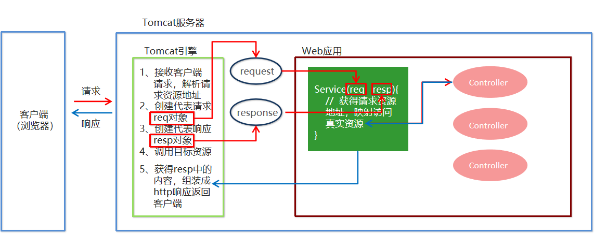

# 34-Spring_mvc

# 1. 关于三层架构和MVC

## 1.1 三层架构

我们的开发架构一般都是基于两种形式，一种是 C/S 架构，也就是客户端/服务器，另一种是 B/S 架构，也就
是浏览器服务器。在 JavaEE 开发中，几乎全都是基于 B/S 架构的开发。那么在 B/S 架构中，系统标准的三层架构
包括：表现层、业务层、持久层。三层架构在我们的实际开发中使用的非常多，三层架构中，每一层各司其职，接下来我们就说说每层都负责哪些方面。

**表现层：**

- 也就是我们常说的web层。它负责接收客户端请求，向客户端响应结果，通常客户端使用http协议请求
  web 层，web 需要接收 http 请求，完成 http 响应。
- 表现层包括展示层和控制层：控制层负责接收请求，展示层负责结果的展示。
- 表现层依赖业务层，接收到客户端请求一般会调用业务层进行业务处理，并将处理结果响应给客户端。
- 表现层的设计一般都使用 MVC 模型。（MVC 是表现层的设计模型，和其他层没有关系）

**业务层：**

- 也就是我们常说的 service 层。它负责业务逻辑处理，和我们开发项目的需求息息相关。web 层依赖业
  务层，但是业务层不依赖 web 层。

- 业务层在业务处理时可能会依赖持久层，如果要对数据持久化需要保证事务一致性。（也就是我们说的，
  事务应该放到业务层来控制）

**持久层：**

- 也就是我们是常说的 Dao 层。负责数据持久化，包括数据层即数据库和数据访问层，数据库是对数据进
  行持久化的载体，数据访问层是业务层和持久层交互的接口，业务层需要通过数据访问层将数据持久化到数据库中。通俗的讲，持久层就是和数据库交互，对数据库表进行增删改查的。

## 1.2 MVC模型

MVC 全名是 Model View Controller，是模型(model)－视图(view)－控制器(controller)的缩写，
是一种用于设计创建 Web 应用程序表现层的模式。MVC 中每个部分各司其职：

- Model（模型）：通常指的就是我们的数据模型。作用一般情况下用于封装数据

- View（视图）：

  通常指的就是我们的 jsp 或者 html。作用一般就是展示数据的。

  通常视图是依据模型数据创建的。

- Controller（控制器）：

  是应用程序中处理用户交互的部分。作用一般就是处理程序逻辑的。

  它相对于前两个不是很好理解，这里举个例子

  > 我们要保存一个用户的信息，该用户信息中包含了姓名，性别，年龄等等。
  > 这时候表单输入要求年龄必须是 1~100 之间的整数。姓名和性别不能为空。并且把数据填充
  > 到模型之中。
  > 此时除了 js 的校验之外，服务器端也应该有数据准确性的校验，那么校验就是控制器的该做
  > 的。
  > 当校验失败后，由控制器负责把错误页面展示给使用者。
  > 如果校验成功，也是控制器负责把数据填充到模型，并且调用业务层实现完整的业务需求。

## 1.3 SpringMVC概述

概念：

SpringMVC 是一种基于 Java 的实现 MVC 设计模型的请求驱动类型的轻量级 Web 框架，属于 Spring 
FrameWork 的后续产品，已经融合在 Spring Web Flow 里面。Spring 框架提供了构建 Web 应用程序的全功
能 MVC 模块。使用 Spring 可插入的 MVC 架构，从而在使用 Spring 进行 WEB 开发时，可以选择使用 Spring
的 Spring MVC 框架或集成其他 MVC 开发框架，如 Struts1(现在一般不用)，Struts2 等。

SpringMVC 已经成为目前最主流的 MVC 框架之一，并且随着 Spring3.0 的发布，全面超越 Struts2，成
为最优秀的 MVC 框架。

它通过一套注解，让一个简单的 Java ，而无须实现任何接口。同时它还支持
RESTful 编程风格的请求

**SpringMVC 在三层架构的位置**


**SpringMVC 的优势**

1. 清晰的角色划分：

   - 前端控制器（DispatcherServlet）

   - 请求到处理器映射（HandlerMapping）

   - 处理器适配器（HandlerAdapter）

   - 视图解析器（ViewResolver）

   - 处理器或页面控制器（Controller）

   - 验证器（ Validator）

   - 命令对象（Command 请求参数绑定到的对象就叫命令对象）

   - 表单对象（Form Object 提供给表单展示和提交到的对象就叫表单对象）。

2. 分工明确，而且扩展点相当灵活，可以很容易扩展，虽然几乎不需要。

3. 由于命令对象就是一个 POJO，无需继承框架特定 API，可以使用命令对象直接作为业务对象。

4. 和 Spring 其他框架无缝集成，是其它 Web 框架所不具备的。

5. 可适配，通过 HandlerAdapter 可以支持任意的类作为处理器。

6. 可定制性，HandlerMapping、ViewResolver 等能够非常简单的定制。

7. 功能强大的数据验证、格式化、绑定机制。

8. 利用 Spring 提供的 Mock 对象能够非常简单的进行 Web 层单元测试。

9. 本地化、主题的解析的支持，使我们更容易进行国际化和主题的切换。

10. 强大的 JSP 标签库，使 JSP 编写更容易

**SpringMVC 和 Struts2 的优略**

共同点：

- 它们都是表现层框架，都是基于 MVC 模型编写的。
- 它们的底层都离不开原始 ServletAPI。
- 它们处理请求的机制都是一个核心控制器

区别：

- Spring MVC 的入口是 Servlet, 而 Struts2 是 Filter 

- Spring MVC 是基于方法设计的，而 Struts2 是基于类，Struts2 每次执行都会创建一个动作类。所
  以 Spring MVC 会稍微比 Struts2 快些。

- Spring MVC 使用更加简洁,同时还支持 JSR303, 处理 ajax 的请求更方便

  > (JSR303 是一套 JavaBean 参数校验的标准，它定义了很多常用的校验注解，我们可以直接将这些注
  > 解加在我们 JavaBean 的属性上面，就可以在需要校验的时候进行校验了。)

- Struts2 的 OGNL 表达式使页面的开发效率相比 Spring MVC 更高些，但执行效率并没有比 JSTL 提
  升，尤其是 struts2 的表单标签，远没有 html 执行效率高。

# 2. SpringMVC入门案例

## 2.1 servlet知识回顾

1. 创建项目spring_mvc

2. 导入坐标

   ```xml
   <dependency>
       <groupId>org.springframework</groupId>
       <artifactId>spring-context</artifactId>
       <version>5.0.5.RELEASE</version>
   </dependency>
   <dependency>
       <groupId>javax.servlet</groupId>
       <artifactId>javax.servlet-api</artifactId>
       <version>3.1.0</version>
   </dependency>
   <dependency>
       <groupId>javax.servlet.jsp</groupId>
       <artifactId>javax.servlet.jsp-api</artifactId>
       <version>2.3.1</version>
       <scope>provided</scope>
       <!-- complile : 编译时需要,打包时也需要
            runtime : 编译时不需要,打包时需要  mysql
            provided : 编译时需要,打包时不需要 servlet
            test: 测试时需要,其他不需要 junit
    servlet-api,jsp-api,这两个jar, tomcat 自带所以打包时不需要,否则tomcat7 启动报错-->
   </dependency>
   ```

3. 创建包dao

   - 在包dao下创建接口类

     ```java
     public interface Userdao {
         void save();
     }
     ```

   - 在包dao下创建impl包，并在其下创建实现类

     ```java
     public class UserDaoImpl implements Userdao {
         @Override
         public void save() {
             System.out.println("save running....");
         }
     }
     ```

4. 创建包service

   - 在包service下创建接口类

     ```java
     public interface userService {
         void FindUser();
     }
     ```

   - 在包service下创建impl包，并在其下创建实现类

     ```java
     public class userServiceImpl implements userService {
         private Userdao userdao;
         public void setUserDao(Userdao userdao){
             this.userdao = userdao;
         }
     
         @Override
         public void FindUser() {
             userdao.save();
         }
     }
     ```

5. 创建包web，并创建userServlet类

   ```java
   public class userServlet extends HttpServlet {
   
       @Override
       protected void doGet(HttpServletRequest req, HttpServletResponse resp) throws ServletException, IOException {
           ApplicationContext app = new ClassPathXmlApplicationContext("application.xml");
           userService userService = (service.userService) app.getBean("userService");
           userService.FindUser();
       }
   }
   ```

6. 创建application.xml配置文件

   ```xml
   <bean id="userDao"  class="dao.impl.UserDaoImpl"></bean>
   <bean id="userService" class="service.impl.userServiceImpl">
       <property name="userDao" ref="userDao"></property>
   </bean>
   ```

7. 右键此项目，选择Add Framework Support，选择Web Application，然后点击ok

8. 此时，已生成web目录，配置其中的web.xml文件

   ```xml
   <!-- 配置 servlet 的核心控制器 -->
   <servlet>
       <servlet-name>spring_mvc</servlet-name>
       <servlet-class>web.userServlet</servlet-class>
   </servlet>
   <servlet-mapping>
       <servlet-name>spring_mvc</servlet-name>
       <url-pattern>/userServlet</url-pattern>
   </servlet-mapping>
   ```

9. 运行访问

   此时，会在右上角的运行位置出现tomcat相关组件，直接运行即可，也可以根据需要自行配置相关内容

   访问路径：

   ```
   http://localhost:8080/spring_mvc_war_exploded/userServlet?a=1
   ```

   此时，控制台输出 save running....

   注意：此时极有可能报java.lang.ClassNotFoundException错误，原因是jar未配入tomcat

   解决方法：File---Project Structure----Artifacts----项目名（右键选择 Put into Output Root），此时，可以与左边的WEB-INF下看见lib目录，里面有相关jar包，当然也可以手动在WEB-INF下创建lib包，导入相关jar文件

   

## 2.2 监听器回顾与补充

根据以上内容，得出如下问题

1. 服务器接收到客户端请求时每次都要创建ApplicationContext对象，读取application.xml配置文件，那么，当请求有很多个时，会不会造成资源浪费呢？会
2. 直接通过名称读取application.xml配置文件是不是不太好，万一以后需要修改呢？
3. 程序中应当尽量避免出现具体的名字，如：`ApplicationContext app = (ApplicationContext) servletContext.getAttribute("app")`中的app，避免名字与其他程序出现重复等问题

解决方法：

1. 在Web项目中，可以使用ServletContextListener监听Web应用的启动，我们可以在Web应用启动时，就加载Spring的配置文件，创建应用上下文对象ApplicationContext，在将其存储到最大的域servletContext域中，这样就可以在任意位置从域中获得应用上下文ApplicationContext对象了。

2. 可以将此文件名配置到web.xml中的全局参数中，在程序中，只需要获取就可以直接使用了

3. 针对此问题，一般都会将具体的名字隐藏（封装成一个具体的java类）

   具体的方法：创建工具类，创建一个方法，返回相应的内容即可

**代码实现：**

1. 创建包listener，创建类ContextListener

   ```java
   public class ContextListener implements ServletContextListener {
       @Override
       public void contextInitialized(ServletContextEvent sce) {
           ServletContext servletContext = sce.getServletContext();
   
           // 读取web.xml中的全局参数
           String contextConfigLocation = servletContext.getInitParameter("contextConfigLocation");
           // 创建Spring容器对象
           ApplicationContext app = new ClassPathXmlApplicationContext(contextConfigLocation);
           // 存储spring对象到servletContext域中
           servletContext.setAttribute("app",app);
   
       }
       @Override
       public void contextDestroyed(ServletContextEvent sce) {
   
       }
   }
   ```

2. 创建包SpringUtils，并在其下创建工具类

   ```java
   public class WebUtils {
       public static ApplicationContext getWebApplicationContext(ServletContext servletContext){
           return (ApplicationContext) servletContext.getAttribute("app");
       }
   }
   ```

3. 配置web.xml文件

   ```xml
   <!--全局初始化参数-->
   <context-param>
       <param-name>contextConfigLocation</param-name>
       <!--注意：这里不使用classpath也可以，虽然这里会爆红，但是可以正常运行-->
       <param-value>classpath:application.xml</param-value>
   </context-param>
   <!-- 配置 servlet 的核心控制器 -->
   <servlet>
       <servlet-name>spring_mvc</servlet-name>
       <servlet-class>web.userServlet</servlet-class>
   </servlet>
   <servlet-mapping>
       <servlet-name>spring_mvc</servlet-name>
       <url-pattern>/userServlet</url-pattern>
   </servlet-mapping>
   
   <!--配置监听器-->
   <listener>
       <listener-class>listener.ContextListener</listener-class>
   </listener>
   ```

4. 修改userServlet代码

   ```java
   public class userServlet extends HttpServlet {
   
       @Override
       protected void doGet(HttpServletRequest req, HttpServletResponse resp) throws ServletException, IOException {
   //        ApplicationContext app = new ClassPathXmlApplicationContext("application.xml");
           ServletContext servletContext = this.getServletContext();
           
   //        ApplicationContext app = (ApplicationContext) servletContext.getAttribute("app");
           ApplicationContext app = WebUtils.getWebApplicationContext(servletContext);
           userService userService = (userService) app.getBean("userService");
           userService.FindUser();
       }
   }
   ```

5. 运行测试

   重启tomcat服务器，再次访问以下路径，查看是否正确输出内容

   ```
   http://localhost:8080/spring_mvc_war_exploded/userServlet?a=1
   ```

## 2.3 Spring集成WEB环境

上面的分析不用手动实现，Spring提供了一个监听器ContextLoaderListener就是对上述功能的封装，该监听器内部加载Spring配置文件，创建应用上下文对象，并存储到ServletContext域中，提供了一个客户端工具WebApplicationContextUtils供使用者获得应用上下文对象。

所以我们需要做的只有两件事：

1. 在web.xml中配置ContextLoaderListener监听器（导入spring-web坐标）
2. 使用WebApplicationContextUtils获得应用上下文对象ApplicationContext

实现步骤：

1. 导入Spring集成web的坐标

   ```xml
   <dependency>
       <groupId>org.springframework</groupId>
       <artifactId>spring-web</artifactId>
       <version>5.0.5.RELEASE</version>
   </dependency>
   ```

2. 配置ContextLoaderListener监听器

   ```xml
   <!--
   如果不特意指定参数名为contextConfigLoction的<context-parameter>元素，
   那么spring的ContextLoderListener监听器就会在/WEB-INF/下去寻找并加载该目录下
   的名为applicationContext.xml这个文件
   -->
   <!--全局初始化参数-->
   <context-param>
       <param-name>contextConfigLocation</param-name>
       <!--注意：这里不使用classpath也可以，虽然这里会爆红，但是可以正常运行-->
       <param-value>classpath:application.xml</param-value>
   </context-param>
   
   <!--配置监听器-->
   <listener>
       <listener-class>org.springframework.web.context.ContextLoaderListener</listener-class>
   </listener>
   ```

3. 修改userServlet代码，通过工具获得应用上下文对象

   ```java
   public class userServlet extends HttpServlet {
   
       @Override
       protected void doGet(HttpServletRequest req, HttpServletResponse resp) throws ServletException, IOException {
           ServletContext servletContext = this.getServletContext();
          
   // WebApplicationContextUtils是一个抽象类，并且继承了ApplicationContext类，其提供了一个很便利的方法来获取spring应用的上下文，即ApplicationContext
           WebApplicationContext app = WebApplicationContextUtils.getWebApplicationContext(servletContext);
           userService userService = (userService) app.getBean("userService");
           userService.FindUser();
       }
   }
   
   ```

4. 测试访问

   ```
   http://localhost:8080/spring_mvc_war_exploded/userServlet?a=1
   ```
   
5. 知识要点

   - 配置ContextLoaderListener监听器
   - 使用WebApplicationContextUtils获取应用上下文对象

## 2.3 SpringMVC快速入门

需求：客户端发起请求，服务器端接收请求，执行逻辑并进行视图跳转。


代码实现：

1. 导入SpringMVC相关坐标

   ```xml
   <dependency>
       <groupId>org.springframework</groupId>
       <artifactId>spring-context</artifactId>
       <version>5.0.5.RELEASE</version>
   </dependency>
   <dependency>
       <groupId>org.springframework</groupId>
       <artifactId>spring-webmvc</artifactId>
       <version>5.0.5.RELEASE</version>
   </dependency>
   <dependency>
       <groupId>javax.servlet</groupId>
       <artifactId>javax.servlet-api</artifactId>
       <version>3.1.0</version>
   </dependency>
   <dependency>
       <groupId>javax.servlet.jsp</groupId>
       <artifactId>javax.servlet.jsp-api</artifactId>
       <version>2.3.1</version>
   </dependency>
   <dependency>
       <groupId>org.springframework</groupId>
       <artifactId>spring-web</artifactId>
       <version>5.0.5.RELEASE</version>
   </dependency>
   ```

2. 创建Controller包，及其类和视图页面，并使用注解配置Controller类中业务方法的映射地址

   **Controller简介：**

   > 在SpringMVC 中，控制器Controller 负责处理由DispatcherServlet 分发的请求，它把用户请求的数据经过业务处理层处理之后封装成一个Model ，然后再把该Model 返回给对应的View 进行展示。在SpringMVC 中提供了一个非常简便的定义Controller 的方法，你无需继承特定的类或实现特定的接口，只需使用@Controller 标记一个类是Controller ，然后使用@RequestMapping 和@RequestParam 等一些注解用以定义URL 请求和Controller 方法之间的映射，这样的Controller 就能被外界访问到。此外Controller 不会直接依赖于HttpServletRequest 和HttpServletResponse 等HttpServlet 对象，它们可以通过Controller 的方法参数灵活的获取到。

   - 创建控制器类

     ```java
     @Controller
     public class userController {
     
     // 请求映射，也就是通过它来指定控制器可以处理哪些URL请求，相当于Servlet中在web.xml中的配置映射作用一致
     // 当访问quick时，映射到save方法 
         @RequestMapping("/quick")
         public String save(){
             System.out.println("Controller save running ...");
             return "/success.jsp";
         }
     }
     ```

   - 创建视图页面

     ```jsp
     <%@ page contentType="text/html;charset=UTF-8" language="java" %>
     <html>
     <head>
         <title>Title</title>
     </head>
     <body>
         <h1>Success</h1>
     </body>
     </html>
     ```

3. 配置SpringMVC核心文件 spring-mvc.xml

   注意从业务上区分spring和springMVC，以下内容仅仅扫描了controller包的内容

   ```xml
   <!--组件扫描，记得添加命名空间-->
   <context:component-scan base-package="itcast.controller"></context:component-scan>
   ```

4. 在web.xml中配置SpringMVC核心控制器DispathcerServlet

   ```xml
   <!--配置SpringMVC的核心控制器-->
   <servlet>
       <servlet-name>DispatcherServlet</servlet-name>
       <servlet-class>org.springframework.web.servlet.DispatcherServlet</servlet-class>
       <init-param>
           <param-name>contextConfigLocation</param-name>
           <param-value>classpath:spring-mvc.xml</param-value>
       </init-param>
       <!-- 服务器启动时创建对象-->
       <load-on-startup>1</load-on-startup>
   </servlet>
   <servlet-mapping>
       <servlet-name>DispatcherServlet</servlet-name>
       <url-pattern>/</url-pattern>
       <!--
          1)  /*  拦截所有  ,拦截jsp   
          2)  / 表示拦截所有 (不拦截jsp)
          3)  /user/* 拦截user 下的所有资源
          4)  *.do    拦截.do 结尾的请求
          错误:  /*.do 非法配置
        -->
   </servlet-mapping>
   ```

5. 客户端发起请求测试

   访问测试地址

   ```
   http://localhost:8080/spring_mvc_war_exploded/quick
   ```

6. SpringMVC开发总结

   - 导入SpringMVC相关坐标
   - 配置SpringMVC核心控制器DispathcerServlet
   - 创建Controller类和视图页面
   - 使用注解配置Controller类中业务方法的映射地址
   - 配置SpringMVC核心文件 spring-mvc.xml
   - 客户端发起请求测试

## 2.4 SpringMVC流程

springMVC流程图



springMVC执行流程


DispatcherServlet，分发器，前端控制器，实质也是一个HttpServlet。DispatcherServlet 负责将请求分发，所有的请求都有经过它来统一分发。

- 用户发送请求至前端控制器DispatcherServlet。

- DispatcherServlet收到请求调用HandlerMapping处理器映射器。

- 处理器映射器找到具体的处理器(可以根据xml配置、注解进行查找)，生成处理器对象及处理器拦截器(如果有则生成)一并返回给DispatcherServlet。

- DispatcherServlet调用HandlerAdapter处理器适配器。

- HandlerAdapter经过适配调用具体的处理器(Controller，也叫后端控制器)。

  在填充Handler的入参过程中，根据你的配置，Spring将帮你做一些额外的工作：

  - HttpMessageConveter： 将请求消息（如Json、xml等数据）转换成一个对象，将对象转换为指定的响应信息
  - 数据转换：对请求消息进行数据转换。如String转换成Integer、Double等
  - 数据格式化：对请求消息进行数据格式化。 如将字符串转换成格式化数字或格式化日期等
  - 数据验证： 验证数据的有效性（长度、格式等），验证结果存储到BindingResult或Error中

- Controller执行完成返回ModelAndView。

- HandlerAdapter将controller执行结果ModelAndView返回给DispatcherServlet。

- DispatcherServlet将ModelAndView传给ViewReslover视图解析器。

- ViewReslover解析后返回具体View。

- DispatcherServlet根据View进行渲染视图（即将模型数据填充至视图中）。DispatcherServlet响应用户。


- HttpMessageConveter： 将请求消息（如Json、xml等数据）转换成一个对象，将对象转换为指定的响应信息
- 数据转换：对请求消息进行数据转换。如String转换成Integer、Double等
- 数据格式化：对请求消息进行数据格式化。 如将字符串转换成格式化数字或格式化日期等
- 数据验证： 验证数据的有效性（长度、格式等），验证结果存储到BindingResult或Error中

Handler执行完成后，向DispatcherServlet 返回一个ModelAndView对象；根据返回的ModelAndView，选择一个适合的ViewResolver返回给DispatcherServlet；ViewResolver 结合Model和View，来渲染视图，最后将渲染结果返回给客户端。

## 2.5 SpringMVC相关解析

**SpringMVC组件解析**

1.  前端控制器：DispatcherServlet

   用户请求到达前端控制器，它就相当于 MVC 模式中的 C，DispatcherServlet 是整个流程控制的中心，由
   它调用其它组件处理用户的请求，DispatcherServlet 的存在降低了组件之间的耦合性。

2. 处理器映射器：HandlerMapping

   HandlerMapping 负责根据用户请求找到 Handler 即处理器，SpringMVC 提供了不同的映射器实现不同的
   映射方式，例如：配置文件方式，实现接口方式，注解方式等。

3. 处理器适配器：HandlerAdapter

   通过 HandlerAdapter 对处理器进行执行，这是适配器模式的应用，通过扩展适配器可以对更多类型的处理
   器进行执行。
   
4.  Handler：处理器

    它就是我们开发中要编写的具体业务控制器。由 DispatcherServlet 把用户请求转发到 Handler。由Handler 对具体的用户请求进行处理。

5.  View Resolver：视图解析器

    View Resolver 负责将处理结果生成 View 视图，View Resolver 首先根据逻辑视图名解析成物理视图名即具体的页面地址，再生成 View 视图对象，最后对 View 进行渲染将处理结果通过页面展示给用户。

6.  View：视图

    SpringMVC 框架提供了很多的 View 视图类型的支持，包括：jstlView、freemarkerView、pdfView等。我们最常用的视图就是 jsp。

    一般情况下需要通过页面标签或页面模版技术将模型数据通过页面展示给用户，需要由程序员根据业务需求开发具体的页面。


**SpringMVC注解解析**

1. @RequestMapping

   作用：用于建立请求 URL 和处理请求方法之间的对应关系

   位置：

   - 类上，请求URL 的第一级访问目录。此处不写的话，就相当于应用的根目录

   - 方法上，请求 URL 的第二级访问目录，与类上的使用`@ReqquestMapping`标注的一级目录一起组成访问虚拟路径

     示例：

     ```java
     @Controller
     @RequestMapping("/demo")
     public class userController {
     
     //此时的请求地址：http://localhost:8080/spring_mvc_war_exploded/demo/quick
      	@RequestMapping("/quick")
         public String save(){
             System.out.println("Controller save running ...");
         
     // 注意，加反斜杠是表示从当前web应用下找此资源，/demo/quick
     // 如果不加反斜杠，则表示相对路径，相对于当前资源所在地址找资源 会报错 ： /spring_mvc_war_exploded/demo/success.jsp 源服务器未能找到目标资源的表示或者是不愿公开一个已经存在的资源表示。
             return "/success.jsp";
       }
     }
     ```
     

   属性：

   - value：用于指定请求的URL。它和path属性的作用是一样的

     ```
     @RequestMapping(value = "/demo")
     ```

   - method：用于指定请求的方式

     ```
     @RequestMapping(value = "/demo",method = RequestMethod.POST)
     ```

   - params：用于指定限制请求参数的条件。它支持简单的表达式。要求请求参数的key和value必须和配置的一模一样

     ```java
    @RequestMapping(value = "/demo",method = RequestMethod.POST,params =  {"accountName"})
     ```

     例如：
     - `params = {"accountName"}`，表示请求参数必须有accountName
     - `params = {"moeny!100"}`，表示请求参数中money不能是100
     
   - headers：用于指定限制请求消息头的条件

   **注意：以上四个属性只要出现 2 个或以上时，他们的关系是`与`的关系**

2. mvc命名空间引入

   命名空间：

   ```
   xmlns:context="http://www.springframework.org/schema/context"
   xmlns:mvc="http://www.springframework.org/schema/mvc"
   ```

   约束地址

   ```
   http://www.springframework.org/schema/context http://www.springframework.org/schema/context/spring-context.xsd
   
   http://www.springframework.org/schema/mvc http://www.springframework.org/schema/mvc/spring-mvc.xsd
   ```

3. 组件扫描

   SpringMVC基于Spring容器，所以在进行SpringMVC操作时，需要将Controller存储到Spring容器中，如果使用@Controller注解标注的话，就需要使用`<context:component-scan base-package=“com.itheima.controller"/>`进行组件扫描。


**资源路径**

示例代码

```java
@Controller
@RequestMapping("/demo")
public class userController {

    @RequestMapping("/quick")
    public String save(){
        System.out.println("Controller save running ...");

        return "/success.jsp";

    }
}

```

关于return返回资源的说明：

1. 加斜杠和不加斜杠是两个概念

   - 加斜杠：加反斜杠是表示从当前web应用下找此资源，/demo/quick
   - 不加反斜杠：则表示相对路径，相对于当前资源所在地址找资源

2. 前缀和后缀

   ```
   return "/jsp/success.jsp";
   ```

   如上所示：资源位于web资源项目jsp文件夹下，其后缀名为jsp

   如果觉得每个项目都要这样去写，很累，可以进行如下配置spring-mvc.xml

   ```xml
    <!--    配置内部资源视图解析器-->
    <bean id="viewResolver" class="org.springframework.web.servlet.view.InternalResourceViewResolver">
        <!-- 后缀-->
        <property name="prefix" value="/jsp/"></property>
        <!-- 前缀-->
        <property name="suffix" value=".jsp"></property>
    </bean>
   ```

   修改控制器

   ```java
   @Controller
   @RequestMapping("/demo")
   public class userController {
       @RequestMapping("/quick")
       public String save(){
           System.out.println("Controller save running ...");
           return "success";
       }
   }
   ```

   重新访问路径

   ```
   http://localhost:8080/spring_mvc_war_exploded/demo/quick
   ```

3. 重定向和请求转发

   请求重定向

   ```
   return "redirect:/jsp/success.jsp";
   ```

   默认即是请求转发

   ```
    return "forward:/jsp/success.jsp";
   ```

   注意：当配置了内部资源视图解析器的前缀和后缀的时候，重定向会造成404，因为无法直接访问WEB-INF下资源

   

# 3.SpringMVC的响应和请求

## 3.1 数据响应

SpringMVC的数据响应方式

1. 页面跳转
   - 直接返回字符串
   - 通过ModelAndView对象返回
2. 回写数据
   - 直接返回字符串
   - 返回对象或集合

### 3.1.1 页面跳转

1. 返回字符串形式

   直接返回字符串：此种方式会将返回的字符串与视图解析器的前后缀进行拼接后跳转

   ```java
   //    映射请求，也就是通过它来指定控制器可以处理哪些URL请求，相当于Servlet中在web.xml中配置
   //    此时的请求地址：http://localhost:8080/spring_mvc_war_exploded/demo/quick
   @RequestMapping("/quick")
   public String save(){
       System.out.println("Controller save running ...");
   
   
   //        请求重定向
   //        return "redirect:/success.jsp";
   //        默认：请求转发
   //        return "forward:success";
   
       return "success";
   }
   ```

   ```xml
   <!--    配置内部资源视图解析器-->
   <bean id="viewResolver" class="org.springframework.web.servlet.view.InternalResourceViewResolver">
       <!-- 后缀-->
       <property name="prefix" value="/jsp/"></property>
       <!-- 前缀-->
       <property name="suffix" value=".jsp"></property>
   </bean>
   ```

   返回带有前缀的字符串：

   - 转发：forward:/jsp/success.jsp

     需要注意的是，如果用了` formward：`则路径必须写成实际视图 url，不能写逻辑视图。它相当于`request.getRequestDispatcher("url").forward(request,response)`，使用请求转发，既可以转发到 jsp，也可以转发到其他的控制器方法。

   - 重定向：redirect:/success.jsp

     它相当于`response.sendRedirect(url)`。需要注意的是，如果是重定向到 jsp 页面，则 jsp 页面不能写在 WEB-INF 目录中，否则无法找到

   转发资源地址：/jsp/success.jsp

2. 返回ModelAndView对象

   ```java
   @RequestMapping("/quick3")
   public ModelAndView save3(ModelAndView view){
       view.setViewName("success");
   
       return view;
   }
   
   @RequestMapping("/quick2")
   public ModelAndView save2(){
       ModelAndView view = new ModelAndView();
       view.setViewName("success");
   
       return view;
   }
   ```

3. 向request域存储数据

   在进行转发时，往往要向request域中存储数据，在jsp页面中显示，那么Controller中怎样向request域中存储数据呢？

   - 通过SpringMVC框架注入的request对象`setAttribute()`方法设置

     ```java
     @RequestMapping("/quick5")
     public String save5(HttpServletRequest request){
         request.setAttribute("username", "erdan");
     
         return "success";
     }
     ```

   - 通过ModelAndView的`addObject()`方法设置

     ```java
     @RequestMapping("/quick3")
     public ModelAndView save3(ModelAndView view){
         view.addObject("username", "lisi");
         view.setViewName("success");
     
         return view;
     }
     ```

### 3.1.2 回写数据

1. 直接返回字符串

   Web基础阶段，客户端访问服务器端，如果想直接回写字符串作为响应体返回的话，只需要使用
   `response.getWriter().print(“hello world”) `即可，那么在Controller中想直接回写字符串该怎样呢？

   - 通过SpringMVC框架注入的response对象，使用`response.getWriter().print(“hello world”)` 回写数据，此时不需要视图跳转，业务方法返回值为void。

     ```java
     @RequestMapping("/quick6")
     public void save6(HttpServletResponse response) throws IOException {
         response.getWriter().println("hello world");
     }
     ```

   - 将需要回写的字符串直接返回，但此时需要通过`@ResponseBody`注解告知SpringMVC框架，方法返回的字符串不是跳转是直接在http响应体中返回。

     ```java
     @RequestMapping("/quick7")
     @ResponseBody // 告诉springMVC框架 不进行视图跳转，直接进行数据响应
     public String save7(){
         return "hello world2";
     }
     ```

2. 使用jackson，返回JSON字符串

   在异步项目中，客户端与服务器端往往要进行json格式字符串交互，此时我们可以手动拼接json字符串返回。

   ```java
   @RequestMapping("/quick8")
   @ResponseBody
   public String save8(){
       return "{\"name\":\"zhangsan\",\"age\":18}";
   }
   ```

   这样拼接的方式很麻烦，可以使用web阶段学习过的json转换工具jackson进行转换，导入jackson坐标

   1. 导入坐标

      ```xml
      <dependency>
          <groupId>com.fasterxml.jackson.core</groupId>
          <artifactId>jackson-core</artifactId>
          <version>2.9.8</version>
      </dependency>
      <dependency>
          <groupId>com.fasterxml.jackson.core</groupId>
          <artifactId>jackson-databind</artifactId>
          <version>2.9.8</version>
      </dependency>
      <dependency>
          <groupId>com.fasterxml.jackson.core</groupId>
          <artifactId>jackson-annotations</artifactId>
          <version>2.9.5</version>
      </dependency>
      ```

   2. 创建JavaBean类

      ```java
      public class user {
          private String user;
          private int age;
          
          // 省略set和get方法
      }
      ```

   3. 实现

      ```java
      @RequestMapping("/quick9")
      @ResponseBody
      public String save9() throws JsonProcessingException {
          user user = new user();
          user.setAge(12);
          user.setUser("zhangsan");
      
          ObjectMapper json = new ObjectMapper();
          String s = json.writeValueAsString(user);
          return s;
      }
      
      ```

3. 使用SpringMVC的适配器配置消息转换参数，指定使用jackson进行对象或集合的转换

   ```xml
   <bean class="org.springframework.web.servlet.mvc.method.annotation.RequestMappingHandlerAdapter">
       <property name="messageConverters">
           <list>
               <bean class="org.springframework.http.converter.json.MappingJackson2HttpMessageConverter"></bean>
               </list>
       </property>
   </bean>
   ```

   ```java
   @RequestMapping("/quick10")
   @ResponseBody
   public user save10() throws JsonProcessingException {
       user user = new user();
       user.setAge(12);
       user.setUser("zhangsan");
   
       return user;
   }
   ```

4. 使用`<mvc:annotation-driven>`替代注解处理器和适配器的配置

   > 在 SpringMVC 的各个组件中，处理器映射器、处理器适配器、视图解析器称为 SpringMVC 的三大组件。
   
   > 使 用 `<mvc:annotation-driven>` 自动加载 RequestMappingHandlerMapping （处理映射器） 和
   > RequestMappingHandlerAdapter （ 处 理 适 配 器 ） ， 可 用 在 SpringMVC.xml 配 置 文 件 中 使 用
   > `<mvc:annotation-driven>`替代注解处理器和适配器的配置。同时使用`<mvc:annotation-driven>`默认底层就会集成jackson进行对象或集合的json格式字符串的转换。
   
   ```xml
xmlns:mvc="http://www.springframework.org/schema/mvc"
   
   <!--使用mvc的注解驱动，替代内部资源视图解析器-->
   <!--mvc的注解驱动-->
   <mvc:annotation-driven/>
   ```
   
   ```java
   @RequestMapping("/quick10")
   @ResponseBody
   public user save10() throws JsonProcessingException {
       user user = new user();
    user.setAge(12);
       user.setUser("zhangsan");
   
       return user;
   }
   ```
   

## 3.2 获得请求数据

### 3.2.1 获得请求参数

客户端请求参数的格式是：`name=value&name=value… …`
服务器端要获得请求的参数，有时还需要进行数据的封装，SpringMVC可以接收如下类型的参数

- 基本类型参数

  包括基本类型和 String 类型

- POJO类型参数

  包括实体类，以及关联的实体类

- 数组类型参数和集合类型参数

  包括 List 结构和 Map 结构的集合（包括数组）

使用要求：

- 如果是基本类型或者 String 类型：

  要求我们的参数名称必须和控制器中方法的形参名称保持一致。(严格区分大小写)

- 如果是 POJO 类型，或者它的关联对象：

  要求表单中参数名称和 POJO 类的属性名称保持一致。并且控制器方法的参数类型是 POJO 

- 如果是集合类型,有两种方式：

  - 第一种：

    要求集合类型的请求参数必须在 POJO 中。在表单中请求参数名称要和 POJO 中集合属性名称相同。

    给 List 集合中的元素赋值，使用下标。

    给 Map 集合中的元素赋值，使用键值对。

  - 第二种：

    接收的请求参数是 json 格式数据。需要借助一个注解实现。

代码实现：

1. 获得基本类型参数

   Controller中的业务方法的参数名称要与请求参数的name一致，参数值会自动映射匹配。

   ```java
   @RequestMapping("/request1")
   @ResponseBody
   public void save(String user,int age){
       System.out.println(user);
       System.out.println(age);
   }
   ```

   请求地址

   ```
   http://localhost:8080/spring_mvc/request1?user=zhangsan&age=12
   ```

2. 获得POJO类型参数

   Controller中的业务方法的POJO参数的属性名与请求参数的name一致，参数值会自动映射匹配。

   ```java
   @RequestMapping("/request2")
   @ResponseBody
   public void save2(user user){
       System.out.println(user.getAge());
       System.out.println(user.getUser());
   }
   ```

   ```java
   public class user {
       private String user;
       private int age;
       // 省略get与set方法
   }
   ```

   访问地址

   ```
   http://localhost:8080/spring_mvc/request2?user=zhangsan&age=12
   ```

3. 获得数组类型参数

   Controller中的业务方法数组名称与请求参数的name一致，参数值会自动映射匹配。

   ```java
   @RequestMapping("/request3")
   @ResponseBody
   public void save3(String[] strs){
       System.out.println(Arrays.asList(strs));
   }
   ```

   访问地址：

   ```
   http://localhost:8080/spring_mvc/request3?strs=zhangsan&strs=12
   ```

4. 获得集合类型参数

   获得集合参数时，要将集合参数包装到一个POJO中才可以。

   ```java
   @RequestMapping("/request4")
   @ResponseBody
   public void save4(userList userList){
       System.out.println(userList);
       
       // userList{userList=[user{user='zhangsan', age=12}, user{user='lisi', age=13}], userMap={one=user{user='zhangsan1', age=122}, two=user{user='zhangsan2', age=231}}}

   }
   ```
   
   ```java
   public class userList {
       List<user> userList;
       Map<String,user> userMap;
	// 省略get与set方法
   	// 省略toString方法
   }
   ```
   
   ```java
   public class user {
       private String user;
    private int age;
       // 省略get与set方法
}
   ```
   
   使用方式：
   
   ```jsp
   <%@ page contentType="text/html;charset=UTF-8" language="java" %>
   <html>
   <head>
       <title>Title</title>
   </head>
   <body>
   
   <form action="${pageContext.request.contextPath}/request4" method="post">
       <input type="text" name="userList[0].user"><br>
       <input type="text" name="userList[0].age"><br>
       <input type="text" name="userList[1].user"><br>
       <input type="text" name="userList[1].age"><br>
   	<input type="text" name="userMap['one'].user" ><br/>
       <input type="text" name="userMap['one'].age" ><br/>
    <input type="text" name="userMap['two'].user" ><br/>
       <input type="text" name="userMap['two'].age" ><br/>

       <input type="submit" value="提交">
   </form>
   </body>
   </html>
   
   ```
   
   访问地址：
   
   ```
   http://localhost:8080/spring_mvc/form.jsp
   ```

### 3.2.2 @RequestBody响应json数据

作用：

该注解用于将 Controller 的方法返回的对象，通过 `HttpMessageConverter `接口转换为指定格式的数据如：json,xml 等，通过 Response 响应给客户端

当使用ajax提交时，可以指定contentType为json形式，那么**在方法参数位置使用`@RequestBody`**可以直接接收集合数据而无需使用POJO进行包装。

```jsp
<%@ page contentType="text/html;charset=UTF-8" language="java" %>
<html>
<head>
    <title>Title</title>
    <script src="${pageContext.request.contextPath}/js/jquery-3.3.1.js"></script>
    <script>
        let userList = new Array();
        userList.push({user:"lisi",age:12})
        userList.push({user:"zhangsan",age:15})

        $.ajax({
            type:"POST",
            url:"${pageContext.request.contextPath}/request5",
            data:JSON.stringify(userList),
            contentType:"application/json;charset=utf-8"
        })
    </script>
</head>
<body>

</body>
</html>
```

```java
@RequestMapping("/request5")
@ResponseBody
public void save5(@RequestBody List<user> userList){
// @RequestBody主要用来接收前端传递给后端的json字符串中的数据的(请求体中的数据的),GET方式无请求体，所以需要用POST方式进行提交
//一个请求，只有一个RequestBody；一个请求，可以有多个RequestParam。
    System.out.println(userList);
}
```

```java
public class user {
    private String user;
    private int age;
    // 省略get与set方法
    // 省略toString方法
}
```

访问地址：

```
http://localhost:8080/spring_mvc/ajax.jsp
```

存在问题：jQuery文件无法访问

原因：原因是SpringMVC的前端控制器`DispatcherServlet`的`url-pattern`配置的是`/`，代表对所有的资源都进行过滤操作

解决方法：在spring-mvc.xml中指定放行静态资源，以下两种任选其一即可

```xml
<!--    开放资源的访问权限-->
<!--    <mvc:resources mapping="/js/**" location="/js/"/>-->
    
<!--    springMVC尝试去找静态资源，如果找不到，则交还给tomcat去寻找此静态资源-->
    <mvc:default-servlet-handler/>
```

### 3.2.3 请求数据乱码问题

当post请求时，中文数据会出现乱码，我们可以设置一个过滤器来进行编码的过滤。

配置web.xml

```xml
<!--    配置全局过滤filter-->
<filter>
    <filter-name>CharacterEncodingFilter</filter-name>
    <filter-class>org.springframework.web.filter.CharacterEncodingFilter</filter-class>
    <!-- 设置过滤器中的属性值 --> 
    <init-param>
        <param-name>encoding</param-name>
        <param-value>UTF-8</param-value>
    </init-param>
    <!-- 启动过滤器 -->
    <init-param>
        <param-name>forceEncoding</param-name>
        <param-value>true</param-value>
    </init-param>
</filter>
<!-- 过滤所有请求 --> 
<filter-mapping>
    <filter-name>CharacterEncodingFilter</filter-name>
    <url-pattern>/*</url-pattern>
</filter-mapping>
```

在 springMVC的配置文件中可以配置，静态资源不过滤：

```xml
<!-- location 表示路径，mapping 表示文件，**表示该目录下的文件以及子目录的文件 -->
<mvc:resources location="/css/" mapping="/css/**"/>
<mvc:resources location="/images/" mapping="/images/**"/>
<mvc:resources location="/scripts/" mapping="/javascript/**"/>
```

注：tomcat 对 GET 和 POST 请求处理方式是不同的，GET 请求的编码问题，要改 tomcat 的 server.xml
配置文件，如下：

```xml
<Connector connectionTimeout="20000" port="8080"
           protocol="HTTP/1.1" redirectPort="8443"/>

改为：

<Connector connectionTimeout="20000" port="8080"
           protocol="HTTP/1.1" redirectPort="8443"
           useBodyEncodingForURI="true"/>

如果遇到 ajax 请求仍然乱码，请把：useBodyEncodingForURI="true"改为 URIEncoding="UTF-8"即可
```


### 3.2.4 参数绑定注解

```java
@RequestMapping("/request6")
@ResponseBody
public void save6(@RequestParam(value = "name",required = false,defaultValue = "李四") String username){
//@RequestParam：将请求参数绑定到你控制器的方法参数上（是springmvc中接收普通参数的注解）
/**
  * value：参数名
  * required：是否包含该参数，默认为true，表示该请求路径中必须包含该参数，如果不包含就报错。
  * defaultValue：默认参数值，如果设置了该值，required=true将失效，自动为false,如果没有传该参数，就使用默认值
  */
    System.out.println(username);
}
```

访问地址：

```
http://localhost:8080/spring_mvc/request6?username=21&name=12
```

关于注解`@RequestParam`参数

- value：参数名
- required：是否包含该参数，默认为true，表示该请求路径中必须包含该参数，如果不包含就报错。
- defaultValue：默认参数值，如果设置了该值，`required=true`将失效，自动为false,如果没有传该参数，就使用默认值

### 3.2.5 获得Restful风格的参数

Restful是一种软件架构风格、设计风格，而不是标准，只是提供了一组设计原则和约束条件。主要用于客户端和服务器交互类的软件，基于这个风格设计的软件可以更简洁，更有层次，更易于实现缓存机制等。

Restful风格的请求是使用 “url+请求方式”表示一次请求目的的，HTTP 协议里面四个表示操作方式的动词如下：

- GET：用于获取资源
- POST：用于新建资源
- PUT：用于更新资源
- DELETE：用于删除资源  

示例：

- /user/1    GET ：       得到 id = 1 的 user
- /user/1    DELETE：  删除 id = 1 的 user
- /user/1    PUT：       更新 id = 1 的 user
- /user       POST：      新增 user

上述URL地址`/user/1`中的`1`就是要获得的请求参数，在SpringMVC中可以使用占位符进行参数绑定。地址`/user/1`可以写成`/user/{id}`，占位符`{id}`对应的就是`1`的值。在业务方法中我们可以使用`@PathVariable`注解进行占位符的匹配获取工作。

- 作用： 

  由于浏览器 form 表单只支持 GET 与 POST 请求，而 DELETE、PUT 等 method 并不支持，Spring3.0 添加了一个过滤器，可以将浏览器请求改为指定的请求方式，发送给我们的控制器方法，使得支持 GET、POST、PUT 与 DELETE 请求。

- 使用方法： 

  - 第一步：在 web.xml 中配置该过滤器。
  - 第二步：请求方式**必须使用 post 请求。**
  - 第三步：按照要求提供_method 请求参数，该参数的取值就是我们需要的请求方式。

简单使用：

```java
@RequestMapping("/request7/{name}")
@ResponseBody
public void save7(@PathVariable("name") String username){
// @PathVariable是spring3.0的一个新功能：接收请求路径中占位符的值
// 通过 @PathVariable 可以将URL中占位符参数{xxx}绑定到处理器类的方法形参中
	System.out.println(username); // 张三
}
```

访问地址

```
http://localhost:8080/spring_mvc/request7/张三
```

使用表单提交方式

```jsp
<!-- 保存 -->
<form action="springmvc/testRestPOST" method="post">
    用户名称：<input type="text" name="username"><br/>
    <!-- <input type="hidden" name="_method" value="POST"> -->
    <input type="submit" value="保存">
</form>

<hr/>

<!-- 更新 -->
<form action="springmvc/testRestPUT/1" method="post">
    用户名称：<input type="text" name="username"><br/>
    <input type="hidden" name="_method" value="PUT">
    <input type="submit" value="更新">
</form>

<hr/>

<!-- 删除 -->
<form action="springmvc/testRestDELETE/1" method="post">
    <input type="hidden" name="_method" value="DELETE">
    <input type="submit" value="删除">
</form>

<hr/>

<!-- 查询一个 -->
<form action="springmvc/testRestGET/1" method="post">
    <input type="hidden" name="_method" value="GET">
    <input type="submit" value="查询">
</form> 
```

```java
/**
* post 请求：保存
* @param username
* @return
*/
@RequestMapping(value="/testRestPOST",method=RequestMethod.POST)
public String testRestfulURLPOST(User user){
    System.out.println("rest post"+user);
    return "success";
}
/**
* put 请求：更新
* @param username
* @return
*/
@RequestMapping(value="/testRestPUT/{id}",method=RequestMethod.PUT)
public String testRestfulURLPUT(@PathVariable("id")Integer id,User user){
    System.out.println("rest put "+id+","+user);
    return "success";
}

/**
* post 请求：删除
* @param username
* @return
*/
@RequestMapping(value="/testRestDELETE/{id}",method=RequestMethod.DELETE)
public String testRestfulURLDELETE(@PathVariable("id")Integer id){
    System.out.println("rest delete "+id);
    return "success";
}

/**
* post 请求：查询
* @param username
* @return
*/
@RequestMapping(value="/testRestGET/{id}",method=RequestMethod.GET)
public String testRestfulURLGET(@PathVariable("id")Integer id){
    System.out.println("rest get "+id);
    return "success";
} 

```


### 3.2.6 自定义类型转换器

SpringMVC 默认已经提供了一些常用的类型转换器，例如客户端提交的字符串转换成int型进行参数设置。

但是不是所有的数据类型都提供了转换器，没有提供的就需要自定义转换器，例如：日期类型的数据就需要自定义转换器。

自定义类型转换器的开发步骤：

1. 定义转换器类实现Converter接口，

   创建包converter包，定义一个类，实现 Converter 接口，该接口有两个泛型

   ```java
   package itcast.converter;
   
   import org.springframework.core.convert.converter.Converter;
   
   import java.text.ParseException;
   import java.text.SimpleDateFormat;
   import java.util.Date;
   
   public class DateConverter implements Converter<String,Date> {
   
       // 用于把 String 类型转成日期类型
       @Override
       public Date convert(String dataStr) {
           SimpleDateFormat format = new SimpleDateFormat("yyyy-MM-dd");
           Date parse = null;
           try {
               parse = format.parse(dataStr);
           } catch (ParseException e) {
               e.printStackTrace();
           }
           return parse;
       }
   }
   ```

2. 在 spring 配置文件中配置类型转换器。

   配置spring-mvc.xml文件，spring 配置类型转换器的机制是，将自定义的转换器注册到类型转换服务中去。

   ```xml
   <!-- 配置类型转换器工厂 -->
   <bean id="conversionService" class="org.springframework.context.support.ConversionServiceFactoryBean">
       <!-- 给工厂注入一个新的类型转换器 -->
       <property name="converters">
           <list>
               <!-- 配置自定义类型转换器 -->
           	<bean class="itcast.converter.DateConverter"></bean>
           </list>
       </property>
   </bean>
   ```

3. 在`<annotation-driven>`中引用转换器

   配置spring-mvc.xml文件

   ```xml
   <!--mvc注解驱动-->
   <!--引用转换器-->
   <mvc:annotation-driven conversion-service="conversionService"/>
   ```

4. 测试代码

   ```java
   @RequestMapping("/request8")
   @ResponseBody
   public void save8(Date date){
       System.out.println(date); // Wed Aug 08 00:00:00 CST 2018
   }
   ```

5. 访问地址

   ```
   http://localhost:8080/spring_mvc/request8?date=2018-8-8
   ```

## 3.3 使用 ServletAPI 对象作为方法参数

SpringMVC支持使用原始ServletAPI对象作为控制器方法的参数进行注入，常用的对象如下：

- HttpServletRequest
- HttpServletResponse
- HttpSession

```java
@RequestMapping("/request9")
@ResponseBody
public void save9(HttpServletRequest request, HttpServletResponse response, HttpSession session){
    System.out.println(request);
    System.out.println(response);
    System.out.println(session);
}
```

访问地址：

```
http://localhost:8080/spring_mvc/request9
```

输出结果

```
org.apache.catalina.connector.RequestFacade@2930819
org.apache.catalina.connector.ResponseFacade@c54f63b
org.apache.catalina.session.StandardSessionFacade@86b6369
```

## 3.4 常用注解

1. @RequestParam

   作用：把请求中指定名称的参数给控制器中的形参赋值。

   属性：

   - value：请求参数中的名称。
   - required：请求参数中是否必须提供此参数。默认值：true。表示必须提供，如果不提供将报错。

   示例：

   ```java
   @RequestMapping("/useRequestParam")
   public String useRequestParam(@RequestParam("name")String username,
                                 @RequestParam(value="age",required=false)Integer age){
       System.out.println(username+","+age);
       return "success";
   }
   ```

2. @RequestBody

   作用：用于获取请求体内容。直接使用得到是 `key=value&key=value...`结构的数据。get 请求方式不适用。

   属性：

   - required：是否必须有请求体。默认值是:true。当取值为 true 时,get 请求方式会报错。如果取值
     为 false，get 请求得到是 null。

   示例：

   ```jsp
   <form action="springmvc/useRequestBody" method="post">
   用户名称：<input type="text" name="username" ><br/>
   用户密码：<input type="password" name="password" ><br/>
   用户年龄：<input type="text" name="age" ><br/>
   <input type="submit" value="保存">
   </form>
   ```

   ```java
   @RequestMapping("/useRequestBody")
   public String useRequestBody(@RequestBody(required=false) String body){
       System.out.println(body);
       return "success";
   }
   ```

3. @PathVaribale

   作用：用于绑定 url 中的占位符。例如：请求 url 中 `/delete/{id}`，这个`{id}`就是 url 占位符。url 支持占位符是 spring3.0 之后加入的。是 springmvc 支持 rest 风格 URL 的一个重要标志。

   属性：

   - value：用于指定 url 中占位符名称。
   - required：是否必须提供占位符

   示例

   ```java
   @RequestMapping("/usePathVariable/{id}")
   public String usePathVariable(@PathVariable("id") Integer id){
       System.out.println(id);
       return "success";
   }
   ```

4. @RequestHeader

   作用：用于获取请求消息头。

   属性：

   - value：提供消息头名称

   - required：是否必须有此消息头

   注：在实际开发中一般不怎么用。

   示例：

   ```java
   @RequestMapping("/useRequestHeader")
   public String useRequestHeader(@RequestHeader(value="Accept-Language",
                                                 required=false)String requestHeader){
       System.out.println(requestHeader);
       return "success";
   }
   ```

5. @CookieValue

   作用：用于把指定 cookie 名称的值传入控制器方法参数。

   属性：

   - value：指定 cookie 的名称。

   - required：是否必须有此 cookie

   示例：

   ```java
   @RequestMapping("/useCookieValue")
   public String useCookieValue(@CookieValue(value="JSESSIONID",required=false) 
                                String cookieValue){
       System.out.println(cookieValue);
       return "success";
   }
   ```

6. @ModelAttribute

   作用：

   - 该注解是 SpringMVC4.3 版本以后新加入的。它可以用于修饰方法和参数。

   - 出现在方法上，表示当前方法会在控制器的方法执行之前，先执行。它可以修饰没有返回值的方法，也可以修饰有具体返回值的方法。

   - 出现在参数上，获取指定的数据给参数赋值。

   属性：

   - value：用于获取数据的 key。key 可以是 POJO 的属性名称，也可以是 map 结构的 key。

   应用场景：

   - 当表单提交数据不是完整的实体类数据时，保证没有提交数据的字段使用数据库对象原来的数据。

   例如：

   我们在编辑一个用户时，用户有一个创建信息字段，该字段的值是不允许被修改的。在提交表单数据是肯定没有此字段的内容，一旦更新会把该字段内容置为 null，此时就可以使用此注解解决问题。

   示例：

   ```java
   /**
   * 被 ModelAttribute 修饰的方法
   * @param user
   */
   @ModelAttribute
   public void showModel(User user) {
       System.out.println("执行了 showModel 方法"+user.getUsername());
   }
   /**
   * 接收请求的方法
   * @param user
   * @return
   */
   @RequestMapping("/testModelAttribute")
   public String testModelAttribute(User user) {
       System.out.println("执行了控制器的方法"+user.getUsername());
       return "success";
   }
   ```

7. @SessionAttribute

   作用：用于多次执行控制器方法间的参数共享。

   属性：

   - value：用于指定存入的属性名称
   - type：用于指定存入的数据类型。

   示例：

   ```java
   @Controller("sessionAttributeController")
   @RequestMapping("/springmvc")
   @SessionAttributes(value ={"username","password"},types={Integer.class}) 
   public class SessionAttributeController {
       /**
       * 把数据存入 SessionAttribute
       * @param model
       * @return
       * Model 是 spring 提供的一个接口，该接口有一个实现类 ExtendedModelMap
       * 该类继承了 ModelMap，而 ModelMap 就是 LinkedHashMap 子类
       */
       @RequestMapping("/testPut") 
       public String testPut(Model model){ 
           model.addAttribute("username", "泰斯特"); 
           model.addAttribute("password","123456"); 
           model.addAttribute("age", 31); 
           //跳转之前将数据保存到 username、password 和 age 中，因为注解@SessionAttribute 中有这几个参数 
           return "success"; 
       } 
   
       @RequestMapping("/testGet") 
       public String testGet(ModelMap model){
           System.out.println(model.get("username")+";"+model.get("password")+";"+model.get("age"));
           return "success";
       } 
   
       @RequestMapping("/testClean")                                                     public String complete(SessionStatus sessionStatus){
           sessionStatus.setComplete();                                                       return "success";
       } 
                                                                                      }
   ```

   

## 3.5 获得请求头

1. `@RequestHeader`

   使用`@RequestHeader`可以获得请求头信息，相当于web阶段学习的`request.getHeader(name)`

   `@RequestHeader`注解的属性如下：

   - value：请求头的名称
   - required：是否必须携带此请求头

   ```java
   @RequestMapping("/request10")
   @ResponseBody
   public void save10(@RequestHeader("User-Agent") String user_Agent){
   // @RequestHeader即可将请求头中的属性值绑定到处理方法的入参中
       System.out.println(user_Agent);
       // Mozilla/5.0 (Windows NT 10.0; Win64; x64) AppleWebKit/537.36 (KHTML, like Gecko) Chrome/83.0.4103.116 Safari/537.36
   
   }
   ```

   访问地址

   ```
   http://localhost:8080/spring_mvc/request10
   ```

2.  `@CookieValue`

   使用`@CookieValue`可以获得指定Cookie的值

   `@CookieValue`注解的属性如下：

   - value：指定cookie的名称
   - required：是否必须携带此cookie

   ```java
   @RequestMapping("/request11")
   @ResponseBody
   public void save11(@CookieValue("JSESSIONID") String cookie){
   // @CookieValue注解主要是将请求的Cookie数据，映射到功能处理方法的参数上。
       System.out.println(cookie);  
   }
   ```

   访问地址

   ```
   http://localhost:8080/spring_mvc/request11
   ```

## 3.6 文件上传

文件上传客户端三要素：

- 表单项`type=“file”`
- 表单的提交方式是`post`
- 表单的`enctype`属性是多部分表单形式，及`enctype=“multipart/form-data”`，默认值是：`application/x-www-form-urlencoded`

**示例：单文件上传**

导入坐标

```xml
<dependency>
    <groupId>commons-fileupload</groupId>
    <artifactId>commons-fileupload</artifactId>
    <version>1.3.1</version>
</dependency>
<dependency>
    <groupId>commons-io</groupId>
    <artifactId>commons-io</artifactId>
    <version>2.6</version>
</dependency>
```

配置文件上传解析器

```xml
<!--    配置文件上传解析器-->
<!-- 文件上传的解析器 id 是固定的，不能起别的名称，否则无法实现请求参数的绑定。（不光是文件，其他
字段也将无法绑定-->
<bean id="multipartResolver"  class="org.springframework.web.multipart.commons.CommonsMultipartResolver">
    <!--上传文件总大小-->
    <property name="maxUploadSize" value="5242800"/>
    <!--上传单个文件的大小-->
    <property name="maxUploadSizePerFile" value="5242800"/>
    <!--上传文件的编码类型-->
    <property name="defaultEncoding" value="UTF-8"/>
</bean>

```

编写代码

```java
 @RequestMapping("/request12")
 @ResponseBody
 public void save12(String name, MultipartFile upload) throws IOException {
     //注意：参数名需要和jsp文件中的name值相对应

    System.out.println(name);
    System.out.println(upload);

    // 获得原始文件名称
    String filename = upload.getOriginalFilename();
    // 保存文件
    upload.transferTo(new File("C:\\Users\\宋天\\Desktop\\qwe"+filename));
}
```

```jsp
<%@ page contentType="text/html;charset=UTF-8" language="java" %>
<html>
<head>
    <title>Title</title>
</head>
<body>
<%--
enctype 属性规定在发送到服务器之前应该如何对表单数据进行编码。
默认地，表单数据会编码为 "application/x-www-form-urlencoded"

multipart/form-data  不对字符编码。
在使用包含文件上传控件的表单时，必须使用该值
--%>
    <form action="${pageContext.request.contextPath}/request12" method="post" enctype="multipart/form-data">
        名称<input type="text" name="name"><br>
        文件<input type="file" name="upload"><br>
        <input type="submit" value="提交">
    </form>
</body>
</html>

```

访问地址：

```
http://localhost:8080/spring_mvc/upload.jsp
```

文件上传原理：

- 当form表单修改为多部分表单时，也就是 form 表单的` enctype`取值不是默认值后，`request.getParameter()`将失效。
- `enctype=“application/x-www-form-urlencoded”`时，form表单的正文内容格式是：`key=value&key=value&key=value`
- 当form表单的`enctype`取值为`Mutilpart/form-data`时，请求正文内容就变成多部分形式：


**多文件上传**

多文件上传，只需要将页面修改为多个文件上传项，将方法参数`MultipartFile`类型修改为`MultipartFile[]`即可

```jsp
<form action="${pageContext.request.contextPath}/request13" method="post" enctype="multipart/form-data">
    名称<input type="text" name="name"><br>
    文件<input type="file" name="upload"><br>
    文件<input type="file" name="upload2"><br>
    <input type="submit" value="提交">
</form>
```

```java
@RequestMapping("/request13")
@ResponseBody
public void save13(String name, MultipartFile upload,MultipartFile upload2) throws IOException {
    // 获得文件名称
    String filename = upload.getOriginalFilename();
    // 保存文件
    upload.transferTo(new File("C:\\Users\\宋天\\Desktop\\"+filename));
    // 获得文件名称
    String filename2 = upload2.getOriginalFilename();
    // 保存文件
    upload2.transferTo(new File("C:\\Users\\宋天\\Desktop\\"+filename2));

}
```

修改版

```jsp
<form action="${pageContext.request.contextPath}/request14" method="post" enctype="multipart/form-data">
    名称<input type="text" name="name"><br>
    文件<input type="file" name="upload"><br>
    文件<input type="file" name="upload"><br>
    <input type="submit" value="提交">
</form>
```

```java
@RequestMapping("/request14")
@ResponseBody
public void save14(String name, MultipartFile[] upload) throws IOException {
    System.out.println(name);
    for (MultipartFile multipartFile :upload){
        String filename = multipartFile.getOriginalFilename();
        multipartFile.transferTo(new File("C:\\Users\\宋天\\Desktop\\"+filename));
    }
}
```

# 4. SpringMVC拦截器

作用：Spring MVC 的拦截器类似于 Servlet  开发中的过滤器 Filter，用于对处理器进行预处理和后处理。

将拦截器按一定的顺序联结成一条链，这条链称为**拦截器链**（Interceptor Chain）。在访问被拦截的方法或字段时，拦截器链中的拦截器就会按其之前定义的顺序被调用。拦截器也是AOP思想的具体实现。

**拦截器和过滤器的区别：**

| **区别** | **过滤器**                                                  | **拦截器**                                                   |
| -------- | ----------------------------------------------------------- | ------------------------------------------------------------ |
| 使用范围 | 是 servlet 规范中的一部分，任何 Java Web 工程都可以使用     | 是 SpringMVC 框架自己的，只有使用了 SpringMVC 框架的工程才能用 |
| 拦截范围 | 在 url-pattern 中配置了`/*`之后，可以对所有要访问的资源拦截 | 只会拦截访问的控制器方法，如果访问的是 jsp，html,css,image 或者 js 是不会进行拦截的 |

## 4.1 拦截器快速入门

1. 创建拦截器类实现HandlerInterceptor接口

   ```java
   public class MyInterceptor implements HandlerInterceptor {
   
       // 在目标方法执行之前执行
       @Override
       public boolean preHandle(HttpServletRequest request, HttpServletResponse response, Object handler) throws Exception {
           System.out.println("preHandle....");
           return true; // 返回false表示不放行
       }
       // 目标方法执行之后，视图返回之前执行
       @Override
       public void postHandle(HttpServletRequest request, HttpServletResponse response, Object handler, ModelAndView modelAndView) throws Exception {
           System.out.println("postHandle....");
           
           modelAndView.addObject("name","lisi");
       }
       
       // 在流程全部执行完毕后，执行
       @Override
       public void afterCompletion(HttpServletRequest request, HttpServletResponse response, Object handler, Exception ex) throws Exception {
           System.out.println("afterCompletion....");
       }
   }
   ```

2. 配置拦截器

   配置spring-mvc.xml

   ```xml
   <!--配置拦截器1-->
   <mvc:interceptors>
       <mvc:interceptor>
           <!-- 对那些资源执行拦截操作 /** 表示全部-->
           <mvc:mapping path="/**"/>
           <bean class="itcast.interceptor.MyInterceptor"></bean>
       </mvc:interceptor>
   </mvc:interceptors>
   ```

3. 测试拦截器的拦截效果

   ```java
   @Controller
   public class interceptor{
   
       @RequestMapping("/demo")
       @ResponseBody
       public ModelAndView save(){
           System.out.println("资源访问");
           ModelAndView view = new ModelAndView();
           view.addObject("name","zhangsan");
           // 注意，这里直接写index是因为已经配置过了前后缀
           view.setViewName("index");
           return view;
       }
   }
   ```

4. 创建jsp页面

   ```jsp
   <%@ page contentType="text/html;charset=UTF-8" language="java" %>
   <html>
   <head>
       <title>Title</title>
   </head>
   <body>
   
   <h1>hello world ${name}</h1>
   </body>
   </html>
   ```

5. 测试结果

   访问路径

   ```
   http://localhost:8080/spring_mvc_interceptor/demo
   ```

   控制台打印如下内容

   ```
   preHandle....
   资源访问
   postHandle....
   afterCompletion....
   ```

   页面输出：输出name值是lisi的原因是在拦截器中进行过变更

   ```
   hello world lisi
   ```

## 4.2 多拦截器操作 

同上，在编写一个拦截器

```java
public class MyInterceptor2 implements HandlerInterceptor {
    // 在目标方法执行之前执行
    @Override
    public boolean preHandle(HttpServletRequest request, HttpServletResponse response, Object handler) throws Exception {
        System.out.println("preHandle2222....");
        return true; // 返回false表示不放行
    }

    // 目标方法执行之后，视图返回之前执行
    @Override
    public void postHandle(HttpServletRequest request, HttpServletResponse response, Object handler, ModelAndView modelAndView) throws Exception {
        System.out.println("postHandle2222....");

        modelAndView.addObject("name","lisi");
    }

    // 在流程全部执行完毕后，执行
    @Override
    public void afterCompletion(HttpServletRequest request, HttpServletResponse response, Object handler, Exception ex) throws Exception {
        System.out.println("afterCompletion2222....");
    }
}

```

配置spring-mvc.xml，增加如下内容

```xml
<!--配置拦截器2-->
<mvc:interceptors>
    <mvc:interceptor>
        <!-- 对那些资源执行拦截操作 -->
        <mvc:mapping path="/**"/>
        <bean class="itcast.interceptor.MyInterceptor2"></bean>
        <!--排除拦截-->
        <mvc:exclude-mapping path="/c"/>
    </mvc:interceptor>
</mvc:interceptors>
```

再次访问地址，查看控制台输出结果

```
http://localhost:8080/spring_mvc_interceptor/demo
```

```
preHandle....
preHandle2222....
资源访问
postHandle2222....
postHandle....
afterCompletion2222....
afterCompletion....
```

将spring-mvc.xml文件中配置的拦截器顺序反转以下，再次访问地址，查看结果

```xml
<!--配置拦截器2-->
<mvc:interceptors>
    <mvc:interceptor>
        <!-- 对那些资源执行拦截操作 -->
        <mvc:mapping path="/**"/>
        <!--排除拦截-->
        <mvc:exclude-mapping path="/c"/>
        <bean class="itcast.interceptor.MyInterceptor2"></bean>
    </mvc:interceptor>
</mvc:interceptors>

<!--配置拦截器1-->
<mvc:interceptors>
    <mvc:interceptor>
        <!-- 对那些资源执行拦截操作 -->
        <mvc:mapping path="/**"/>
        <bean class="itcast.interceptor.MyInterceptor"></bean>
    </mvc:interceptor>
</mvc:interceptors>
```

结果如下

```
preHandle2222....
preHandle....
资源访问
postHandle....
postHandle2222....
afterCompletion....
afterCompletion2222....
```

## 4.3 拦截器方法说明

| **方法名**          | **说明**                                                     |
| ------------------- | ------------------------------------------------------------ |
| `preHandle()`       | 方法将在请求处理之前进行调用，该方法的返回值是布尔值Boolean类型的，当它返回为false 时，表示请求结束，后续的Interceptor 和Controller 都不会再执行；当返回值为true 时就会继续调用下一个Interceptor 的preHandle 方法 |
| `postHandle()`      | 该方法是在当前请求进行处理之后被调用，前提是preHandle 方法的返回值为true 时才能被调用，且它会在DispatcherServlet 进行视图返回渲染之前被调用，所以我们可以在这个方法中对Controller 处理之后的ModelAndView 对象进行操作 |
| `afterCompletion()` | 该方法将在整个请求结束之后，也就是在DispatcherServlet 渲染了对应的视图之后执行，前提是preHandle 方法的返回值为true 时才能被调用 |

## 4.4 拦截器案例

验证用户是否登录

步骤：

1. 有一个登录页面，需要写一个 controller 访问页面
2. 登录页面有一提交表单的动作。需要在 controller 中处理。
   1. 判断用户名密码是否正确
   2. 如果正确 向 session 中写入用户信息
   3. 返回登录成功。
3. 拦截用户请求，判断用户是否登录
   1. 如果用户已经登录。放行
   2. 如果用户未登录，跳转到登录页面

```java
//登陆页面
@RequestMapping("/login")
public String login(Model model)throws Exception{
    return "login";
}
//登陆提交
//userid：用户账号，pwd：密码
@RequestMapping("/loginsubmit")
public String loginsubmit(HttpSession session,String userid,String pwd)throws
    Exception{
    //向 session 记录用户身份信息
    session.setAttribute("activeUser", userid);
    return "redirect:/main.jsp";
}
//退出
@RequestMapping("/logout")
public String logout(HttpSession session)throws Exception{
    //session 过期
    session.invalidate();
    return "redirect:index.jsp";
}
```

```java
public class LoginInterceptor implements HandlerInterceptor{
    @Override
    Public boolean preHandle(HttpServletRequest request,
                             HttpServletResponse response, Object handler) throws Exception {
        //如果是登录页面则放行
        if(request.getRequestURI().indexOf("login.action")>=0){
            return true;
        }
        HttpSession session = request.getSession();
        //如果用户已登录也放行
        if(session.getAttribute("user")!=null){
            return true;
        }
        //用户没有登录挑战到登录页面
        request.getRequestDispatcher("/WEB-INF/jsp/login.jsp").forward(request, 
                                                                       response);
        return false;
    }
}
```


# 5. SpringMVC异常处理机制

## 5.1 异常处理的思路

系统中异常包括两类：预期异常和运行时异常RuntimeException，前者是通过捕获异常从而获得异常信息，后者主要是通过规范代码开发，测试等手段减少运行时异常的发生。

系统的Dao ，Service，Controller出现都通过trows Exception向上抛出，最后由SpringMVC的前端控制器Controller交由异常处理器进行异常处理，如下图


## 5.2 异常处理的两种方式

1. 使用SpringMVC提供的简单异常处理器SimpleMappingExceptionResolver
2. 实现Spring的异常处理接口HandlerExceptionResolver自定义自己的异常处理器

准备工作：

测试异常类

```java
public class showException {
    public void show1(){
        System.out.println("算数运算异常");
        int i = 1/0;
    }

    public void show2(){
        System.out.println("空指针异常");
        int[] i = null;
        System.out.println(i[0]);
    }

    public void show3(){
        System.out.println("类型转换异常");
        String str = "asd";
        Integer.parseInt(str);
    }

    public void show4() throws exception{
        System.out.println("自定义异常");
        throw new exception();
    }

}

```


```java
public class exception extends Exception{
  
}
```

### 5.2.1 简单异常处理器

1. SpringMVC已经定义好了该类型转换器，在使用时可以根据项目情况进行相应异常与视图的映射配置

   ```xml
   <!--配置异常处理器-->
   <bean class="org.springframework.web.servlet.handler.SimpleMappingExceptionResolver">
       <!--value值为跳转的视图页面，这里由于配置过了前后缀，就不需要写后缀了-->
     	<property name="defaultErrorView" value="error"></property>
   </bean>
   ```

2. 测试方法

   ```java
   @RequestMapping("/show1")
   @ResponseBody
   public void show1(){
       showException showException = new showException();
       showException.show1();
   }
   @RequestMapping("/show2")
   @ResponseBody
   public void show2(){
       showException showException = new showException();
       showException.show2();
   }
   @RequestMapping("/show3")
   @ResponseBody
   public void show3(){
       showException showException = new showException();
       showException.show3();
   }
   @RequestMapping("/show4")
   @ResponseBody
   public void show4() throws exception {
       showException showException = new showException();
       showException.show4();
   }
   ```

3. 错误页面

   ```jsp
   <%@ page contentType="text/html;charset=UTF-8" language="java" %>
   <html>
       <head>
           <title>Title</title>
       </head>
       <body>
           <h1>error</h1>
       </body>
   </html>
   ```

4. 测试结果

   按照顺序从show1开始访问，控制台依次输出结果为

   ```
   算数运算异常
   空指针异常
   类型转换异常
   自定义异常
   ```

5. 配置异常处理器的异常类型跳转

   ```xml
   <!--配置异常处理器-->
   <bean class="org.springframework.web.servlet.handler.SimpleMappingExceptionResolver">
       <!--value值为跳转的视图页面，这里由于配置过了前后缀，就不需要写后缀了-->
   	<!--<property name="defaultErrorView" value="error"></property>-->
       <property name="exceptionMappings">
           <map>
               <!--key为错误类型，value为跳转页面-->
               <entry key="java.lang.ArithmeticException" value="error1"></entry>
               <entry key="java.lang.NullPointerException" value="error2"></entry>
               <entry key="java.lang.NumberFormatException" value="error3"></entry>
               <entry key="itcast.myException.exception" value="error4"></entry>
           </map>
       </property>
   </bean>
   
   ```

6. 错误视图

   - error1.jsp

     ```jsp
     <%@ page contentType="text/html;charset=UTF-8" language="java" %>
     <html>
         <head>
             <title>Title</title>
         </head>
         <body>
             <h1>算数运算异常</h1>
         </body>
     </html>
     ```

   - error2.jsp

     ```jsp
     <%@ page contentType="text/html;charset=UTF-8" language="java" %>
     <html>
         <head>
             <title>Title</title>
         </head>
         <body>
             <h1>空指针异常</h1>
         </body>
     </html>
     ```

   - error3.jsp

     ```jsp
     <%@ page contentType="text/html;charset=UTF-8" language="java" %>
     <html>
         <head>
             <title>Title</title>
         </head>
         <body>
             <h1>类型转换异常</h1>
         </body>
     </html>
     ```

   - error4.jsp

     ```jsp
     <%@ page contentType="text/html;charset=UTF-8" language="java" %>
     <html>
         <head>
             <title>Title</title>
         </head>
         <body>
             <h1>自定义异常</h1>
         </body>
     </html>
     ```

7. 依次访问show1至show4，查看页面是否跳转，且控制台输出相关内容

   控制台依次输出如下内容

   ```
   算数运算异常
   空指针异常
   类型转换异常
   自定义异常
   ```

### 5.2.2 自定义异常处理步骤

1. 创建异常处理器类并实现HandlerExceptionResolver接口

   ```java
   public class CustomExceptionResolver implements HandlerExceptionResolver {
       /**
        *
        * 参数 Exception e 异常对象
        * 返回值 ModelAndView 跳转到错误视图信息
        */
       @Override
       public ModelAndView resolveException(HttpServletRequest httpServletRequest, HttpServletResponse httpServletResponse, Object o, Exception e) {
           ModelAndView view = new ModelAndView();
   
           if (e instanceof exception){
               view.addObject("message" ,"自定义异常");
           }else if (e instanceof ArithmeticException){
               view.addObject("message" ,"算数运算异常");
           }else if (e instanceof NullPointerException){
               view.addObject("message" ,"空指针异常");
           }else if (e instanceof NumberFormatException){
               view.addObject("message" ,"类型转换异常");
           }
   
           view.setViewName("error");
           return view;
       }
   }
   
   ```

   自定义异常类

   ```java
   public class exception extends Exception{
   
   }
   ```

2. 配置异常处理器

   ```xml
   <!--自定义异常处理-->
   <bean class="itcast.myException.CustomExceptionResolver"></bean>
   ```

3. 编写异常页面

   ```jsp
   <%@ page contentType="text/html;charset=UTF-8" language="java" %>
   <html>
       <head>
           <title>Title</title>
       </head>
       <body>
           <h1>error</h1>
           <h1>${message}</h1>
       </body>
   </html>
   ```

4. 测试异常跳转，依次访问show1至show4，结果如下

   控制台输出

   ```
   算数运算异常
   空指针异常
   类型转换异常
   自定义异常
   ```

   页面正常跳转，并输出message值