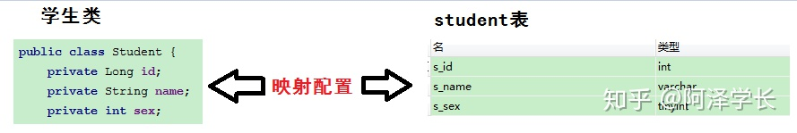
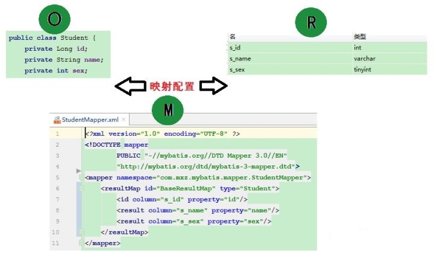
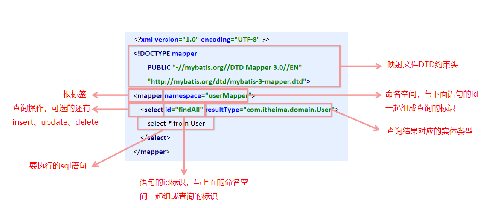
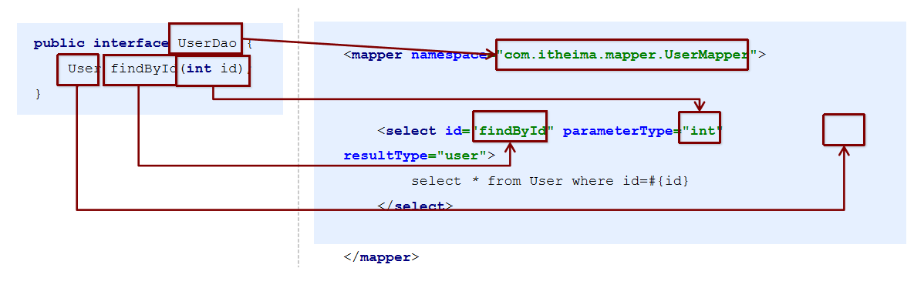
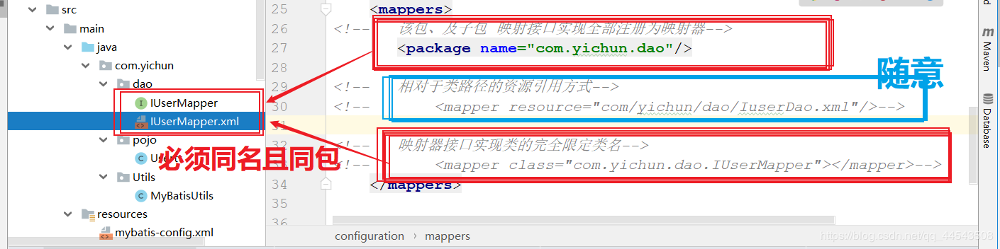

# 35-mybatis框架

# 1. ORM思想概述

对象关系映射（Object Relational Mapping，简称ORM，或O/RM，或O/R mapping），是一种程序技术，用于实现面向对象编程语言里不同类型系统的数据之间的转换。从效果上说，它其实是创建了一个可在编程语言里使用的“虚拟对象数据库”。

广义上，ORM指的是面向对象的对象模型和关系型数据库的数据结构之间的相互转换。 狭义上，ORM可以被认为是，基于关系型数据库的数据存储，实现一个虚拟的面向对象的数据访问接口。

**ORM的定义：**

- O(对象模型)：

  实体对象，即我们在程序中根据数据库表结构建立的一个个实体Entity。

- R(关系型数据库的数据结构)：

  即我们建立的数据库表。

- M(映射)：

  从R（数据库）到O（对象模型）的映射，可通过XML文件映射。

简单的说，ORM 是通过使用描述对象和数据库之间映射的元数据，将 Java 程序中的对象自动持久化到关系型数据库中。



有了映射关系之后，就不用担心对象属性名和表字段列名不匹配的问题了。



ORM 框架：遵循 ORM 思想实现的技术，解决的是持久层的问题（和数据库做 CRUD）。

即，把对象数据库的操作封装成一套 API，具有操作数据库的增删改查等功能，而且具有独立性。

一个设计良好的持久层，应该保证：当持久层的实现技术发生改变的时候，不会影响到上一层的代码（业务层 service）。

## 1.2 MyBatis 框架概述 

MyBatis框架也应用了ORM思想，一般我们把它称之为**半自动的ORM框架**，跟Hibernate相比，MyBatis更加轻量，更加灵活，为了保证这一点，程序员在使用MyBatis时需要自己编写sql语句，但是API的使用依然像Hibernate一样简单方便

mybatis 是一个优秀的基于 java 的持久层框架，它内部封装了 jdbc，使开发者只需要关注 sql 语句本身，而不需要花费精力去处理加载驱动、创建连接、创建 statement 等繁杂的过程。

mybatis 通过 xml 或注解的方式将要执行的各种 statement 配置起来，并通过 java 对象和 statement 中sql 的动态参数进行映射生成最终执行的 sql 语句，最后由 mybatis 框架执行 sql 并将结果映射为 java 对象并返回。

采用 ORM 思想解决了实体和数据库映射的问题，对 jdbc 进行了封装，屏蔽了 jdbc api 底层访问细节，使我们不用与 jdbc api 打交道，就可以完成对数据库的持久化操作。

## 1.3 Hibernate 概述

Hibernate就是应用ORM思想建立的一个框架，一般我们把它称之为**全自动的ORM框架**，程序员在使用Hibernate时几乎不用编写sql语句，而是通过操作对象即可完成对数据库的增删改查。

**Hibernate 优点:**

- Hibernate会处理映射的Java类来使用XML文件，数据库表和无需编写任何一行代码。
- 提供了简单的API，用于直接从数据库中存储和检索Java对象。
- 如果有变化，数据库或任何表中的那么只需要修改XML文件的属性。
- 抽象掉不熟悉的SQL类型，并提供我们解决熟悉的Java对象。
- Hibernate不要求应用服务器进行操作。
- 操纵数据库对象的复杂关联。
- 尽量减少与智能读取策略数据库的访问。
- 提供数据的简单查询。

**Hibernate 案例入门**

1. 导入坐标

   ```xml
   <dependency>
       <groupId>org.hibernate</groupId>
       <artifactId>hibernate-core</artifactId>
       <version>5.4.21.Final</version>
   </dependency>
   <dependency>
       <groupId>mysql</groupId>
       <artifactId>mysql-connector-java</artifactId>
       <version>8.0.21</version>
   </dependency>
   <dependency>
       <groupId>org.projectlombok</groupId>
       <artifactId>lombok</artifactId>
       <version>1.18.12</version>
   </dependency>
   ```

2. 编写Hibernate核心配置文件hibernate.cfg.xml（文件名不要改变，默认文件名）

   > 该配置文件主要设置了数据库连接信息和映射配置文件的位置信息

   ```xml
   <?xml version='1.0' encoding='utf-8'?>
   <!DOCTYPE hibernate-configuration PUBLIC
           "-//Hibernate/Hibernate Configuration DTD//EN"
           "http://www.hibernate.org/dtd/hibernate-configuration-3.0.dtd">
   
   <hibernate-configuration>
       <session-factory>
           <!--        数据库连接-->
           <property name="connection.url">jdbc:mysql://localhost:3307/test?useSSL=false&amp;serverTimezone=UTC&amp;allowPublicKeyRetrieval=true</property>
           <property name="connection.driver_class">com.mysql.cj.jdbc.Driver</property>
           <property name="connection.username">root</property>
           <property name="connection.password">123456</property>
   
           <!--        选项配置-->
           <!--        根据实体类更新或者生成表-->
           <property name="hibernate.hbm2ddl.auto">update</property>
           <!--        方言 告诉hibernate根据什么数据库语法生成sql-->
           <property name="dialect">org.hibernate.dialect.MySQLDialect</property>
           <!--        调试，把执行的sql输出到控制台-->
           <property name="show_sql">true</property>
   
           <!--带有映射注解的实体类-->
           <mapping class="com.it.orm.hibernate.entity.Book"/>
   
   
           <!--映射配置文件-->
           <!--        <mapping resource="mapper/Book.hbm.xml"/>-->
       </session-factory>
   </hibernate-configuration>
   ```

3. 编写实体类

   ```java
   @Entity
   @Getter
   @Setter
   @ToString
   @Table(name = "book")
   public class Book {
       @Id
       @GeneratedValue(strategy = GenerationType.IDENTITY) //数据库自增
       @Column(name = "id")
       private int id;
       @Column(name = "name")
       private String name;
       @Column(name = "author")
       private String author;
       @Column(name = "price")
       private double price;
   }
   
   ```

4. 配置映射文件

   ```xml
   <hibernate-mapping>
       <class name="com.it.orm.hibernate.entity.Book" table="book">
           <id name="id">
               <column name="id"/>
               <generator class="identity"/> <!--主键的值采用自增方式-->
           </id>
           <property name="name">
               <column name="name"/>
           </property>
           <property name="author">
               <column name="author"/>
           </property>
           <property name="price">
               <column name="price"/>
           </property>
       </class>
   </hibernate-mapping>
   ```

5. 测试

   ```java
   public class BookTest {
       private Session session = null;
       @Before
       public void before(){
           //  初始化hibernate对象，解析hibernate的核心配置文件
           Configuration configure = new Configuration().configure();
           // 创建SessionFactory，解析映射信息并生成基本的SQL
           SessionFactory factory = configure.buildSessionFactory();
           // 得到session对象，此对象具有增删改查的方法
           session = factory.openSession();
       }
   
       @Test
       public void testSave(){
           // 开启事务
           Transaction transaction = session.beginTransaction();
   
           // 保存数据
           Book book = new Book();
           book.setName("java从入门到入土");
           book.setAuthor("小白");
           book.setPrice(100);
   
           session.save(book);
   
           // 提交事务
           transaction.commit();
       }
   
       @Test
       public void testGet(){
           Book book = session.get(Book.class, 2);
           System.out.println(book);
       }
   
       @Test
       public void testDelete(){
           // 开启事务
           Transaction transaction = session.beginTransaction();
   
           // 根据id删除数据
           Book book = new Book();
           book.setId(3);
           session.delete(book);
   
           //提交事务
           transaction.commit();
       }
   
       @After
       public void after(){
           // 关闭会话，释放资源
           session.close();
       }
   }
   
   ```

   

# 2. jdbc编程的分析

原始jdbc代码

```java
public static void main(String[] args) {
    Connection connection = null;
    PreparedStatement preparedStatement = null;
    ResultSet resultSet = null;
    try {
        //加载数据库驱动
        Class.forName("com.mysql.jdbc.Driver");
        //通过驱动管理类获取数据库链接
        connection = DriverManager
            .getConnection("jdbc:mysql://localhost:3306/mybatis?characterEncoding=utf-8","root", "root");
        //定义 sql 语句 ?表示占位符
        String sql = "select * from user where username = ?";
        //获取预处理 statement
        preparedStatement = connection.prepareStatement(sql);
        //设置参数，第一个参数为 sql 语句中参数的序号（从 1 开始），第二个参数为设置的
        参数值
        preparedStatement.setString(1, "王五");
        //向数据库发出 sql 执行查询，查询出结果集
        resultSet = preparedStatement.executeQuery();
        //遍历查询结果集
        while(resultSet.next()){
            System.out.println(resultSet.getString("id")+"
                               "+resultSet.getString("username"));
        }
    } catch (Exception e) {
        e.printStackTrace();
    }finally{
        //释放资源
        if(resultSet!=null){
            try {
                resultSet.close();
            } catch (SQLException e) {
                e.printStackTrace();
            }
        }
        if(preparedStatement!=null){
            try {
                preparedStatement.close();
            } catch (SQLException e) {
                e.printStackTrace();
            }
        }
        if(connection!=null){
            try {
                connection.close();
            } catch (SQLException e) {
                // TODO Auto-generated catch block
                e.printStackTrace();
            }
        }
    }
}
```

问题分析：

- 数据库连接创建、释放频繁造成系统资源浪费从而影响系统性能
- sql 语句在代码中硬编码，造成代码不易维护，实际应用 sql 变化的可能较大，sql 变动需要改变java代码。
- 查询操作时，需要手动将结果集中的数据手动封装到实体中。插入操作时，需要手动将实体的数据设置到sql语句的占位符位置

解决方法：

- 使用数据库连接池初始化连接资源
- 将sql语句抽取到xml配置文件中
- 使用反射、内省等底层技术，自动将实体与表进行属性与字段的自动映射

# 3. MyBatis入门

## 3.1 mybatis简介

- mybatis 是一个优秀的**基于java的持久层框架，它内部封装了jdbc**，使开发者只需要关注sql语句本身，而不需要花费精力去处理加载驱动、创建连接、创建statement等繁杂的过程。
- mybatis通过xml或注解的方式将要执行的各种 statement配置起来，并通过java对象和statement中sql的动态参数进行映射生成最终执行的sql语句。
- 最后mybatis框架执行sql并将结果映射为java对象并返回。采用ORM思想解决了实体和数据库映射的问题，对jdbc 进行了封装，屏蔽了jdbc api 底层访问细节，使我们不用与jdbc api 打交道，就可以完成对数据库的持久化操作。

## 3.2 开发步骤

1. 添加MyBatis的坐标

   ```xml
   <dependency>
       <groupId>mysql</groupId>
       <artifactId>mysql-connector-java</artifactId>
       <version>8.0.15</version>
   </dependency>
   <dependency>
       <groupId>org.mybatis</groupId>
       <artifactId>mybatis</artifactId>
       <version>3.4.6</version>
   </dependency>
   <dependency>
       <groupId>junit</groupId>
       <artifactId>junit</artifactId>
       <version>4.12</version>
       <scope>test</scope>
   </dependency>
   ```

2. 创建user数据表

   ```sql
   create table user(id int, username varchar(12),passowrd varchar(12));
   ```

3. 编写User实体类 

   ```java
   public class User {
       private int id;
       private String username;
       private String password;
   
       public void setId(int id) {
           this.id = id;
       }
   
       public int getId() {
           return id;
       }
   
       public void setPassword(String password) {
           this.password = password;
       }
   
       public String getPassword() {
           return password;
       }
   
       public void setUsername(String username) {
           this.username = username;
       }
   
       public String getUsername() {
           return username;
       }
   
       @Override
       public String toString() {
           return "User{" +
                   "username='" + username + '\'' +
                   ", password='" + password + '\'' +
                   '}';
       }
   }
   ```

4. 编写映射文件UserMapper.xml

   ```xml
   <?xml version="1.0" encoding="UTF-8"?>
   <!DOCTYPE mapper
           PUBLIC "-//mybatis.org//DTD Mapper 3.0//EN"
           "http://mybatis.org/dtd/mybatis-3-mapper.dtd">
   
   <!--  关于此namespace原始方式下可以任意起名，注意调用的时候是namespace+id即可-->
   <!--  注解方式下必须是全限定类名，如果配置了别名可以按照别名书写-->
   <mapper namespace="userMapper" >
   <!--    查询操作-->
   	<select id="findAll" resultType="itcast.domain.User">
           select * from user
       </select>
   </mapper>
   ```

5. 编写核心文件SqlMapConfig.xml

   ```xml
   <?xml version="1.0" encoding="UTF-8"?>
   <!DOCTYPE configuration
           PUBLIC "-//mybatis.org//DTD Config 3.0//EN"
           "http://mybatis.org/dtd/mybatis-3-config.dtd">
   
   <!--注意顺序，不然此标签会报错-->
   <configuration>
       
   <!--    数据源环境-->
       <environments default="development">
           <environment id="development">
               <transactionManager type="JDBC"></transactionManager>
               <dataSource type="POOLED">
                   <property name="driver" value="com.mysql.cj.jdbc.Driver"/>
                   <property name="url" value="jdbc:mysql://localhost:3306/sys?useSSL=false&amp;serverTimezone=UTC&amp;allowPublicKeyRetrieval=true"></property>
                   <property name="username" value="root"></property>
                   <property name="password" value="password"></property>
               </dataSource>
           </environment>
       </environments>
   
   <!--加载映射文件，注：因为在resources资源目录下创建了多个文件夹，所以需要使用如下结构，如果该配置文件位于resources目录的根目录下则直接写文件名即可，注意：这里的分隔符是 / 而不是 . 号-->
       <mappers>
           <mapper resource="itcast/mapper/UserMapper.xml"></mapper>
       </mappers>
   
   </configuration>
   ```
   
6. 编写测试类

   ```java
   public class MyBatisTest {
   
       //查询操作
       @Test
       public void test1() throws IOException {
   
           // 获得核心配置文件
           InputStream resourceAsStream = Resources.getResourceAsStream("itcast/sqlMapConfig.xml");
           // 获得session工厂对象
           SqlSessionFactory sqlSessionFactory = new SqlSessionFactoryBuilder().build(resourceAsStream);
           // 获得session会话对象
           SqlSession sqlSession = sqlSessionFactory.openSession();
           // 执行操作 参数namespace+id
           List<User> userList = sqlSession.selectList("userMapper.findAll");
           //打印数据
           System.out.println(userList);
           // 释放资源
           sqlSession.close();
       }
   }
   
   ```

## 3.3 MyBatis映射文件概述

```xml
<!--映射文件DTD约束头-->
<?xml version="1.0" encoding="UTF-8"?>
<!DOCTYPE mapper
        PUBLIC "-//mybatis.org//DTD Mapper 3.0//EN"
        "http://mybatis.org/dtd/mybatis-3-mapper.dtd">

<!--根标签，namespace：命名空间，与下面语句的id一起组成查询的标识-->
<mapper namespace="userMapper" >
    
	<!--查询操作，id为语句的id标识，与上面的命名空间一起组成查询的标识-->
    <!--resultType为查询结果对应的实体类型--->
	<select id="findAll" resultType="itcast.domain.User">
        <!--要执行的sql语句-->
        select * from user
    </select>
</mapper>
```



## 3.4 MyBatis的增删改查操作

1. 编写UserMapper映射文件

   ```xml
   <?xml version="1.0" encoding="UTF-8"?>
   <!DOCTYPE mapper
           PUBLIC "-//mybatis.org//DTD Mapper 3.0//EN"
           "http://mybatis.org/dtd/mybatis-3-mapper.dtd">
   
   <mapper namespace="userMapper" >
   <!--    查询操作-->
       <select id="findAll" resultType="itcast.domain.User">
           select * from user
       </select>
   
   <!--    插入操作-->
       <insert id="save" parameterType="itcast.domain.User">
   --      插入实体属性值，User内部的属性，即setPassword->Password->password 
           insert into user values(#{id},#{username},#{password})
       </insert>
   
   <!--    修改操作-->
       <update id="update" parameterType="itcast.domain.User">
           update user set username=#{username},password=#{password} where id=#{id}
       </update>
   
   <!--    删除操作-->
       <delete id="delete" parameterType="java.lang.Integer">
   --         delete from user where id=#{id}
   
   -- 注：如果是单个参数，则可以使用任意字符串，而如果是个实体类，则必须使用对应的属性值
           delete from user where id=#{asdasd}
       </delete>
   
   
   </mapper>
   ```
   
2. 编写核心文件

   ```xml
   <?xml version="1.0" encoding="UTF-8"?>
   <!DOCTYPE configuration
           PUBLIC "-//mybatis.org//DTD Config 3.0//EN"
           "http://mybatis.org/dtd/mybatis-3-config.dtd">
   
   <!--注意顺序，不然此标签会报错-->
   <configuration>
       
   <!--    数据源环境-->
       <environments default="development">
           <environment id="development">
               <transactionManager type="JDBC"></transactionManager>
               <dataSource type="POOLED">
                   <property name="driver" value="com.mysql.cj.jdbc.Driver"/>
                   <property name="url" value="jdbc:mysql://localhost:3306/sys?useSSL=false&amp;serverTimezone=UTC&amp;allowPublicKeyRetrieval=true"></property>
                   <property name="username" value="root"></property>
                   <property name="password" value="password"></property>
               </dataSource>
           </environment>
       </environments>
   
   <!--    加载映射文件，注：因为在resources资源目录下创建了多个文件夹，所以需要使用如下结构，如果该配置文件位于resources目录的根目录下则直接写文件名即可-->
       <mappers>
           <mapper resource="itcast/mapper/UserMapper.xml"></mapper>
       </mappers>
   
   </configuration>
   ```
   
3. 测试类

   ```java
   public class MyBatisTest {
   
       //    查询操作
       @Test
       public void test1() throws IOException {
   
           // 获得核心配置文件
           InputStream resourceAsStream = Resources.getResourceAsStream("itcast/sqlMapConfig.xml");
           // 获得session工厂对象
           SqlSessionFactory sqlSessionFactory = new SqlSessionFactoryBuilder().build(resourceAsStream);
           // 获得session会话对象
           SqlSession sqlSession = sqlSessionFactory.openSession();
           // 执行操作 参数namespace+id
           List<User> userList = sqlSession.selectList("userMapper.findAll");
           //打印数据
           System.out.println(userList);
           // 释放资源
           sqlSession.close();
       }
   
   
       //    插入操作
       @Test
       public void test2() throws IOException {
           // 模拟数据
           User user = new User();
           user.setUsername("123");
           user.setPassword("123");
   
           // 获得核心配置文件
           InputStream resourceAsStream = Resources.getResourceAsStream("itcast/sqlMapConfig.xml");
           // 获得session工厂对象
           SqlSessionFactory sqlSessionFactory = new SqlSessionFactoryBuilder().build(resourceAsStream);
           // 获得session会话对象
           SqlSession sqlSession = sqlSessionFactory.openSession();
           // 执行操作 参数namespace+id
           int insert = sqlSession.insert("userMapper.save",user);
           // 更新数据，提交事务
           sqlSession.commit();
           //打印数据
           System.out.println(insert);
           // 释放资源
           sqlSession.close();
       }
   
       //     更新操作
       @Test
       public void test3() throws IOException {
           // 模拟数据
           User user = new User();
           user.setId(3);
           user.setUsername("1234");
           user.setPassword("1234");
   
           // 获得核心配置文件
           InputStream resourceAsStream = Resources.getResourceAsStream("itcast/sqlMapConfig.xml");
           // 获得session工厂对象
           SqlSessionFactory sqlSessionFactory = new SqlSessionFactoryBuilder().build(resourceAsStream);
           // 获得session会话对象
           SqlSession sqlSession = sqlSessionFactory.openSession();
           // 执行操作 参数namespace+id
           int update = sqlSession.update("userMapper.update",user);
           // 更新数据，提交事务
           sqlSession.commit();
           //打印数据
           System.out.println(update);
           // 释放资源
           sqlSession.close();
       }
   
       //  删除操作
       @Test
       public void test4() throws IOException {
           // 获得核心配置文件
           InputStream resourceAsStream = Resources.getResourceAsStream("itcast/sqlMapConfig.xml");
           // 获得session工厂对象
           SqlSessionFactory sqlSessionFactory = new SqlSessionFactoryBuilder().build(resourceAsStream);
           // 获得session会话对象
           SqlSession sqlSession = sqlSessionFactory.openSession();
           // 执行操作 参数namespace+id
           int delete = sqlSession.delete("userMapper.delete",3);
           // 更新数据，提交事务
           sqlSession.commit();
           //打印数据
           System.out.println(delete);
           // 释放资源
           sqlSession.close();
       }
   }
   
   ```

注意事项

- 插入操作的注意事项
  -  插入语句使用insert标签
  - 在映射文件中使用`parameter Type`属性指定要插入的数据类型
  - Sql语句中使用`#{实体属性名}`方式引用实体中的属性值
  - 插入操作使用的API是`sqlSession.insert(“命名空间.id”,实体对象);`
  - 插入操作涉及数据库数据变化，所以要使用sqlSession对象显示的提交事务，即`sqlSession.commit() `
- 修改操作的注意事项
  - 修改语句使用update标签
  - 修改操作使用的API是``sqlSession.update(“命名空间.id”,实体对象);`
- 修改操作的注意事项
  - 删除语句使用`delete`标签
  - Sql语句中使用`#{任意字符串}`方式引用传递的单个参数
  - 删除操作使用的API是`sqlSession.delete(“命名空间.id”,Object);`

## 3.5 MyBatis核心配置文件层级关系

- configuration配置
  - properties属性
  - setting设置
  - typeAliases 类型别名
  - typeHandlers 类型处理器
  - objectFactory 对象工厂
  - plugins 插件
  - environments 环境
    - environment 环境变量
      - transactionManager 事务管理器
      - dataSource 数据源
  - databaseIdProvider 数据库厂商标识
  - mappers 映射器

## 3.6 MyBatis常用核心配置解析

注：以下标签仅在mybatis核心配置文件中的操作

1. environments标签

   ```xml
   <!--default：指定默认的环境名称-->
   <environments default="development">
       <!--id：指定当前环境的名称-->
       <environment id="development">
           <!--type：指定事务管理类型是JDBC-->
           <transactionManager type="JDBC"></transactionManager>
           <!--type：指定当前数据源类型是连接池-->
           <dataSource type="POOLED">
               <!--数据源配置的基本参数-->
               <property name="driver" value="com.mysql.cj.jdbc.Driver"/>
               <property name="url" value="jdbc:mysql://localhost:3306/sys?useSSL=false&amp;serverTimezone=UTC&amp;allowPublicKeyRetrieval=true"></property>
               <property name="username" value="root"></property>
               <property name="password" value="password"></property>
           </dataSource>
       </environment>
   </environments>
   ```

   其中，事务管理器（transactionManager）类型有两种：

   - JDBC：这个配置就是直接使用了JDBC 的提交和回滚设置，它依赖于从数据源得到的连接来管理事务作用域。
   - MANAGED：这个配置几乎没做什么。它从来不提交或回滚一个连接，而是让容器来管理事务的整个生命周期（比如 JEE 应用服务器的上下文）。 默认情况下它会关闭连接，然而一些容器并不希望这样，因此需要将 closeConnection 属性设置为 false 来阻止它默认的关闭行为。

   其中，数据源（dataSource）类型有三种：

   - UNPOOLED：这个数据源的实现只是每次被请求时打开和关闭连接。
   - POOLED：这种数据源的实现利用**“池”**的概念将 JDBC 连接对象组织起来。
   - JNDI：这个数据源的实现是为了能在如 EJB 或应用服务器这类容器中使用，容器可以集中或在外部配置数据源，然后放置一个 JNDI 上下文的引用。

2. mapper标签

   该标签的作用是加载映射的，加载方式有如下几种：

   - 使用相对于类路径的资源引用，例如：

     ```xml
     <mapper resource="org/mybatis/builder/AuthorMapper.xml"/>
     ```

   - 使用完全限定资源定位符（URL），例如：

     ```xml
     <mapper url="file:///var/mappers/AuthorMapper.xml"/>
     ```

   - 使用映射器接口实现类的完全限定类名，例如：

     ```xml
     <mapper class="org.mybatis.builder.AuthorMapper"/>
     ```

   - 将包内的映射器接口实现全部注册为映射器，例如：

     ```xml
     <package name="org.mybatis.builder"/>
     ```

3. Properties标签

   实际开发中，习惯将数据源的配置信息单独抽取成一个properties文件，该标签可以加载额外配置的properties文件

   示例：

   ```properties
   jdbc.driver=com.mysql.cj.jdbc.Driver
   jdbc.url=jdbc:mysql://localhost:3306/sys?useSSL=false&serverTimezone=UTC&allowPublicKeyRetrieval=true
   jdbc.username=root
   jdbc.password=password
   ```

   ```xml
   <!--    加载jdbc.properties文件-->
   <!--    注：资源文件地址如果在resources根目录下则直接写文件名即可，如果不是则需要加路径-->
   <properties resource="jdbc.properties"></properties>
   
   <!--    数据源环境-->
   <environments default="development">
       <environment id="development">
           <transactionManager type="JDBC"></transactionManager>
           <dataSource type="POOLED">
               <property name="driver" value="${jdbc.driver}"/>
               <property name="url" value="${jdbc.url}"></property>
               <property name="username" value="${jdbc.username}"></property>
               <property name="password" value="${jdbc.password}"></property>
           </dataSource>
       </environment>
   </environments>
   ```

4. typeAliases标签

   类型别名是为Java 类型设置一个短的名字。原来的类型名称配置如下

   ```xml
   <insert id="save" parameterType="itcast.domain.User">
       insert into user values(#{id},#{username},#{password})
   </insert>
   ```

   配置typeAliases标签

   ```xml
   <!--自定义别名 -->
   <typeAliases>
       <typeAlias type="itcast.domain.User" alias="user"></typeAlias>
   </typeAliases>
   ```

   现在的映射文件内就可以直接使用user了，例如

   ```xml
   <insert id="save" parameterType="user">
       insert into user values(#{id},#{username},#{password})
   </insert>
   ```

   上面我们是自定义的别名，mybatis框架已经为我们设置好的一些常用的类型的别名

   | **别名** | **数据类型** |
   | -------- | ------------ |
   | string   | String       |
   | long     | Long         |
   | int      | Integer      |
   | double   | Double       |
   | boolean  | Boolean      |
   | … …      | … …          |
   
   注：除了上面的定义别名写法，还可以采用如下写法
   
   ```xml
   <!--    配置别名-->
       <typeAliases>
   <!--        <typeAlias type="itcast.domain.User" alias="user"></typeAlias>-->
   <!--        <typeAlias type="itcast.domain.Role" alias="role"></typeAlias>-->
   <!--        <typeAlias type="itcast.domain.Order" alias="order"></typeAlias>-->
   
   <!-- 
   	扫描包，包下的所有实体类的别名就是其类名，既可以是首字母大写的，也可以是小写的
   	比如User实体类的别名既可以是User，也可以是user
   -->
           <package name="itcast.domain"/>
       </typeAliases>
   
   ```
   
   

## 3.7 MyBatis相应API

1. SqlSession工厂构建器SqlSessionFactoryBuilder

   常用API：`SqlSessionFactory build(InputStream inputStream)`

   作用：通过加载mybatis的核心文件的输入流的形式构建一个SqlSessionFactory对象

   ```java
   // 获得核心配置文件
   InputStream resourceAsStream = Resources.getResourceAsStream("itcast/sqlMapConfig.xml");
   // 获得session工厂对象
   SqlSessionFactory sqlSessionFactory = new SqlSessionFactoryBuilder().build(resourceAsStream);
   ```

   其中， Resources 工具类，这个类在 org.apache.ibatis.io 包中。Resources 类帮助你从类路径下、文件系统或一个 web URL 中加载资源文件。

2. SqlSessionFactory 有多个个方法创建 SqlSession 实例。常用的有如下两个：

   | **方法**                        | **解释**                                                     |
   | ------------------------------- | ------------------------------------------------------------ |
   | openSession()                   | 会默认开启一个事务，但事务不会自动提交，也就意味着需要手动提交该事务，更新操作数据才会持久化到数据库中 |
   | openSession(boolean autoCommit) | 参数为是否自动提交，如果设置为true，那么不需要手动提交事务   |

3. SqlSession 实例在 MyBatis 中是非常强大的一个类。在这里你会看到所有执行语句、提交或回滚事务和获取映射器实例的方法。

   执行语句的方法主要有：

   ```java
   <T> T selectOne(String statement, Object parameter) 
   <E> List<E> selectList(String statement, Object parameter) 
   int insert(String statement, Object parameter) 
   int update(String statement, Object parameter) 
   int delete(String statement, Object parameter)
   ```

   操作事务的方法主要有： 

   ```java
   void commit()  
   void rollback() 
   ```

## 3.8 小结

核心配置文件常用配置：

1. properties标签：该标签可以加载外部的properties文件

   ```xml
   <properties resource="jdbc.properties"></properties>
   ```

2. typeAliases标签：设置类型别名

   ```xml
   <typeAliases>
       <typeAlias type="itcast.domain.User" alias="user"></typeAlias>
   </typeAliases>
   ```

3. environments标签：数据源环境配置标签

   ```xml
   <environments default="development">
       <environment id="development">
           <transactionManager type="JDBC"></transactionManager>
           <dataSource type="POOLED">
               <property name="driver" value="${jdbc.driver}"/>
               <property name="url" value="${jdbc.url}"></property>
               <property name="username" value="${jdbc.username}"></property>
               <property name="password" value="${jdbc.password}"></property>
           </dataSource>
       </environment>
   </environments>
   
   ```

4. mappers标签：加载映射配置

   ```xml
   <mappers>
       <mapper resource="itcast/mapper/UserMapper.xml"></mapper>
   </mappers>
   ```

注意：以上配置标签需要注意顺序

```
plugins在配置文件中的位置必须符合要求，否则会报错，顺序如下:
properties?, settings?,
typeAliases?, typeHandlers?,
objectFactory?,objectWrapperFactory?,
plugins?,
environments?, databaseIdProvider?, mappers?
```

# 4. MyBatis的Dao层实现方式

## 4.1 传统开发方式

1. 创建dao层接口

   ```java
   public interface userMapper {
       List<User> findAll() throws IOException;
   }
   ```

2. 实现dao接口

   ```java
   public class userMapperImpl implements userMapper {
       @Override
       public List<User> findAll() throws IOException {
           InputStream resourceAsStream = Resources.getResourceAsStream("itcast/sqlMapConfig.xml");
           SqlSessionFactory build = new SqlSessionFactoryBuilder().build(resourceAsStream);
           SqlSession sqlSession = build.openSession();
   
           List<User> userList = sqlSession.selectList("userMapper.findAll");
           return userList;
       }
   }
   ```

3. 创建user实体类

   ```java
   public class User {
       private int id;
       private String username;
       private String password;
       private Date birthday;
   
      // 省略getter，setter和toString方法
   }
   ```

4. 创建映射文件

   ```xml
   <?xml version="1.0" encoding="UTF-8"?>
   <!DOCTYPE mapper
           PUBLIC "-//mybatis.org//DTD Mapper 3.0//EN"
           "http://mybatis.org/dtd/mybatis-3-mapper.dtd">
   
   <mapper namespace="userMapper">
   <!--    查询操作-->
       <select id="findAll" resultType="user">
           select * from user
       </select>
   </mapper>
   ```

5. 创建配置文件

   ```xml
   <?xml version="1.0" encoding="UTF-8"?>
   <!DOCTYPE configuration
           PUBLIC "-//mybatis.org//DTD Config 3.0//EN"
           "http://mybatis.org/dtd/mybatis-3-config.dtd">
   
   <!--注意顺序，不然此标签会报错-->
   <configuration>
   
   
   <!--    使用jdbc.properties-->
   <!--    注：资源文件地址如果在resources根目录下则直接写文件名即可，如果不是则需要加文件夹名-->
       <properties resource="jdbc.properties"></properties>
   
       <!--    自定义别名 -->
       <typeAliases>
           <typeAlias type="itcast.domain.User" alias="user"></typeAlias>
       </typeAliases>
   
       <!--    数据源环境-->
       <environments default="development">
           <environment id="development">
               <transactionManager type="JDBC"></transactionManager>
               <dataSource type="POOLED">
                   <property name="driver" value="${jdbc.driver}"/>
                   <property name="url" value="${jdbc.url}"></property>
                   <property name="username" value="${jdbc.username}"></property>
                   <property name="password" value="${jdbc.password}"></property>
               </dataSource>
           </environment>
       </environments>
   
   
   <!--    加载映射文件-->
       <mappers>
           <mapper resource="itcast/mapper/UserMapper.xml"></mapper>
       </mappers>
   
   </configuration>
   ```

6. 创建jdbc配置文件

   ```properties
   jdbc.driver=com.mysql.cj.jdbc.Driver
   jdbc.url=jdbc:mysql://localhost:3306/sys?useSSL=false&serverTimezone=UTC&allowPublicKeyRetrieval=true
   jdbc.username=root
   jdbc.password=password
   ```

7. 测试

   ```java
   @Test
   public void test1(){
       userMapper userMapper = new userMapperImpl();
       List<User> userList = userMapper.findAll();
   
       System.out.println(userList);
   }
   ```

## 4.2 代理开发模式

采用 Mybatis 的代理开发方式实现 DAO 层的开发，这种方式是我们后面进入企业的主流。

Mapper 接口开发方法**只需要程序员编写Mapper 接口（相当于Dao 接口）**，由Mybatis 框架根据接口定义创建接口的动态代理对象，代理对象的方法体同上边Dao接口实现类方法。

**Mapper 接口开发需要遵循以下规范：**

1.  Mapper.xml文件中的namespace与mapper接口的**全限定名相同**
2. Mapper接口方法名和Mapper.xml中定义的每个statement（声明）的**id相同**
3. Mapper接口方法的输入参数类型和mapper.xml中定义的每个sql的**parameterType的类型相同**
4. Mapper接口方法的输出参数类型和mapper.xml中定义的每个sql的**resultType的类型相同**

代码实现

1. 创建dao接口

   ```java
   public interface userMapper {
      List<User> findByUserContent(User user);
   }
   ```

2. 创建mapper映射文件

   ```xml
   <?xml version="1.0" encoding="UTF-8"?>
   <!DOCTYPE mapper
           PUBLIC "-//mybatis.org//DTD Mapper 3.0//EN"
           "http://mybatis.org/dtd/mybatis-3-mapper.dtd">
   
   <!--  注意：namespace为接口的全限定类名-->
   <mapper namespace="itcast.dao.userMapper" >
   <!--id值和方法名相同，parameterType为方法参数类型，resultType为返回结果集类型，和方法保持一致-->
       <select id="findByUserContent" parameterType="user" resultType="user">
           select * from user where username = #{username} and password = #{password}
       </select>
   </mapper>
   ```

3. 创建配置文件

   ```xml
   <?xml version="1.0" encoding="UTF-8"?>
   <!DOCTYPE configuration
           PUBLIC "-//mybatis.org//DTD Config 3.0//EN"
           "http://mybatis.org/dtd/mybatis-3-config.dtd">
   
   <!--注意顺序，不然此标签会报错-->
   <configuration>
   
   
       <!--    使用jdbc.properties-->
       <!--    注：资源文件地址如果在resources根目录下则直接写文件名即可，如果不是则需要加文件夹名-->
       <properties resource="jdbc.properties"></properties>
   
   
       <!--    自定义别名 -->
       <typeAliases>
           <typeAlias type="itcast.domain.User" alias="user"></typeAlias>
   
           <!-- 批量别名定义,指定包名，mybatis自动扫描包中的实体类，自动定义别名，别名是类名(首字母大写或小写都可以,一般用小写) -->
           <!-- <package name="itcast.domain" /> -->
       </typeAliases>
   
       <!--    数据源环境-->
       <environments default="development">
           <environment id="development">
               <transactionManager type="JDBC"></transactionManager>
               <dataSource type="POOLED">
                   <property name="driver" value="${jdbc.driver}"/>
                   <property name="url" value="${jdbc.url}"></property>
                   <property name="username" value="${jdbc.username}"></property>
                   <property name="password" value="${jdbc.password}"></property>
               </dataSource>
           </environment>
       </environments>
   
   
       <!--    加载映射文件-->
       <mappers>
   
           <!--是位于resources目录下的映射文件，而不是接口文件-->
           <!--<mapper resource="itcast/mapper/UserMapper.xml"></mapper>-->
   
           <!--同样是resources目录下的映射文件，而不是接口文件，不同之处在于package标签可以一次性加载此目录下所有映射文件，package扫描的是包而不能是某个具体的文件-->
           <package name="itcast.mapper"/>
       </mappers>
   
   </configuration>
   ```

4. 测试方法

   ```java
   @Test
   public void test3() throws IOException {
   	// 模拟数据
       User user = new User();
   	user.setUsername("admin");
   	user.setPassword("admin");
   
       InputStream resourceAsStream = Resources.getResourceAsStream("itcast/sqlMapConfig.xml");
       SqlSessionFactory build = new SqlSessionFactoryBuilder().build(resourceAsStream);
       SqlSession sqlSession = build.openSession();
       //获得MyBatis框架生成的UserMapper接口的实现类
       userMapper mapper = sqlSession.getMapper(userMapper.class);
       List<User> byUserContent = mapper.findByUserContent(user);
   
       System.out.println(byUserContent);
       sqlSession.close();
   }
   ```




# 5. MyBatis映射文件深入

## 5.1 动态SQL语句`<if>`

Mybatis 的映射文件中，前面我们的 SQL 都是比较简单的，有些时候业务逻辑复杂时，我们的 SQL是动态变化的，此时在前面的学习中我们的 SQL 就不能满足要求了。

我们根据实体类的不同取值，使用不同的 SQL语句来进行查询。比如在 id如果不为空时可以根据id查询，如果username 不为空时还要加入用户名作为条件。这种情况在我们的多条件组合查询中经常会碰到。

测试：

1. 接口

   ```java
   List<User> findByUserContent(User user);
   ```

2. 映射配置

   ```xml
   <mapper namespace="itcast.dao.userMapper" >
       <select id="findByUserContent" parameterType="user" resultType="user">
           select * from user
           <where>
               <if test="id!=0">
                   and id=#{id}
               </if>
   
               <if test="username!=null">
                   and username = #{username}
               </if>
   
               <if test="password!=null">
                   and password = #{password}
               </if>
           </where>
       </select>
   </mapper>
   ```

3. 测试

   ```java
   @Test
   public void test3() throws IOException {
   
       User user = new User();
       user.setUsername("admin");
       user.setPassword("admin");
   
       InputStream resourceAsStream = Resources.getResourceAsStream("itcast/sqlMapConfig.xml");
       SqlSessionFactory build = new SqlSessionFactoryBuilder().build(resourceAsStream);
       SqlSession sqlSession = build.openSession();
       userMapper mapper = sqlSession.getMapper(userMapper.class);
   
       List<User> byUserContent = mapper.findByUserContent(user);
   
       System.out.println(byUserContent);
       sqlSession.close();
   }
   ```

4. 说明：

   user实体属性不同时，sql语句也会随之产生变化，如：

   - user属性为空时，此时sql

     ```sql
     select * from user 
     ```

   - 设置了一个成员变量时，此时sql

     ```sql
     select * from user WHERE username = ? 
     ```

   - 设置了两个成员变量时，此时sql

     ```sql
     select * from user WHERE username = ? and password = ? 
     ```

## 5.2 动态SQL之`<foreach>`

说明：foreach标签一般用于循环执行sql的拼接操作，例如：`select * from user WHERE id in(1,2,3,4)`

foreach标签的**属性用于遍历集合**

collection传入的参数是你需要遍历的参数类型，**List对象默认用"list"代替作为键**，**数组对象有"array"代替作为键**，**Map对象没有默认的键**。注意编写时不要写`#{}`，直接写list或者array即可

- **item：**集合中元素迭代时的别名，该参数为必选。
- **index**：在list和数组中，index是元素的序号，在map中，index是元素的key，该参数可选
- **open**：代表语句的开始部分，一般是`(`和`close=")"`合用。常用在`in()`，`values()`时。该参数可选
- **separator**：元素之间的分隔符，例如在`in()`的时候，`separator=","`会自动在元素中间用`,`隔开，避免手动输入逗号导致sql错误，如`in(1,2,)`这样。该参数可选。
- **close：**代表语句结束部分，一般是`)`和`open="("`合用。常用在`in()`，`values()`时。该参数可选。
- **collection:** 要做foreach的对象，作为入参时，List对象默认用"list"代替作为键**，**数组对象有"array"代替作为键**，**Map对象没有默认的键。当然在作为入参时**可以使用@Param("keyName")来设置键，设置keyName后，list,array将会失效。** 除了入参这种情况外，还有一种作为参数对象的某个字段的时候。举个例子：
   - 如果User有属性`List<Integer> ids`。入参是User对象，那么这个`collection = "ids"`
   - 如果User有属性Ids，其中Ids是个对象，Ids有个属性List id，入参是User对象，那么`collection = "ids.id"`

在**使用foreach的时候最关键的也是最容易出错的就是collection属性**，该属性是必须指定的，但是在不同情况下，该属性的值是不一样的，**主要有以下3种情况**： 

- 如果传入的是**单参数且参数类型是一个List**的时候，collection属性值为**list** .
- 如果传入的是**单参数且参数类型是一个array数组**的时候，collection的属性值为**array** .
- 如果传入的**参数是多个**的时候，我们就**需要把它们封装成一个Map**了，当然单参数也可以封装成map，实际上如果你在传入参数的时候，在MyBatis里面也是会把它封装成一个Map的，map的key就是参数名，所以这个时候collection属性值就是传入的List或array对象在自己封装的map里面的key。

**示例1：当foreach的collection属性为list或者array时如下：**

1. 接口

   ```java
   List<User> findByIds(List<Integer> ids);
   ```

2. mapper映射文件

   ```xml
   <mapper namespace="itcast.dao.userMapper" >
       <select id="findByIds" parameterType="list" resultType="user">
           select * from user
           <where>
               <foreach collection="list" open="id in(" close=")" item="id" separator=",">
                   #{id}
               </foreach>
           </where>
       </select>
   </mapper>
   ```

3. 测试

   执行测试，最终生成的未赋值的sql

   ```sql
   select * from user WHERE id in( ? , ? , ? ) 
   ```

   ```java
   @Test
   public void test4() throws IOException {
       InputStream resourceAsStream = Resources.getResourceAsStream("itcast/sqlMapConfig.xml");
       SqlSessionFactory build = new SqlSessionFactoryBuilder().build(resourceAsStream);
       SqlSession sqlSession = build.openSession();
       userMapper mapper = sqlSession.getMapper(userMapper.class);
   
       // 模拟数据
       List<Integer> ids = new ArrayList<>();
       ids.add(1);
       ids.add(4);
       ids.add(5);
       List<User> userList = mapper.findByIds(ids);
   
       System.out.println(userList.toString());
   
       sqlSession.close();
   
   }
   ```

**示例2：当foreach的collection属性为map，且map中存储数组元素时如下：**

1. 接口

   ```java
    List<User> findByIds(Map<String, int[]> userIds);
   ```

2. mapper映射文件

   ```xml
   <!--    根据ID们查询user表-->
   <select id="findByIds" parameterType="map" resultType="user">
       select * from user
       <where>
           <foreach collection="userIds" item="id" open="id in (" close=")" separator="," >
               #{id}
           </foreach>
       </where>
   </select>
   ```
   
3. 测试文件

   ```java
   @Test
   public void test1() throws IOException {
       InputStream resourceAsStream = Resources.getResourceAsStream("com/itcast/sqlMapConfig.xml");
       SqlSessionFactory build = new SqlSessionFactoryBuilder().build(resourceAsStream);
       SqlSession sqlSession = build.openSession();
       UserMapper mapper = sqlSession.getMapper(UserMapper.class);
   
       // 模拟数据
       Map<String,int[]> map = new HashMap<>();
       int[] arr = {1, 2, 3};
       map.put("userIds",arr);
   
       List<User> userList = mapper.findByIds(map);
   
       System.out.println(userList);
   
       sqlSession.close();
   
   }
   ```

**示例3：当foreach的collection属性为map，且map中存储单一数据时如下：**

1. 接口

   ```java
   void addCheckgroupAndCheckitem(Map<String,int> map);
   ```

2. 映射文件

   ```xml
   <insert id="addCheckgroupAndCheckitem" parameterType="map">
       insert into t_checkgroup_checkitem values(#{checkgroup_id},#{checkitem_id})
   </insert>
   ```

3. 测试

   ```java
   @Test
   public void test1() throws IOException {
       InputStream resourceAsStream = Resources.getResourceAsStream("com/itcast/sqlMapConfig.xml");
       SqlSessionFactory build = new SqlSessionFactoryBuilder().build(resourceAsStream);
       SqlSession sqlSession = build.openSession();
       UserMapper mapper = sqlSession.getMapper(UserMapper.class);
   
       // 模拟数据
       Map<String,int> map = new HashMap<>();
       map.put("checkgroup_id",2);
       map.put("checkitem_id",2);
       // 执行插入操作
       mapper.addCheckgroupAndCheckitem(map);
       sqlSession.close();
   
   }
   ```

   


## 5.3 SQL片段抽取

Sql 中可将重复的 sql 提取出来，使用时用 include 引用即可，最终达到 sql 重用的目的

示例：

1. 配置mapper映射文件

   ```xml
   <!--    sql语句抽取-->
   <sql id="selectUser"> select * from user</sql>
   
   <select id="findByIds" parameterType="list" resultType="user">
       
       <include refid="selectUser"></include>
       
       <where>
           <foreach collection="list" open="id in(" close=")" item="id" separator=",">
               #{id}
           </foreach>
       </where>
   </select>
   ```

## 5.4 parameterType属性详解

Mybatis的Mapper文件中的select、insert、update、delete元素中都有一个parameterType属性，用于对应的mapper接口方法接受的参数类型。

MyBatis的传入参数parameterType类型分两种

1. 基本数据类型：int,string,long,Date;
2. 复杂数据类型：类和Map

### 5.4.1  如何获取参数中的值

1. 基本数据类型：`#{value}`或`${value} `获取参数中的值
2. 复杂数据类型：`#{属性名}`或`$ {属性名} `，map中则是`#̲{key}`或`${key}`

**#{}和${}的区别：**

- #{value}：输入参数的占位符，相当于jdbc的？ 防注入会自动添加了`' ' `引号！

  ```sql
  select * from user where username = #{name} //输入的参数lisa,就会自动加上引号
  
  此时，sql语句等同：select * from user where username = ?
  
  最终sql解析为：select * from user where username = ‘lisa’
  ```

  注意：

  - `#{}`方式能够很大程度防止sql注入。一般建议使用此种方式

- ${value}：将传入的数据直接显示生成在sql中。

  ```sql
  select * from user where username = ${name}
  
  sql将解析为：select * from user where username = lisa
  ```

  - `${}`方式无法防止Sql注入。
  - `${}`方式一般用于传入数据库对象，例如传入表名
  - 一般能用`#{}`的就别用`${}`

### 5.4.2 parameterType基本数据类型示例

```xml
<select id="findByUserContent" parameterType="int" resultType="user">
    select * from user where id = #{id}
</select>
```

- parameterType为基本数据类型时，`#{}`内可以写任意名称，因为是单一参数。

- 不同版本的MyBatis对基本类型传递过来的参数名称不能识别，要使用**_parameter**来代替。

  ```xml
  <select id="findByUserContent" parameterType="int" resultType="user">
      select * from user where id = #{_parameter}
  </select>
  ```

  

### 5.4.3 parameterType复杂数据类型示例

1. map类型

   ```xml
   <insert id="addCheckgroupAndCheckitem" parameterType="map">
       insert into t_checkgroup_checkitem values(#{checkgroup_id},#{checkitem_id})
   </insert>
   ```

   注意：

   - 当parameterType类型为map时，可以直接写map，因为mybatis已经设置过别名转换无需我们手动指定
   - map类型为key-value类型，所以**`#{}`内容要和map中的key名称保持一致**，因为需要通过key取值

2. pojo类型

   ```xml
   <insert id="addGroup" parameterType="com.itcast.pojo.CheckGroup">
       insert into t_checkgroup values(#{id},#{code},#{name},#{helpCode},#{sex},#{remark},#{attention})
   </insert>
   ```

   注意：

   - parameterType类型为pojo时，需要指定全限定类名，如果配置过别名则可以使用别名
   - `#{}`内容需要和pojo类型内**属性名**`（setNameId->NameId->nameId）`保持一致

3. 集合类型

   可以传递一个List或Array类型的对象作为参数，**MyBatis会自动的将List或Array对象包装到一个Map对象中**，List类型对象会使用list作为键名，而Array对象会用array作为键名，map无默认键名

   集合类型通常用于构造`IN`条件，sql映射文件中使用foreach元素来遍历List或Array元素。

   ```xml
   <select id="findByIds" parameterType="list" resultType="user">
       select * from user
       <where>
           <foreach collection="list" open="id in(" close=")" item="id" separator=",">
               #{id}
           </foreach>
       </where>
   </select>
   ```

4. map中包含数组的情况

   - controller层

     ```java
     @RequestMapping("/demo1")
     @ResponseBody
     public void findUser(){
     
         Map<String,int[]> map = new HashMap<>();
         int[] arr = {1, 2, 3};
         map.put("ids",arr);
         List<user> userList = userDao.findUser(map);
     
         System.out.println(userList);
     
         // [user{id=1, username='admin', password='admin'}, user{id=2, username='123', password='123'}, user{id=3, username='zhangsan', password='123'}]
     }
     ```

   - dao接口

     ```java
     List<user> findUser(Map<String,int[]> map);
     ```

   - map映射文件

     ```xml
     <!--注意在这里collection属性对应map中的key值，item属性为数组中的每一项的表示-->
     <select id="findUser" parameterType="map" resultType="com.itcast.pojo.user">
         select * from user 
         <where>
             <foreach collection="ids" item="id" open="id in (" close=")" separator="," >
                 #{id}
             </foreach>
         </where>
     </select>
     ```


## 5.5 selectKey 标签

作用：主键回填，一般用于在插入数据的时候获取插入数据的id值

属性说明：

- order：取值有两个，表示操作在什么时候去执行，一般选择AFTER，因为只有先插入数据了才有id产生

  表明此代码相对于insert语句的执行顺序，**BEFORE(适用于Oralce等取序列的数据库)**，**ARTER(适用于MySQL等支持自增长的数据库)；**

  - AFTER：表示在sql语句执行之后进行操作
  - BEFORE：表示在sql语句执行之前进行操作

  这可以被设置为 BEFORE 或 AFTER。如果设置为 BEFORE,那么它会首先选择主键,设置 keyProperty 然后执行插入语句。如果设置为 AFTER,那么先执行插入语句，然后执行 selectKey 元素

- keyProperty：selectKey语句结果应该被设置的目标属性。简单来说就是指定sql的哪一列需要查询

- resultType：结果集类型，表示返回数据的类型，MyBatis 通常可以算出来,但是写上也没有问题。MyBatis 允许任何简单类型用作主键的类型,包括字符串

注意：在MyBatis中添加操作**返回的是记录数**并非记录主键id。因此，如果需要获取新添加记录的主键值，需要在执行添加操作之后，**直接读取Java对象的主键属性**。


示例1：添加单一记录时返回主键ID

1. 接口

   ```java
   int addUser(User user);
   ```

2. mapper映射文件

   注意，这里没有resultType，但是接口上有返回值，是因为mybatis会帮我们返回执行成功的记录数

   ```xml
   <!--    插入数据-->
   <insert id="addUser" parameterType="user">
       <selectKey resultType="int" order="AFTER" keyProperty="id">
           select LAST_INSERT_ID()
       </selectKey>
       insert into user(username,password) values(#{username},#{password})
   </insert>
   ```

3. 测试

   ```java
   @Test
   public void test2() throws IOException {
       InputStream resourceAsStream = Resources.getResourceAsStream("com/itcast/sqlMapConfig.xml");
       SqlSessionFactory build = new SqlSessionFactoryBuilder().build(resourceAsStream);
       SqlSession sqlSession = build.openSession(true);
       UserMapper mapper = sqlSession.getMapper(UserMapper.class);
   
       // 模拟数据
       User user = new User();
       user.setUsername("zhangsan");
       user.setPassword("1234");
       // 调用插入方法
       int count = mapper.addUser(user);
       // 返回成功的记录数
       System.out.println(count);
       // 获取插入数据后返回的id
       System.out.println(user.getId());
   
       sqlSession.close();
   
   }
   ```


示例2：批量增加记录时返回主键ID

与单条记录插入类似，只不过要注意：`parameterType="list"`，原理类似，只不过批量插入是针对每个插入对象User

**注意：MyBatis从3.3.1版本开始支持批量添加记录并返回各记录主键字段值。**

说明：

| 属性               | 说明                                                         |
| ------------------ | ------------------------------------------------------------ |
| `useGeneratedKeys` | （仅适用于 insert 和 update）这会令 MyBatis 使用 JDBC 的 getGeneratedKeys 方法来取出由数据库内部生成的主键（比如：像 MySQL 和 SQL Server 这样的关系型数据库管理系统的自动递增字段），默认值：false。 |
| `keyProperty`      | （仅适用于 insert 和 update）指定能够唯一识别对象的属性，MyBatis 会使用 getGeneratedKeys 的返回值或 insert 语句的 selectKey 子元素设置它的值，默认值：未设置（`unset`）。如果生成列不止一个，可以用逗号分隔多个属性名称。 |
| `keyColumn`        | （仅适用于 insert 和 update）设置生成键值在表中的列名，在某些数据库（像 PostgreSQL）中，当主键列不是表中的第一列的时候，是必须设置的。如果生成列不止一个，可以用逗号分隔多个属性名称。 |

1. 接口

   ```java
   void addUser2(List list);
   ```

2. 映射文件

   ```xml
   <!--    插入数据2-->
   <insert id="addUser2" parameterType="list"  useGeneratedKeys="true" keyProperty="id" keyColumn="id">
   
       insert into user(username,password) values
       <foreach collection="list" item="item" separator="," >
           (
           #{item.username},
           #{item.password}
           )
       </foreach>
   </insert>
   ```

3. 测试

   ```java
   @Test
   public void test3() throws IOException {
       InputStream resourceAsStream = Resources.getResourceAsStream("com/itcast/sqlMapConfig.xml");
       SqlSessionFactory build = new SqlSessionFactoryBuilder().build(resourceAsStream);
       SqlSession sqlSession = build.openSession(true);
       UserMapper mapper = sqlSession.getMapper(UserMapper.class);
   
       // 模拟数据
       User user = new User();
       user.setUsername("zhangsan1");
       user.setPassword("12341");
   
       User user2 = new User();
       user2.setUsername("zhangsan2");
       user2.setPassword("12342");
   
       List<User> list = new ArrayList<>();
       list.add(user);
       list.add(user2);
       // 调用插入方法
       mapper.addUser2(list);
       // 获取插入数据后返回的id
       System.out.println(list.get(0).getId());
       System.out.println(list.get(1).getId());
   
       sqlSession.close();
   
   }
   ```

示例3：不使用selectKey标签方式获取插入数据的ID

1. 接口

   ```java
   void addUser3(User user);
   ```

2. 映射文件

   ```xml
   <!--    插入数据3 -->
   <insert id="addUser3" parameterType="user" useGeneratedKeys="true" keyProperty="id" keyColumn="id">
       insert into user(username,password) values(#{username},#{password})
   </insert>
   ```

3. 测试

   ```java
   @Test
   public void test2() throws IOException {
       InputStream resourceAsStream = Resources.getResourceAsStream("com/itcast/sqlMapConfig.xml");
       SqlSessionFactory build = new SqlSessionFactoryBuilder().build(resourceAsStream);
       SqlSession sqlSession = build.openSession(true);
       UserMapper mapper = sqlSession.getMapper(UserMapper.class);
   
       // 模拟数据
       User user = new User();
       user.setUsername("zhangsan");
       user.setPassword("1234");
       // 调用插入方法
       mapper.addUser3(user);
       // 获取插入数据后返回的id
       System.out.println(user.getId());
   
       sqlSession.close();
   
   }
   ```


## 5.6 模糊查询

1. 使用`${}`（不推荐）

   ```xml
   <select id="findPage" parameterType="String" resultType="com.itcast.pojo.Setmeal">
       select * from t_setmeal
       <where>
           <if test="value != null and value.length > 0 and value != '' ">
               code = #{value} or name like '%${value}%' or helpCode = #{value}
           </if>
       </where>
   </select>
   ```

   弊端：可能会引起sql的注入，平时尽量避免使用${...}

2. 使用`#{}`

   ```xml
   <select id="findPage" parameterType="String" resultType="com.itcast.pojo.Setmeal">
       select * from t_setmeal
       <where>
           <if test="value != null and value.length > 0 and value != '' ">
               code = #{value} or name like "%" #{value} "%" or helpCode = #{value}
           </if>
       </where>
   </select>
   ```

   注意：因为#{...}解析成sql语句时候，会在变量外侧自动加单引号'  '，所以这里 % 需要使用双引号"  "，不能使用单引号 '  '，不然会查不到任何结果。

3. 使用`concat()`函数连接参数

   ```xml
   <select id="findPage" parameterType="String" resultType="com.itcast.pojo.Setmeal">
       select * from t_setmeal
       <where>
           <if test="value != null and value.length > 0 and value != '' ">
               code = #{value} or name like concat('%',#{value},'%') or helpCode = #{value}
           </if>
       </where>
   </select>
   ```

   

## 5.7小结

- `<select>` ：查询
- `<insert>`：插入
- `<update>`：修改
- `<delete>`：删除
- `<where>`：where条件
- `<if>`：判断
- `<foreach>`：循环
- `<sql>`：sql片段抽取

# 6. MyBatis核心配置文件深入

## 6.1 typeHandlers标签（类型处理器）

无论是 MyBatis 在预处理语句（PreparedStatement）中设置一个参数时，还是从结果集中取出一个值时， 都会用类型处理器将获取的值以合适的方式转换成 Java 类型。下表描述了一些默认的类型处理器（截取部分）。

| 类型处理器           | Java 类型                      | JDBC 类型                            |
| :------------------- | :----------------------------- | :----------------------------------- |
| `BooleanTypeHandler` | `java.lang.Boolean`, `boolean` | 数据库兼容的 `BOOLEAN`               |
| `ByteTypeHandler`    | `java.lang.Byte`, `byte`       | 数据库兼容的 `NUMERIC` 或 `BYTE`     |
| `ShortTypeHandler`   | `java.lang.Short`, `short`     | 数据库兼容的 `NUMERIC` 或 `SMALLINT` |
| `IntegerTypeHandler` | `java.lang.Integer`, `int`     | 数据库兼容的 `NUMERIC` 或 `INTEGER`  |
| `LongTypeHandler`    | `java.lang.Long`, `long`       | 数据库兼容的 `NUMERIC` 或 `BIGINT`   |

你可以重写类型处理器或创建你自己的类型处理器来处理不支持的或非标准的类型。具体做法为：实现 `org.apache.ibatis.type.TypeHandler` 接口， 或继承一个很便利的类 `org.apache.ibatis.type.BaseTypeHandler`， 然后可以选择性地将它映射到一个JDBC类型。

例如需求：一个Java中的Date数据类型，我想将之存到数据库的时候存成一个1970年至今的毫秒数，取出来时转换成java的Date，即java的Date与数据库的varchar毫秒值之间转换。

开发步骤：

1. 创建接口

   ```java
   void insertBirthday(User user);
   ```

2. 数据表user添加字段birthday，并设置字段类型为bigint

3. 定义转换类继承类`BaseTypeHandler<T>`，并实现四个接口

   ```java
   public class MyDateTypeHandle extends BaseTypeHandler<Date> {
       // 将java类型转换成数据库需要的类型
       @Override
       public void setNonNullParameter(PreparedStatement preparedStatement, int i, Date date, JdbcType jdbcType) throws SQLException {
           /**
            * 参数i：当前参数位置
            */
   
           long time = date.getTime();
           preparedStatement.setLong(i,time);
   
       }
   
       // 将数据库的类型转换为java类型
       @Override
       public Date getNullableResult(ResultSet resultSet, String s) throws SQLException {
           // string s 是数据库要转换的字段名称
           // ResultSet resultSet 查询出的结果集
   
           // 获取结果集中需要的数据 并转换，long->date
           long aLong = resultSet.getLong(s);
           Date date = new Date(aLong);
   
           return date;
       }
   
       // 将数据库的类型转换为java类型
       @Override
       public Date getNullableResult(ResultSet resultSet, int i) throws SQLException {
           // 获取结果集中需要的数据 并转换，long->date
           long aLong = resultSet.getLong(i);
           Date date = new Date(aLong);
   
           return date;
       }
   
       // 将数据库的类型转换为java类型
       @Override
       public Date getNullableResult(CallableStatement callableStatement, int i) throws SQLException {
           long aLong = callableStatement.getLong(i);
           Date date = new Date(aLong);
   
           return date;
       }
   }
   
   ```

4. 配置映射文件

   ```xml
   <!--    测试插入Data数据，转换-->
   <insert id="insertBirthday" parameterType="user">
       insert into user values(null,#{username},#{password},#{birthday})
   </insert>
   ```

5. 配置核心文件

   ```xml
   <!--    自定义类型处理器-->
   <typeHandlers>
       <typeHandler handler="itcast.hadler.MyDateTypeHandle"></typeHandler>
   </typeHandlers>
   ```

6. 测试转换是否正确

   ```java
   // java对象转数据库类型测试
   @Test
   public void test5() throws IOException {
       InputStream resourceAsStream = Resources.getResourceAsStream("itcast/sqlMapConfig.xml");
       SqlSessionFactory build = new SqlSessionFactoryBuilder().build(resourceAsStream);
       SqlSession sqlSession = build.openSession(true);
       userMapper mapper = sqlSession.getMapper(userMapper.class);
       //模拟数据
       User user = new User();
       user.setUsername("zhangsan1");
       user.setPassword("1234");
   	 user.setBirthday(new Date());
   
       mapper.insertBirthday(user);
   
       sqlSession.close();
   }
   ```

7. 如果代码执行无误，则可以查看数据库中birthday对应的字段已经存储了毫秒值

**数据库类型转java类型测试：**

1. 创建接口

   ```java
   List<User> findById(int i);
   ```

2. 配置映射文件

   ```xml
   <!--    根据id查询数据-->
   <select id="findById" parameterType="int" resultType="user">
       select * from user where id = #{id}
   </select>
   ```

3. 测试代码

   ```java
   // 数据库类型转java类型测试
   @Test
   public void test6() throws IOException {
       InputStream resourceAsStream = Resources.getResourceAsStream("itcast/sqlMapConfig.xml");
       SqlSessionFactory build = new SqlSessionFactoryBuilder().build(resourceAsStream);
       SqlSession sqlSession = build.openSession(true);
       userMapper mapper = sqlSession.getMapper(userMapper.class);
   
       List<User> byId = mapper.findById(7);
       System.out.println(byId);
   
       sqlSession.close();
   }
   ```

4. 输出内容为：

   ```
   [User{id=7, username='zhangsan', password='123', birthday=Sat Jul 11 16:17:32 CST 2020}]
   ```

## 6.2 plugins标签（插件）

MyBatis可以使用第三方的插件来对功能进行扩展，例如：**分页助手PageHelper**是将分页的复杂操作进行封装，使用简单的方式即可获得分页的相关数据

开发步骤：

1. 导入通用PageHelper的坐标

   ```xml
   <!-- 分页助手 -->
   <dependency>
       <groupId>com.github.pagehelper</groupId>
       <artifactId>pagehelper</artifactId>
       <version>3.7.5</version>
   </dependency>
   <dependency>
       <groupId>com.github.jsqlparser</groupId>
       <artifactId>jsqlparser</artifactId>
       <version>0.9.1</version>
   </dependency>
   ```

2. 在mybatis核心配置文件中配置PageHelper插件

   ```xml
   <!-- 配置分页助手的插件 -->
   <plugins>
       <plugin interceptor="com.github.pagehelper.PageHelper">
           <!-- 指定方言 -->
           <property name="dialect" value="mysql"/>
       </plugin>
   </plugins>
   ```

3. 测试分页数据获取

   ```java
   // 分页插件测试
   @Test
   public void test7() throws IOException {
       InputStream resourceAsStream = Resources.getResourceAsStream("itcast/sqlMapConfig.xml");
       SqlSessionFactory build = new SqlSessionFactoryBuilder().build(resourceAsStream);
       SqlSession sqlSession = build.openSession();
       userMapper mapper = sqlSession.getMapper(userMapper.class);
       
       // 设置分页相关参数：当前页，每页显示条数
       PageHelper.startPage(1,3);
   
       List<User> users = mapper.findAll();
   
       for (User user : users) {
           System.out.println(user);
       }
       System.out.println(users);
       sqlSession.close();
       
       /**
        * User{id=1, username='admin', password='admin', birthday=null}
        * User{id=4, username='123', password='123', birthday=null}
        * User{id=5, username='456', password='456', birthday=null}
        * Page{pageNum=1, pageSize=3, startRow=0, endRow=3, total=6, pages=2, reasonable=false, pageSizeZero=false}
        * 
        */
   }
   
   //分页插件其他参数测试
   @Test
   public void test8() throws IOException {
       InputStream resourceAsStream = Resources.getResourceAsStream("itcast/sqlMapConfig.xml");
       SqlSessionFactory build = new SqlSessionFactoryBuilder().build(resourceAsStream);
       SqlSession sqlSession = build.openSession();
       userMapper mapper = sqlSession.getMapper(userMapper.class);
       // 设置分页相关参数：当前页，每页显示条数
       PageHelper.startPage(1,3);
       List<User> users = mapper.findAll();
       // 其他分页的数据
       PageInfo<User> pageInfo = new PageInfo<User>(users);
       System.out.println("总条数："+pageInfo.getTotal());
       System.out.println("总页数："+pageInfo.getPages());
       System.out.println("当前页："+pageInfo.getPageNum());
       System.out.println("每页显示长度："+pageInfo.getPageSize());
       System.out.println("是否第一页："+pageInfo.isIsFirstPage());
       System.out.println("是否最后一页："+pageInfo.isIsLastPage());
       sqlSession.close();
   
       	/**
            *
            *     plugins在配置文件中的位置必须符合要求，否则会报错，顺序如下:
            *     properties?, settings?,
            *     typeAliases?, typeHandlers?,
            *     objectFactory?,objectWrapperFactory?,
            *     plugins?,
            *     environments?, databaseIdProvider?, mappers?
            *
            */
   }
   ```

## 6.3 mappers标签（映射器）

我们需要告诉 MyBatis 到哪里去找到这些语句。 在自动查找资源方面，Java 并没有提供一个很好的解决方案，所以最好的办法是直接告诉 MyBatis 到哪里去找映射文件。 你可以使用相对于类路径的资源引用，或完全限定资源定位符（包括 `file:///` 形式的 URL），或类名和包名等。例如：

**注：有关mapper的细节问题，查询11.4部分**

```xml
<!-- 使用相对于类路径的资源引用 -->
<mappers>
  <mapper resource="org/mybatis/builder/AuthorMapper.xml"/>
  <mapper resource="org/mybatis/builder/BlogMapper.xml"/>
  <mapper resource="org/mybatis/builder/PostMapper.xml"/>
</mappers>
```

```xml
<!-- 使用完全限定资源定位符（URL） -->
<mappers>
  <mapper url="file:///var/mappers/AuthorMapper.xml"/>
  <mapper url="file:///var/mappers/BlogMapper.xml"/>
  <mapper url="file:///var/mappers/PostMapper.xml"/>
</mappers>
```

```xml
<!-- 使用映射器接口实现类的完全限定类名 -->
<mappers>
  <mapper class="org.mybatis.builder.AuthorMapper"/>
  <mapper class="org.mybatis.builder.BlogMapper"/>
  <mapper class="org.mybatis.builder.PostMapper"/>
</mappers>
```

```xml
<!-- 将包内的映射器接口实现全部注册为映射器 -->
<mappers>
  <package name="org.mybatis.builder"/>
</mappers>
```

## 6.4 小结

常用标签：

1. properties标签：该标签可以加载外部的properties文件
2. typeAliases标签：设置类型别名
3. environments标签：数据源环境配置标签
4. typeHandlers标签：配置自定义类型处理器
5. plugins标签：配置MyBatis的插件


# 7. MyBatis多表操作

## 7.1 一对一查询

用户表和订单表的关系为，一个用户有多个订单，一个订单只从属于一个用户

一对一查询的需求：查询一个订单，与此同时查询出该订单所属的用户

实现步骤：

1. 创建orders表和user表

   ```sql
   create table user (id int primary key auto_increment,username varchar(255),password varchar(255),birthday date)
   
   create table orders (id int primary key auto_increment,orderTime date , total double, uid int)
   ```

2. 创建实体类

   ```java
   public class Order {
       private int id;
       private Date orderTime;
       private double total;
   
       //代表当前订单从属于哪一个客户
       private User user;
   
       // 省略getter和setter方法
       // 省略toString方法
   }
   ```

   ```java
   public class User {
       private int id;
       private String username;
       private String password;
       private Date birthday;
       
       // 省略getter和setter方法
       // 省略toString方法
   }
   ```

3. 创建接口类

   ```java
   public interface orderMapper {
       List<Order> findAll();
   }
   ```

4. 创建jdbc.properties配置文件

   ```properties
   jdbc.driver=com.mysql.cj.jdbc.Driver
   jdbc.url=jdbc:mysql://localhost:3306/sys?useSSL=false&serverTimezone=UTC&allowPublicKeyRetrieval=true
   jdbc.username=root
   jdbc.password=password
   ```

5. 创建MyBatis映射文件

   - 方式1：

     ```xml
     <?xml version="1.0" encoding="UTF-8"?>
     <!DOCTYPE mapper
             PUBLIC "-//mybatis.org//DTD Mapper 3.0//EN"
             "http://mybatis.org/dtd/mybatis-3-mapper.dtd">
     
      <!-- 指定接口全限定类名 -->
     <mapper namespace="itcast.dao.orderMapper" >
     
         <resultMap id="OrderMap" type="order">
             <!-- 手动指定字段与实体属性的映射关系
                 column：数据表的字段名称
                 property：实体的属性名称
              -->
             <id column="oid" property="id"></id>
             <result column="orderTime" property="orderTime"></result>
             <result column="total" property="total"></result>
             <result column="uid" property="user.id"></result>
             <result column="username" property="user.username"></result>
             <result column="password" property="user.password"></result>
             <result column="birthday" property="user.birthday"></result>
     
         </resultMap>
     
      	<!-- 指定resultMap（映射）而不是resultType（结果集类型），id值保持和方法名一致 -->
         <select id="findAll" resultMap="OrderMap">
             select *,o.id oid from orders o,user u where o.uid= u.id
         </select>
     </mapper>
     ```

   - 方式2：

     ```xml
     <?xml version="1.0" encoding="UTF-8"?>
     <!DOCTYPE mapper
             PUBLIC "-//mybatis.org//DTD Mapper 3.0//EN"
             "http://mybatis.org/dtd/mybatis-3-mapper.dtd">
     
     <mapper namespace="itcast.dao.orderMapper" >
     
         <resultMap id="OrderMap" type="order">
             <!-- 手动指定字段与实体属性的映射关系
                 column：数据表的字段名称
                 property：实体的属性名称
              -->
             <id column="oid" property="id"></id>
             <result column="orderTime" property="orderTime"></result>
             <result column="total" property="total"></result>
             
             <!--
     		  关联（association）元素处理“有一个”类型的关系
               javaType： 当前实体（order）中的属性类型
               property：当前实体（order）中属性名称（private User SetUser-》user）
            -->
             <association property="user" javaType="user">
                 <id column="uid" property="id"></id>
                 <result column="username" property="username"></result>
                 <result column="password" property="password"></result>
                 <result column="birthday" property="birthday"></result>
             </association>
     
         </resultMap>
     
         <select id="findAll" resultMap="OrderMap">
             select *,o.id oid from orders o,user u where o.uid= u.id
         </select>
     </mapper>
     ```
   ```
     
     
   ```

6. 创建MyBatis核心配置文件

   ```xml
   <?xml version="1.0" encoding="UTF-8"?>
   <!DOCTYPE configuration
           PUBLIC "-//mybatis.org//DTD Config 3.0//EN"
           "http://mybatis.org/dtd/mybatis-3-config.dtd">
   
   <!--注意顺序，不然此标签会报错-->
   <configuration>
   
   
       <!--    使用jdbc.properties-->
   <!--    注：资源文件地址如果在resources根目录下则直接写文件名即可，如果不是则需要加文件夹名-->
       <properties resource="jdbc.properties"></properties>
   
       <!--    自定义别名 -->
       <typeAliases>
           <typeAlias type="itcast.domain.User" alias="user"></typeAlias>
           <typeAlias type="itcast.domain.Order" alias="order"></typeAlias>
       </typeAliases>
   
       <!--    数据源环境-->
       <environments default="development">
           <environment id="development">
               <transactionManager type="JDBC"></transactionManager>
               <dataSource type="POOLED">
                   <property name="driver" value="${jdbc.driver}"/>
                   <property name="url" value="${jdbc.url}"></property>
                   <property name="username" value="${jdbc.username}"></property>
                   <property name="password" value="${jdbc.password}"></property>
               </dataSource>
           </environment>
       </environments>
   
   
   <!--    加载映射文件-->
       <mappers>
           <mapper resource="itcast/mapper/OrderMapper.xml"></mapper>
       </mappers>
   
   </configuration>
   ```

7. 测试

   ```java
   @Test
   public void findAll() throws IOException {
       InputStream resourceAsStream = Resources.getResourceAsStream("itcast/sqlMapConfig.xml");
       SqlSessionFactory build = new SqlSessionFactoryBuilder().build(resourceAsStream);
       SqlSession sqlSession = build.openSession();
       orderMapper mapper = sqlSession.getMapper(orderMapper.class);
       List<Order> orderList = mapper.findAll();
   
       for (Order order : orderList) {
           System.out.println(order);
       }
   
       sqlSession.close();
   
   }
   ```

   结果

   ```
   Order{id=1, orderTime=Sun Jul 12 08:00:00 CST 2020, total=2000.0, user=User{id=1, username='admin', password='admin', birthday=Wed Aug 08 08:00:00 CST 2018}}
   
   Order{id=2, orderTime=Wed Jul 01 08:00:00 CST 2020, total=3000.0, user=User{id=4, username='wangwu', password='123', birthday=Mon Jul 13 08:00:00 CST 2020,}}
   
   Order{id=3, orderTime=Sun Jul 05 08:00:00 CST 2020, total=100.0, user=User{id=1, username='admin', password='admin', birthday=Wed Aug 08 08:00:00 CST 2018}}
   ```


## 7.2 一对多查询

用户表和订单表的关系为，一个用户有多个订单，一个订单只从属于一个用户

一对多查询的需求：查询一个用户，与此同时查询出该用户具有的订单

1. 创建接口

   ```java
   public interface userMapper2 {
       List<User> orderList();
   }
   ```
   
   
   
2. 实体类

   ```java
   public class User {
       private int id;
       private String username;
       private String password;
       private Date birthday;
   
       //代表当前用户具备哪些订单
       private List<Order> orderList;
   
       // 省略getter和setter方法
       // 省略toString方法
   }
   ```

   ```java
   public class Order {
       private int id;
       private Date orderTime;
       private double total;
       
       // 省略getter和setter方法
       // 省略toString方法
   
   }
   
   ```

3. 创建MyBatis核心映射文件

   ```xml
   <?xml version="1.0" encoding="UTF-8"?>
   <!DOCTYPE mapper
           PUBLIC "-//mybatis.org//DTD Mapper 3.0//EN"
           "http://mybatis.org/dtd/mybatis-3-mapper.dtd">
   
   <mapper namespace="itcast.dao.userMapper2" >
   
       <resultMap id="userMapper" type="user">
           <id column="uid" property="id"></id>
           <result column="username" property="username"></result>
           <result column="password" property="password"></result>
           <result column="birthday" property="birthday"></result>
   
           <!--
   			collection：处理“有很多个”类型的关联
               property：集合名称
               ofType：当前集合中的数据类型
   			在一般情况下，MyBatis 可以推断 javaType 属性，因此这里可以去掉javaType属性
           -->
           <collection property="orderList" javaType="list"  ofType="order">
               <id column="oid" property="id"></id>
               <result column="orderTime" property="orderTime"></result>
               <result column="total" property="total"></result>
           </collection>
       </resultMap>
   
   
       <select id="orderList" resultMap="userMapper">
            select *, o.id oid from user u, orders o where u.id = o.uid
       </select>
   
   </mapper>
   ```

4. 配置MyBatis核心映射文件

   ```xml
   <?xml version="1.0" encoding="UTF-8"?>
   <!DOCTYPE configuration
           PUBLIC "-//mybatis.org//DTD Config 3.0//EN"
           "http://mybatis.org/dtd/mybatis-3-config.dtd">
   
   <!--注意顺序，不然此标签会报错-->
   <configuration>
   
   
       <!--    使用jdbc.properties-->
   <!--    注：资源文件地址如果在resources根目录下则直接写文件名即可，如果不是则需要加文件夹名-->
       <properties resource="jdbc.properties"></properties>
   
       <!--    自定义别名 -->
       <typeAliases>
           <typeAlias type="itcast.domain.User" alias="user"></typeAlias>
           <typeAlias type="itcast.domain.Order" alias="order"></typeAlias>
       </typeAliases>
   
       <!--    数据源环境-->
       <environments default="development">
           <environment id="development">
               <transactionManager type="JDBC"></transactionManager>
               <dataSource type="POOLED">
                   <property name="driver" value="${jdbc.driver}"/>
                   <property name="url" value="${jdbc.url}"></property>
                   <property name="username" value="${jdbc.username}"></property>
                   <property name="password" value="${jdbc.password}"></property>
               </dataSource>
           </environment>
       </environments>
   
   
   <!--    加载映射文件-->
       <mappers>
           <mapper resource="itcast/mapper/UserMapper.xml"></mapper>
       </mappers>
   
   </configuration>
   ```

5. 测试

   ```java
   @Test
   public void test() throws IOException {
       InputStream resourceAsStream = Resources.getResourceAsStream("itcast/sqlMapConfig.xml");
       SqlSessionFactory build = new SqlSessionFactoryBuilder().build(resourceAsStream);
       SqlSession sqlSession = build.openSession();
       userMapper2 mapper = sqlSession.getMapper(userMapper2.class);
       List<User> userList = mapper.orderList();
   
       for (User user : userList) {
           System.out.println(user);
       }
   
       sqlSession.close();
   }
   ```

   结果

   ```
   User{id=1, username='admin', password='admin', birthday=Wed Aug 08 08:00:00 CST 2018, orderList=[Order{id=1, orderTime=Sun Jul 12 08:00:00 CST 2020, total=2000.0}, Order{id=3, orderTime=Sun Jul 05 08:00:00 CST 2020, total=100.0}]}
   
   User{id=4, username='wangwu', password='123', birthday=Mon Jul 13 08:00:00 CST 2020, orderList=[Order{id=2, orderTime=Wed Jul 01 08:00:00 CST 2020, total=3000.0,}]}
   ```

   

## 7.3 多对多查询

用户表和角色表的关系为，一个用户有多个角色，一个角色被多个用户使用

多对多查询的需求：查询用户同时查询出该用户的所有角色

1. 创建表

   ```sql
   DROP TABLE IF EXISTS `sys_role`;
   CREATE TABLE `sys_role`  (
     `id` bigint(20) NOT NULL AUTO_INCREMENT,
     `roleName` varchar(50) CHARACTER SET utf8 COLLATE utf8_general_ci NULL DEFAULT NULL,
     `roleDesc` varchar(50) CHARACTER SET utf8 COLLATE utf8_general_ci NULL DEFAULT NULL,
     PRIMARY KEY (`id`) USING BTREE
   ) ENGINE = InnoDB AUTO_INCREMENT = 10 CHARACTER SET = utf8 COLLATE = utf8_general_ci ROW_FORMAT = Dynamic;
   
   INSERT INTO `sys_role` VALUES (1, '院长', '负责全面工作');
   INSERT INTO `sys_role` VALUES (2, '研究员', '课程研发工作');
   INSERT INTO `sys_role` VALUES (3, '讲师', '授课工作');
   INSERT INTO `sys_role` VALUES (4, '助教', '协助解决学生的问题');
   INSERT INTO `sys_role` VALUES (5, '班主任', '解决学生生活');
   INSERT INTO `sys_role` VALUES (8, '学生', '打杂');
   ```

   ```sql
   DROP TABLE IF EXISTS `sys_user`;
   CREATE TABLE `sys_user`  (
     `id` bigint(20) NOT NULL AUTO_INCREMENT,
     `username` varchar(50) CHARACTER SET utf8 COLLATE utf8_general_ci NULL DEFAULT NULL,
     `email` varchar(50) CHARACTER SET utf8 COLLATE utf8_general_ci NULL DEFAULT NULL,
     `password` varchar(80) CHARACTER SET utf8 COLLATE utf8_general_ci NULL DEFAULT NULL,
     `phoneNum` varchar(20) CHARACTER SET utf8 COLLATE utf8_general_ci NULL DEFAULT NULL,
     PRIMARY KEY (`id`) USING BTREE
   ) ENGINE = InnoDB AUTO_INCREMENT = 6 CHARACTER SET = utf8 COLLATE = utf8_general_ci ROW_FORMAT = Dynamic;
   
   -- ----------------------------
   -- Records of sys_user
   -- ----------------------------
   INSERT INTO `sys_user` VALUES (1, 'zhangsan', 'zhangsan@itcast.cn', '123', '13888888888');
   INSERT INTO `sys_user` VALUES (5, 'admin', '2982176321@qq.com', '123', '03103985721');
   
   ```

   ```sql
   DROP TABLE IF EXISTS `sys_user_role`;
   CREATE TABLE `sys_user_role`  (
     `userId` bigint(20) NOT NULL,
     `roleId` bigint(20) NOT NULL,
     PRIMARY KEY (`userId`, `roleId`) USING BTREE,
     INDEX `roleId`(`roleId`) USING BTREE,
     CONSTRAINT `sys_user_role_ibfk_1` FOREIGN KEY (`userId`) REFERENCES `sys_user` (`id`) ON DELETE RESTRICT ON UPDATE RESTRICT,
     CONSTRAINT `sys_user_role_ibfk_2` FOREIGN KEY (`roleId`) REFERENCES `sys_role` (`id`) ON DELETE RESTRICT ON UPDATE RESTRICT
   ) ENGINE = InnoDB CHARACTER SET = utf8 COLLATE = utf8_general_ci ROW_FORMAT = Dynamic;
   
   -- ----------------------------
   -- Records of sys_user_role
   -- ----------------------------
   INSERT INTO `sys_user_role` VALUES (1, 1);
   INSERT INTO `sys_user_role` VALUES (1, 2);
   INSERT INTO `sys_user_role` VALUES (5, 3);
   INSERT INTO `sys_user_role` VALUES (5, 4);
   INSERT INTO `sys_user_role` VALUES (5, 5);
   ```

2. 创建接口

   ```java
   public interface orderMapper {
       List<User> findByUserAndRoleAll();
   }
   ```

3. 创建实体类

   ```java
   public class Order {
       private int id;
       private Date orderTime;
       private double total;
   
   }
   
   ```

   ```java
   public class Role {
       private int id;
       private String roleName;
       private String roleDesc;
   
   }
   
   ```

   ```java
   public class User {
       private int id;
       private String username;
       private String password;
       private Date birthday;
   
       //代表当前用户具备哪些角色
       private List<Role> roleList;
   
   }
   ```

4. 创建MyBatis映射文件

   ```xml
   <?xml version="1.0" encoding="UTF-8"?>
   <!DOCTYPE mapper
           PUBLIC "-//mybatis.org//DTD Mapper 3.0//EN"
           "http://mybatis.org/dtd/mybatis-3-mapper.dtd">
   
   <mapper namespace="itcast.dao.orderMapper" >
   
   	<!-- 多对多-->
       <resultMap id="roleMapper" type="user">
           <id column="userId" property="id"></id>
           <result column="username" property="username"></result>
           <result column="password" property="password"></result>
   
            <!--
               property：集合名称
               ofType：当前集合中的数据类型
           -->
           <collection property="roleList" ofType="role">
               <result column="roleId" property="id"></result>
               <result column="roleName" property="roleName"></result>
               <result column="roleDesc" property="roleDesc"></result>
           </collection>
       </resultMap>
       <select id="findByUserAndRoleAll" resultMap="roleMapper">
            select * from sys_user u, sys_user_role ur,sys_role r where u.id = ur.userId and r.id = ur.roleId
       </select>
   </mapper>
   ```

5. 创建MyBatis核心配置文件

   ```xml
   <?xml version="1.0" encoding="UTF-8"?>
   <!DOCTYPE configuration
           PUBLIC "-//mybatis.org//DTD Config 3.0//EN"
           "http://mybatis.org/dtd/mybatis-3-config.dtd">
   
   <!--注意顺序，不然此标签会报错-->
   <configuration>
   
       <!--    使用jdbc.properties-->
   <!--    注：资源文件地址如果在resources根目录下则直接写文件名即可，如果不是则需要加文件夹名-->
       <properties resource="jdbc.properties"></properties>
   
       <!-- 自定义别名 -->
       <typeAliases>
           <typeAlias type="itcast.domain.User" alias="user"></typeAlias>
           <typeAlias type="itcast.domain.Order" alias="order"></typeAlias>
           <typeAlias type="itcast.domain.Role" alias="role"></typeAlias>
       </typeAliases>
   
       <!-- 数据源环境-->
       <environments default="development">
           <environment id="development">
               <transactionManager type="JDBC"></transactionManager>
               <dataSource type="POOLED">
                   <property name="driver" value="${jdbc.driver}"/>
                   <property name="url" value="${jdbc.url}"></property>
                   <property name="username" value="${jdbc.username}"></property>
                   <property name="password" value="${jdbc.password}"></property>
               </dataSource>
           </environment>
       </environments>
   
   
   <!--    加载映射文件-->
       <mappers>
           <mapper resource="itcast/mapper/RoleMapper.xml"></mapper>
       </mappers>
   
   </configuration>
   ```

6. 测试

   ```java
   @Test
   public void test() throws IOException {
       InputStream resourceAsStream = Resources.getResourceAsStream("itcast/sqlMapConfig.xml");
       SqlSessionFactory build = new SqlSessionFactoryBuilder().build(resourceAsStream);
       SqlSession sqlSession = build.openSession();
       userMapper2 mapper = sqlSession.getMapper(userMapper2.class);
       List<User> byUserAndRoleAll = mapper.findByUserAndRoleAll();
   
       for (User user : byUserAndRoleAll) {
           System.out.println(user);
       }
   
       sqlSession.close();
   }
   ```

   结果

   ```json
   [
   User{id=1, username='zhangsan', password='123', birthday=null, orderList=null, roleList=[Role{id=1, roleName='院长', roleDesc='负责全面工作'}, Role{id=2, roleName='研究员', roleDesc='课程研发工作'}]}, 
   
   User{id=5, username='admin', password='123', birthday=null, orderList=null, roleList=[Role{id=3, roleName='讲师', roleDesc='授课工作'}, Role{id=4, roleName='助教', roleDesc='协助解决学生的问题'}, Role{id=5, roleName='班主任', roleDesc='解决学生生活'}]}
   ]
   ```

## 7.4 总结

MyBatis多表配置方式：

一对一配置：使用`<resultMap> + <association>`做配置
一对多配置：使用`<resultMap> + <collection>`做配置
多对多配置：使用`<resultMap> + <collection>`做配置


# 8. MyBatis注解开发

## 8.1 MyBatis基本注解

- @Insert：实现新增
- @Update：实现更新
- @Delete：实现删除
- @Select：实现查询
- @Result：实现结果集封装
- @Results：可以与@Result 一起使用，封装多个结果集
- @One：实现一对一结果集封装
- @Many：实现一对多结果集封装

代码实现：

1. 创建接口

   ```java
   public interface userDao {
   
       @Insert("insert into user (username,password,birthday) values(#{username},#{password},#{birthday})")
       // 插入操作
       void save(User user);
   
       @Delete("delete from user where id=#{id}")
       // 删除操作
       void delete(int id);
   
       @Update("update user set username=#{username},password=#{password} where id=#{id}")
       // 修改操作
       void update(User user);
   
       @Select("select * from user")
       // 查询全部
       List<User> findAll();
   
   
       @Select("select * from user where id = #{id}")
       // 根据id查询
       User findUserById(int id);
   }
   ```

2. 创建实体类

   ```java
   public class Order {
       private int id;
       private Date orderTime;
       private double total;
       
       // 省略getter和setter方法
       // 省略toString方法
   }
   
   ```

   ```java
   public class Role {
       private int id;
       private String roleName;
       private String roleDesc;
       // 省略getter和setter方法
       // 省略toString方法
   
   }
   
   ```

   ```java
   public class User {
       private int id;
       private String username;
       private String password;
       private Date birthday;
       // 省略getter和setter方法
       // 省略toString方法
   }
   ```

3. 配置MyBatis核心映射文件

   ```xml
   <?xml version="1.0" encoding="UTF-8"?>
   <!DOCTYPE configuration
           PUBLIC "-//mybatis.org//DTD Config 3.0//EN"
           "http://mybatis.org/dtd/mybatis-3-config.dtd">
   
   <configuration>
   <!--    加载properties文件-->
       <properties resource="jdbc.properties"></properties>
   
   <!--    配置别名-->
       <typeAliases>
           <typeAlias type="itcast.domain.User" alias="user"></typeAlias>
           <typeAlias type="itcast.domain.Role" alias="role"></typeAlias>
           <typeAlias type="itcast.domain.Order" alias="order"></typeAlias>
       </typeAliases>
   
   <!--    配置数据源环境-->
       <environments default="development">
           <environment id="development">
               <transactionManager type="JDBC"></transactionManager>
               <dataSource type="POOLED">
                   <property name="driver" value="${jdbc.driver}"/>
                   <property name="url" value="${jdbc.url}"/>
                   <property name="username" value="${jdbc.username}"/>
                   <property name="password" value="${jdbc.password}"/>
               </dataSource>
           </environment>
       </environments>
   
       
   <!--    加载映射文件-->
       <mappers>
   <!--        扫描使用注解的类-->
   <!--        <mapper class="itcast.dao.userDao"></mapper>-->
           
   <!--        扫描使用注解的包-->
           <package name="itcast.dao"/>
       </mappers>
   
   </configuration>
   ```

4. 测试

   ```java
   public class userTest {
       SqlSession sqlSession = null;
       userDao mapper = null;
       @Before
       public void before() throws IOException {
           InputStream resourceAsStream = Resources.getResourceAsStream("sqlMapConfig.xml");
           SqlSessionFactory build = new SqlSessionFactoryBuilder().build(resourceAsStream);
           sqlSession = build.openSession(true);
           mapper = sqlSession.getMapper(userDao.class);
       }
   
       @Test
       public void testSave(){
           User user = new User();
           user.setUsername("wangwu222");
           user.setPassword("123");
           user.setBirthday(new Date());
   
           mapper.save(user);
   
       }
   
   
       @Test
       public void testDelete(){
           mapper.delete(6);
       }
   
       @Test
       public void testUpdate(){
           User user = new User();
           user.setId(5);
           user.setUsername("123");
           user.setPassword("123");
           mapper.update(user);
       }
       @Test
       public void testfindAll(){
           List<User> userList = mapper.findAll();
           for (User user : userList) {
               System.out.println(user);
           }
       }
   
       @Test
       public void testFindUserById(){
           User userById = mapper.findUserById(2);
           System.out.println(userById);
       }
   
       @After
       public void after(){
           sqlSession.close();
       }
   }
   ```

5. 知识点总结

   修改MyBatis的核心配置文件，我们使用了注解替代的映射文件，所以我们只需要加载使用了注解的Mapper接口即可

   ```xml
   <mappers>
       <!--扫描使用注解的类-->
        <mapper class="itcast.dao.userDao"></mapper>
   </mappers>
   ```

   或者指定扫描包含映射关系的接口所在的包也可以

   ```xml
   <mappers>
       <!--扫描使用注解的类所在的包-->
       <package name="itcast.dao"></package>
   </mappers>
   ```


## 8.2 MyBatis的注解实现复杂映射开发

实现复杂关系映射之前我们可以在映射文件中通过配置`<resultMap>`来实现，使用注解开发后，我们可以使用`@Results`注解，`@Result`注解，`@One`注解，`@Many`注解组合完成复杂关系的配置

| **注解** | **说明**                                                     |
| -------- | ------------------------------------------------------------ |
| @Results | 代替的是标签`<resultMap>`该注解中可以使用单个@Result注解，也可以使用@Result集合。<br/>使用格式：`@Results（{@Result（），@Result（）}）或@Results（@Result（））` |
| @Result  | 代替了`<id>`标签和`<result>`<br>标签`@Result`中属性介绍：<br/>column：数据库的列名 <br/>property：需要装配的属性名<br/>one：需要使用的`@One `注解（@Result（one=@One）（）））<br/>many：需要使用的`@Many` 注解（@Result（many=@many）（））） |

| **注解**         | **说明**                                                     |
| ---------------- | ------------------------------------------------------------ |
| @One （一对一）  | 代替了`<assocation> `标签，是多表查询的关键，在注解中用来指定子查询返回单一对象。<br/> @One注解属性介绍： select: 指定用来多表查询的 sqlmapper <br/>使用格式：`@Result(column=" ",property="",one=@One(select=""))` |
| @Many （多对一） | 代替了`<collection>`标签, 是是多表查询的关键，在注解中用来指定子查询返回对象集合。<br/> 使用格式：`@Result(property="",column="",many=@Many(select=""))` |

## 8.3 一对一查询（注解方式）

用户表和订单表的关系为，一个用户有多个订单，一个订单只从属于一个用户

一对一查询的需求：查询一个订单，与此同时查询出该订单所属的用户

### 8.3.1 实现方式1

1. 创建接口

   ```java
   public interface userDao {
   
       @Select("select *,o.id oid from orders o , user u where o.uid = u.id")
       @Results({
           @Result(column = "oid",property = "id"),
           @Result(column = "orderTime",property = "orderTime"),
           @Result(column = "total",property = "total"),
           @Result(column = "uid",property = "user.id"),
           @Result(column = "username",property = "user.username"),
           @Result(column = "password",property = "user.password"),
           @Result(column = "birthday",property = "user.birthday")
   
       })
       List<Order> findByOrder();
   
   }
   ```

2. 实体类

   ```java
   public class Order {
       private int id;
       private Date orderTime;
       private double total;
   
       //代表当前订单从属于哪一个客户
       private User user;
   
       // 省略getter和setter方法
       // 省略toString方法
   }
   
   ```

   ```java
   public class User {
       private int id;
       private String username;
       private String password;
       private Date birthday;
       
       // 省略getter和setter方法
       // 省略toString方法
   }
   ```

3. 配置MyBatis核心文件

   ```xml
   <?xml version="1.0" encoding="UTF-8"?>
   <!DOCTYPE configuration
           PUBLIC "-//mybatis.org//DTD Config 3.0//EN"
           "http://mybatis.org/dtd/mybatis-3-config.dtd">
   <configuration>
   <!--    加载properties文件-->
       <properties resource="jdbc.properties"></properties>
   
   <!--    配置别名-->
       <typeAliases>
           <typeAlias type="itcast.domain.User" alias="user"></typeAlias>
           <typeAlias type="itcast.domain.Role" alias="role"></typeAlias>
           <typeAlias type="itcast.domain.Order" alias="order"></typeAlias>
       </typeAliases>
   
   <!--    配置数据源环境-->
       <environments default="development">
           <environment id="development">
               <transactionManager type="JDBC"></transactionManager>
               <dataSource type="POOLED">
                   <property name="driver" value="${jdbc.driver}"/>
                   <property name="url" value="${jdbc.url}"/>
                   <property name="username" value="${jdbc.username}"/>
                   <property name="password" value="${jdbc.password}"/>
               </dataSource>
           </environment>
       </environments>
   
   <!--    加载映射文件-->
       <mappers>
   
   <!--        扫描使用注解的类-->
   <!--        <mapper class="itcast.dao.userDao"></mapper>-->
           
   <!--        扫描使用注解的包-->
           <package name="itcast.dao"/>
       </mappers>
       
   </configuration>
   ```

4. 测试

   ```java
   @Test
   public void testFindByOrder(){
   
       List<Order> order = mapper.findByOrder();
       for (Order order1 : order) {
           System.out.println(order1);
       }
   }
   ```

   结果

   ```java
   Order{id=1, orderTime=Sun Jul 12 08:00:00 CST 2020, total=2000.0, user=User{id=1, username='admin', password='admin', birthday=Wed Aug 08 08:00:00 CST 2018}}
   
   Order{id=2, orderTime=Wed Jul 01 08:00:00 CST 2020, total=3000.0, user=User{id=4, username='wangwu', password='123', birthday=Mon Jul 13 08:00:00 CST 2020}}
   
   Order{id=3, orderTime=Sun Jul 05 08:00:00 CST 2020, total=100.0, user=User{id=1, username='admin', password='admin', birthday=Wed Aug 08 08:00:00 CST 2018}}
   
   ```

### 8.3.2 实现方式2（推荐）

1. 创建接口

   接口中的sql语句实际上分为两部分

   - select * from orders;
   - select * from user where id=查询出订单的uid;

   先查询orders表，然后根据orders表中的uid字段查询user表中的对应数据

   ```java
   public interface userDao {
   
       @Select("select * from orders")
       @Results({
               @Result(column = "id",property = "id"),
               @Result(column = "orderTime",property = "orderTime"),
               @Result(column = "total",property = "total"),
               @Result(
                       property = "user", // 要封装的属性名称
                       column = "uid",// 根据哪个字段去查询user表的数据，也可以理解为查询语句需要的条件
                       javaType = User.class,// 要封装的实体类型
   
                       // select属性 代表查询哪个接口的方法获得数据，是全限定类名
                       one = @One(select = "itcast.dao.userDao.findUserById")
               )
       })
       List<Order> findOrderAll();
       
       
       @Select("select * from user where id = #{id}")
       // 根据id查询
       User findUserById(int id);
   
   }
   ```

2. 实体类和实现

   ```java
   public class Order {
       private int id;
       private Date orderTime;
       private double total;
   
       //代表当前订单从属于哪一个客户
       private User user;
   
       // 省略getter和setter方法
       // 省略toString方法
   }
   
   ```

   ```java
   public class User {
       private int id;
       private String username;
       private String password;
       private Date birthday;
       
       // 省略getter和setter方法
       // 省略toString方法
   }
   ```

3. 配置MyBatis核心文件

   ```xml
   <?xml version="1.0" encoding="UTF-8"?>
   <!DOCTYPE configuration
           PUBLIC "-//mybatis.org//DTD Config 3.0//EN"
           "http://mybatis.org/dtd/mybatis-3-config.dtd">
   <configuration>
   <!--    加载properties文件-->
       <properties resource="jdbc.properties"></properties>
   
   <!--    配置别名-->
       <typeAliases>
           <typeAlias type="itcast.domain.User" alias="user"></typeAlias>
           <typeAlias type="itcast.domain.Role" alias="role"></typeAlias>
           <typeAlias type="itcast.domain.Order" alias="order"></typeAlias>
       </typeAliases>
   
   <!--    配置数据源环境-->
       <environments default="development">
           <environment id="development">
               <transactionManager type="JDBC"></transactionManager>
               <dataSource type="POOLED">
                   <property name="driver" value="${jdbc.driver}"/>
                   <property name="url" value="${jdbc.url}"/>
                   <property name="username" value="${jdbc.username}"/>
                   <property name="password" value="${jdbc.password}"/>
               </dataSource>
           </environment>
       </environments>
   
   <!--    加载映射文件-->
       <mappers>
   
   <!--        扫描使用注解的类-->
   <!--        <mapper class="itcast.dao.userDao"></mapper>-->
           
   <!--        扫描使用注解的包-->
           <package name="itcast.dao"/>
       </mappers>
       
   </configuration>
   ```

4. 测试

   ```java
   @Test
   public void testFindOrderAll(){
       List<Order> orderAll = mapper.findOrderAll();
       for (Order order : orderAll) {
           System.out.println(order);
       }
   }
   ```

   结果

   ```java
   Order{id=1, orderTime=Sun Jul 12 08:00:00 CST 2020, total=2000.0, user=User{id=1, username='admin', password='admin', birthday=Wed Aug 08 08:00:00 CST 2018}}
   
   Order{id=2, orderTime=Wed Jul 01 08:00:00 CST 2020, total=3000.0, user=User{id=4, username='wangwu', password='123', birthday=Mon Jul 13 08:00:00 CST 2020}}
   
   Order{id=3, orderTime=Sun Jul 05 08:00:00 CST 2020, total=100.0, user=User{id=1, username='admin', password='admin', birthday=Wed Aug 08 08:00:00 CST 2018}}
   
   ```

## 8.3 一对多查询（注解方式）

用户表和订单表的关系为，一个用户有多个订单，一个订单只从属于一个用户

一对多查询的需求：查询一个用户，与此同时查询出该用户具有的订单

1. 创建接口

   实际上依旧是两条sql语句

   -   select * from user;

   - select * from orders where uid=查询出用户的id;

   先查询user表，然后根据user表中的id字段，也就是orders表中的uid，根据对应的uid，拿到数据

   ```java
   public interface userDao {
   
       @Select("select * from orders where uid = #{uid}")
       List<Order> findOrderByUid(int uid);
   
       @Select("select * from user")
       @Results({
           @Result(id = true,column = "id",property = "id"), // id=true 表明这是个id
           @Result(column = "username",property = "username"),
           @Result(column = "password",property = "password"),
           @Result(
               property = "orderList", // 要封装的属性名称
               column = "id", // 根据哪个字段去order表中查数据
               javaType = List.class,// 要封装的实体类
               many = @Many(select = "itcast.dao.userDao.findOrderByUid")
           )
       })
       List<User> findUserAndOrderAll();
   
   }
   ```

2. 实体类和实现

   ```java
   public class Order {
       private int id;
       private Date orderTime;
       private double total;
   
       // 省略getter和setter方法
       // 省略toString方法
   }
   
   ```

   ```java
   public class User {
       private int id;
       private String username;
       private String password;
       private Date birthday;
       
       //代表当前用户具备哪些订单
       private List<Order> orderList;
   
       // 省略getter和setter方法
       // 省略toString方法
       
   }
   ```

3. 配置MyBatis核心文件

   ```xml
   <?xml version="1.0" encoding="UTF-8"?>
   <!DOCTYPE configuration
           PUBLIC "-//mybatis.org//DTD Config 3.0//EN"
           "http://mybatis.org/dtd/mybatis-3-config.dtd">
   <configuration>
   <!--    加载properties文件-->
       <properties resource="jdbc.properties"></properties>
   
   <!--    配置别名-->
       <typeAliases>
           <typeAlias type="itcast.domain.User" alias="user"></typeAlias>
           <typeAlias type="itcast.domain.Role" alias="role"></typeAlias>
           <typeAlias type="itcast.domain.Order" alias="order"></typeAlias>
       </typeAliases>
   
   <!--    配置数据源环境-->
       <environments default="development">
           <environment id="development">
               <transactionManager type="JDBC"></transactionManager>
               <dataSource type="POOLED">
                   <property name="driver" value="${jdbc.driver}"/>
                   <property name="url" value="${jdbc.url}"/>
                   <property name="username" value="${jdbc.username}"/>
                   <property name="password" value="${jdbc.password}"/>
               </dataSource>
           </environment>
       </environments>
   
   <!--    加载映射文件-->
       <mappers>
   
   <!--        扫描使用注解的类-->
   <!--        <mapper class="itcast.dao.userDao"></mapper>-->
           
   <!--        扫描使用注解的包-->
           <package name="itcast.dao"/>
       </mappers>
       
   </configuration>
   ```

4. 测试

   ```java
   @Test
   public void testFindOrderById(){
   
       List<Order> orderById = mapper.findOrderByUid(1);
       for (Order order : orderById) {
           System.out.println(order);
       }
   }
   
   @Test
   public void testFindUserAll(){
       List<User> userAll = mapper.findUserAndOrderAll();
       for (User user : userAll) {
           System.out.println(user);
       }
   }
   ```

   结果

   ```java
   User{id=1, username='admin', password='admin', birthday=Wed Aug 08 08:00:00 CST 2018, orderList=[Order{id=1, orderTime=Sun Jul 12 08:00:00 CST 2020, total=2000.0, user=null}, Order{id=3, orderTime=Sun Jul 05 08:00:00 CST 2020, total=100.0]}
   
   User{id=2, username='123', password='123', birthday=Wed Jul 01 08:00:00 CST 2020, orderList=[]}
   
   User{id=3, username='zhangsan', password='123', birthday=Wed Aug 08 08:00:00 CST 2018, orderList=[]}
   
   User{id=4, username='wangwu', password='123', birthday=Mon Jul 13 08:00:00 CST 2020, orderList=[Order{id=2, orderTime=Wed Jul 01 08:00:00 CST 2020, total=3000.0, user=null}]}
   
   User{id=5, username='wangwu222', password='123', birthday=Mon Jul 13 08:00:00 CST 2020, orderList=[]}
   ```


## 8.3 多对多查询（注解方式）

用户表和角色表的关系为，一个用户有多个角色，一个角色被多个用户使用

多对多查询的需求：查询用户同时查询出该用户的所有角色

1. 创建接口

   实际上依旧是两条sql语句

   - select * from sys_user;
   - `select * from sys_user_role ur,sys_role r where ur.roleId=r.id and ur.userId=用户的id`

   ```java
   public interface userDao {
   
       @Select("select * from sys_user_role ur,sys_role r where ur.roleId=r.id and ur.userId=#{uid}")
       List<Role> findRoleById(int uid);
   
       @Select("select * from sys_user")
       @Results({
           @Result(column = "id",property = "id"),
           @Result(column = "username",property = "username"),
           @Result(column = "password",property = "password"),
           @Result(column = "birthday",property = "birthday"),
           @Result(
               property = "roleList",
               column = "id",
               javaType = List.class,
               many = @Many(select = "itcast.dao.userDao.findRoleById")
           )
       })
       List<User> findUserAndOrderByRole();
   
   
   }
   ```

2. 实体类和实现

   ```java
   public class Order {
       private int id;
       private Date orderTime;
       private double total;
   
       // 省略getter和setter方法
       // 省略toString方法
   }
   ```

   ```java
   public class Role {
       private int id;
       private String roleName;
       private String roleDesc;
   
       // 省略getter和setter方法
       // 省略toString方法
   }
   
   ```

   ```java
   public class User {
       private int id;
       private String username;
       private String password;
       private Date birthday;
       
        //代表当前用户具备哪些角色
       private List<Role> roleList;
   
       // 省略getter和setter方法
       // 省略toString方法
       
   }
   ```

3. 配置MyBatis核心文件

   ```xml
   <?xml version="1.0" encoding="UTF-8"?>
   <!DOCTYPE configuration
           PUBLIC "-//mybatis.org//DTD Config 3.0//EN"
           "http://mybatis.org/dtd/mybatis-3-config.dtd">
   <configuration>
   <!--    加载properties文件-->
       <properties resource="jdbc.properties"></properties>
   
   <!--    配置别名-->
       <typeAliases>
           <typeAlias type="itcast.domain.User" alias="user"></typeAlias>
           <typeAlias type="itcast.domain.Role" alias="role"></typeAlias>
           <typeAlias type="itcast.domain.Order" alias="order"></typeAlias>
       </typeAliases>
   
   <!--    配置数据源环境-->
       <environments default="development">
           <environment id="development">
               <transactionManager type="JDBC"></transactionManager>
               <dataSource type="POOLED">
                   <property name="driver" value="${jdbc.driver}"/>
                   <property name="url" value="${jdbc.url}"/>
                   <property name="username" value="${jdbc.username}"/>
                   <property name="password" value="${jdbc.password}"/>
               </dataSource>
           </environment>
       </environments>
   
   <!--    加载映射文件-->
       <mappers>
   
   <!--        扫描使用注解的类-->
   <!--        <mapper class="itcast.dao.userDao"></mapper>-->
           
   <!--        扫描使用注解的包-->
           <package name="itcast.dao"/>
       </mappers>
       
   </configuration>
   ```

4. 测试

   ```java
   @Test
   public void testFindRoleById(){
       List<Role> roleById = mapper.findRoleById(1);
       for (Role role : roleById) {
           System.out.println(role);
       }
   }
   
   @Test
   public void testFindUserAndOrderByRole(){
       List<User> userAndOrderByRole = mapper.findUserAndOrderByRole();
       for (User user : userAndOrderByRole) {
           System.out.println(user);
       }
   }
   
   ```

   结果

   ```java
   User{id=1, username='zhangsan', password='123', birthday=null, roleList=[Role{id=1, roleName='院长', roleDesc='负责全面工作'}, Role{id=2, roleName='研究员', roleDesc='课程研发工作'}]}
   
   User{id=5, username='admin', password='123', birthday=null, roleList=[Role{id=3, roleName='讲师', roleDesc='授课工作'}, Role{id=4, roleName='助教', roleDesc='协助解决学生的问题'}, Role{id=5, roleName='班主任', roleDesc='解决学生生活'}]}
   
   ```

# 9. 强大的ResultMap标签

在`Mybatis`中，有一个强大的功能元素`resultMap`。当我们希望将`JDBC ResultSets`中的数据，转化为合理的Java对象时，你就能感受到它的非凡之处。正如其官方所述的那样：

`resultMap`元素是 `MyBatis` 中最重要最强大的元素。它可以让你从 90% 的 `JDBC ResultSets` 数据提取代码中解放出来，并在一些情形下允许你进行一些 JDBC 不支持的操作。实际上，在为一些比如连接的复杂语句编写映射代码的时候，一份 `resultMap` 能够代替实现同等功能的长达数千行的代码。`ResultMap` 的设计思想是，对于简单的语句根本不需要配置显式的结果映射，而对于复杂一点的语句只需要描述它们的关系就行了。

## 9.1 字段映射

在`Mybatis`中，最简单的结果映射方式，就是通过类型别名`typeAliases`来处理。

示例：

```xml
<!--    配置别名-->
<typeAliases>
    <package name="itcast.domain" />
</typeAliases>
```

此时，该路径下的所有类，就会被注册到`TYPE_ALIASES容器`。我们在指定返回值类型的时候，就直接用别名即可。

1. User类

   ```java
   public class User {
       private String id;
       private String username;
       private String password;
       private String address;
       private String email;
   }
   ```

2. 如果数据库中表的字段与`User`类的属性名称一致，我们就可以使用`resultType`来返回。

   ```xml
   <select id="getUsers" resultType="User">
   	SELECT
   		u.id,
   		u.username,
   		u.password,
   		u.address,
   		u.email
   	FROM
   		USER u
   </select>
   ```

3. 当然，**这是理想状态下，属性和字段名都完全一致的情况**。但**事实上，不一致的情况是有的**，这时候我们的`resultMap`就要登场了。

   如果`User`类保持不变，但`SQL`语句发生了变化，将`id`改成了`uid`。

   ```xml
   <select id="getUsers" resultType="User">
   	SELECT
   		u.id as uid,
   		u.username,
   		u.password,
   		u.address,
   		u.email
   	FROM
   		USER u
   </select>
   ```

   那么，在结果集中，我们将会丢失`id`数据。这时候我们就可以定义一个`resultMap`，来映射不一样的字段。

4. resultMap映射

   ```xml
   <resultMap id="getUserByIdMap" type="User">
       <result property="id" column="uid"></result>
   </resultMap>
   
   <select id="getUsers" resultMap="getUserByIdMap">
   	SELECT
   		u.id as uid,
   		u.username,
   		u.password,
   		u.address,
   		u.email
   	FROM
   		USER u
   </select>
   ```

   这里面`column`对应的是数据库的列名或别名；`property`对应的是结果集的字段或属性。

5. resultMap中的其他一些标签

   | 元素名称    | 描述                                   |
   | ----------- | -------------------------------------- |
   | constructor | 用于在实例化类时，注入结果到构造方法中 |
   | association | 关联一个对象                           |
   | collection  | 关联多个对象                           |

## 9.2 构造方法

如果你希望将结果注入构造方法里，就可以用到`constructor`元素。

比如，我们的`User`类增加了一个构造方法：

```java
public class User {
    private String id;
    private String username;
    private String password;
    private String address;
    private String email;

    public User(String id, String name) {
        this.id = id+"--------";
        this.username = name+"--------";
    }
}
```

此时：

1. 我们需要在`resultMap`中定义`constructor`元素：

   ```xml
   <resultMap id="getUserByIdMap" type="User">
       <constructor>
           <idArg column="id" name="id" javaType="string"></idArg>
           <arg column="username" name="name" javaType="string"></arg>
       </constructor>
   </resultMap>
   ```

   其中，`column`代表数据库字段名称或者别名；`name`则是构造方法中的参数名称；`javaType`指定了参数的类型。

2. 如你所想，这样指定构造方法后，我们结果集中的`id和username`属性都会发生变化。

   ```
   {
       "id": "1001--------",
       "username": "后羿--------",
       "password": "123456",
       "address": "北京市海淀区",
       "email": "510273027@qq.com"
   }
   ```

## 9.3 关联 

在实际的业务中，我们的用户一般都会有一个角色。那么在`User`类里面一般也是以一个实体类来表示。

```java
public class User {
    //省略用户属性...
	
    //角色信息
    private Role role;
}
```

我们在查询用户的时候，如果也希望看到它的角色信息，我们会这样来写查询语句：

```xml
<select id="getUserById" resultType="User">
    SELECT
    u.id,
    u.username,
    u.password,
    u.address,
    u.email,
    r.id as 'role_id',
    r.name as 'role_name'
    FROM
    USER u
    LEFT JOIN user_roles ur ON u.id = ur.user_id
    LEFT JOIN role r ON r.id = ur.role_id
    where u.id=#{id}
</select>
```

如上，就要查询单个用户以及用户的角色信息。不过在这里，我们不能用`resultType=User`来返回。

这里的案例是一对一查询：假设一个user只允许一个角色

毕竟，`User`类中只有一个`Role`对象，并没有`role_id和role_name`字段属性。

所以，我们要使用`association`来关联它们。

```xml
<resultMap id="userMap" type="User">
	<id property="id" column="id"></id>
	<result property="username" column="username"></result>
	<result property="password" column="password"></result>
	<result property="address" column="address"></result>
	<result property="email" column="email"></result>
	
	<association property="role" javaType="Role">
		<id property="id" column="role_id"></id>
		<result property="name" column="role_name"></result>
	</association>
</resultMap>
```

最后我们就可以将角色信息一块显示出来：

```
{
    "id": "1001",
    "username": "后羿",
    "password": "123456",
    "address": "北京市海淀区",
    "email": "510273027@qq.com",
    "role": {
        "id": "3",
        "name": "射手"
    }
}
```

事实上，如果你确定关联信息是`一对一`的情况，有个更简便的方法可以替代`association`，自动填充关联对象。

## 9.4 集合

1. 集合的嵌套结果映射

   上面我们看到一个用户`后羿`，它的角色是`射手`；但大部分时候，我们每个人都不可能只拥有一种角色。所以，我们需要将`User`类中的角色属性的类型改成`List`。

   ```java
   public class User {
       //省略用户属性...
   	
       //角色信息
       private List<Role> roles;
   }
   ```

   现在就变成了一个用户对应多个角色，所以就不是简单的`association`。

   因为`association`处理的是`有一个`类型的关联；而我们这里是`有多个`类型的关联，所以就需要用到`collection`属性。

   我们整体的`resultMap`会变成下面这样：

   ```xml
   <resultMap id="userMap" type="User">
       <id property="id" column="id"></id>
       <result property="username" column="username"></result>
       <result property="password" column="password"></result>
       <result property="address" column="address"></result>
       <result property="email" column="email"></result>
   
       <collection property="roles" ofType="Role">
           <id property="id" column="role_id"></id>
           <result property="name" column="role_name"></result>
       </collection>
   </resultMap>
   ```

   这样的话，即便你有多个角色也可以被正确显示：

   ```
   {
       "id": "1003",
       "username": "貂蝉",
       "password": "123456",
       "address": "北京市东城区",
       "email": "510273027@qq.com",
       "roles": [
           {
               "id": "1",
               "name": "中单"
           },
           {
               "id": "2",
               "name": "打野"
           }
       ]
   }
   ```

2. 集合的嵌套 Select 查询

   在大部分业务系统中，我们都会有一个菜单的表，比如像下面这样，一张`Menu`表：

   | id   | name     | url             | parent_id |
   | ---- | -------- | --------------- | --------- |
   | 1    | 系统管理 |                 | 0         |
   | 1001 | 用户管理 | /user           | 1         |
   | 1002 | 角色管理 | /role           | 1         |
   | 1003 | 单位管理 | /employer       | 1         |
   | 2    | 平台监控 |                 | 0         |
   | 2001 | 系统监控 | /system/monitor | 2         |
   | 2002 | 数据监控 | /data/monitor   | 2         |

   这里我们给菜单分为两级。我们给前端返回菜单的时候，也是需要分级的，不可能将这7条数据平级展示。那么，在这里我们的`Menu`实体类如下：

   ```java
   public class Menu {
       private String id;
       private String name;
       private String url;
       private String parent_id;
       private List<Menu> childMenu;
   }
   ```

   一级菜单，包含一个二级菜单的列表，这里用`childMenu`来表示。

   `SQL`语句中，如果没有`parent_id`字段属性，我们就先查所有的一级菜单：

   ```xml
   <select id="getMenus" resultMap="menusMap">
   	SELECT
   		m.id,
   		m.name,
   		m.url,
   		m.parent_id
   	FROM
   		m_menu m
   	where 1=1
   	<choose>
   		<when test="parent_id!=null">
   			and m.parent_id = #{parent_id}
   		</when>
   		<otherwise>
   			and m.parent_id = '0'
   		</otherwise>
   	</choose>
   </select>
   ```

   这个查询语句，在不传输任何参数的情况下，我们会得到两条一级菜单的数据。

   那么在只调用此方法一次的情况下，怎么把所有的菜单信息查询出来，并按层级展示呢？

   我们来看`menusMap`的定义：

   ```xml
   <resultMap id="menusMap" type="Menu">
   	<id property="id" column="id"></id>
   	<result property="name" column="name"></result>
   	<result property="url" column="url"></result>
   	<result property="m_desc" column="m_desc"></result>
   	<result property="parent_id" column="parent_id"></result>
   	
   	<collection property="childMenu" ofType="Menu" select="getMenus"  column="{parent_id=id}"></collection>
   </resultMap>
   ```

   重点来看`collection`元素：

   `property="childMenu"` 对应的是菜单中的子级菜单列表；

   `ofType="Menu"` 对应返回数据的类型；

   `select="getMenus"` 指定了`SELECT`语句的id；

   `column="{parent_id=id}"` 则是参数的表达式。

   这个`collection`整体的含义可以这样理解：

   通过`getMenus`这个`SELECT语句`来获取一级菜单中的`childMenu`属性结果；在上面的`SELECT语句`中，需要传递一个`parent_id`参数；这个参数的值就是一级菜单中的`id`。

   通过这种方式，我们就可以得到已分级的所有菜单信息。

   ```json
   [
       {
           "id": "1",
           "name": "系统管理",
           "parent_id": "0",
           "childMenu": [
               {
                   "id": "1001",
                   "name": "用户管理",
                   "url": "/user",
                   "parent_id": "1"
               },
               {
                   "id": "1002",
                   "name": "角色管理",
                   "url": "/role",
                   "parent_id": "1"
               },
               {
                   "id": "1003",
                   "name": "单位管理",
                   "url": "/employer",
                   "parent_id": "1"
               }
           ]
       },
       {
           "id": "2",
           "name": "平台监控",
           "parent_id": "0",
           "childMenu": [
               {
                   "id": "2001",
                   "name": "系统监控",
                   "url": "/system/monitor",
                   "parent_id": "2"
               },
               {
                   "id": "2002",
                   "name": "数据监控",
                   "url": "/data/monitor",
                   "parent_id": "2"
               }
           ]
       }
   ]
   ```

## 9.5 自动填充关联对象

我们知道，在`Mybatis`解析返回值的时候。

第一步是获取返回值类型，拿到`Class`对象，然后获取构造器，设置可访问并返回实例，然后又把它包装成`MetaObject`对象。

从数据库`rs`中拿到结果之后，会调用`MetaObject.setValue(String name, Object value)` 来填充对象。

在这过程中，有趣的是，它会以`.`来分隔这个`name`属性。

如果`name`属性中包含`.符号`，就找到`.符号`之前的属性名称，把它当做一个实体对象来处理。

示例：

```java
public class User {
    //省略用户属性...
	
    //角色信息
    private Role role;
}
```

在这里，我们无需定义`resultMap`，直接返回`resultType=User`即可。不过需要把`role`信息的别名修改一下，重点是`.符号`

```xml
<select id="getUserList" resultType="User">
	SELECT
		u.id,
		u.username,
		u.password,
		u.address,
		u.email,
		r.id as 'role.id',
		r.name as 'role.name'
	FROM
		USER u
			LEFT JOIN user_roles ur ON u.id = ur.user_id
			LEFT JOIN role r ON r.id = ur.role_id
</select>
```

这样，在`Mybatis`解析到`role.id`属性的时候，以`.符号`分隔之后发现，`role`别名对应的是`Role`对象，则会先初始化`Role`对象，并将值赋予`id`属性。**具体案例可见7.1的一对一查询**

## 9.6 resultMap支持继承

示例：

1. setmealDao.xml映射文件

   不要纠结于为什么映射文件这么长，这是一个项目部分内容，为了方便示例直接拿下来的

   ```xml
   <!--根据套餐ID查询套餐详情（包含套餐基本信息、检查组信息、检查项信息）-->
   <!--
           property：属性名
           ofType：属性类型
           select：执行的sql语句，可以直接写sql，但是不建议，直接指定mapper映射文件类名及id名即可，无需接口中实现
           column：指定列
   -->
   <resultMap id="findSetmeal" type="com.itcast.pojo.Setmeal">
       <id column="id" property="id"></id>
       <result column="name" property="name"></result>
       <result column="code" property="code"></result>
       <result column="helpCode" property="helpCode"></result>
       <result column="sex" property="sex"></result>
       <result column="age" property="age"></result>
       <result column="price" property="price"></result>
       <result column="remark" property="remark"></result>
       <result column="attention" property="attention"></result>
       <result column="img" property="img"></result>
   </resultMap>
   <resultMap id="findSetmealById" type="com.itcast.pojo.Setmeal" extends="findSetmeal">
       <collection property="checkGroups"
                   ofType="com.itcast.pojo.CheckGroup"
                   select="com.itcast.dao.CheckGroupDao.findCheckgroupById"
                   column="id" >
       </collection>
   </resultMap>
   
   <select id="findById" parameterType="int" resultMap="findSetmealById">
       select * from t_setmeal where id = #{id}
   </select>
   
   
   <!--com.itcast.dao.CheckGroupDao.findCheckgroupById-->
   <!--    多对多查询-->
   <resultMap id="findCheckgroup" type="com.itcast.pojo.CheckGroup">
       <id column="id" property="id"></id>
       <result property="code" column="code"></result>
       <result property="name" column="name"></result>
       <result property="helpCode" column="helpCode"></result>
       <result property="sex" column="sex"></result>
       <result property="remark" column="remark"></result>
       <result property="attention" column="attention"></result>
   </resultMap>
   <resultMap id="findCheckgroupById" type="com.itcast.pojo.CheckGroup" extends="findCheckgroup">
       <collection property="checkItems"
                   ofType="com.itcast.pojo.CheckItem"
                   select="com.itcast.dao.CheckItemDao.findCheckItemById"
                   column="id" >
       </collection>
   </resultMap>
   <select id="findCheckgroupById" parameterType="int" resultMap="findCheckgroupById">
       select * from t_checkgroup where id in( select checkgroup_id from t_setmeal_checkgroup where setmeal_id = #{setmeal_id})
   </select>
   
   
   
   <!--com.itcast.dao.CheckItemDao.findCheckItemById-->
   <!--根据检查组ID查询关联的检查项-->
   <select id="findCheckItemById" parameterType="int" resultType="com.itcast.pojo.CheckItem">
       select * from t_checkitem where id in (select checkitem_id from t_checkgroup_checkitem where checkgroup_id=#{id})
   </select>
   ```

2. CheckGroupDao.xml

   ```xml
   <!--    多对多查询-->
   <resultMap id="findCheckgroup" type="com.itcast.pojo.CheckGroup">
       <id column="id" property="id"></id>
       <result property="code" column="code"></result>
       <result property="name" column="name"></result>
       <result property="helpCode" column="helpCode"></result>
       <result property="sex" column="sex"></result>
       <result property="remark" column="remark"></result>
       <result property="attention" column="attention"></result>
   </resultMap>
   <resultMap id="findCheckgroupById" type="com.itcast.pojo.CheckGroup" extends="findCheckgroup">
       <collection property="checkItems"
                   ofType="com.itcast.pojo.CheckItem"
                   select="com.itcast.dao.CheckItemDao.findCheckItemById"
                   column="id" >
       </collection>
   </resultMap>
   <select id="findCheckgroupById" parameterType="int" resultMap="findCheckgroupById">
       select * from t_checkgroup where id in( select checkgroup_id from t_setmeal_checkgroup where setmeal_id = #{setmeal_id})
   </select>
   ```

3. CheckItemDao.xml

   ```xml
   <!--根据检查组ID查询关联的检查项-->
   <select id="findCheckItemById" parameterType="int" resultType="com.itcast.pojo.CheckItem">
       select * from t_checkitem where id in (select checkitem_id from t_checkgroup_checkitem where checkgroup_id=#{id})
   </select>
   ```

总结：和上面的多表操作不同的是，使用了resultMap标签的extends属性，作用和多表操作时的写法并无区别，需要注意的是，collection 中的select属性写的全限定类名无需在dao接口中配置对应的接口，只需要在dao对应的映射文件中存在此id即可，具体可参考上述案例

# 10. ResultType返回值类型

MyBatis的返回参数类型分两种，对应的分类为：

1. resultMap : 结果集[对象等]
2. resultType ：Integer,String ,Long ,class

注：在MyBatis进行查询映射时，其实查询出来的每一个属性都是放在一个对应的Map里面的，其中键是属性名，值则是其对应的值。

> 当提供的返回类型属性是resultType时，MyBatis会将Map里面的键值对取出赋给resultType所指定的对象对应的属性。所以其实MyBatis的每一个查询映射的返回类型都是ResultMap，只是当提供的返回类型属性是resultType的时候，MyBatis对自动的给把对应的值赋给resultType所指定对象的属性。

## 10.1 返回一般数据类型

比如要根据 id 属性获得数据库中的某个字段值。

1. 接口

   ```java
   // 根据 id 获得数据库中的 username 字段的值
   String getEmpNameById(Integer id);
   ```

2. 映射文件

   ```xml
   <!-- 
           指定 resultType 返回值类型时 String 类型的，
           string 在这里是一个别名，代表的是 java.lang.String 
   
           对于引用数据类型，都是将大写字母转小写，比如 HashMap 对应的别名是 'hashmap'
           基本数据类型考虑到重复的问题，会在其前面加上 '_'，比如 byte 对应的别名是 '_byte'
       -->
   <select id="getEmpNameById" resultType="string">
       select username from t_employee where id = #{id}
   </select>
   ```

## 10.2 返回 JavaBean 类型

比如根据某个字段获得数据库中的信息，把查询的结果信息封装成某个 JavaBean 类型的数据。

1. 接口

   ```java
   // 根据 id 查询信息，并把信息封装成 Employee 对象
   Employee getEmpById(Integer id);
   ```

2. 映射文件

   ```xml
   <!-- 
           通过 resultType 指定查询的结果是 Employee 类型的数据  
           只需要指定 resultType 的类型，MyBatis 会自动将查询的结果映射成 JavaBean 中的属性
   		需要注意的是，查询出来的列名需要和实体类属性名一一对应
       -->
   <select id="getEmpById" resultType="employee">
       select * from t_employee where id = #{id}
   </select>
   ```

## 10.3 返回List类型

有时候我们要查询的数据不止一条，比如：模糊查询，全表查询等，这时候返回的数据可能不止是一条数据，对于多数据的处理可以存放在`List`集合中。

1. 接口

   ```java
   // 假如是全表查询数据，将查询的数据封装成 Employee 类型的集合
   List<Employee> getAllEmps();
   ```

2. 映射文件

   ```xml
   <!--
           注意这里的 resultType 返回值类型是集合内存储数据的类型，不是 'list'
       -->
   <select id="getAllEmps" resultType="employee">
       select * from t_employee
   </select>
   ```

## 10.4 返回`Map`类型

MyBatis 还支持将查询的数据封装成`Map`。

如果查询的**结果是一条**，我们可以把查询的数据以`{表字段名， 对应的值}`方式存入到`Map`中。

1. 接口

   ```java
   //  根据 id 查询信息，并把结果信息封装成 Map 
   Map<String, Object> getEmpAsMapById(Integer id);
   ```

2. 映射文件

   ```xml
   <!-- 
           注意这里的 resultType 返回值类型是 'map'
   		注意：表字段名即为key，值是value
        -->
   <select id="getEmpAsMapById" resultType="map">
       select * from t_employee where id = #{id}
   </select>
   ```

如果查询的**结果是多条数据**，我们也可以把查询的数据以`{表中某一字段名, JavaBean}`方式来封装成`Map`。

返回多条记录的map时，key为任意一属性，值为对象类型，不过key需要通过`@MapKey("id")`指定对象中一个属性名为key

1. 接口

   ```java
   // 查询所有员工的信息，把数据库中的 'id' 字段作为 key,对应的 value 封装成 Employee 对象
   // @MapKey 中的值表示用数据库中的哪个字段名作 key
   @MapKey("id")
   Map<Integer, Employee> getAllEmpsAsMap();
   ```

2. 映射文件

   ```xml
   <!--
           注意 resultType 返回值类型，不再是 'map'，而是 Map 的 value 对应的 JavaBean 类型
       -->
   <select id="getAllEmpsAsMap" resultType="employee">
       select * from t_employee
   </select>
   ```

3. 测试

   ```java
   @Test
   public void getHotel() throws IOException {
   
       SqlSessionFactory sessionFactory = sqlSessionFactory();
       SqlSession session = sessionFactory.openSession();
       HotelMapper hotelMapper = session.getMapper(EmployeeMapper.class);
       System.out.println(EmployeeMapper.getClass());
       // 返回值为map
       Map<Integer, Employe> map = EmployeeMapper.getAllEmpsAsMap(3);
       System.out.println(map);
       session.close();
   }
   ```

如果查询的**结果是多条数据**，我们也可以把查询的数据以`List`集合来存储`Map`。

1. 接口

   ```java
    List<Map<String, Object>> findSetmealCount();
   ```

2. 映射文件

   ```xml
   <select id="findSetmealCount" resultType="map">
       select s.name, count(o.id) value from t_setmeal s, t_order o where s.id = o.setmeal_id group by s.name;
   </select>
   ```

   注：字段别名就是key，查询出来的数据就是value

3. 结果集展示

   ```json
   [
       {
           "name": "入职无忧体检套餐（男女通用）",
           "value": 1
       },
       {
           "name": "粉红珍爱(女)升级TM12项筛查体检套餐",
           "value": 2
       }
   ]
   ```

   

# 11. mybatis遇到的神坑

## 11.1 mybatis处理大小于号

在mybatis 的mapper配置文件sql语句中, 有时用到 `大于`, `小于`等等的比较, 直接写在里面就被当做标签的开头来处理了

- mybatis 映射文件中可以直接使用`>`或`>=`，但是无法使用`<`和 `<=`

解决方法：

1. 用了转义字符把`<`和`<=`替换掉，然后就没有问题了。

   ```xml
   <select id="findById" resultType="com.itcast.pojo.user">
       select * from user where id &lt; 7;
   </select>
   ```

   XML常用转义字符:

   |  `&lt`   | `<`  | 小于号 |
   | :------: | :--: | :----: |
   |  `&gt;`  | `>`  | 大于号 |
   | `&amp;`  | `&`  |   和   |
   | `&apos;` | `’`  | 单引号 |
   | `&quot;` |  "   | 双引号 |

2. 可以使用`<![CDATA[ ]]>`符号进行说明，将此类符号不进行解析

   ```xml
   <select id="findById" resultType="com.itcast.pojo.user">
           <![CDATA[select * from user where id  <  7;]]>
   </select>  
   ```

   ```xml
   <select id="findById" resultType="com.itcast.pojo.user">
       select * from user where id  <![CDATA[ < ]]> 7;
   </select>
   ```

   以上两种`<![CDATA[ ]]>`写法，经测试，都可以

## 11.2 mybatis的date类型解析

问题导入

1. controller层代码

   ```java
   @RequestMapping("/demo2")
   @ResponseBody
   public void demo2(){
       Date date = new Date();
   
       // 根据转换为字符串的date类查询数据库
       Long count = userDao.findDate(date);
   
       System.out.println(date);
       System.out.println(count);
   }
   ```

2. dao接口代码

   ```java
   public interface userDao {
       Long findDate(Date date);
   }
   ```

3. mapper映射文件

   ```xml
   <mapper namespace="com.itcast.daoMapper.userDao">
       <select id="findDate" parameterType="date" resultType="long">
           select count(id) from user where birthday = #{date}
       </select>
   </mapper>
   ```

4. 数据库中任意存储一条当日的数据

   ```
   id	username	password	birthday
   1	admin			admin		2018-08-08
   2	123				123			2020-07-01
   3	zhangsan		123			2018-08-08
   4	wangwu			123			2020-07-13
   5	wangwu222		123			2020-07-13
   6	song			456			2020-07-27
   ```

5. 启动tomcat服务器，并访问此地址，观察输出：

   ```
   Mon Jul 27 21:53:30 CST 2020
   0
   ```

   注意：此时查询到的**结果集是0条数据**，但是我们的数据库中明明有一条`2020-07-27`日的数据

6. 解决方法

   修改mapper映射文件，在参数date类型的位置加入`jdbcType=DATE`标记

   ```xml
   <mapper namespace="com.itcast.daoMapper.userDao">
       <select id="findDate" parameterType="date" resultType="long">
           select count(id) from user where birthday = #{date,jdbcType=DATE}
       </select>
   </mapper>
   ```

7. 此时重启服务器，查看结果：

   ```
   Mon Jul 27 21:56:49 CST 2020
   1
   ```

   可以看到，已经明确查询到了对应的数据

总结：在使用mybatis操作数据库中的date字段时，切记加入`jdbcType=DATE`此标记，并且在务必保持一条原则，**使用date类型通过mybatis操作数据库的date类型**

## 11.3 mybatis的时区问题

问题：使用mybatis读取mysql数据库里的timestamp字段时，发现读取所得时间比数据库原始数据多了几小时。

- 解决办法1

  原因是数据库使用了非中国时区，所以去数据库里设置一下时区即可，因为mybatis会读取数据库市区来转换时间戳

  ```sql
  set global time_zone = '+8:00';
  set time_zone = '+8:00';
  flush privileges;
  ```

- 解决办法2

  改写jdbc连接字符串：

  - 开启时区转换，将useTimezone设置为true
  - 设置时区，指定time_zone

  ```properties
  jdbc.url=jdbc:mysql://localhost:3306/sys?useSSL=false&serverTimezone=Asia/Shanghai&allowPublicKeyRetrieval=true&characterEncoding=UTF-8
  
  ```

  

## 11.4 mybatis核心配置文件中mapper扫描问题

MyBatis中通过Mapper接口加载映射文件需要满足以下规范：

1. 使用mapper代理方法，这是前提 
2. mapper接口类名与mapper.xml文件名一致且在同一文件夹（目录）中
3. 使用了注解方式就不要再使用映射文件方式，**二者取其一**

注意：

- **使用resource方式的映射文件可以任意取名而且放置的位置也可以不放在同一个包下**！
- **而package、class方式必须满足以下两点**，否则，将报`BindingException`异常
  - 接口与映射文件一定要同名
  - 接口与映射文件一定要放在同一个包下，同包也可以是在resources资源目录下，只需要保证接口全限定类名以及映射文件全限定类名保持一致




细节问题

1. 使用mapper标签加载映射文件或者mapper接口时，**不要映射文件和注解配置方式一起使用，很乱不说，还难以维护**

   解决方法：

   - 要么只使用注解方式，要么只使用mapper映射文件方式。
- 在仅使用mapper映射文件的方式时，**必须要保持映射文件和对应接口包相同路径及名字，具体见上图**
  
2. **如果接口中存在相同的方法名（即使方法签名不同）**，那么mybatis将抛出`Mapped Statements collection already contains value`错误消息。


**测试细节问题1：**

- 注意：一个配置了注解，一个没有配置注解

  ```java
  @Select("select * from user")
  List<User> findAll();
  
  void findById(int id);
  ```

- 映射文件

  注意：只配置了没有使用注解的接口映射。

  ```xml
  <select id="findById" parameterType="int" resultType="user">
      select * from user where id = #{id}
  </select>
  ```

- 核心配置文件（部分内容，只截取mapper部分）

  ```xml
  <!--加载映射文件，注：因为在resources资源目录下创建了多个文件夹，所以需要使用如下结构，如果该配置文件位于resources目录的根目录下则直接写文件名即可-->
  <mappers>
      <!-- 使用相对于类路径的资源引用 -->
      <mapper resource="com/itcast/mapper/Usermapper.xml"></mapper>
  </mappers>
  ```

- 测试

  测试无注解方法

  ```java
  @Test
      public void test8() throws IOException {
          InputStream resourceAsStream = Resources.getResourceAsStream("com/itcast/sqlMapConfig.xml");
          SqlSessionFactory build = new SqlSessionFactoryBuilder().build(resourceAsStream);
          SqlSession sqlSession = build.openSession(true);
          UserMapper mapper = sqlSession.getMapper(UserMapper.class);
          // 调用方法
          User user = mapper.findById(3);
          
          System.out.println(user);
  		// 成功输出：User{id=3, username='zhangsan2', password='12342', birthday=null, orderList=null, roleList=null}
  
          sqlSession.close();
  
      }
  ```

  测试注解方法

  ```java
  @Test
      public void test7() throws IOException {
          InputStream resourceAsStream = Resources.getResourceAsStream("com/itcast/sqlMapConfig.xml");
          SqlSessionFactory build = new SqlSessionFactoryBuilder().build(resourceAsStream);
          SqlSession sqlSession = build.openSession(true);
          UserMapper mapper = sqlSession.getMapper(UserMapper.class);
          // 调用方法
          List<User> userList = mapper.findAll();
          System.out.println(userList);
  		// 成功输出内容：[User{id=1, username='zhangsan', password='1234', birthday=null, orderList=null, roleList=null}, User{id=2, username='zhangsan1', password='12341', birthday=null, orderList=null, roleList=null}]  内容太多，删了一些
          sqlSession.close();
  
      }
  ```


测试细节问题2：

**映射文件方式我想应该不会有人配置id一样的时候，所以，主要看最下面的使用接口方式**

采用mapper映射文件方式

- 接口

  ```java
  User findById(int id);
  List<User> findById();
  ```

- 映射文件

  ```xml
  <select id="findById" parameterType="int" resultType="user">
      select * from user where id = #{id}
  </select>
  <select id="findById" resultType="user">
      select * from user
  </select>
  ```

- 测试

  ```java
  @Test
  public void test8() throws IOException {
      InputStream resourceAsStream = Resources.getResourceAsStream("com/itcast/sqlMapConfig.xml");
      SqlSessionFactory build = new SqlSessionFactoryBuilder().build(resourceAsStream);
      SqlSession sqlSession = build.openSession(true);
      UserMapper mapper = sqlSession.getMapper(UserMapper.class);
      // 调用方法
      User user = mapper.findById(3);
      System.out.println(user);
  
      sqlSession.close();
  }
  ```

- 报错

  ```
  Cause: org.apache.ibatis.builder.BuilderException: Error parsing SQL Mapper Configuration. Cause: org.apache.ibatis.builder.BuilderException: Error parsing Mapper XML. The XML location is 'com/itcast/mapper/Usermapper.xml'. Cause: java.lang.IllegalArgumentException: Mapped Statements collection already contains value for com.itcast.mapper.UserMapper.findById
  
  原因：org.apache.ibatis.builder.BuilderException：解析SQL Mapper配置时出错。 原因：org.apache.ibatis.builder.BuilderException：解析Mapper XML时出错。 XML位置为“ com / itcast / mapper / Usermapper.xml”。 原因：java.lang.IllegalArgumentException：映射的语句集合已经包含com.itcast.mapper.UserMapper.findById的值
  ```

**采用mapper接口实现方式**

- 接口

  ```java
  @Select("select * from user where id = #{id}")
  User findById(int id);
  
  @Select("select * from user")
  List<User> findById();
  ```

- 核心配置文件

  **注意：要么保持resources资源目录和类路径不一致，要么不需要配置映射文件**

  ```xml
  <!--加载映射文件，注：因为在resources资源目录下创建了多个文件夹，所以需要使用如下结构，如果该配置文件位于resources目录的根目录下则直接写文件名即可-->
  <mappers>
      <!-- 使用映射器接口实现类的完全限定类名 -->
      <mapper class="com.itcast.mapper.UserMapper"/>
  </mappers>
  ```

- 测试

  ```java
  @Test
  public void test8() throws IOException {
      InputStream resourceAsStream = Resources.getResourceAsStream("com/itcast/sqlMapConfig.xml");
      SqlSessionFactory build = new SqlSessionFactoryBuilder().build(resourceAsStream);
      SqlSession sqlSession = build.openSession(true);
      UserMapper mapper = sqlSession.getMapper(UserMapper.class);
      // 调用方法
      User user = mapper.findById(3);
      System.out.println(user);
  
      sqlSession.close();
  }
  ```

- 报错

  ```
  Cause: org.apache.ibatis.builder.BuilderException: Error parsing SQL Mapper Configuration. Cause: java.lang.IllegalArgumentException: Mapped Statements collection already contains value for com.itcast.mapper.UserMapper.findById
  
  原因：org.apache.ibatis.builder.BuilderException：解析SQL Mapper配置时出错。 原因：java.lang.IllegalArgumentException：映射的语句集合已经包含com.itcast.mapper.UserMapper.findById的值
  ```

  