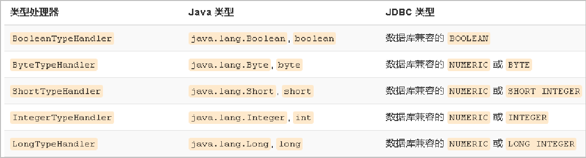

# 35-mybatis框架

# 1. 框架概述

框架（Framework）是整个或部分系统的可重用设计，表现为一组抽象构件及构件实例间交互的方法；另一种定义认为，框架是可被应用开发者定制的应用骨架。前者是从应用方面而后者是从目的方面给出的定义。

简而言之，框架其实就是某种应用的半成品，就是一组组件，供你选用完成你自己的系统。简单说就是使用别人搭好的舞台，你来做表演。而且，框架一般是成熟的，不断升级的软件。

框架的重要性在于它实现了部分功能，并且能够很好的将低层应用平台和高层业务逻辑进行了缓和。为了实现软件工程中的“**高内聚、低耦合**”。把问题划分开来各个解决，易于控制，易于延展，易于分配资源。我们常见的MVC 软件设计思想就是很好的分层思想

**MyBatis 框架概述**

mybatis 是一个优秀的基于 java 的持久层框架，它内部封装了 jdbc，使开发者只需要关注 sql 语句本身，而不需要花费精力去处理加载驱动、创建连接、创建 statement 等繁杂的过程。

mybatis 通过 xml 或注解的方式将要执行的各种 statement 配置起来，并通过 java 对象和 statement 中sql 的动态参数进行映射生成最终执行的 sql 语句，最后由 mybatis 框架执行 sql 并将结果映射为 java 对象并返回。

采用 ORM 思想解决了实体和数据库映射的问题，对 jdbc 进行了封装，屏蔽了 jdbc api 底层访问细节，使我们不用与 jdbc api 打交道，就可以完成对数据库的持久化操作。

# 2. jdbc编程的分析

原始jdbc代码

```java
public static void main(String[] args) {
    Connection connection = null;
    PreparedStatement preparedStatement = null;
    ResultSet resultSet = null;
    try {
        //加载数据库驱动
        Class.forName("com.mysql.jdbc.Driver");
        //通过驱动管理类获取数据库链接
        connection = DriverManager
            .getConnection("jdbc:mysql://localhost:3306/mybatis?characterEncoding=utf-8","root", "root");
        //定义 sql 语句 ?表示占位符
        String sql = "select * from user where username = ?";
        //获取预处理 statement
        preparedStatement = connection.prepareStatement(sql);
        //设置参数，第一个参数为 sql 语句中参数的序号（从 1 开始），第二个参数为设置的
        参数值
        preparedStatement.setString(1, "王五");
        //向数据库发出 sql 执行查询，查询出结果集
        resultSet = preparedStatement.executeQuery();
        //遍历查询结果集
        while(resultSet.next()){
            System.out.println(resultSet.getString("id")+"
                               "+resultSet.getString("username"));
        }
    } catch (Exception e) {
        e.printStackTrace();
    }finally{
        //释放资源
        if(resultSet!=null){
            try {
                resultSet.close();
            } catch (SQLException e) {
                e.printStackTrace();
            }
        }
        if(preparedStatement!=null){
            try {
                preparedStatement.close();
            } catch (SQLException e) {
                e.printStackTrace();
            }
        }
        if(connection!=null){
            try {
                connection.close();
            } catch (SQLException e) {
                // TODO Auto-generated catch block
                e.printStackTrace();
            }
        }
    }
}
```

问题分析：

- 数据库连接创建、释放频繁造成系统资源浪费从而影响系统性能
- sql 语句在代码中硬编码，造成代码不易维护，实际应用 sql 变化的可能较大，sql 变动需要改变java代码。
- 查询操作时，需要手动将结果集中的数据手动封装到实体中。插入操作时，需要手动将实体的数据设置到sql语句的占位符位置

解决方法：

- 使用数据库连接池初始化连接资源
- 将sql语句抽取到xml配置文件中
- 使用反射、内省等底层技术，自动将实体与表进行属性与字段的自动映射

# 3. MyBatis入门

## 3.1 mybatis简介

- mybatis 是一个优秀的**基于java的持久层框架，它内部封装了jdbc**，使开发者只需要关注sql语句本身，而不需要花费精力去处理加载驱动、创建连接、创建statement等繁杂的过程。
- mybatis通过xml或注解的方式将要执行的各种 statement配置起来，并通过java对象和statement中sql的动态参数进行映射生成最终执行的sql语句。
- 最后mybatis框架执行sql并将结果映射为java对象并返回。采用ORM思想解决了实体和数据库映射的问题，对jdbc 进行了封装，屏蔽了jdbc api 底层访问细节，使我们不用与jdbc api 打交道，就可以完成对数据库的持久化操作。

## 3.2 开发步骤

1. 添加MyBatis的坐标

   ```xml
   <dependency>
       <groupId>mysql</groupId>
       <artifactId>mysql-connector-java</artifactId>
       <version>8.0.15</version>
   </dependency>
   <dependency>
       <groupId>org.mybatis</groupId>
       <artifactId>mybatis</artifactId>
       <version>3.4.6</version>
   </dependency>
   <dependency>
       <groupId>junit</groupId>
       <artifactId>junit</artifactId>
       <version>4.12</version>
       <scope>test</scope>
   </dependency>
   ```

2. 创建user数据表

   ```sql
   create table user(id int, username varchar(12),passowrd varchar(12));
   ```

3. 编写User实体类 

   ```java
   public class User {
       private int id;
       private String username;
       private String password;
   
       public void setId(int id) {
           this.id = id;
       }
   
       public int getId() {
           return id;
       }
   
       public void setPassword(String password) {
           this.password = password;
       }
   
       public String getPassword() {
           return password;
       }
   
       public void setUsername(String username) {
           this.username = username;
       }
   
       public String getUsername() {
           return username;
       }
   
       @Override
       public String toString() {
           return "User{" +
                   "username='" + username + '\'' +
                   ", password='" + password + '\'' +
                   '}';
       }
   }
   ```

4. 编写映射文件UserMapper.xml

   ```xml
   <?xml version="1.0" encoding="UTF-8"?>
   <!DOCTYPE mapper
           PUBLIC "-//mybatis.org//DTD Mapper 3.0//EN"
           "http://mybatis.org/dtd/mybatis-3-mapper.dtd">
   
   <mapper namespace="userMapper" >
   <!--    查询操作-->
   	<select id="findAll" resultType="itcast.domain.User">
           select * from user
       </select>
   </mapper>
   ```

5. 编写核心文件SqlMapConfig.xml

   ```xml
   <?xml version="1.0" encoding="UTF-8"?>
   <!DOCTYPE configuration
           PUBLIC "-//mybatis.org//DTD Config 3.0//EN"
           "http://mybatis.org/dtd/mybatis-3-config.dtd">
   
   <!--注意顺序，不然此标签会报错-->
   <configuration>
       
   <!--    数据源环境-->
       <environments default="development">
           <environment id="development">
               <transactionManager type="JDBC"></transactionManager>
               <dataSource type="POOLED">
                   <property name="driver" value="com.mysql.cj.jdbc.Driver"/>
                   <property name="url" value="jdbc:mysql://localhost:3306/sys?useSSL=false&amp;serverTimezone=UTC&amp;allowPublicKeyRetrieval=true"></property>
                   <property name="username" value="root"></property>
                   <property name="password" value="password"></property>
               </dataSource>
           </environment>
       </environments>
   
   <!--    加载映射文件，注：因为在resources资源目录下创建了多个文件夹，所以需要使用如下结构，如果该配置文件位于resources目录的根目录下则直接写文件名即可-->
       <mappers>
           <mapper resource="itcast/mapper/UserMapper.xml"></mapper>
       </mappers>
   
   
   
   
   </configuration>
   ```

6. 编写测试类

   ```java
   public class MyBatisTest {
   
       //    查询操作
       @Test
       public void test1() throws IOException {
   
           // 获得核心配置文件
           InputStream resourceAsStream = Resources.getResourceAsStream("itcast/sqlMapConfig.xml");
           // 获得session工厂对象
           SqlSessionFactory sqlSessionFactory = new SqlSessionFactoryBuilder().build(resourceAsStream);
           // 获得session会话对象
           SqlSession sqlSession = sqlSessionFactory.openSession();
           // 执行操作 参数namespace+id
           List<User> userList = sqlSession.selectList("userMapper.findAll");
           //打印数据
           System.out.println(userList);
           // 释放资源
           sqlSession.close();
       }
   }
   
   ```

## 3.3 MyBatis映射文件概述

```xml
<!--映射文件DTD约束头-->
<?xml version="1.0" encoding="UTF-8"?>
<!DOCTYPE mapper
        PUBLIC "-//mybatis.org//DTD Mapper 3.0//EN"
        "http://mybatis.org/dtd/mybatis-3-mapper.dtd">

<!--根标签，namespace：命名空间，与下面语句的id一起组成查询的标识-->
<mapper namespace="userMapper" >
    
	<!--查询操作，id为语句的id标识，与上面的命名空间一起组成查询的标识-->
    <!--resultType为查询结果对应的实体类型--->
	<select id="findAll" resultType="itcast.domain.User">
        <!--要执行的sql语句-->
        select * from user
    </select>
</mapper>
```

## 3.4 MyBatis的增删改查操作

1. 编写UserMapper映射文件

   ```xml
   <?xml version="1.0" encoding="UTF-8"?>
   <!DOCTYPE mapper
           PUBLIC "-//mybatis.org//DTD Mapper 3.0//EN"
           "http://mybatis.org/dtd/mybatis-3-mapper.dtd">
   
   <mapper namespace="userMapper" >
   <!--    查询操作-->
   <!--    <select id="findAll" resultType="itcast.domain.User">-->
       <select id="findAll" resultType="user">
           select * from user
       </select>
   
   <!--    插入操作-->
       <insert id="save" parameterType="itcast.domain.User">
   --      插入实体属性值，User内部的属性，即setPassword->Password->password 
           insert into user values(#{id},#{username},#{password})
       </insert>
   
   <!--    修改操作-->
       <update id="update" parameterType="itcast.domain.User">
           update user set username=#{username},password=#{password} where id=#{id}
       </update>
   
   <!--    删除操作-->
       <delete id="delete" parameterType="java.lang.Integer">
   --         delete from user where id=#{id}
   
   -- 注：如果是单个参数，则可以使用任意字符串，而如果是个实体类，则必须使用对应的属性值
           delete from user where id=#{asdasd}
       </delete>
   
   
   </mapper>
   ```

2. 编写核心文件

   ```xml
   <?xml version="1.0" encoding="UTF-8"?>
   <!DOCTYPE configuration
           PUBLIC "-//mybatis.org//DTD Config 3.0//EN"
           "http://mybatis.org/dtd/mybatis-3-config.dtd">
   
   <!--注意顺序，不然此标签会报错-->
   <configuration>
       
   <!--    数据源环境-->
       <environments default="development">
           <environment id="development">
               <transactionManager type="JDBC"></transactionManager>
               <dataSource type="POOLED">
                   <property name="driver" value="com.mysql.cj.jdbc.Driver"/>
                   <property name="url" value="jdbc:mysql://localhost:3306/sys?useSSL=false&amp;serverTimezone=UTC&amp;allowPublicKeyRetrieval=true"></property>
                   <property name="username" value="root"></property>
                   <property name="password" value="password"></property>
               </dataSource>
           </environment>
       </environments>
   
   <!--    加载映射文件，注：因为在resources资源目录下创建了多个文件夹，所以需要使用如下结构，如果该配置文件位于resources目录的根目录下则直接写文件名即可-->
       <mappers>
           <mapper resource="itcast/mapper/UserMapper.xml"></mapper>
       </mappers>
   
   
   
   
   </configuration>
   ```

3. 测试类

   ```java
   public class MyBatisTest {
   
       //    查询操作
       @Test
       public void test1() throws IOException {
   
           // 获得核心配置文件
           InputStream resourceAsStream = Resources.getResourceAsStream("itcast/sqlMapConfig.xml");
           // 获得session工厂对象
           SqlSessionFactory sqlSessionFactory = new SqlSessionFactoryBuilder().build(resourceAsStream);
           // 获得session会话对象
           SqlSession sqlSession = sqlSessionFactory.openSession();
           // 执行操作 参数namespace+id
           List<User> userList = sqlSession.selectList("userMapper.findAll");
           //打印数据
           System.out.println(userList);
           // 释放资源
           sqlSession.close();
       }
   
   
       //    插入操作
       @Test
       public void test2() throws IOException {
           // 模拟user对象
           User user = new User();
           user.setUsername("123");
           user.setPassword("123");
   
           // 获得核心配置文件
           InputStream resourceAsStream = Resources.getResourceAsStream("itcast/sqlMapConfig.xml");
           // 获得session工厂对象
           SqlSessionFactory sqlSessionFactory = new SqlSessionFactoryBuilder().build(resourceAsStream);
           // 获得session会话对象
           SqlSession sqlSession = sqlSessionFactory.openSession();
           // 执行操作 参数namespace+id
           int insert = sqlSession.insert("userMapper.save",user);
           // 更新数据，提交事务
           sqlSession.commit();
           //打印数据
           System.out.println(insert);
           // 释放资源
           sqlSession.close();
       }
   
       //     更新操作
       @Test
       public void test3() throws IOException {
           // 模拟user对象
           User user = new User();
           user.setId(3);
           user.setUsername("1234");
           user.setPassword("1234");
   
           // 获得核心配置文件
           InputStream resourceAsStream = Resources.getResourceAsStream("itcast/sqlMapConfig.xml");
           // 获得session工厂对象
           SqlSessionFactory sqlSessionFactory = new SqlSessionFactoryBuilder().build(resourceAsStream);
           // 获得session会话对象
           SqlSession sqlSession = sqlSessionFactory.openSession();
           // 执行操作 参数namespace+id
           int update = sqlSession.update("userMapper.update",user);
           // 更新数据，提交事务
           sqlSession.commit();
           //打印数据
           System.out.println(update);
           // 释放资源
           sqlSession.close();
       }
   
       //  删除操作
       @Test
       public void test4() throws IOException {
           // 获得核心配置文件
           InputStream resourceAsStream = Resources.getResourceAsStream("itcast/sqlMapConfig.xml");
           // 获得session工厂对象
           SqlSessionFactory sqlSessionFactory = new SqlSessionFactoryBuilder().build(resourceAsStream);
           // 获得session会话对象
           SqlSession sqlSession = sqlSessionFactory.openSession();
           // 执行操作 参数namespace+id
           int delete = sqlSession.delete("userMapper.delete",3);
           // 更新数据，提交事务
           sqlSession.commit();
           //打印数据
           System.out.println(delete);
           // 释放资源
           sqlSession.close();
       }
   }
   
   ```

注意事项

- 插入操作的注意事项
  -  插入语句使用insert标签
  - 在映射文件中使用`parameter Type`属性指定要插入的数据类型
  - Sql语句中使用`#{实体属性名}`方式引用实体中的属性值
  - 插入操作使用的API是`sqlSession.insert(“命名空间.id”,实体对象);`
  - 插入操作涉及数据库数据变化，所以要使用sqlSession对象显示的提交事务，即`sqlSession.commit() `
- 修改操作的注意事项
  - 修改语句使用update标签
  - 修改操作使用的API是``sqlSession.update(“命名空间.id”,实体对象);`
- 修改操作的注意事项
  - 删除语句使用delete标签
  - Sql语句中使用#{任意字符串}方式引用传递的单个参数
  - 删除操作使用的API是`sqlSession.delete(“命名空间.id”,Object);`
- 删除操作的注意事项
  - 删除语句使用delete标签
  - Sql语句中使用#{任意字符串}方式引用传递的单个参数
  - 删除操作使用的API是`sqlSession.delete(“命名空间.id”,Object);`

## 3.5 MyBatis核心配置文件层级关系

- configuration配置
  - properties属性
  - setting设置
  - typeAliases 类型别名
  - typeHandlers 类型处理器
  - objectFactory 对象工厂
  - plugins 插件
  - environments 环境
    - environment 环境变量
      - transactionManager 事务管理器
      - dataSource 数据源
  - databaseIdProvider 数据库厂商标识
  - mappers 映射器

## 3.6 MyBatis常用配置解析

1. environments标签

   ```xml
   <!--default：指定默认的环境名称-->
   <environments default="development">
       <!--id：指定当前环境的名称-->
       <environment id="development">
           <!--type：指定事务管理类型是JDBC-->
           <transactionManager type="JDBC"></transactionManager>
           <!--type：指定当前数据源类型是连接池-->
           <dataSource type="POOLED">
               <!--数据源配置的基本参数-->
               <property name="driver" value="com.mysql.cj.jdbc.Driver"/>
               <property name="url" value="jdbc:mysql://localhost:3306/sys?useSSL=false&amp;serverTimezone=UTC&amp;allowPublicKeyRetrieval=true"></property>
               <property name="username" value="root"></property>
               <property name="password" value="password"></property>
           </dataSource>
       </environment>
   </environments>
   ```

   其中，事务管理器（transactionManager）类型有两种：

   - JDBC：这个配置就是直接使用了JDBC 的提交和回滚设置，它依赖于从数据源得到的连接来管理事务作用域。
   - MANAGED：这个配置几乎没做什么。它从来不提交或回滚一个连接，而是让容器来管理事务的整个生命周期（比如 JEE 应用服务器的上下文）。 默认情况下它会关闭连接，然而一些容器并不希望这样，因此需要将 closeConnection 属性设置为 false 来阻止它默认的关闭行为。

   其中，数据源（dataSource）类型有三种：

   - UNPOOLED：这个数据源的实现只是每次被请求时打开和关闭连接。
   - POOLED：这种数据源的实现利用“池”的概念将 JDBC 连接对象组织起来。
   - JNDI：这个数据源的实现是为了能在如 EJB 或应用服务器这类容器中使用，容器可以集中或在外部配置数据源，然后放置一个 JNDI 上下文的引用。

2. mapper标签

   该标签的作用是加载映射的，加载方式有如下几种：

   - 使用相对于类路径的资源引用，例如：

     ```xml
     <mapper resource="org/mybatis/builder/AuthorMapper.xml"/>
     ```

   - 使用完全限定资源定位符（URL），例如：

     ```xml
     <mapper url="file:///var/mappers/AuthorMapper.xml"/>
     ```

   - 使用映射器接口实现类的完全限定类名，例如：

     ```xml
     <mapper class="org.mybatis.builder.AuthorMapper"/>
     ```

   - 将包内的映射器接口实现全部注册为映射器，例如：

     ```xml
     <package name="org.mybatis.builder"/>
     ```

3. Properties标签

   实际开发中，习惯将数据源的配置信息单独抽取成一个properties文件，该标签可以加载额外配置的properties文件

   示例：

   ```properties
   jdbc.driver=com.mysql.cj.jdbc.Driver
   jdbc.url=jdbc:mysql://localhost:3306/sys?useSSL=false&serverTimezone=UTC&allowPublicKeyRetrieval=true
   jdbc.username=root
   jdbc.password=password
   ```

   ```xml
   <!--    使用jdbc.properties-->
   <!--    注：资源文件地址如果在resources根目录下则直接写文件名即可，如果不是则需要加路径-->
   <properties resource="jdbc.properties"></properties>
   <environments default="development">
       <environment id="development">
           <transactionManager type="JDBC"></transactionManager>
           <dataSource type="POOLED">
               <property name="driver" value="${jdbc.driver}"/>
               <property name="url" value="${jdbc.url}"></property>
               <property name="username" value="${jdbc.username}"></property>
               <property name="password" value="${jdbc.password}"></property>
           </dataSource>
       </environment>
   </environments>
   ```

4. typeAliases标签

   类型别名是为Java 类型设置一个短的名字。原来的类型名称配置如下

   ```xml
   <insert id="save" parameterType="itcast.domain.User">
       insert into user values(#{id},#{username},#{password})
   </insert>
   ```

   配置typeAliases标签

   ```xml
   <!--    自定义别名 -->
   <typeAliases>
       <typeAlias type="itcast.domain.User" alias="user"></typeAlias>
   </typeAliases>
   ```

   现在的映射文件内就可以直接使用user了，例如

   ```xml
   <insert id="save" parameterType="User">
       insert into user values(#{id},#{username},#{password})
   </insert>
   ```

   上面我们是自定义的别名，mybatis框架已经为我们设置好的一些常用的类型的别名

   | **别名** | **数据类型** |
   | -------- | ------------ |
   | string   | String       |
   | long     | Long         |
   | int      | Integer      |
   | double   | Double       |
   | boolean  | Boolean      |
   | … …      | … …          |

## 3.7 MyBatis相应API

1. SqlSession工厂构建器SqlSessionFactoryBuilder

   常用API：`SqlSessionFactory build(InputStream inputStream)`

   作用：通过加载mybatis的核心文件的输入流的形式构建一个SqlSessionFactory对象

   ```java
   // 获得核心配置文件
   InputStream resourceAsStream = Resources.getResourceAsStream("itcast/sqlMapConfig.xml");
   // 获得session工厂对象
   SqlSessionFactory sqlSessionFactory = new SqlSessionFactoryBuilder().build(resourceAsStream);
   ```

   其中， Resources 工具类，这个类在 org.apache.ibatis.io 包中。Resources 类帮助你从类路径下、文件系统或一个 web URL 中加载资源文件。

2. SqlSessionFactory 有多个个方法创建 SqlSession 实例。常用的有如下两个：

   | **方法**                        | **解释**                                                     |
   | ------------------------------- | ------------------------------------------------------------ |
   | openSession()                   | 会默认开启一个事务，但事务不会自动提交，也就意味着需要手动提交该事务，更新操作数据才会持久化到数据库中 |
   | openSession(boolean autoCommit) | 参数为是否自动提交，如果设置为true，那么不需要手动提交事务   |

3. SqlSession 实例在 MyBatis 中是非常强大的一个类。在这里你会看到所有执行语句、提交或回滚事务和获取映射器实例的方法。

   执行语句的方法主要有：

   ```java
   <T> T selectOne(String statement, Object parameter) 
   <E> List<E> selectList(String statement, Object parameter) 
   int insert(String statement, Object parameter) 
   int update(String statement, Object parameter) 
   int delete(String statement, Object parameter)
   ```

   操作事务的方法主要有： 

   ```java
   void commit()  
   void rollback() 
   ```

## 3.8 小结

核心配置文件常用配置：

1. properties标签：该标签可以加载外部的properties文件

   ```xml
   <properties resource="jdbc.properties"></properties>
   ```

2. typeAliases标签：设置类型别名

   ```xml
   <typeAliases>
       <typeAlias type="itcast.domain.User" alias="user"></typeAlias>
   </typeAliases>
   ```

3. environments标签：数据源环境配置标签

   ```xml
   <environments default="development">
       <environment id="development">
           <transactionManager type="JDBC"></transactionManager>
           <dataSource type="POOLED">
               <property name="driver" value="${jdbc.driver}"/>
               <property name="url" value="${jdbc.url}"></property>
               <property name="username" value="${jdbc.username}"></property>
               <property name="password" value="${jdbc.password}"></property>
           </dataSource>
       </environment>
   </environments>
   
   ```

4. mappers标签：加载映射配置

   ```xml
   <mappers>
       <mapper resource="itcast/mapper/UserMapper.xml"></mapper>
   </mappers>
   ```

注意：以上配置标签需要注意顺序

```
plugins在配置文件中的位置必须符合要求，否则会报错，顺序如下:
properties?, settings?,
typeAliases?, typeHandlers?,
objectFactory?,objectWrapperFactory?,
plugins?,
environments?, databaseIdProvider?, mappers?
```

# 4. MyBatis的Dao层实现方式

## 4.1 传统开发方式

1. 创建dao层接口

   ```java
   public interface userMapper {
       List<User> findAll() throws IOException;
   }
   ```

2. 实现dao接口

   ```java
   public class userMapperImpl implements userMapper {
       @Override
       public List<User> findAll() throws IOException {
           InputStream resourceAsStream = Resources.getResourceAsStream("itcast/sqlMapConfig.xml");
           SqlSessionFactory build = new SqlSessionFactoryBuilder().build(resourceAsStream);
           SqlSession sqlSession = build.openSession();
   
           List<User> userList = sqlSession.selectList("userMapper.findAll");
           return userList;
       }
   }
   ```

3. 创建user实体类

   ```java
   public class User {
       private int id;
       private String username;
       private String password;
       private Date birthday;
   
      // 省略getter，setter和toString方法
   }
   ```

4. 创建映射文件

   ```xml
   <?xml version="1.0" encoding="UTF-8"?>
   <!DOCTYPE mapper
           PUBLIC "-//mybatis.org//DTD Mapper 3.0//EN"
           "http://mybatis.org/dtd/mybatis-3-mapper.dtd">
   
   <mapper namespace="userMapper">
   <!--    查询操作-->
       <select id="findAll" resultType="user">
           select * from user
       </select>
   </mapper>
   ```

5. 创建配置文件

   ```xml
   <?xml version="1.0" encoding="UTF-8"?>
   <!DOCTYPE configuration
           PUBLIC "-//mybatis.org//DTD Config 3.0//EN"
           "http://mybatis.org/dtd/mybatis-3-config.dtd">
   
   <!--注意顺序，不然此标签会报错-->
   <configuration>
   
   
   <!--    使用jdbc.properties-->
   <!--    注：资源文件地址如果在resources根目录下则直接写文件名即可，如果不是则需要加文件夹名-->
       <properties resource="jdbc.properties"></properties>
   
       <!--    自定义别名 -->
       <typeAliases>
           <typeAlias type="itcast.domain.User" alias="user"></typeAlias>
       </typeAliases>
   
       <!--    数据源环境-->
       <environments default="development">
           <environment id="development">
               <transactionManager type="JDBC"></transactionManager>
               <dataSource type="POOLED">
                   <property name="driver" value="${jdbc.driver}"/>
                   <property name="url" value="${jdbc.url}"></property>
                   <property name="username" value="${jdbc.username}"></property>
                   <property name="password" value="${jdbc.password}"></property>
               </dataSource>
           </environment>
       </environments>
   
   
   <!--    加载映射文件-->
       <mappers>
           <mapper resource="itcast/mapper/UserMapper.xml"></mapper>
       </mappers>
   
   </configuration>
   ```

6. 创建jdbc配置文件

   ```properties
   jdbc.driver=com.mysql.cj.jdbc.Driver
   jdbc.url=jdbc:mysql://localhost:3306/sys?useSSL=false&serverTimezone=UTC&allowPublicKeyRetrieval=true
   jdbc.username=root
   jdbc.password=password
   ```

7. 测试

   ```java
   @Test
   public void test1(){
       userMapper userMapper = new userMapperImpl();
       List<User> userList = userMapper.findAll();
   
       System.out.println(userList);
   }
   ```

## 4.2 代理开发模式

采用 Mybatis 的代理开发方式实现 DAO 层的开发，这种方式是我们后面进入企业的主流。

Mapper 接口开发方法**只需要程序员编写Mapper 接口（相当于Dao 接口）**，由Mybatis 框架根据接口定义创建接口的动态代理对象，代理对象的方法体同上边Dao接口实现类方法。

**Mapper 接口开发需要遵循以下规范：**

1.  Mapper.xml文件中的namespace与mapper接口的**全限定名相同**
2. Mapper接口方法名和Mapper.xml中定义的每个statement的**id相同**
3. Mapper接口方法的输入参数类型和mapper.xml中定义的每个sql的**parameterType的类型相同**
4. Mapper接口方法的输出参数类型和mapper.xml中定义的每个sql的**resultType的类型相同**

代码实现

1. 创建dao接口

   ```java
   public interface userMapper {
      List<User> findByUserContent(User user);
   }
   ```

2. 创建mapper映射文件

   ```xml
   <?xml version="1.0" encoding="UTF-8"?>
   <!DOCTYPE mapper
           PUBLIC "-//mybatis.org//DTD Mapper 3.0//EN"
           "http://mybatis.org/dtd/mybatis-3-mapper.dtd">
   
   <!--  注意：namespace为接口的全限定类名-->
   <mapper namespace="itcast.dao.userMapper" >
   <!--id值和方法名相同，parameterType为方法参数类型，resultType为返回结果集类型，和方法保持一致-->
       <select id="findByUserContent" parameterType="user" resultType="user">
           select * from user where username = #{username} and password = #{password}
       </select>
   </mapper>
   ```

3. 创建配置文件

   ```xml
   <?xml version="1.0" encoding="UTF-8"?>
   <!DOCTYPE configuration
           PUBLIC "-//mybatis.org//DTD Config 3.0//EN"
           "http://mybatis.org/dtd/mybatis-3-config.dtd">
   
   <!--注意顺序，不然此标签会报错-->
   <configuration>
   
   
   <!--    使用jdbc.properties-->
   <!--    注：资源文件地址如果在resources根目录下则直接写文件名即可，如果不是则需要加文件夹名-->
       <properties resource="jdbc.properties"></properties>
   
       <!--    自定义别名 -->
       <typeAliases>
           <typeAlias type="itcast.domain.User" alias="user"></typeAlias>
       </typeAliases>
   
       <!--    数据源环境-->
       <environments default="development">
           <environment id="development">
               <transactionManager type="JDBC"></transactionManager>
               <dataSource type="POOLED">
                   <property name="driver" value="${jdbc.driver}"/>
                   <property name="url" value="${jdbc.url}"></property>
                   <property name="username" value="${jdbc.username}"></property>
                   <property name="password" value="${jdbc.password}"></property>
               </dataSource>
           </environment>
       </environments>
   
   
   <!--    加载映射文件-->
       <mappers>
           <mapper resource="itcast/mapper/UserMapper.xml"></mapper>
       </mappers>
   
   </configuration>
   ```

4. 测试方法

   ```java
   @Test
   public void test3() throws IOException {
   	// 模拟数据
       User user = new User();
   	user.setUsername("admin");
   	user.setPassword("admin");
   
       InputStream resourceAsStream = Resources.getResourceAsStream("itcast/sqlMapConfig.xml");
       SqlSessionFactory build = new SqlSessionFactoryBuilder().build(resourceAsStream);
       SqlSession sqlSession = build.openSession();
       //获得MyBatis框架生成的UserMapper接口的实现类
       userMapper mapper = sqlSession.getMapper(userMapper.class);
       List<User> byUserContent = mapper.findByUserContent(user);
   
       System.out.println(byUserContent);
       sqlSession.close();
   }
   ```


# 5. MyBatis映射文件深入

## 5.1 动态SQL语句`<if>`

Mybatis 的映射文件中，前面我们的 SQL 都是比较简单的，有些时候业务逻辑复杂时，我们的 SQL是动态变化的，此时在前面的学习中我们的 SQL 就不能满足要求了。

我们根据实体类的不同取值，使用不同的 SQL语句来进行查询。比如在 id如果不为空时可以根据id查询，如果username 不为空时还要加入用户名作为条件。这种情况在我们的多条件组合查询中经常会碰到。

测试：

1. 接口

   ```java
   List<User> findByUserContent(User user);
   ```

2. 映射配置

   ```xml
   <mapper namespace="itcast.dao.userMapper" >
       <select id="findByUserContent" parameterType="user" resultType="user">
           select * from user
           <where>
               <if test="id!=0">
                   and id=#{id}
               </if>
   
               <if test="username!=null">
                   and username = #{username}
               </if>
   
               <if test="password!=null">
                   and password = #{password}
               </if>
           </where>
       </select>
   </mapper>
   ```

3. 测试

   ```java
   @Test
   public void test3() throws IOException {
   
       User user = new User();
       user.setUsername("admin");
       user.setPassword("admin");
   
       InputStream resourceAsStream = Resources.getResourceAsStream("itcast/sqlMapConfig.xml");
       SqlSessionFactory build = new SqlSessionFactoryBuilder().build(resourceAsStream);
       SqlSession sqlSession = build.openSession();
       userMapper mapper = sqlSession.getMapper(userMapper.class);
   
       List<User> byUserContent = mapper.findByUserContent(user);
   
       System.out.println(byUserContent);
       sqlSession.close();
   }
   ```

4. 说明：

   user实体属性不同时，sql语句也会随之产生变化，如：

   - user属性为空时，此时sql

     ```sql
     select * from user 
     ```

   - 设置了一个成员变量时，此时sql

     ```sql
     select * from user WHERE username = ? 
     ```

   - 设置了两个成员变量时，此时sql

     ```sql
     select * from user WHERE username = ? and password = ? 
     ```

## 5.2 动态SQL之`<foreach>`

说明：循环执行sql的拼接操作，例如：`select * from user WHERE id in(1,2,3,4)`

示例：

1. 接口

   ```java
   List<User> findByIds(List<Integer> ids);
   ```

2. mapper映射文件

   foreach标签的属性含义如下：

   - foreach：标签用于遍历集合
- collection传入的参数是你需要遍历的参数类型，如果是list集合类型就写list，如果是array数组类型就写array，注意编写时不要写`#{}`
   - open：代表语句的开始部分
   - close：代表结束部分
   - item：项，代表遍历集合的每个元素，生成的变量名，注意：对应数据库的id字段名
   - separator：代表分隔符
   
```xml
   <mapper namespace="itcast.dao.userMapper" >
       <select id="findByIds" parameterType="list" resultType="user">
           select * from user
           <where>
               <foreach collection="list" open="id in(" close=")" item="id" separator=",">
                   #{id}
               </foreach>
           </where>
       </select>
   </mapper>
```

执行测试，最终生成的未赋值的sql

```sql
   select * from user WHERE id in( ? , ? , ? ) 
```

3. 测试

   ```java
   @Test
   public void test4() throws IOException {
       InputStream resourceAsStream = Resources.getResourceAsStream("itcast/sqlMapConfig.xml");
       SqlSessionFactory build = new SqlSessionFactoryBuilder().build(resourceAsStream);
       SqlSession sqlSession = build.openSession();
       userMapper mapper = sqlSession.getMapper(userMapper.class);
   
       // 模拟数据
       List<Integer> ids = new ArrayList<>();
       ids.add(1);
       ids.add(4);
       ids.add(5);
       List<User> userList = mapper.findByIds(ids);
   
       System.out.println(userList.toString());
   
       sqlSession.close();
   
   }
   ```

## 5.3 SQL片段抽取

Sql 中可将重复的 sql 提取出来，使用时用 include 引用即可，最终达到 sql 重用的目的

示例：

1. 配置mapper映射文件

   ```xml
   <!--    sql语句抽取-->
   <sql id="selectUser"> select * from user</sql>
   
   <select id="findByIds" parameterType="list" resultType="user">
       
       <include refid="selectUser"></include>
       
       <where>
           <foreach collection="list" open="id in(" close=")" item="id" separator=",">
               #{id}
           </foreach>
       </where>
   </select>
   
   ```

## 5.4 小结

- `<select>` ：查询
- `<insert>`：插入
- `<update>`：修改
- `<delete>`：删除
- `<where>`：where条件
- `<if>`：判断
- `<foreach>`：循环
- `<sql>`：sql片段抽取

# 6. MyBatis核心配置文件深入

## 6.1 typeHandlers标签

无论是 MyBatis 在预处理语句（PreparedStatement）中设置一个参数时，还是从结果集中取出一个值时， 都会用类型处理器将获取的值以合适的方式转换成 Java 类型。下表描述了一些默认的类型处理器（截取部分）。



你可以重写类型处理器或创建你自己的类型处理器来处理不支持的或非标准的类型。具体做法为：实现 `org.apache.ibatis.type.TypeHandler` 接口， 或继承一个很便利的类 `org.apache.ibatis.type.BaseTypeHandler`， 然后可以选择性地将它映射到一个JDBC类型。

例如需求：一个Java中的Date数据类型，我想将之存到数据库的时候存成一个1970年至今的毫秒数，取出来时转换成java的Date，即java的Date与数据库的varchar毫秒值之间转换。

开发步骤：

1. 创建接口

   ```java
   void insertBirthday(User user);
   ```

2. 数据表user添加字段birthday，并设置字段类型为bigint

3. 定义转换类继承类`BaseTypeHandler<T>`，并实现四个接口

   ```java
   public class MyDateTypeHandle extends BaseTypeHandler<Date> {
       // 将java类型转换成数据库需要的类型
       @Override
       public void setNonNullParameter(PreparedStatement preparedStatement, int i, Date date, JdbcType jdbcType) throws SQLException {
           /**
            * 参数i：当前参数位置
            */
   
           long time = date.getTime();
           preparedStatement.setLong(i,time);
   
       }
   
       // 将数据库的类型转换为java类型
       @Override
       public Date getNullableResult(ResultSet resultSet, String s) throws SQLException {
           // string s 是数据库要转换的字段名称
           // ResultSet resultSet 查询出的结果集
   
           // 获取结果集中需要的数据 并转换，long->date
           long aLong = resultSet.getLong(s);
           Date date = new Date(aLong);
   
           return date;
       }
   
       // 将数据库的类型转换为java类型
       @Override
       public Date getNullableResult(ResultSet resultSet, int i) throws SQLException {
           // 获取结果集中需要的数据 并转换，long->date
           long aLong = resultSet.getLong(i);
           Date date = new Date(aLong);
   
           return date;
       }
   
       // 将数据库的类型转换为java类型
       @Override
       public Date getNullableResult(CallableStatement callableStatement, int i) throws SQLException {
           long aLong = callableStatement.getLong(i);
           Date date = new Date(aLong);
   
           return date;
       }
   }
   
   ```

4. 配置映射文件

   ```xml
   <!--    测试插入Data数据，转换-->
   <insert id="insertBirthday" parameterType="user">
       insert into user values(null,#{username},#{password},#{birthday})
   </insert>
   ```

5. 配置核心文件

   ```xml
   <!--    自定义类型处理器-->
   <typeHandlers>
       <typeHandler handler="itcast.hadler.MyDateTypeHandle"></typeHandler>
   </typeHandlers>
   ```

6. 测试转换是否正确

   ```java
   // java对象转数据库类型测试
   @Test
   public void test5() throws IOException {
       InputStream resourceAsStream = Resources.getResourceAsStream("itcast/sqlMapConfig.xml");
       SqlSessionFactory build = new SqlSessionFactoryBuilder().build(resourceAsStream);
       SqlSession sqlSession = build.openSession(true);
       userMapper mapper = sqlSession.getMapper(userMapper.class);
       //模拟数据
       User user = new User();
       user.setUsername("zhangsan1");
       user.setPassword("1234");
   	 user.setBirthday(new Date());
   
       mapper.insertBirthday(user);
   
       sqlSession.close();
   }
   ```

7. 如果代码执行无误，则可以查看数据库中birthday对应的字段已经存储了毫秒值

**数据库类型转java类型测试：**

1. 创建接口

   ```java
   List<User> findById(int i);
   ```

2. 配置映射文件

   ```xml
   <!--    根据id查询数据-->
   <select id="findById" parameterType="int" resultType="user">
       select * from user where id = #{id}
   </select>
   ```

3. 测试代码

   ```java
   // 数据库类型转java类型测试
   @Test
   public void test6() throws IOException {
       InputStream resourceAsStream = Resources.getResourceAsStream("itcast/sqlMapConfig.xml");
       SqlSessionFactory build = new SqlSessionFactoryBuilder().build(resourceAsStream);
       SqlSession sqlSession = build.openSession(true);
       userMapper mapper = sqlSession.getMapper(userMapper.class);
   
       List<User> byId = mapper.findById(7);
       System.out.println(byId);
   
       sqlSession.close();
   }
   ```

4. 输出内容为：

   ```
   [User{id=7, username='zhangsan', password='123', birthday=Sat Jul 11 16:17:32 CST 2020}]
   ```

## 6.2 plugins标签

MyBatis可以使用第三方的插件来对功能进行扩展，分页助手PageHelper是将分页的复杂操作进行封装，使用简单的方式即可获得分页的相关数据

开发步骤：

1. 导入通用PageHelper的坐标

   ```xml
   <!-- 分页助手 -->
   <dependency>
       <groupId>com.github.pagehelper</groupId>
       <artifactId>pagehelper</artifactId>
       <version>3.7.5</version>
   </dependency>
   <dependency>
       <groupId>com.github.jsqlparser</groupId>
       <artifactId>jsqlparser</artifactId>
       <version>0.9.1</version>
   </dependency>
   ```

2. 在mybatis核心配置文件中配置PageHelper插件

   ```xml
   <!-- 配置分页助手的插件 -->
   <plugins>
       <plugin interceptor="com.github.pagehelper.PageHelper">
           <!-- 指定方言 -->
           <property name="dialect" value="mysql"/>
       </plugin>
   </plugins>
   ```

3. 测试分页数据获取

   ```java
   // 分页插件测试
   @Test
   public void test7() throws IOException {
       InputStream resourceAsStream = Resources.getResourceAsStream("itcast/sqlMapConfig.xml");
       SqlSessionFactory build = new SqlSessionFactoryBuilder().build(resourceAsStream);
       SqlSession sqlSession = build.openSession();
       userMapper mapper = sqlSession.getMapper(userMapper.class);
       // 设置分页相关参数：当前页，每页显示条数
       PageHelper.startPage(1,3);
   
       List<User> users = mapper.findAll();
   
       for (User user : users) {
           System.out.println(user);
       }
       System.out.println(users);
       sqlSession.close();
       
       /**
        * User{id=1, username='admin', password='admin', birthday=null}
        * User{id=4, username='123', password='123', birthday=null}
        * User{id=5, username='456', password='456', birthday=null}
        * Page{pageNum=1, pageSize=3, startRow=0, endRow=3, total=6, pages=2, reasonable=false, pageSizeZero=false}
        * 
        */
   }
   
   //分页插件其他参数测试
   @Test
   public void test8() throws IOException {
       InputStream resourceAsStream = Resources.getResourceAsStream("itcast/sqlMapConfig.xml");
       SqlSessionFactory build = new SqlSessionFactoryBuilder().build(resourceAsStream);
       SqlSession sqlSession = build.openSession();
       userMapper mapper = sqlSession.getMapper(userMapper.class);
       // 设置分页相关参数：当前页，每页显示条数
       PageHelper.startPage(1,3);
       List<User> users = mapper.findAll();
       // 其他分页的数据
       PageInfo<User> pageInfo = new PageInfo<User>(users);
       System.out.println("总条数："+pageInfo.getTotal());
       System.out.println("总页数："+pageInfo.getPages());
       System.out.println("当前页："+pageInfo.getPageNum());
       System.out.println("每页显示长度："+pageInfo.getPageSize());
       System.out.println("是否第一页："+pageInfo.isIsFirstPage());
       System.out.println("是否最后一页："+pageInfo.isIsLastPage());
       sqlSession.close();
   
       	/**
            *
            *     plugins在配置文件中的位置必须符合要求，否则会报错，顺序如下:
            *     properties?, settings?,
            *     typeAliases?, typeHandlers?,
            *     objectFactory?,objectWrapperFactory?,
            *     plugins?,
            *     environments?, databaseIdProvider?, mappers?
            *
            */
   }
   ```

## 6.3 小结

常用标签：

1. properties标签：该标签可以加载外部的properties文件
2. typeAliases标签：设置类型别名
3. environments标签：数据源环境配置标签
4. typeHandlers标签：配置自定义类型处理器
5. plugins标签：配置MyBatis的插件


# 7. MyBatis多表操作

## 7.1 一对一查询

用户表和订单表的关系为，一个用户有多个订单，一个订单只从属于一个用户

一对一查询的需求：查询一个订单，与此同时查询出该订单所属的用户

实现步骤：

1. 创建orders表和user表

   ```sql
   create table user2 (id int primary key auto_increment,username varchar(255),password varchar(255),birthday date)
   
   create table orders2 (id int primary key auto_increment,orderTime date , total double, uid int)
   ```

2. 创建实体类

   ```java
   public class Order {
       private int id;
       private Date orderTime;
       private double total;
   
       //代表当前订单从属于哪一个客户
       private User user;
   
       // 省略getter和setter方法
       // 省略toString方法
   }
   ```

   ```java
   public class User {
       private int id;
       private String username;
       private String password;
       private Date birthday;
       
       // 省略getter和setter方法
       // 省略toString方法
   }
   ```

3. 创建接口类

   ```java
   public interface orderMapper {
       List<Order> findAll();
   }
   ```

4. 创建jdbc.properties配置文件

   ```properties
   jdbc.driver=com.mysql.cj.jdbc.Driver
   jdbc.url=jdbc:mysql://localhost:3306/sys?useSSL=false&serverTimezone=UTC&allowPublicKeyRetrieval=true
   jdbc.username=root
   jdbc.password=password
   ```

5. 创建MyBatis映射文件

   - 方式1：

     ```xml
     <?xml version="1.0" encoding="UTF-8"?>
     <!DOCTYPE mapper
             PUBLIC "-//mybatis.org//DTD Mapper 3.0//EN"
             "http://mybatis.org/dtd/mybatis-3-mapper.dtd">
     
      <!-- 指定接口全限定类名 -->
     <mapper namespace="itcast.dao.orderMapper" >
     
         <resultMap id="OrderMap" type="order">
             <!-- 手动指定字段与实体属性的映射关系
                 column：数据表的字段名称
                 property：实体的属性名称
              -->
             <id column="oid" property="id"></id>
             <result column="orderTime" property="orderTime"></result>
             <result column="total" property="total"></result>
             <result column="uid" property="user.id"></result>
             <result column="username" property="user.username"></result>
             <result column="password" property="user.password"></result>
             <result column="birthday" property="user.birthday"></result>
     
         </resultMap>
     
      	<!-- 指定resultMap（映射）而不是resultType（结果集类型），id值保持和方法名一致 -->
         <select id="findAll" resultMap="OrderMap">
             select *,o.id oid from orders o,user u where o.uid= u.id
         </select>
     </mapper>
     ```

   - 方式2：

     ```xml
     <?xml version="1.0" encoding="UTF-8"?>
     <!DOCTYPE mapper
             PUBLIC "-//mybatis.org//DTD Mapper 3.0//EN"
             "http://mybatis.org/dtd/mybatis-3-mapper.dtd">
     
     <mapper namespace="itcast.dao.orderMapper" >
     
         <resultMap id="OrderMap" type="order">
             <!-- 手动指定字段与实体属性的映射关系
                 column：数据表的字段名称
                 property：实体的属性名称
              -->
             <id column="oid" property="id"></id>
             <result column="orderTime" property="orderTime"></result>
             <result column="total" property="total"></result>
             
             <!--
               javaType： 当前实体（order）中的属性类型
               property：当前实体（order）中属性名称（private User SetUser-》user）
            -->
             <association property="user" javaType="user">
                 <id column="uid" property="id"></id>
                 <id column="username" property="username"></id>
                 <id column="password" property="password"></id>
                 <id column="birthday" property="birthday"></id>
             </association>
     
         </resultMap>
     
         <select id="findAll" resultMap="OrderMap">
             select *,o.id oid from orders o,user u where o.uid= u.id
         </select>
     </mapper>
     ```

     

6. 创建MyBatis核心配置文件

   ```xml
   <?xml version="1.0" encoding="UTF-8"?>
   <!DOCTYPE configuration
           PUBLIC "-//mybatis.org//DTD Config 3.0//EN"
           "http://mybatis.org/dtd/mybatis-3-config.dtd">
   
   <!--注意顺序，不然此标签会报错-->
   <configuration>
   
   
       <!--    使用jdbc.properties-->
   <!--    注：资源文件地址如果在resources根目录下则直接写文件名即可，如果不是则需要加文件夹名-->
       <properties resource="jdbc.properties"></properties>
   
       <!--    自定义别名 -->
       <typeAliases>
           <typeAlias type="itcast.domain.User" alias="user"></typeAlias>
           <typeAlias type="itcast.domain.Order" alias="order"></typeAlias>
       </typeAliases>
   
       <!--    数据源环境-->
       <environments default="development">
           <environment id="development">
               <transactionManager type="JDBC"></transactionManager>
               <dataSource type="POOLED">
                   <property name="driver" value="${jdbc.driver}"/>
                   <property name="url" value="${jdbc.url}"></property>
                   <property name="username" value="${jdbc.username}"></property>
                   <property name="password" value="${jdbc.password}"></property>
               </dataSource>
           </environment>
       </environments>
   
   
   <!--    加载映射文件-->
       <mappers>
           <mapper resource="itcast/mapper/OrderMapper.xml"></mapper>
       </mappers>
   
   </configuration>
   ```

7. 测试

   ```java
   @Test
   public void findAll() throws IOException {
       InputStream resourceAsStream = Resources.getResourceAsStream("itcast/sqlMapConfig.xml");
       SqlSessionFactory build = new SqlSessionFactoryBuilder().build(resourceAsStream);
       SqlSession sqlSession = build.openSession();
       orderMapper mapper = sqlSession.getMapper(orderMapper.class);
       List<Order> orderList = mapper.findAll();
   
       for (Order order : orderList) {
           System.out.println(order);
       }
   
       sqlSession.close();
   
   }
   ```

   结果

   ```
   Order{id=1, orderTime=Sun Jul 12 08:00:00 CST 2020, total=2000.0, user=User{id=1, username='admin', password='admin', birthday=Wed Aug 08 08:00:00 CST 2018}}
   
   Order{id=2, orderTime=Wed Jul 01 08:00:00 CST 2020, total=3000.0, user=User{id=4, username='wangwu', password='123', birthday=Mon Jul 13 08:00:00 CST 2020,}}
   
   Order{id=3, orderTime=Sun Jul 05 08:00:00 CST 2020, total=100.0, user=User{id=1, username='admin', password='admin', birthday=Wed Aug 08 08:00:00 CST 2018}}
   ```


## 7.2 一对多查询

用户表和订单表的关系为，一个用户有多个订单，一个订单只从属于一个用户

一对多查询的需求：查询一个用户，与此同时查询出该用户具有的订单

1. 创建接口

   ```java
   public interface userMapper2 {
       List<User> orderList();
   }
   ```
   
   
   
2. 实体类

   ```java
   public class User {
       private int id;
       private String username;
       private String password;
       private Date birthday;
   
       //代表当前用户具备哪些订单
       private List<Order> orderList;
   
       // 省略getter和setter方法
       // 省略toString方法
   }
   ```

   ```java
   public class Order {
       private int id;
       private Date orderTime;
       private double total;
       
       // 省略getter和setter方法
       // 省略toString方法
   
   }
   
   ```

3. 创建MyBatis核心映射文件

   ```xml
   <?xml version="1.0" encoding="UTF-8"?>
   <!DOCTYPE mapper
           PUBLIC "-//mybatis.org//DTD Mapper 3.0//EN"
           "http://mybatis.org/dtd/mybatis-3-mapper.dtd">
   
   <mapper namespace="itcast.dao.userMapper2" >
   
       <resultMap id="userMapper" type="user">
           <id column="uid" property="id"></id>
           <result column="username" property="username"></result>
           <result column="password" property="password"></result>
           <result column="birthday" property="birthday"></result>
   
           <!--
               property：集合名称
               ofType：当前集合中的数据类型
           -->
           <collection property="orderList" ofType="order">
               <id column="oid" property="id"></id>
               <result column="orderTime" property="orderTime"></result>
               <result column="total" property="total"></result>
           </collection>
       </resultMap>
   
   
       <select id="orderList" resultMap="userMapper">
            select *, o.id oid from user u, orders o where u.id = o.uid
       </select>
   
   </mapper>
   ```

4. 配置MyBatis核心映射文件

   ```xml
   <?xml version="1.0" encoding="UTF-8"?>
   <!DOCTYPE configuration
           PUBLIC "-//mybatis.org//DTD Config 3.0//EN"
           "http://mybatis.org/dtd/mybatis-3-config.dtd">
   
   <!--注意顺序，不然此标签会报错-->
   <configuration>
   
   
       <!--    使用jdbc.properties-->
   <!--    注：资源文件地址如果在resources根目录下则直接写文件名即可，如果不是则需要加文件夹名-->
       <properties resource="jdbc.properties"></properties>
   
       <!--    自定义别名 -->
       <typeAliases>
           <typeAlias type="itcast.domain.User" alias="user"></typeAlias>
           <typeAlias type="itcast.domain.Order" alias="order"></typeAlias>
       </typeAliases>
   
       <!--    数据源环境-->
       <environments default="development">
           <environment id="development">
               <transactionManager type="JDBC"></transactionManager>
               <dataSource type="POOLED">
                   <property name="driver" value="${jdbc.driver}"/>
                   <property name="url" value="${jdbc.url}"></property>
                   <property name="username" value="${jdbc.username}"></property>
                   <property name="password" value="${jdbc.password}"></property>
               </dataSource>
           </environment>
       </environments>
   
   
   <!--    加载映射文件-->
       <mappers>
           <mapper resource="itcast/mapper/UserMapper.xml"></mapper>
       </mappers>
   
   </configuration>
   ```

5. 测试

   ```java
   @Test
   public void test() throws IOException {
       InputStream resourceAsStream = Resources.getResourceAsStream("itcast/sqlMapConfig.xml");
       SqlSessionFactory build = new SqlSessionFactoryBuilder().build(resourceAsStream);
       SqlSession sqlSession = build.openSession();
       userMapper2 mapper = sqlSession.getMapper(userMapper2.class);
       List<User> userList = mapper.orderList();
   
       for (User user : userList) {
           System.out.println(user);
       }
   
       sqlSession.close();
   }
   ```

   结果

   ```
   User{id=1, username='admin', password='admin', birthday=Wed Aug 08 08:00:00 CST 2018, orderList=[Order{id=1, orderTime=Sun Jul 12 08:00:00 CST 2020, total=2000.0}, Order{id=3, orderTime=Sun Jul 05 08:00:00 CST 2020, total=100.0}]}
   
   User{id=4, username='wangwu', password='123', birthday=Mon Jul 13 08:00:00 CST 2020, orderList=[Order{id=2, orderTime=Wed Jul 01 08:00:00 CST 2020, total=3000.0,}]}
   ```

   

## 7.3 多对多查询

用户表和角色表的关系为，一个用户有多个角色，一个角色被多个用户使用

多对多查询的需求：查询用户同时查询出该用户的所有角色

1. 创建表

   ```sql
   DROP TABLE IF EXISTS `sys_role`;
   CREATE TABLE `sys_role`  (
     `id` bigint(20) NOT NULL AUTO_INCREMENT,
     `roleName` varchar(50) CHARACTER SET utf8 COLLATE utf8_general_ci NULL DEFAULT NULL,
     `roleDesc` varchar(50) CHARACTER SET utf8 COLLATE utf8_general_ci NULL DEFAULT NULL,
     PRIMARY KEY (`id`) USING BTREE
   ) ENGINE = InnoDB AUTO_INCREMENT = 10 CHARACTER SET = utf8 COLLATE = utf8_general_ci ROW_FORMAT = Dynamic;
   
   INSERT INTO `sys_role` VALUES (1, '院长', '负责全面工作');
   INSERT INTO `sys_role` VALUES (2, '研究员', '课程研发工作');
   INSERT INTO `sys_role` VALUES (3, '讲师', '授课工作');
   INSERT INTO `sys_role` VALUES (4, '助教', '协助解决学生的问题');
   INSERT INTO `sys_role` VALUES (5, '班主任', '解决学生生活');
   INSERT INTO `sys_role` VALUES (8, '学生', '打杂');
   ```

   ```sql
   DROP TABLE IF EXISTS `sys_user`;
   CREATE TABLE `sys_user`  (
     `id` bigint(20) NOT NULL AUTO_INCREMENT,
     `username` varchar(50) CHARACTER SET utf8 COLLATE utf8_general_ci NULL DEFAULT NULL,
     `email` varchar(50) CHARACTER SET utf8 COLLATE utf8_general_ci NULL DEFAULT NULL,
     `password` varchar(80) CHARACTER SET utf8 COLLATE utf8_general_ci NULL DEFAULT NULL,
     `phoneNum` varchar(20) CHARACTER SET utf8 COLLATE utf8_general_ci NULL DEFAULT NULL,
     PRIMARY KEY (`id`) USING BTREE
   ) ENGINE = InnoDB AUTO_INCREMENT = 6 CHARACTER SET = utf8 COLLATE = utf8_general_ci ROW_FORMAT = Dynamic;
   
   -- ----------------------------
   -- Records of sys_user
   -- ----------------------------
   INSERT INTO `sys_user` VALUES (1, 'zhangsan', 'zhangsan@itcast.cn', '123', '13888888888');
   INSERT INTO `sys_user` VALUES (5, 'admin', '2982176321@qq.com', '123', '03103985721');
   
   ```

   ```sql
   DROP TABLE IF EXISTS `sys_user_role`;
   CREATE TABLE `sys_user_role`  (
     `userId` bigint(20) NOT NULL,
     `roleId` bigint(20) NOT NULL,
     PRIMARY KEY (`userId`, `roleId`) USING BTREE,
     INDEX `roleId`(`roleId`) USING BTREE,
     CONSTRAINT `sys_user_role_ibfk_1` FOREIGN KEY (`userId`) REFERENCES `sys_user` (`id`) ON DELETE RESTRICT ON UPDATE RESTRICT,
     CONSTRAINT `sys_user_role_ibfk_2` FOREIGN KEY (`roleId`) REFERENCES `sys_role` (`id`) ON DELETE RESTRICT ON UPDATE RESTRICT
   ) ENGINE = InnoDB CHARACTER SET = utf8 COLLATE = utf8_general_ci ROW_FORMAT = Dynamic;
   
   -- ----------------------------
   -- Records of sys_user_role
   -- ----------------------------
   INSERT INTO `sys_user_role` VALUES (1, 1);
   INSERT INTO `sys_user_role` VALUES (1, 2);
   INSERT INTO `sys_user_role` VALUES (5, 3);
   INSERT INTO `sys_user_role` VALUES (5, 4);
   INSERT INTO `sys_user_role` VALUES (5, 5);
   ```

2. 创建接口

   ```java
   public interface orderMapper {
       List<User> findByUserAndRoleAll();
   }
   ```

3. 创建实体类

   ```java
   public class Order {
       private int id;
       private Date orderTime;
       private double total;
   
   }
   
   ```

   ```java
   public class Role {
       private int id;
       private String roleName;
       private String roleDesc;
   
   }
   
   ```

   ```java
   public class User {
       private int id;
       private String username;
       private String password;
       private Date birthday;
   
       //代表当前用户具备哪些角色
       private List<Role> roleList;
   
   }
   ```

4. 创建MyBatis映射文件

   ```xml
   <?xml version="1.0" encoding="UTF-8"?>
   <!DOCTYPE mapper
           PUBLIC "-//mybatis.org//DTD Mapper 3.0//EN"
           "http://mybatis.org/dtd/mybatis-3-mapper.dtd">
   
   <mapper namespace="itcast.dao.orderMapper" >
   
   	<!-- 多对多-->
       <resultMap id="roleMapper" type="user">
           <id column="userId" property="id"></id>
           <result column="username" property="username"></result>
           <result column="password" property="password"></result>
   
           <collection property="roleList" ofType="role">
               <result column="roleId" property="id"></result>
               <result column="roleName" property="roleName"></result>
               <result column="roleDesc" property="roleDesc"></result>
           </collection>
       </resultMap>
       <select id="findByUserAndRoleAll" resultMap="roleMapper">
            select * from sys_user u, sys_user_role ur,sys_role r where u.id = ur.userId and r.id = ur.roleId
       </select>
   </mapper>
   ```

5. 创建MyBatis核心配置文件

   ```xml
   <?xml version="1.0" encoding="UTF-8"?>
   <!DOCTYPE configuration
           PUBLIC "-//mybatis.org//DTD Config 3.0//EN"
           "http://mybatis.org/dtd/mybatis-3-config.dtd">
   
   <!--注意顺序，不然此标签会报错-->
   <configuration>
   
       <!--    使用jdbc.properties-->
   <!--    注：资源文件地址如果在resources根目录下则直接写文件名即可，如果不是则需要加文件夹名-->
       <properties resource="jdbc.properties"></properties>
   
       <!-- 自定义别名 -->
       <typeAliases>
           <typeAlias type="itcast.domain.User" alias="user"></typeAlias>
           <typeAlias type="itcast.domain.Order" alias="order"></typeAlias>
           <typeAlias type="itcast.domain.Role" alias="role"></typeAlias>
       </typeAliases>
   
       <!-- 数据源环境-->
       <environments default="development">
           <environment id="development">
               <transactionManager type="JDBC"></transactionManager>
               <dataSource type="POOLED">
                   <property name="driver" value="${jdbc.driver}"/>
                   <property name="url" value="${jdbc.url}"></property>
                   <property name="username" value="${jdbc.username}"></property>
                   <property name="password" value="${jdbc.password}"></property>
               </dataSource>
           </environment>
       </environments>
   
   
   <!--    加载映射文件-->
       <mappers>
           <mapper resource="itcast/mapper/RoleMapper.xml"></mapper>
       </mappers>
   
   </configuration>
   ```

6. 测试

   ```java
   @Test
   public void test() throws IOException {
       InputStream resourceAsStream = Resources.getResourceAsStream("itcast/sqlMapConfig.xml");
       SqlSessionFactory build = new SqlSessionFactoryBuilder().build(resourceAsStream);
       SqlSession sqlSession = build.openSession();
       userMapper2 mapper = sqlSession.getMapper(userMapper2.class);
       List<User> byUserAndRoleAll = mapper.findByUserAndRoleAll();
   
       for (User user : byUserAndRoleAll) {
           System.out.println(user);
       }
   
       sqlSession.close();
   }
   ```

   结果

   ```
   User{id=1, username='zhangsan', password='123', birthday=null, orderList=null, roleList=[Role{id=1, roleName='院长', roleDesc='负责全面工作'}, Role{id=2, roleName='研究员', roleDesc='课程研发工作'}]}
   
   User{id=5, username='admin', password='123', birthday=null, orderList=null, roleList=[Role{id=3, roleName='讲师', roleDesc='授课工作'}, Role{id=4, roleName='助教', roleDesc='协助解决学生的问题'}, Role{id=5, roleName='班主任', roleDesc='解决学生生活'}]}
   ```

## 7.4 总结

MyBatis多表配置方式：

一对一配置：使用`<resultMap>`做配置
一对多配置：使用`<resultMap>+<collection>`做配置
多对多配置：使用`<resultMap>+<collection>`做配置


# 8. MyBatis注解开发

## 8.1 MyBatis基本注解

- @Insert：实现新增
- @Update：实现更新
- @Delete：实现删除
- @Select：实现查询
- @Result：实现结果集封装
- @Results：可以与@Result 一起使用，封装多个结果集
- @One：实现一对一结果集封装
- @Many：实现一对多结果集封装

代码实现：

1. 创建接口

   ```java
   public interface userDao {
   
       @Insert("insert into user (username,password,birthday) values(#{username},#{password},#{birthday})")
       // 插入操作
       void save(User user);
   
       @Delete("delete from user where id=#{id}")
       // 删除操作
       void delete(int id);
   
       @Update("update user set username=#{username},password=#{password} where id=#{id}")
       // 修改操作
       void update(User user);
   
       @Select("select * from user")
       // 查询全部
       List<User> findAll();
   
   
       @Select("select * from user where id = #{id}")
       // 根据id查询
       User findUserById(int id);
   }
   ```

2. 创建实体类

   ```java
   public class Order {
       private int id;
       private Date orderTime;
       private double total;
       
       // 省略getter和setter方法
       // 省略toString方法
   }
   
   ```

   ```java
   public class Role {
       private int id;
       private String roleName;
       private String roleDesc;
       // 省略getter和setter方法
       // 省略toString方法
   
   }
   
   ```

   ```java
   public class User {
       private int id;
       private String username;
       private String password;
       private Date birthday;
       // 省略getter和setter方法
       // 省略toString方法
   }
   ```

3. 配置MyBatis核心映射文件

   ```xml
   <?xml version="1.0" encoding="UTF-8"?>
   <!DOCTYPE configuration
           PUBLIC "-//mybatis.org//DTD Config 3.0//EN"
           "http://mybatis.org/dtd/mybatis-3-config.dtd">
   
   <configuration>
   <!--    加载properties文件-->
       <properties resource="jdbc.properties"></properties>
   
   <!--    配置别名-->
       <typeAliases>
           <typeAlias type="itcast.domain.User" alias="user"></typeAlias>
           <typeAlias type="itcast.domain.Role" alias="role"></typeAlias>
           <typeAlias type="itcast.domain.Order" alias="order"></typeAlias>
       </typeAliases>
   
   <!--    配置数据源环境-->
       <environments default="development">
           <environment id="development">
               <transactionManager type="JDBC"></transactionManager>
               <dataSource type="POOLED">
                   <property name="driver" value="${jdbc.driver}"/>
                   <property name="url" value="${jdbc.url}"/>
                   <property name="username" value="${jdbc.username}"/>
                   <property name="password" value="${jdbc.password}"/>
               </dataSource>
           </environment>
       </environments>
   
       
   <!--    加载映射文件-->
       <mappers>
   <!--        扫描使用注解的类-->
   <!--        <mapper class="itcast.dao.userDao"></mapper>-->
           
   <!--        扫描使用注解的包-->
           <package name="itcast.dao"/>
       </mappers>
   
   </configuration>
   ```

4. 测试

   ```java
   public class userTest {
       SqlSession sqlSession = null;
       userDao mapper = null;
       @Before
       public void before() throws IOException {
           InputStream resourceAsStream = Resources.getResourceAsStream("sqlMapConfig.xml");
           SqlSessionFactory build = new SqlSessionFactoryBuilder().build(resourceAsStream);
           sqlSession = build.openSession(true);
           mapper = sqlSession.getMapper(userDao.class);
       }
   
       @Test
       public void testSave(){
           User user = new User();
           user.setUsername("wangwu222");
           user.setPassword("123");
           user.setBirthday(new Date());
   
           mapper.save(user);
   
       }
   
   
       @Test
       public void testDelete(){
           mapper.delete(6);
       }
   
       @Test
       public void testUpdate(){
           User user = new User();
           user.setId(5);
           user.setUsername("123");
           user.setPassword("123");
           mapper.update(user);
       }
       @Test
       public void testfindAll(){
           List<User> userList = mapper.findAll();
           for (User user : userList) {
               System.out.println(user);
           }
       }
   
       @Test
       public void testFindUserById(){
           User userById = mapper.findUserById(2);
           System.out.println(userById);
       }
   
       @After
       public void after(){
           sqlSession.close();
       }
   }
   ```

5. 知识点总结

   修改MyBatis的核心配置文件，我们使用了注解替代的映射文件，所以我们只需要加载使用了注解的Mapper接口即可

   ```xml
   <mappers>
       <!--扫描使用注解的类-->
        <mapper class="itcast.dao.userDao"></mapper>
   </mappers>
   ```

   或者指定扫描包含映射关系的接口所在的包也可以

   ```xml
   <mappers>
       <!--扫描使用注解的类所在的包-->
       <package name="itcast.dao"></package>
   </mappers>
   ```


## 8.2 MyBatis的注解实现复杂映射开发

实现复杂关系映射之前我们可以在映射文件中通过配置`<resultMap>`来实现，使用注解开发后，我们可以使用`@Results`注解，`@Result`注解，`@One`注解，`@Many`注解组合完成复杂关系的配置

| **注解** | **说明**                                                     |
| -------- | ------------------------------------------------------------ |
| @Results | 代替的是标签`<resultMap>`该注解中可以使用单个@Result注解，也可以使用@Result集合。<br/>使用格式：`@Results（{@Result（），@Result（）}）或@Results（@Result（））` |
| @Result  | 代替了`<id>`标签和`<result>`<br>标签`@Result`中属性介绍：<br/>column：数据库的列名 <br/>property：需要装配的属性名<br/>one：需要使用的`@One `注解（@Result（one=@One）（）））<br/>many：需要使用的`@Many` 注解（@Result（many=@many）（））） |

| **注解**         | **说明**                                                     |
| ---------------- | ------------------------------------------------------------ |
| @One （一对一）  | 代替了`<assocation> `标签，是多表查询的关键，在注解中用来指定子查询返回单一对象。<br/> @One注解属性介绍： select: 指定用来多表查询的 sqlmapper <br/>使用格式：`@Result(column=" ",property="",one=@One(select=""))` |
| @Many （多对一） | 代替了`<collection>`标签, 是是多表查询的关键，在注解中用来指定子查询返回对象集合。<br/> 使用格式：`@Result(property="",column="",many=@Many(select=""))` |

## 8.3 一对一查询（注解方式）

用户表和订单表的关系为，一个用户有多个订单，一个订单只从属于一个用户

一对一查询的需求：查询一个订单，与此同时查询出该订单所属的用户

### 8.3.1 实现方式1

1. 创建接口

   ```java
   public interface userDao {
   
       @Select("select *,o.id oid from orders o , user u where o.uid = u.id")
       @Results({
           @Result(column = "oid",property = "id"),
           @Result(column = "orderTime",property = "orderTime"),
           @Result(column = "total",property = "total"),
           @Result(column = "uid",property = "user.id"),
           @Result(column = "username",property = "user.username"),
           @Result(column = "password",property = "user.password"),
           @Result(column = "birthday",property = "user.birthday")
   
       })
       List<Order> findByOrder();
   
   }
   ```

2. 实体类

   ```java
   public class Order {
       private int id;
       private Date orderTime;
       private double total;
   
       //代表当前订单从属于哪一个客户
       private User user;
   
       // 省略getter和setter方法
       // 省略toString方法
   }
   
   ```

   ```java
   public class User {
       private int id;
       private String username;
       private String password;
       private Date birthday;
       
       // 省略getter和setter方法
       // 省略toString方法
   }
   ```

3. 配置MyBatis核心文件

   ```xml
   <?xml version="1.0" encoding="UTF-8"?>
   <!DOCTYPE configuration
           PUBLIC "-//mybatis.org//DTD Config 3.0//EN"
           "http://mybatis.org/dtd/mybatis-3-config.dtd">
   <configuration>
   <!--    加载properties文件-->
       <properties resource="jdbc.properties"></properties>
   
   <!--    配置别名-->
       <typeAliases>
           <typeAlias type="itcast.domain.User" alias="user"></typeAlias>
           <typeAlias type="itcast.domain.Role" alias="role"></typeAlias>
           <typeAlias type="itcast.domain.Order" alias="order"></typeAlias>
       </typeAliases>
   
   <!--    配置数据源环境-->
       <environments default="development">
           <environment id="development">
               <transactionManager type="JDBC"></transactionManager>
               <dataSource type="POOLED">
                   <property name="driver" value="${jdbc.driver}"/>
                   <property name="url" value="${jdbc.url}"/>
                   <property name="username" value="${jdbc.username}"/>
                   <property name="password" value="${jdbc.password}"/>
               </dataSource>
           </environment>
       </environments>
   
   <!--    加载映射文件-->
       <mappers>
   
   <!--        扫描使用注解的类-->
   <!--        <mapper class="itcast.dao.userDao"></mapper>-->
           
   <!--        扫描使用注解的包-->
           <package name="itcast.dao"/>
       </mappers>
       
   </configuration>
   ```

4. 测试

   ```java
   @Test
   public void testFindByOrder(){
   
       List<Order> order = mapper.findByOrder();
       for (Order order1 : order) {
           System.out.println(order1);
       }
   }
   ```

   结果

   ```java
   Order{id=1, orderTime=Sun Jul 12 08:00:00 CST 2020, total=2000.0, user=User{id=1, username='admin', password='admin', birthday=Wed Aug 08 08:00:00 CST 2018}}
   
   Order{id=2, orderTime=Wed Jul 01 08:00:00 CST 2020, total=3000.0, user=User{id=4, username='wangwu', password='123', birthday=Mon Jul 13 08:00:00 CST 2020}}
   
   Order{id=3, orderTime=Sun Jul 05 08:00:00 CST 2020, total=100.0, user=User{id=1, username='admin', password='admin', birthday=Wed Aug 08 08:00:00 CST 2018}}
   
   ```

### 8.3.2 实现方式2（推荐）

1. 创建接口

   接口中的sql语句实际上分为两部分

   - select * from orders;
   - select * from user where id=查询出订单的uid;

   先查询orders表，然后根据orders表中的uid字段查询user表中的对应数据

   ```java
   public interface userDao {
   
       @Select("select * from orders")
       @Results({
               @Result(column = "id",property = "id"),
               @Result(column = "orderTime",property = "orderTime"),
               @Result(column = "total",property = "total"),
               @Result(
                       property = "user", // 要封装的属性名称
                       column = "uid",// 根据哪个字段去查询user表的数据
                       javaType = User.class,// 要封装的实体类型
   
                       // select属性 代表查询哪个接口的方法获得数据
                       one = @One(select = "itcast.dao.userDao.findUserById")
               )
       })
       List<Order> findOrderAll();
       
       
       @Select("select * from user where id = #{id}")
       // 根据id查询
       User findUserById(int id);
   
   }
   ```

2. 实体类和实现

   ```java
   public class Order {
       private int id;
       private Date orderTime;
       private double total;
   
       //代表当前订单从属于哪一个客户
       private User user;
   
       // 省略getter和setter方法
       // 省略toString方法
   }
   
   ```

   ```java
   public class User {
       private int id;
       private String username;
       private String password;
       private Date birthday;
       
       // 省略getter和setter方法
       // 省略toString方法
   }
   ```

3. 配置MyBatis核心文件

   ```xml
   <?xml version="1.0" encoding="UTF-8"?>
   <!DOCTYPE configuration
           PUBLIC "-//mybatis.org//DTD Config 3.0//EN"
           "http://mybatis.org/dtd/mybatis-3-config.dtd">
   <configuration>
   <!--    加载properties文件-->
       <properties resource="jdbc.properties"></properties>
   
   <!--    配置别名-->
       <typeAliases>
           <typeAlias type="itcast.domain.User" alias="user"></typeAlias>
           <typeAlias type="itcast.domain.Role" alias="role"></typeAlias>
           <typeAlias type="itcast.domain.Order" alias="order"></typeAlias>
       </typeAliases>
   
   <!--    配置数据源环境-->
       <environments default="development">
           <environment id="development">
               <transactionManager type="JDBC"></transactionManager>
               <dataSource type="POOLED">
                   <property name="driver" value="${jdbc.driver}"/>
                   <property name="url" value="${jdbc.url}"/>
                   <property name="username" value="${jdbc.username}"/>
                   <property name="password" value="${jdbc.password}"/>
               </dataSource>
           </environment>
       </environments>
   
   <!--    加载映射文件-->
       <mappers>
   
   <!--        扫描使用注解的类-->
   <!--        <mapper class="itcast.dao.userDao"></mapper>-->
           
   <!--        扫描使用注解的包-->
           <package name="itcast.dao"/>
       </mappers>
       
   </configuration>
   ```

4. 测试

   ```java
   @Test
   public void testFindOrderAll(){
       List<Order> orderAll = mapper.findOrderAll();
       for (Order order : orderAll) {
           System.out.println(order);
       }
   }
   ```

   结果

   ```java
   Order{id=1, orderTime=Sun Jul 12 08:00:00 CST 2020, total=2000.0, user=User{id=1, username='admin', password='admin', birthday=Wed Aug 08 08:00:00 CST 2018}}
   
   Order{id=2, orderTime=Wed Jul 01 08:00:00 CST 2020, total=3000.0, user=User{id=4, username='wangwu', password='123', birthday=Mon Jul 13 08:00:00 CST 2020}}
   
   Order{id=3, orderTime=Sun Jul 05 08:00:00 CST 2020, total=100.0, user=User{id=1, username='admin', password='admin', birthday=Wed Aug 08 08:00:00 CST 2018}}
   
   ```

## 8.3 一对多查询（注解方式）

用户表和订单表的关系为，一个用户有多个订单，一个订单只从属于一个用户

一对多查询的需求：查询一个用户，与此同时查询出该用户具有的订单

1. 创建接口

   实际上依旧是两条sql语句

   -   select * from user;

   - select * from orders where uid=查询出用户的id;

   先查询user表，然后根据user表中的id字段，也就是orders表中的uid，根据对应的uid，拿到数据

   ```java
   public interface userDao {
   
       @Select("select * from orders where uid = #{uid}")
       List<Order> findOrderByUid(int uid);
   
       @Select("select * from user")
       @Results({
           @Result(id = true,column = "id",property = "id"), // id=true 表明这是个id
           @Result(column = "username",property = "username"),
           @Result(column = "password",property = "password"),
           @Result(
               property = "orderList", // 要封装的属性名称
               column = "id", // 根据哪个字段去order表中查数据
               javaType = List.class,// 要封装的实体类
               many = @Many(select = "itcast.dao.userDao.findOrderByUid")
           )
       })
       List<User> findUserAndOrderAll();
   
   }
   ```

2. 实体类和实现

   ```java
   public class Order {
       private int id;
       private Date orderTime;
       private double total;
   
       // 省略getter和setter方法
       // 省略toString方法
   }
   
   ```

   ```java
   public class User {
       private int id;
       private String username;
       private String password;
       private Date birthday;
       
       //代表当前用户具备哪些订单
       private List<Order> orderList;
   
       // 省略getter和setter方法
       // 省略toString方法
       
   }
   ```

3. 配置MyBatis核心文件

   ```xml
   <?xml version="1.0" encoding="UTF-8"?>
   <!DOCTYPE configuration
           PUBLIC "-//mybatis.org//DTD Config 3.0//EN"
           "http://mybatis.org/dtd/mybatis-3-config.dtd">
   <configuration>
   <!--    加载properties文件-->
       <properties resource="jdbc.properties"></properties>
   
   <!--    配置别名-->
       <typeAliases>
           <typeAlias type="itcast.domain.User" alias="user"></typeAlias>
           <typeAlias type="itcast.domain.Role" alias="role"></typeAlias>
           <typeAlias type="itcast.domain.Order" alias="order"></typeAlias>
       </typeAliases>
   
   <!--    配置数据源环境-->
       <environments default="development">
           <environment id="development">
               <transactionManager type="JDBC"></transactionManager>
               <dataSource type="POOLED">
                   <property name="driver" value="${jdbc.driver}"/>
                   <property name="url" value="${jdbc.url}"/>
                   <property name="username" value="${jdbc.username}"/>
                   <property name="password" value="${jdbc.password}"/>
               </dataSource>
           </environment>
       </environments>
   
   <!--    加载映射文件-->
       <mappers>
   
   <!--        扫描使用注解的类-->
   <!--        <mapper class="itcast.dao.userDao"></mapper>-->
           
   <!--        扫描使用注解的包-->
           <package name="itcast.dao"/>
       </mappers>
       
   </configuration>
   ```

4. 测试

   ```java
   @Test
   public void testFindOrderById(){
   
       List<Order> orderById = mapper.findOrderByUid(1);
       for (Order order : orderById) {
           System.out.println(order);
       }
   }
   
   @Test
   public void testFindUserAll(){
       List<User> userAll = mapper.findUserAndOrderAll();
       for (User user : userAll) {
           System.out.println(user);
       }
   }
   ```

   结果

   ```java
   User{id=1, username='admin', password='admin', birthday=Wed Aug 08 08:00:00 CST 2018, orderList=[Order{id=1, orderTime=Sun Jul 12 08:00:00 CST 2020, total=2000.0, user=null}, Order{id=3, orderTime=Sun Jul 05 08:00:00 CST 2020, total=100.0]}
   
   User{id=2, username='123', password='123', birthday=Wed Jul 01 08:00:00 CST 2020, orderList=[]}
   
   User{id=3, username='zhangsan', password='123', birthday=Wed Aug 08 08:00:00 CST 2018, orderList=[]}
   
   User{id=4, username='wangwu', password='123', birthday=Mon Jul 13 08:00:00 CST 2020, orderList=[Order{id=2, orderTime=Wed Jul 01 08:00:00 CST 2020, total=3000.0, user=null}]}
   
   User{id=5, username='wangwu222', password='123', birthday=Mon Jul 13 08:00:00 CST 2020, orderList=[]}
   ```


## 8.3 多对多查询（注解方式）

用户表和角色表的关系为，一个用户有多个角色，一个角色被多个用户使用

多对多查询的需求：查询用户同时查询出该用户的所有角色

1. 创建接口

   实际上依旧是两条sql语句

   - select * from sys_user;
   - `select * from sys_user_role ur,sys_role r where ur.roleId=r.id and ur.userId=用户的id`

   ```java
   public interface userDao {
   
       @Select("select * from sys_user_role ur,sys_role r where ur.roleId=r.id and ur.userId=#{uid}")
       List<Role> findRoleById(int uid);
   
       @Select("select * from sys_user")
       @Results({
           @Result(column = "id",property = "id"),
           @Result(column = "username",property = "username"),
           @Result(column = "password",property = "password"),
           @Result(column = "birthday",property = "birthday"),
           @Result(
               property = "roleList",
               column = "id",
               javaType = List.class,
               many = @Many(select = "itcast.dao.userDao.findRoleById")
           )
       })
       List<User> findUserAndOrderByRole();
   
   
   }
   ```

2. 实体类和实现

   ```java
   public class Order {
       private int id;
       private Date orderTime;
       private double total;
   
       // 省略getter和setter方法
       // 省略toString方法
   }
   ```

   ```java
   public class Role {
       private int id;
       private String roleName;
       private String roleDesc;
   
       // 省略getter和setter方法
       // 省略toString方法
   }
   
   ```

   ```java
   public class User {
       private int id;
       private String username;
       private String password;
       private Date birthday;
       
        //代表当前用户具备哪些角色
       private List<Role> roleList;
   
       // 省略getter和setter方法
       // 省略toString方法
       
   }
   ```

3. 配置MyBatis核心文件

   ```xml
   <?xml version="1.0" encoding="UTF-8"?>
   <!DOCTYPE configuration
           PUBLIC "-//mybatis.org//DTD Config 3.0//EN"
           "http://mybatis.org/dtd/mybatis-3-config.dtd">
   <configuration>
   <!--    加载properties文件-->
       <properties resource="jdbc.properties"></properties>
   
   <!--    配置别名-->
       <typeAliases>
           <typeAlias type="itcast.domain.User" alias="user"></typeAlias>
           <typeAlias type="itcast.domain.Role" alias="role"></typeAlias>
           <typeAlias type="itcast.domain.Order" alias="order"></typeAlias>
       </typeAliases>
   
   <!--    配置数据源环境-->
       <environments default="development">
           <environment id="development">
               <transactionManager type="JDBC"></transactionManager>
               <dataSource type="POOLED">
                   <property name="driver" value="${jdbc.driver}"/>
                   <property name="url" value="${jdbc.url}"/>
                   <property name="username" value="${jdbc.username}"/>
                   <property name="password" value="${jdbc.password}"/>
               </dataSource>
           </environment>
       </environments>
   
   <!--    加载映射文件-->
       <mappers>
   
   <!--        扫描使用注解的类-->
   <!--        <mapper class="itcast.dao.userDao"></mapper>-->
           
   <!--        扫描使用注解的包-->
           <package name="itcast.dao"/>
       </mappers>
       
   </configuration>
   ```

4. 测试

   ```java
   @Test
   public void testFindRoleById(){
       List<Role> roleById = mapper.findRoleById(1);
       for (Role role : roleById) {
           System.out.println(role);
       }
   }
   
   @Test
   public void testFindUserAndOrderByRole(){
       List<User> userAndOrderByRole = mapper.findUserAndOrderByRole();
       for (User user : userAndOrderByRole) {
           System.out.println(user);
       }
   }
   
   ```

   结果

   ```java
   User{id=1, username='zhangsan', password='123', birthday=null, roleList=[Role{id=1, roleName='院长', roleDesc='负责全面工作'}, Role{id=2, roleName='研究员', roleDesc='课程研发工作'}]}
   
   User{id=5, username='admin', password='123', birthday=null, roleList=[Role{id=3, roleName='讲师', roleDesc='授课工作'}, Role{id=4, roleName='助教', roleDesc='协助解决学生的问题'}, Role{id=5, roleName='班主任', roleDesc='解决学生生活'}]}
   
   ```

