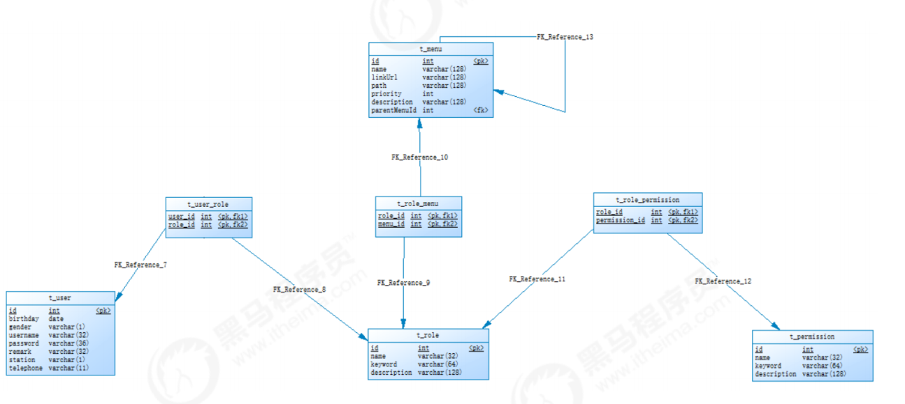

# 36-Spring Security


# 1. 权限控制

## 1.1 认证和授权概念

1. **认证：**认证（Authentication）是证明用户身份的过程，是为了解决 “Who are you?” 的问题，即在应用中谁能证明他就是他本人。使用特定系统时，身份验证是必不可少的机制。没有正确的身份验证就很难识别用户。在认证过程中，一般需要认证者提供与他们身份信息相关的一些标识信息来表明他就是他本人，如提供身份证，用户名/密码来证明。

   例如，有一个发送方 A 通过互联网向接收方 B 发送电子文档。系统将如何识别发送方 A 已发送给接收方 B 的专用消息。入侵者 C 可能会拦截，修改和重播文档以欺骗或窃取此类攻击，这些信息被称为**伪造**。

   在给定情况下，身份验证机制可确保两件事：首先，它确保发送者和接收者都是合法的人，这就是所谓的**数据来源身份验证**。其次，它借助私密会话密钥确保了发送者和接收者之间已建立的连接的安全性，从而无法推断出该连接，这被称为**对等实体身份验证**。

2. **授权：**授权（Authorization）技术用于确定授予已认证用户的权限。简而言之，它检查是否允许用户访问特定资源。授权发生在身份验证之后，在此之前先确定用户的身份，然后通过查找存储在表和数据库中的条目来确定用户的访问列表。

   例如，用户 A 希望访问服务器上特定的资源文件。首先用户 A 将向服务器发送请求，接收到用户 A 的请求之后，服务器会先验证用户 A 的身份。若用户 A 通过身份验证，之后服务器将找到用户 A 所具有的相应权限，判断用户 A 是否有访问所请求资源文件的权限。一般情况下，资源的访问权限可以包括查看，修改或删除等。

## 1.2 认证和授权的区别

身份认证和授权之间的主要区别

- 主要焦点：身份认证是检查一个人的详细信息以识别他，而授权检查一个用户的访问资源的权限。
- 主要过程：身份认证将验证用户的凭据，而授权将验证用户的权限。
- 程序顺序：首先进行身份认证，然后在身份认证之后进行授权。
- 应用领域：学生可以在访问大学的学习管理系统之前进行身份验证。他可以根据授予他的权限访问课程的幻灯片和其他学习资源。

**总结：**身份认证和授权是确保系统信息安全的两种机制。身份认证和授权之间的区别在于，身份认证是检查用户详细信息以识别其授予系统访问权限的过程，而授权则是检查经过身份验证的用户访问系统资源的特权或权限的过程。

## 1.2 权限模块数据模型

要实现最终的权限控制，需要有一套表结构支撑：用户表t_user、权限表t_permission、角色表t_role、菜单表t_menu、用户角色关系表t_user_role、角色权限关系表t_role_permission、角色菜单关系表t_role_menu。

表之间关系如下：



通过上图可以看到，权限模块共涉及到7张表。在这7张表中，角色表起到了至关重要的作用，其处于核心位置，因为用户、权限、菜单都和角色是多对多关系。

**认证过程：**只需要用户表就可以了，在用户登录时可以查询用户表t_user进行校验，判断用户输入的用户名和密码是否正确。

**授权过程：**用户必须完成认证之后才可以进行授权，首先可以根据用户查询其角色，再根据角色查询对应的菜单，这样就确定了用户能够看到哪些菜单。然后再根据用户的角色查询对应的权限，这样就确定了用户拥有哪些权限。所以授权过程会用到上面7张表。

# 2. Spring Security简介

Spring Security是 Spring提供的安全认证服务的框架。 使用Spring Security可以帮助我们来简化认证和授权的过程。官网：https://spring.io/projects/spring-security

概念：Spring Security，这是一种基于 Spring AOP 和 Servlet 过滤器的安全框架。它提供全面的安全性解决方案，同时在 Web 请求级和方法调用级处理身份确认和授权。

常用的权限框架除了Spring Security，还有Apache的shiro框架。

# 3.入门案例

1. 创建maven工程，打包方式为war，并导入相关坐标

   ```xml
   <!-- 安全框架 -->
   <dependency>
       <groupId>org.springframework.security</groupId>
       <artifactId>spring-security-web</artifactId>
       <version>5.0.5.RELEASE</version>
   </dependency>
   <dependency>
       <groupId>org.springframework.security</groupId>
       <artifactId>spring-security-config</artifactId>
       <version>5.0.5.RELEASE</version>
   </dependency>
   
   <build>
       <plugins>
         <plugin>
           <groupId>org.apache.tomcat.maven</groupId>
           <artifactId>tomcat7-maven-plugin</artifactId>
           <configuration>
             <!-- 指定端口 -->
             <port>85</port>
             <!-- 请求路径 -->
             <path>/</path>
           </configuration>
         </plugin>
       </plugins>
     </build>
   ```
   
2. 配置index.html页面，内容为hello Spring Security!!

3. 配置web.xml

   在web.xml中主要配置SpringMVC的DispatcherServlet和用于整合第三方框架的DelegatingFilterProxy，用于整合Spring Security。

   ```xml
   <filter>
       <!--
         DelegatingFilterProxy用于整合第三方框架
         整合Spring Security时过滤器的名称必须为springSecurityFilterChain，
      否则会抛出NoSuchBeanDefinitionException异常
       -->
       <!--    此名称为固定写法！-->
       <filter-name>springSecurityFilterChain</filter-name>
       <filter-class>org.springframework.web.filter.DelegatingFilterProxy</filter-class>
   </filter>
   <filter-mapping>
       <filter-name>springSecurityFilterChain</filter-name>
       <url-pattern>/*</url-pattern>
   </filter-mapping>
   
   <servlet>
       <servlet-name>springmvc</servlet-name>
       <servlet-class>org.springframework.web.servlet.DispatcherServlet</servlet-class>
       <!-- 指定加载的配置文件 ，通过参数contextConfigLocation加载 -->
       <init-param>
           <param-name>contextConfigLocation</param-name>
           <param-value>classpath:spring-security.xml</param-value>
       </init-param>
       <load-on-startup>1</load-on-startup>
   </servlet>
   <servlet-mapping>
       <servlet-name>springmvc</servlet-name>
       <url-pattern>*.do</url-pattern>
   </servlet-mapping>
   ```

4. 配置spring-security.xml

   在spring-security.xml中主要配置Spring Security的拦截规则和认证管理器。

   ```xml
   <?xml version="1.0" encoding="UTF-8"?>
   <beans xmlns="http://www.springframework.org/schema/beans"
          xmlns:xsi="http://www.w3.org/2001/XMLSchema-instance"
          xmlns:security="http://www.springframework.org/schema/security"
          xsi:schemaLocation="http://www.springframework.org/schema/beans
                              http://www.springframework.org/schema/beans/spring-beans.xsd
                              http://www.springframework.org/schema/security
                              http://www.springframework.org/schema/security/spring-security.xsd">
   
       <!--
       http：用于定义相关权限控制
       auto-config 自动配置，如果为true，表示自动应用一些默认配置，比如框架会默认提供一个登录页面，设置为false时需要显示提供登录表单配置，否则会报错
       use-expressions：：用于指定intercept-url中的access属性是否使用表达式，默认为true
   -->
       <security:http auto-config="true" use-expressions="true">
           <!--
   			intercept-url：定义一个拦截规则
               pattern：对哪些url进行权限控制， /** 表示拦截所有请求
               access：在请求对应的URL时需要什么权限，默认配置时它应该是一个以逗号分隔的角色列表，请求的用户只需拥有其中的一个角色就能成功访问对应的URL，hasRole：检查你是否具有某个角色
               -->
           <security:intercept-url pattern="/**" access="hasRole('ROLE_ADMIN')"></security:intercept-url>
           
       </security:http>
   
   
       <!--    配置认证管理器 authentication-manager：认证管理器，用于处理认证操作 -->
       <security:authentication-manager>
           <!--配置认证提供者，执行具体的认证逻辑-->
           <security:authentication-provider>
               <!--user-service：用于获取用户信息，提供给authentication-provider进行认证-->
               <security:user-service>
                   <!--
                   user：定义用户信息，可以指定用户名、密码、角色，后期可以改为从数据库查询用户信息
                   name：账户名
                   password：密码，{noop}表示标识符，明文密码
                   authorities：分配一个角色
                   -->
                   <security:user name="admin" password="{noop}1234" authorities="ROLE_ADMIN"></security:user>
               </security:user-service>
           </security:authentication-provider>
       </security:authentication-manager>
   </beans>
   ```

5. 测试访问

   直接访问`http://localhost:85/`，会自动跳转到`http://localhost:85/login`，这个登录页面是框架提供的

   此时可以将配置的登录账户和密码输入，查看是否正确跳转至index.html页面

   注意：第一次点击登录时会报如下错误：

   ```
   type Status report
   message /favicon.ico
   description The requested resource is not available.
   ```

   但是，没关系，再次登录即可正常跳转

   无论登录成功与否，登录页面提交的表单数据有如下几个

   ```
   username: admin
   password: 111
   submit: Login
   _csrf: cc4982b2-b5b6-414a-8fea-f6867dbdb3f9
   ```

   框架自己的表单结构如下：

   ```html
   <form name='f' action='/login' method='POST'>
       <table>
           <tr><td>User:</td><td><input type='text' name='username' value=''></td></tr>
           <tr><td>Password:</td><td><input type='password' name='password'/></td></tr>
           <tr><td colspan='2'><input name="submit" type="submit" value="Login"/></td></tr>
           <input name="_csrf" type="hidden" value="cc4982b2-b5b6-414a-8fea-f6867dbdb3f9" />
       </table>
   </form>
   ```

   `_csrf`：是隐藏域提交上来的，用于告诉框架这个登录页面是框架自己的，而不是我们自己配置的

   `csrf`：**跨站请求伪造**

# 4. 改进入门案例

前面我们已经完成了Spring Security的入门案例，通过入门案例我们可以看到，Spring-Security将我们项目中的所有资源都保护了起来，要访问这些资源必须要完成认证而且需要具有ROLE_ADMIN角色。

但是入门案例中的使用方法离我们真实生产环境还差很远，还存在如下一些问题：

1. 项目中我们将所有的资源（所有请求URL）都保护起来，实际环境下往往有一些资源不需要认证也可以访问，也就是可以匿名访问。
2. 登录页面是由框架生成的，而我们的项目往往会使用自己的登录页面。
3. 直接将用户名和密码配置在了配置文件中，而真实生产环境下的用户名和密码往往保存在数据库中。
4. 在配置文件中配置的密码使用明文，这非常不安全，而真实生产环境下密码需要进行加密

## 4.1 配置可匿名访问的资源

1. 在项目中创建pages目录，在pages目录中创建a.html和b.html

2. 在spring-security.xml文件中配置，指定哪些资源可以匿名访问

   ```xml
   <!--   
   	http：用于定义相关权限控制
   	指定哪些资源不需要进行权限校验，可以使用通配符
   -->
   <security:http security="none" pattern="/pages/a.html"></security:http>
   <!--    此目录下所有资源可匿名访问-->
   <security:http security="none" pattern="/pages/**"></security:http>
   ```

## 4.2 使用指定的登录页面

1. 提供login.html作为项目的登录页面

   ```html
   <h1>自定义登录页面</h1>
   <form action="/login.do" method="post">
       username:<input type="text" name="username"><br>
       password:<input type="password" name="password"><br>
       <input type="submit" value="submit">
   </form>
   ```

2. 修改spring-security.xml文件，指定login.html页面可以匿名访问，并且关闭CsrfFilter过滤器

   注意：此时需要将我们的自定义登录页面放行，不然也会被过滤掉

   ```xml
   
   <security:http security="none" pattern="/login.html"></security:http>
   <!--
       auto-config 自动配置，如果为true，表示自动应用一些默认配置，比如框架会默认提供一个登录页面
       use-expressions：是否使用spring提供的表达式来描述权限
   -->
   <security:http auto-config="true" use-expressions="true">
       <!--
               pattern：拦截url规则， /** 表示拦截所有请求
               access：指定所需的访问角色或者访问权限，hasRole 检查你是否具有某个角色
               -->
       <security:intercept-url pattern="/**" access="hasRole('ROLE_ADMIN')"></security:intercept-url>
   
   
       <!--如果我们要使用自己指定的页面作为登录页面，必须配置登录表单.页面提交的登录表单请求是由框架负责处理-->
       <!--
   			
               login-page:指定登录页面访问URL
               username-parameter：和form表单的name值相对应
               password-parameter：和form表单的name值相对应
               login-processing-url：登录验证方法，即@RequestMapping的方法，要和表单数据的提交地址保持一致
               default-target-url：默认目标路径，即登录之后跳转的路径
               authentication-failure-url：认证失败之后跳转的路径
           -->
   
       <security:form-login
                            login-page="/login.html"
                            username-parameter="username"
                            password-parameter="password"
                            login-processing-url="/login.do"
                            default-target-url="/index.html"
                            authentication-failure-url="/login.html"></security:form-login>
   
       <!--
            csrf：对应CsrfFilter过滤器
            disabled：是否启用CsrfFilter过滤器，如果使用自定义登录页面需要关闭此项，否则登录操作会被禁用（403）
          -->
       <security:csrf disabled="true"></security:csrf>
   </security:http>
   
   ```

## 4.3 从数据库查询用户信息

如果我们要从数据库动态查询用户信息，就必须按照spring security框架的要求提供一个实现UserDetailsService接口的实现类，并按照框架的要求进行配置即可。框架会自动调用实现类中的方法并自动进行密码校验

1. 简单了解

   ```java
   public class SpringSecurityUserService implements UserDetailsService {
   
       // 根据用户名查询用户信息
       @Override
       public UserDetails loadUserByUsername(String username) throws UsernameNotFoundException {
           System.out.println("用户名："+username);
   
           return null;
       }
   }
   
   ```

   此时可以重启tomcat服务器，无论如何登录一定报错，因为上面已经配置过通过自定义登录页面登录，并且，方法返回的是null，所以一定报错，但是我们主要的目的是查看方法的参数内容。

   **通过输出结果可知，参数username是我们登录输入的账户名**

2. 改进方法

   user类

   ```java
   public class User {
       private String username;
       private String password;
       private List<GrantedAuthority> list;
       public User(){
   
       }
   
       public User(String username, String password, List<GrantedAuthority> list) {
           this.username = username;
           this.password = password;
           this.list = list;
       }
   
       public List<GrantedAuthority> getList() {
           return list;
       }
   
       public void setList(List<GrantedAuthority> list) {
           this.list = list;
       }
   
       public String getUsername() {
           return username;
       }
   
       public void setUsername(String username) {
           this.username = username;
       }
   
       public String getPassword() {
           return password;
       }
   
       public void setPassword(String password) {
           this.password = password;
       }
   }
   
   ```

   具体方法

   ```java
   package com.itcast.service;
   
   import com.itcast.pojo.User;
   import org.springframework.security.core.GrantedAuthority;
   import org.springframework.security.core.authority.SimpleGrantedAuthority;
   import org.springframework.security.core.userdetails.UserDetails;
   import org.springframework.security.core.userdetails.UserDetailsService;
   import org.springframework.security.core.userdetails.UsernameNotFoundException;
   
   import java.util.ArrayList;
   import java.util.HashMap;
   import java.util.List;
   import java.util.Map;
   
   /**
    * @Class:health_parent.com.itcast.service.SpringSecurityUserService
    * @Descript:
    * @Author:宋天
    * @Date:2020/8/1
    */
   public class SpringSecurityUserService implements UserDetailsService {
       //模拟数据库中的用户数据
       public static Map<String, User> map = new HashMap<>();
   
       static {
           com.itcast.pojo.User user1 = new com.itcast.pojo.User();
           user1.setUsername("admin");
           user1.setPassword("admin");//明文密码（没有加密）
   
           com.itcast.pojo.User user2 = new com.itcast.pojo.User();
           user2.setUsername("xiaoming");
           user2.setPassword("1234");
   
           map.put(user1.getUsername(),user1);
   
           map.put(user2.getUsername(),user2);
       }
   
       /**
        *  根据用户名查询用户信息
        * @param username
        * @return
        * @throws UsernameNotFoundException
        */
       @Override
       public UserDetails loadUserByUsername(String username) throws UsernameNotFoundException {
           System.out.println("username:" + username);
   
           // 根据用户名查询数据库获得用户信息(包含数据库中存储的密码信息)
           User user = map.get(username);//模拟查询根据用户名查询数据库
           if (user == null){
               //用户名不存在
               return null;
           }
   
           //将用户信息返回给框架
           //框架会进行密码比对(页面提交的密码和数据库中查询的密码进行比对)
           List<GrantedAuthority> list = new ArrayList<>();
           //授权，后期需要改为查询数据库动态获得用户拥有的权限和角色
           list.add(new SimpleGrantedAuthority("permission_A"));//授权
           list.add(new SimpleGrantedAuthority("permission_B"));
   
           if(username.equals("admin")){
               list.add(new SimpleGrantedAuthority("ROLE_ADMIN"));//授予角色
           }
   
   
           org.springframework.security.core.userdetails.User securityUser = new org.springframework.security.core.userdetails.User(username,"{noop}"+user.getPassword(),list);
           return securityUser;
       }
   
   
   ```

3. 配置认证管理器，用于处理认证操作

   ```xml
   <!--    配置认证管理器-->
   <security:authentication-manager>
       <!--配置认证提供者-->
       <security:authentication-provider user-service-ref="userService">
       </security:authentication-provider>
   </security:authentication-manager>
   
   
   <bean id="userService" class="com.itcast.service.SpringSecurityUserService"></bean>
   ```

   注：当配置了`user-service-ref`时，此标签内部则不可以有`  <security:user-service>`标签，这是不允许的

4. 测试，访问`http://localhost:85/login.html`

   分别输入两个账户名和密码

   查看结果可知，admin账户正常登录，xiaoming用户则报错

   ```
   type Status report
   类型状态报告
   message Forbidden
   消息禁止
   description Access to the specified resource has been forbidden.
   描述禁止访问指定的资源
   ```

   原因：xiaoming账户未拥有`ROLE_ADMIN`角色

5. 关于权限的其他知识点

   ```xml
   <!--    配置哪些资源匿名可以访问-->
       <security:http security="none" pattern="/pages/a.html"></security:http>
   <!--    此目录下所有资源可匿名访问-->
       <security:http security="none" pattern="/pages/**"></security:http>
   
   
   <!--
           auto-config:自动配置，如果设置为true，表示自动应用一些默认配置，比如框架会提供一个默认的登录页面
           use-expressions:是否使用spring security提供的表达式来描述权限
       -->
   <security:http auto-config="true" use-expressions="true">
       <!--配置拦截规则，/** 表示拦截所有请求-->
       <!--
               pattern:描述拦截规则
               asscess:指定所需的访问角色或者访问权限
           -->
       <!--只要认证通过就可以访问-->
       <security:intercept-url pattern="/pages/a.html"  access="isAuthenticated()" />
   
       <!--拥有add权限就可以访问b.html页面-->
       <security:intercept-url pattern="/pages/b.html"  access="hasAuthority('add')" />
   
       <!--拥有ROLE_ADMIN角色就可以访问c.html页面-->
       <security:intercept-url pattern="/pages/c.html"  access="hasRole('ROLE_ADMIN')" />
   
       <!--拥有ROLE_ADMIN角色就可以访问d.html页面，
               注意：此处虽然写的是ADMIN角色，框架会自动加上前缀ROLE_-->
       <security:intercept-url pattern="/pages/d.html"  access="hasRole('ADMIN')" />
       <security:intercept-url pattern="/**" access="hasRole('ROLE_ADMIN')"></security:intercept-url>
   
       <!--如果我们要使用自己指定的页面作为登录页面，必须配置登录表单.页面提交的登录表单请求是由框架负责处理-->
       <!--
               login-page:指定登录页面访问URL
           -->
       <security:form-login
                            login-page="/login.html"
                            username-parameter="username"
                            password-parameter="password"
                            login-processing-url="/login.do"
                            default-target-url="/index.html"
                            authentication-failure-url="/login.html"></security:form-login>
   
       <!--
             csrf：对应CsrfFilter过滤器
             disabled：是否启用CsrfFilter过滤器，如果使用自定义登录页面需要关闭此项，否则登录操作会被禁用（403）
           -->
       <security:csrf disabled="true"></security:csrf>
   </security:http>
   ```

   

## 4.4 对密码进行加密

前面我们使用的密码都是明文的，这是非常不安全的。一般情况下用户的密码需要进行加密后再保存到数据库中。

常见的密码加密方式有：

- 3DES、AES、DES：使用对称加密算法，可以通过解密来还原出原始密码
- MD5、SHA1：使用单向HASH算法，无法通过计算还原出原始密码，但是可以建立彩虹表进行查表破解
- bcrypt：将salt随机并混入最终加密后的密码，验证时也无需单独提供之前的salt，从而无需单独处理salt问题

加密后的格式一般为：

```
$2a$10$/bTVvqqlH9UiE0ZJZ7N2Me3RIgUCdgMheyTgV0B4cMCSokPa.6oCa
```

加密后字符串的长度为固定的60位。其中：$是分割符，无意义；2a是bcrypt加密版本号；10是cost的值；而后的前22位是salt值；再然后的字符串就是密码的密文了。

实现步骤：

1. 在spring-security.xml文件中指定密码加密对象

   ```xml
   <!--配置密码加密对象-->
   <bean id="passwordEncoder"
         class="org.springframework.security.crypto.bcrypt.BCryptPasswordEncoder" />
   
   <!--    配置认证管理器-->
   <security:authentication-manager>
       <!--配置认证提供者-->
       <security:authentication-provider user-service-ref="userService">
           <!--指定对密码进行加密的对象-->
           <security:password-encoder ref="passwordEncoder"></security:password-encoder>
   
       </security:authentication-provider>
   
   
   </security:authentication-manager>
   <!--开启spring注解使用-->
   <context:annotation-config></context:annotation-config>
   ```

2. 修改userService类

   ```java
   package com.itcast.service;
   
   import com.itcast.pojo.User;
   import org.springframework.beans.factory.annotation.Autowired;
   import org.springframework.security.core.GrantedAuthority;
   import org.springframework.security.core.authority.SimpleGrantedAuthority;
   import org.springframework.security.core.userdetails.UserDetails;
   import org.springframework.security.core.userdetails.UserDetailsService;
   import org.springframework.security.core.userdetails.UsernameNotFoundException;
   import org.springframework.security.crypto.bcrypt.BCryptPasswordEncoder;
   
   import java.util.ArrayList;
   import java.util.HashMap;
   import java.util.List;
   import java.util.Map;
   
   /**
    * @Class:health_parent.com.itcast.service.SpringSecurityUserService
    * @Descript:
    * @Author:宋天
    * @Date:2020/8/1
    */
   public class SpringSecurityUserService implements UserDetailsService {
   
       @Autowired
       private BCryptPasswordEncoder passwordEncoder;
   
   
       //模拟数据库中的用户数据
       public static Map<String, User> map = new HashMap<>();
   
       public void initUserData(){
           User user1 = new User();
           user1.setUsername("admin");
           user1.setPassword(passwordEncoder.encode("admin"));//使用bcrypt提供的方法对密码进行加密
   
           System.out.println("password:"+user1.getPassword());
   
           User user2 = new User();
           user2.setUsername("xiaoming");
           user2.setPassword(passwordEncoder.encode("1234"));
   
           map.put(user1.getUsername(),user1);
           map.put(user2.getUsername(),user2);
       }
   
   
       /**
        *  根据用户名查询用户信息
        * @param username
        * @return
        * @throws UsernameNotFoundException
        */
       @Override
       public UserDetails loadUserByUsername(String username) throws UsernameNotFoundException {
           initUserData();
   
           System.out.println("用户输入的用户名为：" + username);
   
           // 根据用户名查询数据库获得用户信息(包含数据库中存储的密码信息)
           User user = map.get(username);//模拟查询根据用户名查询数据库
           if (user == null){
               //用户名不存在
               return null;
           }
   
           //将用户信息返回给框架
           //框架会进行密码比对(页面提交的密码和数据库中查询的密码进行比对)
           List<GrantedAuthority> list = new ArrayList<>();
           //授权，后期需要改为查询数据库动态获得用户拥有的权限和角色
           list.add(new SimpleGrantedAuthority("permission_A"));//授权
           list.add(new SimpleGrantedAuthority("permission_B"));
   
           if(username.equals("admin")){
               list.add(new SimpleGrantedAuthority("ROLE_ADMIN"));//授予角色
               list.add(new SimpleGrantedAuthority("add"));//授权
           }
   
           org.springframework.security.core.userdetails.User securityUser = new org.springframework.security.core.userdetails.User(username,"{noop}"+user.getPassword(),list);
           return securityUser;
       }
   
   }
   
   ```

## 4.4 配置多种校验规则

为了测试方便，首先在项目中创建a.html、b.html、c.html、d.html几个页面

修改spring-security.xml文件

```xml
<security:http auto-config="true" use-expressions="true">


    <!--只要认证通过就可以访问-->
    <security:intercept-url pattern="/index.html" access="isAuthenticated()"/>
    <security:intercept-url pattern="/a.html" access="isAuthenticated()" />
    <!--拥有add权限就可以访问b.html页面-->
    <security:intercept-url pattern="/b.html" access="hasAuthority('add')"/>
    <!--拥有ROLE_ADMIN角色就可以访问c.html页面-->
    <security:intercept-url pattern="/c.html" access="hasRole('ROLE_ADMIN')"/>
    <!--拥有ROLE_ADMIN角色就可以访问d.html页面，
        注意：此处虽然写的是ADMIN角色，框架会自动加上前缀ROLE_-->
    <security:intercept-url pattern="/d.html" access="hasRole('ADMIN')" />


    <!--
            pattern：拦截url规则， /** 表示拦截所有请求
            access：指定所需的访问角色或者访问权限，hasRole 检查你是否具有某个角色
            -->
    <security:intercept-url pattern="/**" access="hasRole('ROLE_ADMIN')"></security:intercept-url>


    <!--如果我们要使用自己指定的页面作为登录页面，必须配置登录表单.页面提交的登录表单请求是由框架负责处理-->
    <!--
            login-page:指定登录页面访问URL
            username-parameter：和form表单的name值相对应
            password-parameter：和form表单的name值相对应
            login-processing-url：登录验证方法，即@RequestMapping的方法
            default-target-url：默认目标路径，即登录之后跳转的路径
            authentication-failure-url：认证失败之后跳转的路径
        -->

    <security:form-login
                         login-page="/login.html"
                         username-parameter="username"
                         password-parameter="password"
                         login-processing-url="/login.do"
                         default-target-url="/index.html"
                         authentication-failure-url="/login.html"></security:form-login>

    <!--
         csrf：对应CsrfFilter过滤器
         disabled：是否启用CsrfFilter过滤器，如果使用自定义登录页面需要关闭此项，否则登录操作会被禁用（403）
       -->
    <security:csrf disabled="true"></security:csrf>
</security:http>

```

# 5. 注解方式权限

Spring Security除了可以在配置文件中配置权限校验规则，还可以使用注解方式控制类中方法的调用。例如Controller中的某个方法要求必须具有某个权限才可以访问，此时就可以使用Spring Security框架提供的注解方式进行控制。

1. 在spring-security.xml文件中配置组件扫描，用于扫描Controller

   ```xml
   <mvc:annotation-driven></mvc:annotation-driven>
   <context:component-scan base-package="com.itcaast.controller"></context:component-scan>
   ```

2. 在spring-security.xml文件中开启权限注解支持

   ```xml
   <!--开启注解方式权限控制-->
   <security:global-method-security pre-post-annotations="enabled" />
   ```

3. 创建Controller类并在Controller的方法上加入注解进行权限控制

   ```java
   package com.itcast.controller;
   
   import org.springframework.security.access.prepost.PreAuthorize;
   import org.springframework.web.bind.annotation.RequestMapping;
   import org.springframework.web.bind.annotation.RestController;
   import org.springframework.web.servlet.ModelAndView;
   
   @RestController
   @RequestMapping("/hello")
   public class HelloController {
       @RequestMapping("/add")
       @PreAuthorize("hasAuthority('add')")//调用此方法要求当前用户必须具有add权限
       public String add(){
           System.out.println("add...");
           return "success";
       }
   
       @RequestMapping("/delete")
       @PreAuthorize("hasRole('ROLE_ADMIN')")//调用此方法要求当前用户必须具有ROLE_ADMIN角色
       public String delete(){
           System.out.println("delete...");
           return "success";
       }
   
   }
   
   ```

通过上面的配置可以发现，如果用户要退出登录，只需要请求/logout.do这个URL地址就可以，同时会将当前session失效，最后页面会跳转到login.html页面。

