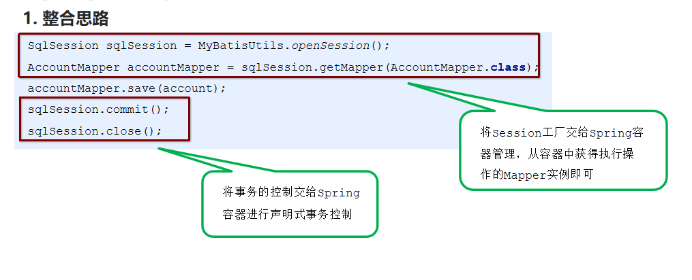

# 37-SSM整合

# 1.概念

SSM（Spring+SpringMVC+MyBatis）框架集由Spring、MyBatis两个开源框架整合而成。常作为数据源较简单的web项目的框架。

因为 **Spring MVC是 Spring框架中的一个子模块**，所以 Spring 与 SpringMVC 之间不存在整合的问题。实际上，SSM 框架的整合只涉及 Spring 与 MyBatis 的整合以及 Spring MVC 与 MyBatis 的整合。

- Spring

  Spring就像是整个项目中装配bean的大工厂，**在配置文件中可以指定使用特定的参数去调用实体类的构造方法来实例化对象**。也可以称之为项目中的粘合剂。

  **Spring的核心思想是IoC（控制反转）**，即不再需要程序员去显式地`new`一个对象，而是让Spring框架帮你来完成这一切。

- SpringMVC

  SpringMVC在项目中拦截用户请求，**它的核心Servlet即DispatcherServlet承担中介或是前台这样的职责**，将用户请求通过HandlerMapping去匹配Controller，Controller就是具体对应请求所执行的操作。SpringMVC相当于SSH框架中struts。

- mybatis

  **mybatis是对jdbc的封装**，它让数据库底层操作变的透明。mybatis的操作都是围绕一个sqlSessionFactory实例展开的。mybatis通过配置文件关联到各实体类的Mapper文件，Mapper文件中配置了每个类对数据库所需进行的sql语句映射。在每次与数据库交互时，通过sqlSessionFactory拿到一个sqlSession，再执行sql命令。

SSM工作的整体流程：

页面发送请求给控制器，控制器调用业务层处理逻辑，逻辑层向持久层发送请求，持久层与数据库交互，后将结果返回给业务层，业务层将处理逻辑发送给控制器，控制器再调用视图展现数据

# 2. 原始方式整合

1. 创建maven工程，打包方式为war包，并分别创建如下结构目录

   - com
     - itcast
       - controller
       - dao
       - pojo
       - service
         - impl

2. 导入坐标

   ```xml
   <?xml version="1.0" encoding="UTF-8"?>
   
   <project xmlns="http://maven.apache.org/POM/4.0.0" xmlns:xsi="http://www.w3.org/2001/XMLSchema-instance"
     xsi:schemaLocation="http://maven.apache.org/POM/4.0.0 http://maven.apache.org/xsd/maven-4.0.0.xsd">
     <modelVersion>4.0.0</modelVersion>
   
     <groupId>org.example</groupId>
     <artifactId>ssm</artifactId>
     <version>1.0-SNAPSHOT</version>
     <packaging>war</packaging>
   
     <name>ssm Maven Webapp</name>
     <!-- FIXME change it to the project's website -->
     <url>http://www.example.com</url>
   
     <properties>
       <project.build.sourceEncoding>UTF-8</project.build.sourceEncoding>
       <maven.compiler.source>1.8</maven.compiler.source>
       <maven.compiler.target>1.8</maven.compiler.target>
       <spring.version>5.0.5.RELEASE</spring.version>
       <springmvc.version>5.0.5.RELEASE</springmvc.version>
       <mybatis.version>3.4.5</mybatis.version>
     </properties>
     <!--锁定jar版本-->
     <dependencyManagement>
       <dependencies>
         <!-- Mybatis -->
         <dependency>
           <groupId>org.mybatis</groupId>
           <artifactId>mybatis</artifactId>
           <version>${mybatis.version}</version>
         </dependency>
         <!-- springMVC -->
         <dependency>
           <groupId>org.springframework</groupId>
           <artifactId>spring-webmvc</artifactId>
           <version>${springmvc.version}</version>
         </dependency>
         <!-- spring -->
         <dependency>
           <groupId>org.springframework</groupId>
           <artifactId>spring-context</artifactId>
           <version>${spring.version}</version>
         </dependency>
         <dependency>
           <groupId>org.springframework</groupId>
           <artifactId>spring-core</artifactId>
           <version>${spring.version}</version>
         </dependency>
         <dependency>
           <groupId>org.springframework</groupId>
           <artifactId>spring-aop</artifactId>
           <version>${spring.version}</version>
         </dependency>
         <dependency>
           <groupId>org.springframework</groupId>
           <artifactId>spring-web</artifactId>
           <version>${spring.version}</version>
         </dependency>
         <dependency>
           <groupId>org.springframework</groupId>
           <artifactId>spring-expression</artifactId>
           <version>${spring.version}</version>
         </dependency>
         <dependency>
           <groupId>org.springframework</groupId>
           <artifactId>spring-beans</artifactId>
           <version>${spring.version}</version>
         </dependency>
         <dependency>
           <groupId>org.springframework</groupId>
           <artifactId>spring-aspects</artifactId>
           <version>${spring.version}</version>
         </dependency>
         <dependency>
           <groupId>org.springframework</groupId>
           <artifactId>spring-context-support</artifactId>
           <version>${spring.version}</version>
         </dependency>
         <dependency>
           <groupId>org.springframework</groupId>
           <artifactId>spring-test</artifactId>
           <version>${spring.version}</version>
         </dependency>
         <dependency>
           <groupId>org.springframework</groupId>
           <artifactId>spring-jdbc</artifactId>
           <version>${spring.version}</version>
         </dependency>
         <dependency>
           <groupId>org.springframework</groupId>
           <artifactId>spring-tx</artifactId>
           <version>${spring.version}</version>
         </dependency>
       </dependencies>
     </dependencyManagement>
   
     <dependencies>
       <!-- Mybatis和mybatis与spring的整合 -->
       <dependency>
         <groupId>org.mybatis</groupId>
         <artifactId>mybatis</artifactId>
       </dependency>
       <dependency>
         <groupId>org.mybatis</groupId>
         <artifactId>mybatis-spring</artifactId>
         <version>1.3.1</version>
       </dependency>
       <!-- MySql驱动 -->
       <dependency>
         <groupId>mysql</groupId>
         <artifactId>mysql-connector-java</artifactId>
         <version>8.0.15</version>
       </dependency>
       <!-- druid数据库连接池 -->
       <dependency>
         <groupId>com.alibaba</groupId>
         <artifactId>druid</artifactId>
         <version>1.0.9</version>
       </dependency>
       <!-- c3p0数据库连接池 -->
       <dependency>
         <groupId>c3p0</groupId>
         <artifactId>c3p0</artifactId>
         <version>0.9.1.2</version>
       </dependency>
       <!-- springMVC核心-->
       <dependency>
         <groupId>org.springframework</groupId>
         <artifactId>spring-webmvc</artifactId>
       </dependency>
       <!-- spring相关 -->
       <dependency>
         <groupId>org.springframework</groupId>
         <artifactId>spring-context</artifactId>
       </dependency>
       <dependency>
         <groupId>org.springframework</groupId>
         <artifactId>spring-core</artifactId>
       </dependency>
       <dependency>
         <groupId>org.springframework</groupId>
         <artifactId>spring-aop</artifactId>
       </dependency>
       <dependency>
         <groupId>org.springframework</groupId>
         <artifactId>spring-web</artifactId>
       </dependency>
       <dependency>
         <groupId>org.springframework</groupId>
         <artifactId>spring-expression</artifactId>
       </dependency>
       <dependency>
         <groupId>org.springframework</groupId>
         <artifactId>spring-beans</artifactId>
       </dependency>
       <dependency>
         <groupId>org.springframework</groupId>
         <artifactId>spring-aspects</artifactId>
       </dependency>
       <dependency>
         <groupId>org.springframework</groupId>
         <artifactId>spring-context-support</artifactId>
       </dependency>
       <dependency>
         <groupId>org.springframework</groupId>
         <artifactId>spring-test</artifactId>
       </dependency>
       <dependency>
         <groupId>org.springframework</groupId>
         <artifactId>spring-jdbc</artifactId>
       </dependency>
       <dependency>
         <groupId>org.springframework</groupId>
         <artifactId>spring-tx</artifactId>
       </dependency>
       <!-- junit测试 -->
       <dependency>
         <groupId>junit</groupId>
         <artifactId>junit</artifactId>
         <version>4.12</version>
       </dependency>
       <dependency>
         <groupId>javax.servlet</groupId>
         <artifactId>servlet-api</artifactId>
         <version>2.5</version>
         <scope>provided</scope>
       </dependency>
       <dependency>
         <groupId>javax.servlet</groupId>
         <artifactId>jsp-api</artifactId>
         <version>2.0</version>
         <scope>provided</scope>
       </dependency>
       <!-- jstl -->
       <dependency>
         <groupId>javax.servlet</groupId>
         <artifactId>jstl</artifactId>
         <version>1.2</version>
       </dependency>
     </dependencies>
   
     <build>
       <plugins>
         <plugin>
           <groupId>org.apache.maven.plugins</groupId>
           <artifactId>maven-compiler-plugin</artifactId>
           <version>3.1</version>
           <configuration>
             <source>1.8</source>
             <target>1.8</target>
             <encoding>UTF-8</encoding>
           </configuration>
         </plugin>
         <plugin>
           <groupId>org.apache.tomcat.maven</groupId>
           <artifactId>tomcat7-maven-plugin</artifactId>
           <configuration>
             <!-- 指定端口 -->
             <port>82</port>
             <!-- 请求路径 -->
             <path>/</path>
           </configuration>
         </plugin>
       </plugins>
     </build>
   </project>
   ```

3. 在webapp根目录如下创建页面

   - 保存数据页面，save.jsp

     ```jsp
<%@ page contentType="text/html;charset=UTF-8" language="java" %>
     <html>
     <head>
         <title>Title</title>
     </head>
     <body>
         <h2>保存用户信息表单</h2>
         <form action="${pageContext.request.contextPath}/account/save" method="post">
             用户名称：<input type="text" name="name"><br>
             账户金额：<input type="text" name="balance"><br>
     
             <input type="submit" value="提交">
         </form>
     </body>
     </html>
     ```
     
   - 展示数据页面，accountList.jsp

     ```html
  <%@ taglib prefix="c" uri="http://java.sun.com/jsp/jstl/core" %>
     <%@ page contentType="text/html;charset=UTF-8" isELIgnored="false" language="java" %>
     <html>
     <body>
         <table border="1">
             <tr>
                 <th>账户</th>
                 <th>账户名称</th>
                 <th>账户金额</th>
             </tr>
             <c:forEach items="${accountList}" var="account">
                 <tr>
                     <td>${account.id}</td>
                     <td>${account.name}</td>
                     <td>${account.balance}</td>
                 </tr>
             </c:forEach>
         </table>
     </body>
     </html>
     
     ```
   
4. 创建数据库以及数据表

   ```sql
   create database sys;
   
   create table account(
       id int primary key auto_increment,
       name varchar(100),
       balance double(7,2)
   );
   ```

5. 创建controller文件

   ```java
   package com.itcast.controller;
   
   import com.itcast.pojo.Account;
   import com.itcast.service.AccountService;
   import org.springframework.beans.factory.annotation.Autowired;
   import org.springframework.stereotype.Controller;
   import org.springframework.web.bind.annotation.RequestMapping;
   import org.springframework.web.bind.annotation.ResponseBody;
   import org.springframework.web.servlet.ModelAndView;
   
   import java.util.List;
   
   /**
    * @Class:spring.com.itcast.controller.AccountController
    * @Descript:
    * @Author:宋天
    * @Date:2020/8/5
    */
   @Controller
   @RequestMapping("/account")
   public class AccountController {
   
       @Autowired
       private AccountService accountService;
   
       @RequestMapping(value = "/save",produces = "text/html;charset=UTF-8")
       @ResponseBody
       public String save(Account account){
           accountService.save(account);
   
           return "保存成功";
       }
   
       @RequestMapping("/findAll")
       public ModelAndView findAll(){
           List<Account> accountList = accountService.findAll();
           ModelAndView view = new ModelAndView();
           view.addObject("accountList",accountList);
           view.setViewName("accountList");
   
           return view;
       }
   }
   
   ```

6. 实体类

   ```java
   package com.itcast.pojo;
   
   /**
    * @Class:spring.pojo.Account
    * @Descript:
    * @Author:宋天
    * @Date:2020/8/5
    */
   public class Account {
       private int id;
       private String name;
       private double balance;
   
       public int getId() {
           return id;
       }
   
       public void setId(int id) {
           this.id = id;
       }
   
       public String getName() {
           return name;
       }
   
       public void setName(String name) {
           this.name = name;
       }
   
       public double getBalance() {
           return balance;
       }
   
       public void setBalance(double balance) {
           this.balance = balance;
       }
   
       @Override
       public String toString() {
           return "Account{" +
                   "id=" + id +
                   ", name='" + name + '\'' +
                   ", balance=" + balance +
                   '}';
       }
   }
   
   ```

7. 创建service接口

   ```java
   public interface AccountService {
       void save(Account account);
       List<Account> findAll();
   }
   ```

8. 创建service实现类

   ```java
   package com.itcast.service.impl;
   
   import com.itcast.dao.AccountDao;
   import com.itcast.pojo.Account;
   import com.itcast.service.AccountService;
   import org.apache.ibatis.io.Resources;
   import org.apache.ibatis.session.SqlSession;
   import org.apache.ibatis.session.SqlSessionFactory;
   import org.apache.ibatis.session.SqlSessionFactoryBuilder;
   import org.springframework.beans.factory.annotation.Autowired;
   import org.springframework.stereotype.Service;
   
   import java.io.IOException;
   import java.io.InputStream;
   import java.util.List;
   
   /**
    * @Class:spring.com.itcast.service.impl.AccountServiceImpl
    * @Descript:
    * @Author:宋天
    * @Date:2020/8/5
    */
   @Service("accountService")
   public class AccountServiceImpl implements AccountService {
   
   //    @Autowired
   //    private AccountDao accountDao;
   
       @Override
       public void save(Account account)  {
          try {
              InputStream resourceAsStream = Resources.getResourceAsStream("sqlMapperConfig.xml");
              SqlSessionFactory sqlSessionFactory = new SqlSessionFactoryBuilder().build(resourceAsStream);
              SqlSession sqlSession = sqlSessionFactory.openSession();
              AccountDao mapper = sqlSession.getMapper(AccountDao.class);
              mapper.save(account);
              sqlSession.commit();// 手动提交
              sqlSession.close();
          }catch (Exception e){
              e.printStackTrace();
          }
       }
   
       @Override
       public List<Account> findAll(){
         try  {
             InputStream resourceAsStream = Resources.getResourceAsStream("sqlMapperConfig.xml");
             SqlSessionFactory sqlSessionFactory = new SqlSessionFactoryBuilder().build(resourceAsStream);
             SqlSession sqlSession = sqlSessionFactory.openSession();
             AccountDao mapper = sqlSession.getMapper(AccountDao.class);
             List<Account> accountList = mapper.findAll();
             sqlSession.close();
             return accountList;
         }catch (Exception e){
             e.printStackTrace();
             return  null;
         }
       }
   }
   ```

9. 创建dao接口

   ```java
   public interface AccountDao {
       void save(Account account);
       List<Account> findAll();
   }
   ```

10. 创建spring配置文件

    - spring-applicationContext.xml文件

      ```xml
      <?xml version="1.0" encoding="UTF-8"?>
      <beans xmlns="http://www.springframework.org/schema/beans"
             xmlns:context="http://www.springframework.org/schema/context"
             xmlns:xsi="http://www.w3.org/2001/XMLSchema-instance" xmlns:mvc="http://www.springframework.org/schema/mvc"
             xsi:schemaLocation="http://www.springframework.org/schema/beans http://www.springframework.org/schema/beans/spring-beans.xsd
             http://www.springframework.org/schema/context http://www.springframework.org/schema/context/spring-context.xsd http://www.springframework.org/schema/mvc http://www.springframework.org/schema/mvc/spring-mvc.xsd">
      
      
      <!--    组件扫描，扫描service和mapper-->
          <context:component-scan base-package="com.itcast">
      <!--        排除controller扫描-->
              <context:exclude-filter type="annotation" expression="org.springframework.stereotype.Controller"/>
          </context:component-scan>
      </beans>
      ```

    - spring-mvc.xml

      ```xml
      <?xml version="1.0" encoding="UTF-8"?>
      <beans xmlns="http://www.springframework.org/schema/beans"
             xmlns:context="http://www.springframework.org/schema/context"
             xmlns:xsi="http://www.w3.org/2001/XMLSchema-instance" xmlns:mvc="http://www.springframework.org/schema/mvc"
             xsi:schemaLocation="http://www.springframework.org/schema/beans http://www.springframework.org/schema/beans/spring-beans.xsd
             http://www.springframework.org/schema/context http://www.springframework.org/schema/context/spring-context.xsd http://www.springframework.org/schema/mvc http://www.springframework.org/schema/mvc/spring-mvc.xsd">
      
          <!--组件扫描，指定扫描controller包-->
          <context:component-scan base-package="com.itcast.controller"></context:component-scan>
      
          <!--mvc注解驱动-->
          <mvc:annotation-driven/>
      
          <!-- 配置内部资源视图解析器 -->
          <bean class="org.springframework.web.servlet.view.InternalResourceViewResolver">
              <!-- 使用前缀和后缀 -->
              <property name="prefix" value="/"></property>
              <property name="suffix" value=".jsp"></property>
          </bean>
          
      <!--    开放静态资源访问权限-->
          <mvc:default-servlet-handler></mvc:default-servlet-handler>
      
      
      </beans>
      ```

    - mybatis核心配置文件sqlMapperConfig.xml

      ```xml
      <?xml version="1.0" encoding="UTF-8" ?>
      <!DOCTYPE configuration PUBLIC "-//mybatis.org//DTD Config 3.0//EN"
              "http://mybatis.org/dtd/mybatis-3-config.dtd">
      <configuration>
      
          <!--    使用jdbc.properties-->
          <!--    注：资源文件地址如果在resources根目录下则直接写文件名即可，如果不是则需要加文件夹名-->
          <properties resource="jdbc.properties"></properties>
      
      
          <!--    自定义别名 -->
          <typeAliases>
              <typeAlias type="com.itcast.pojo.Account" alias="account"></typeAlias>
      
              <!-- 批量别名定义,指定包名，mybatis自动扫描包中的实体类，自动定义别名，别名是类名(首字母大写或小写都可以,一般用小写) -->
              <!-- <package name="itcast.domain" /> -->
          </typeAliases>
      
          <!--    数据源环境-->
          <environments default="development">
              <environment id="development">
                  <transactionManager type="JDBC"></transactionManager>
                  <dataSource type="POOLED">
                      <property name="driver" value="${jdbc.driver}"/>
                      <property name="url" value="${jdbc.url}"></property>
                      <property name="username" value="${jdbc.username}"></property>
                      <property name="password" value="${jdbc.password}"></property>
                  </dataSource>
              </environment>
          </environments>
      
      
          <!--加载映射文件-->
          <mappers>
              <package name="com.itcast.dao"/>
          </mappers>
      </configuration>
      ```
      
    - jdbc.properties
    
      ```properties
  jdbc.driver=com.mysql.cj.jdbc.Driver
      jdbc.url=jdbc:mysql://localhost:3306/sys?useSSL=false&serverTimezone=UTC&allowPublicKeyRetrieval=true
  jdbc.username=root
      jdbc.password=password
      ```
    
    - log4j.properties
    
      ```properties
  # Set root category priority to INFO and its only appender to CONSOLE.
      #log4j.rootCategory=INFO, CONSOLE            debug   info   warn error fatal
  log4j.rootCategory=debug, CONSOLE, LOGFILE
      
      # Set the enterprise logger category to FATAL and its only appender to CONSOLE.
      log4j.logger.org.apache.axis.enterprise=FATAL, CONSOLE
      
      # CONSOLE is set to be a ConsoleAppender using a PatternLayout.
      log4j.appender.CONSOLE=org.apache.log4j.ConsoleAppender
      log4j.appender.CONSOLE.layout=org.apache.log4j.PatternLayout
      log4j.appender.CONSOLE.layout.ConversionPattern=%d{ISO8601} %-6r [%15.15t] %-5p %30.30c %x - %m\n
      
      # LOGFILE is set to be a File appender using a PatternLayout.
      log4j.appender.LOGFILE=org.apache.log4j.FileAppender
      log4j.appender.LOGFILE.File=d:\axis.log
      log4j.appender.LOGFILE.Append=true
      log4j.appender.LOGFILE.layout=org.apache.log4j.PatternLayout
      log4j.appender.LOGFILE.layout.ConversionPattern=%d{ISO8601} %-6r [%15.15t] %-5p %30.30c %x - %m\n
      ```
    
11. 在resources目录下创建如下目录，并在其内创建sql映射文件

    `com/itcast/dao`，注意，**此目录保持和项目dao接口目录相同**

    AccountDao.xml

    ```xml
    <?xml version="1.0" encoding="UTF-8"?>
    <!DOCTYPE mapper
            PUBLIC "-//mybatis.org//DTD Mapper 3.0//EN"
            "http://mybatis.org/dtd/mybatis-3-mapper.dtd">
    
    <!--  注意：namespace为接口的全限定类名-->
    <mapper namespace="com.itcast.dao.AccountDao" >
    
        <!-- 保存数据-->
        <insert id="save" parameterType="account">
            insert into account values(#{id},#{name},#{balance})
        </insert>
    
        <!--查询数据-->
        <select id="findAll" resultType="account">
            select * from account
        </select>
    </mapper>
    ```

12. 修改web.xml文件

    ```xml
    <?xml version="1.0" encoding="UTF-8"?>
    <web-app xmlns="http://xmlns.jcp.org/xml/ns/javaee"
             xmlns:xsi="http://www.w3.org/2001/XMLSchema-instance"
             xsi:schemaLocation="http://xmlns.jcp.org/xml/ns/javaee http://xmlns.jcp.org/xml/ns/javaee/web-app_4_0.xsd"
             version="4.0">
    
      <display-name>Archetype Created Web Application</display-name>
    
    <!--  加载spring配置文件-->
      <context-param>
        <param-name>contextConfigLocation</param-name>
        <param-value>classpath:spring-applicationContext.xml</param-value>
      </context-param>
    <!--  配置spring监听器-->
      <listener>
        <listener-class>org.springframework.web.context.ContextLoaderListener</listener-class>
      </listener>
    
    <!--配置springMVC核心控制器-->
      <servlet>
        <servlet-name>DispatcherServlet</servlet-name>
        <servlet-class>org.springframework.web.servlet.DispatcherServlet</servlet-class>
        <init-param>
          <param-name>contextConfigLocation</param-name>
          <param-value>classpath:spring-mvc.xml</param-value>
        </init-param>
        <!-- 服务器启动时创建对象-->
        <load-on-startup>1</load-on-startup>
      </servlet>
        <!--
              1)  /*  拦截所有  ,拦截jsp
              2)  / 表示拦截所有 (不拦截jsp)
              3)  /user/* 拦截user 下的所有资源
              4)  *.do    拦截.do 结尾的请求
              错误:  /*.do 非法配置
            -->
      <servlet-mapping>
        <servlet-name>DispatcherServlet</servlet-name>
        <url-pattern>/</url-pattern>
      </servlet-mapping>
    
      <!--解决请求时乱码的过滤器-->
      <filter>
        <filter-name>CharacterEncodingFilter</filter-name>
        <filter-class>org.springframework.web.filter.CharacterEncodingFilter</filter-class>
        <init-param>
          <param-name>encoding</param-name>
          <param-value>UTF-8</param-value>
        </init-param>
      </filter>
      <filter-mapping>
        <filter-name>CharacterEncodingFilter</filter-name>
        <url-pattern>/*</url-pattern>
      </filter-mapping>
    
    </web-app>
    ```

13. 测试

    访问`http://localhost:82/save.jsp` 插入数据，查看是否正确输出内容

    访问`http://localhost:82/account/findAll`，查看数据是否正确展示

# 3. Spring整合MyBatis



修改上述案例，进行整合

1. 整合的核心坐标

   ```xml
   <dependency>
       <groupId>org.mybatis</groupId>
       <artifactId>mybatis-spring</artifactId>
       <version>1.3.1</version>
   </dependency>
   <dependency>
       <groupId>org.springframework</groupId>
       <artifactId>spring-tx</artifactId>
       <version>5.0.5.RELEASE</version>
   </dependency>
   <dependency>
       <groupId>org.springframework</groupId>
       <artifactId>spring-jdbc</artifactId>
       <version>5.0.5.RELEASE</version>
   </dependency>
   <!-- druid数据库连接池 -->
   <dependency>
       <groupId>com.alibaba</groupId>
       <artifactId>druid</artifactId>
       <version>1.0.9</version>
   </dependency>
   ```

   

2. 修改sqlMapperConfig配置文件，只保留如下内容，其他交给spring创建

   ```xml
   <?xml version="1.0" encoding="UTF-8" ?>
   <!DOCTYPE configuration PUBLIC "-//mybatis.org//DTD Config 3.0//EN"
           "http://mybatis.org/dtd/mybatis-3-config.dtd">
   <configuration>
   
       <!--    自定义别名 -->
       <typeAliases>
           <typeAlias type="com.itcast.pojo.Account" alias="account"></typeAlias>
   
           <!-- 批量别名定义,指定包名，mybatis自动扫描包中的实体类，自动定义别名，别名是类名(首字母大写或小写都可以,一般用小写) -->
           <!-- <package name="itcast.domain" /> -->
       </typeAliases>
       
   </configuration>
   ```

3. 修改spring核心配置文件spring-application.xml文件

   主要添加的部分为：

   - 加载jdbc.properties文件
   - 配置数据源信息
   - spring和mybatis整合的工厂 sqlSessionFactory
   - 批量扫描接口生成代理对象
   - 事务管理器
   - 开启事务控制的注解支持

   ```xml
   <?xml version="1.0" encoding="UTF-8"?>
   <beans xmlns="http://www.springframework.org/schema/beans"
          xmlns:xsi="http://www.w3.org/2001/XMLSchema-instance"
          xmlns:context="http://www.springframework.org/schema/context"
          xmlns:tx="http://www.springframework.org/schema/tx"
          xmlns:mvc="http://www.springframework.org/schema/mvc"
          xsi:schemaLocation="http://www.springframework.org/schema/beans
                           http://www.springframework.org/schema/beans/spring-beans.xsd
                           http://www.springframework.org/schema/mvc
                           http://www.springframework.org/schema/mvc/spring-mvc.xsd
                           http://www.springframework.org/schema/tx
                           http://www.springframework.org/schema/tx/spring-tx.xsd
                           http://www.springframework.org/schema/context
                           http://www.springframework.org/schema/context/spring-context.xsd">
   
   <!--    组件扫描，扫描service和mapper-->
       <context:component-scan base-package="com.itcast">
   <!--        排除controller扫描-->
           <context:exclude-filter type="annotation" expression="org.springframework.stereotype.Controller"/>
       </context:component-scan>
   
   
   <!--    加载properties文件-->
       <context:property-placeholder location="classpath:jdbc.properties"></context:property-placeholder>
   
   <!--    配置数据源信息-->
       <bean id="dataSource" class="com.alibaba.druid.pool.DruidDataSource" destroy-method="close">
           <property name="username" value="${jdbc.username}" />
           <property name="password" value="${jdbc.password}" />
           <property name="driverClassName" value="${jdbc.driver}" />
           <property name="url" value="${jdbc.url}" />
       </bean>
   
       <!--spring和mybatis整合的工厂bean-->
       <bean id="sqlSessionFactory" class="org.mybatis.spring.SqlSessionFactoryBean">
           <!-- 注入数据库连接池 -->
           <property name="dataSource" ref="dataSource" />
           <!--加载mybatis核心配置文件-->
           <property name="configLocation" value="classpath:sqlMapperConfig-spring.xml" />
                   
            <!-- 扫描pojo包 使用别名，这里也可以配置别名 -->
           <!--<property name="typeAliasesPackage" value="com.itcast.pojo" /> -->
       </bean>
   
       <!--批量扫描接口生成代理对象-->
       <!--配置扫描Dao接口包，动态实现Dao接口，注入到spring容器中 -->
       <bean class="org.mybatis.spring.mapper.MapperScannerConfigurer">
           <!--指定接口所在的包，注意，是resources目录及映射文件需要和dao接口目录及类名保持一致-->
            <!--       
               basePackage 属性是让你为映射器接口文件设置基本的包路径。
               你可以使用分号或逗号 作为分隔符设置多于一个的包路径。
               每个映射器将会在指定的包路径中递归地被搜索到
            -->
           <property name="basePackage" value="com.itcast.dao" />
   
       </bean>
   
       
   <!--    声明平台事务控制-->
       <!-- 事务管理器  -->
       <bean id="transactionManager"
             class="org.springframework.jdbc.datasource.DataSourceTransactionManager">
           <property name="dataSource" ref="dataSource"/>
       </bean>
   <!--    配置事务增强-->
       <tx:advice id="txAdvice">
           <tx:attributes>
               <tx:method name="*"/>
           </tx:attributes>
       </tx:advice>
   
   <!--    事务的织入-->
       <aop:config>
           <aop:advisor advice-ref="txAdvice" pointcut="execution(* com.itcast.service.impl.*.*(..))"></aop:advisor>
       </aop:config>
       
       <!--    配置注解@Transactional -->
       <!-- 开启事务控制的注解支持，这里为了复习spring事务相关的知识，不采用 -->
     <!--    <tx:annotation-driven transaction-manager="transactionManager"
                             proxy-target-class="true"/>  -->
   </beans>
   ```

4. 修改service实现类

   ```java
   @Service("accountService")
   public class AccountServiceImpl implements AccountService {
   
       @Autowired
       private AccountDao accountDao;
   
       @Override
       public void save(Account account)  {
          accountDao.save(account);
       }
   
       @Override
       public List<Account> findAll(){
           List<Account> accountList = accountDao.findAll();
           return accountList;
       }
   }
   
   ```

5. 正常测试即可，只要能够正常插入数据，事务就算配置成功，这里的案例并不能体现出来事务的控制