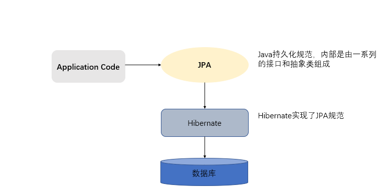
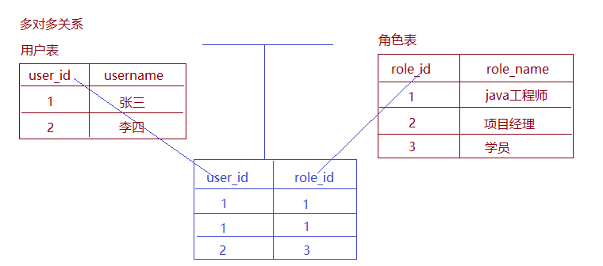

# 39-Spring Data JPA

# 1. ORM概述

ORM(Object-relational mapping)，即**对象关系映射**，是一种为了解决面向对象与关系数据库存在的互不匹配的现象的技术。也就是说，ORM是**通过使用描述对象和数据库之间映射的元数据（映射文件信息），将程序中的对象自动持久化到关系数据库中**。只要有一套程序能够做到建立对象与数据库的关联，操作对象就可以直接操作数据库数据，就可以说这套程序实现了ORM对象关系映射

简单的说：ORM就是建立实体类和数据库表之间的关系，从而达到操作实体类就相当于操作数据库表的目的。

**为什么使用ORM？**

当实现一个应用程序时（不使用O/R Mapping），我们可能会写特别多数据访问层的代码，从数据库保存数据、修改数据、删除数据，而这些代码都是重复的。而使用ORM则会大大减少重复性代码。对象关系映射（Object Relational Mapping，简称ORM），**主要实现程序对象到关系数据库数据的映射。**

**常见ORM框架**：Mybatis（ibatis）、Hibernate、Jpa

**优点：**

1、操作简单，挺高开发效率。

2、数据访问更抽象，更轻便

3、支持面向对象封装

**缺点：**

1、执行性能低，自动化进行关系数据库的映射需要消耗系统性能

2、在处理多表联查、where条件复杂之类的查询时，ORM的语法会变得复杂

3、开发思维容易固定化,

# 2. hibernate与JPA的概述

- hibernate概述

  Hibernate是一个开放源代码的对象关系映射框架，它对JDBC进行了非常轻量级的对象封装，它将POJO与数据库表建立映射关系，是一个全自动的orm框架，hibernate可以自动生成SQL语句，自动执行，使得Java程序员可以随心所欲的使用对象编程思维来操纵数据库。

- JPA概述：

  JPA的全称是Java Persistence API， 即Java 持久化API，是SUN公司推出的一套基于ORM的规范，内部是由一系列的接口和抽象类构成。

  JPA通过JDK 5.0注解描述对象－关系表的映射关系，并将运行期的实体对象持久化到数据库中。

**JPA的优势**

1. 标准化
   JPA 是 JCP 组织发布的 Java EE 标准之一，因此任何声称符合 JPA 标准的框架都遵循同样的架构，提供相同的访问API，这保证了基于JPA开发的企业应用能够经过少量的修改就能够在不同的JPA框架下运行。

2. 容器级特性的支持
   JPA框架中支持大数据集、事务、并发等容器级事务，这使得 JPA 超越了简单持久化框架的局限，在企业应用发挥更大的作用。

3. 简单方便
   JPA的主要目标之一就是提供更加简单的编程模型：在JPA框架下创建实体和创建Java 类一样简单，没有任何的约束和限制，只需要使用 javax.persistence.Entity进行注释，JPA的框架和接口也都非常简单，没有太多特别的规则和设计模式的要求，开发者可以很容易的掌握。JPA基于非侵入式原则设计，因此可以很容易的和其它框架或者容器集成

4. 查询能力
   JPA的查询语言是面向对象而非面向数据库的，它以面向对象的自然语法构造查询语句，可以看成是Hibernate HQL的等价物。JPA定义了独特的JPQL（Java Persistence Query Language），JPQL是EJB QL的一种扩展，它是针对实体的一种查询语言，操作对象是实体，而不是关系数据库的表，而且能够支持批量更新和修改、JOIN、GROUP BY、HAVING 等通常只有 SQL 才能够提供的高级查询特性，甚至还能够支持子查询。

5. 高级特性
   JPA 中能够支持面向对象的高级特性，如类之间的继承、多态和类之间的复杂关系，这样的支持能够让开发者最大限度的使用面向对象的模型设计企业应用，而不需要自行处理这些特性在关系数据库的持久化。

**JPA与hibernate的关系**

JPA规范本质上就是一种ORM规范，注意不是ORM框架——因为JPA并未提供ORM实现，它只是制订了一些规范，提供了一些编程的API接口，但具体实现则由服务厂商来提供实现。          



JPA和Hibernate的关系就像JDBC和JDBC驱动的关系，JPA是规范，Hibernate除了作为ORM框架之外，它也是一种JPA实现。JPA怎么取代Hibernate呢？JDBC规范可以驱动底层数据库吗？答案是否定的，也就是说，如果使用JPA规范进行数据库操作，底层需要hibernate作为其实现类完成数据持久化工作。

 

# 3.JPA入门案例

由于JPA是sun公司制定的API规范，所以我们不需要导入额外的JPA相关的jar包，只需要导入JPA的提供商的jar包。我们选择Hibernate作为JPA的提供商，所以需要导入Hibernate的相关jar包。

1. 创建maven工程，并导入相关坐标

   ```xml
   <properties>
       <project.build.sourceEncoding>UTF-8</project.build.sourceEncoding>
       <project.hibernate.version>5.0.7.Final</project.hibernate.version>
   </properties>
   
   <dependencies>
       <!-- junit -->
       <dependency>
           <groupId>junit</groupId>
           <artifactId>junit</artifactId>
           <version>4.12</version>
           <scope>test</scope>
       </dependency>
   
       <!-- hibernate对jpa的支持包 -->
       <dependency>
           <groupId>org.hibernate</groupId>
           <artifactId>hibernate-entitymanager</artifactId>
           <version>${project.hibernate.version}</version>
       </dependency>
   
       <!-- c3p0 -->
       <dependency>
           <groupId>org.hibernate</groupId>
           <artifactId>hibernate-c3p0</artifactId>
           <version>${project.hibernate.version}</version>
       </dependency>
   
       <!-- log日志 -->
       <dependency>
           <groupId>log4j</groupId>
           <artifactId>log4j</artifactId>
           <version>1.2.17</version>
       </dependency>
   
       <!-- Mysql and MariaDB -->
       <dependency>
           <groupId>mysql</groupId>
           <artifactId>mysql-connector-java</artifactId>
           <version>8.0.12</version>
       </dependency>
   </dependencies>
   ```

2. 创建客户的数据表

   ```sql
       /*创建客户表*/
       CREATE TABLE cst_customer (
         cust_id bigint(32) NOT NULL AUTO_INCREMENT COMMENT '客户编号(主键)',
         cust_name varchar(32) NOT NULL COMMENT '客户名称(公司名称)',
         cust_source varchar(32) DEFAULT NULL COMMENT '客户信息来源',
         cust_industry varchar(32) DEFAULT NULL COMMENT '客户所属行业',
         cust_level varchar(32) DEFAULT NULL COMMENT '客户级别',
         cust_address varchar(128) DEFAULT NULL COMMENT '客户联系地址',
         cust_phone varchar(64) DEFAULT NULL COMMENT '客户联系电话',
         PRIMARY KEY (`cust_id`)
       ) ENGINE=InnoDB AUTO_INCREMENT=1 DEFAULT CHARSET=utf8;
   ```

3. 创建客户实体类

   ```java
   package com.itcast.pojo;
   
   import javax.persistence.*;
   
   /**
    * 配置映射关系
    *  实体类和表的映射关系
    *  实体类的属性和表的字段之间的映射关系
    * @Class:spring_data_jpa.com.itcast.pojo.Customer
    * @Descript: 客户实体类
    * @Author:宋天
    * @Date:2020/8/13
    */
   @Entity //声明实体类
   @Table(name="cst_customer") //建立实体类和表的映射关系
   public class Customer {
   
       /**
        *	所有的注解都是使用JPA的规范提供的注解，
        *	所以在导入注解包的时候，一定要导入javax.persistence下的
        */
   
       /**
        * @GeneratedValue(strategy = GenerationType.AUTO) 配置主键的生成策略
        *  GenerationType.IDENTITY表示自增（数据库必须支持自动增长方式 mysql）
        *  GenerationType.SEQUENCE表示序列，（数据库必须支持序列 oracle）
        *  GenerationType.TABLE：jpa提供的一种机制，通过数据库表的形式帮助我们完成主键自增(相当于有专门的一张表存储下一次增长的id)
        *  GenerationType.AUTO：由程序自动帮助我们选择主键生成策略
        *
        */
       @Id//声明当前私有属性为主键
       @GeneratedValue(strategy= GenerationType.IDENTITY)
       @Column(name="cust_id") //指定和表中cust_id字段的映射关系，name值为字段名
       private Long custId;
   
       @Column(name="cust_name") //指定和表中cust_name字段的映射关系
       private String custName;
   
       @Column(name="cust_source")//指定和表中cust_source字段的映射关系
       private String custSource;
   
       @Column(name="cust_industry")//指定和表中cust_industry字段的映射关系
       private String custIndustry;
   
       @Column(name="cust_level")//指定和表中cust_level字段的映射关系
       private String custLevel;
   
       @Column(name="cust_address")//指定和表中cust_address字段的映射关系
       private String custAddress;
   
       @Column(name="cust_phone")//指定和表中cust_phone字段的映射关系
       private String custPhone;
   
   	// 省略get set toString方法
   }
   ```
   
   常用注解说明：
   
   ```
   @Entity
       作用：指定当前类是实体类。
   @Table
       作用：指定实体类和表之间的对应关系。
       属性：
   		name：指定数据库表的名称
   @Id
       作用：指定当前字段是主键。
   @GeneratedValue
       作用：指定主键的生成方式。。
       属性：
   		strategy ：指定主键生成策略。
   @Column
       作用：指定实体类属性和数据库表之间的对应关系
       属性：
           name：指定数据库表的列名称。
           unique：是否唯一  
           nullable：是否可以为空  
           inserttable：是否可以插入  
           updateable：是否可以更新  
           columnDefinition: 定义建表时创建此列的DDL  
           secondaryTable: 从表名。如果此列不建在主表上（默认建在主表），该属性定义该列所在从表的名字搭建开发环境[重点]
   ```
   
4. 配置JPA核心配置文件

   在maven工程的resources路径下创建一个名为META-INF的文件夹，在此文件夹下创建一个名为persistence.xml的配置文件

   ```xml
   <?xml version="1.0" encoding="UTF-8"?>
   <persistence xmlns="http://java.sun.com/xml/ns/persistence"
                xmlns:xsi="http://www.w3.org/2001/XMLSchema-instance"
                xsi:schemaLocation="http://java.sun.com/xml/ns/persistence
                                    http://java.sun.com/xml/ns/persistence/persistence_2_0.xsd"
                version="2.0">
   
       <!--    配置persistence-unit节点：持久化单元
           name：持久化单元名称，可随意
           transaction-type：事务管理的方式
               JTA：分布式事务管理
               RESOURCE_LOCAL：本地事务管理-->
       <persistence-unit name="myJpa" transaction-type="RESOURCE_LOCAL">
           <!--        jpa实现方式-->
           <provider>org.hibernate.jpa.HibernatePersistenceProvider</provider>
           <!--        数据库信息-->
   
           <!--        可选配置：配置jpa实现方的配置-->
           <properties>
               <!--            数据库信息
                   用户名，密码，驱动，数据库地址-->
               <!-- 数据库驱动 -->
               <property name="javax.persistence.jdbc.driver" value="com.mysql.cj.jdbc.Driver" />
               <!-- 数据库地址 -->
               <property name="javax.persistence.jdbc.url" value="jdbc:mysql://localhost:3306/jpa?useSSL=false&amp;serverTimezone=Asia/Shanghai&amp;allowPublicKeyRetrieval=true&amp;characterEncoding=UTF-8" />
               <!-- 数据库用户名 -->
               <property name="javax.persistence.jdbc.user" value="root" />
               <!-- 数据库密码 -->
               <property name="javax.persistence.jdbc.password" value="password" />
   
               <!--配置jpa实现方（hibernate）的配置信息
                       显示sql：false/true
                      
               -->
               <property name="hibernate.show_sql" value="true" />
               <property name="hibernate.format_sql" value="true" />
               <!--
   				 自动创建数据库表：hibernate.hbm2ddl.auto
                           create：程序运行时创建数据库表（如果有表，先删除在创建）
                           update：程序运行时创建数据库表（如果有表，不会创建表）
                           none：不会创建表
   			-->
               <property name="hibernate.hbm2ddl.auto" value="update" />
           </properties>
       </persistence-unit>
   </persistence>
   ```

5. 测试

   ```java
   //    测试jpa保存
   @Test
   public void testSave(){
       //        1. 加载配置文件创建工厂（实体管理类工厂）对象
       //        作用：根据持久化单元名称创建实体管理器工厂
       EntityManagerFactory factory = Persistence.createEntityManagerFactory("myJpa");
       //        2. 通过实体管理器工厂，创建实体管理器
       /**
            *  方法：createEntityManager，内部维护了很多内容
            *          维护了缓存信息
            *          维护了所有的实体管理器对象
            *          再创建EntityManagerFactory的过程中会根据配置创建数据库表
            *   EntityManagerFactory的创建过程比较浪费资源
            *      特点：线程安全对象
            *          多个线程同时访问一个EntityManagerFactory不会有线程安全问题
            *   如何解决EntityManagerFactory的创建过程浪费资源（耗时）问题
            *
            *   思路：创建一个公共的EntityManagerFactory对象
            *      静态代码快的形式创建EntityManagerFactory
            */
       EntityManager entityManager = factory.createEntityManager();
       //        3. 创建按事务对象，开启事务
       /**
            * EntityManager对象：实体类管理器
            *      getTransaction：创建事务对象
            *      persist：保存
            *      merge：更新
            *      remove：删除
            *      find/getReference：根据id查询
            *
            * EntityTransaction对象：事务
            *      begin：开启事务
            *      commit：提交事务
            *      rollback：回滚
            */
       EntityTransaction transaction = entityManager.getTransaction();
       transaction.begin(); // 开启事务
       //        4. 完成增删改查操作
   
       // 模拟数据
       Customer customer = new Customer();
       customer.setCustName("zhangsan");
       customer.setCustIndustry("it");
   
       // 保存操作
       entityManager.persist(customer);
   
       //        5. 提交事务（回滚事务）
       transaction.commit();
       //        6. 释放资源
       entityManager.close();
       factory.close();
   }
   ```

# 4.JPA中主键声明策略

通过annotation（注解）来映射hibernate实体的,基于annotation的hibernate主键标识为`@Id`, 其生成规则由`@GeneratedValue`设定的。这里的`@id`和`@GeneratedValue`都是JPA的标准用法。

JPA提供的四种标准用法为TABLE,SEQUENCE,IDENTITY,AUTO。

- IDENTITY:主键由数据库自动生成（主要是自动增长型）

  ```java
  @Id  
  @GeneratedValue(strategy = GenerationType.IDENTITY) 
  private Long custId;
  ```

- SEQUENCE：根据底层数据库的序列来生成主键，条件是数据库支持序列。

  ```java
  @Id  
  @GeneratedValue(strategy = GenerationType.SEQUENCE) 
  private Long custId;
  ```

- AUTO：主键由程序控制（自动选择某一种策略生成主键）

  ```java
  @Id  
  @GeneratedValue(strategy = GenerationType.AUTO)  
  private Long custId;
  ```

- TABLE：是jpa提供的一种机制，通过数据库表的形式帮助我们完成主键自增(相当于有专门的一张表存储下一次增长的id)

  ```java
  @Id  
  @GeneratedValue(strategy = GenerationType.TABLE)  
  private Long custId;
  ```

# 5. JPA的相关API

## 5.1 介绍

1. Persistence对象

   Persistence对象主要作用是用于获取EntityManagerFactory对象的 。通过调用该类的createEntityManagerFactory静态方法，并根据配置文件中持久化单元名称创建EntityManagerFactory。

   ```java
   //        1. 加载配置文件创建工厂（实体管理类工厂）对象
   //        作用：根据持久化单元名称创建实体管理器工厂
   EntityManagerFactory factory = Persistence.createEntityManagerFactory("myJpa");
   ```

2. EntityManagerFactory

   EntityManagerFactory 接口主要用来创建 EntityManager 实例

   ```java
   //        2. 通过实体管理器工厂，创建实体管理器
          /**
            *  方法：createEntityManager，内部维护了很多内容
            *          维护了缓存信息
            *          维护了所有的实体管理器对象
            *          再创建EntityManagerFactory的过程中会根据配置创建数据库表
            * 
            *   EntityManagerFactory的创建过程比较浪费资源
            *      特点：线程安全对象
            *          多个线程同时访问一个EntityManagerFactory不会有线程安全问题
            *   如何解决EntityManagerFactory的创建过程浪费资源（耗时）问题
            *
            *   思路：创建一个公共的EntityManagerFactory对象
            *      静态代码快的形式创建EntityManagerFactory
            */
   EntityManager entityManager = factory.createEntityManager();
   
   ```

3. EntityTransaction

   在 JPA 规范中, EntityTransaction是完成事务操作的核心对象，对于EntityTransaction在我们的java代码中承接的功能比较简单

   常用方法：

   ```
   begin：开启事务
   commit：提交事务
   rollback：回滚事务
   ```

   示例

   ```java
   //        3. 创建按事务对象，开启事务
       	/**
            * EntityManager对象：实体类管理器
            *      getTransaction：创建事务对象
            *      persist：保存
            *      merge：更新
            *      remove：删除
            *      find/getReference：根据id查询
            *
            * EntityTransaction对象：事务
            *      begin：开启事务
            *      commit：提交事务
            *      rollback：回滚
            */
   EntityTransaction transaction = entityManager.getTransaction();
   transaction.begin(); // 开启事务
   ```

4. EntityManager

   在 JPA 规范中, EntityManager是完成持久化操作的核心对象。实体类作为普通 java对象，只有在调用 EntityManager将其持久化后才会变成持久化对象。EntityManager对象在一组实体类与底层数据源之间进行 O/R 映射的管理。它可以用来管理和更新 Entity Bean, 根椐主键查找 Entity Bean, 还可以通过JPQL语句查询实体。

   我们可以通过调用EntityManager的方法完成获取事务，以及持久化数据库的操作

   常用方法：

   ```java
   	getTransaction : 获取事务对象
       persist ： 保存操作
       merge ： 更新操作
       remove ： 删除操作
       find/getReference ： 根据id查询
   ```

   示例

   ```java
   //        4. 完成增删改查操作
   
   // 模拟数据
   Customer customer = new Customer();
   customer.setCustName("zhangsan");
   customer.setCustIndustry("it");
   
   // 保存操作
   entityManager.persist(customer);
   ```

5. 提交事务并关闭资源

   ```java
   //        5. 提交事务（回滚事务）
   transaction.commit();
   //        6. 释放资源
   entityManager.close();
   factory.close();
   ```

## 5.2 工具类抽取

示例

```java
package com.itcast.utils;

import javax.persistence.EntityManager;
import javax.persistence.EntityManagerFactory;
import javax.persistence.Persistence;

/**
 * @Class:spring_data_jpa.com.itcast.utils.JpaUtils
 * @Descript:
 * @Author:宋天
 * @Date:2020/8/15
 */
public class JpaUtils {
    /**
     * 解决实体管理器工厂的浪费资源和耗时问题
     *  通过静态代码块的形式，当程序第一次访问此工具类时，创建一个公共能够的实体管理器工厂对象
     *
     *  执行流程：
     *      第一次访问getEntityManager方法时，经过静态代码块创建一个factory对象，再调用方法创建一个EntityManager对象对象
     *      第二次访问getEntityManager方法时，直接通过一个已经创建好的factory对象，再创建EntityManager对象
     *
     *  注意：此时，EntityManagerFactory对象是公共的，使用完成后不能关闭
     */
    private static EntityManagerFactory factory;
    // 静态代码块，初始化加载实体管理器工厂对象
    static{
        factory = Persistence.createEntityManagerFactory("myJpa");
    }


//    创建实体管理类
    public static EntityManager getEntityManager(){
        return factory.createEntityManager();
    }

}

```

测试：

```java
//    使用工具类进行保存测试
@Test
public void save2(){
    // 通过实体管理器工厂，创建实体管理器
    EntityManager entityManager = JpaUtils.getEntityManager();
    // 创建事务
    EntityTransaction transaction = entityManager.getTransaction();
    // 开启事务
    transaction.begin();


    // 模拟数据
    Customer customer = new Customer();
    customer.setCustName("zhangsan");
    customer.setCustIndustry("it");


    // 保存操作
    entityManager.persist(customer);

    // 提交事务
    transaction.commit();
    // 释放资源
    entityManager.close();

}
```

## 5.3 JPA的增删改查

### 5.3.1 保存

```java
//    使用自定义的工具类进行保存测试
@Test
public void save2(){
    // 通过实体管理器工厂，创建实体管理器
    EntityManager entityManager = JpaUtils.getEntityManager();
    // 创建事务
    EntityTransaction transaction = entityManager.getTransaction();
    // 开启事务
    transaction.begin();


    // 模拟数据
    Customer customer = new Customer();
    customer.setCustName("zhangsan");
    customer.setCustIndustry("it");


    // 保存操作
    entityManager.persist(customer);

    // 提交事务
    transaction.commit();
    // 释放资源
    entityManager.close();

}
```


### 5.3.2 修改

```java
//    修改测试
@Test
public void testUpdate(){
    // 通过自定义的工具类获取实体管理器对象
    EntityManager entityManager = JpaUtils.getEntityManager();
    // 创建事务
    EntityTransaction transaction = entityManager.getTransaction();
    // 开启事务
    transaction.begin();

    // 更新数据
    Customer customer = entityManager.find(Customer.class, 2L);
    customer.setCustName("itheima");
    entityManager.merge(customer);

    // 提交事务
    transaction.commit();
    //释放资源
    entityManager.close();
}
```


### 5.3.3 删除

```java
// 删除测试

@Test
public void testRemove(){
    // 通过自定义的工具类获取实体管理器对象
    EntityManager entityManager = JpaUtils.getEntityManager();
    // 创建事务
    EntityTransaction transaction = entityManager.getTransaction();
    // 开启事务
    transaction.begin();

    // 删除 根据查询出来的id进行删除
    Customer customer = entityManager.getReference(Customer.class, 1L);
    entityManager.remove(customer);

    // 提交事务
    transaction.commit();
    //释放资源
    entityManager.close();
}

```


### 5.3.4 根据ID查询

```java
//    使用工具类进行查询测试
/**
     * 根据ID查询有两个方法
     *  find
     *      特点：
     *          1. 查询的对象就是当前客户对象本身
     *          2. 再调用find方法的时候，就会发送sql语句查询数据库
     *  getReference
     *      特点：
     *          1. 获取的对象是一个动态代理对象
     *          2. 调用getReference方法不会立即发送sql语句查询数据库
     *              当调用查询结果对象的时候，才会发送查询的sql语句，什么时候用什么时候查询
     *          3. 也称为延迟加载（懒加载），什么时候用什么时候查询
     */

@Test
public void testFind(){
    // 通过自定义的工具类获取实体管理器对象
    EntityManager entityManager = JpaUtils.getEntityManager();
    // 创建事务对象
    EntityTransaction transaction = entityManager.getTransaction();
    // 开启事务
    transaction.begin();
    // 根据id查询  find
    Customer customer = entityManager.find(Customer.class, 1L);
    System.out.println(customer);
    // 提交事务
    transaction.commit();
    // 释放资源
    entityManager.close();
}

@Test
public void testGetReference(){
    //  通过自定义的工具类获取实体管理器对象
    EntityManager entityManager = JpaUtils.getEntityManager();
    // 创建事务
    EntityTransaction transaction = entityManager.getTransaction();
    // 开启事务
    transaction.begin();
    // 根据id查询 getReference
    Customer customer = entityManager.getReference(Customer.class, 1L);
    System.out.println(customer);
    // 提交事务
    transaction.commit();
    // 释放资源
    entityManager.close();

}
```

## 5.4 JPA的复杂查询JPQL

JPQL全称Java Persistence Query Language

基于首次在EJB2.0中引入的EJB查询语言(EJB QL)，Java持久化查询语言(JPQL)是一种可移植的查询语言，旨在以面向对象表达式语言的表达式，将SQL语法和简单查询语义绑定在一起，使用这种语言编写的查询是可移植的，可以被编译成所有主流数据库服务器上的SQL。

**其特征与原生SQL语句类似，并且完全面向对象，通过类名和属性访问，而不是表名和表的属性。**

### 5.4.1 查询全部

```java
@Test
public void testFindAll(){
    // 1. 通过工具类获取实体管理器对象
    EntityManager entityManager = JpaUtils.getEntityManager();
    // 2. 创建事务对象，并开启事务
    EntityTransaction transaction = entityManager.getTransaction();
    transaction.begin();
    // 3. 查询全部（正序）

    /**
         * 查询全部
         * jpql:from Customer
         * sql:select * from cst_customer
         */
    String jpql = "from Customer";
    Query query = entityManager.createQuery(jpql);
    // 将结果集封装为list集合
    List resultList = query.getResultList();
    System.out.println(resultList);
    // 4. 提交事务
    transaction.commit();

    // 5. 释放资源
    entityManager.close();
}
```

### 5.4.2 分页查询

```java
@Test
public void testFindAll4(){
    // 1. 通过工具类获取实体管理器对象
    EntityManager entityManager = JpaUtils.getEntityManager();
    // 2. 创建事务对象，并开启事务
    EntityTransaction transaction = entityManager.getTransaction();
    transaction.begin();
    // 3. 分页查询

    /**
         * 分页查询
         * jpql: from Customer
         * sql:select * from cst_customer limit ?,?
         *
         *  注意：sql语句中如果起始索引为0，是可以省略的
         */
    String jpql = "from Customer";
    Query query = entityManager.createQuery(jpql);
    //对参数赋值 -- 分页参数
    // 起始索引
    query.setFirstResult(0);
    // 每次查询的条数
    query.setMaxResults(2);

    // 封装结果集
    List resultList = query.getResultList();
    System.out.println(resultList);
    // 4. 提交事务
    transaction.commit();

    // 5. 释放资源
    entityManager.close();
}
```

### 5.4.3 条件查询

```java
@Test
public void testFindAll5(){
    // 1. 通过工具类获取实体管理器对象
    EntityManager entityManager = JpaUtils.getEntityManager();
    // 2. 创建事务对象，并开启事务
    EntityTransaction transaction = entityManager.getTransaction();
    transaction.begin();
    // 3. 条件查询

    /**
         * 条件查询
         * jpql:from Customer where custName like ?
         * sql:select * from cst_customer where cust_name like 'it%'
         *
         *  注意：sql语句中如果起始索引为0，是可以省略的
         */
    String jpql = "from Customer where custName like ?";
    Query query = entityManager.createQuery(jpql);
    //对参数进行赋值 参数：占位符索引，取值
    query.setParameter(1,"it%");
    // 封装结果集
    List resultList = query.getResultList();
    System.out.println(resultList);
    // 4. 提交事务
    transaction.commit();

    // 5. 释放资源
    entityManager.close();
}
```

### 5.4.4 排序查询

```java
@Test
public void testFindAll2(){
    // 1. 通过工具类获取实体管理器对象
    EntityManager entityManager = JpaUtils.getEntityManager();
    // 2. 创建事务对象，并开启事务
    EntityTransaction transaction = entityManager.getTransaction();
    transaction.begin();
    // 3. 查询全部（倒序）

    /**
         * 查询全部（倒序）
         * jpql:from Customer order by custId desc
         * sql:select * from cst_customer order by cust_id desc
         */
    String jpql = "from Customer order by custId desc";
    Query query = entityManager.createQuery(jpql);
    // 将结果集封装为list集合
    List resultList = query.getResultList();
    System.out.println(resultList);
    // 4. 提交事务
    transaction.commit();

    // 5. 释放资源
    entityManager.close();
}
```

### 5.4.5 统计查询

```java
@Test
public void testFindAll3(){
    // 1. 通过工具类获取实体管理器对象
    EntityManager entityManager = JpaUtils.getEntityManager();
    // 2. 创建事务对象，并开启事务
    EntityTransaction transaction = entityManager.getTransaction();
    transaction.begin();
    // 3. 查询全部（统计id）

    /**
         * 查询全部（统计id）
         * jpql:select count(custId) from Customer order by custId desc
         * sql:select count(*) from cst_customer
         */
    String jpql = "select count(custId) from Customer order by custId desc";
    Query query = entityManager.createQuery(jpql);
    // getSingleResult返回唯一的结果集
    Object singleResult = query.getSingleResult();
    System.out.println(singleResult);
    // 4. 提交事务
    transaction.commit();

    // 5. 释放资源
    entityManager.close();
}
```

# 6. Spring Data JPA

Spring Data JPA是较大的Spring Data系列的一部分，可轻松实现基于JPA的存储库。此模块处理对基于JPA的数据访问层的增强支持。它使构建使用数据访问技术的Spring支持的应用程序变得更加容易。

实现应用程序的数据访问层已经很长一段时间了。为了执行简单查询以及执行分页和审核，必须编写太多样板代码。Spring Data JPA旨在通过将工作量减少到实际需要的数量来显着改善数据访问层的实现。作为开发人员，您将编写包括自定义finder方法在内的存储库接口，Spring会自动提供实现。

Spring Data JPA 让我们解脱了DAO层的操作，基本上所有CRUD都可以依赖于它来实现,在实际的工作工程中，推荐使用Spring Data JPA + ORM（如：hibernate）完成操作，这样在切换不同的ORM框架时提供了极大的方便，同时也使数据库层操作更加简单，方便解耦

特征:

- 基于Spring和JPA构建存储库的先进支持
- 支持Querydsl谓词，从而支持类型安全的JPA查询
- 域类的透明审核
- 分页支持，动态查询执行，集成自定义数据访问代码的能力
- `@Query`引导时验证带注释的查询
- 支持基于XML的实体映射
- 通过引入基于JavaConfig的存储库配置`@EnableJpaRepositories`。

SpringData Jpa 极大简化了数据库访问层代码。 如何简化的呢？ **使用了SpringDataJpa，我们的dao层中只需要写接口，就自动具有了增删改查、分页查询等方法。**

**Spring Data JPA 与 JPA和hibernate之间的关系：**

JPA是一套规范，内部是有接口和抽象类组成的。hibernate是一套成熟的ORM框架，而且Hibernate实现了JPA规范，所以也可以称hibernate为JPA的一种实现方式，我们使用JPA的API编程，意味着站在更高的角度上看待问题（面向接口编程）

Spring Data JPA是Spring提供的一套对JPA操作更加高级的封装，是在JPA规范下的专门用来进行数据持久化的解决方案。

## 6.1 Spring Data JPA 的快速入门

需求：Spring Data JPA完成客户的基本CRUD操作

1. 导入坐标

   ```xml
   <properties>
       <spring.version>4.2.4.RELEASE</spring.version>
       <hibernate.version>5.0.7.Final</hibernate.version>
       <slf4j.version>1.6.6</slf4j.version>
       <log4j.version>1.2.12</log4j.version>
       <c3p0.version>0.9.1.2</c3p0.version>
       <mysql.version>5.1.6</mysql.version>
   </properties>
   
   <dependencies>
       <!-- junit单元测试 -->
       <dependency>
           <groupId>junit</groupId>
           <artifactId>junit</artifactId>
           <version>4.9</version>
           <scope>test</scope>
       </dependency>
   
       <!-- spring beg -->
       <dependency>
           <groupId>org.aspectj</groupId>
           <artifactId>aspectjweaver</artifactId>
           <version>1.6.8</version>
       </dependency>
   
       <dependency>
           <groupId>org.springframework</groupId>
           <artifactId>spring-aop</artifactId>
           <version>${spring.version}</version>
       </dependency>
   
       <dependency>
           <groupId>org.springframework</groupId>
           <artifactId>spring-context</artifactId>
           <version>${spring.version}</version>
       </dependency>
   
       <dependency>
           <groupId>org.springframework</groupId>
           <artifactId>spring-context-support</artifactId>
           <version>${spring.version}</version>
       </dependency>
   
       <dependency>
           <groupId>org.springframework</groupId>
           <artifactId>spring-orm</artifactId>
           <version>${spring.version}</version>
       </dependency>
   
       <dependency>
           <groupId>org.springframework</groupId>
           <artifactId>spring-beans</artifactId>
           <version>${spring.version}</version>
       </dependency>
   
       <dependency>
           <groupId>org.springframework</groupId>
           <artifactId>spring-core</artifactId>
           <version>${spring.version}</version>
       </dependency>
   
       <!-- spring end -->
   
       <!-- hibernate beg -->
       <dependency>
           <groupId>org.hibernate</groupId>
           <artifactId>hibernate-core</artifactId>
           <version>${hibernate.version}</version>
       </dependency>
       <dependency>
           <groupId>org.hibernate</groupId>
           <artifactId>hibernate-entitymanager</artifactId>
           <version>${hibernate.version}</version>
       </dependency>
       <dependency>
           <groupId>org.hibernate</groupId>
           <artifactId>hibernate-validator</artifactId>
           <version>5.2.1.Final</version>
       </dependency>
       <!-- hibernate end -->
   
       <!-- c3p0 beg -->
       <dependency>
           <groupId>c3p0</groupId>
           <artifactId>c3p0</artifactId>
           <version>${c3p0.version}</version>
       </dependency>
       <!-- c3p0 end -->
   
       <!-- log end -->
       <dependency>
           <groupId>log4j</groupId>
           <artifactId>log4j</artifactId>
           <version>${log4j.version}</version>
       </dependency>
   
       <dependency>
           <groupId>org.slf4j</groupId>
           <artifactId>slf4j-api</artifactId>
           <version>${slf4j.version}</version>
       </dependency>
   
       <dependency>
           <groupId>org.slf4j</groupId>
           <artifactId>slf4j-log4j12</artifactId>
           <version>${slf4j.version}</version>
       </dependency>
       <!-- log end -->
   
   
       <dependency>
           <groupId>mysql</groupId>
           <artifactId>mysql-connector-java</artifactId>
           <version>8.0.12</version>
       </dependency>
   
       <dependency>
           <groupId>org.springframework.data</groupId>
           <artifactId>spring-data-jpa</artifactId>
           <version>1.9.0.RELEASE</version>
       </dependency>
   
       <dependency>
           <groupId>org.springframework</groupId>
           <artifactId>spring-test</artifactId>
           <version>4.2.4.RELEASE</version>
       </dependency>
   
       <!-- el beg 使用spring data jpa 必须引入 -->
       <dependency>  
           <groupId>javax.el</groupId>  
           <artifactId>javax.el-api</artifactId>  
           <version>2.2.4</version>  
       </dependency>  
   
       <dependency>  
           <groupId>org.glassfish.web</groupId>  
           <artifactId>javax.el</artifactId>  
           <version>2.2.4</version>  
       </dependency> 
       <!-- el end -->
   </dependencies>
   
   ```

2. 整合Spring Data JPA 与 Spring

   配置jdbc.properties文件

   ```properties
   jdbc.driver=com.mysql.cj.jdbc.Driver
   jdbc.url=jdbc:mysql://localhost:3306/jpa?useSSL=false&serverTimezone=Asia/Shanghai&allowPublicKeyRetrieval=true&characterEncoding=UTF-8
   jdbc.username=root
   jdbc.password=password
   ```

   配置applicationContextConfig.xml文件

   ```xml
   <?xml version="1.0" encoding="UTF-8"?>
   <beans xmlns="http://www.springframework.org/schema/beans"
          xmlns:xsi="http://www.w3.org/2001/XMLSchema-instance" xmlns:aop="http://www.springframework.org/schema/aop"
          xmlns:context="http://www.springframework.org/schema/context"
          xmlns:jdbc="http://www.springframework.org/schema/jdbc" xmlns:tx="http://www.springframework.org/schema/tx"
          xmlns:jpa="http://www.springframework.org/schema/data/jpa" xmlns:task="http://www.springframework.org/schema/task"
          xsi:schemaLocation="
                              http://www.springframework.org/schema/beans http://www.springframework.org/schema/beans/spring-beans.xsd
                              http://www.springframework.org/schema/aop http://www.springframework.org/schema/aop/spring-aop.xsd
                              http://www.springframework.org/schema/context http://www.springframework.org/schema/context/spring-context.xsd
                              http://www.springframework.org/schema/jdbc http://www.springframework.org/schema/jdbc/spring-jdbc.xsd
                              http://www.springframework.org/schema/tx http://www.springframework.org/schema/tx/spring-tx.xsd
                              http://www.springframework.org/schema/data/jpa http://www.springframework.org/schema/data/jpa/spring-jpa.xsd">
   
       <!--    加载jdbc.properties文件-->
       <context:property-placeholder location="classpath:jdbc.properties"></context:property-placeholder>
   
       <!-- dataSource 配置数据库连接池-->
       <bean id="dataSource" class="com.mchange.v2.c3p0.ComboPooledDataSource">
           <property name="driverClass" value="${jdbc.driver}" />
           <property name="jdbcUrl" value="${jdbc.url}" />
           <property name="user" value="${jdbc.username}" />
           <property name="password" value="${jdbc.password}" />
       </bean>
   
       <!--    1. 创建entityManagerFactory对象交给spring容器管理-->
       <bean id="entityManagerFactory" class="org.springframework.orm.jpa.LocalContainerEntityManagerFactoryBean">
           <!--        注入数据源-->
           <property name="dataSource" ref="dataSource"></property>
           <!--        配置扫描的包（实体所在的包）-->
           <property name="packagesToScan" value="com.itcast.pojo"></property>
           <!--        配置jpa实现厂家-->
           <property name="persistenceProvider">
               <bean class="org.hibernate.jpa.HibernatePersistenceProvider"></bean>
           </property>
           <!--        配置jpa的供应商适配器-->
           <property name="jpaVendorAdapter">
               <bean class="org.springframework.orm.jpa.vendor.HibernateJpaVendorAdapter">
                   <!--                配置是否自动创建数据库-->
                   <property name="generateDdl" value="false"></property>
                   <!--                指定数据库-->
                   <property name="database" value="MYSQL"></property>
                   <!--                配置数据库方言，支持的特有语法-->
                   <property name="databasePlatform" value="org.hibernate.dialect.MySQLDialect"></property>
                   <!--                是否显示sql-->
                   <property name="showSql" value="true"></property>
               </bean>
           </property>
   
           <!--配置jpa方言：一些高级特性-->
           <property name="jpaDialect">
               <bean class="org.springframework.orm.jpa.vendor.HibernateJpaDialect" />
           </property>
   
           <!--        注入jpa配置信息
               加载jpa的基本配置信息和jpa实现方式（hibernate）的配置信息
               hibernate.hbm2ddl.auto：自动创建数据库表
                   create：每次都会重新创建数据库表
                   update：有表则不会重新创建，无表则会重新创建
   -->
           <property name="jpaProperties">
               <props>
                   <prop key="hibernate.hbm2ddl.auto">update</prop>
               </props>
           </property>
       </bean>
   
       <!--    2. 整合spring data jpa-->
       <jpa:repositories base-package="com.itcast.dao" transaction-manager-ref="transactionManager" entity-manager-factory-ref="entityManagerFactory"></jpa:repositories>
   
       <!--    3. 配置JPA事务管理器-->
       <bean id="transactionManager" class="org.springframework.orm.jpa.JpaTransactionManager">
           <property name="entityManagerFactory" ref="entityManagerFactory" />
       </bean>
   
       <!--    4. 配置声明式事务-->
   
       <!--    5. 配置包扫描-->
       <context:component-scan base-package="com.itcast"></context:component-scan>
   </beans>
   ```

3. 使用JPA注解配置映射关系

   创建实体类Customer

   ```java
   package com.itcast.pojo;
   
   import javax.persistence.*;
   
   /**
    * 配置映射关系
    *  实体类和表的映射关系
    *  实体类的属性和表的字段之间的映射关系
    * @Class:spring_data_jpa.com.itcast.pojo.Customer
    * @Descript: 客户实体类
    * @Author:宋天
    * @Date:2020/8/13
    */
   @Entity //声明实体类
   @Table(name="cst_customer") //建立实体类和表的映射关系
   public class Customer {
   
       /**
        *	所有的注解都是使用JPA的规范提供的注解，
        *	所以在导入注解包的时候，一定要导入javax.persistence下的
        */
   
       /**
        * strategy 配置主键的生成策略
        *  GenerationType.IDENTITY表示自增（数据库必须支持自动增长方式 mysql）
        *  GenerationType.SEQUENCE表示序列，（数据库必须支持序列 oracle）
        *  GenerationType.TABLE：jpa提供的一种机制，通过数据库表的形式帮助我们完成主键自增(相当于有专门的一张表存储下一次增长的id)
        *  GenerationType.AUTO：由程序自动帮助我们选择主键生成策略
        *
        */
       @Id//声明当前私有属性为主键
       @GeneratedValue(strategy= GenerationType.AUTO)
       @Column(name="cust_id") //指定和表中cust_id字段的映射关系，name值为字段名
       private Long custId;
   
       @Column(name="cust_name") //指定和表中cust_name字段的映射关系
       private String custName;
   
       @Column(name="cust_source")//指定和表中cust_source字段的映射关系
       private String custSource;
   
       @Column(name="cust_industry")//指定和表中cust_industry字段的映射关系
       private String custIndustry;
   
       @Column(name="cust_level")//指定和表中cust_level字段的映射关系
       private String custLevel;
   
       @Column(name="cust_address")//指定和表中cust_address字段的映射关系
       private String custAddress;
   
       @Column(name="cust_phone")//指定和表中cust_phone字段的映射关系
       private String custPhone;
   
    	// 省略get set toString方法
   }
   ```
   
4. 编写dao接口

   Spring Data JPA是spring提供的一款对于数据访问层（Dao层）的框架，使用Spring Data JPA，只需要按照框架的规范提供dao接口，不需要实现类就可以完成数据库的增删改查、分页查询等方法的定义，极大的简化了我们的开发过程。

   在Spring Data JPA中，对于定义符合规范的Dao层接口，我们只需要遵循以下几点就可以了：

   1. 创建一个Dao层接口，并实现JpaRepository和JpaSpecificationExecutor
   2. 提供相应的泛型

   ```java
   /**
    * 符合SpringDataJpa的dao接口规范：需要继承两个接口
    *      JpaRepository<操作的实体类类型，实体类中主键属性的类型>
    *          * 封装了基本的CRUD（增删改查）操作
    *      JpaSpecificationExecutor<操作的实体类类型>
    *          * 封装了复杂查询（分页）
    */
   public interface CustomerDao extends JpaRepository<Customer, Long>, JpaSpecificationExecutor<Customer> {
   
   }
   ```
   
5. 测试CRUD操作

   ```java
   @RunWith(SpringJUnit4ClassRunner.class)
   @ContextConfiguration(locations = "classpath:applicationContextConfig.xml")
   public class CustomerDaoTest {
       @Autowired
       private CustomerDao customerDao;
   
       @Test
       public void testFindOne(){
           //        根据id查询
           Customer customer = customerDao.findOne(3L);
           System.out.println(customer);
       }
       @Test
       public void testSave(){
           /**
            * save : 保存或者更新
            *      根据传递的对象是否存在主键id
            *          * 如果没有主键ID，则保存
            *          * 如果存在主键ID属性，则根据ID值更新数据
            *
            *      返回被保存或者更新的数据
            */
           Customer customer1 = new Customer();
           customer1.setCustId(2L);
           customer1.setCustName("啦啦啦");
           Customer customer = customerDao.save(customer1);
           System.out.println(customer);
       }
   
       @Test
       public void testDelete(){
           //        根据id删除数据
           customerDao.delete(2L);
       }
   
       @Test
       public void testFindAll(){
           //      查询全部
           List<Customer> customerList = customerDao.findAll();
           System.out.println(customerList);
       }
   
       @Test
       public void testCount(){
           //        统计
           long count = customerDao.count();
           System.out.println(count);
       }
   
       @Test
       public void testExists(){
           //        根据id查询数据是否存在
           boolean exists = customerDao.exists(2L);
           System.out.println(exists);
       }
   
       @Test
       @Transactional
       public void testGetOne(){
           //        根据id获取一条数据
   
           /**
            * findOne：
            *      底层：em.find()    ：立即加载
            * getOne：
            *      底层：em.getOne()  ：懒加载
            *      返回的是一个客户的动态代理对象，什么时候用，什么时候加载
            */
           Customer customer = customerDao.getOne(2L);
           System.out.println(customer);
       }
   }
   
   ```
   
   

## 6.2 入门案例深入解析

通过上述入门案例我们已经对Spring Data JPA有了一定的了解，接下来我们深入探索

### 6.2.1 核心概念

Spring Data存储库抽象中的中央接口是`Repository`。它需要域类以及域类的ID类型作为类型参数来进行管理。该接口主要用作标记接口，以捕获要使用的类型并帮助您发现扩展该接口的接口。该`CrudRepository`规定对于正在管理的实体类复杂的CRUD功能。

**入门案例中使用的基本都是JpaRepository中的方法**

入门案例中的继承关系：

```java
public interface CustomerDao extends JpaRepository<Customer, Long>
    |
	|
public interface JpaRepository<T, ID extends Serializable> extends PagingAndSortingRepository<T, ID> 
    |
    |
public interface PagingAndSortingRepository<T, ID extends Serializable> extends CrudRepository<T, ID> 
    |
    |
public interface CrudRepository<T, ID extends Serializable> extends Repository<T, ID> 
    |
    |
public interface Repository<T, ID extends Serializable> // 中央接口

```

`CrudRepository`界面：

```java
@NoRepositoryBean
public interface CrudRepository<T, ID extends Serializable> extends Repository<T, ID> {
    <S extends T> S save(S var1); // 保存给定的实体。

    <S extends T> Iterable<S> save(Iterable<S> var1);

    T findOne(ID var1); //  根据id查询数据

    boolean exists(ID var1); // 根据id判断数据是否存在

    Iterable<T> findAll();

    Iterable<T> findAll(Iterable<ID> var1);

    long count(); // 	返回实体数。

    void delete(ID var1); // 删除给定的实体

    void delete(T var1);

    void delete(Iterable<? extends T> var1);

    void deleteAll();
}
```

在之上`CrudRepository`，有一个`PagingAndSortingRepository`抽象，它添加了其他方法来简化对实体的分页访问：

```java
@NoRepositoryBean
public interface PagingAndSortingRepository<T, ID extends Serializable> extends CrudRepository<T, ID> {
    Iterable<T> findAll(Sort var1);

    Page<T> findAll(Pageable var1);
}
```

### 6.2.2 查询方法

标准CRUD功能存储库通常在基础数据存储上进行查询。使用Spring Data，声明这些查询将分为四个步骤：

1. 声明扩展存储库的接口或其子接口之一，然后将其键入到它应处理的域类和ID类型，如以下示例所示：

   ```java
   public interface CustomerDao extends JpaRepository<Customer, Long>, JpaSpecificationExecutor<Customer> {}
   ```

2. 在接口上声明查询方法。

   ```java
   public interface CustomerDao extends JpaRepository<Customer, Long>, JpaSpecificationExecutor<Customer> {
   
   }
   ```

3. 设置Spring 核心配置文件或者配置类

   - xml配置文件

     ```xml
     <?xml version="1.0" encoding="UTF-8"?>
     <beans xmlns="http://www.springframework.org/schema/beans"
            xmlns:xsi="http://www.w3.org/2001/XMLSchema-instance"
            xmlns:jpa="http://www.springframework.org/schema/data/jpa"
            xsi:schemaLocation="http://www.springframework.org/schema/beans
                                https://www.springframework.org/schema/beans/spring-beans.xsd
                                http://www.springframework.org/schema/data/jpa
                                https://www.springframework.org/schema/data/jpa/spring-jpa.xsd">
     
         <!--    加载jdbc.properties文件-->
         <context:property-placeholder location="classpath:jdbc.properties"></context:property-placeholder>
     
         <!-- dataSource 配置数据库连接池-->
         <bean id="dataSource" class="com.mchange.v2.c3p0.ComboPooledDataSource">
             <property name="driverClass" value="${jdbc.driver}" />
             <property name="jdbcUrl" value="${jdbc.url}" />
             <property name="user" value="${jdbc.username}" />
             <property name="password" value="${jdbc.password}" />
         </bean>
     
         <!--    1. 创建entityManagerFactory对象交给spring容器管理-->
         <bean id="entityManagerFactory" class="org.springframework.orm.jpa.LocalContainerEntityManagerFactoryBean">
             <!--        注入数据源-->
             <property name="dataSource" ref="dataSource"></property>
             <!--        配置扫描的包（实体所在的包）-->
             <property name="packagesToScan" value="com.itcast.pojo"></property>
             <!--        配置jpa实现厂家-->
             <property name="persistenceProvider">
                 <bean class="org.hibernate.jpa.HibernatePersistenceProvider"></bean>
             </property>
             <!--        配置jpa的供应商适配器-->
             <property name="jpaVendorAdapter">
                 <bean class="org.springframework.orm.jpa.vendor.HibernateJpaVendorAdapter">
                     <!--                配置是否自动创建数据库-->
                     <property name="generateDdl" value="false"></property>
                     <!--                指定数据库-->
                     <property name="database" value="MYSQL"></property>
                     <!--                配置数据库方言，支持的特有语法-->
                     <property name="databasePlatform" value="org.hibernate.dialect.MySQLDialect"></property>
                     <!--                是否显示sql-->
                     <property name="showSql" value="true"></property>
                 </bean>
             </property>
     
             <!--配置jpa方言：一些高级特性-->
             <property name="jpaDialect">
                 <bean class="org.springframework.orm.jpa.vendor.HibernateJpaDialect" />
             </property>
             
             <!--        注入jpa配置信息
                 加载jpa的基本配置信息和jpa实现方式（hibernate）的配置信息
                 hibernate.hbm2ddl.auto：自动创建数据库表
                     create：每次都会重新创建数据库表
                     update：有表则不会重新创建，无表则会重新创建
     -->
             <property name="jpaProperties">
                 <props>
                     <prop key="hibernate.hbm2ddl.auto">update</prop>
                 </props>
             </property>
         </bean>
     
         <!--    2. 整合spring data jpa-->
         <jpa:repositories base-package="com.itcast.dao" transaction-manager-ref="transactionManager" entity-manager-factory-ref="entityManagerFactory"></jpa:repositories>
     
         <!--    3. 配置JPA事务管理器-->
         <bean id="transactionManager" class="org.springframework.orm.jpa.JpaTransactionManager">
             <property name="entityManagerFactory" ref="entityManagerFactory" />
         </bean>
     
         <!--    4. 配置声明式事务-->
     
         <!--    5. 配置包扫描-->
         <context:component-scan base-package="com.itcast"></context:component-scan>
     
     
     </beans>
     ```

   - 配置类

     ```java
     import org.springframework.data.jpa.repository.config.EnableJpaRepositories;
     
     @EnableJpaRepositories
     class Config { … }
     ```

4. 注入并使用

   ```java
   @RunWith(SpringJUnit4ClassRunner.class)
   @ContextConfiguration(locations = "classpath:applicationContextConfig.xml")
   public class CustomerDaoTest {
       @Autowired
       private CustomerDao customerDao;
   
       @Test
       public void testFindOne(){
   //        根据id查询
           Customer customer = customerDao.findOne(3L);
           System.out.println(customer);
       }
   }
   ```

### 6.3.3 相关CRUD方法

说明：这些方法都是已经被其他接口实现了的，直接使用即可。

- findOne：根据id查询

  ```java
  T findOne(ID var1);
  ```

  ```java
  @Test
  public void testFindOne(){
      //        根据id查询
      Customer customer = customerDao.findOne(3L);
      System.out.println(customer);
  }
  ```

- save：保存或者更新

  ```java
  <S extends T> S save(S var1);
  ```

  ```java
  @Test
  public void testSave(){
      	/**
           * save : 保存或者更新
           *      根据传递的对象是否存在主键id
           *          如果没有主键ID，则保存
           *          如果存在主键ID属性，则根据ID查询数据
           *
           *      返回被保存或者更新的数据
           */
      Customer customer1 = new Customer();
      customer1.setCustId(2L);
      customer1.setCustName("啦啦啦");
      Customer customer = customerDao.save(customer1);
      System.out.println(customer);
  }
  ```

- delete

  ```java
  void delete(ID var1);
  ```

  ```java
  @Test
  public void testDelete(){
      //        根据id删除数据
      customerDao.delete(2L);
  }
  ```

- findAll

  ```java
  List<T> findAll();
  ```

  ```java
  @Test
  public void testFindAll(){
      //      查询全部
      List<Customer> customerList = customerDao.findAll();
      System.out.println(customerList);
  }
  ```

- count

  ```java
  long count();
  ```

  ```java
  @Test
  public void testCount(){
      //        统计
      long count = customerDao.count();
      System.out.println(count);
  }
  ```

- exists

  ```java
  boolean exists(ID var1);
  ```

  ```java
  @Test
  public void testExists(){
      //        根据id查询数据是否存在
      boolean exists = customerDao.exists(2L);
      System.out.println(exists);
  }
  ```

- getOne

  ```java
  T getOne(ID var1);
  ```

  ```java
  @Test
  @Transactional // 需要配置事务
  public void testGetOne(){
      //        根据id获取一条数据
  
      /**
           * findOne：
           *      底层：em.find()    ：立即加载
           * getOne：
           *      底层：em.getOne()  ：懒加载
           *      返回的是一个客户的动态代理对象，什么时候用，什么时候加载
           */
      Customer customer = customerDao.getOne(2L);
      System.out.println(customer);
  }
  ```

  

# 7. Spring Data JPA的查询方式

在继承JpaRepository，和JpaSpecificationExecutor接口后,我们就可以使用接口中定义的方法进行查询

## 7.1 接口定义查询

- 继承JpaRepository后的方法列表

  ```java
  public interface JpaRepository<T, ID extends Serializable> extends PagingAndSortingRepository<T, ID> {
      List<T> findAll();
  
      List<T> findAll(Sort var1);
  
      List<T> findAll(Iterable<ID> var1);
  
      <S extends T> List<S> save(Iterable<S> var1);
  
      void flush();
  
      <S extends T> S saveAndFlush(S var1);
  
      void deleteInBatch(Iterable<T> var1);
  
      void deleteAllInBatch();
  
      T getOne(ID var1);
  }
  ```

- 继承JpaSpecificationExecutor的方法列表

  ```java
  public interface JpaSpecificationExecutor<T> {
      T findOne(Specification<T> var1);
  
      List<T> findAll(Specification<T> var1);
  
      Page<T> findAll(Specification<T> var1, Pageable var2);
  
      List<T> findAll(Specification<T> var1, Sort var2);
  
      long count(Specification<T> var1);
  }
  ```

以上内容不再进行示例，因为入门案例采用的就是这种方式

## 7.2 JPQL方式查询

使用Spring Data JPA提供的查询方法已经可以解决大部分的应用场景，但是对于某些业务来说，我们还需要灵活的构造查询条件，这时就可以使用`@Query`注解，结合JPQL的语句方式完成查询

`@Query `注解的使用非常简单，只需在方法上面标注该注解，同时提供一个JPQL查询语句即可

```java
/**
 * 符合SpringDataJpa的dao接口规范：
 *      JpaRepository<操作的实体类类型，实体类中主键属性的类型>
 *          * 封装了基本的CRUD（增删改查）操作
 *      JpaSpecificationExecutor<操作的实体类类型>
 *          * 封装了复杂查询（分页）
 */
public interface CustomerDao extends JpaRepository<Customer, Long>, JpaSpecificationExecutor<Customer> {

//    根据name查询数据，注意：jpql查询的是实体类，而不是数据库，可能会查询出多条数据
    @Query(value = "from Customer where custName = ?")
    Customer findCustomerByName(String name);

//    根据name和id查询数据：注意：参数类型要和实体类属性匹配
//    对于多个占位符，赋值的时候，默认情况下，占位符的位置需要和方法参数中的位置保持一致

   @Query("from Customer where custName = ? and custId = ?")
    Customer findCustomerByNameAndId(String name,Long id);

//    可以指定占位符参数的位置，通过?+索引的方式，指定此占位符的取值来源
    @Query("from Customer where custName = ?2 and custId = ?1")
    Customer findCustomerByNameAndId2(Long id,String name);

    @Query("update Customer set custName = ? where custId = ?") // 代表进行查询操作，如果需要更新操作需要声明
    @Modifying // 表示当前指定的是一个更新操作
    void updateCustomer(String custName,long id);
}

```

测试

```java
@RunWith(SpringJUnit4ClassRunner.class)
@ContextConfiguration(locations = "classpath:applicationContextConfig.xml")
public class CustomerDaoJPATest {

    @Autowired
    private CustomerDao customerDao;

    @Test
    public void findCustomerByNameTest(){
        Customer customer = customerDao.findCustomerByName("zhangsan");
        System.out.println(customer);
    }

    @Test
    public void findCustomerByNameAndIdTest(){
//        Customer customer = customerDao.findCustomerByNameAndId("zhangsan",3L);
        Customer customer = customerDao.findCustomerByNameAndId2(3L,"zhangsan");
        System.out.println(customer);
    }

    @Test
    @Transactional // 进行update/delete操作时必须配置事务
    @Rollback(false) // 设置是否自动回滚，默认自动回滚
    public void updateCustomerTest(){
        /**
         * springDataJpa中使用jpql完成 update/delete操作
         *      必须手动添加事务支持
         *      默认会执行结束后，回滚事务
         */
        customerDao.updateCustomer("lisi111",4L);
    }
}

```

## 7.3 SQL语句方式查询

Spring Data JPA同样也支持sql语句的查询，如下：

```java
package com.itcast.dao;

import com.itcast.pojo.Customer;
import org.springframework.data.jpa.repository.*;
import org.springframework.transaction.annotation.Transactional;

import java.util.List;

/**
 * @Class:spring_data_jpa.com.itcast.dao.CustomerDao
 * @Descript:
 * @Author:宋天
 * @Date:2020/8/16
 */

/**
 * 符合SpringDataJpa的dao接口规范：
 *      JpaRepository<操作的实体类类型，实体类中主键属性的类型>
 *          * 封装了基本的CRUD（增删改查）操作
 *      JpaSpecificationExecutor<操作的实体类类型>
 *          * 封装了复杂查询（分页）
 */
public interface CustomerDao extends JpaRepository<Customer, Long>, JpaSpecificationExecutor<Customer> {

    /**
     * 使用sql形式查询，
     * @Query：配置sql查询
     *      value：sql语句
     *      nativeQuery：查询方式
     *          true：sql查询
     *          false：jpql查询（默认）
     *
     * @return
     */
    @Query(value = "select * from cst_customer",nativeQuery=true)
    List<Customer> findSql();
}

```

测试

```java
@RunWith(SpringJUnit4ClassRunner.class)
@ContextConfiguration(locations = "classpath:applicationContextConfig.xml")
public class CustomerDaoJPATest {

    @Autowired
    private CustomerDao customerDao;

    @Test
    public void testFindAllSql(){
        List<Customer> customerList = customerDao.findSql();
        System.out.println(customerList);
    }
}
```


## 7.4 方法命名规则查询

顾名思义，方法命名规则查询就是根据方法的名字，就能创建查询。只需要按照Spring Data JPA提供的方法命名规则定义方法的名称，就可以完成查询工作。Spring Data JPA在程序执行的时候会根据方法名称进行解析，并自动生成查询语句进行查询

按照Spring Data JPA 定义的规则，查询方法以findBy开头，涉及条件查询时，条件的属性用条件关键字连接，要注意的是**：条件属性首字母需大写**。框架在进行方法名解析时，会先把方法名多余的前缀截取掉，然后对剩下部分进行解析。

 

```java
package com.itcast.dao;

import com.itcast.pojo.Customer;
import org.springframework.data.jpa.repository.*;
import org.springframework.transaction.annotation.Transactional;

import java.util.List;

/**
 * @Class:spring_data_jpa.com.itcast.dao.CustomerDao
 * @Descript:
 * @Author:宋天
 * @Date:2020/8/16
 */

/**
 * 符合SpringDataJpa的dao接口规范：
 *      JpaRepository<操作的实体类类型，实体类中主键属性的类型>
 *          * 封装了基本的CRUD（增删改查）操作
 *      JpaSpecificationExecutor<操作的实体类类型>
 *          * 封装了复杂查询（分页）
 */
public interface CustomerDao extends JpaRepository<Customer, Long>, JpaSpecificationExecutor<Customer> {
    
    /**
     *  方法名的约定
     *      findBy：查询
     *          对象中的属性名（首字母大写）：查询的条件
     *      eg：findByCustName  -- 根据name查询
     *
     *      再SpringDataJpa的运行阶段，会根据方法名称能够进行解析
     *           findBy开头：代表查询
     *              对象中的属性名（首字母大写）
     *
     */

    Customer findByCustName(String name);

    /**
     * 模糊查询
     * findBy + 属性名称（根据属性名称进行匹配查询）
     * findBy + 属性名称 + “查询方式（Like | isnull）”
     */
    List<Customer> findByCustNameLike(String name);

    /**
     * 多条件查询
     *  findBy + 属性名 + “查询方式” + “多条见的连接符（and | or）
     *
     *  注意：多条件查询的时候，方法参数顺序需要和查询条件的顺序保持一致
     */
    List<Customer> findByCustNameLikeAndCustIndustry(String custName,String custIndustry);
}

```

测试

```java
@RunWith(SpringJUnit4ClassRunner.class)
@ContextConfiguration(locations = "classpath:applicationContextConfig.xml")
public class CustomerDaoJPATest {

    @Autowired
    private CustomerDao customerDao;


    @Test
    public void testFindByCustName(){
        Customer lisi = customerDao.findByCustName("zhangsan");
        System.out.println(lisi);
    }

    @Test
    public void testFindByCustName2(){
        List<Customer> lisi = customerDao.findByCustNameLike("lisi%");
        System.out.println(lisi);
    }

    @Test
    public void testFindByCustName3(){
        List<Customer> customer = customerDao.findByCustNameLikeAndCustIndustry("lisi%","it");
        System.out.println(customer);
    }
}

```


# 8. Specifications动态查询

## 8.1 基本概念

有时我们在查询某个实体的时候，给定的条件是不固定的，这时就需要动态构建相应的查询语句，在Spring Data JPA中可以通过JpaSpecificationExecutor接口查询。**相比JPQL,其优势是类型安全，更加的面向对象。**

```java
/**
 *	JpaSpecificationExecutor中定义的方法
 **/
public interface JpaSpecificationExecutor<T> {
    //根据条件查询一个对象
    T findOne(Specification<T> var1);
	//根据条件查询集合
    List<T> findAll(Specification<T> var1);
	//根据条件分页查询
    Page<T> findAll(Specification<T> var1, Pageable var2);
    //根据条件分页查询，排序查询结果
    List<T> findAll(Specification<T> var1, Sort var2);
    //统计查询
    long count(Specification<T> var1);
}
```

对于JpaSpecificationExecutor，这个接口基本是围绕着Specification接口来定义的。我们可以简单的理解为，**Specification构造的就是查询条件。**

Specification接口中只定义了如下一个方法：

```java
//构造查询条件
	/**
    *	Root	：Root接口，代表查询的根对象，可以通过root获取实体中的属性
    *	CriteriaQuery	：代表一个顶层查询对象，用来自定义查询
    *	CriteriaBuilder		：用来构建查询，此对象里有很多条件方法
    **/
public interface Specification<T> {
    Predicate toPredicate(Root<T> var1, CriteriaQuery<?> var2, CriteriaBuilder var3);
}
```

## 8.2 使用Specifications完成条件查询

接口类

```java
/**
 * 符合SpringDataJpa的dao接口规范：
 *      JpaRepository<操作的实体类类型，实体类中主键属性的类型>
 *          * 封装了基本的CRUD（增删改查）操作
 *      JpaSpecificationExecutor<操作的实体类类型>
 *          * 封装了复杂查询（分页）
 */
public interface CustomerDao extends JpaRepository<Customer, Long>, JpaSpecificationExecutor<Customer> {
    
}

```

测试类

```java
@RunWith(SpringJUnit4ClassRunner.class)
@ContextConfiguration(locations = "classpath:applicationContextConfig.xml")
public class specTest {

    @Autowired
    private CustomerDao customerDao;

    //    测试单条件查询
    @Test
    public void testFindOne(){

        // 匿名内部类
        /**
         * 自定义查询条件
         *      1. 实现Specification接口（提供泛型：查询的对象类型）
         *      2. 实现toPredicate方法（构造查询条件）
         *      3. 借助方法参数中的两个参数
         *          * root：获取需要查询的对象属性
         *          * CriteriaBuilder：构造查询条件的，内部封装了很多的查询条件（模糊匹配，精准匹配）
         *          * CriteriaQuery：代表一个顶层查询对象，用来自定义查询（了解）
         */
        Specification<Customer> spec = new Specification<Customer>() {
            @Override
            public Predicate toPredicate(Root<Customer> root, CriteriaQuery<?> criteriaQuery, CriteriaBuilder criteriaBuilder) {
                // 1. 获取比较的属性
                Path<Object> custName = root.get("custName");
                // 2. 构造查询条件  select * from cst_customer where cust_name = "lisi"
                Predicate predicate = criteriaBuilder.equal(custName, "lisi");// 进行精准匹配  参数：（比较的属性，比较的属性的取值）

                return predicate;
            }
        };
        /**
         * 案例：根据客户名称查询
         *      查询条件
         *          1. 查询方式
         *              CriteriaBuilder对象
         *          2. 比较的属性名称
         *              root对象
         */
        Customer customer = customerDao.findOne(spec);
        System.out.println(customer);
    }

    //    测试多条件查询
    @Test
    public void testFindOne2(){
        /**
         * root 获取属性
         *     客户名
         *     客户所属行业
         *
         * CriteriaBuilder：构造查询
         *      1. 构造客户名的精准匹配查询
         *      2. 构造所属行业的精准匹配查询
         *      3. 将以上两个条件联系起来
         */
        Specification spec = new Specification() {
            @Override
            public Predicate toPredicate(Root root, CriteriaQuery criteriaQuery, CriteriaBuilder criteriaBuilder) {
                Path custName = root.get("custName");
                Path custIndustry = root.get("custIndustry");

                Predicate p1 = criteriaBuilder.equal(custName, "zhangsan");
                Predicate p2 = criteriaBuilder.equal(custIndustry, "it");

                // 联合多个查询条件查询（与的关系）
                Predicate predicate = criteriaBuilder.and(p1, p2);
                //                以或的形式拼接多个查询条件
                //                criteriaBuilder.or();

                return predicate;
            }
        };
        Customer customer = customerDao.findOne(spec);
        System.out.println(customer);
    }

    /**
     * 根据客户名称的模糊匹配，返回客户列表
     *      equal：直接得到的path对象（属性），然后进行比较即可
     *      gt,lt,ge,le,like...：得到path对象，根据path指定比较的参数类型，再去进行比较
     *
     *  指定参数类型：path.as(类型的字节码对象)
     */
    @Test
    public void testLike(){
        Specification specification = new Specification() {
            @Override
            public Predicate toPredicate(Root root, CriteriaQuery criteriaQuery, CriteriaBuilder criteriaBuilder) {
                // 获取实体类属性
                Path custName = root.get("custName");
                // 模糊查询
                // 无法直接通过path对象进行模糊查询，需要指定比较的参数类型  path.as(类型的字节码对象)
                Predicate predicate = criteriaBuilder.like(custName.as(String.class), "lisi%");
                return predicate;
            }
        };

        List<Customer> customerAll = customerDao.findAll(specification);
        System.out.println(customerAll);

        // 添加排序
        // 参数：排序的顺序，排序的属性名
        Sort sort = new Sort(Sort.Direction.DESC,"custId");
        List list = customerDao.findAll(specification, sort);
        System.out.println("排序后: " + list);
    }

}

```

## 8.3 基于Specifications的分页查询

```java
@RunWith(SpringJUnit4ClassRunner.class)
@ContextConfiguration(locations = "classpath:applicationContextConfig.xml")
public class specTest {

    @Autowired
    private CustomerDao customerDao;
    /**
     * 分页查询
     *   Page<T> findAll(Specification<T> var1, Pageable var2);
     *      Specification：查询条件
     *      Pageable：分页参数
     *
     *   分页参数：查询的页码，每页查询的条数
     *          Page<T> findAll(Pageable var1); 无条件的分页
     *          Page<T> findAll(Specification<T> var1, Pageable var2); 带有条件的分页
     *
     *      返回Page对象：是SpringDataJPA封装好的pageBean对象，数据列表，共条数
     *
     */
    @Test
    public void testFindAll(){

        //PageRequest对象是Pageable接口的实现类对象，参数：page：查询的页数（从0开始），size：每页查询的数量
        Pageable pageable = new PageRequest(0,2);
        Page<Customer> all = customerDao.findAll(pageable);

        List<Customer> content = all.getContent(); // 得到数据集合列表
        System.out.println(content);

        System.out.println(all.getTotalElements()); //得到总条数
        System.out.println(all.getTotalPages()); //得到总页数
    }
}

```

对于Spring Data JPA中的分页查询，是其内部自动实现的封装过程，返回的是一个Spring Data JPA提供的pageBean对象。其中的方法说明如下：

```java
//获取总页数
int getTotalPages();
//获取总记录数	
long getTotalElements();
//获取列表数据
List<T> getContent();
```

## 8.4 方法对应关系

| 方法名称                    | Sql对应关系          |
| --------------------------- | -------------------- |
| equle                       | filed = value        |
| gt（greaterThan ）          | filed > value        |
| lt（lessThan ）             | filed < value        |
| ge（greaterThanOrEqualTo ） | filed >= value       |
| le（ lessThanOrEqualTo）    | filed <= value       |
| notEqule                    | filed != value       |
| like                        | filed like value     |
| notLike                     | filed not like value |

# 9. JPA的多表操作

## 9.1 表关系的分析步骤

在实际开发中，我们数据库的表难免会有相互的关联关系，在操作表的时候就有可能会涉及到多张表的操作。而在这种**实现了ORM思想的框架中（如JPA），可以让我们通过操作实体类就实现对数据库表的操作**。掌握配置实体之间的关联关系。

1. 首先确定两张表之间的关系。

   在一对多关系中，我们习惯把一的一方称之为主表，把多的一方称之为从表。在数据库中建立一对多的关系，需要使用数据库的外键约束。

   **什么是外键？指的是从表中有一列，取值参照主表的主键，这一列就是外键。**

2. 在数据库中实现两张表的关系

   ```sql
   /*创建客户表*/
   CREATE TABLE cst_customer (
     cust_id bigint(32) NOT NULL AUTO_INCREMENT COMMENT '客户编号(主键)',
     cust_name varchar(32) NOT NULL COMMENT '客户名称(公司名称)',
     cust_source varchar(32) DEFAULT NULL COMMENT '客户信息来源',
     cust_industry varchar(32) DEFAULT NULL COMMENT '客户所属行业',
     cust_level varchar(32) DEFAULT NULL COMMENT '客户级别',
     cust_address varchar(128) DEFAULT NULL COMMENT '客户联系地址',
     cust_phone varchar(64) DEFAULT NULL COMMENT '客户联系电话',
     PRIMARY KEY (`cust_id`)
   ) ENGINE=InnoDB AUTO_INCREMENT=94 DEFAULT CHARSET=utf8;
   
   /*创建联系人表*/
   CREATE TABLE cst_linkman (
     lkm_id bigint(32) NOT NULL AUTO_INCREMENT COMMENT '联系人编号(主键)',
     lkm_name varchar(16) DEFAULT NULL COMMENT '联系人姓名',
     lkm_gender char(1) DEFAULT NULL COMMENT '联系人性别',
     lkm_phone varchar(16) DEFAULT NULL COMMENT '联系人办公电话',
     lkm_mobile varchar(16) DEFAULT NULL COMMENT '联系人手机',
     lkm_email varchar(64) DEFAULT NULL COMMENT '联系人邮箱',
     lkm_position varchar(16) DEFAULT NULL COMMENT '联系人职位',
     lkm_memo varchar(512) DEFAULT NULL COMMENT '联系人备注',
     lkm_cust_id bigint(32) NOT NULL COMMENT '客户id(外键)',
     PRIMARY KEY (`lkm_id`),
     KEY `FK_cst_linkman_lkm_cust_id` (`lkm_cust_id`),
     CONSTRAINT `FK_cst_linkman_lkm_cust_id` FOREIGN KEY (`lkm_cust_id`) REFERENCES `cst_customer` (`cust_id`) ON DELETE NO ACTION ON UPDATE NO ACTION
   ) ENGINE=InnoDB AUTO_INCREMENT=3 DEFAULT CHARSET=utf8;
   
   ```

3. 在实体类中描述出两个实体的关系，并配置出实体类和数据库表的关系映射（重点）

   客户实体

   ```java
   /**
    * 配置映射关系
    *  实体类和表的映射关系
    *  实体类的属性和表的字段之间的映射关系
    */
   @Entity //声明实体类
   @Table(name="cst_customer") //建立实体类和表的映射关系
   public class Customer {
   
       /**
        *	所有的注解都是使用JPA的规范提供的注解，
        *	所以在导入注解包的时候，一定要导入javax.persistence下的
        */
   
       /**
        * strategy 配置主键的生成策略
        *  GenerationType.IDENTITY表示自增（数据库必须支持自动增长方式 mysql）
        *  GenerationType.SEQUENCE表示序列，（数据库必须支持序列 oracle）
        *  GenerationType.TABLE：jpa提供的一种机制，通过数据库表的形式帮助我们完成主键自增(相当于有专门的一张表存储下一次增长的id)
        *  GenerationType.AUTO：由程序自动帮助我们选择主键生成策略
        *
        */
       @Id//声明当前私有属性为主键
       @GeneratedValue(strategy= GenerationType.IDENTITY)
       @Column(name="cust_id") //指定和表中cust_id字段的映射关系，name值为字段名
       private Long custId;
   
       @Column(name="cust_name") //指定和表中cust_name字段的映射关系
       private String custName;
   
       @Column(name="cust_source")//指定和表中cust_source字段的映射关系
       private String custSource;
   
       @Column(name="cust_industry")//指定和表中cust_industry字段的映射关系
       private String custIndustry;
   
       @Column(name="cust_level")//指定和表中cust_level字段的映射关系
       private String custLevel;
   
       @Column(name="cust_address")//指定和表中cust_address字段的映射关系
       private String custAddress;
   
       @Column(name="cust_phone")//指定和表中cust_phone字段的映射关系
       private String custPhone;
   
       /**
        * 配置客户和联系人之间的关系（一对多）
        *
        * 使用注解方式配置多表关系
        *      1. 声明关系
        *          @OneToMany：配置一对多关系
        *              targetEntity：目标实体对象的字节码对象
        *      2. 配置外键（中间表）
        *           @JoinColumn：配置外键
        *              name：外键字段名称
        *              referencedColumnName：主表的主键字段名称
        *
        *
        * 在客户实体类上的一方添加了外键的配置，所以对于客户而言，也具备了维护外键的作用
        */
       @OneToMany(targetEntity = LinkMan.class) // 配置一对多关系
       @JoinColumn(name = "lkm_cust_id",referencedColumnName = "cust_id")
       private Set<LinkMan> linkMans = new HashSet<>();
   
    // 省略get set toString方法
   }
   
   ```

   建立联系人实体

   ```java
   @Entity // 声明当前实体类
   @Table(name = "cst_linkman") // 声明当前实体类对应的数据表
   public class LinkMan {
   
       @Id // 声明当前属性为主键
       @GeneratedValue(strategy= GenerationType.IDENTITY) // 配置主键的生成策略
       @Column(name = "lkm_id") // 指定属性对应的数据库表字段
       private Long lkm_id; // 联系人编号(主键)
   
       @Column(name = "lkm_name")
       private String lkm_name; // 联系人姓名
   
       @Column(name = "lkm_gender")
       private String lkm_gender; // 联系人性别
   
       @Column(name = "lkm_phone")
       private String lkm_phone; // 联系人办公电话
   
       @Column(name = "lkm_mobile")
       private String lkm_mobile; // 联系人手机
   
       @Column(name = "lkm_email")
       private String lkm_email; // 联系人邮箱
   
       @Column(name = "lkm_position")
       private String lkm_position; // 联系人职位
   
       @Column(name = "lkm_memo")
       private String lkm_memo; // 联系人备注
   
       /**
        * 配置联系人到客户的多对一关系
        *      使用注解方式配置多对一关系
        *          1. 配置表关系
        *              @ManyToOne：配置多对一关系
        *                  targetEntity：目标实体类字节码对象
        *          2. 配置外键
        *              @JoinColumn：配置外键
        *                  name：外键字段名称
        *                  referencedColumnName：主表的主键字段名称
        *
        *  配置外键的过程，配置到了多的一方，就会在多的一方维护外键
        */
       @ManyToOne(targetEntity = Customer.class) // 配置多对一关系
       @JoinColumn(name = "lkm_cust_id",referencedColumnName = "cust_id")
       private Customer customer;
   
     // 省略get set toString方法
   }
   
   ```

## 9.2 映射注解说明

1. @OneToMany:

     作用：建立一对多的关系映射

     属性：

   - targetEntityClass：指定多的多方的类的字节码
   - mappedBy：指定从表实体类中引用主表对象的名称。
   - cascade：指定要使用的级联操作
   - fetch：指定是否采用延迟加载
   - orphanRemoval：是否使用孤儿删除

2. @ManyToOne

     作用：建立多对一的关系

     属性：

   - targetEntityClass：指定一的一方实体类字节码
   - cascade：指定要使用的级联操作
   - fetch：指定是否采用延迟加载
   - optional：关联是否可选。如果设置为false，则必须始终存在非空关系。

3. @JoinColumn

      作用：用于定义主键字段和外键字段的对应关系。

      属性：

   - name：指定外键字段的名称

   - referencedColumnName：指定引用主表的主键字段名称
   - unique：是否唯一。默认值不唯一
   - nullable：是否允许为空。默认值允许。
   - insertable：是否允许插入。默认值允许。
   - updatable：是否允许更新。默认值允许。
   - columnDefinition：列的定义信息。

## 9.3 一对多的操作

### 9.3.1 添加

需求：

1. 保存一个客户和一个联系人
2.  要求：
   - 创建一个客户对象和一个联系人对象
   - 建立客户和联系人之间关联关系（双向一对多的关联关系）
   - 先保存客户，再保存联系人

```java
@RunWith(SpringJUnit4ClassRunner.class)
@ContextConfiguration(locations = "classpath:applicationContextConfig.xml")
public class OneToManyTest {

    @Autowired
    private CustomerDao customerDao;

    @Autowired
    private LinkManDao linkManDao;

    @Test
    @Transactional
    @Rollback(false)
    public void testSave(){
        Customer customer = new Customer();
        customer.setCustName("it教育");

        LinkMan linkMan = new LinkMan();
        linkMan.setLkm_name("zhangsan");

        /**
         * 配置客户到联系人的关系（一对多）
         *      从客户的角度上，发送两条insert语句，发送一条更新语句更新数据库（更新外键）
         *
         *  由于我们配置了客户到联系人的关系，客户可以对外键进行维护
         */
        // 往客户实体内的联系人集合添加数据
        Set<LinkMan> linkMans = customer.getLinkMans();
        linkMans.add(linkMan);

        customerDao.save(customer);
        linkManDao.save(linkMan);
    }
    
       
    @Test
    @Transactional
    @Rollback(false)
    public void testSave2(){
        Customer customer = new Customer();
        customer.setCustName("it教育");

        LinkMan linkMan = new LinkMan();
        linkMan.setLkm_name("zhangsan");

        /**
         * 配置联系人到客户的关系(多对一)
         *      从客户的角度上，只发送两条insert语句
         *
         * 配置了联系人到客户的映射关系(多对一)
         */
        linkMan.setCustomer(customer);

        customerDao.save(customer);
        linkManDao.save(linkMan);
    }

}

```

控制台输出：由此可得出以下问题：

- 当我们建立了双向的关联关系之后，先保存主表，再保存从表时：
- 会产生2条insert和1条update.
- 而实际开发中我们只需要2条insert。

```sql
Hibernate: insert into cst_customer (cust_address, cust_industry, cust_level, cust_name, cust_phone, cust_source) values (?, ?, ?, ?, ?, ?)

Hibernate: insert into cst_linkman (lkm_cust_id, lkm_email, lkm_gender, lkm_memo, lkm_mobile, lkm_name, lkm_phone, lkm_position) values (?, ?, ?, ?, ?, ?, ?, ?)

Hibernate: update cst_linkman set lkm_cust_id=? where lkm_id=?
```

解决方法：就是一的一方放弃维护权

更改customer实体类的配置，如下：

```java
@Entity //声明实体类
@Table(name="cst_customer") //建立实体类和表的映射关系
public class Customer {

    /**
     *	所有的注解都是使用JPA的规范提供的注解，
     *	所以在导入注解包的时候，一定要导入javax.persistence下的
     */

    /**
     * strategy 配置主键的生成策略
     *  GenerationType.IDENTITY表示自增（数据库必须支持自动增长方式 mysql）
     *  GenerationType.SEQUENCE表示序列，（数据库必须支持序列 oracle）
     *  GenerationType.TABLE：jpa提供的一种机制，通过数据库表的形式帮助我们完成主键自增(相当于有专门的一张表存储下一次增长的id)
     *  GenerationType.AUTO：由程序自动帮助我们选择主键生成策略
     *
     */
    @Id//声明当前私有属性为主键
    @GeneratedValue(strategy= GenerationType.IDENTITY)
    @Column(name="cust_id") //指定和表中cust_id字段的映射关系，name值为字段名
    private Long custId;

    @Column(name="cust_name") //指定和表中cust_name字段的映射关系
    private String custName;

    @Column(name="cust_source")//指定和表中cust_source字段的映射关系
    private String custSource;

    @Column(name="cust_industry")//指定和表中cust_industry字段的映射关系
    private String custIndustry;

    @Column(name="cust_level")//指定和表中cust_level字段的映射关系
    private String custLevel;

    @Column(name="cust_address")//指定和表中cust_address字段的映射关系
    private String custAddress;

    @Column(name="cust_phone")//指定和表中cust_phone字段的映射关系
    private String custPhone;

    /**
     * 放弃外键维护权
     *      mappedBy：对方配置关系的属性名称
     *      cascade：配置级联操作（可以配置到设置多表的映射关系的注解上）
     *          CascadeType.ALL 代表所有
     *                       MERGE 更新
     *                       PERSIST 保存
     *                       REMOVE 删除
     */
    @OneToMany(mappedBy = "customer",cascade = CascadeType.ALL)
    private Set<LinkMan> linkMans = new HashSet<>();
	
    // 省略get set toString方法
}
```

测试：

```java
@RunWith(SpringJUnit4ClassRunner.class)
@ContextConfiguration(locations = "classpath:applicationContextConfig.xml")
public class OneToManyTest {

    @Autowired
    private CustomerDao customerDao;

    @Autowired
    private LinkManDao linkManDao;

    @Test
    @Transactional
    @Rollback(false)
    public void testSave3(){
        Customer customer = new Customer();
        customer.setCustName("it教育");

        LinkMan linkMan = new LinkMan();
        linkMan.setLkm_name("zhangsan");

        /**
         * 再双向案例中，会有一条多余的更新语句
         *      由于一对多的一方可以维护外键
         *      解决此问题，只需要再一对多的一方放弃维护权即可
         */
        linkMan.setCustomer(customer); // 配置了一对一的关联关系（保存的时候就已经对外键赋值）
        customer.getLinkMans().add(linkMan); // 由于配置了一对多的关联关系（发送了一条更新语句）

        customerDao.save(customer);
        linkManDao.save(linkMan);
    }


}
```

此时控制台输出

```sql
Hibernate: insert into cst_customer (cust_address, cust_industry, cust_level, cust_name, cust_phone, cust_source) values (?, ?, ?, ?, ?, ?)

Hibernate: insert into cst_linkman (lkm_cust_id, lkm_email, lkm_gender, lkm_memo, lkm_mobile, lkm_name, lkm_phone, lkm_position) values (?, ?, ?, ?, ?, ?, ?, ?)
```


### 9.3.2 删除

```java
@RunWith(SpringJUnit4ClassRunner.class)
@ContextConfiguration(locations = "classpath:applicationContextConfig.xml")
public class OneToManyTest {

    @Autowired
    private CustomerDao customerDao;

    @Autowired
    private LinkManDao linkManDao;

@Test
    @Transactional
    @Rollback(false)
    public void testSave5(){
        // 先查询
        Customer customer = customerDao.findOne(1L);
        // 删除
        customerDao.delete(customer);
    }
}

```

删除操作的说明如下：

- 删除从表数据：可以随时任意删除。
- 删除主表数据：
  - 有从表数据
    1. 在默认情况下，它**会把外键字段置为null，然后删除主表数据**。如果在数据库的表结构上，**外键字段有非空约束，默认情况就会报错了**
    2. 如果**配置了放弃维护关联关系的权利，则不能删除**（与外键字段是否允许为null，没有关系）因为在删除时，它根本不会去更新从表的外键字段了。
    3. 如果还想删除，使用级联删除引用
  - 没有从表数据引用：随便删

**在实际开发中，级联删除请慎用！(在一对多的情况下)**

### 9.3.3 级联操作

级联操作：指操作一个对象同时操作它的关联对象

**使用方法：只需要在操作主体的注解上配置cascade**

cascade：配置级联操作（可以配置到设置多表的映射关系的注解上）

```
CascadeType.ALL 包含所有
CascadeType.MERGE 级联更新
CascadeType.PERSIST 级联保存
CascadeType.REMOVE 级联删除
CascadeType.REFRESH 级联刷新
```

示例：

```java
@Entity //声明实体类
@Table(name="cst_customer") //建立实体类和表的映射关系
public class Customer {

    /**
     *	所有的注解都是使用JPA的规范提供的注解，
     *	所以在导入注解包的时候，一定要导入javax.persistence下的
     */

    /**
     * strategy 配置主键的生成策略
     *  GenerationType.IDENTITY表示自增（数据库必须支持自动增长方式 mysql）
     *  GenerationType.SEQUENCE表示序列，（数据库必须支持序列 oracle）
     *  GenerationType.TABLE：jpa提供的一种机制，通过数据库表的形式帮助我们完成主键自增(相当于有专门的一张表存储下一次增长的id)
     *  GenerationType.AUTO：由程序自动帮助我们选择主键生成策略
     *
     */
    @Id//声明当前私有属性为主键
    @GeneratedValue(strategy= GenerationType.IDENTITY)
    @Column(name="cust_id") //指定和表中cust_id字段的映射关系，name值为字段名
    private Long custId;

    @Column(name="cust_name") //指定和表中cust_name字段的映射关系
    private String custName;

    @Column(name="cust_source")//指定和表中cust_source字段的映射关系
    private String custSource;

    @Column(name="cust_industry")//指定和表中cust_industry字段的映射关系
    private String custIndustry;

    @Column(name="cust_level")//指定和表中cust_level字段的映射关系
    private String custLevel;

    @Column(name="cust_address")//指定和表中cust_address字段的映射关系
    private String custAddress;

    @Column(name="cust_phone")//指定和表中cust_phone字段的映射关系
    private String custPhone;

    /**
     * 配置客户和联系人之间的关系（一对多）
     *
     * 使用注解方式配置多表关系
     *      1. 声明关系
     *          @OneToMany：配置一对多关系
     *              targetEntity：目标实体对象的字节码对象
     *      2. 配置外键（中间表）
     *           @JoinColumn：配置外键
     *              name：外键字段名称
     *              referencedColumnName：主表的主键字段名称
     *
     *
     * 在客户实体类上的一方添加了外键的配置，所以对于客户而言，也具备了维护外键的作用
     */
    /**
     * 放弃外键维护权
     *      mappedBy：对方配置关系的属性名称
     *      cascade：配置级联操作（可以配置到设置多表的映射关系的注解上）
     *          CascadeType.ALL 代表所有
     *                       MERGE 更新
     *                       PERSIST 保存
     *                       REMOVE 删除
     */
    @OneToMany(mappedBy = "customer",cascade = CascadeType.ALL)
    private Set<LinkMan> linkMans = new HashSet<>();
	
    // 省略get set toString方法

}
```

```java
@Entity // 声明当前实体类
@Table(name = "cst_linkman") // 声明当前实体类对应的数据表
public class LinkMan {

    @Id // 声明当前属性为主键
    @GeneratedValue(strategy= GenerationType.IDENTITY) // 配置主键的生成策略
    @Column(name = "lkm_id") // 指定属性对应的数据库表字段
    private Long lkm_id; // 联系人编号(主键)

    @Column(name = "lkm_name")
    private String lkm_name; // 联系人姓名

    @Column(name = "lkm_gender")
    private String lkm_gender; // 联系人性别

    @Column(name = "lkm_phone")
    private String lkm_phone; // 联系人办公电话

    @Column(name = "lkm_mobile")
    private String lkm_mobile; // 联系人手机

    @Column(name = "lkm_email")
    private String lkm_email; // 联系人邮箱

    @Column(name = "lkm_position")
    private String lkm_position; // 联系人职位

    @Column(name = "lkm_memo")
    private String lkm_memo; // 联系人备注

    /**
     * 配置联系人到客户的多对一关系
     *      使用注解方式配置多对一关系
     *          1. 配置表关系
     *              @ManyToOne：配置多对一关系
     *                  targetEntity：目标实体类字节码对象
     *          2. 配置外键
     *              @JoinColumn：配置外键
     *                  name：外键字段名称
     *                  referencedColumnName：主表的主键字段名称
     *
     *  配置外键的过程，配置到了多的一方，就会在多的一方维护外键
     */
    @ManyToOne(targetEntity = Customer.class,cascade = CascadeType.ALL) // 配置多对一关系，以及级联关系
    @JoinColumn(name = "lkm_cust_id",referencedColumnName = "cust_id")
    private Customer customer;

	// 省略get set toString方法
}

```

## 9.4 多对多操作

分析：

 我们采用的示例为用户和角色。

 用户：指的是咱们班的每一个同学。

 角色：指的是咱们班同学的身份信息。

 比如A同学，它是我的学生，其中有个身份就是学生，还是家里的孩子，那么他还有个身份是子女。

 同时B同学，它也具有学生和子女的身份。

 那么任何一个同学都可能具有多个身份。同时学生这个身份可以被多个同学所具有。

 所以我们说，用户和角色之间的关系是多对多。

### 9.4.1 建立多对多的表关系

多对多的表关系建立靠的是中间表，其中用户表和中间表的关系是一对多，角色表和中间表的关系也是一对多，如下图所示：



实体类：

```java
@Entity
@Table(name = "sys_user")
public class User {

    @Id // 标识ID
    @GeneratedValue(strategy = GenerationType.IDENTITY) // 标识主键生成策略
    @Column(name = "id") // 配置实体类属性和数据库表字段之间的映射关系
    private Long id;

    @Column(name = "username")
    private String username;

    @Column(name = "email")
    private String email;

    @Column(name = "password")
    private String password;

    @Column(name = "phoneNum")
    private String phoneNum;


    /**
     * 配置多对多映射关系
     *      1. 声明表关系的配置
     *         @ManyToMany
     *              targetEntity：代表目标对象的实体类
     *              cascade = CascadeType.ALL 配置级联关系
     *      2. 配置中间表
     *          @JoinTable
     *              name：中间表的名称
     *              joinColumns：配置当前对象在中间表的外键
     *                      @JoinColumn的数组
     *                          name：外键名
     *                          referencedColumnName：参照的主表的主键名
     *               inverseJoinColumns：配置对方对象再中间表的外键
     *
     */
    @ManyToMany(targetEntity = Role.class,cascade = CascadeType.ALL)
    @JoinTable(
            name = "sys_user_role",
//            joinColumns当前对象在中间表中的外键
            joinColumns = {@JoinColumn(name = "userId",referencedColumnName = "id")},
//            inverseJoinColumns配置对方对象在中间表的外键
            inverseJoinColumns = {@JoinColumn(name = "roleId",referencedColumnName = "id")}
    )
    private Set<Role> roles = new HashSet<>();

	// 省略get set toString方法
}

```

```java 
@Entity
@Table(name = "sys_role")
public class Role {

    @Id // 标识主键
    @GeneratedValue(strategy = GenerationType.IDENTITY) // 标识主键生成策略
    @Column(name = "id")
    private Long id;
    @Column(name = "roleName")
    private String roleName;
    @Column(name = "roleDesc")
    private String roleDesc;

    @ManyToMany(targetEntity = User.class)
    @JoinTable(
            name = "sys_user_role",
            joinColumns = {@JoinColumn(name = "roleId",referencedColumnName="id")},
            inverseJoinColumns = {@JoinColumn(name = "userId",referencedColumnName = "id")}
    )
    private Set<User> users = new HashSet<>();

    // 省略get set toString方法
}
```

### 9.4.2 映射注解说明

- @ManyToMany

  作用：用于映射多对多关系

  属性：

  - cascade：配置级联操作。
  - fetch：配置是否采用延迟加载。
  - targetEntity：配置目标的实体类。映射多对多的时候不用写。

- @JoinTable

    作用：针对中间表的配置

    属性：

  - nam：配置中间表的名称
  - joinColumns：中间表的外键字段关联当前实体类所对应表的主键字段			 			
  - inverseJoinColumn：中间表的外键字段关联对方表的主键字段

- @JoinColumn

    作用：用于定义主键字段和外键字段的对应关系。

    属性：

  - name：指定外键字段的名称
  - referencedColumnName：指定引用主表的主键字段名称
  - unique：是否唯一。默认值不唯一
  - nullable：是否允许为空。默认值允许。
  - insertable：是否允许插入。默认值允许。
  - updatable：是否允许更新。默认值允许。
  - columnDefinition：列的定义信息。

### 9.4.3 保存

需求：保存用户和角色

要求：

- 创建2个用户和3个角色
- 让1号用户具有1号和2号角色(双向的)
- 让2号用户具有2号和3号角色(双向的)
- 保存用户和角色

**问题：在保存时，会出现主键重复的错误，因为都是要往中间表中保存数据造成的。**

**解决办法：让任意一方放弃维护关联关系的权利**

```java
@RunWith(SpringJUnit4ClassRunner.class)
@ContextConfiguration(locations = "classpath:applicationContextConfig.xml")
public class ManyToMany {

    @Autowired
    private RoleDao roleDao;

    @Autowired
    private UserDao userDao;

    @Test
    @Transactional
    @Rollback(false)
    public void testSave(){
        Role role = new Role();
        role.setRoleName("it教育");
        role.setRoleDesc("教育讲师");

        User user = new User();
        user.setUsername("zhangsan");
        user.setPassword("12312313123");

        /**
         * 这里我们只需要操作一个即可，会自行添加中间表映射关系，
         * 如果两个表同时都配置了多表关系，且同时操作则会报错
         * 解决方法：多对多放弃维护权：被动的一方放弃
         */
        user.getRoles().add(role);
//        role.getUsers().add(user);

        roleDao.save(role);
        userDao.save(user);

    }
}
```

放弃维护权配置：

在多对多（保存）中，如果双向都设置关系，意味着双方都维护中间表，都会往中间表插入数据，中间表的2个字段又作为联合主键，所以报错，主键重复，解决保存失败的问题：只需要在任意一方放弃对中间表的维护权即可，**推荐在被动的一方放弃**，配置如下：

```java
@Entity
@Table(name = "sys_role")
public class Role {

    @Id // 标识主键
    @GeneratedValue(strategy = GenerationType.IDENTITY) // 标识主键生成策略
    @Column(name = "id")
    private Long id;
    @Column(name = "roleName")
    private String roleName;
    @Column(name = "roleDesc")
    private String roleDesc;

    /**
     *
     * 放弃外键维护权
     *      mappedBy：对方配置关系的属性名称
     *      cascade：配置级联操作（可以配置到设置多表的映射关系的注解上）
     *          CascadeType.ALL 代表所有
     *                       MERGE 更新
     *                       PERSIST 保存
     *                       REMOVE 删除
     */
    @ManyToMany(mappedBy = "roles")
    private Set<User> users = new HashSet<>();

    // 省略get set toString方法
}

```

### 9.4.4 删除

```java
@RunWith(SpringJUnit4ClassRunner.class)
@ContextConfiguration(locations = "classpath:applicationContextConfig.xml")
public class ManyToMany {

    @Autowired
    private RoleDao roleDao;

    @Autowired
    private UserDao userDao;

    /**
	 * 删除操作
	 * 		在多对多的删除时，双向级联删除根本不能配置
	 * 禁用
	 *		如果配了的话，如果数据之间有相互引用关系，可能会清空所有数据
	 */
    
    // 删除测试
    @Test
    @Transactional
    @Rollback(false)
    public void testSave2(){
        //查询1号用户
        User user = userDao.findOne(2l);
        //删除1号用户
        userDao.delete(user);

    }
}
```

# 10. Spring Data JPA中的多表查询

## 10.1 对象导航查询

对象图导航检索方式是根据已经加载的对象，导航到他的关联对象。它利用类与类之间的关系来检索对象。例如：我们通过ID查询方式查出一个用户，可以调用User类中的`getRoles()`方法来获取该用户的所有角色。**对象导航查询的使用要求是：两个对象之间必须存在关联关系。**

查询一个用户，获取该客户下的所有角色

```java
@RunWith(SpringJUnit4ClassRunner.class)
@ContextConfiguration(locations = "classpath:applicationContextConfig.xml")
public class ObjectQueryTest {
    @Autowired
    private RoleDao roleDao;

    @Autowired
    private UserDao userDao;

    @Autowired
    private CustomerDao customerDao;

    @Autowired
    private LinkManDao linkManDao;


//    查询一个用户，获取该用户下的所有角色
    @Test
    @Transactional //由于是在java代码中测试，不再一个事务中，所以会报错，为了解决no session问题，将操作配置到同一个事务中
    public void testFind(){
        // 查询id为3的用户
        User user = userDao.getOne(3L);
        Set<Role> roles = user.getRoles();
        // 对象导航查询，此用户下所有的联系人
        for (Role role : roles) {
            /**
             * 这里如果不将role对象内的users集合设置为null会报java.lang.StackOverflowError的一个堆栈溢出的错误
             * 原因：
             *      user实体类中有private Set<Role> roles属性，而role实体类中有 private Set<User> users属性
             *      在遍历集合中，输出一个role实例实例的时候private Set<Role> roles字段也将被输出，因为是双向多对多的关联查询，
             *      每一个role实例也会输出 private Set<User> users字段值，因此一直递归下去直到栈溢出报错，
             *      若是单向多对多就不会发生这样地递归
             *
             * 解决方法：
             *      1. 可以在遍历private Set<Role> roles集合时先将关联对象设置为null,即：role.setUsers(null);
             *      2. 取消使用双向多对多关联，改为使用单向多对多，这样也可以同时将关联表中所对应的数据查询出来使用
             *
             */
            role.setUsers(null);
            System.out.println(role);

        }

    }

    /**
     * 对象导航查询，
     *      默认使用的是延迟加载的形式查询的
     *          调用get方法并不会立即发送查询，而是再使用关联对象的时候才会去查询数据
     *
     *  修改为立即查询：
     *      修改配置，将延迟加载改为立即加载
     *          fetch，需要配置到多表映射关系的注解上
     */

//    查询一个角色，获取使用该角色的所有用户
    @Test
    @Transactional //由于是在java代码中测试，不再一个事务中，所以会报错，为了解决no session问题，将操作配置到同一个事务中
    public void testFind2(){
        // 查询id为3的用户
        Role role = roleDao.getOne(2L);
        Set<User> users = role.getUsers();
        // 对象导航查询，此用户下所有的联系人
        for (User user : users) {
            /**
             * 从一方查询多方
             * 		* 默认：使用延迟加载（****）
             *
             * 从多方查询一方
             * 	    * 默认：使用立即加载
             */
            user.setRoles(null);
            System.out.println(user);

        }

    }
}

```

问题1：我们查询用户时，要不要把用户具有的角色出来？

分析：如果我们不查的话，在用的时候还要自己写代码，调用方法去查询。如果我们查出来的，不使用时又会白白的浪费了服务器内存。

解决：**采用延迟加载的思想。通过配置的方式来设定当我们在需要使用时，发起真正的查询。**

配置方式：

```java
package com.itcast.pojo;

import javax.persistence.*;
import java.util.HashSet;
import java.util.Set;

/**
 * @Class:spring_data_jpa.com.itcast.pojo.User
 * @Descript:
 * @Author:宋天
 * @Date:2020/8/22
 */
@Entity
@Table(name = "sys_user")
public class User {

    @Id // 标识ID
    @GeneratedValue(strategy = GenerationType.IDENTITY) // 标识主键生成策略
    @Column(name = "id") // 配置实体类属性和数据库表字段之间的映射关系
    private Long id;

    @Column(name = "username")
    private String username;

    @Column(name = "email")
    private String email;

    @Column(name = "password")
    private String password;

    @Column(name = "phoneNum")
    private String phoneNum;


    /**
     * 配置多对多映射关系
     *      1. 声明表关系的配置
     *         @ManyToMany
     *              targetEntity：代表目标对象的实体类
     *              cascade = CascadeType.ALL 配置级联关系
     *      2. 配置中间表
     *          @JoinTable
     *              name：中间表的名称
     *              joinColumns：配置当前对象在中间表的外键
     *                      @JoinColumn的数组
     *                          name：外键名
     *                          referencedColumnName：参照的主表的主键名
     *               inverseJoinColumns：配置对方对象再中间表的外键
     *
     *     3.配置立即加载（不推荐配置立即加载）
     *          fetch：配置关联对象的加载方式
     *              EAGER：立即加载
     *              LAZY：延迟加载
     */
    @ManyToMany(targetEntity = Role.class,cascade = CascadeType.ALL,fetch=FetchType.LAZY)
    @JoinTable(
            name = "sys_user_role",
//            joinColumns当前对象在中间表中的外键
            joinColumns = {@JoinColumn(name = "userId",referencedColumnName = "id")},
//            inverseJoinColumns配置对方对象在中间表的外键
            inverseJoinColumns = {@JoinColumn(name = "roleId",referencedColumnName = "id")}
    )
    private Set<Role> roles = new HashSet<>();

    // 省略get set toString方法
}

```

问题2：我们查询联系人时，要不要把客户查询出来？

分析：例如：查询联系人详情时，肯定会看看该联系人的所属客户。如果我们不查的话，在用的时候还要自己写代码，调用方法去查询。如果我们查出来的话，一个对象不会消耗太多的内存。而且多数情况下我们都是要使用的。

解决： 采用立即加载的思想。通过配置的方式来设定，只要查询从表实体，就把主表实体对象同时查出来

```java
@Entity
@Table(name = "sys_role")
public class Role {

    @Id // 标识主键
    @GeneratedValue(strategy = GenerationType.IDENTITY) // 标识主键生成策略
    @Column(name = "id")
    private Long id;
    @Column(name = "roleName")
    private String roleName;
    @Column(name = "roleDesc")
    private String roleDesc;
    
    /**
     *
     * 放弃外键维护权
     *      mappedBy：对方配置关系的属性名称
     *      cascade：配置级联操作（可以配置到设置多表的映射关系的注解上）
     *          CascadeType.ALL 代表所有
     *                       MERGE 更新
     *                       PERSIST 保存
     *                       REMOVE 删除
     */
    @ManyToMany(mappedBy = "roles",fetch=FetchType.EAGER)
    private Set<User> users = new HashSet<>();

    // 省略get set toString方法
  
}

```

## 10.2 使用Specification查询

```java
/**
     * Specification的多表查询
     */
@Test
@Transactional
public void testFind4() {
    Specification<LinkMan> spec = new Specification<LinkMan>() {

        @Override
        public Predicate toPredicate(Root<LinkMan> root, CriteriaQuery<?> query, CriteriaBuilder cb) {
            //Join代表链接查询，通过root对象获取
            //创建的过程中，第一个参数为关联对象的属性名称，第二个参数为连接查询的方式（left，inner，right）
            //JoinType.LEFT : 左外连接,JoinType.INNER：内连接,JoinType.RIGHT：右外连接
            Join<LinkMan, Customer> join = root.join("customer",JoinType.INNER);
            return cb.like(join.get("custName").as(String.class),"it教育%");
        }
    };
    List<LinkMan> list = linkManDao.findAll(spec);
    for (LinkMan linkMan : list) {
        linkMan.setCustomer(null);
        System.out.println(linkMan);
    }
}
```

