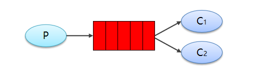

# 1. 消息队列

**消息队列** 已经逐渐成为企业应用系统 **内部通信** 的核心手段。它具有 **低耦合**、**可靠投递**、**广播**、**流量控制**、**最终一致性** 等一系列功能。

当前使用较多的 **消息队列** 有 `RabbitMQ`、`RocketMQ`、`ActiveMQ`、`Kafka`、`ZeroMQ`、`MetaMQ` 等，而部分 **数据库** 如 `Redis`、`MySQL` 以及 `phxsql` 也可实现消息队列的功能。

## 1.1 概述

**消息队列** 是指利用 **高效可靠** 的 **消息传递机制** 进行与平台无关的 **数据交流**，并基于 **数据通信** 来进行分布式系统的集成。


通过提供 **消息传递** 和 **消息排队** 模型，它可以在 **分布式环境** 下提供 **应用解耦**、**弹性伸缩**、**冗余存储**、**流量削峰**、**异步通信**、**数据同步** 等等功能，其作为 **分布式系统架构** 中的一个重要组件，有着举足轻重的地位。

## 1.2 特点

1.  采用**异步处理**模式

   **消息发送者** 可以发送一个消息而无须等待响应。**消息发送者** 将消息发送到一条 **虚拟的通道**（**主题** 或 **队列**）上，**消息接收者** 则 **订阅** 或是 **监听** 该通道。一条信息可能最终转发给 **一个或多个** 消息接收者，这些接收者都无需对 **消息发送者** 做出 **同步回应**。整个过程都是 **异步的**。

2. 应用系统之间**解耦合**

   主要体现在如下两点：

   1. 发送者和接受者不必了解对方、只需要 **确认消息**；
   2. 发送者和接受者 **不必同时在线**。

   比如在线交易系统为了保证数据的 **最终一致**，在 **支付系统** 处理完成后会把 **支付结果** 放到 **消息中间件** 里，通知 **订单系统** 修改 **订单支付状态**。两个系统是通过消息中间件解耦的。

## 1.3 应用场景

当你需要使用 **消息队列** 时，首先需要考虑它的必要性。可以使用消息队列的场景有很多，最常用的几种，是做 **应用程序松耦合**、**异步处理模式**、**发布与订阅**、**最终一致性**、**错峰流控** 和 **日志缓冲** 等。反之，如果需要 **强一致性**，关注业务逻辑的处理结果，则使用 `RPC` 显得更为合适。

1. 异步处理

   - **非核心** 流程 **异步化**，减少系统 **响应时间**，提高 **吞吐量**。例如：**短信通知**、**终端状态推送**、`App` **推送**、**用户注册** 等。

   - **消息队列** 一般都内置了 **高效的通信机制**，因此也可以用于单纯的消息通讯，比如实现 **点对点消息队列** 或者 **聊天室** 等。
   - 应用案例：网站用户注册，注册成功后会过一会发送邮件确认或者短息。

   

2. 系统解耦

   - 系统之间不是 **强耦合的**，**消息接受者** 可以随意增加，而不需要修改 **消息发送者的代码**。**消息发送者** 的成功不依赖 **消息接受者**（比如：有些银行接口不稳定，但调用方并不需要依赖这些接口）
   - **不强依赖** 于非本系统的核心流程，对于 **非核心流程**，可以放到消息队列中让 **消息消费者** 去按需消费，而 **不影响核心主流程**。

3. 最终一致性

   **最终一致性** 不是 **消息队列** 的必备特性，但确实可以依靠 **消息队列** 来做 **最终一致性** 的事情。

   - **先写消息再操作**，确保操作完成后再修改消息状态。**定时任务补偿机制** 实现消息 **可靠发送接收**、业务操作的可靠执行，要注意 **消息重复** 与 **幂等设计**。
   - 所有不保证 `100%` **不丢消息** 的消息队列，理论上无法实现 **最终一致性**。

   像 `Kafka` 一类的设计，在设计层面上就有 **丢消息** 的可能（比如 **定时刷盘**，如果掉电就会丢消息）。哪怕只丢千分之一的消息，业务也必须用其他的手段来保证结果正确。

4. 广播

   **生产者/消费者** 模式，只需要关心消息是否 **送达队列**，至于谁希望订阅和需要消费，是 **下游** 的事情，无疑极大地减少了开发和联调的工作量。

   

5. 流量削峰和流控

   - 当 **上下游系统** 处理能力存在差距的时候，利用 **消息队列** 做一个通用的 **“漏斗”**，进行 **限流控制**。在下游有能力处理的时候，再进行分发。

     > 举个例子：用户在支付系统成功结账后，订单系统会通过短信系统向用户推送扣费通知。 **短信系统** 可能由于 **短板效应**，速度卡在 **网关** 上（每秒几百次请求），跟 **前端的并发量** 不是一个数量级。 于是，就造成 **支付系统** 和 **短信系统** 的处理能力出现差异化。

   - 然而用户晚上个半分钟左右收到短信，一般是不会有太大问题的。如果没有消息队列，两个系统之间通过 **协商**、**滑动窗口** 等复杂的方案也不是说不能实现。但 **系统复杂性** 指数级增长，势必在 **上游** 或者 **下游** 做 **存储**，并且要处理 **定时**、**拥塞** 等一系列问题。而且每当有 **处理能力有差距** 的时候，都需要 **单独** 开发一套逻辑来维护这套逻辑。

   - 所以，利用中间系统转储两个系统的通信内容，并在下游系统有能力处理这些消息的时候，再处理这些消息，是一套相对较通用的方式。
   - 应用案例
     1. 把消息队列当成可靠的 **消息暂存地**，进行一定程度的 **消息堆积**；
     2. 定时进行消息投递，比如模拟 **用户秒杀** 访问，进行 **系统性能压测**。

   

6. 日志处理

   - 将消息队列用在 **日志处理** 中，比如 `Kafka` 的应用，解决 **海量日志** 传输和缓冲的问题。

   - 应用案例：把日志进行集中收集，用于计算 PV、用户行为分析 等等。

   

   

7. 消息通讯

   消息队列一般都内置了 **高效的通信机制**，因此也可以用于单纯的 **消息通讯**，比如实现 **点对点消息队列** 或者 **聊天室** 等。

## 1.4 常见的传输模型

1. 点对点模型

   **点对点模型** 用于 **消息生产者** 和 **消息消费者** 之间 **点到点** 的通信。消息生产者将消息发送到由某个名字标识的特定消费者。这个名字实际上对于消费服务中的一个 **队列**（`Queue`），在消息传递给消费者之前它被 **存储** 在这个队列中。**队列消息** 可以放在 **内存** 中也可以 **持久化**，以保证在消息服务出现故障时仍然能够传递消息。

   传统的点对点消息中间件通常由 **消息队列服务**、**消息传递服务**、**消息队列** 和 **消息应用程序接口** `API` 组成，其典型的结构如下图所示。

   

   **特点：**

   1. 每个消息只用一个消费者；
   2. 发送者和接受者没有时间依赖；
   3. 接受者确认消息接受和处理成功。

2. 发布/订阅（pub/sub） 模型

   **发布者/订阅者** 模型支持向一个特定的 **消息主题** 生产消息。`0` 或 **多个订阅者** 可能对接收来自 **特定消息主题** 的消息感兴趣。

   在这种模型下，发布者和订阅者彼此不知道对方，就好比是匿名公告板。这种模式被概况为：多个消费者可以获得消息，在 **发布者** 和 **订阅者** 之间存在 **时间依赖性**。发布者需要建立一个 **订阅**（`subscription`），以便能够消费者订阅。**订阅者** 必须保持 **持续的活动状态** 并 **接收消息**。

   在这种情况下，在订阅者 **未连接时**，发布的消息将在订阅者 **重新连接** 时 **重新发布**，如下图所示：

   
   **特性：**

   1. 每个消息可以有多个订阅者；
   2. 客户端只有订阅后才能接收到消息；
   3. 持久订阅和非持久订阅。

注意：

1. 发布者和订阅者有时间依赖：接受者和发布者只有建立订阅关系才能收到消息；
2. 持久订阅：订阅关系建立后，消息就不会消失，不管订阅者是否都在线；
3. 非持久订阅：订阅者为了接受消息，必须一直在线。 当只有一个订阅者时约等于点对点模式

## 1.5 消息队列对比

`Kafka` 在于 **分布式架构**，`RabbitMQ` 基于 `AMQP` **协议** 来实现，`RocketMQ` 的思路来源于 `Kafka`，改成了 **主从结构**，在 **事务性** 和 **可靠性** 方面做了优化。广泛来说，**电商**、**金融** 等对 **事务一致性** 要求很高的，可以考虑 `RabbitMQ` 和 `RocketMQ`，对 **性能要求高** 的可考虑 `Kafka`。


# 2. RabbitMQ

`RabbitMQ` 于 `2007` 年发布，是一个在 `AMQP` (**高级消息队列协议**)基础上完成的，可复用的企业消息系统，是当前最主流的消息中间件之一。

## 2.1 概述

1. 主要特性：

   - **可靠性**：提供了多种技术可以让你在 **性能** 和 **可靠性** 之间进行 **权衡**。这些技术包括 **持久性机制**、**投递确认**、**发布者证实** 和 **高可用性机制**；

   - **灵活的路由**：消息在到达队列前是通过 **交换机** 进行 **路由** 的。`RabbitMQ` 为典型的路由逻辑提供了 **多种内置交换机** 类型。如果你有更复杂的路由需求，可以将这些交换机组合起来使用，你甚至可以实现自己的交换机类型，并且当做 `RabbitMQ` 的 **插件** 来使用；
   - **消息集群**：在相同局域网中的多个 `RabbitMQ` 服务器可以 **聚合** 在一起，作为一个独立的逻辑代理来使用；
   - **队列高可用**：队列可以在集群中的机器上 **进行镜像**，以确保在硬件问题下还保证 **消息安全**；
   - **支持多种协议**：支持 **多种消息队列协议**；
   - **支持多种语言**：用 `Erlang` 语言编写，支持只要是你能想到的 **所有编程语言**；
   - **管理界面**： `RabbitMQ` 有一个易用的 **用户界面**，使得用户可以 **监控** 和 **管理** 消息 `Broker` 的许多方面；
   - **跟踪机制**：如果 **消息异常**，`RabbitMQ` 提供消息跟踪机制，使用者可以找出发生了什么；
   - **插件机制**：提供了许多 **插件**，来从多方面进行扩展，也可以编写自己的插件。

2. 部署环境：

   `RabbitMQ` 可以运行在 `Erlang` 语言所支持的平台之上，包括 `Solaris`，`BSD`，`Linux`，`MacOSX`，`TRU64`，`Windows` 等。使用 `RabbitMQ` 需要：

   - `ErLang` 语言包
   - `RabbitMQ` 安装包

3. 优点：

   - 由于 `Erlang` 语言的特性，消息队列性能较好，支持 **高并发**；

   - 健壮、稳定、易用、**跨平台**、支持 **多种语言**、文档齐全；

   - 有消息 **确认机制** 和 **持久化机制**，可靠性高；

   - 高度可定制的 **路由**；

   - **管理界面** 较丰富，在互联网公司也有较大规模的应用，社区活跃度高。

4. 缺点：

   - 尽管结合 `Erlang` 语言本身的并发优势，性能较好，但是不利于做 **二次开发和维护**；实现了 **代理**
   - **架构**，意味着消息在发送到客户端之前可以在 **中央节点** 上排队。此特性使得 `RabbitMQ` 易于使用和部署，但是使得其 **运行速度较慢**，因为中央节点 **增加了延迟**，**消息封装后** 也比较大；
   - 需要学习 **比较复杂** 的 **接口和协议**，学习和维护成本较高。

## 2.2 相关概念


- Broker（中间件）：接收和分发消息的应用，RabbitMQ Server就是Message Broker
- Virtual（虚拟）：出于多租户和安全因素设计的，把 AMQP 的基本组件划分到一个虚拟的分组中，类似于网络中的 namespace 概念。当多个不同的用户使用同一个 RabbitMQ server 提供的服务时，可以划分出多个vhost，每个用户在自己的 vhost 创建 exchange／queue 等
- Connection：publisher／consumer 和 broker 之间的 TCP 连接
- Channel：如果每一次访问 RabbitMQ 都建立一个 Connection，在消息量大的时候建立 TCP Connection的开销将是巨大的，效率也较低。Channel 是在 connection 内部建立的逻辑连接，如果应用程序支持多线程，通常每个thread创建单独的 channel 进行通讯，AMQP method 包含了channel id 帮助客户端和message broker 识别 channel，所以 channel 之间是完全隔离的。Channel 作为轻量级的 Connection 极大减少了操作系统建立 TCP connection 的开销
- Exchange：message 到达 broker 的第一站，根据分发规则，匹配查询表中的 routing key，分发消息到queue 中去。常用的类型有：direct (point-to-point), topic (publish-subscribe) and fanout (multicast)
- Queue：消息最终被送到这里等待 consumer 取走
- Binding：exchange 和 queue 之间的虚拟连接，binding 中可以包含 routing key。Binding 信息被保存到 exchange 中的查询表中，用于 message 的分发依据

## 2.3 工作模式

RabbitMQ 提供了 6 种工作模式：简单模式、work queues、Publish/Subscribe 发布与订阅模式、Routing 路由模式、Topics 主题模式、RPC 远程调用模式（远程调用，不太算 MQ；暂不作介绍）。
官网对应模式介绍：https://www.rabbitmq.com/getstarted.html


# 3. JMS概述

**JMS即Java消息服务（Java Message Service）应用程序接口**，是一个Java平台中关于面向消息中间件（MOM）的API，用于在两个应用程序之间，或分布式系统中发送消息，进行异步通信。Java消息服务是一个与具体平台无关的API，绝大多数MOM提供商都对JMS提供支持。我们可以简单的理解：两个应用程序之间需要进行通信，我们使用一个JMS服务，进行中间的转发，**通过JMS 的使用，我们可以解除两个程序之间的耦合。**

1. 优势：

   - 异步

     JMS 原本就是一个异步的消息服务，客户端获取消息的时候，不需要主动发送请求，消息会自动发送给可用的客户端

   - 可靠

     JMS保证消息只会递送一次。大家都遇到过重复创建消息问题，而JMS能帮你避免该问题。

2. JMS的消息模型

   JMS具有两种通信模式：

   - 点对点
   - 发布/订阅

3. JMS接收消息

   在JMS中，消息的产生和消费是异步的。对于消费来说，JMS的消费者可以通过两种方式来消费消息。

   - 同步（Synchronous）

     在同步消费信息模式模式中，订阅者/接收方通过调用 receive（）方法来接收消息。在receive（）方法中，线程会阻塞直到消息到达或者到指定时间后消息仍未到达。

   - 异步（Asynchronous）

     使用异步方式接收消息的话，消息订阅者需注册一个消息监听者，类似于事件监听器，只要消息到达，JMS服务提供者会通过调用监听器的onMessage()递送消息。

4. JMS编程模型

   - 管理对象（Administered objects）-连接工厂（Connection Factories）和目的地（Destination）
   - 连接对象（Connections）
   - 会话（Sessions）
   - 消息生产者（Message Producers）
   - 消息消费者（Message Consumers）
   - 消息监听者（Message Listeners）

# 4. windows安装RabbitMQ

说明：本次安装使用windows10进行，（centos8安装失败了，懒得再找bug）。

安装前选择版本时**注意**：安装时需要用到两个安装包，分别是`rabbitmq-server-3.8.9`与`otp_win64_23.1`，前者是RabbitMQ本体，后者是依赖环境`Erlang `，选择这两个的版本时**必须**参考官方说明：https://www.rabbitmq.com/which-erlang.html，进行版本选择，且，安装时，**系统名不能为中文**

这里选择的时rabbit为3.8.9版本，Erlang为23.1版本

1. 下载并安装Erlang

   官网地址：https://www.erlang.org/downloads，根据对应系统进行选择。

   

   下载后，正常安装即可，除安装目录之外所有选项均选择默认，安装目录自行选择。

2. 设置ERLANG_HOME 系统变量

   ```
   变量名：ERLANG_HOME
   变量值：D:\RabbitMQ\erl-23.1
   ```

3. 添加Path变量

   ```
   %ERLANG_HOME%\bin
   ```

4. 下载并安装RabbitMQ

   下载地址：https://www.rabbitmq.com/install-windows.html

   

   进入之后，页面往下翻翻就可以看到如下了

   

   这里可以选择不同的下载地址，可以根据情况自行选择。

   下载后，正常安装即可，除安装目录之外所有选项均选择默认，安装目录自行选择。

5. 设置RabbitMQ系统变量

   ```
   变量名：RABBITMQ_SERVER
   变量值：D:\RabbitMQ\rabbitmq_server-3.8.9
   ```

6. 添加Path变量

   ```
   %RABBITMQ_SERVER%\sbin
   ```

7. 安装` RabbitMQWeb`的管理插件

   这款插件是可以可视化的方式查看RabbitMQ 服务器实例的状态，以及操控RabbitMQ服务器。

   在RabbitMQ安装目录下的sbin文件夹内打开cmd命令行工具，并执行如下命令：

   ```
   rabbitmq-plugins enable rabbitmq_management
   ```

8. 启动RabbitMQ服务

   在RabbitMQ根目录中的sbin文件夹下启动`rabbitmq-server.bat`文件

   此时，很可能会出现闪退现象，解决方法如下：

   ```
   首先在命令行输入：rabbitmq-service stop
   接着输入rabbitmq-service remove
   再接着输入rabbitmq-service install
   接着输入rabbitmq-service start
   最后重新输入rabbitmq-plugins enable rabbitmq_management
   ```

   注意：此命令行**需要系统管理员权限**

   执行完命令后，正确的输出内容为：

   ```
   The following plugins have been enabled:
     amqp_client
     cowlib
     cowboy
     rabbitmq_web_dispatch
     rabbitmq_management_agent
     rabbitmq_management
   
   Applying plugin configuration to rabbit@USER-20160821AY... started 6 plugins.
   ```

9. 可能出现的问题

   启动RabbitMQ服务后又会自行停止，也就是说根本没有启动成功

   原因：安装时默认会将RabbitMQ相关的数据和日志保存在C盘的用户目录下：`C:\Users\宋天\AppData\Roaming\RabbitMQ`，看，这里是存在中文路径的

   注意，你的路径不能含有中文，如果有中文，可以使用如下方式解决安装问题

   1. 在RabbitMQ安装目录的根目录下创建data文件夹

   2. 在此路径上打开cmd命令行工具，输入如下命令执行数据所在位置，**注意**：要修改为自己的目录

      ```
      set RABBITMQ_BASE=D:\RabbitMQ\rabbitmq_server-3.8.9\data
      ```

   3. 重启RabbitMQ服务即可

      ```
      启动服务：net start RabbitMQ 
      关闭服务：net stop RabbitMQ 
      ```

10. 启动：

    **确认RabbitMQ服务已经启动后**，在浏览器输入[http://localhost:15672](http://localhost:15672/) ，即可打开管理页面

    默认账号和密码为

    ```
    guest
    guest
    ```

    

# 5. RabbitMQ 快速入门程序

## 5.1 生产者

1. 创建maven项目，并导入坐标

   ```xml
   <dependencies>
       <dependency>
           <groupId>com.rabbitmq</groupId>
           <artifactId>amqp-client</artifactId>
           <version>5.6.0</version>
       </dependency>
   </dependencies>
   
   <build>
       <plugins>
           <plugin>
               <groupId>org.apache.maven.plugins</groupId>
               <artifactId>maven-compiler-plugin</artifactId>
               <version>3.8.0</version>
               <configuration>
                   <source>1.8</source>
                   <target>1.8</target>
               </configuration>
           </plugin>
       </plugins>
   </build>
   ```

2. 代码实现消息生产

   ```java
   public class ProducerDemo {
       public static void main(String[] args) throws IOException, TimeoutException {
           // 1. 创建连接工厂
           ConnectionFactory factory = new ConnectionFactory();
   
           // 2. 设置连接参数
           // 指定主机，可省略，默认为localhost
           factory.setHost("127.0.0.1");
           // 设置端口，可省略，默认为5672端口
           factory.setPort(5672);
           // 设置连接的虚拟主机，默认值为自带的虚拟主机 /
           factory.setVirtualHost("itcast");
           // 设置用户名和密码
           factory.setUsername("guest");
           factory.setPassword("guest");
   
           // 3. 创建连接
           Connection connection = factory.newConnection();
   
           // 4. 创建Channel （管道）
           Channel channel = connection.createChannel();
   
           // 5. 创建队列 Queue
           /**
            * 参数说明：
            * String queue,队列名称
            * boolean durable,是否持久化（当mq重启后，还在）
            * boolean exclusive,有两个意思
            *      1. 是否独占连接（只能有一个消费者监听队列）
            *      2. 当connection连接关闭时是否删除队列
            * boolean autoDelete,是否自动删除（当没有Consumer时，自动删除）
            * Map<String, Object> arguments 参数信息
            */
           // 如果没有hello_world此队列，会自动创建，如果没有则不会创建
           channel.queueDeclare("hello_world",true,false,false,null);
   
           // 6. 发送消息
           /**
            * 参数说明：
            * String exchange, 交换机，简单模式下交换机，会使用默认的
            * String routingKey,路由名称（如果使用默认的交换机，则路由名称为队列名称）
            * BasicProperties props,配置信息
            * byte[] body 发送的消息数据
            */
           String body = "hello";
           channel.basicPublish("","hello_world",null,body.getBytes());
   
           // 7. 释放资源，如果不进行释放，则程序会一直进行连接
           channel.close();
           connection.close();
       }
   }
   ```

   

## 5.2 消费者

1. 创建maven项目，并导入坐标

   ```xml
   <dependencies>
       <dependency>
           <groupId>com.rabbitmq</groupId>
           <artifactId>amqp-client</artifactId>
           <version>5.6.0</version>
       </dependency>
   </dependencies>
   
   <build>
       <plugins>
           <plugin>
               <groupId>org.apache.maven.plugins</groupId>
               <artifactId>maven-compiler-plugin</artifactId>
               <version>3.8.0</version>
               <configuration>
                   <source>1.8</source>
                   <target>1.8</target>
               </configuration>
           </plugin>
       </plugins>
   </build>
   ```

2. 代码实现消息生产

   ```java
   public class ConsumerDemo {
       public static void main(String[] args) throws IOException, TimeoutException {
           // 1. 创建连接工厂
           ConnectionFactory factory = new ConnectionFactory();
   
           // 2. 设置连接参数
           // 指定主机，可省略，默认为localhost
           factory.setHost("127.0.0.1");
           // 设置端口，可省略，默认为5672端口
           factory.setPort(5672);
           // 设置连接的虚拟主机，默认值为自带的虚拟主机 /
           factory.setVirtualHost("itcast");
           // 设置用户名和密码
           factory.setUsername("guest");
           factory.setPassword("guest");
   
           // 3. 创建连接
           Connection connection = factory.newConnection();
   
           // 4. 创建Channel （管道）
           Channel channel = connection.createChannel();
   
           // 5. 创建队列 Queue
           /**
            * 参数说明：
            * String queue,队列名称
            * boolean durable,是否持久化（当mq重启后，还在）
            * boolean exclusive,有两个意思
            *      1. 是否独占连接（只能有一个消费者监听队列）
            *      2. 当connection连接关闭时是否删除队列
            * boolean autoDelete,是否自动删除（当没有Consumer时，自动删除）
            * Map<String, Object> arguments 参数信息
            */
           // 如果没有hello_world此队列，会自动创建，如果没有则不会创建
           channel.queueDeclare("hello_world",true,false,false,null);
   
           // 6. 接收消息
         
           Consumer consumer = new DefaultConsumer(channel){
               // 回调方法，当收到消息后会自动执行该方法
   
               /**
                *
                * @param consumerTag 消息标识
                * @param envelope 获取一些对应的信息（交换机，路由key。。）
                * @param properties 配置信息
                * @param body 真实数据
                * @throws IOException
                */
               @Override
               public void handleDelivery(String consumerTag, Envelope envelope, AMQP.BasicProperties properties, byte[] body) throws IOException {
   
                   System.out.println("consumerTag: "+consumerTag);
                   System.out.println("envelope: "+envelope);
                   System.out.println("properties: "+properties);
                   System.out.println("body: "+ new String(body));
               }
           };
             /**
            * 参数说明：
            * String queue,队列名称
            * boolean autoAck,是否自动确认（消息收到后是否返回成功信息）
            * Consumer callback 回调对象
            */
           channel.basicConsume("hello_world",true,consumer);
   
           // 不需要关闭连接，需要一直监听
       }
   }
   
   ```

   

# 6. RabbitMQ工作模式

## 6.1 工作队列模式



- Work Queues：与入门程序的简单模式相比，多了一个或一些消费端，多个消费端共同消费同一个队列中的消息。
- 应用场景：对于任务过重或任务较多情况使用工作队列可以提高任务处理的速度。

代码实现：

1. 生产者代码

   创建如下生产者代码，然后另外copy一份，不需要更改队列名称，但是可以修改消息内容，简单测试即可。

   ```java
   public class ProducerDemo_1 {
       public static void main(String[] args) throws IOException, TimeoutException {
           // 1. 创建连接工厂
           ConnectionFactory factory = new ConnectionFactory();
   
           // 2. 设置连接参数
           // 指定主机，可省略，默认为localhost
           factory.setHost("127.0.0.1");
           // 设置端口，可省略，默认为5672端口
           factory.setPort(5672);
           // 设置连接的虚拟主机，默认值为自带的虚拟主机 /
           factory.setVirtualHost("itcast");
           // 设置用户名和密码
           factory.setUsername("guest");
           factory.setPassword("guest");
   
           // 3. 创建连接
           Connection connection = factory.newConnection();
   
           // 4. 创建Channel （管道）
           Channel channel = connection.createChannel();
   
           // 5. 创建队列 Queue
           /**
            * 参数说明：
            * String queue,队列名称
            * boolean durable,是否持久化（当mq重启后，还在）
            * boolean exclusive,有两个意思
            *      1. 是否独占连接（只能有一个消费者监听队列）
            *      2. 当connection连接关闭时是否删除队列
            * boolean autoDelete,是否自动删除（当没有Consumer时，自动删除）
            * Map<String, Object> arguments 参数信息
            */
           // 如果没有hello_world此队列，会自动创建，如果没有则不会创建
           channel.queueDeclare("hello_world_1",true,false,false,null);
   
           // 6. 发送消息
           /**
            * 参数说明：
            * String exchange, 交换机，简单模式下交换机，会使用默认的
            * String routingKey,路由名称（如果使用默认的交换机，则路由名称为队列名称）
            * BasicProperties props,配置信息
            * byte[] body 发送的消息数据
            */
   
           for (int i = 0; i < 4; i++) {
               String body = "hello: "+i;
               channel.basicPublish("","hello_world_1",null,body.getBytes());
   
           }
           // 7. 释放资源，如果不进行释放，则程序会一直进行连接
           channel.close();
           connection.close();
       }
   }
   ```

2. 消费者代码

   ```java
   public class ConsumerDemo {
       public static void main(String[] args) throws IOException, TimeoutException {
           // 1. 创建连接工厂
           ConnectionFactory factory = new ConnectionFactory();
   
           // 2. 设置连接参数
           // 指定主机，可省略，默认为localhost
           factory.setHost("127.0.0.1");
           // 设置端口，可省略，默认为5672端口
           factory.setPort(5672);
           // 设置连接的虚拟主机，默认值为自带的虚拟主机 /
           factory.setVirtualHost("itcast");
           // 设置用户名和密码
           factory.setUsername("guest");
           factory.setPassword("guest");
   
           // 3. 创建连接
           Connection connection = factory.newConnection();
   
           // 4. 创建Channel （管道）
           Channel channel = connection.createChannel();
   
           // 5. 创建队列 Queue
           /**
            * 参数说明：
            * String queue,队列名称
            * boolean durable,是否持久化（当mq重启后，还在）
            * boolean exclusive,有两个意思
            *      1. 是否独占连接（只能有一个消费者监听队列）
            *      2. 当connection连接关闭时是否删除队列
            * boolean autoDelete,是否自动删除（当没有Consumer时，自动删除）
            * Map<String, Object> arguments 参数信息
            */
           // 如果没有hello_world此队列，会自动创建，如果没有则不会创建
           channel.queueDeclare("hello_world",true,false,false,null);
   
           // 6. 接收消息
           /**
            * 参数说明：
            * String queue,队列名称
            * boolean autoAck,是否自动确认（消息收到后是否返回成功信息）
            * Consumer callback 回调对象
            */
           Consumer consumer = new DefaultConsumer(channel){
               // 回调方法，当收到消息后会自动执行该方法
   
               /**
                *
                * @param consumerTag 消息标识
                * @param envelope 获取一些对应的信息（交换机，路由key。。）
                * @param properties 配置信息
                * @param body 真实数据
                * @throws IOException
                */
               @Override
               public void handleDelivery(String consumerTag, Envelope envelope, AMQP.BasicProperties properties, byte[] body) throws IOException {
   
                   System.out.println("consumerTag: "+consumerTag);
                   System.out.println("envelope: "+envelope);
                   System.out.println("properties: "+properties);
                   System.out.println("body: "+ new String(body));
               }
           };
           channel.basicConsume("hello_world_1",true,consumer);
   
           // 不需要关闭连接，需要一直监听
       }
   }
   
   ```

   

总结：

1. 在一个队列中如果有多个消费者，那么消费者之间对于同一个消息的关系是竞争的关系。
2. Work Queues 对于任务过重或任务较多情况使用工作队列可以提高任务处理的速度。例如：短信服务部署多个，只需要有一个节点成功发送即可。

## 6.2 Pub/Sub 订阅模式


在订阅模型中，多了一个 Exchange 角色，而且过程略有变化：

- P：生产者，也就是要发送消息的程序，但是不再发送到队列中，而是发给X（交换机）

- C：消费者，消息的接收者，会一直等待消息到来

- Queue：消息队列，接收消息、缓存消息

- Exchange：交换机（X）。一方面，接收生产者发送的消息。另一方面，知道如何处理消息，例如递交给某个特别队列、递交给所有队列、或是将消息丢弃。到底如何操作，取决于Exchange的类型。Exchange有常见以下3种类型：

  - Fanout：广播，将消息交给所有绑定到交换机的队列
  - Direct：定向，把消息交给符合指定routing key 的队列
  - Topic：通配符，把消息交给符合routing pattern（路由模式） 的队列

  Exchange（交换机）**只负责转发消息**，**不具备存储消息的能力**，因此如果没有任何队列与 Exchange 绑定，或者没有符合路由规则的队列，那么消息会丢失！

 

代码实现：fanout广播测试

1. 生产者代码

   ```java
   public class Producer_PubSub {
       public static void main(String[] args) throws IOException, TimeoutException {
           // 1. 创建连接工厂
           ConnectionFactory factory = new ConnectionFactory();
   
           // 2. 设置连接参数
           // 指定主机，可省略，默认为localhost
           factory.setHost("127.0.0.1");
           // 设置端口，可省略，默认为5672端口
           factory.setPort(5672);
           // 设置连接的虚拟主机，默认值为自带的虚拟主机 /
           factory.setVirtualHost("itcast");
           // 设置用户名和密码
           factory.setUsername("guest");
           factory.setPassword("guest");
   
           // 3. 创建连接
           Connection connection = factory.newConnection();
   
           // 4. 创建Channel （管道）
           Channel channel = connection.createChannel();
   
           // 5. 创建交换机
           /**
            * 参数说明：
            * String exchange,交换机名称
            * BuiltinExchangeType type,交换机类型
            *      DIRECT("direct"), 定向
            *      FANOUT("fanout"), 扇形（广播），发送给与之绑定的所有对列
            *      TOPIC("topic"), 通配符形式
            *      HEADERS("headers"); 参数匹配
            * boolean durable,是否持久化
            * boolean autoDelete,自动删除
            * boolean internal,内部使用，一般false
            * Map<String, Object> arguments 参数列表
            */
           String exchangeName = "test_fanout";
           channel.exchangeDeclare(exchangeName, BuiltinExchangeType.FANOUT,true,false,false,null);
   
           // 6. 创建队列
           String queueName1 = "test_fanout_queue1";
           String queueName2 = "test_fanout_queue2";
           String queueName3 = "test_fanout_queue3";
           channel.queueDeclare(queueName1,true,false,false,null);
           channel.queueDeclare(queueName2,true,false,false,null);
           channel.queueDeclare(queueName3,true,false,false,null);
   
           // 7. 绑定队列和交换机，这里只绑定两个队列
           /**
            * 参数说明：
            * String queue, 要绑定的队列名称
            * String exchange, 交换机名称
            * String routingKey, 路由键，绑定规则
            *      如果交换机类型为：fanout，则routingKey设置为""
            */
           channel.queueBind(queueName1,exchangeName,"");
           channel.queueBind(queueName2,exchangeName,"");
           // 8. 发送消息
           String body = "信息1号：冲呀~";
           channel.basicPublish(exchangeName,"",null,body.getBytes());
   
           // 9. 释放资源
           channel.close();
           connection.close();
       }
   }
   
   ```

2. 消费者代码

   ```java
   public class Consumer_PubSub {
       public static void main(String[] args) throws IOException, TimeoutException {
           // 1. 创建连接工厂
           ConnectionFactory factory = new ConnectionFactory();
   
           // 2. 设置连接参数
           // 指定主机，可省略，默认为localhost
           factory.setHost("127.0.0.1");
           // 设置端口，可省略，默认为5672端口
           factory.setPort(5672);
           // 设置连接的虚拟主机，默认值为自带的虚拟主机 /
           factory.setVirtualHost("itcast");
           // 设置用户名和密码
           factory.setUsername("guest");
           factory.setPassword("guest");
   
           // 3. 创建连接
           Connection connection = factory.newConnection();
   
           // 4. 创建Channel （管道）
           Channel channel = connection.createChannel();
   
           String queueName1 = "test_fanout_queue1";
           String queueName2 = "test_fanout_queue2";
           String queueName3 = "test_fanout_queue3";
   
           // 5. 创建队列 Queue
           /**
            * 参数说明：
            * String queue,队列名称
            * boolean durable,是否持久化（当mq重启后，还在）
            * boolean exclusive,有两个意思
            *      1. 是否独占连接（只能有一个消费者监听队列）
            *      2. 当connection连接关闭时是否删除队列
            * boolean autoDelete,是否自动删除（当没有Consumer时，自动删除）
            * Map<String, Object> arguments 参数信息
            */
           // 如果没有hello_world此队列，会自动创建，如果没有则不会创建
           channel.queueDeclare("hello_world",true,false,false,null);
   
           // 6. 接收消息
           /**
            * 参数说明：
            * String queue,队列名称
            * boolean autoAck,是否自动确认（消息收到后是否返回成功信息）
            * Consumer callback 回调对象
            */
           Consumer consumer1 = new DefaultConsumer(channel){
               // 回调方法，当收到消息后会自动执行该方法
   
   
               @Override
               public void handleDelivery(String consumerTag, Envelope envelope, AMQP.BasicProperties properties, byte[] body) throws IOException {
   
                   System.out.println("body: "+ new String(body));
                   System.out.println("打印消息1号。。。。");
               }
           };
           channel.basicConsume(queueName1,true,consumer1);
   
   
           Consumer consumer2 = new DefaultConsumer(channel){
               // 回调方法，当收到消息后会自动执行该方法
               @Override
               public void handleDelivery(String consumerTag, Envelope envelope, AMQP.BasicProperties properties, byte[] body) throws IOException {
   
                   System.out.println("body: "+ new String(body));
                   System.out.println("打印消息2号。。。。");
               }
           };
           channel.basicConsume(queueName2,true,consumer2);
   
           Consumer consumer3 = new DefaultConsumer(channel){
               // 回调方法，当收到消息后会自动执行该方法
               @Override
               public void handleDelivery(String consumerTag, Envelope envelope, AMQP.BasicProperties properties, byte[] body) throws IOException {
   
                   System.out.println("body: "+ new String(body));
                   System.out.println("打印消息3号。。。。");
               }
           };
           channel.basicConsume(queueName3,true,consumer3);
           // 不需要关闭连接，需要一直监听
       }
   }
   
   ```

## 6.3 通配符模式


图解：

- 红色 Queue：绑定的是` usa.# `，因此凡是以 usa. 开头的 routing key 都会被匹配到
- 黄色 Queue：绑定的是 `#.news `，因此凡是以 .news 结尾的 routing key 都会被匹配

代码实现：

1. 生产者代码

   ```java
   public class Producer_Topic {
       public static void main(String[] args) throws IOException, TimeoutException {
           // 1. 创建连接工厂
           ConnectionFactory factory = new ConnectionFactory();
   
           // 2. 设置连接参数
           // 指定主机，可省略，默认为localhost
           factory.setHost("127.0.0.1");
           // 设置端口，可省略，默认为5672端口
           factory.setPort(5672);
           // 设置连接的虚拟主机，默认值为自带的虚拟主机 /
           factory.setVirtualHost("itcast");
           // 设置用户名和密码
           factory.setUsername("guest");
           factory.setPassword("guest");
   
           // 3. 创建连接
           Connection connection = factory.newConnection();
   
           // 4. 创建Channel （管道）
           Channel channel = connection.createChannel();
   
           // 5. 创建交换机
           /**
            * 参数说明：
            * String exchange,交换机名称
            * BuiltinExchangeType type,交换机类型
            *      DIRECT("direct"), 定向
            *      FANOUT("fanout"), 扇形（广播），发送给与之绑定的所有对列
            *      TOPIC("topic"), 通配符形式
            *      HEADERS("headers"); 参数匹配
            * boolean durable,是否持久化
            * boolean autoDelete,自动删除
            * boolean internal,内部使用，一般false
            * Map<String, Object> arguments 参数列表
            */
           String exchangeName = "test_topic";
           channel.exchangeDeclare(exchangeName, BuiltinExchangeType.TOPIC,true,false,false,null);
   
           // 6. 创建队列
           String queueName1 = "test_topic_queue1";
           String queueName2 = "test_topic_queue2";
   
           channel.queueDeclare(queueName1,true,false,false,null);
           channel.queueDeclare(queueName2,true,false,false,null);
           
           // 7. 绑定队列和交换机，这里只绑定两个队列
           /**
            * 参数说明：
            * String queue, 要绑定的队列名称
            * String exchange, 交换机名称
            * String routingKey, 路由键，绑定规则
            *      如果交换机类型为：fanout，则routingKey设置为""
            */
           channel.queueBind(queueName1,exchangeName,"#.error");
           channel.queueBind(queueName1,exchangeName,"order.*");
   
           channel.queueBind(queueName2,exchangeName,"*.*");
           // 8. 发送消息
           String body = "日志信息：info";
           channel.basicPublish(exchangeName,"order.info",null,body.getBytes());
   
           String body1 = "日志信息：info";
           channel.basicPublish(exchangeName,"asd.info",null,body1.getBytes());
   
           // 9. 释放资源
           channel.close();
           connection.close();
       }
   }
   ```

2. 消费者代码

   ```java
   public class Consumer_Topic {
       public static void main(String[] args) throws IOException, TimeoutException {
           // 1. 创建连接工厂
           ConnectionFactory factory = new ConnectionFactory();
   
           // 2. 设置连接参数
           // 指定主机，可省略，默认为localhost
           factory.setHost("127.0.0.1");
           // 设置端口，可省略，默认为5672端口
           factory.setPort(5672);
           // 设置连接的虚拟主机，默认值为自带的虚拟主机 /
           factory.setVirtualHost("itcast");
           // 设置用户名和密码
           factory.setUsername("guest");
           factory.setPassword("guest");
   
           // 3. 创建连接
           Connection connection = factory.newConnection();
   
           // 4. 创建Channel （管道）
           Channel channel = connection.createChannel();
   
           String queueName1 = "test_topic_queue1";
           String queueName2 = "test_topic_queue2";
   
           // 5. 创建队列 Queue
           /**
            * 参数说明：
            * String queue,队列名称
            * boolean durable,是否持久化（当mq重启后，还在）
            * boolean exclusive,有两个意思
            *      1. 是否独占连接（只能有一个消费者监听队列）
            *      2. 当connection连接关闭时是否删除队列
            * boolean autoDelete,是否自动删除（当没有Consumer时，自动删除）
            * Map<String, Object> arguments 参数信息
            */
           // 如果没有hello_world此队列，会自动创建，如果没有则不会创建
           channel.queueDeclare("hello_world",true,false,false,null);
   
           // 6. 接收消息
           /**
            * 参数说明：
            * String queue,队列名称
            * boolean autoAck,是否自动确认（消息收到后是否返回成功信息）
            * Consumer callback 回调对象
            */
           Consumer consumer1 = new DefaultConsumer(channel){
               // 回调方法，当收到消息后会自动执行该方法
   
   
               @Override
               public void handleDelivery(String consumerTag, Envelope envelope, AMQP.BasicProperties properties, byte[] body) throws IOException {
   
                   System.out.println("body: "+ new String(body));
                   System.out.println("topic1号队列。。。。");
               }
           };
           channel.basicConsume(queueName1,true,consumer1);
   
   
           Consumer consumer2 = new DefaultConsumer(channel){
               // 回调方法，当收到消息后会自动执行该方法
               @Override
               public void handleDelivery(String consumerTag, Envelope envelope, AMQP.BasicProperties properties, byte[] body) throws IOException {
   
                   System.out.println("body: "+ new String(body));
                   System.out.println("topic2号队列。。。。");
               }
           };
           channel.basicConsume(queueName2,true,consumer2);
   
           // 不需要关闭连接，需要一直监听
       }
   }
   
   ```

总结：Routing 模式要求队列在绑定交换机时要指定 routing key，消息会转发到符合 routing key 的队列。

## 6.4 路由模式

- 队列与交换机的绑定，不能是任意绑定了，而是要指定一个 RoutingKey（路由key）
- 消息的发送方在向 Exchange 发送消息时，也必须指定消息的 RoutingKey
- Exchange 不再把消息交给每一个绑定的队列，而是根据消息的 Routing Key 进行判断，只有队列的Routingkey 与消息的 Routing key 完全一致，才会接收到消息。


图解：

- P：生产者，向 Exchange 发送消息，发送消息时，会指定一个routing key
- X：Exchange（交换机），接收生产者的消息，然后把消息递交给与 routing key 完全匹配的队列
- C1：消费者，其所在队列指定了需要 routing key 为 error 的消息
- C2：消费者，其所在队列指定了需要 routing key 为 info、error、warning 的消息

代码实现：

1. 生产者代码

   ```java
   public class Producer_Routing {
       public static void main(String[] args) throws IOException, TimeoutException {
           // 1. 创建连接工厂
           ConnectionFactory factory = new ConnectionFactory();
   
           // 2. 设置连接参数
           // 指定主机，可省略，默认为localhost
           factory.setHost("127.0.0.1");
           // 设置端口，可省略，默认为5672端口
           factory.setPort(5672);
           // 设置连接的虚拟主机，默认值为自带的虚拟主机 /
           factory.setVirtualHost("itcast");
           // 设置用户名和密码
           factory.setUsername("guest");
           factory.setPassword("guest");
   
           // 3. 创建连接
           Connection connection = factory.newConnection();
   
           // 4. 创建Channel （管道）
           Channel channel = connection.createChannel();
   
           // 5. 创建交换机
           /**
            * 参数说明：
            * String exchange,交换机名称
            * BuiltinExchangeType type,交换机类型
            *      DIRECT("direct"), 定向
            *      FANOUT("fanout"), 扇形（广播），发送给与之绑定的所有对列
            *      TOPIC("topic"), 通配符形式
            *      HEADERS("headers"); 参数匹配
            * boolean durable,是否持久化
            * boolean autoDelete,自动删除
            * boolean internal,内部使用，一般false
            * Map<String, Object> arguments 参数列表
            */
           String exchangeName = "test_direct";
           channel.exchangeDeclare(exchangeName, BuiltinExchangeType.DIRECT,true,false,false,null);
   
           // 6. 创建队列
           String queueName1 = "test_direct_queue1";
           String queueName2 = "test_direct_queue2";
           channel.queueDeclare(queueName1,true,false,false,null);
           channel.queueDeclare(queueName2,true,false,false,null);
   
           // 7. 绑定队列和交换机，这里只绑定两个队列
           /**
            * 参数说明：
            * String queue, 要绑定的队列名称
            * String exchange, 交换机名称
            * String routingKey, 路由键，绑定规则
            *      如果交换机类型为：fanout，则routingKey设置为""
            */
   
           // 队列1的绑定 error
           channel.queueBind(queueName1,exchangeName,"error");
           // 队列2的绑定 info error warning
           channel.queueBind(queueName2,exchangeName,"info");
           channel.queueBind(queueName2,exchangeName,"error");
           channel.queueBind(queueName2,exchangeName,"warning");
           // 8. 发送消息
           String body = "信息1号：info";
           channel.basicPublish(exchangeName,"info",null,body.getBytes());
   
           String body1 = "信息2号：error";
           channel.basicPublish(exchangeName,"error",null,body1.getBytes());
   
           String body3 = "信息3号：warning";
           channel.basicPublish(exchangeName,"warning",null,body3.getBytes());
   
           String body4 = "信息4号：delete";
           channel.basicPublish(exchangeName,"delete",null,body4.getBytes());
   
           // 9. 释放资源
           channel.close();
           connection.close();
       }
   }
   ```

2. 消费者代码

   ```java
   public class Consumer_Routing {
       public static void main(String[] args) throws IOException, TimeoutException {
           // 1. 创建连接工厂
           ConnectionFactory factory = new ConnectionFactory();
   
           // 2. 设置连接参数
           // 指定主机，可省略，默认为localhost
           factory.setHost("127.0.0.1");
           // 设置端口，可省略，默认为5672端口
           factory.setPort(5672);
           // 设置连接的虚拟主机，默认值为自带的虚拟主机 /
           factory.setVirtualHost("itcast");
           // 设置用户名和密码
           factory.setUsername("guest");
           factory.setPassword("guest");
   
           // 3. 创建连接
           Connection connection = factory.newConnection();
   
           // 4. 创建Channel （管道）
           Channel channel = connection.createChannel();
   
           String queueName1 = "test_direct_queue1";
           String queueName2 = "test_direct_queue2";
   
           // 5. 创建队列 Queue
           /**
            * 参数说明：
            * String queue,队列名称
            * boolean durable,是否持久化（当mq重启后，还在）
            * boolean exclusive,有两个意思
            *      1. 是否独占连接（只能有一个消费者监听队列）
            *      2. 当connection连接关闭时是否删除队列
            * boolean autoDelete,是否自动删除（当没有Consumer时，自动删除）
            * Map<String, Object> arguments 参数信息
            */
           // 如果没有hello_world此队列，会自动创建，如果没有则不会创建
           channel.queueDeclare("hello_world",true,false,false,null);
   
           // 6. 接收消息
           /**
            * 参数说明：
            * String queue,队列名称
            * boolean autoAck,是否自动确认（消息收到后是否返回成功信息）
            * Consumer callback 回调对象
            */
           Consumer consumer1 = new DefaultConsumer(channel){
               // 回调方法，当收到消息后会自动执行该方法
   
   
               @Override
               public void handleDelivery(String consumerTag, Envelope envelope, AMQP.BasicProperties properties, byte[] body) throws IOException {
   
                   System.out.println("body: "+ new String(body));
                   System.out.println("打印消息队列1。。。。");
               }
           };
           channel.basicConsume(queueName1,true,consumer1);
   
   
           Consumer consumer2 = new DefaultConsumer(channel){
               // 回调方法，当收到消息后会自动执行该方法
               @Override
               public void handleDelivery(String consumerTag, Envelope envelope, AMQP.BasicProperties properties, byte[] body) throws IOException {
   
                   System.out.println("body: "+ new String(body));
                   System.out.println("打印消息队列2。。。。");
               }
           };
           channel.basicConsume(queueName2,true,consumer2);
   
           // 不需要关闭连接，需要一直监听
       }
   }
   ```

总结：Topic 主题模式可以实现 Pub/Sub 发布与订阅模式和 Routing 路由模式的功能，只是 Topic 在配置routing key 的时候可以使用通配符，显得更加灵活。

## 6.5 工作模式总结

1. 简单模式 HelloWorld

   一个生产者、一个消费者，不需要设置交换机（使用默认的交换机）。

2. 工作队列模式 Work Queue

   一个生产者、多个消费者（竞争关系），不需要设置交换机（使用默认的交换机）。

3. 发布订阅模式 Publish/subscribe

   需要设置类型为 fanout 的交换机，并且交换机和队列进行绑定，当发送消息到交换机后，交换机会将消息发送到绑定的队列。

4. 路由模式 Routing

   需要设置类型为 direct 的交换机，交换机和队列进行绑定，并且指定 routing key，当发送消息到交换机后，交换机会根据 routing key 将消息发送到对应的队列。

5. 通配符模式 Topic

   需要设置类型为 topic 的交换机，交换机和队列进行绑定，并且指定通配符方式的 routing key，当发送消息到交换机后，交换机会根据 routing key 将消息发送到对应的队列。

# 7. Spring整合RabbitMQ

## 7.1 Spring整合生产者

1. 创建生产者module，并导入坐标

   ```xml
   <dependencies>
       <dependency>
           <groupId>org.springframework</groupId>
           <artifactId>spring-context</artifactId>
           <version>5.1.7.RELEASE</version>
       </dependency>
   
       <dependency>
           <groupId>org.springframework.amqp</groupId>
           <artifactId>spring-rabbit</artifactId>
           <version>2.1.8.RELEASE</version>
       </dependency>
   
       <dependency>
           <groupId>junit</groupId>
           <artifactId>junit</artifactId>
           <version>4.12</version>
       </dependency>
   
       <dependency>
           <groupId>org.springframework</groupId>
           <artifactId>spring-test</artifactId>
           <version>5.1.7.RELEASE</version>
       </dependency>
   </dependencies>
   
   <build>
       <plugins>
           <plugin>
               <groupId>org.apache.maven.plugins</groupId>
               <artifactId>maven-compiler-plugin</artifactId>
               <version>3.8.0</version>
               <configuration>
                   <source>1.8</source>
                   <target>1.8</target>
               </configuration>
           </plugin>
       </plugins>
   </build>
   ```

2. 创建rabbitmq配置文件

   rabbitmq.properties

   ```properties
   rabbitmq.host=127.0.0.1
   rabbitmq.port=5672
   rabbitmq.username=guest
   rabbitmq.password=guest
   rabbitmq.virtual-host=itcast
   ```

3. 创建Spring配置文件

   spring-rabbitmq-producer.xml

   ```xml
   <?xml version="1.0" encoding="UTF-8"?>
   <beans xmlns="http://www.springframework.org/schema/beans"
          xmlns:xsi="http://www.w3.org/2001/XMLSchema-instance"
          xmlns:context="http://www.springframework.org/schema/context"
          xmlns:rabbit="http://www.springframework.org/schema/rabbit"
          xsi:schemaLocation="http://www.springframework.org/schema/beans
                              http://www.springframework.org/schema/beans/spring-beans.xsd
                              http://www.springframework.org/schema/context
                              https://www.springframework.org/schema/context/spring-context.xsd
                              http://www.springframework.org/schema/rabbit
                              http://www.springframework.org/schema/rabbit/spring-rabbit.xsd">
   
       <!--    1. 加载配置文件-->
       <context:property-placeholder location="classpath:rabbitmq.properties"></context:property-placeholder>
       <!--    2. 定义rabbitmq connectionFactory-->
       <rabbit:connection-factory id="connectionFactory"
                                  host="${rabbitmq.host}"
                                  port="${rabbitmq.port}"
                                  username="${rabbitmq.username}"
                                  password="${rabbitmq.password}"
                                  virtual-host="${rabbitmq.virtual-host}"></rabbit:connection-factory>
       <!--    3. 定义管理交换机，队列-->
       <rabbit:admin connection-factory="connectionFactory"></rabbit:admin>
   
       <!--    4. 定义持久化队列，不存在则自动创建-->
       <!--    不绑定到交换机则绑定到默认交换机，默认交换机类型为direct，名字为：“”，路由键为队列名称-->
       <!--
               id：bean的名称
               name：queue的名称
               auto-declare：自动创建
               auto-delete：自动删除，最后一个消费者和该对列断开连接后自动删除队列
               durable：是否持久化
               exclusive：是否独占
           -->
       <rabbit:queue id="spring_queue" name="spring_queue" auto-declare="true"></rabbit:queue>
   
       <!--    5. 定义广播，广播：所有队列都能收到消息-->
       <!--    定义广播交换机中的持久化队列，不存在则自动创建-->
       <rabbit:queue id="spring_fanout_queue_1" name="spring_fanout_queue_1" auto-declare="true"></rabbit:queue>
       <rabbit:queue id="spring_fanout_queue_2" name="spring_fanout_queue_2" auto-declare="true"></rabbit:queue>
   
       <!--    定义广播类型交换机，并绑定队列-->
       <rabbit:fanout-exchange id="spring_fanout_exchange" name="spring_fanout_exchange" auto-declare="true">
           <rabbit:bindings>
               <rabbit:binding queue="spring_fanout_queue_1"></rabbit:binding>
               <rabbit:binding queue="spring_fanout_queue_2"></rabbit:binding>
           </rabbit:bindings>
       </rabbit:fanout-exchange>
   
       <!--    6. 通配符，*匹配一个单词，#匹配多个单词-->
       <!--    定义广播交换机中的持久化队列，不存在则自动创建-->
       <rabbit:queue id="spring_topic_queue_star" name="spring_topic_queue_star" auto-declare="true"></rabbit:queue>
       <rabbit:queue id="spring_topic_queue_well" name="spring_topic_queue_well" auto-declare="true"></rabbit:queue>
       <rabbit:queue id="spring_topic_queue_well2" name="spring_topic_queue_well2" auto-declare="true"></rabbit:queue>
   
       <rabbit:topic-exchange id="spring_topic_exchange" name="spring_topic_exchange" auto-declare="true">
           <rabbit:bindings>
               <rabbit:binding pattern="heima.*" queue="spring_topic_queue_star"></rabbit:binding>
               <rabbit:binding pattern="heima.#" queue="spring_topic_queue_well"></rabbit:binding>
               <rabbit:binding pattern="itcast.#" queue="spring_topic_queue_well2"></rabbit:binding>
           </rabbit:bindings>
       </rabbit:topic-exchange>
   
       <!--    7. 定义rabbitTemplate对象操作可以在代码中方便发送消息-->
       <rabbit:template id="rabbitTemplate" connection-factory="connectionFactory"></rabbit:template>
   </beans>
   ```

4. 编写生产者代码

   ```java
   package com.it.producer;
   
   import org.junit.Test;
   import org.junit.runner.RunWith;
   import org.springframework.amqp.rabbit.core.RabbitTemplate;
   import org.springframework.beans.factory.annotation.Autowired;
   import org.springframework.context.annotation.Configuration;
   import org.springframework.test.context.ContextConfiguration;
   import org.springframework.test.context.junit4.SpringJUnit4ClassRunner;
   
   /**
    * @Class:RabbitMQ.com.it.producer.SpringProducerTest
    * @Descript:
    * @Author:宋天
    * @Date:2020/10/3
    */
   @RunWith(SpringJUnit4ClassRunner.class)
   @ContextConfiguration(locations =  "classpath:spring-rabbitmq-producer.xml")
   public class SpringProducerTest {
       
   	// 注意：导入的是amqp.rabbit.core下的包
       @Autowired
       private RabbitTemplate rabbitTemplate;
   
       @Test
       public void testHelloWorld(){
           rabbitTemplate.convertAndSend("spring_queue","hello spring rabbit...");
       }
   
       @Test
       public void testFanout(){
           rabbitTemplate.convertAndSend("spring_fanout_exchange","","spring fanout....");
       }
   
       @Test
       public void testTopic(){
           rabbitTemplate.convertAndSend("spring_topic_exchange","heima.haha","spring topic....");
       }
   }
   
   ```

   

## 7.2 Spring整合消费者

1. 创建消费者module，并导入相关坐标

   ```xml
   <?xml version="1.0" encoding="UTF-8"?>
   <project xmlns="http://maven.apache.org/POM/4.0.0"
            xmlns:xsi="http://www.w3.org/2001/XMLSchema-instance"
            xsi:schemaLocation="http://maven.apache.org/POM/4.0.0 http://maven.apache.org/xsd/maven-4.0.0.xsd">
       <modelVersion>4.0.0</modelVersion>
   
       <groupId>org.example</groupId>
       <artifactId>spring_consumer</artifactId>
       <version>1.0-SNAPSHOT</version>
   
       <dependencies>
           <dependency>
               <groupId>org.springframework</groupId>
               <artifactId>spring-context</artifactId>
               <version>5.1.7.RELEASE</version>
           </dependency>
   
           <dependency>
               <groupId>org.springframework.amqp</groupId>
               <artifactId>spring-rabbit</artifactId>
               <version>2.1.8.RELEASE</version>
           </dependency>
   
           <dependency>
               <groupId>junit</groupId>
               <artifactId>junit</artifactId>
               <version>4.12</version>
           </dependency>
   
           <dependency>
               <groupId>org.springframework</groupId>
               <artifactId>spring-test</artifactId>
               <version>5.1.7.RELEASE</version>
           </dependency>
       </dependencies>
   
       <build>
           <plugins>
               <plugin>
                   <groupId>org.apache.maven.plugins</groupId>
                   <artifactId>maven-compiler-plugin</artifactId>
                   <version>3.8.0</version>
                   <configuration>
                       <source>1.8</source>
                       <target>1.8</target>
                   </configuration>
               </plugin>
           </plugins>
       </build>
   </project>
   ```

2. 创建rabbitmq配置文件

   ```properties
   rabbitmq.host=127.0.0.1
   rabbitmq.port=5672
   rabbitmq.username=guest
   rabbitmq.password=guest
   rabbitmq.virtual-host=itcast
   ```

3. 创建spring配置文件

   spring-rabbitmq-consumer.xml

   ```xml
   <?xml version="1.0" encoding="UTF-8"?>
   <beans xmlns="http://www.springframework.org/schema/beans"
          xmlns:xsi="http://www.w3.org/2001/XMLSchema-instance"
          xmlns:context="http://www.springframework.org/schema/context"
          xmlns:rabbit="http://www.springframework.org/schema/rabbit"
          xsi:schemaLocation="http://www.springframework.org/schema/beans
                              http://www.springframework.org/schema/beans/spring-beans.xsd
                              http://www.springframework.org/schema/context
                              https://www.springframework.org/schema/context/spring-context.xsd
                              http://www.springframework.org/schema/rabbit
                              http://www.springframework.org/schema/rabbit/spring-rabbit.xsd">
       <!--    1. 加载配置文件-->
       <context:property-placeholder location="classpath:rabbitmq.properties"></context:property-placeholder>
       <!--    2. 定义rabbitmq connectionFactory-->
       <rabbit:connection-factory id="connectionFactory"
                                  host="${rabbitmq.host}"
                                  port="${rabbitmq.port}"
                                  username="${rabbitmq.username}"
                                  password="${rabbitmq.password}"
                                  virtual-host="${rabbitmq.virtual-host}"></rabbit:connection-factory>
   
       <bean id="springQueueListener" class="com.it.listener.SpringQueueListener"/>
   	
       <!--    3. 配置监听-->
       <rabbit:listener-container connection-factory="connectionFactory" auto-declare="true">
           <rabbit:listener ref="springQueueListener" queue-names="spring_queue"/>
       </rabbit:listener-container>
   </beans>
   ```

4. 生产者代码实现

   ```java
   package com.it.listener;
   
   import org.springframework.amqp.core.Message;
   import org.springframework.amqp.core.MessageListener;
   
   /**
    * @Class:RabbitMQ.com.it.listener.SpringQueueListener
    * @Descript:
    * @Author:宋天
    * @Date:2020/10/3
    */
   public class SpringQueueListener implements MessageListener {
       @Override
       public void onMessage(Message message) {
           System.out.println(new String(message.getBody()));
       }
   }
   
   ```

   

# 8. SpringBoot整合RabbitMQ

## 8.1 SpringBoot整合生产者

1. 创建生产者module，并导入坐标

   ```xml
   <dependencies>
       <dependency>
           <groupId>org.springframework.boot</groupId>
           <artifactId>spring-boot-starter-amqp</artifactId>
       </dependency>
       <dependency>
           <groupId>org.springframework.boot</groupId>
           <artifactId>spring-boot-starter-test</artifactId>
       </dependency>
   </dependencies>
   ```

2. 创建SpringBoot配置文件

   ```yml
   spring:
     rabbitmq:
       host: 127.0.0.1
       port: 5672
       username: guest
       password: guest
       virtual-host: itcast
   ```

3. 创建SpringBoot启动类

   ```java
   @SpringBootApplication
   public class SpringBootProducer {
   
       public static void main(String[] args) {
           SpringApplication.run(SpringBootProducer.class,args);
       }
   }
   
   ```

4. 实现生产者代码

   ```java
   package com.it.producer;
   
   import org.springframework.amqp.core.*;
   import org.springframework.beans.factory.annotation.Qualifier;
   import org.springframework.context.annotation.Bean;
   import org.springframework.context.annotation.Configuration;
   
   /**
    * @Class:RabbitMQ.com.it.ProducerApplication
    * @Descript:
    * @Author:宋天
    * @Date:2020/10/3
    */
   @Configuration
   public class ProducerApplication {
       public static final String EXCHANGE_NAME = "boot_topic_exchange";
       public static final String QUEUE_NAME = "boot_queue";
   
       // 1. 交换机
       @Bean("bootExchange")
       public Exchange bootExchange(){
           return ExchangeBuilder.topicExchange(EXCHANGE_NAME).durable(true).build();
       }
       // 2. queue队列
       @Bean("bootQueue")
       public Queue bootQueue(){
           return QueueBuilder.durable(QUEUE_NAME).build();
       }
       // 3. 队列和交换机绑定
       @Bean
       public Binding bindQueueExchange(@Qualifier("bootQueue") Queue queue, @Qualifier("bootExchange") Exchange exchange){
           return BindingBuilder.bind(queue).to(exchange).with("boot.#").noargs();
       }
   
   }
   
   ```

5. 测试

   ```java
   @SpringBootTest
   @RunWith(SpringRunner.class)
   public class testSpringBootProducer {
       // 注入
       @Autowired
       private RabbitTemplate rabbitTemplate;
   
       @Test
       public void testSend(){
           rabbitTemplate.convertAndSend(ProducerApplication.EXCHANGE_NAME,"boot.haha","sayHello...");
       }
   
   }
   
   ```

   

## 8.2 SpringBoot整合消费者

1. 创建消费者module，并导入坐标

   ```xml
   <dependencies>
       <dependency>
           <groupId>org.springframework.boot</groupId>
           <artifactId>spring-boot-starter-amqp</artifactId>
       </dependency>
       <dependency>
           <groupId>org.springframework.boot</groupId>
           <artifactId>spring-boot-starter-test</artifactId>
       </dependency>
   </dependencies>
   ```

2. 创建SpringBoot配置文件

   ```properties
   spring:
     rabbitmq:
       host: 127.0.0.1
       port: 5672
       username: guest
       password: guest
       virtual-host: itcast
   ```

3. 创建SpringBoot启动类

   ```java
   @SpringBootApplication
   public class SpringBootConsumer {
       public static void main(String[] args) {
           SpringApplication.run(SpringBootConsumer.class, args);
       }
   }
   
   ```

4. 实现消费者代码

   ```java
   package com.it.consumer;
   
   import org.springframework.amqp.core.Message;
   import org.springframework.amqp.rabbit.annotation.RabbitListener;
   import org.springframework.stereotype.Component;
   
   /**
    * @Class:RabbitMQ.com.it.consumer.ConsumerApplicatin
    * @Descript:
    * @Author:宋天
    * @Date:2020/10/3
    */
   @Component
   public class RabbitMqListener {
   
       @RabbitListener(queues = "boot_queue")
       public void listenerQueue(Message message){
           System.out.println(new String(message.getBody()));
       }
   }
   
   ```


# 9. 高级特性

## 9.1 消息可靠性投递

在使用 RabbitMQ 的时候，作为消息发送方希望杜绝任何消息丢失或者投递失败场景。RabbitMQ 为我们提供了两种方式用来控制消息的投递可靠性模式。

- confirm 确认模式
- return  退回模式

rabbitmq 整个消息投递的路径为：

> producer--->rabbitmq broker--->exchange--->queue--->consumer

- 消息从 producer 到 exchange 则会返回一个 confirmCallback（确认回调） 。
- 消息从 exchange-->queue 投递失败则会返回一个 returnCallback 。

我们将利用这两个 callback 控制消息的可靠性投递

### 9.1.1 确认模式

> 注意：这里是从producer 到exchange的测试，发送成功则返回true，失败为false。所以不需要消费者代码

设置确认模式的步骤：

1. 设置`ConnectionFactory`的`publisher-confirms="true"`开启 确认模式。
2. 使用`rabbitTemplate.setConfirmCallback`设置回调函数，当消息发送到exchange后回调confirm方法。在方法中判断ack，如果为true，则发送成功，如果为false，则发送失败，需要处理。

代码实现：

1. 创建模块，并导入坐标

   和之前一样，此处省略

2. 创建Spring配置文件

   ```xml
   <!--    1. 加载配置文件-->
   <context:property-placeholder location="classpath:rabbitmq.properties"></context:property-placeholder>
   <!--    2. 定义rabbitmq connectionFactory-->
   <rabbit:connection-factory id="connectionFactory"
                              host="${rabbitmq.host}"
                              port="${rabbitmq.port}"
                              username="${rabbitmq.username}"
                              password="${rabbitmq.password}"
                              virtual-host="${rabbitmq.virtual-host}"
                              publisher-confirms="true"></rabbit:connection-factory>
   
   <!--    3. 创建rabbitmq工厂-->
   <rabbit:admin connection-factory="connectionFactory"></rabbit:admin>
   
   <!--    4. 创建队列并绑定交换机-->
   <rabbit:queue id="queue_confirm" name="queue_confirm"></rabbit:queue>
   <rabbit:direct-exchange name="direct_exchange_confirm">
       <rabbit:bindings>
           <rabbit:binding queue="queue_confirm" key="confirm"></rabbit:binding>
       </rabbit:bindings>
   </rabbit:direct-exchange>
   
   <!--    5.创建template-->
   <rabbit:template id="template" connection-factory="connectionFactory"></rabbit:template>
   ```

3. 测试

   ```java
   @RunWith(SpringJUnit4ClassRunner.class)
   @ContextConfiguration(locations = "classpath:spring-rabbitmq-producer.xml")
   public class ProducerTest {
   
       @Autowired
       private RabbitTemplate rabbitTemplate;
   
       // 确认模式测试
       // 消息从 producer 到 exchange 会返回一个 confirmCallback 。
   
       /**
        * 确认模式开启步骤：
        *  1. ConnectionFactory中开启 publisher-confirms="true"
        *  2. 在rabbitTemplate定义ConfirmCallBack回调函数
        */
       @Test
       public void testConfirm(){
           // 定义回调
           rabbitTemplate.setConfirmCallback(new RabbitTemplate.ConfirmCallback() {
               /**
                *
                * @param correlationData 相关配置信息
                * @param b exchange交换机是否成功收到消息，true 成功，false代表失败
                * @param s 失败原因
                */
               @Override
               public void confirm(CorrelationData correlationData, boolean b, String s) {
                   System.out.println("confirm方法被执行了。。。。");
                   if (b){
                       System.out.println("接收成功" + s);
                   }else{
                       System.out.println("接收失败" + s);
                   }
               }
           });
   
           // 发送消息
           rabbitTemplate.convertAndSend("direct_exchange_confirm","confirm","hello_confirm....");
       }
   }
   ```

4. 执行生产者代码后 输出如下内容

   ```
   confirm方法被执行了。。。。
   接收成功null
   ```

### 9.1.2 回退模式

回退模式的开启步骤：

1. 设置`ConnectionFactory`的`publisher-returns="true"` 开启 退回模式。
2. 使用`rabbitTemplate.setReturnCallback`设置退回函数，当消息从exchange路由到queue失败后，如果设置了`rabbitTemplate.setMandatory(true)`参数，则会将消息退回给producer。并执行回调函数`returnedMessage`。

代码实现：

1. 配置Spring配置文件

   ```xml
   <!--    1. 加载配置文件-->
   <context:property-placeholder location="classpath:rabbitmq.properties"></context:property-placeholder>
   <!--    2. 定义rabbitmq connectionFactory-->
   <rabbit:connection-factory id="connectionFactory"
                              host="${rabbitmq.host}"
                              port="${rabbitmq.port}"
                              username="${rabbitmq.username}"
                              password="${rabbitmq.password}"
                              virtual-host="${rabbitmq.virtual-host}"
                              publisher-confirms="true"
                              publisher-returns="true"></rabbit:connection-factory>
   
   <!--    3. 创建rabbitmq工厂-->
   <rabbit:admin connection-factory="connectionFactory"></rabbit:admin>
   
   <!--    4. 创建队列并绑定交换机-->
   <rabbit:queue id="queue_confirm" name="queue_confirm"></rabbit:queue>
   <rabbit:direct-exchange name="direct_exchange_confirm">
       <rabbit:bindings>
           <rabbit:binding queue="queue_confirm" key="confirm"></rabbit:binding>
       </rabbit:bindings>
   </rabbit:direct-exchange>
   
   <!--    5.创建template-->
   <rabbit:template id="template" connection-factory="connectionFactory"></rabbit:template>
   
   ```

2. 测试代码

   ```java
   @Autowired
   private RabbitTemplate rabbitTemplate;
   
   // 回退模式测试
   // 当消息发送给Exchange后，Exchange路由到Queue失败才会执行 ReturnCallBack
   
   /**
        * 步骤：
        *  1. 开启回退模式,publisher-returns="true"
        *  2. 设置ReturnCallBack
        *  3. 设置Exchange处理消息的模式
        *      * 如果消息没有路由到Queue，则丢弃消息（默认）
        *      * 如果消息没有路由到Queue，返回消息发送方ReturnCallBack
        */
   @Test
   public void testReturn(){
       // 设置交换机处理失败的模式
       rabbitTemplate.setMandatory(true);
   
   
       rabbitTemplate.setReturnCallback(new RabbitTemplate.ReturnCallback() {
           /**
                *
                * @param message 消息对象
                * @param i 错误码
                * @param s 错误信息
                * @param s1 交换机
                * @param s2 路由键
                */
           @Override
           public void returnedMessage(Message message, int i, String s, String s1, String s2) {
               System.out.println(message);
               System.out.println(i);
               System.out.println(s);
               System.out.println(s1);
               System.out.println(s2);
               System.out.println("returnCallBack.....");
           }
       });
   
       // 发送消息，这里让消息发送失败，控制台会输出回调函数内容
       rabbitTemplate.convertAndSend("direct_exchange_confirm","confirm1","hello_return....");
   }
   
   ```

3. 输出内容

   这里需要注意的是发送消息的routingKey我们写的是condfirm1，是错误的。因为在回退模式下，从exchange到queue失败后，且设置了`rabbitTemplate.setMandatory(true)`，则消息会被回退给producer。并执行returnedMessage回调函数，也就是说，如果消息发送成功则就和正常的情况一样，进入到队列当中

   ```
   (Body:'hello_return....' MessageProperties [headers={}, contentType=text/plain, contentEncoding=UTF-8, contentLength=0, receivedDeliveryMode=PERSISTENT, priority=0, deliveryTag=0])
   312
   NO_ROUTE
   direct_exchange_confirm
   confirm1
   returnCallBack.....
   ```

### 9.1.3 事务机制

在RabbitMQ中也提供了事务机制，但是性能较差，此处不做讲解。

使用channel下列方法，完成事务控制：

- `txSelect()`, 用于将当前channel设置成transaction模式
- `txCommit()`，用于提交事务
- `txRollback()`，用于回滚事务

## 9.2 Consumer ACK

ACK概念：ack指Acknowledge，确认。 表示消费端收到消息后的确认方式。

有三种确认方式：

- 自动确认：`acknowledge="none"`（默认）
- 手动确认：`acknowledge="manual"`
- 根据异常情况确认：`acknowledge="auto"`，（这种方式使用麻烦，不作讲解）

其中自动确认是指，当消息一旦被Consumer接收到，则自动确认收到，并将相应 message 从 RabbitMQ 的消息缓存中移除。但是在实际业务处理中，很可能消息接收到，业务处理出现异常，那么该消息就会丢失。如果设置了手动确认方式，则需要在业务处理成功后，调用`channel.basicAck()`，手动签收，如果出现异常，则调用`channel.basicNack()`方法，让其自动重新发送消息。

实现步骤：

1. 在`rabbit:listener-container`标签中设置`acknowledge`属性，设置ack方式`none`：自动确认，`manual`：手动确认
2. 如果在消费端没有出现异常，则调用`channel.basicAck(deliveryTag,false);`方法确认签收消息
3. 如果出现异常，则在catch中调用` basicNack`或` basicReject`，拒绝消息，让MQ重新发送消息。

代码实现：

1. 创建消费者module，并导入相关坐标

   此处省略

2. 创建监听器

   ```java
   @Component
   public class AckListener  implements ChannelAwareMessageListener {
   
   /**
    * Consumer ACK机制
    *  1. rabbit:listener-container设置手动签收 acknowledge="manual"
    *  2. 监听器类实现 ChannelAwareMessageListener 接口
    *  3. 如果消息处理成功，则调用channel的basicAck()签收
    *  4. 如果消息处理失败，则调用channel的basicNack()拒绝签收，broker重新发送给consumer
    */
       
       @Override
       public void onMessage(Message message, Channel channel) throws Exception {
           // 消息打印过快，这里我们使用线程方式时控制台一秒输出一次
           Thread.sleep(1000);
           long deliveryTag = message.getMessageProperties().getDeliveryTag();
           try{
               // 1. 接收转换消息
               System.out.println(new String(message.getBody()));
   
               // 2. 处理业务逻辑
               System.out.println("处理业务逻辑。。。。");
   
               // 假设处理业务逻辑的时候出现异常
               int i = 3/0;
   
               // 3. 手动处理
               // 参数1：表示当前收到消息的一个标签，参数2：允许多条消息被同时接收
               channel.basicAck(deliveryTag,true);
           }catch (Exception e){
               // 4. 拒绝签收
               // 参数3: requeue，重回队列，如果设置为true，则消息重新回到queue，broker会重新发送该消息至消费端
               channel.basicNack(deliveryTag,true,true);
           }
   
       }
   }
   
   ```

3. 创建Spring消费者配置文件

   ```xml
   <!--    1. 加载配置文件-->
   <context:property-placeholder location="classpath:rabbitmq.properties"></context:property-placeholder>
   <!--    2. 定义rabbitmq connectionFactory-->
   <rabbit:connection-factory id="connectionFactory"
                              host="${rabbitmq.host}"
                              port="${rabbitmq.port}"
                              username="${rabbitmq.username}"
                              password="${rabbitmq.password}"
                              virtual-host="${rabbitmq.virtual-host}"></rabbit:connection-factory>
   
   
   <!--    3. 包扫描-->
   <context:component-scan base-package="com.it.listener"></context:component-scan>
   
   <!--    4. 定义监听器-->
   <rabbit:listener-container connection-factory="connectionFactory"  acknowledge="manual">
       <rabbit:listener ref="ackListener" queue-names="queue_confirm"></rabbit:listener>
   </rabbit:listener-container>
   
   ```

4. 测试代码

   因为是监听，只要启动则会自动进行监听，并进行相应的操作。所以，这里直接让代码死循环，一直执行下去，就可以达到持续监听的效果

   ```java
   @RunWith(SpringJUnit4ClassRunner.class)
   @ContextConfiguration(locations = "classpath:spring-rabbitmq-consumer.xml")
   public class TestConfirm {
   
       @Test
       public void test(){
           while (true){
   
           }
       }
   }
   ```

5. 控制台无限输出如下内容

   ```
   hello_confirm....
   处理业务逻辑。。。。
   ```

   

## 9.3 消费端限流

消费端限流是指，消费端每次从队列中拉取多少条消息

开发步骤：

1. 在`<rabbit:listener-container>` 中配置 `prefetch`属性设置消费端一次拉取多少消息
2. 消费端的确认模式一定为手动确认。`acknowledge="manual"`

代码实现：

1. 消费端的Spring配置文件中配置如下内容即可

   ```xml
   <!--    4. 定义监听器-->
       <rabbit:listener-container connection-factory="connectionFactory" prefetch="1" acknowledge="manual">
          <rabbit:listener ref="qosListener" queue-names="queue_confirm"></rabbit:listener>
       </rabbit:listener-container>
   ```

   需要注意的是，比需要**保证消费端的确认模式为手动确认**

2. 监听器

   ```java
   @Component
   public class QosListener implements ChannelAwareMessageListener {
       /**
        * Consumer限流机制
        *  1. 确保ack机制为手动确认
        *  2. listener-container配置属性：perfect
        *      perfect = 1 表示消费端每次从mq拉去一条消息来消费，直到手动确认消费完毕后才会继续拉取下一条消息
        */
       @Override
       public void onMessage(Message message, Channel channel) throws Exception {
           // 1. 获取消息
           System.out.println(new String(message.getBody()));
   
           // 2. 处理业务逻辑
   
           // 3. 签收
   //        channel.basicAck(message.getMessageProperties().getDeliveryTag(),true);
       }
   }
   ```

   这里我们将手动签收注释掉，可以在运行后查看控制台输出结果

3. 运行

   ```java
   @RunWith(SpringJUnit4ClassRunner.class)
   @ContextConfiguration(locations = "classpath:spring-rabbitmq-consumer.xml")
   public class TestConfirm {
   
       @Test
       public void test(){
           while (true){
   
           }
       }
   }
   ```

4. 结果

   可以发现，注释掉手动签收代码后，无论queue中有多少条消息，消费端只会取一条消息，不会继续拉取，因为没有被签收。释放掉手动签收后，队列将会一条一条拉取消息，并逐条签收

## 9.4 TTL

- TTL 全称 Time To Live（存活时间/过期时间）。
- 当消息到达存活时间后，还没有被消费，会被自动清除。
- RabbitMQ可以对消息设置过期时间，也可以对整个队列（Queue）设置过期时间。


开发步骤：

1. 设置**队列过期时间**使用参数：`x-message-ttl`，单位：`ms(毫秒)`，会对**整个队列消息统一过期**。
2. 设置**消息过期时间**使用参数：`expiration`。单位：`ms(毫秒)`，当**该消息在队列头部时（消费时），会单独判断这一消息是否过期。**
3. 如果**两者都进行了设置，以时间短的为准**。

生产者代码开发：

说明：这里也只需要生产者代码即可

1. 生产者Spring配置文件中新增如下内容即可

   ```xml
   <!--    ttl-->
   <rabbit:queue id="test_queue_ttl" name="test_queue_ttl">
       <rabbit:queue-arguments>
           <!--
   		1. key名称是固定的,x-message-ttl代表队列过期时间
   		2. value值单位为毫秒
   		3. 如果value值为数字，则需要指定value值的类型为Integer，默认为String
   -->
           <entry key="x-message-ttl" value="10000" value-type="java.lang.Integer"></entry>
       </rabbit:queue-arguments>
   </rabbit:queue>
   
   <rabbit:topic-exchange name="test_exchange_ttl">
       <rabbit:bindings>
           <rabbit:binding pattern="ttl.#" queue="test_queue_ttl"></rabbit:binding>
       </rabbit:bindings>
   </rabbit:topic-exchange>
   ```

2. 测试代码

   ```java
   /**
        * ttl过期时间
        *  1. 队列统一过期
        *          队列过期后，会将队列所有的消息全部移除
        *  2. 消息单独过期
        *          消息过期后，只有消息在队列顶端，才会判断其是否过期（移除）
        *
        * 如果设置了队列的过期时间，同时也设置了消息的过期时间，会以时间短的为准
        */
   @Test
   public void testTTl(){
       
       // 队列统一过期
       //        for (int i = 0; i < 10; i++) {
       //            rabbitTemplate.convertAndSend("test_exchange_ttl","ttl.tt","hello_ttl....");
       //
       //        }
   
   
       // 消息后处理对象，设置一些消息的参数信息
       MessagePostProcessor postProcessor = new MessagePostProcessor() {
           @Override
           public Message postProcessMessage(Message message) throws AmqpException {
               // 1. 设置message的信息
               message.getMessageProperties().setExpiration("5000"); // 消息过期时间
               return message;
           }
       };
       // 消息单独过期
       rabbitTemplate.convertAndSend("test_exchange_ttl","ttl.tt","hello_ttl....",postProcessor);
   
   }
   ```

## 9.5 死信队列

死信队列，英文缩写：DLX  。Dead Letter Exchange（死信交换机），当消息成为Dead message后，可以被重新发送到另一个交换机，这个交换机就是DLX。


**消息成为死信的三种情况：**

1. 队列消息长度到达限制；
2. 消费者拒接消费消息，`basicNack/basicReject`,并且不把消息重新放入原目标队列,`requeue=false`；
3. 原队列存在消息过期设置，消息到达超时时间未被消费；

**队列如何绑定死信交换机？**：给队列设置参数： `x-dead-letter-exchange` 和 `x-dead-letter-routing-key`，如下


死信交换机的特性：

1. 死信交换机和死信队列和普通的没有区别
2. 当消息成为死信后，如果该队列绑定了死信交换机，则消息会被死信交换机重新路由到死信队列

代码实现：

1. 生产者Spring配置文件新增如下内容

   ```xml
   <!--
           死信队列：
               1. 声明正常的队列（test_queue_dlx）和交换机 (text_exchange_dlx)
               2. 声明死信队列（queue_dlx）和死信交换机（exchange_dlx）
               3. 正常队列绑定死信交换机
                   参数：
                       x-dead-letter-exchange 死信交换机名称
                       x-dead-letter-routing-key 发送给死信交换机的routingKey
   
   -->
   <!--    正常队列与正常交换机-->
   <rabbit:queue id="test_queue_dlx" name="test_queue_dlx">
       <rabbit:queue-arguments>
           <!-- x-dead-letter-exchange 死信交换机名称 -->
           <entry key="x-dead-letter-exchange" value="exchange_dlx"></entry>
           <!--  x-dead-letter-routing-key 发送给死信交换机的routingKey -->
           <entry key="x-dead-letter-routing-key" value="dlx.hehe"></entry>
   
           <!-- 使队列称为死信队列-->
           <!--设置队列的过期时间-->
           <entry key="x-message-ttl" value="10000" value-type="java.lang.Integer"></entry>
           <!--设置队列的长度-->
           <entry key="x-max-length" value="10" value-type="java.lang.Integer"></entry>
       </rabbit:queue-arguments>
   </rabbit:queue>
   
   <rabbit:topic-exchange name="test_exchange_dlx">
       <rabbit:bindings>
           <rabbit:binding pattern="test.dlx.#" queue="test_queue_dlx"></rabbit:binding>
       </rabbit:bindings>
   </rabbit:topic-exchange>
   
   <!--    死信队列与死信交换机-->
   <rabbit:queue id="queue_dlx" name="queue_dlx"></rabbit:queue>
   <rabbit:topic-exchange name="exchange_dlx">
       <rabbit:bindings>
           <rabbit:binding pattern="dlx.#" queue="queue_dlx"></rabbit:binding>
       </rabbit:bindings>
   </rabbit:topic-exchange>
   
   
   ```

2. 测试死信消息

   ```java
   /**
        * 发送测试死信消息
        *  1. 过期时间
        *  2. 长度限制（这个长度不是指消息本身的长度，而是指队列中的消息条数，这里已经被限制为10条）
        *  3. 消息拒收
        *
        */
   @Test
   public void testDlx(){
       // 1. 测试过期时间
       rabbitTemplate.convertAndSend("test_exchange_dlx","test.dlx.haha","这是一条消息。。。");
   
       // 2. 测试长度限制
       for (int i = 0; i < 20; i++) {
           rabbitTemplate.convertAndSend("test_exchange_dlx","test.dlx.haha","这还是一条消息。。。。");
   
       }
   
       // 3. 测试消息拒收
       rabbitTemplate.convertAndSend("test_exchange_dlx","test.dlx.haha","这是一条消息。。。");
   
   }
   ```

3. 测试消息拒收

   消费端开发如下：

   1. 配置文件

      ```xml
      <!--    4. 定义监听器-->
          <rabbit:listener-container connection-factory="connectionFactory" prefetch="1" acknowledge="manual">
              <rabbit:listener ref="dlxListener" queue-names="test_queue_dlx"></rabbit:listener>
          </rabbit:listener-container>
      ```

   2. 监听器

      ```java
      @Component
      public class DlxListener implements ChannelAwareMessageListener {
          @Override
          public void onMessage(Message message, Channel channel) throws Exception {
              long deliveryTag = message.getMessageProperties().getDeliveryTag();
              try {
                  // 1. 接收转换消息
                  System.out.println(new String(message.getBody()));
      
                  // 2. 处理业务逻辑
                  System.out.println("处理业务逻辑。。。。");
      
                  // 假设处理业务逻辑的时候出现异常
                  int i = 3 / 0;
      
                  // 3. 手动处理
                  // 参数1：表示当前收到消息的一个标签，参数2：允许多条消息被同时接收
                  channel.basicAck(deliveryTag, true);
              } catch (Exception e) {
                  // 4. 拒绝签收，不重回队列了 requeue = false
                  System.out.println("出现异常，拒绝接收。。。。。");
                  channel.basicNack(deliveryTag, true, false);
              }
      
          }
      }
      ```

   3. 运行

      ```java
      @RunWith(SpringJUnit4ClassRunner.class)
      @ContextConfiguration(locations = "classpath:spring-rabbitmq-consumer.xml")
      public class TestConfirm {
          @Test
          public void test(){
              while (true){
      
              }
          }
      }
      ```

   4. 此时发送一条消息到队列中去，控制台输出

      ```
      这是一条消息。。。
      处理业务逻辑。。。。
      出现异常，拒绝接收。。。。。
      ```

## 9.6 延迟队列

延迟队列，即消息进入队列后不会立即被消费，只有到达指定时间后，才会被消费。

假设我们有以下需求：

- 下单后，30分钟未支付，取消订单，回滚库存。
- 新用户注册成功7天后，发送短信问候。

实现方式：

- 定时器
- 延迟队列


很可惜，**在RabbitMQ中并未提供延迟队列功能。**

但是可以使用：**TTL + 死信队列** 组合实现延迟队列的效果。


代码实现延迟队列：

1. 生产者Spring配置文件新增如下：

   ```xml
   <!--    
       延迟队列：ttl+死信队列
           1. 创建正常队列和正常交换机，并设置参数（过期时间和死信队列）
           2. 声明死信队列和死信交换机
           3. 正常队列绑定死信交换机
   -->
   
   <!--正常交换机和正常队列-->
   <rabbit:queue id="order_queue_ttl" name="order_queue_ttl">
       <rabbit:queue-arguments>
           <entry key="x-dead-letter-exchange" value="dead_queue_dlx"></entry>
           <entry key="x-dead-letter-routing-key" value="dead.test.haha"></entry>
   
           <!--设置过期时间-->
           <entry key="x-message-ttl" value="10000" value-type="java.lang.Integer"></entry>
       </rabbit:queue-arguments>
   </rabbit:queue>
   
   <rabbit:topic-exchange name="order_exchange_ttl">
       <rabbit:bindings>
           <rabbit:binding pattern="order_test.#" queue="order_queue_ttl"></rabbit:binding>
       </rabbit:bindings>
   </rabbit:topic-exchange>
   
   <!--    死信交换机和死信队列-->
   <rabbit:queue id="order_dead_queue_dlx" name="order_dead_queue_dlx"></rabbit:queue>
   <rabbit:topic-exchange name="dead_queue_dlx">
       <rabbit:bindings>
           <rabbit:binding pattern="dead.test.#" queue="order_dead_queue_dlx"></rabbit:binding>
       </rabbit:bindings>
   </rabbit:topic-exchange>
   ```

2. 测试代码

   ```java
   //    测试延迟队列
   @Test
   public void testDelay(){
       // 模拟发送订单消息
       rabbitTemplate.convertAndSend("order_exchange_ttl","order_test.message","订单消息。。。");
   
   }
   ```

消费者实现如下

1. 消费者spring配置文件配置如下

   ```xml
   <!--    4. 定义监听器-->
   <rabbit:listener-container connection-factory="connectionFactory" prefetch="1" acknowledge="manual">
       <rabbit:listener ref="orderListener" queue-names="order_dead_queue_dlx"></rabbit:listener>
   
   </rabbit:listener-container>
   ```

2. 监听器

   ```java
   @Component
   public class OrderListener implements ChannelAwareMessageListener {
       @Override
       public void onMessage(Message message, Channel channel) throws Exception {
           long deliveryTag = message.getMessageProperties().getDeliveryTag();
           try {
               // 1. 接收转换消息
               System.out.println(new String(message.getBody()));
   
               // 2. 处理业务逻辑
               System.out.println("处理业务逻辑。。。。");
   
   
               // 3. 手动处理
               // 参数1：表示当前收到消息的一个标签，参数2：允许多条消息被同时接收
               channel.basicAck(deliveryTag, true);
           } catch (Exception e) {
               // 4. 拒绝签收，不重回队列了 requeue = false
               System.out.println("出现异常，拒绝接收。。。。。");
               channel.basicNack(deliveryTag, true, false);
           }
   
       }
   }
   
   ```

3. 测试

   ```java
   @RunWith(SpringJUnit4ClassRunner.class)
   @ContextConfiguration(locations = "classpath:spring-rabbitmq-consumer.xml")
   public class TestConfirm {
   
       @Test
       public void test(){
           while (true){
   
           }
       }
   }
   ```

运行效果：当我们向队列发送一条消息后，并没有被立即消费，而是等待了10秒中后进入死信队列，而我们**的消费端也是监听的死信队列**

# 10. 集群搭建

摘要：实际生产应用中都会采用消息队列的集群方案，如果选择RabbitMQ那么有必要了解下它的集群方案原理

一般来说，如果只是为了学习RabbitMQ或者验证业务工程的正确性那么在本地环境或者测试环境上使用其单实例部署就可以了，但是出于MQ中间件本身的可靠性、并发性、吞吐量和消息堆积能力等问题的考虑，在生产环境上一般都会考虑使用RabbitMQ的集群方案。

## 10.1 集群方案的原理

RabbitMQ这款消息队列中间件产品本身是基于Erlang编写，Erlang语言天生具备分布式特性（通过同步Erlang集群各节点的magic cookie来实现）。因此，RabbitMQ天然支持Clustering。这使得RabbitMQ本身不需要像ActiveMQ、Kafka那样通过ZooKeeper分别来实现HA方案和保存集群的元数据。集群是保证可靠性的一种方式，同时可以通过水平扩展以达到增加消息吞吐量能力的目的。


## 10.2 单机多实例部署

由于某些因素的限制，有时候你不得不在一台机器上去搭建一个rabbitmq集群，这个有点类似zookeeper的单机版。真实生成环境还是要配成多机集群的。有关怎么配置多机集群的可以参考其他的资料，这里主要论述如何在单机中配置多个rabbitmq实例。

主要参考官方文档：https://www.rabbitmq.com/clustering.html

首先确保RabbitMQ运行没有问题

```shell
[root@super ~]# rabbitmqctl status
Status of node rabbit@super ...
[{pid,10232},
 {running_applications,
     [{rabbitmq_management,"RabbitMQ Management Console","3.6.5"},
      {rabbitmq_web_dispatch,"RabbitMQ Web Dispatcher","3.6.5"},
      {webmachine,"webmachine","1.10.3"},
      {mochiweb,"MochiMedia Web Server","2.13.1"},
      {rabbitmq_management_agent,"RabbitMQ Management Agent","3.6.5"},
      {rabbit,"RabbitMQ","3.6.5"},
      {os_mon,"CPO  CXC 138 46","2.4"},
      {syntax_tools,"Syntax tools","1.7"},
      {inets,"INETS  CXC 138 49","6.2"},
      {amqp_client,"RabbitMQ AMQP Client","3.6.5"},
      {rabbit_common,[],"3.6.5"},
      {ssl,"Erlang/OTP SSL application","7.3"},
      {public_key,"Public key infrastructure","1.1.1"},
      {asn1,"The Erlang ASN1 compiler version 4.0.2","4.0.2"},
      {ranch,"Socket acceptor pool for TCP protocols.","1.2.1"},
      {mnesia,"MNESIA  CXC 138 12","4.13.3"},
      {compiler,"ERTS  CXC 138 10","6.0.3"},
      {crypto,"CRYPTO","3.6.3"},
      {xmerl,"XML parser","1.3.10"},
      {sasl,"SASL  CXC 138 11","2.7"},
      {stdlib,"ERTS  CXC 138 10","2.8"},
      {kernel,"ERTS  CXC 138 10","4.2"}]},
 {os,{unix,linux}},
 {erlang_version,
     "Erlang/OTP 18 [erts-7.3] [source] [64-bit] [async-threads:64] [hipe] [kernel-poll:true]\n"},
 {memory,
     [{total,56066752},
      {connection_readers,0},
      {connection_writers,0},
      {connection_channels,0},
      {connection_other,2680},
      {queue_procs,268248},
      {queue_slave_procs,0},
      {plugins,1131936},
      {other_proc,18144280},
      {mnesia,125304},
      {mgmt_db,921312},
      {msg_index,69440},
      {other_ets,1413664},
      {binary,755736},
      {code,27824046},
      {atom,1000601},
      {other_system,4409505}]},
 {alarms,[]},
 {listeners,[{clustering,25672,"::"},{amqp,5672,"::"}]},
 {vm_memory_high_watermark,0.4},
 {vm_memory_limit,411294105},
 {disk_free_limit,50000000},
 {disk_free,13270233088},
 {file_descriptors,
     [{total_limit,924},{total_used,6},{sockets_limit,829},{sockets_used,0}]},
 {processes,[{limit,1048576},{used,262}]},
 {run_queue,0},
 {uptime,43651},
 {kernel,{net_ticktime,60}}]
```

停止rabbitmq服务

```shell
[root@super sbin]# service rabbitmq-server stop
Stopping rabbitmq-server: rabbitmq-server.

```


启动第一个节点：

```shell
[root@super sbin]# RABBITMQ_NODE_PORT=5673 RABBITMQ_NODENAME=rabbit1 rabbitmq-server start

              RabbitMQ 3.6.5. Copyright (C) 2007-2016 Pivotal Software, Inc.
  ##  ##      Licensed under the MPL.  See http://www.rabbitmq.com/
  ##  ##
  ##########  Logs: /var/log/rabbitmq/rabbit1.log
  ######  ##        /var/log/rabbitmq/rabbit1-sasl.log
  ##########
              Starting broker...
 completed with 6 plugins.
```

启动第二个节点：

> web管理插件端口占用,所以还要指定其web插件占用的端口号。

```shell
[root@super ~]# RABBITMQ_NODE_PORT=5674 RABBITMQ_SERVER_START_ARGS="-rabbitmq_management listener [{port,15674}]" RABBITMQ_NODENAME=rabbit2 rabbitmq-server start

              RabbitMQ 3.6.5. Copyright (C) 2007-2016 Pivotal Software, Inc.
  ##  ##      Licensed under the MPL.  See http://www.rabbitmq.com/
  ##  ##
  ##########  Logs: /var/log/rabbitmq/rabbit2.log
  ######  ##        /var/log/rabbitmq/rabbit2-sasl.log
  ##########
              Starting broker...
 completed with 6 plugins.

```

结束命令：

```shell
rabbitmqctl -n rabbit1 stop
rabbitmqctl -n rabbit2 stop
```


rabbit1操作作为主节点：

```shell
[root@super ~]# rabbitmqctl -n rabbit1 stop_app  
Stopping node rabbit1@super ...
[root@super ~]# rabbitmqctl -n rabbit1 reset	 
Resetting node rabbit1@super ...
[root@super ~]# rabbitmqctl -n rabbit1 start_app
Starting node rabbit1@super ...
[root@super ~]# 
```

rabbit2操作为从节点：

```shell
[root@super ~]# rabbitmqctl -n rabbit2 stop_app
Stopping node rabbit2@super ...
[root@super ~]# rabbitmqctl -n rabbit2 reset
Resetting node rabbit2@super ...
[root@super ~]# rabbitmqctl -n rabbit2 join_cluster rabbit1@'super' ###''内是主机名换成自己的
Clustering node rabbit2@super with rabbit1@super ...
[root@super ~]# rabbitmqctl -n rabbit2 start_app
Starting node rabbit2@super ...

```

查看集群状态：

```
[root@super ~]# rabbitmqctl cluster_status -n rabbit1
Cluster status of node rabbit1@super ...
[{nodes,[{disc,[rabbit1@super,rabbit2@super]}]},
 {running_nodes,[rabbit2@super,rabbit1@super]},
 {cluster_name,<<"rabbit1@super">>},
 {partitions,[]},
 {alarms,[{rabbit2@super,[]},{rabbit1@super,[]}]}]
```

web监控：


## 10.3 集群管理

**rabbitmqctl join_cluster {cluster_node} [–ram]**
将节点加入指定集群中。在这个命令执行前需要停止RabbitMQ应用并重置节点。

**rabbitmqctl cluster_status**
显示集群的状态。

**rabbitmqctl change_cluster_node_type {disc|ram}**
修改集群节点的类型。在这个命令执行前需要停止RabbitMQ应用。

**rabbitmqctl forget_cluster_node [–offline]**
将节点从集群中删除，允许离线执行。

**rabbitmqctl update_cluster_nodes {clusternode}**

在集群中的节点应用启动前咨询clusternode节点的最新信息，并更新相应的集群信息。这个和join_cluster不同，它不加入集群。考虑这样一种情况，节点A和节点B都在集群中，当节点A离线了，节点C又和节点B组成了一个集群，然后节点B又离开了集群，当A醒来的时候，它会尝试联系节点B，但是这样会失败，因为节点B已经不在集群中了。

**rabbitmqctl cancel_sync_queue [-p vhost] {queue}**
取消队列queue同步镜像的操作。

**rabbitmqctl set_cluster_name {name}**
设置集群名称。集群名称在客户端连接时会通报给客户端。Federation和Shovel插件也会有用到集群名称的地方。集群名称默认是集群中第一个节点的名称，通过这个命令可以重新设置。

## 10.4 RabbitMQ镜像集群配置

> 上面已经完成RabbitMQ默认集群模式，但并不保证队列的高可用性，尽管交换机、绑定这些可以复制到集群里的任何一个节点，但是队列内容不会复制。虽然该模式解决一项目组节点压力，但队列节点宕机直接导致该队列无法应用，只能等待重启，所以要想在队列节点宕机或故障也能正常应用，就要复制队列内容到集群里的每个节点，必须要创建镜像队列。
>
> 镜像队列是基于普通的集群模式的，然后再添加一些策略，所以你还是得先配置普通集群，然后才能设置镜像队列，我们就以上面的集群接着做。

**设置的镜像队列可以通过开启的网页的管理端Admin->Policies，也可以通过命令。**

> rabbitmqctl set_policy my_ha "^" '{"ha-mode":"all"}'


- Name:策略名称
- Pattern：匹配的规则，如果是匹配所有的队列，是^.
- Definition:使用ha-mode模式中的all，也就是同步所有匹配的队列。问号链接帮助文档。

## 10.5  负载均衡

HAProxy提供高可用性、负载均衡以及基于TCP和HTTP应用的代理，支持虚拟主机，它是免费、快速并且可靠的一种解决方案,包括Twitter，Reddit，StackOverflow，GitHub在内的多家知名互联网公司在使用。HAProxy实现了一种事件驱动、单一进程模型，此模型支持非常大的并发连接数。

### 10.5.1  安装HAProxy

```shell
//下载依赖包
yum install gcc vim wget
//上传haproxy源码包
//解压
tar -zxvf haproxy-1.6.5.tar.gz -C /usr/local
//进入目录、进行编译、安装
cd /usr/local/haproxy-1.6.5
make TARGET=linux31 PREFIX=/usr/local/haproxy
make install PREFIX=/usr/local/haproxy
mkdir /etc/haproxy
//赋权
groupadd -r -g 149 haproxy
useradd -g haproxy -r -s /sbin/nologin -u 149 haproxy
//创建haproxy配置文件
mkdir /etc/haproxy
vim /etc/haproxy/haproxy.cfg
```


### 10.5.2 配置HAProxy

配置文件路径：/etc/haproxy/haproxy.cfg

```shell
#logging options
global
	log 127.0.0.1 local0 info
	maxconn 5120
	chroot /usr/local/haproxy
	uid 99
	gid 99
	daemon
	quiet
	nbproc 20
	pidfile /var/run/haproxy.pid

defaults
	log global
	
	mode tcp

	option tcplog
	option dontlognull
	retries 3
	option redispatch
	maxconn 2000
	contimeout 5s
   
     clitimeout 60s

     srvtimeout 15s	
#front-end IP for consumers and producters

listen rabbitmq_cluster
	bind 0.0.0.0:5672
	
	mode tcp
	#balance url_param userid
	#balance url_param session_id check_post 64
	#balance hdr(User-Agent)
	#balance hdr(host)
	#balance hdr(Host) use_domain_only
	#balance rdp-cookie
	#balance leastconn
	#balance source //ip
	
	balance roundrobin
	
        server node1 127.0.0.1:5673 check inter 5000 rise 2 fall 2
        server node2 127.0.0.1:5674 check inter 5000 rise 2 fall 2

listen stats
	bind 172.16.98.133:8100
	mode http
	option httplog
	stats enable
	stats uri /rabbitmq-stats
	stats refresh 5s
```

启动HAproxy负载

```shell
/usr/local/haproxy/sbin/haproxy -f /etc/haproxy/haproxy.cfg
//查看haproxy进程状态
ps -ef | grep haproxy

访问如下地址对mq节点进行监控
http://172.16.98.133:8100/rabbitmq-stats
```

代码中访问mq集群地址，则变为访问haproxy地址:5672