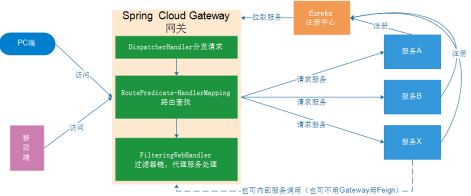

# 1. 系统架构的演变

随着互联网的发展，网站应用的规模不断扩大。需求的激增，带来的是技术上的压力。系统架构也因此也不断的演进、升级、迭代。从单一应用，到垂直拆分，到分布式服务，到SOA，以及现在火热的微服务架构，还有在Google带领下来势汹涌的Service Mesh。

## 1.1 集中式架构

当网站流量很小时，只需一个应用，将所有功能都部署在一起，以减少部署节点和成本


优点：

- 系统开发速度快
- 维护成本比较低
- 适用于并发要求比较低的系统

缺点：

- 代码耦合度高，后期维护困难
- 无法针对不同模块进行针对性优化
- 无法水平扩展
- 单点容错率低，并发能力差

## 1.2 垂直拆分

当访问量逐渐增大，单一应用无法满足需求，此时为了应对更高的并发和业务需求，我们根据业务功能对系统进行拆分：


优点：

- 系统拆分实现了流量分担，解决了并发问题
- 可以针对不同模块进行优化
- 方便水平扩展，负载均衡，容错率提高

缺点：

- 系统间相互独立，会有很多重复开发工作，影响开发效率

## 1.3 分布式服务 

当垂直应用越来越多，应用之间交互不可避免，将核心业务抽取出来，作为独立的服务，逐渐形成稳定的服务中心，使前端应用能更快速的响应多变的市场需求


优点：

- 将基础服务进行了抽取，系统间相互调用，提高了代码复用和开发效率

缺点：

- 系统间耦合度变高，调用关系错综复杂，难以维护

## 1.4 面向服务架构（SOA）

SOA（Service Oriented Architecture）面向服务的架构：**它是一种设计方法，其中包含多个服务**， 服务之间通过相互依赖最终提供一系列的功能。一个服务通常以独立的形式存在与操作系统进程中。各个服务之间 通过网络调用。

SOA结构图：


> ESB（企业服务总线），简单 来说 ESB 就是一根管道，用来连接各个服务节点。为了集 成不同系统，不同协议的服务，ESB 做了消息的转化解释和路由工作，让不同的服务互联互通。

SOA缺点：每个供应商提供的ESB产品有偏差，自身实现较为复杂；应用服务粒度较大，ESB集成整合所有服务和协议、数据转换使得运维、测试部署困难。所有服务都通过一个通路通信，直接降低了通信速度。

## 1.5 微服务架构

微服务架构是使用一套小服务来开发单个应用的方式或途径，每个服务基于单一业务能力构建，运行在自己的进程中，并使用轻量级机制通信，通常是HTTP API，并能够通过自动化部署机制来独立部署。这些服务可以使用不同的编程语言实现，以及不同数据存储技术，并保持最低限度的集中式管理。

微服务结构图：


> API Gateway网关是一个服务器，是系统的唯一入口。为每个客户端提供一个定制的API。API网关核心是，所有的客户端和消费端都通过统一的网关接入微服务，在网关层处理所有的非业务功能。如它还可以具有其它职责，如身份验证、监控、负载均衡、缓存、请求分片与管理、静态响应处理。通常，网关提供RESTful/HTTP的方式访问服务。而服务端通过服务注册中心进行服务注册和管理。

微服务的特点：

- 单一职责：微服务中每一个服务都对应唯一的业务能力，做到单一职责
- 微：微服务的服务拆分粒度很小，例如一个用户管理就可以作为一个服务。每个服务虽小，但“五脏俱全”。
- 面向服务：面向服务是说每个服务都要对外暴露Rest风格服务接口API。并不关心服务的技术实现，做到与平台和语言无关，也不限定用什么技术实现，只要提供Rest的接口即可
- 自治：自治是说服务间互相独立，互不干扰
  - 团队独立：每个服务都是一个独立的开发团队，人数不能过多。
  - 技术独立：因为是面向服务，提供Rest接口，使用什么技术没有别人干涉前后端分离：采用前后端分离开发，提供统一Rest接口，后端不用再为PC、移动端开发不同接口
  - 数据库分离：每个服务都使用自己的数据源
  - 部署独立，服务间虽然有调用，但要做到服务重启不影响其它服务。有利于持续集成和持续交付。每个服务都是独立的组件，可复用，可替换，降低耦合，易维护

微服务架构与SOA都是对系统进行拆分；微服务架构基于SOA思想，可以把微服务当做去除了ESB的SOA。ESB是SOA架构中的中心总线，设计图形应该是星形的，而微服务是去中心化的分布式软件架构。两者比较类似，但其实也有一些差别：

| 功能     | SOA                  | 微服务                         |
| -------- | -------------------- | ------------------------------ |
| 组件大小 | 大块业务逻辑         | 单独任务或小块业务逻辑         |
| 耦合     | 通常松耦合           | 总是松耦合                     |
| 管理     | 着重中央管理         | 着重分散                       |
| 目标     | 确保应用能够交互操作 | 易维护、易扩展、更轻量级的交互 |

# 2. 服务调用的方式

## 2.1 RPC 和 HTTP

无论是微服务还是SOA，都面临着服务间的远程调用。那么服务间的远程调用方式有哪些呢？常见的远程调用方式有以下2种：

- RPC：Remote Produce Call远程过程调用，RPC基于Socket，工作在会话层。自定义数据格式，速度快，效率高。早期的webservice，现在热门的Dubbo，都是RPC的典型代表

- Http：http其实是一种网络传输协议，基于TCP，工作在应用层，规定了数据传输的格式。现在客户端浏览器与服务端通信基本都是采用Http协议，也可以用来进行远程服务调用。缺点是消息封装臃肿，优势是对服务的提供和调用方没有任何技术限定，自由灵活，更符合微服务理念。

  现在热门的Rest风格，就可以通过http协议来

区别：

- RPC的机制是根据语言的API（language API）来定义的，而不是根据基于网络的应用来定义的。

- 如果你们公司全部采用Java技术栈，那么使用Dubbo作为微服务架构是一个不错的选择。

  相反，如果公司的技术栈多样化，而且你更青睐Spring家族，那么Spring Cloud搭建微服务是不二之选。在我们的项目中，会选择Spring Cloud套件，因此会使用Http方式来实现服务间调用。

## 2.2  Http客户端工具

既然微服务选择了Http，那么我们就需要考虑自己来实现对请求和响应的处理。不过开源世界已经有很多的http客户端工具，能够帮助我们做这些事情，例如：

- HttpClient
- OKHttp
- URLConnection

不过这些不同的客户端，API各不相同。**而Spring也有对http的客户端进行封装，提供了工具类叫RestTemplate。**

## 2.3  Spring的RestTemplate

Spring提供了一个RestTemplate**模板工具类**，对基于Http的客户端**进行了封装**，并且实现了对象与json的**序列化和反序列化**，非常方便。RestTemplate并没有限定Http的客户端类型，而是进行了抽象，目前常用的3种都有支持：

- HttpClient
- OkHttp
- JDK原生的URLConnection（默认的）

通过RestTemplate的`getForObject()`方法，传递url地址及实体类的字节码，RestTemplate会自动发起请求，接收响应，并且帮我们对响应结果进行反序列化

# 3. 初识 Spring Cloud

使用Spring Cloud的优势：

- 后台硬：作为Spring家族的一员，有整个Spring全家桶靠山，背景十分强大。

- 术强：Spring作为Java领域的前辈，可以说是功力深厚。有强力的技术团队支撑，一般人还真比不了

- 群众基础好：可以说大多数程序员的成长都伴随着Spring框架，试问：现在有几家公司开发不用Spring？

  Spring Cloud与Spring的各个框架无缝整合，对大家来说一切都是熟悉的配方，熟悉的味道。

- 使用方便：相信大家都体会到了SpringBoot给我们开发带来的便利，而Spring Cloud完全支持Spring Boot的开发，用很少的配置就能完成微服务框架的搭建

## 3.1 Spring Cloud概述

Spring Cloud是Spring旗下的项目之一，官网地址：http://projects.spring.io/spring-clou

Spring最擅长的就是集成，把世界上最好的框架拿过来，集成到自己的项目中。
Spring Cloud也是一样，它将现在非常流行的一些技术整合到一起，实现了诸如：配置管理，服务发现，智能路由，负载均衡，熔断器，控制总线，集群状态等功能；协调分布式环境中各个系统，为各类服务提供模板性配置。其主要涉及的组件包括：

- Eureka：注册中心

- Zuul、Gateway：服务网关
- Ribbon：负载均衡
- Feign：服务调用
- Hystrix或Resilience4j：熔断器


## 3.2 Spring Cloud 的版本说明

Spring Cloud不是一个组件，而是许多组件的集合；它的版本命名比较特殊，是以A到Z的为首字母的一些单词（其实是伦敦地铁站的名字）组成：

## 3.3 Spring Cloud 入门案例

模拟一个服务调用的场景

1. 创建父工程，并导入坐标

   ```xml
   <?xml version="1.0" encoding="UTF-8"?>
   <project xmlns="http://maven.apache.org/POM/4.0.0"
            xmlns:xsi="http://www.w3.org/2001/XMLSchema-instance"
            xsi:schemaLocation="http://maven.apache.org/POM/4.0.0 http://maven.apache.org/xsd/maven-4.0.0.xsd">
       <modelVersion>4.0.0</modelVersion>
   
       <groupId>org.example</groupId>
       <artifactId>Spring_Cloud</artifactId>
       <packaging>pom</packaging>
       <version>1.0-SNAPSHOT</version>
       
       <modules>
           <module>user-Service</module>
           <module>Consumer-demo</module>
           <module>eureka_server</module>
       </modules>
   
       <parent>
           <groupId>org.springframework.boot</groupId>
           <artifactId>spring-boot-starter-parent</artifactId>
           <version>2.1.5.RELEASE</version>
           <relativePath/>
       </parent>
   
       <properties>
           <java.version>1.8</java.version>
           <spring-cloud.version>Greenwich.SR1</spring-cloud.version>
           <mapper.starter.version>2.1.5</mapper.starter.version>
           <mysql.version>8.0.15</mysql.version>
       </properties>
   
       <dependencyManagement>
           <dependencies>
               <!-- springCloud -->
               <dependency>
                   <groupId>org.springframework.cloud</groupId>
                   <artifactId>spring-cloud-dependencies</artifactId>
                   <version>${spring-cloud.version}</version>
                   <type>pom</type>
                   <scope>import</scope>
               </dependency>
               <!-- 通用Mapper启动器 -->
               <dependency>
                   <groupId>tk.mybatis</groupId>
                   <artifactId>mapper-spring-boot-starter</artifactId>
                   <version>${mapper.starter.version}</version>
               </dependency>
               <!-- mysql驱动 -->
               <dependency>
                   <groupId>mysql</groupId>
                   <artifactId>mysql-connector-java</artifactId>
                   <version>${mysql.version}</version>
               </dependency>
           </dependencies>
       </dependencyManagement>
       <dependencies>
           <dependency>
               <groupId>org.projectlombok</groupId>
               <artifactId>lombok</artifactId>
           </dependency>
       </dependencies>
   
       <build>
           <plugins>
               <plugin>
                   <groupId>org.springframework.boot</groupId>
                   <artifactId>spring-boot-maven-plugin</artifactId>
               </plugin>
           </plugins>
       </build>
   </project>
   ```

2. 创建服务提供者模块，并导入坐标

   ```xml
   <artifactId>user-Service</artifactId>
   <dependencies>
       <dependency>
           <groupId>org.springframework.boot</groupId>
           <artifactId>spring-boot-starter-web</artifactId>
       </dependency>
       <dependency>
           <groupId>mysql</groupId>
           <artifactId>mysql-connector-java</artifactId>
       </dependency>
       <dependency>
           <groupId>tk.mybatis</groupId>
           <artifactId>mapper-spring-boot-starter</artifactId>
       </dependency>
   </dependencies>
   ```

3. 创建调用者模块，并导入坐标

   需要注意的是，我们调用 服务提供者模块 的功能，因此不需要mybatis相关依赖了。

   ```xml
   <artifactId>Consumer-demo</artifactId>
   
   <dependencies>
       <dependency>
           <groupId>org.springframework.boot</groupId>
           <artifactId>spring-boot-starter-web</artifactId>
       </dependency>
   </dependencies>
   ```

### 3.3.1 服务提供者

1. 创建SpringBoot的配置文件

   ```yml
   server:
   	# 服务端口
     port: 9091
   
   spring:
   	# 数据库驱动
     datasource:
       driver-class-name: com.mysql.cj.jdbc.Driver
       url: jdbc:mysql://localhost:3306/spring?useSSL=false&serverTimezone=UTC
       username: root
       password: password
   
   # 实体类别名包扫描
   mybatis:
     type-aliases-package: com.it.pojo
   
   ```

   

2. 创建数据表

   ```sql
   DROP TABLE IF EXISTS `tb_user`;
   CREATE TABLE `tb_user` (
     `id` bigint(20) NOT NULL AUTO_INCREMENT,
     `user_name` varchar(100) DEFAULT NULL COMMENT '用户名',
     `password` varchar(100) DEFAULT NULL COMMENT '密码',
     `name` varchar(100) DEFAULT NULL COMMENT '姓名',
     `age` int(10) DEFAULT NULL COMMENT '年龄',
     `sex` tinyint(1) DEFAULT NULL COMMENT '性别，1男性，2女性',
     `birthday` date DEFAULT NULL COMMENT '出生日期',
     `note` varchar(255) DEFAULT NULL COMMENT '备注',
     `created` datetime DEFAULT NULL COMMENT '创建时间',
     `updated` datetime DEFAULT NULL COMMENT '更新时间',
     PRIMARY KEY (`id`),
     UNIQUE KEY `username` (`user_name`)
   ) ENGINE=InnoDB AUTO_INCREMENT=13 DEFAULT CHARSET=utf8;
   
   INSERT INTO `tb_user` VALUES ('1', 'zhangsan', '123456', '张三', '30', '1', '1964-08-08', '张三同学在学Java', '2014-09-19 16:56:04', '2014-09-21 11:24:59');
   INSERT INTO `tb_user` VALUES ('2', 'lisi', '123456', '李四', '21', '2', '1995-01-01', '李四同学在传智学Java', '2014-09-19 16:56:04', '2014-09-19 16:56:04');
   INSERT INTO `tb_user` VALUES ('3', 'wangwu', '123456', '王五', '22', '2', '1994-01-01', '王五同学在学php', '2014-09-19 16:56:04', '2014-09-19 16:56:04');
   ```

   

3. 创建SpringBoot启动类

   注意目录结构，以及启动类的默认扫描路径为：当前包及其子包

   ```java
   @SpringBootApplication
   @MapperScan("com.it.user.mapper") // 扫描mapper
   public class UserApplication {
       public static void main(String[] args) {
           SpringApplication.run(UserApplication.class, args);
       }
   }
   ```

4. 创建实体类

   ```java
   @Data
   @Table(name = "tb_user")
   public class User {
   
       @Id
       // 主键回填
       @KeySql(useGeneratedKeys = true)
       private Long id;
   
       // 用户名
       private String userName;
   
       // 密码
       private String password;
   
       // 姓名
       private String name;
   
       // 年龄
       private Integer age;
   
       // 性别，1男性，2女性
       private Integer sex;
   
       // 出生日期
       private Date birthday;
   
       // 创建时间
       private Date created;
   
       // 更新时间
       private Date updated;
   
       // 备注
       private String note;
   
   }
   ```

5. 编写mapper接口

   注意：这里是`tk`的mapper

   ```java
   import tk.mybatis.mapper.common.Mapper;
   public interface UserMapper extends Mapper<User> {
   }
   ```

6. 编写service代码

   ```java
   @Service
   public class UserService {
   
       // 这里会报错，但是无关紧要，可以运行
       @Autowired
       private UserMapper userMapper;
   
       public User queryById(Long id) {
           return userMapper.selectByPrimaryKey(id);
       }
   }
   
   ```

   

7. 编写Controller代码

   ```java
   @RestController
   @RequestMapping("/user")
   public class UserController {
   
       @Autowired
       private UserService userService;
   
       @RequestMapping("/{id}")
       public User queryById(@PathVariable Long id){
           return userService.queryById(id);
       }
   }
   
   ```

8. 运行启动类并访问：http://localhost:9091/user/2，查看数据输出

### 3.3.2 服务调用者

1. 创建SpringBoot配置文件

   ```yml
   server:
     port: 8080
   ```

2. 创建SpringBoot启动类

   ```java
   @SpringBootApplication
   public class ConsumerApplication {
       public static void main(String[] args) {
           SpringApplication.run(ConsumerApplication.class, args);
       }
   
       @Bean
       public RestTemplate restTemplate(){
           return new RestTemplate();
       }
   }
   ```

3. 创建实体类

   这里不需要进行数据库操作，只是去调用服务，所以只需要实现get和set方法即可，这里使用Lombok的插件注解实现

   ```java
   @Data
   public class User {
       private Long id;
   
       // 用户名
       private String userName;
   
       // 密码
       private String password;
   
       // 姓名
       private String name;
   
       // 年龄
       private Integer age;
   
       // 性别，1男性，2女性
       private Integer sex;
   
       // 出生日期
       private Date birthday;
   
       // 创建时间
       private Date created;
   
       // 更新时间
       private Date updated;
   
       // 备注
       private String note;
   
   }
   ```

4. 编写Controller代码

   ```java
   @RestController
   @RequestMapping("/consumer")
   public class ConsumerController {
   
       @Autowired
       private RestTemplate restTemplate;
   
       @Autowired
       private DiscoveryClient discoveryClient;
   
       @RequestMapping("/{id}")
       public User queryById(@PathVariable Long id){
   		// 这里我们暂时写死。
           String url = "http://localhost:9091/user/"+id;
   
           return restTemplate.getForObject(url, User.class);
       }
   }
   
   ```

5. 启动测试，并访问：http://localhost:8080/consumer/2

### 3.3.3 总结

入门案例中，我们进行了如下模块的开发工作：

- user-service：对外提供了查询用户的接口
- consumer-demo：通过RestTemplate访问 `http://locahost:9091/user/{id} `接口，查询用户数据

仔细思考可以发现存在如下问题：

- 在consumer中，我们把url地址硬编码到了代码中，不方便后期维护
- consumer需要记忆user-service的地址，如果出现变更，可能得不到通知，地址将失效
- consumer不清楚user-service的状态，服务宕机也不知道
- user-service只有1台服务，不具备高可用性
- 即便user-service形成集群，consumer还需自己实现负载均衡

而这些问题也是分布式服务必然要面临的问题：

- 服务管理
  - 如何自动注册和发现
  - 如何实现状态监管
  - 如何实现动态路由
- 服务如何实现负载均衡
- 服务如何解决容灾问题
- 服务如何实现统一配置

以上的问题，都将在SpringCloud中得到答案。

# 4. Eureka注册中心

Eureka是Netflix开发的服务发现框架，本身是一个基于REST的服务，主要用于定位运行在AWS域中的中间层服务，以达到负载均衡和中间层服务故障转移的目的。SpringCloud将它集成在其子项目`spring-cloud-netflix`中，以实现`SpringCloud`的服务发现功能。

Eureka包含两个组件：`Eureka Server`和`Eureka Client`。

Eureka Server提供服务注册服务，各个节点启动后，会在Eureka Server中进行注册，这样Eureka Server中的服务注册表中将会存储所有可用服务节点的信息，服务节点的信息可以在界面中直观的看到。

**Eureka Client是一个java客户端**，用于简化与Eureka Server的交互，客户端同时也就是一个内置的、使用轮询(round-robin)负载算法的负载均衡器。

在应用启动后，将会向Eureka Server发送心跳,默认周期为30秒，如果Eureka Server在多个心跳周期内没有接收到某个节点的心跳，Eureka Server将会从服务注册表中把这个服务节点移除(默认90秒)。

Eureka Server之间通过复制的方式完成数据的同步，Eureka还提供了客户端缓存机制，即使所有的Eureka Server都挂掉，客户端依然可以利用缓存中的信息消费其他服务的API。综上，Eureka通过心跳检查、客户端缓存等机制，确保了系统的高可用性、灵活性和可伸缩性。

基本架构：


- Eureka：就是服务注册中心（可以是一个集群），对外暴露自己的地址
- 提供者：启动后向Eureka注册自己信息（地址，提供什么服务）
- 消费者：向Eureka订阅服务，Eureka会将对应服务的所有提供者地址列表发送给消费者，并且定期更新
- 心跳(续约)：提供者定期通过http方式向Eureka刷新自己的状态

## 4.1 Eureka 入门案例

创建Eureka模块，启动一个Eureka Server Application服务注册中心。

1. 创建Eureka模块，并导入坐标

   ```xml
   <artifactId>eureka_server</artifactId>
   
   <dependencies>
       <dependency>
           <groupId>org.springframework.cloud</groupId>
           <artifactId>spring-cloud-starter-netflix-eureka-server</artifactId>
       </dependency>
   </dependencies>
   ```

2. 编写启动类

   ```java
   //声明当前应用为eureka服务
   @EnableEurekaServer
   @SpringBootApplication
   public class EurekaServerApplication {
       public static void main(String[] args) {
           SpringApplication.run(EurekaServerApplication.class, args);
       }
   }
   ```

3. 编写配置文件

   ```yml
   server:
     port: 10086
   
   spring:
     application:
       # 应用名称
       name: eureka-erver
   
   eureka:
     client:
       service-url:
         # EurekaServer的地址，现在是自己的地址，如果是集群，需要写其它Server的地址。
         defaultZone: http://127.0.0.1:10086/eureka
         register-with-eureka: false # 不注册自己，集群时需要注册自己
         fetch-registry: false #不拉取服务
   ```

4. 启动服务，访问：http://127.0.0.1:10086

   访问地址后就可以看到Eureka的web界面，以及相关状态

### 4.1.1 服务注册

注册服务，就是在服务提供者上添加Eureka的客户端依赖，客户端代码会自动把服务注册到EurekaServer

1. 在服务提供者上添加依赖

   ```xml
   <!-- Eureka客户端 -->
   <dependency>
       <groupId>org.springframework.cloud</groupId>
       <artifactId>spring-cloud-starter-netflix-eureka-client</artifactId>
   </dependency>
   ```

2. 修改启动类

   通过添加` @EnableDiscoveryClient `来开启Eureka客户端

   ```java
   @SpringBootApplication
   @MapperScan("com.it.user.mapper")
   @EnableDiscoveryClient // 开启Eureka客户端发现功能
   public class UserApplication {
       public static void main(String[] args) {
           SpringApplication.run(UserApplication.class, args);
       }
   }
   
   ```

3. 修改配置文件

   ```yml
   server:
     port: 9091
   
   spring:
     datasource:
       driver-class-name: com.mysql.cj.jdbc.Driver
       url: jdbc:mysql://localhost:3306/spring?useSSL=false&serverTimezone=UTC
       username: root
       password: password
   
     application:
         # 指定应用名称，将来会作为服务的id使用
         name: user-service
   
   
   mybatis:
     type-aliases-package: com.it.pojo
   
   eureka:
     client:
       service-url:
        # 指定Eurela注册中心地址
         defaultZone: http://127.0.0.1:10086/eureka
   ```

4. 启动服务提供者模块，访问Eureka监控页面，查看显示

### 4.1.1 服务发现

接下来我们修改服务调用者模块 ，尝试从EurekaServer获取服务，方法与服务提供者类似，只需要在项目中添加Eureka Client依赖，就可以通过服务名称来获取信息了

1. 在服务调用者模块中添加依赖

   ```xml
   <!-- Eureka客户端 -->
   <dependency>
       <groupId>org.springframework.cloud</groupId>
       <artifactId>spring-cloud-starter-netflix-eureka-client</artifactId>
   </dependency>
   ```

2. 修改启动类，开启Eureka客户端

   ```java
   @SpringBootApplication
   @EnableEurekaClient
   public class ConsumerApplication {
       public static void main(String[] args) {
           SpringApplication.run(ConsumerApplication.class, args);
       }
   
       @Bean
       public RestTemplate restTemplate(){
           return new RestTemplate();
       }
   }
   
   ```

3. 修改配置文件

   ```yml
   server:
     port: 8080
   spring:
     application:
       name: consumer-demo # 应用名称
   eureka:
     client:
       service-url: # EurekaServer地址
         defaultZone: http://127.0.0.1:10086/eureka
   ```

4. 修改controller类

   ```java
   package com.it.controller;
   
   
   import com.it.pojo.User;
   import org.springframework.beans.factory.annotation.Autowired;
   import org.springframework.cloud.client.ServiceInstance;
   import org.springframework.cloud.client.discovery.DiscoveryClient;
   import org.springframework.web.bind.annotation.PathVariable;
   import org.springframework.web.bind.annotation.RequestMapping;
   import org.springframework.web.bind.annotation.RestController;
   import org.springframework.web.client.RestTemplate;
   
   import java.util.List;
   
   /**
    * @Class:Spring_Cloud.com.it.controller.ConsumerController
    * @Descript:
    * @Author:宋天
    * @Date:2020/10/6
    */
   @RestController
   @RequestMapping("/consumer")
   public class ConsumerController {
   
       @Autowired
       private RestTemplate restTemplate;
   
       @Autowired
       private DiscoveryClient discoveryClient;
   
       @RequestMapping("/{id}")
       public User queryById(@PathVariable Long id){
   
   //        String url = "http://localhost:9091/user/"+id;
   
           // 获取eureka中注册的user-service实例列表
           List<ServiceInstance> userEureka = discoveryClient.getInstances("user_eureka");
           // 根据index获取对应实例
           ServiceInstance instance = userEureka.get(0);
           String url = "http://" + instance.getHost()+":" + instance.getPort() +"/user/" + id;
   
   
           return restTemplate.getForObject(url, User.class);
       }
   }
   
   ```

5. 重启服务提供者模块，查看能够正确输出内容

    http://localhost:8080/consumer/1

## 4.2 Eureka详解

### 4.2.1 基础架构

Eureka架构中的三个核心角色：

- 服务注册中心

  Eureka的服务端应用，提供服务注册和发现功能，就是刚刚我们建立的eureka-server

- 服务提供者

  提供服务的应用，可以是SpringBoot应用，也可以是其它任意技术实现，只要对外提供的是Rest风格服务即可。本例中就是我们实现的user-service

- 服务消费者
  消费应用从注册中心获取服务列表，从而得知每个服务方的信息，知道去哪里调用服务方。本例中就是我们实现的consumer-demo

### 4.2.2 高可用的Eureka Server

事实上EurekaServer也可以是一个集群，形成高可用的Eureka中心。

服务同步：

> 多个Eureka Server之间也会互相注册为服务，当服务提供者注册到Eureka Server集群中的某个节点时，该节点会把服务的信息同步给集群中的每个节点，从而实现数据同步。因此，无论客户端访问到Eureka Server集群中的任意个节点，都可以获取到完整的服务列表信息。

而作为客户端，需要把信息注册到每个Eureka中：

如果有三个Eureka，则每一个EurekaServer都需要注册到其它几个Eureka服务中，例如：有三个分别为10086、10087、10088，则：

- 10086要注册到10087和10088上
- 10087要注册到10086和10088上
- 10088要注册到10086和10087上

搭建步骤：

我们假设要搭建两台EurekaServer的集群，端口分别为：10086和10087

1. 修改Eureka注册中心配置文件

   ```yml
   server:
   #  port: 10086
   # 高可用配置
     port: ${port:10086}
   
   spring:
     application:
       # 应用名称
       name: eureka-erver
   
   eureka:
     client:
       service-url:
         # EurekaServer的地址，现在是自己的地址，如果是集群，需要写其它Server的地址。
   #      defaultZone: http://127.0.0.1:10086/eureka
   
       # 高可用配置
         defaultZone: ${defaultZone:http://127.0.0.1:10086/eureka}
   
   #      register-with-eureka: false # 不注册自己，集群时需要注册自己
   #      fetch-registry: false #不拉取服务
   ```

   所谓的高可用注册中心，其实就是把EurekaServer自己也作为一个服务，注册到其它EurekaServer上，这样多个EurekaServer之间就能互相发现对方，从而形成集群。因此我们做了以下修改：

   - 把`register-with-eureka`和`fetch-registry`修改为true或者注释掉
   - `${}`表示在jvm启动时候若能找到对应port或者defaultZone参数则使用，若无则使用后面的默认值

2. 配置注册中心启动项

   1. 修改原本的Eureka注册中心启动项，并更名为Eureka 10086

      设置VM options参数

      ```
      -DdefaultZone=http:127.0.0.1:10087/eureka -Dport10086
      ```

      > 说明：10086向10087进行注册

   2. 复制一份启动项，更名为Eureka 10087

      设置VM options参数

      ```
      -DdefaultZone=http:127.0.0.1:10086/eureka -Dport10087
      ```

      > 说明：10087向10086进行注册

3. 启动测试Eureka，同时启动两个Eureka注册中心

   此时，可以看到Eureka管理界面显示有两个EUREKA-SERVER

4. 客户端注册服务到集群

   因为EurekaServer不止一个，因此 服务提供者 项目注册服务或者 服务调用者 获取服务的时候，service-url参数需要修改为如下：

   ```yml
   eureka:
     client:
       service-url:
       	# EurekaServer地址,多个地址以','隔开
         defaultZone: : http://127.0.0.1:10086/eureka,http://127.0.0.1:10087/eureka
   ```

## 4.3 Eureka 客户端

服务提供者要向EurekaServer注册服务，并且完成服务续约等工作。

**服务注册：**

服务提供者在启动时，会检测配置属性中的：` eureka.client.register-with-erueka=true `参数是否正确，事实上默认就是true。如果值确实为true，则会向EurekaServer发起一个Rest请求，并携带自己的元数据信息，EurekaServer会把这些信息保存到一个双层Map结构中

- 第一层Map的Key就是服务id，一般是配置中的 `spring.application.name `属性
- 第二层Map的key是服务的实例id。一般`host+ serviceId + port`，例如：` localhost:user-service:8081`
- 值则是服务的实例对象，也就是说一个服务，可以同时启动多个不同实例，形成集群。

默认注册时使用的是主机名或者localhost，如果想用`ip`进行注册，可以在 user-service 中添加配置如下：

```yml
eureka:
    instance: # 默认使用主机名进行注册服务，可以使用如下更改为ip
        ip-address: 127.0.0.1 # ip地址
        prefer-ip-address: true # 更倾向于使用ip，而不是host
```

修改完后先后重启 user-service 和 consumer-demo ；在调用服务的时候就已经变成 `ip`地址；需要注意的是：不是在eureka中的控制台服务实例状态显示。

**服务续约：**

在注册服务完成以后，服务提供者会维持一个心跳（定时向EurekaServer发起Rest请求），告诉EurekaServer：“我还活着”。这个我们称为服务的续约（renew）；

有两个重要参数可以修改服务续约的行为；可以在 user-service (服务提供者)中添加如下配置项：

```yml
 eureka:
    instance:
        lease-expiration-duration-in-seconds: 90 # 服务续约的间隔 默认为30秒
        lease-renewal-interval-in-seconds: 30 # 服务失效时间，默认值90秒
```

说明：

- `lease-renewal-interval-in-seconds：`服务续约(renew)的间隔，默认为30秒
- `lease-expiration-duration-in-seconds：`服务失效时间，默认值90秒

也就是说，默认情况下每隔30秒服务会向注册中心发送一次心跳，证明自己还活着。如果超过90秒没有发送心跳，EurekaServer就会认为该服务宕机，会定时`（eureka.server.eviction-interval-timer-in-ms设定的时间）`从服务列表中移除，这两个值在生产环境不要修改，默认即可。

**获取服务列表：**

当服务消费者启动时，会检测`eureka.client.fetch-registry=true` 参数的值，如果为true，则会从EurekaServer服务的列表拉取只读备份，然后缓存在本地。并且 每隔30秒 会重新拉取并更新数据。可以在 consumer-demo项目中通过下面的参数来修改：

```yml
eureka:
    client:
        registry-fetch-interval-seconds: 30
```

## 4.4 失效剔除和自我保护

如下的配置都是在Eureka Server服务端进行：

**服务下线：**

当服务进行正常关闭操作时，它会触发一个服务下线的REST请求给Eureka Server，告诉服务注册中心：“我要下线了”。服务中心接受到请求之后，将该服务置为下线状态。

**失效剔除：**

有时我们的服务可能由于内存溢出或网络故障等原因使得服务不能正常的工作，而服务注册中心并未收到“服务下线”的请求。相对于服务提供者的“服务续约”操作，服务注册中心在启动时会创建一个定时任务，默认每隔一段时间（默认为60秒）将当前清单中超时（默认为90秒）没有续约的服务剔除，这个操作被称为失效剔除。

可以通过 `eureka.server.eviction-interval-timer-in-ms `参数对其进行修改，单位是毫秒。

**自我保护：**

我们关停一个服务，很可能会在Eureka面板看到一条警告：

```
EMERGENCY! EUREKA MAY BE INCORRECTLY CLAIMING INSTANCES ARE UP WHEN THEY'RE NOT. RENEWALS ARE LESSER THAN THRESHOLD AND HENCE THE INSTANCES ARE NOT BEING EXPIRED JUST TO BE SAFE.

紧急！ 如果不是，EUREKA可能会不正确地提出索赔要求。 续订比阈值要少，因此不再只是为了安全起见而立即终止实例。
```

这是触发了Eureka的自我保护机制。当服务未按时进行心跳续约时，Eureka会统计服务实例最近15分钟心跳续约的比例是否低于了85%。在生产环境下，因为网络延迟等原因，心跳失败实例的比例很有可能超标，但是此时就把服务剔除列表并不妥当，因为服务可能没有宕机。Eureka在这段时间内不会剔除任何服务实例，直到网络恢复正常。生产环境下这很有效，保证了大多数服务依然可用，不过也有可能获取到失败的服务实例，因此服务调用者必须做好服务的失败容错。

可以通过下面的配置来关停自我保护：

```yml
eureka:
    server:
		enable-self-preservation: false # 关闭自我保护模式（缺省为打开）
```

# 5. 负载均衡Ribbon

在之前的案例中，我们启动了一个 user-service（服务提供者） ，然后通过`DiscoveryClient`来获取服务实例信息，然后获取`ip`和端口来访问。

但是实际环境中，往往会开启很多个 user-service 的集群。此时获取的服务列表中就会有多个，到底该访问哪一个呢？

一般这种情况下就需要编写负载均衡算法，在多个实例列表中进行选择。不过**Eureka中已经集成了负载均衡组件：Ribbon**，简单修改代码即可使用。

什么是Ribbon：

> Ribbon是Netflix发布的负载均衡器，它有助于控制HTTP和TCP客户端的行为。为Ribbon配置服务提供者地址列表后，Ribbon就可以基于某种负载均衡算法，自动地帮助服务消费者去请求。Ribbon默认为我们提供了很多的负载均衡算法，例如：轮询，随机等，当然，我们也可以为Ribbon实现自定义的负载均衡算法。

测试负载均衡：

1. 启动两个服务提供者实例，一个9091，一个9092

   可以利用`${port: 9092}`，然后修改VM options完成

2. 开启负载均衡

   因为Eureka中已经集成了Ribbon，所以我们无需引入新的依赖。直接修改服务调用者启动类即可

   在RestTemplate的配置方法上添加` @LoadBalanced `注解：

   ```java
   @SpringBootApplication
   @EnableEurekaClient
   public class ConsumerApplication {
       public static void main(String[] args) {
           SpringApplication.run(ConsumerApplication.class, args);
       }
   
       @Bean
       @LoadBalanced
       public RestTemplate restTemplate(){
           return new RestTemplate();
       }
   }
   ```

   再修改Controller类

   ```java
   @RestController
   @RequestMapping("/consumer")
   public class ConsumerController {
   
       @Autowired
       private RestTemplate restTemplate;
   
       @Autowired
       private DiscoveryClient discoveryClient;
   
       @RequestMapping("/{id}")
       public User queryById(@PathVariable Long id){
   
           // 负载均衡，直接通过服务名称调用
           /**
            * 在执行RestTemplate发送服务地址请求的时候，使用负载均衡拦截器拦截，根据服务名称获取服务地址列表，
            * 使用Ribbon负载均衡算法从服务器地址列表中选择一个服务地址，访问该地址获取服务
            */
           String url =  "http://user-service/user/"+id;
           return restTemplate.getForObject(url, User.class);
       }
   }
   
   ```

   访问页面，查看结果；并可以在9091和9092的控制台查看执行情况：

**了解**：Ribbon默认的负载均衡策略是轮询。SpringBoot也帮提供了修改负载均衡规则的配置入口在consumer-demo的配置文件中添加如下，就变成随机的了：

```yml
user-service:
    ribbon:
    	NFLoadBalancerRuleClassName: com.netflix.loadbalancer.RandomRule
```

格式是：` {服务名称}.ribbon.NFLoadBalancerRuleClassNa`

**负载均衡源码跟踪：**

为什么只输入了service名称就可以访问了呢？之前还要获取ip和端口。

显然是有组件根据service名称，获取到了服务实例的`ip`和端口。因为 consumer-demo 使用的是RestTemplate，spring的负载均衡自动配置类`LoadBalancerAutoConfiguration.LoadBalancerInterceptorConfig`会自动配置负载均衡拦截器（在`spring-cloud-commons-**.jar`包中的`spring.factories`中定义的自动配置类）， 它就是
`LoadBalancerInterceptor `，这个类会在对RestTemplate的请求进行拦截，然后从Eureka根据服务id获取服务列表，随后利用负载均衡算法得到真实的服务地址信息，替换服务id。

我们进行源码跟踪：


继续跟入execute方法：发现获取了9092端口的服务


再跟下一次，发现获取的是9091、9092之间切换：


多次访问 consumer-demo 的请求地址；然后跟进代码，发现其果然实现了负载均衡

# 6. 熔断器Hystrix

Hystrix 在英文里面的意思是 豪猪，它的logo 看下面的图是一头豪猪，它在微服务系统中是一款提供保护机制的组件，和eureka一样也是由netflix公司开发。

主页：https://github.com/Netflix/Hystrix/

那么Hystrix的作用是什么呢？具体要保护什么呢？

> Hystrix是Netflix开源的一个延迟和容错库，用于隔离访问远程服务、第三方库，防止出现级联失败。

## 6.1 雪崩问题

微服务中，服务间调用关系错综复杂，一个请求，可能需要调用多个微服务接口才能实现，会形成非常复杂的调用链路：


如图，一次业务请求，需要调用A、P、H、I四个服务，这四个服务又可能调用其它服务。

如果此时，某个服务出现异常：


例如： 微服务I 发生异常，请求阻塞，用户请求就不会得到响应，则tomcat的这个线程不会释放，于是越来越多的用户请求到来，越来越多的线程会阻塞：


服务器支持的线程和并发数有限，请求一直阻塞，会导致服务器资源耗尽，从而导致所有其它服务都不可用，形成雪崩效应。

这就好比，一个汽车生产线，生产不同的汽车，需要使用不同的零件，如果某个零件因为种种原因无法使用，那么就会造成整台车无法装配，陷入等待零件的状态，直到零件到位，才能继续组装。  此时如果有很多个车型都需要这个零件，那么整个工厂都将陷入等待的状态，导致所有生产都陷入瘫痪。一个零件的波及范围不断扩大。

Hystrix解决雪崩问题的手段主要是服务降级，包括：

- 线程隔离
- 服务熔断

## 6.2 线程隔离&服务降级

线程隔离示意图：


解读：

- Hystrix为每个依赖服务调用分配一个小的线程池，如果线程池已满调用将被立即拒绝，默认不采用排队，加速失败判定时间

- 用户的请求将不再直接访问服务，而是通过线程池中的空闲线程来访问服务，如果线程池已满，或者请求超时，则会进行降级处理，什么是服务降级？

  > 服务降级：优先保证核心服务，而非核心服务不可用或弱可用

用户的请求故障时，不会被阻塞，更不会无休止的等待或者看到系统崩溃，至少可以看到一个执行结果（例如返回友好的提示信息） 。

**服务降级虽然会导致请求失败，但是不会导致阻塞，而且最多会影响这个依赖服务对应的线程池中的资源，对其它服务没有响应。**

触发Hystrix服务降级的情况：

- 线程池已满
- 请求超时

## 6.3 测试熔断

1. 在消费调用模块中导入如下坐标

   ```xml
   <!--熔断器-->
   <dependency>
       <groupId>org.springframework.cloud</groupId>
       <artifactId>spring-cloud-starter-netflix-hystrix</artifactId>
   </dependency>
   ```

2. 开启熔断

   在启动类` ConsumerApplication `上添加注解：`@EnableCircuitBreaker`

   ```java
   @SpringBootApplication
   @EnableEurekaClient
   @EnableCircuitBreaker
   public class ConsumerApplication {
   	.....
   }
   ```

   可以看到，我们类上的注解越来越多，在微服务中，经常会引入上面的三个注解，于是Spring就提供了一个组合注解：` @SpringCloudApplication`

   ```java
   @SpringCloudApplication
   public class ConsumerApplication {
   }
   ```

3. 编写降级逻辑

   当目标服务的调用出现故障，我们希望快速失败，给用户一个友好提示。因此需要提前编写好失败时的降级处理逻辑，要使用`HystrixCommand`来完成。

   改造服务调用者的Controller类，如下：

   ```java
   @RestController
   @RequestMapping("/consumer")
   @Slf4j
   public class ConsumerController {
   
       @Autowired
       private RestTemplate restTemplate;
   
       @Autowired
       private DiscoveryClient discoveryClient;
   
       @RequestMapping("/{id}")
       @HystrixCommand(fallbackMethod = "queryByIdFallback")
       public String queryById(@PathVariable Long id){
   
           // 负载均衡，直接通过服务名称调用
           /**
            * 在执行RestTemplate发送服务地址请求的时候，使用负载均衡拦截器拦截，根据服务名称获取服务地址列表，
            * 使用Ribbon负载均衡算法从服务器地址列表中选择一个服务地址，访问该地址获取服务
            */
           String url =  "http://user-service/user/"+id;
           return restTemplate.getForObject(url, String.class);
       }
   
       public String queryByIdFallback(Long id){
           log.error("查询用户信息失败。id：{}", id);
           return "对不起，网络太拥挤了！";
       }
   }
   ```

   **注意**：因为熔断的降级逻辑方法必须跟正常逻辑方法保证：**相同的参数列表和返回值声明。**

   失败逻辑中返回User对象没有太大意义，一般会返回友好提示。所以把`queryById`的方法改造为返回String，反正也是Json数据。这样失败逻辑中返回一个错误说明，会比较方便

   **说明：**

   `@HystrixCommand(fallbackMethod = "queryByIdFallBack")`：用来声明一个降级逻辑的方法

4. 测试：

   当 user-service 正常提供服务时，访问与以前一致。但是当将 user-service 停机时，会发现页面返回了降级处理信息

## 6.4 默认的 FallBack

上面的案例把fallback写在了某个业务方法上，如果这样的方法很多，那岂不是要写很多。所以可以把Fallback配置加在类上，实现默认fallback；

再次改造服务调用者的Controller类，如下：

```java
@RestController
@RequestMapping("/consumer")
@Slf4j
@DefaultProperties(defaultFallback = "defaultFallback")
public class ConsumerController {

    @Autowired
    private RestTemplate restTemplate;

    @Autowired
    private DiscoveryClient discoveryClient;

    @RequestMapping("/{id}")
//    @HystrixCommand(fallbackMethod = "queryByIdFallback")
    @HystrixCommand
    public String queryById(@PathVariable Long id){
        // 负载均衡，直接通过服务名称调用
        /**
         * 在执行RestTemplate发送服务地址请求的时候，使用负载均衡拦截器拦截，根据服务名称获取服务地址列表，
         * 使用Ribbon负载均衡算法从服务器地址列表中选择一个服务地址，访问该地址获取服务
         */
        String url =  "http://user-service/user/"+id;
        return restTemplate.getForObject(url, String.class);
    }

    public String queryByIdFallback(Long id){
        log.error("查询用户信息失败。id：{}", id);
        return "对不起，网络太拥挤了！";
    }

    public String defaultFallback(){
        return "默认提示：对不起，网络太拥挤了！";
    }
}

```

`@DefaultProperties(defaultFallback = "defaultFallBack")`：在类上指明统一的失败降级方法；**该类中所有方法返回类型要与处理失败的方法的返回类型一致。**

## 6.5 超时设置

在之前的案例中，请求在超过1秒后都会返回错误信息，这是因为**Hystrix的默认超时时长为1**，我们可以通过配置修改这个值；

修改消费调用模块的配置文件，添加如下配置：

```yml
hystrix:
    command:
        default:
            execution:
                isolation:
                    thread:
                        timeoutInMilliseconds: 2000
```

这个配置会作用于全局所有方法。为了方便复制到yml配置文件中，可以复制
`hystrix.command.default.execution.isolation.thread.timeoutInMilliseconds=2000 `到yml文件中会自动格式化后再进行修改。

为了触发超时，可以在服务提供者的UserService.java 的方法中休眠2秒；

```java
@RestController
@RequestMapping("/user")
public class UserController {

    @Autowired
    private UserService userService;

    @RequestMapping("/{id}")
    public User queryById(@PathVariable Long id){
        try {
            Thread.sleep(2000);
        } catch (InterruptedException e) {
            e.printStackTrace();
        }

        return userService.queryById(id);
    }
}

```

## 6.6  服务熔断

### 6.6.1 熔断原理

在服务熔断中，使用的熔断器，也叫断路器，其英文单词为：Circuit Breaker

熔断机制与家里使用的电路熔断原理类似；当如果电路发生短路的时候能立刻熔断电路，避免发生灾难。在分布式系统中应用服务熔断后；服务调用方可以自己进行判断哪些服务反应慢或存在大量超时，可以针对这些服务进行主动熔断，防止整个系统被拖垮。

Hystrix的服务熔断机制，可以实现弹性容错；当服务请求情况好转之后，可以自动重连。通过断路的方式，将后续请求直接拒绝，一段时间（默认5秒）之后允许部分请求通过，如果调用成功则回到断路器关闭状态，否则继续打开，拒绝请求的服务。

Hystrix的熔断状态机模型：


状态机有3个状态：

- Closed：关闭状态（断路器关闭），所有请求都正常访问。
- Open：打开状态（断路器打开），所有请求都会被降级。Hystrix会对请求情况计数，当一定时间内失败请求百分比达到阈值，则触发熔断，断路器会完全打开。默认失败比例的阈值是50%，请求次数最少不低于20次。
- Half Open：半开状态，不是永久的，断路器打开后会进入休眠时间（默认是5S）。随后断路器会自动进入半开状态。此时会释放部分请求通过，若这些请求都是健康的，则会关闭断路器，否则继续保持打开，再次进行休眠计时

### 6.6.2 熔断测试

为了能够精确控制请求的成功或失败，在 消费者调用模块的处理器业务方法中加入一段逻辑；

```java
@RestController
@RequestMapping("/consumer")
@Slf4j
@DefaultProperties(defaultFallback = "defaultFallback")
public class ConsumerController {

    @Autowired
    private RestTemplate restTemplate;

    @Autowired
    private DiscoveryClient discoveryClient;

    @RequestMapping("/{id}")
    @HystrixCommand
    public String queryById(@PathVariable Long id){
        
        if(id == 1){
            throw new RuntimeException("太忙了");
        }
        
        String url =  "http://user-service/user/"+id;
        return restTemplate.getForObject(url, String.class);
    }

    public String queryByIdFallback(Long id){
        log.error("查询用户信息失败。id：{}", id);
        return "对不起，网络太拥挤了！";
    }

    public String defaultFallback(){
        return "默认提示：对不起，网络太拥挤了！";
    }
}

```

这样如果参数是id为1，一定失败，其它情况都成功。（不要忘了清空user-service中的休眠逻辑）

我们准备两个请求窗口：

- 一个请求：http://localhost:8080/consumer/1，注定失败
- 一个请求：http://localhost:8080/consumer/2，肯定成功

当我们疯狂访问id为1的请求时（超过20次），就会触发熔断。断路器会打开，一切请求都会被降级处理。

此时你访问id为2的请求，会发现返回的也是失败，而且失败时间很短，只有20毫秒左右；因进入半开状态之后2是可以的

不过，默认的熔断触发要求较高，休眠时间窗较短，为了测试方便，我们可以通过配置修改熔断策略：

```yml
# 配置熔断策略：
hystrix:
  command:
    default:
      circuitBreaker:
        errorThresholdPercentage: 50 # 触发熔断错误比例阈值，默认值50%
        sleepWindowInMilliseconds: 10000 # 熔断后休眠时长，默认值5秒
        requestVolumeThreshold: 10 # 熔断触发最小请求次数，默认值是20
      execution:
        isolation:
          thread:
             timeoutInMilliseconds: 2000
```

# 7. Feign

上面已经学习了，可以通过使用Ribbon的负载均衡功能，简化远程调用时的代码：

```java
String url = "http://user-service/user/" + id;
User user = this.restTemplate.getForObject(url, User.class)
```

但是存在一个问题：如果以后需要大量编写这样的代码呢？那么如何对此进行优化？

答案：可以通过Feign可以把Rest的请求进行隐藏，伪装成类似SpringMVC的Controller一样。你不用再自己拼接url，拼接参数等等操作，一切都交给Feign去做。

Feign也叫伪装

项目主页：https://github.com/OpenFeign/feign

## 7.1 入门案例

1. 在消费者模块中导入Feign坐标

   ```xml
   <!--Feign-->
   <dependency>
       <groupId>org.springframework.cloud</groupId>
       <artifactId>spring-cloud-starter-openfeign</artifactId>
   </dependency>
   ```

2. 编写Feign的客户端

   ```java
   // 声明当前类是一个Feign客户端，指定服务名称为user-service
   @FeignClient(value = "user-service")
   public interface UserClient {
   
       // http://user-service/user/2
       @RequestMapping("/user/{id}")
       User queryById(@PathVariable Long id);
   
   }
   ```

   说明：

   - 首先这是一个接口，Feign会通过动态代理，帮我们生成实现类。这点跟mybatis的mapper很像
   - `@FeignClient` ，声明这是一个Feign客户端，同时通过 value 属性指定服务名称
   - 接口中的定义方法，完全采用SpringMVC的注解，Feign会根据注解帮我们生成URL，并访问获取结果
   - `@RequestMapping`中的`/user`，请不要忘记；因为Feign需要拼接可访问的地址

3. 编写新的Controller类

   ```java
   @RestController
   @RequestMapping("/feign")
   public class ConsumerFeignController {
   
       @Autowired
       private UserClient userClient;
   
       @RequestMapping("/{id}")
       public User QueryById(@PathVariable Long id){
           return userClient.queryById(id);
       }
   }
   
   ```

4. 开启Feign功能

   在消费者模块的启动类上添加注解，开启Feign功能

   ```java
   @SpringCloudApplication
   @EnableFeignClients // 开启Feign功能
   public class ConsumerApplication {
       public static void main(String[] args) {
           SpringApplication.run(ConsumerApplication.class, args);
       }
   
       @Bean
       @LoadBalanced
       public RestTemplate restTemplate(){
           return new RestTemplate();
       }
   }
   
   ```

   > Feign中已经自动集成了Ribbon负载均衡，因此不需要自己定义RestTemplate进行负载均衡的配置。

5. 测试

   访问接口：http://localhost:8080/feign/2，查看输出内容

## 7.2 负载均衡

说明：Feign中本身已经集成了Ribbon依赖和自动配置，因此不需要额外引入依赖，也不需要再注册 RestTemplate 对象

- Feign内置的ribbon默认设置了请求超时时长，默认是1000，我们可以通过手动配置来修改这个超时时长：

  ```yml
  ribbon:
    ConnectTimeout: 1000 # 连接超时时长
    ReadTimeout: 2000 # 数据通信超时时长
  ```

- 因为ribbon内部有重试机制，一旦超时，会自动重新发起请求。如果不希望重试，可以添加配置：

  ```yml
  ribbon:
    ConnectTimeout: 1000 # 连接超时时长
    ReadTimeout: 2000 # 数据通信超时时长
    MaxAutoRetries: 0 # 当前服务器的重试次数
    MaxAutoRetriesNextServer: 0 # 重试多少次服务
    OkToRetryOnAllOperations: false # 是否对所有的请求方式都重试
  ```

  > 重新给` UserService`的方法设置上线程沉睡时间2秒可以测试上述配置

## 7.3 Hystrix支持

Feign默认也有对Hystrix（熔断器）的集成，只不过，默认情况下是关闭的。需要通过下面的参数来开启；

```yml
feign:
  hystrix:
    enabled: true # 开启Feign的熔断功能
```

但是，Feign中的Fallback配置不像Ribbon中那样简单了。

1. 首先需要定义一个类，实现刚才编写的`UserFeignClient`，作为fallback的处理类

   ```java
   @Component
   public class UserFeignFallBack implements UserClient {
   
       @Override
       public User queryById(Long id) {
           User user = new User();
           user.setId(id);
           user.setName("用户异常");
           return user;
       }
   }
   
   ```

2. 然后在`UserFeignClient`中，指定刚才编写的实现类

   ```java
   // 声明当前类是一个Feign客户端，指定服务名称为user-service
   @FeignClient(value = "user-service",fallback = UserFeignFallBack.class)
   public interface UserClient {
   
       // http://user-service/user/2
       @RequestMapping("/user/{id}")
       User queryById(@PathVariable Long id);
   
   }
   
   ```

3. 重启测试

   重启启动 consumer-demo 并关闭 user-service 服务，然后在页面访问：http://localhost:8080/feign/8

## 7.4 请求压缩

Spring Cloud Feign 支持对请求和响应进行GZIP压缩，以减少通信过程中的性能损耗。通过下面的参数即可开启请求与响应的压缩功能：

```yml
feign:
  compression:
    request:
      enabled: true # 开启请求压缩
    response:
      enabled: true # 开启响应压缩
```

同时，我们也可以对请求的数据类型，以及触发压缩的大小下限进行设置：

```yml
feign:
  compression:
    request:
      enabled: true # 开启请求压缩
      mime-types: text/html,application/xml,application/json # 设置压缩的数据类型
      min-request-size: 2048 # 设置触发压缩的大小下限
```

注：上面的数据类型、压缩大小下限均为默认值。

## 7.5 日志级别

前面讲过，通过` logging.level.xx=debug `来设置日志级别。然而这个对Feign客户端而言不会产生效果。因为`@FeignClient` 注解修改的客户端在被代理时，都会创建一个新的`Feign.Logger`实例。我们需要额外指定这个日志的级别才可以

1. 设置在消费者模块的配置文件中设置`com.it`包下的日志级别都为 debug

   ```yml
   logging:
     level:
       com.it: debug
   ```

2. 在消费者模块中编写`FeignConfig`配置类，定义日志级别

   ```java
   @Configuration
   public class FeignConfig {
   
       @Bean
       Logger.Level feignLoggerLevel(){
           // 记录所有的请求和响应的明细，包括头信息、请求体、元数据
           return Logger.Level.FULL;
       }
   }
   
   ```

   这里指定的Level级别是FULL，Feign支持4种级别：

   - NONE：不记录任何日志信息，这是默认值。
   - BASIC：仅记录请求的方法，URL以及响应状态码和执行时间
   - HEADERS：在BASIC的基础上，额外记录了请求和响应的头信息
   - FULL：记录所有请求和响应的明细，包括头信息、请求体、元数据。

3. 在消费者模块的` UserClient `接口类上的`@FeignClient`注解中指定配置类：

   ```java
   // 声明当前类是一个Feign客户端，指定服务名称为user-service
   @FeignClient(value = "user-service",fallback = UserFeignFallBack.class,configuration = FeignConfig.class)
   public interface UserClient {
   
       // http://user-service/user/2
       @RequestMapping("/user/{id}")
       User queryById(@PathVariable Long id);
   
   }
   
   ```

4. 重启项目，访问：http://localhost:8080/feign/8 ；即可看到每次访问的日志

# 8. Spring Cloud Gateway 网关

- Spring Cloud Gateway是Spring官网基于Spring 5.0、 Spring Boot 2.0、Project Reactor等技术开发的网关服务。
- Spring Cloud Gateway基于Filter链提供网关基本功能：安全、监控／埋点、限流等。
- Spring Cloud Gateway为微服务架构提供简单、有效且统一的API路由管理方式。
- Spring Cloud Gateway是替代Netflix Zuul的一套解决方案。

Spring Cloud Gateway组件的核心是一系列的过滤器，通过这些过滤器可以将客户端发送的请求转发（路由）到对应的微服务。 Spring Cloud Gateway是加在整个微服务最前沿的防火墙和代理器，隐藏微服务结点IP端口信息，从而加强安全保护。Spring Cloud Gateway本身也是一个微服务，需要注册到Eureka服务注册中心。

**网关的核心功能是：过滤和路由**

Gateway 加入之后的Spring Cloud架构：



> 不管是来自于客户端（PC或移动端）的请求，还是服务内部调用。一切对服务的请求都可经过网关，然后再由网关来实现 鉴权、动态路由等等操作。Gateway就是我们服务的统一入口。

**核心概念：**

- **路由（route）**： 路由信息的组成：由一个ID、一个目的URL、一组断言工厂、一组Filter组成。如果路由断言为真，说明请求URL和配置路由匹配。
- **断言（Predicate）**： Spring Cloud Gateway中的断言函数输入类型是Spring 5.0框架中的
  ServerWebExchange。Spring Cloud Gateway的断言函数允许开发者去定义匹配来自于Http Request中的任何信息比如请求头和参数。
- **过滤器（Filter）**： 一个标准的Spring WebFilter。 Spring Cloud Gateway中的Filter分为两种类型的Filter，分别是Gateway Filter和Global Filter。过滤器Filter将会对请求和响应进行修改处理。

## 8.1 入门案例

1. 创建gateway模块，并导入坐标

   ```xml
   <dependencies>
       <dependency>
           <groupId>org.springframework.cloud</groupId>
           <artifactId>spring-cloud-starter-gateway</artifactId>
       </dependency>
       <dependency>
           <groupId>org.springframework.cloud</groupId>
           <artifactId>spring-cloud-starter-netflix-eureka-client</artifactId>
       </dependency>
   </dependencies>
   ```

2. 创建启动类

   ```java
   @SpringBootApplication
   @EnableDiscoveryClient
   public class GatewayApplication {
       public static void main(String[] args) {
           SpringApplication.run(GatewayApplication.class, args);
       }
   }
   
   ```

3. 编写配置文件

   ```yml
   server:
       port: 10010
   spring:
   	application:
   		name: api-gateway
   eureka:
       client:
       	service-url:
       		defaultZone: http://127.0.0.1:10086/eureka
   	instance:
   		prefer-ip-address: true
   ```

4. 继续编写配置文件，设置路由规则

   需要用网关来代理 user-service 服务，需要知道service服务的ip和端口

   ```yml
   spring:
   	application:
   		name: api-gateway
   	cloud:
           gateway:
             routes:
               # 路由id，可以随意写
               - id: user-service-route
                 # 代理的服务地址
                 uri: http://127.0.0.1:9091
                 # 路由断言，可以配置映射路径
                 predicates:
                   - Path=/user/**
   ```

   将符合 Path 规则的一切请求，都代理到` uri `参数指定的地址

   本例中，我们将路径中包含有` /user/** `开头的请求，代理到http://127.0.0.1:9091

5. 启动测试

   访问的路径中需要加上配置规则的映射路径，访问：http://localhost:10010/user

## 8.2 面向服务的路由

在刚才的路由规则中，把路径对应的服务地址写死了！如果同一服务有多个实例的话，这样做显然不合理。

应该根据服务的名称，去Eureka注册中心查找 服务对应的所有实例列表，然后进行动态路由！

1. 修改映射配置，通过服务名称获取

   因为已经配置了Eureka客户端，可以从Eureka获取服务的地址信

   ```yml
   spring:
   	application:
   		name: api-gateway
   	cloud:
           gateway:
             routes:
               # 路由id，可以随意写
               - id: user-service-route
               # 代理的服务地址
   #              uri: http://127.0.0.1:9091
                # 动态代理
                 uri: lb://user-service
             	  # 路由断言，可以配置映射路径
                 predicates:
                   - Path=/user/**
   ```

   > 路由配置中uri所用的协议为lb时（以`uri: lb://user-service`为例），gateway将使用 `LoadBalancerClient`把user-service通过eureka解析为实际的主机和端口，并进行ribbon负载均衡。

2. 启动测试

   再次启动 gateway模块 ，这次gateway进行代理时，会利用Ribbon进行负载均衡访问：

   http://localhost:10010/user/8

   日志中也查看是否使用了负载均衡器

## 8.3 路由前缀

1. 添加前缀

   在gateway中可以通过配置路由的过滤器`PrefixPath`，实现映射路径中地址的添加；

   ```yml
   spring:
     application:
       name: api-gateway
     cloud:
       gateway:
         routes:
           # 路由id，可以随意写
           - id: user-service-route
             # 代理的服务地址
   #          uri: http://127.0.0.1:9091
             # 动态代理
             uri: lb://user-service
             # 路由断言，可以配置映射路径
             predicates:
   #            - Path=/user/**
               - Path=/** # 所有
   
             filters:
               # 添加请求路径的前缀
               - PrefixPath=/user
   ```

   通过` PrefixPath=/xxx` 来指定了路由要添加的前缀。
   也就是：

   `PrefixPath=/user http://localhost:10010/8 --> http://localhost:9091/user/8`
   `PrefixPath=/user/abc http://localhost:10010/8 --> http://localhost:9091/user/abc/8`

2. 去除前缀

   在gateway中可以通过配置路由的过滤器`StripPrefix` ，实现映射路径中地址的去除；

   ```yml
   spring:
     application:
       name: api-gateway
     cloud:
       gateway:
         routes:
           # 路由id，可以随意写
           - id: user-service-route
             # 代理的服务地址
   #          uri: http://127.0.0.1:9091
             # 动态代理
             uri: lb://user-service
             # 路由断言，可以配置映射路径
             predicates:
   #            - Path=/user/**
   #            - Path=/** # 所有
                - Path=/api/user/**
   
             filters:
               # 添加请求路径的前缀
   #            - PrefixPath=/user
               # 表示过滤1个路径，2表示两个路径，以此类推
               - StripPrefix=1
   ```

   通过 `StripPrefix=1` 来指定了路由要去掉的前缀个数。如：路径` /api/user/1` 将会被代理到 `/user/1` 。

   示例

   `StripPrefix=1 http://localhost:10010/api/user/8 --》http://localhost:9091/user/8`

   `StripPrefix=2 http://localhost:10010/api/user/8 --》http://localhost:9091`

   以此类推

## 8.4 过滤器

Gateway作为网关的其中一个重要功能，就是实现请求的鉴权。而这个动作往往是通过网关提供的过滤器来实现的。前面的 路由前缀 章节中的功能也是使用过滤器实现的。

Gateway自带过滤器有几十个，常见自带过滤器如下：

| 过滤器名称          | 说明                         |
| ------------------- | ---------------------------- |
| AddRequestHeader    | 对匹配上的请求加上Header     |
| AddRequestParameter | 对匹配上的请求路由添加参数   |
| AddResponseHeader   | 对从网关返回的响应添加Header |
| StripPrefix         | 对匹配上的请求路径去除前缀   |

具体可见官网：https://cloud.spring.io/spring-cloud-static/spring-cloud-gateway/2.1.1.RELEASE/single/spring-cloud-gateway.html#_gatewayfilter_factories

### 8.4.1 基本概念

1. 配置全局默认过滤器

   这些自带的过滤器可以和使用 路由前缀 章节中的用法类似，也可以将这些过滤器配置成不只是针对某个路由；而是可以对所有路由生效，也就是配置默认过滤器：

   ```yml
   spring:
     application:
       name: api-gateway
     cloud:
       gateway:
         # 默认过滤器，对所有路由生效
         default-filters:
           # 响应头过滤器，对输出的响应设置其头部属性名称为X-Response-Default-MyName，值为itcast；如果有多个参数多则重写一行设置不同的参数
           - AddResponseHeader=X-Response-Default-MyName, itcast
   ```

   上述配置后，再访问 http://localhost:10010/api/user/8 的话；那么可以从其响应体中查看到设置的信息

2. 过滤器类型：Gateway实现方式上，有两种过滤器；

   - 局部过滤器：

     通过 `spring.cloud.gateway.routes.filters `配置在具体路由下，只作用在当前路由上；自带的过滤器都可以配置或者自定义按照自带过滤器的方式。如果配置`spring.cloud.gateway.default-filters `上会对所有路由生效也算是全局的过滤器；但是这些过滤器的实现上都是要实现`GatewayFilterFactory`接口。

   -  全局过滤器：不需要在配置文件中配置，作用在所有的路由上；实现` GlobalFilter` 接口即可。

3. 过滤器执行生命周期

   `Spring Cloud Gateway `的` Filter `的生命周期也类似Spring MVC的拦截器有两个：`“pre” `和 `“post”`。`“pre”`和 `“post” `分别会在请求被执行前调用和被执行后调用

   

   这里的 pre 和 post 可以通过过滤器的` GatewayFilterChain` 执行filter方法前后来实现。

4. 使用场景

   常见的应用场景如下：

   - 请求鉴权：一般 `GatewayFilterChain `执行filter方法前，如果发现没有访问权限，直接就返回空。
   - 异常处理：一般` GatewayFilterChain` 执行filter方法后，记录异常并返回。
   - 服务调用时长统计：` GatewayFilterChain` 执行filter方法前后根据时间统计。

### 8.4.2 自定义局部过滤器

需求：在`application.yml`中对某个路由配置过滤器，该过滤器可以在控制台输出配置文件中指定名称的请求参数的值。

1. 编写过滤器

   ```java
   @Component
   public class MyParamGatewayFilterFactory extends
           AbstractGatewayFilterFactory<MyParamGatewayFilterFactory.Config> {
   
       public static final String PARAM_NAME = "param";
   
       @Override
       public GatewayFilter apply(Config config) {
           return (exchange, chain) -> {
               ServerHttpRequest request = exchange.getRequest();
               if (request.getQueryParams().containsKey(config.param)) {
                   request.getQueryParams().get(config.param)
                           .forEach(value -> System.out.printf("----------局部过滤器----- %s = %s -----",
                                   config.param, value));
               }
               return chain.filter(exchange);
           };
       }
       @Override
       public List<String> shortcutFieldOrder() {
           return Arrays.asList(PARAM_NAME);
       }
   
   
       public MyParamGatewayFilterFactory() {
           super(Config.class);
       }
   
       public static class Config{
           private String param;
           public String getParam(){
               return param;
           }
           public void setParam(String param){
               this.param = param;
           }
       }
   }
   
   ```

2. 修改配置文件

   添加自定义过滤器

   ```yml
   spring:
     application:
       name: api-gateway
     cloud:
       gateway:
   
         routes:
           # 路由id，可以随意写
           - id: user-service-route
             # 代理的服务地址
   #          uri: http://127.0.0.1:9091
             # 动态代理
             uri: lb://user-service
             # 路由断言，可以配置映射路径
             predicates:
   #            - Path=/user/**
   #            - Path=/**
                - Path=/api/user/**
   
             filters:
               # 添加请求路径的前缀
   #            - PrefixPath=/user
               # 表示过滤1个路径，2表示两个路径，以此类推
               - StripPrefix=1
               # 自定义过滤器
               - MyParam=name
   ```

   注意：自定义过滤器的命名应该为：`GatewayFilterFactory`

3. 测试访问：

   访问：http://localhost:10010/api/user/8?name=itcast 检查后台是否输出name和itcast；但是若访问http://localhost:10010/api/user/8?name2=itcast 则是不会输出的。

### 8.4.3 自定义全局过滤器

需求：模拟一个登录的校验。基本逻辑：如果请求中有token参数，则认为请求有效，放行

1. 创建全局过滤器类`MyGlobalFilter`

   ```java
   @Component
   public class MyGlobalFilter implements GlobalFilter, Ordered {
       @Override
       public Mono<Void> filter(ServerWebExchange exchange, GatewayFilterChain chain) {
           System.out.println("-----------------全局过滤器MyGlobalFilter---------------------");
           String token = exchange.getRequest().getQueryParams().getFirst("token");
           if (StringUtils.isBlank(token)) {
               exchange.getResponse().setStatusCode(HttpStatus.UNAUTHORIZED);
               return exchange.getResponse().setComplete();
           }
           return chain.filter(exchange);
       }
   
       @Override
       public int getOrder() {
           //值越小越先执行
           return 1;
       }
   }
   
   ```

2. 访问 http://localhost:10010/api/user/2

   这里访问后可以发现，服务器返回的状态码是401，表示未授权

   然后，再访问 http://localhost:10010/api/user/8?token=abc，就可以正常访问

## 8.5 负载均衡和熔断

Gateway中默认就已经集成了Ribbon负载均衡和Hystrix熔断机制。但是所有的超时策略都是走的默认值，比如熔断超时时间只有1S，很容易就触发了。因此建议手动进行配置：

```yml
hystrix:
  command:
    default:
      execution:
        isolation:
          thread:
            timeoutInMilliseconds: 6000
ribbon:
  ConnectTimeout: 1000
  ReadTimeout: 2000
  MaxAutoRetries: 0
  MaxAutoRetriesNextServer: 0
```

## 8.6  Gateway跨域配置

一般网关都是所有微服务的统一入口，必然在被调用的时候会出现跨域问题。

**跨域：**在js请求访问中，如果访问的地址与当前服务器的域名、ip或者端口号不一致则称为跨域请求。若不解决则不能获取到对应地址的返回结果。

如：从在http://localhost:9090中的js访问 http://localhost:9000的数据，因为端口不同，所以也是跨域请求。

在访问Spring Cloud Gateway网关服务器的时候，出现跨域问题的话；可以在网关服务器中通过配置解决，允许哪些服务是可以跨域请求的；具体配置如下：

```yml
spring:
    cloud:
        gateway:
            globalcors:
                corsConfigurations:
                    '[/**]':
                    #allowedOrigins: * # 这种写法或者下面的都可以，*表示全部
                    allowedOrigins:
                    - "http://docs.spring.io"
                    allowedMethods:
                    - GET
```

> 上述配置表示：可以允许来自 http://docs.spring.io 的get请求方式获取服务数据。
>
> `allowedOrigins`指定允许访问的服务器地址，如：http://localhost:10000 也是可以的。
>
> `'[/**]' `表示对所有访问到网关服务器的请求地址
>
> 官网具体说明：https://cloud.spring.io/spring-cloud-static/spring-cloud-gateway/2.1.1.RELEASE/multi/multi__cors_configuration.html

## 8.7 Gateway的高可用

启动多个Gateway服务，自动注册到Eureka，形成集群。如果是服务内部访问，访问Gateway，自动负载均衡，没问题。

但是，Gateway更多是外部访问，PC端、移动端等。它们无法通过Eureka进行负载均衡，那么该怎么办？

此时，可以使用其它的服务网关，来对Gateway进行代理。比如：Nginx

## 8.8  Gateway与Feign的区别

- Gateway 作为整个应用的流量入口，接收所有的请求，如PC、移动端等，并且将不同的请求转发至不同的处理微服务模块，其作用可视为nginx；大部分情况下用作权限鉴定、服务端流量控制
- Feign 则是将当前微服务的部分服务接口暴露出来，并且主要用于各个微服务之间的服务调用

# 9. Spring Cloud Config分布式配置中心

在分布式系统中，由于服务数量非常多，配置文件分散在不同的微服务项目中，管理不方便。为了方便配置文件集中管理，需要分布式配置中心组件。在Spring Cloud中，提供了Spring Cloud Config，它支持配置文件放在配置服务的本地，也支持放在远程Git仓库（GitHub、码云）。

使用Spring Cloud Config配置中心后的架构如下图：


> 配置中心本质上也是一个微服务，同样需要注册到Eureka服务注册中心！

## 9.1 Git基本配置管理

知名的Git远程仓库有国外的GitHub和国内的码云（gitee）；但是使用GitHub时，国内的用户经常遇到的问题是访问速度太慢，有时候还会出现无法连接的情况。如果希望体验更好一些，可以使用国内的Git托管服务——码云（gitee.com）。

与GitHub相比，码云也提供免费的Git仓库。此外，还集成了代码质量检测、项目演示等功能。对于团队协作开发，码云还提供了项目管理、代码托管、文档管理的服务。本章中使用的远程Git仓库是码云。

码云访问地址：https://gitee.com/

1. 创建码云仓库

2. 创建配置文件，在新建的仓库中创建需要被统一配置管理的配置文件

   **配置文件的命名方式**：`{application}-{profile}.yml `或`{application}-{profile}.properties`

   - `application`为应用名称
   - `profile`用于区分开发环境，测试环境、生产环境等

   如`user-dev.yml`，表示用户微服务开发环境下使用的配置文件。

   这里将user-service工程的配置文件`application.yml`文件的内容复制作为`user-dev.yml`文件的内容

## 9.2 搭建配置中心微服务

1. 创建config_server工程，并导入坐标

   ```xml
   <dependencies>
       <dependency>
           <groupId>org.springframework.cloud</groupId>
           <artifactId>spring-cloud-starter-netflix-eureka-client</artifactId>
       </dependency>
       <dependency>
           <groupId>org.springframework.cloud</groupId>
           <artifactId>spring-cloud-config-server</artifactId>
       </dependency>
   </dependencies>
   ```

2. 创建启动类

   ```java
   @SpringBootApplication
   @EnableConfigServer
   public class ConfigApplication {
       public static void main(String[] args) {
           SpringApplication.run(ConfigApplication.class, args);
       }
   }
   ```

3. 创建配置文件

   ```yml
   server:
     port: 12000
   spring:
     application:
       name: config-server
     cloud:
       config:
         server:
           git:
             uri: https://gitee.com/songtian521/spring_cloud_config.git
   
   eureka:
     client:
       service-url:
         defaultZone: http://127.0.0.1:10086/eureka
   ```

   > 注意上述的 `spring.cloud.config.server.git.uri `则是在码云创建的仓库地址；可修改为你自己创建的仓库地址

4. 启动测试

   启动eureka注册中心和配置中心；然后访问http://localhost:12000/user-dev.yml ，查看能否输出在码云存储管理的`user-dev.yml`文件。并且可以在gitee上修改`user-dev.yml`然后刷新上述测试地址也能及时到最新数据。

## 9.3 获取配置中心配置

前面已经完成了配置中心微服务的搭建，下面我们就需要改造一下用户微服务 user-service ，配置文件信息不再由微服务项目提供，而是从配置中心获取。如下对 user-service 工程进行改造。

1. 既然使用的是user-service模块的配置文件，就需要对其工程进行改造，首先添加坐标

   ```xml
   <dependency>
       <groupId>org.springframework.cloud</groupId>
       <artifactId>spring-cloud-starter-config</artifactId>
       <version>2.1.1.RELEASE</version>
   </dependency>
   ```

2. 修改配置

   - 首先需要把原来的配置文件全部删除，因为这里我们需要去配置中心去获取配置文件

   - 然后创建新的配置文件`bootstrap.yml `，并编写如下配置

     ```yml
     spring:
       cloud:
         config:
           # 与远程仓库中的配置文件的application保持一致
           name: user
           # 远程仓库中的配置文件的profile保持一致
           profile: dev
           # 远程仓库中的版本保持一致
           label: master
           discovery:
             # 使用配置中心
             enabled: true
             # 配置中心服务id
             service-id: config-server
         password: guest
         
     eureka:
       client:
         service-url:
           defaultZone: http://127.0.0.1:10086/eureka
     ```

   > bootstrap.yml文件也是Spring Boot的默认配置文件，而且其加载的时间相比于application.yml更早。
   >
   > application.yml和bootstrap.yml虽然都是Spring Boot的默认配置文件，但是定位却不相同。
   >
   > - **bootstrap.yml**可以理解成系统级别的一些参数配置，这些参数一般是不会变动的。
   > - **application.yml** 可以用来定义应用级别的参数，如果搭配 spring cloud config 使用，application.yml 里面定义的文件可以实现动态替换。
   >
   > 总结就是，bootstrap.yml文件相当于项目启动时的引导文件，内容相对固定。application.yml文件是微服务的一些常规配置参数，变化比较频繁。

3. 启动测试

   重启，并访问user-service的服务地址，如果正常出现内容就证明配置成功

# 10. Spring Cloud Bus 服务总线

 问题导入：

前面已经完成了将微服务中的配置文件集中存储在远程Git仓库，并且通过配置中心微服务从Git仓库拉取配置文件，当用户微服务启动时会连接配置中心获取配置信息从而启动用户微服务。

如果我们更新Git仓库中的配置文件，那用户微服务是否可以及时接收到新的配置信息并更新呢？

## 10.1 测试问题

1.  修改远程Git配置

   修改在码云上的`user-dev.yml`文件，添加一个属性`test.name`。

2. 修改User-Service模块的处理器类，输出一下这个属性值内容

   ```java
   @RestController
   @RequestMapping("/user")
   public class UserController {
   
       @Autowired
       private UserService userService;
   
       @Value("${test.name}")
       private String name;
   
       @RequestMapping("/{id}")
       public User queryById(@PathVariable Long id){
           System.out.println("配置文件中的test.name = " + name);
           return userService.queryById(id);
       }
   }
   ```

3. 测试

   依次启动注册中心 eureka-server 、配置中心 config-server 、用户服务 user-service ；然后修改Git仓库中的配置信息，访问用户微服务，查看输出内容。

4. 结论：

   通过查看用户微服务控制台的输出结果可以发现，我们对于Git仓库中配置文件的修改并没有及时更新到用户微服务，**只有重启用户微服务才能生效。**

   如果想在不重启微服务的情况下更新配置该如何实现呢? **可以使用Spring Cloud Bus来实现配置的自动更新。**

   需要注意的是Spring Cloud Bus底层是基于RabbitMQ实现的，默认使用本地的消息队列服务，所以**需要提前启动本地RabbitMQ服务**（安装RabbitMQ以后才有），如下：

## 10.2  Spring Cloud Bus入门案例

Spring Cloud Bus是用轻量的消息代理将分布式的节点连接起来，可以用于广播配置文件的更改或者服务的监控管理。也就是消息总线可以为微服务做监控，也可以实现应用程序之间相互通信。 Spring Cloud Bus可选的消息代理有RabbitMQ和Kafka。

使用了Bus之后：


**改造配置中心**

1.  在 config-server 项目的pom.xml文件中加入Spring Cloud Bus相关依赖

   ```xml
   <dependency>
       <groupId>org.springframework.cloud</groupId>
       <artifactId>spring-cloud-bus</artifactId>
   </dependency>
   <dependency>
       <groupId>org.springframework.cloud</groupId>
       <artifactId>spring-cloud-stream-binder-rabbit</artifactId>
   </dependency>
   ```

2.  在 config-server 项目修改application.yml文件如下：

   ```yml
   spring:
     application:
       name: config-server
     cloud:
       config:
         server:
           git:
             uri: https://gitee.com/songtian521/spring_cloud_config.git
     # rabbitmq的配置信息；如下配置的rabbit都是默认值，其实可以完全不配置
     rabbitmq:
       host: localhost
       port: 5672
       username: guest
       password: guest
       
   management:
     endpoints:
       web:
         exposure:
           # 暴露触发消息总线的地址
           include: bus-refresh
   ```

**改造用户服务**

1.  在用户微服务 user-service 项目的pom.xml中加入Spring Cloud Bus相关依赖

   ```xml
   <dependency>
       <groupId>org.springframework.cloud</groupId>
       <artifactId>spring-cloud-bus</artifactId>
   </dependency>
   <dependency>
       <groupId>org.springframework.cloud</groupId>
       <artifactId>spring-cloud-stream-binder-rabbit</artifactId>
   </dependency>
   <dependency>
       <groupId>org.springframework.boot</groupId>
       <artifactId>spring-boot-starter-actuator</artifactId>
   </dependency>
   ```

2. 修改 user-service 项目的bootstrap.yml如下：

   ```yml
   spring:
     cloud:
       config:
         # 与远程仓库中的配置文件的application保持一致
         name: user
         # 远程仓库中的配置文件的profile保持一致
         profile: dev
         # 远程仓库中的版本保持一致
         label: master
         discovery:
           # 使用配置中心
           enabled: true
           # 配置中心服务id
           service-id: config-server
     # rabbitmq的配置信息；如下配置的rabbit都是默认值，其实可以完全不配置
     rabbitmq:
       host: localhost
       port: 5672
       username: guest
       password: guest
   eureka:
     client:
       service-url:
         defaultZone: http://127.0.0.1:10086/eureka
   ```

3.  改造用户微服务 user-service 项目的`UserController`

   主要是添加`@RefreshScope`此注解

   ```java
   @RestController
   @RequestMapping("/user")
   @RefreshScope // 刷新配置
   public class UserController {
   
       @Autowired
       private UserService userService;
   
       @Value("${test.name}")
       private String name;
   
       @RequestMapping("/{id}")
       public User queryById(@PathVariable Long id)
           System.out.println("配置文件中的test.name = " + name);
           return userService.queryById(id);
       }
   }
   ```

**测试**

前面已经完成了配置中心微服务和用户微服务的改造，下面来测试一下，当我们修改了Git仓库中的配置文件，用户微服务是否能够在不重启的情况下自动更新配置信息。

测试步骤：

1. 依次启动注册中心 eureka-server 、配置中心 config-server 、用户服务 user-service
2. 访问用户微服务http://localhost:9091/user/8；查看IDEA控制台输出结果
3. 修改Git仓库中配置文件 `user-dev.yml `的 test.name 内容
4. 使用Postman或者RESTClient工具发送POST方式请求访问地址http://127.0.0.1:12000/actuator/bus-refresh
5. 访问用户微服务系统控制台查看输出结果

注意：这里必须使用post方式访问http://127.0.0.1:12000/actuator/bus-refresh之后才有效果

说明：

1. Postman或者RESTClient是一个可以模拟浏览器发送各种请求（POST、GET、PUT、DELETE等）的工具
2. 请求地址http://127.0.0.1:12000/actuator/bus-refresh中 `/actuator`是固定的，`/bus-refresh`对应的是配置中心config-server中的application.yml文件的配置项`include`的内容
3. 请求http://127.0.0.1:12000/actuator/bus-refresh地址的作用是访问配置中心的消息总线服务，消息总线服务接收到请求后会向消息队列中发送消息，各个微服务会监听消息队列。当微服务接收到队列中的消息后，会重新从配置中心获取最新的配置信息。

## 10.3 Spring Cloud 体系技术综合应用概览

