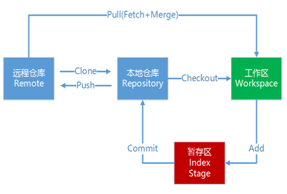
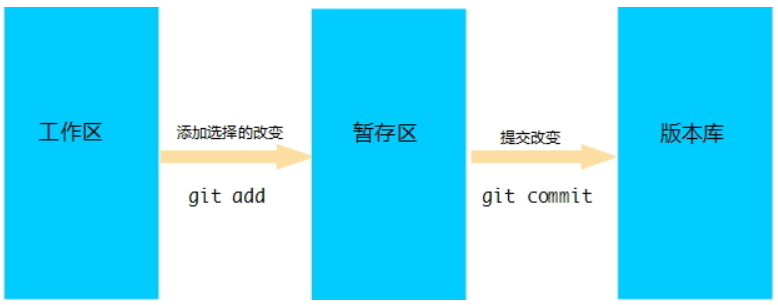

# 1. git的基本概念

## 1.1 git设计目标

- 速度
- 简单的设计
- 对非线性开发模式的强力支持（允许成千上万个并行开发的分支）
- 完全分布式
- 有能力高效管理类似 Linux 内核一样的超大规模项目（速度和数据量）

## 1.2 Git与SVN对比

> SVN是集中式版本控制系统，版本库是集中放在中央服务器的，而开发人员工作的时候，用的都是自己的电脑，所以首先要从中央服务器下载最新的版本，然后开发，开发完后，需要把自己开发的代码提交到中央服务器。

集中式版本控制工具缺点：

- 服务器单点故障
-  容错性差

> Git是分布式版本控制系统（Distributed Version Control System，简称 DVCS） ，分为两种类型的仓库：
> 本地仓库和远程仓库。

- 本地仓库：是在开发人员自己电脑上的Git仓库

- 远程仓库：是在远程服务器上的Git仓库

  

- Clone：克隆，就是将远程仓库复制到本地

- Push：推送，就是将本地仓库代码上传到远程仓库

- Pull：拉取，就是将远程仓库代码下载到本地仓库

## 1.3 git的工作流程

工作流程如下：

1. 从远程仓库中克隆代码到本地仓库
2. 从本地仓库中checkout代码然后进行代码修改
3. 在提交前先将代码提交到暂存区
4. 提交到本地仓库。本地仓库中保存修改的各个历史版本
5. 修改完成后，需要和团队成员共享代码时，将代码push到远程仓库



## 1.4 常用的代码托管服务

-  gitHub（ 地址：https://github.com/ ）是一个面向开源及私有软件项目的托管平台，因为只支持Git 作为唯一的版本库格式进行托管，故名GitHub

- 码云（地址： https://gitee.com/ ）是国内的一个代码托管平台，由于服务器在国内，所以相比于GitHub，码云速度会更快

- GitLab （地址： https://about.gitlab.com/ ）是一个用于仓库管理系统的开源项目，使用Git作为代码管理工具，并在此基础上搭建起来的web服务


# 2. 环境配置

当安装Git后首先要做的事情是设置用户名称和email地址。这是非常重要的，因为每次Git提交都会使用该用户信息

```shell
# 设置用户信息 
git config --global user.name “itcast”
git config --global user.email “hello@itcast.cn”

# 查看配置信息
git config --list
git config user.name
```

通过上面的命令设置的信息会保存在`~/.gitconfig`文件中，即用户目录下隐藏文件夹gitconfig

# 3. 获取git仓库

获取Git仓库通常有两种方式：

-  在本地初始化一个Git仓库

  执行步骤如下：
  1. 在电脑的任意位置创建一个空目录（例如repo1）作为我们的本地Git仓库
  2. 进入这个目录中，点击右键打开Git bash窗口
  3. 执行命令git init

  如果在当前目录中看到.git文件夹（此文件夹为隐藏文件夹）则说明Git仓库创建成功

-  从远程仓库克隆

  可以通过Git提供的命令从远程仓库进行克隆，将远程仓库克隆到本地

  命令形式为：`git clone 远程Git仓库地址 `

  ```
  git clone https://github.com/songtian521/java.git
  ```

  注：这里使用的Git仓库地址为HTTPS的形式，SSH的形式之后会讲

# 4. 工作目录、暂存区以及版本库概念

- 版本库：前面看到的`.git`隐藏文件夹就是版本库，版本库中存储了很多配置信息、日志信息和文件版本信息等
- 工作目录（工作区）：包含`.git`文件夹的目录就是工作目录，主要用于存放开发的代码
- 暂存区：`.git`文件夹中有很多文件，其中有一个index文件就是暂存区，也可以叫做stage。暂存区是一个临时保存修改文件的地方



Git工作目录下的文件存在两种状态：

- untracked 未跟踪（未被纳入版本控制）
- tracked 已跟踪（被纳入版本控制）
  - Unmodified 未修改状态
  - Modified 已修改状态
  - Staged 已暂存状态

这些文件的状态会随着我们执行Git的命令发生变化

# 5. 本地仓库操作

1. 使用`git status`查看文件状态

   ```shell
   $ git status
   On branch master
   Your branch is up to date with 'origin/master'.
   
   nothing to commit, working tree clean
   ```

2. 也可以使用` git status -s`使输出信息更加简洁

   ```shell
   $ git status -s
   ```

3. `git add`将未跟踪的文件加入暂存区

   ```shell
   $ git add hello.txt
   ```

4. 将新创建的文件加入暂存区后查看文件状态

   ```shell
   $ git status
   On branch master
   Your branch is up to date with 'origin/master'.
   
   Changes to be committed:
     (use "git restore --staged <file>..." to unstage)
           new file:   hello.txt
   
   ```

5. `git reset`将暂存区的文件取消暂存

   ```shell
   $ git reset hello.txt
   ```

6. 将文件取消暂存后查看文件状态

   ```shell
   $ git status
   On branch master
   Your branch is up to date with 'origin/master'.
   
   Untracked files:
     (use "git add <file>..." to include in what will be committed)
           hello.txt
   
   nothing added to commit but untracked files present (use "git add" to track)
   
   ```

7. `git commit` 将暂存区的文件修改提交到本地仓库

   ```shell
   $ git add hello.txt
   
   $ git commit -m "test_hello.txt"
   [master ddaf60d] test_hello.txt
    1 file changed, 0 insertions(+), 0 deletions(-)
    create mode 100644 hello.txt
   ```

   参数： `-m` message的意思，可以理解为一种日志，或者简单的备注，一般用来描述提交信息

8. `git rm` 删除文件

   ```shell
   $ git rm hello.txt
   git rm 'hello.txt'
   
   $ git status
   On branch master
   Your branch is ahead of 'origin/master' by 1 commit.
     (use "git push" to publish your local commits)
   
   Changes to be committed:
     (use "git restore --staged <file>..." to unstage)
           deleted:    hello.txt
   ```

   上面删除的只是工作区的文件，需要提交到本地仓库

   ```shell
   $ git commit -m "delete_hello.txt"
   [master a5c9cde] delete_hello.txt
    1 file changed, 0 insertions(+), 0 deletions(-)
    delete mode 100644 hello.txt
   ```

   注意：如果手动删除（即：直接鼠标右键删除文件），则需要

   ```shell
   #删除文件之前，此文件必须被git跟踪才行，所以。这里将测试文件添加到版本库
   $ git add hello.txt
   
   song@songtian MINGW64 ~/Desktop/JAVA算法笔记 (master)
   $ git commit -m "test_delete"
   [master 05288ce] test_delete
    1 file changed, 0 insertions(+), 0 deletions(-)
    create mode 100644 hello.txt
   
   # 这一步之前手动删除测试文件，查看文件状态，可以发现如下信息
   song@songtian MINGW64 ~/Desktop/JAVA算法笔记 (master)
   $ git status
   On branch master
   Your branch is ahead of 'origin/master' by 3 commits.
     (use "git push" to publish your local commits)
   
   # 这里的信息提示你：未暂存的更改未提交：
   Changes not staged for commit:
     (use "git add/rm <file>..." to update what will be committed)
     (use "git restore <file>..." to discard changes in working directory)
           deleted:    hello.txt
   
   no changes added to commit (use "git add" and/or "git commit -a")
   
   # 然后进行删除操作
   $ git rm hello.txt
   rm 'hello.txt'
   
   song@songtian MINGW64 ~/Desktop/JAVA算法笔记 (master)
   $ git commit -m "text_delete"
   [master f9858a9] text_delete
    1 file changed, 0 insertions(+), 0 deletions(-)
    delete mode 100644 hello.txt
   
   song@songtian MINGW64 ~/Desktop/JAVA算法笔记 (master)
   
   # 查看状态，此时已经被删除了
   $ git status
   On branch master
   Your branch is ahead of 'origin/master' by 4 commits.
     (use "git push" to publish your local commits)
   
   nothing to commit, working tree clean
   
   ```

9. 将文件添加至忽略列表

   > 一般我们总会有些文件无需纳入Git 的管理，也不希望它们总出现在未跟踪文件列表。 通常都是些自动生成的文件，比如日志文件，或者编译过程中创建的临时文件等。 在这种情况下，我们可以在工作目录中**创建一个名为 `.gitignore `的文件（文件名称固定），列出要忽略的文件模式**。下面是一个示例：

   ```shell
   # no .a files
   *.a
   
   # but do track lib.a, even though you're ignoring .a files above
   !lib.a
   
   # only ignore the TODO file in the current directory, not subdir/TODO
   /TODO
   
   # ignore all files in the build/ directory
   build/
   
   # ignore doc/notes.txt, but not doc/server/arch.txt
   doc/*.txt
   
   # ignore all .pdf files in the doc/ directory
   doc/**/*.pdf
   
   ```

   注：windows下无法直接创建以`.`开头的文件，此操作会被识别为文件后缀名，但是我们可以通过git命令行工具去创建这样一个文件

   ```shell
   $ touch .gitignore
   ```

10. `git log` 查看日志记录

    ```shell
    commit 05288ce48458b7f3d2b774d913088bd206ec3267
    Author: 宋天 <2982176321@qq.com>
    Date:   Sun Nov 15 09:08:39 2020 +0800
    
        test_delete
    
    commit a5c9cde2d45334ac90a6fd3c767da0990d58cd9b
    Author: 宋天 <2982176321@qq.com>
    Date:   Sun Nov 15 09:06:21 2020 +0800
    
        delete_hello.txt
    
    commit ddaf60d3f6120e31716dfe13e1a981c94e65929b
    Author: 宋天 <2982176321@qq.com>
    Date:   Sun Nov 15 09:03:38 2020 +0800
    
        test_hello.txt
    ```

    输入`q`可以退出查看日志

# 6. 远程仓库操作

1. 查看远程仓库

   > 如果想查看已经配置的远程仓库服务器，可以运行 `git remote` 命令。 它会列出指定的每一个远程服务器的简写。 如果已经克隆了远程仓库，那么至少应该能看到 `origin` ，这是 Git 克隆的仓库服务器的默认名字

   ```shell
   $ git remote
   origin
   
   $ git remote -v
   origin  git@github.com:songtian521/algorithm_Note.git (fetch)
   origin  git@github.com:songtian521/algorithm_Note.git (push)
   
   $ git remote show origin
   * remote origin
     Fetch URL: git@github.com:songtian521/algorithm_Note.git
     Push  URL: git@github.com:songtian521/algorithm_Note.git
     HEAD branch: master
     Remote branch:
       master tracked
     Local branch configured for 'git pull':
       master merges with remote master
     Local ref configured for 'git push':
       master pushes to master (fast-forwardable)
   
   ```

2. 添加远程仓库

   > 运行 `git remote add <shortname> <url> `添加一个新的远程 Git 仓库，同时指定一个可以引用的简写

   ```shell
   $ git remote add origin https://github.com/songtian521/java.git
   ```

3. 从远程仓库克隆

   > 如果你想获得一份已经存在了的 Git 仓库的拷贝，这时就要用到` git clone `命令。 Git 克隆的是该 Git 仓库服务器上的几乎所有数据（包括日志信息、历史记录等），而不仅仅是复制工作所需要的文件。 当你执行 git clone 命令的时候，默认配置下远程 Git 仓库中的每一个文件的每一个版本都将被拉取下来。
   >
   > 克隆仓库的命令格式是 `git clone [url] `

   ```shell
   $ git clone https://github.com/songtian521/java.git
   ```

4. 移除无效的远程仓库

   如果因为一些原因想要移除一个远程仓库 ，可以使用` git remote rm`

   ```shell
   $ git remote rm origin
   ```

   注意：此命令只是从本地移除远程仓库的记录，并不会真正影响到远程仓库

5. 从远程仓库中抓取与拉取

   > git fetch 是从远程仓库获取最新版本到本地仓库，不会自动merge

   ```shell
   # 初始化本地仓库
   $ git init
   
   # 添加远程仓库
   $ git remote add origin https://github.com/songtian521/java.git
   
   # 获取最新版本到本地仓库，注意，这里是本地仓库而不是工作目录
   $ git fetch origin master
   remote: Enumerating objects: 307, done.
   remote: Counting objects: 100% (307/307), done.
   remote: Compressing objects: 100% (256/256), done.
   remote: Total 307 (delta 79), reused 275 (delta 50), pack-reused 0
   Receiving objects: 100% (307/307), 8.91 MiB | 10.00 KiB/s, done.
   Resolving deltas: 100% (79/79), done.
   From https://github.com/songtian521/java
    * branch            master     -> FETCH_HEAD
    * [new branch]      master     -> origin/master
    
    # 合并到本地分支
   $ git merge origin/master
   ```

   > git pull 是从远程仓库获取最新版本并merge到本地仓库

   ```shell
   # 初始化本地仓库
   $ git init
   
   # 添加远程仓库
   $ git remote add origin https://github.com/songtian521/java.git
   
   #从远程仓库获取最新版本并merge到本地仓库，这里相当于fetch + merge操作
   $ git pull origin master
   
   ```

   注意：如果当前本地仓库不是从远程仓库克隆，而是本地创建的仓库，并且仓库中存在文件，此时再从远程仓库拉取文件的时候会报错（fatal: refusing to merge unrelated histories ），解决此问题可以在git pull命令后加入参数`--allow-unrelated-histories`

6. 推送到远程仓库

   当你想分享你的代码时，可以将其推送到远程仓库。 命令形式：`git push [remote-name] [branch-name]`

   ```shell
   $ git push origin master
   ```

# 7. Git 分支

> 几乎所有的版本控制系统都以某种形式支持分支。 使用分支意味着你可以把你的工作从开发主线上分离开来，以免影响开发主线。Git 的master分支并不是一个特殊分支。 它跟其它分支没有区别。 之所以几乎每一个仓库都有 master 分支，是因为git init 命令默认创建它，并且大多数人都懒得去改动它。

1. 查看分支

   ```shell
   # 列出所有本地分支
   $ git branch
   * master
     test_branch
   
   # 列出所有远程分支
   $ git branch -r
     origin/master
   
   # 列出所有本地分支和远程分支
   $ git branch -a
   * master
     test_branch
     remotes/origin/master
   
   ```

2. 创建分支

   ```shell
   $ git branch
   * master
     test_branch
   
   $ git branch b1
   
   $ git branch
     b1
   * master
     test_branch
   
   ```

3. 切换分支

   ```shell
   $ git checkout b1
   Switched to branch 'b1'
   ```

4. 推送至远程仓库分支

   ```shell
   $ git push origin b1
   Enumerating objects: 7, done.
   Counting objects: 100% (7/7), done.
   Delta compression using up to 12 threads
   Compressing objects: 100% (5/5), done.
   Writing objects: 100% (6/6), 626 bytes | 626.00 KiB/s, done.
   Total 6 (delta 3), reused 0 (delta 0)
   remote: Resolving deltas: 100% (3/3), completed with 1 local object.
   remote:
   remote: Create a pull request for 'b1' on GitHub by visiting:
   remote:      https://github.com/songtian521/algorithm_Note/pull/new/b1
   remote:
   To github.com:songtian521/algorithm_Note.git
    * [new branch]      b1 -> b1
   ```

5. 合并分支

   ```shell
   $ git merge b1
   Updating d1902bc..f5ee39c
   Fast-forward
    hello.txt | 2 --
    1 file changed, 2 deletions(-)
    delete mode 100644 hello.txt
   
   ```

   > 有时候合并操作不会如此顺利。 如果你在两个不同的分支中，对同一个文件的同一个部分进行了不同的修改，Git 就没办法合并它们，同时会提示文件冲突。此时需要我们打开冲突的文件并修复冲突内容，最后执行git add命令来标识冲突已解决

   测试：

   分别创建b1和b2分支，然后在不同的分支下创建同一个名称的文件，然后写入不同的内容，最后记得将不同分支下的文件都提交至本地仓库

   ```shell
   # 创建b1 分支，在做完这一步骤之后应创建名为hello.txt的文件，任意写入内容
   $ git branch b1
   
   # 将文件添加到暂存区
   $ git add hello.txt
   
   # 将文件添加至本地仓库
   $ git commit -m "test_mergr_branch_1"
   
   
   # 创建b2 分支，在做完这一步骤之后应创建名为hello.txt的文件，任意写入内容，不可与b1分支相同
   $ git branch b2
   
   # 将文件添加到暂存区
   $ git add hello.txt
   
   # 将文件添加至本地仓库
   $ git commit -m "test_mergr_branch_2"
   
   # 切换至b2分支
   $ git checkout b2
   Switched to branch 'b2'
   
   # 合并分支
   $ git merge b1
   # 冲突（添加/添加）：在hello.txt中合并冲突
   CONFLICT (add/add): Merge conflict in hello.txt
   # 自动合并hello.txt
   Auto-merging hello.txt
   # 自动合并失败； 解决冲突，然后提交结果。
   Automatic merge failed; fix conflicts and then commit the result.
   ```

   此时，查看hello.txt文件。

   ```
   <<<<<<< HEAD
   测试文件二号
   =======
   测试文件一号
   >>>>>>> b1
   ```

   解决合并冲突，只需要删除除文字外其他东西即可

   ```
   测试文件二号
   测试文件一号
   ```

   最后，执行`git add`命令来标识冲突已解决

   ```shell
   $ git add hello.txt
   
   $ git commit -m "merge_branch"
   [b2 d1902bc] merge_branch
   ```

   此时的情况为：

   - 分支b2文件内容为

     ```
     测试文件二号
     测试文件一号
     ```

   - 分支b1文件内容为

     ```
     测试文件一号
     ```

6. 删除分支

   ```shell
   $ git branch -d b1
   Deleted branch b1 (was f5ee39c).
   ```

   如果要删除的分支中进行了一些开发动作，此时执行上面的删除命令并不会删除分支，如果坚持要删除此分支，可以将命令中的`-d`参数改为`-D`

   ```shell
   $ git branch -d b2
   error: The branch 'b2' is not fully merged.
   If you are sure you want to delete it, run 'git branch -D b2'.
   
   $ git branch -D b2
   Deleted branch b2 (was f5ee39c).
   
   $ git branch
   * master
   ```

   注：如果要删除远程仓库中的分支，可以使用命令`git push origin –d branchName`

# 8. Git标签

> 像其他版本控制系统（VCS）一样，Git 可以给历史中的某一个提交打上标签，以示重要。 比较有代表性的是人们会使用这个功能来标记发布结点（v1.0 、v1.2等）。标签指的是某个分支某个特定时间点的状态。通过标签，可以很方便的切换到标记时的状态。

1. 列出已有的标签

   ```shell
   $ git tag
   ```

2. 查看tag信息

   ```shell
   $ git show [tag]
   ```

3. 创建新标签

   格式：`git tag [tagName]`

   ```shell
   $ git tag V1.0
    
   $ git tag
   V1.0
   
   $ git show V1.0
   commit f9858a9c24f8451ffb57dd6ec672f71d2b2faf0b (HEAD -> master, tag: V1.0, origin/b1)
   Author: 宋天 <2982176321@qq.com>
   Date:   Sun Nov 15 09:14:48 2020 +0800
   
       text_delete
   
   diff --git a/hello.txt b/hello.txt
   deleted file mode 100644
   index e69de29..0000000
   ```

4. 将标签推送至远程仓库

   提交指定tag：`$ git push [remote] [tag]`

   ```shell
   $ git push origin V1.0
   Total 0 (delta 0), reused 0 (delta 0)
   To github.com:songtian521/algorithm_Note.git
    * [new tag]         V1.0 -> V1.0
   ```

5. 检出标签

   新建一个分支，指向某个tag：`$ git checkout -b [branch] [tag]`

   ```shell
   $ git checkout -b b1 V1.0
   Switched to a new branch 'b1'
   A       hello.txt
   ```

   注：这里会自动新建一个分支，新建的分支不能重名

6. 删除标签

   - 删除本地tag

     `$ git tag -d [tag]`

   - 删除远程tag

     `$ git push origin :refs/tags/[tag]`

   ```shell
   $ git tag -d V1.0
   Deleted tag 'V1.0' (was f9858a9)
   
   $ git push origin :refs/tags/V1.0
   To github.com:songtian521/algorithm_Note.git
    - [deleted]         V1.0
   
   ```

   

# 9. 使用SSH协议传输数据

1. Git支持的传输协议 

   > 由于Git的远程仓库并不在我们本地，当我们在使用远程仓库的时候（例如克隆、拉取、推送）就会涉及到数据的网络传输，Git支持多种数据传输协议，分别为：

   - 本地协议（Local）

   - HTTPS 协议

   - SSH（Secure Shell）协议


   - Git 协议


   我们前面的操作都是基于HTTPS协议进行的，这里我们将使用SSH协议

2. 什么是SSH协议

   SSH 为 Secure Shell（安全外壳协议）的缩写，由 IETF 的网络小组（Network Working Group）所制定。SSH 是目前较可靠，专为远程登录会话和其他网络服务提供安全性的协议。利用 SSH 协议可以有效防止远程管理过程中的信息泄露问题。

   由于本地Git仓库和远程仓库之间的传输是通过SSH加密的，所以必须要让远程仓库服务器认证你的SSH key，在此之前，必须要生成SSH key。

   使用ssh协议通信时，推荐使用基于密钥的验证方式。你必须为自己创建一对密匙（公钥和私钥），并把公匙放在需要访问的服务器上。

3. 配置SSH协议

   可以使用Git提供的命令行工具Git Bash生成公钥和私钥，具体操作过程如下：

   1. 使用命令`ssh-keygen –t rsa`生成公钥和私钥，执行完成后在window本地用户`.ssh`目录 `C:\Users\用户名\.ssh`目录下面生成如下名称的公钥和私钥

      ```
      id_rsa
      id_rsa.pub
      ```

   2. 复制公钥文件内容至GitHub服务器，添加即可