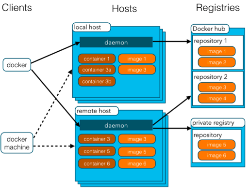
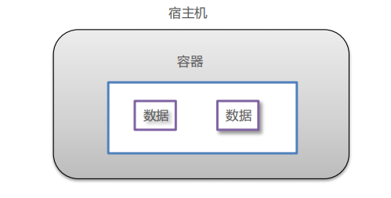
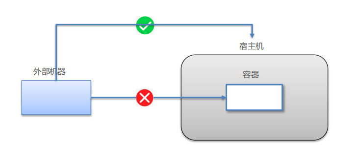
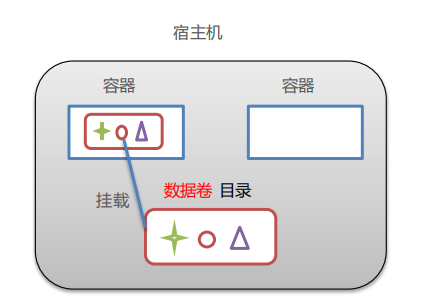
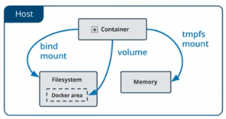
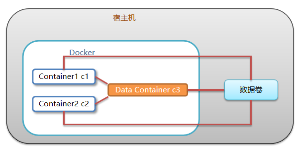
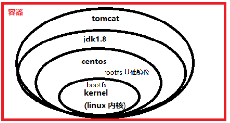

# 1. docker初步了解

- 基本概念

  - Docker 是一个开源的应用容器引擎
  - 诞生于 2013 年初，基于 Go 语言实现， dotCloud 公司出品（后改名为Docker Inc）
  - Docker 可以让开发者打包他们的应用以及依赖包到一个轻量级、可移植的容器中，然后发布到任何流行的 Linux 机器上。
  - 容器是完全使用沙箱机制，相互隔离
  - 容器性能开销极低。
  - Docker 从 17.03 版本之后分为 CE（Community Edition: 社区版） 和 EE（Enterprise Edition: 企业版）

- Docker的应用场景

  - Web 应用的自动化打包和发布。
  - 自动化测试和持续集成、发布。
  - 在服务型环境中部署和调整数据库或其他的后台应用。
  - 从头编译或者扩展现有的 OpenShift 或 Cloud Foundry 平台来搭建自己的 PaaS 环境。

- docker的优点

  > Docker 是一个用于开发，交付和运行应用程序的开放平台。Docker 使您能够将应用程序与基础架构分开，从而可以快速交付软件。借助 Docker，您可以与管理应用程序相同的方式来管理基础架构。通过利用 Docker 的方法来快速交付，测试和部署代码，您可以大大减少编写代码和在生产环境中运行代码之间的延迟。

  - 快速，一致地交付您的应用程序

    > Docker 允许开发人员使用您提供的应用程序或服务的本地容器在标准化环境中工作，从而简化了开发的生命周期。

  - 响应式部署和扩展

    > Docker 是基于容器的平台，允许高度可移植的工作负载。Docker 容器可以在开发人员的本机上，数据中心的物理或虚拟机上，云服务上或混合环境中运行。

  - 在同一硬件上运行更多工作负载

    > Docker 轻巧快速。它为基于虚拟机管理程序的虚拟机提供了可行、经济、高效的替代方案，因此您可以利用更多的计算能力来实现业务目标。

- 相关链接

  Docker 官网：[https://www.docker.com](https://www.docker.com/)

  Github Docker 源码：https://github.com/docker/docker-ce

# 2. docker的架构

- 镜像（Image）：Docker 镜像（Image），就相当于是一个 root 文件系统。比如官方镜像 ubuntu:16.04 就包含了完整的一套 Ubuntu16.04 最小系统的 root 文件系统。
- 容器（Container）：镜像（Image）和容器（Container）的关系，就像是面向对象程序设计中的类和对象一样，镜像是静态的定义，容器是镜像运行时的实体。容器可以被创建、启动、停止、删除、暂停等。
- 仓库（Repository）：仓库可看成一个代码控制中心，用来保存镜像。



| 概念                   | 说明                                                         |
| :--------------------- | :----------------------------------------------------------- |
| Docker 镜像(Images)    | Docker 镜像是用于创建 Docker 容器的模板，比如 Ubuntu 系统。  |
| Docker 容器(Container) | 容器是独立运行的一个或一组应用，是镜像运行时的实体。         |
| Docker 客户端(Client)  | Docker 客户端通过命令行或者其他工具使用 Docker SDK (https://docs.docker.com/develop/sdk/) 与 Docker 的守护进程通信。 |
| Docker 主机(Host)      | 一个物理或者虚拟的机器用于执行 Docker 守护进程和容器。       |
| Docker Registry        | Docker 仓库用来保存镜像，可以理解为代码控制中的代码仓库。Docker Hub([https://hub.docker.com](https://hub.docker.com/)) 提供了庞大的镜像集合供使用。一个 Docker Registry 中可以包含多个仓库（Repository）；每个仓库可以包含多个标签（Tag）；每个标签对应一个镜像。通常，一个仓库会包含同一个软件不同版本的镜像，而标签就常用于对应该软件的各个版本。我们可以通过 **<仓库名>:<标签>** 的格式来指定具体是这个软件哪个版本的镜像。如果不给出标签，将以 **latest** 作为默认标签。 |
| Docker Machine         | Docker Machine是一个简化Docker安装的命令行工具，通过一个简单的命令行即可在相应的平台上安装Docker，比如VirtualBox、 Digital Ocean、Microsoft Azure。 |

- Docker 使用客户端-服务器 (C/S) 架构模式，使用远程API来管理和创建Docker容器。
- Docker 容器通过 Docker 镜像来创建。
- 容器与镜像的关系类似于面向对象编程中的对象与类。

| Docker | 面向对象 |
| :----- | :------- |
| 容器   | 对象     |
| 镜像   | 类       |

# 3. 安装docker

现在 Docker 有专门的 Win10 专业版系统的安装包，需要开启 Hyper-V。

windows版docker文但那给官方网站：https://docs.docker.com/engine/

1. 启动**win10专业版**的Hyper-V功能

2. 安装 Toolbox

   > 最新版 Toolbox 下载地址： 访问 https://www.docker.com/get-started，注册一个账号，然后登录。
   >
   > 点击 [Get started with Docker Desktop](https://hub.docker.com/?overlay=onboarding)，并下载 Windows 的版本，如果你还没有登录，会要求注册登录

3. 运行安装文件

   > 双击下载的 Docker for Windows Installer 安装文件，一路 Next，点击 Finish 完成安装。
   >
   > 安装完成后，Docker 会自动启动。通知栏上会出现个小鲸鱼的图标，这表示 Docker 正在运行。
   >
   > 我们可以在命令行执行 `docker version `来查看版本号，`docker run hello-world `来载入测试镜像测试。
   >
   > 如果没启动，你可以在 Windows 搜索 Docker 来启动

4. 配置镜像加速

   对于使用 Windows 10 的系统，在系统右下角托盘 Docker 图标内右键菜单选择 Settings，打开配置窗口后左侧导航菜单选择 docker Engine，之后就可以看到如下内容

   ```json
   {
     "registry-mirrors": [],
     "insecure-registries": [],
     "debug": true,
     "experimental": false
   }
   ```

   这里选用阿里云镜像加速，镜像加速地址：https://cr.console.aliyun.com/cn-hangzhou/instances，选择镜像工具——镜像加速器，里面有详细说明。

   其他的镜像加速参考：https://www.runoob.com/docker/docker-mirror-acceleration.html

# 4. docker的数据卷

1. **数据卷：**数据卷就是在宿主中可以在容器之间进行共享和重用的一系列和文件和文件夹，通过docker run -v命令可以将数据卷挂载到对应的容器目录空间，进行文件读取，容器卷特性如下

   - 数据卷可以在容器之间共享和重用，容器间传递数据将变得高效方便

   - 对数据卷内数据的修改会立马生效，无论是容器内操作还是本地操作
   - 对数据卷的更新不会影响镜像，解耦了应用和数据
   - 卷会一直存在，直到没有容器使用，可以安全地卸载它

2. **数据卷容器：**接数据卷，已经存在一个挂载了数据卷的容器；由于数据卷在容器之前是可以共享的，所以此时如果存在其他容器通过`docker run --volumes-from [容器别名]`命令挂载到该容器上，则该容器可以被称之为数据卷容器，其主要功能是提供数据卷供其他容器挂载。**当数据卷容器宕机后，并不会造成数据卷的回收卸载，数据卷会继续挂载在其他容器中**。当全部挂载该数据卷的容器全部宕机后，该数据卷才会卸载

## 4.1 数据卷问题引入

1. Docker 容器删除后，在容器中产生的数据还在吗？答案是 **不在**

   

2. Docker 容器和外部机器可以直接交换文件吗？ 在没有数据卷的情况下，答案是 **不可以**

   **如下图：外部机器：Windows系统（自己的电脑） 宿主机：centOS7 容器：docker容器**

   

3. 容器之间想要进行数据交互？ 在没有数据卷的情况下，答案是 **不可以**

4. 那么什么是数据卷

   - 数据卷是宿主机中的一个目录或文件
   - 当容器目录和数据卷目录绑定后，对方的修改会立即同步
   - 一个数据卷可以被多个容器同时挂载
   - 一个容器也可以被挂载多个数据卷

   

5. 数据卷作用

   - 容器数据持久化
   - 外部机器和容器间接通信
   - 容器之间数据交换

## 4.2 数据卷基本概念

在Docker中，要想实现数据的持久化（所谓Docker的数据持久化即**数据不随着Container的结束而结束**），需要将数据从宿主机挂载到容器中。

> **数据卷是被设计用来持久化数据的，它的生命周期独立于容器**，Docker不会在容器被删除后自动删除数据卷，并且也不存在垃圾回收这样的机制来处理没有任何容器引用的数据卷，无主的数据卷可能会占据很多空间，所以要及时删除

目前Docker提供了三种不同的方式将数据从宿主机挂载到容器中：

说明：

> docker容器的Linux对Windows支持并不是很高，他只对C:\Users 目录下进行挂载，其他目录都没有办法挂载，除非用VirtualBox修改这个虚拟机的共享目录设定，否则在虚拟机里只能看到C:\Users以下的文件
>
> 配置方法：打开settings——resources——file sharing 添加路径即可

- volumes：Docker管理宿主机文件系统的一部分，linux下默认位于 /var/lib/docker/volumes 目录中；（**最常用的方式**）

- bind mounts：意为着可以存储在宿主机系统的任意位置；（**比较常用的方式**）

  > bind mount在不同的宿主机系统时不可移植的，比如Windows和Linux的目录结构是不一样的，bind mount所指向的host目录也不能一样。这也是为什么bind mount不能出现在Dockerfile中的原因，因为这样Dockerfile就不可移植了。

- tmpfs：挂载存储在宿主机系统的内存中，而不会写入宿主机的文件系统；（**一般都不会用的方式**）

三种方式的示意图如下所示：



## 4.3 volume的基本使用

volume也是绕过container的文件系统，直接将数据写到host机器上，只是volume是被docker管理的，docker下所有的volume都在host机器上的指定目录下`/var/lib/docker/volumes `

使用命令`-v ` 或者 `--volume`

> `-v `宿主机文件或者文件夹路径 : 容器中文件或文件夹的路径 
>
> 其中 宿主机文件或者文件夹路径和容器中文件或文件夹的路径是必须的

示例：将my-volume挂载到container中的/mydata目录：

```shell
docker run -it -v my-volume:/mydata nginx
```

```shell
docker inspect docker_test_volume  # 查volume信息

[
    {
        "CreatedAt": "2020-11-23T03:58:02Z",
        "Driver": "local",
        "Labels": {},
        "Mountpoint": "/var/lib/docker/volumes/docker_test_volume/_data",
        "Name": "docker_test_vloume",
        "Options": {},
        "Scope": "local"
    }
]

```

可以看到，volume在host机器的目录为`/var/lib/docker/volumes/my-volume/_data`。此时，如果my-volume不存在，那么docker会自动创建my-volume，然后再挂载。

也可以不指定host上的volume：

```shell
docker run -it -v /mydata  nginx
```

此时docker将自动创建一**个匿名的volume**，并将其挂载到container中的/mydata目录。匿名volume在host机器上的目录路径类似于：`/var/lib/docker/volumes/300c2264cd0acfe862507eedf156eb61c197720f69e7e9a053c87c2182b2e7d8/_data`。

除了让docker帮我们自动创建volume，我们也可以自行创建：

```shell
docker volume create my-volume
```

然后将这个已有的my-volume-2挂载到container中:

```shell
docker run -it -v my-volume:/mydata niginx
```

需要注意的是，与bind mount不同的是，如果volume是空的而container中的目录有内容，那么docker会将container目录中的内容拷贝到volume中，但是如果volume中已经有内容，则会将container中的目录覆盖。


## 4.4 Bind Mounts的基本使用

- bind mounts允许建立docker容器中的文件与本地文件之间的映射关系
- 容器中的进程写入这个文件的内容会保存到映射的本地文件中
- 与volume不同的是，bind mounts不由docker同一管理，**volume存放在docker的特定区域，而bind mounts可以位于主机的任意位置**
- 由于bind mounts不由docker管理，也就无法像volume一样使用docker命令去管理查看相应的信息，依据主机文件系统的不同，bind mounts也具有不同的性能，bind mounts可以挂载到文件，也可以挂载到本地目录
- bind mount自docker早期便开始为人们使用了，用于将host机器的目录mount到container中。**但是bind mount在不同的宿主机系统时不可移植的**，比如Windows和Linux的目录结构是不一样的，bind mount所指向的host目录也不能一样。这也是为什么bind mount不能出现在Dockerfile中的原因，因为这样Dockerfile就不可移植了。

创建bind mounts有两种形式：

1. `-mount参数`

   ```shell
   $ docker run -d \
     -it \
     --name devtest \
     --mount type=bind,source="$(pwd)"/target,target=/app \
     nginx:latest
   ```

    语法介绍：mount的参数都是key-value形式的，有几个具有特殊意义的key：

   1. type：挂载类型，可以是bind、volume、tmpfs，在本节中总是bind
   2. source/src：本地文件/目录的路径
   3. destination/target/dst：docker容器中的文件/目录
   4. readonly：容器是否只读本地文件/目录
   5. bind-propagation：接下来会介绍，挂载传播
   6. consistency：只对于mac有用，由于我都是在centos7上使用，所以这个参数这里不总结

2. `-v参数`

   ```shell
   $ docker run -d \
     -it \
     --name devtest \
     -v "$(pwd)"/target:/app \
     nginx:latest
   ```

    语法介绍：有三个具有特殊意义的区域，三个区域之间用 ":" 分割，这三个区域代表的意义如下：

   1. 第一个区域：本地文件/目录的路径
   2. 第二个区域：docker容器中的文件/目录
   3. 第三个区域（可选）：用逗号分割的选项字段，例如ro（只读）、consistent

两者的不同：

- 在低于17.06版本的docker中，`-v`用于建立单个容器的 文件/目录 与 本地文件/目录 的映射关系，`-mount`用于swarm services，建立其中的 文件/目录映射 关系，
- 自17.06版本以来，`-mount`已经可以用于建立单个容器的 文件/目录 与 本地文件/目录 的映射关系，如果用于映射的本地文件不存在，**`-v`会自动去创建，而`-mount`则会报错**，`-v`参数比`-mount`参数出现的早，它的功能不会随便改变（可能是考虑到兼容问题）

## 4.5 Dockerfile中的volume

在Dockerfile中，我们也可以使用VOLUME指令来申明contaienr中的某个目录需要映射到某个volume：

```bash
#Dockerfile
volume /foo
```

这表示，在docker运行时，docker会创建一个匿名的volume，并将此volume绑定到container的/foo目录中，如果container的/foo目录下已经有内容，则会将内容拷贝的volume中。也即，Dockerfile中的`VOLUME /foo`与`docker run -v /foo alpine`的效果一样。

Dockerfile中的volume使每次运行一个新的container时，都会为其自动创建一个匿名的volume，如果需要在不同container之间共享数据，那么我们依然需要通过`docker run -it -v my-volume:/foo`的方式将/foo中数据存放于指定的my-volume中。

因此，`volume /foo`在某些时候会产生歧义，如果不了解的话将导致问题。

## 4.6 Windows下如何挂载容器

Docker容器的Linux对Windows支持并不是很高，只能对`C:\Users`目录下进行挂载，其它目录没有办法挂载。除非使用VirtualBox修改虚拟机的共享目录设定，否则在虚拟机中只能看到`C:\Users`以下的文件。

示例：在使用`docker run`创建新容器时，可以使用`-v`标签为容器添加数据卷`volume`。

- `-v /path` 从容器挂载数据卷
- `-v /host-path:/container-path` 从宿主机挂载数据卷

在Web开发中需要一个Web服务器，使用Nginx镜像为例，将Web开发目录挂载到Nginx容器中：

```shell
docker@default:~$ docker run --rm --name webserver -p 80:80 -v /d/share/www:/usr/share/nginx/html:ro -d nginx
```

参数：

- `-v` 用于挂载一个主机上的目录到容器的目录
   容器内对`/usr/share/nginx/html`的操作都会反映到主机的`/d/share/www`目录内
- `/d/share/www` 表示宿主机上的绝对路径，`/d/`为盘符d盘的表示。
- `/usr/share/nginx/html` 表示容器上的绝对路径
- `ro` 表示只读挂载

由于在本机Windows系统中使用VirtualBox共享目录，设置了`D:\docker\share`目录与`default`虚拟机中`/share`目录共享。此时在Windows的`D:\docker\share`目录下将会产生一个`www`目录，对应着`default`虚拟机中的`/share/www`。

查看`docker volume`帮助文档

```shell
docker@default:~$ docker volume --help

Usage:  docker volume COMMAND

Manage volumes

Commands:
  create      创建一个数据卷
  inspect     打印一个或多个数据卷的详细信息
  ls          列出所有数据卷
  prune       删除所有未使用的数据卷
  rm          删除一个或多个数据卷

Run 'docker volume COMMAND --help' for more information on a command.
```

## 4.7 匿名卷与实名卷

匿名卷也就是没有显示指定名字的卷，实名卷具有名字，两种卷均存储在`/var/lib/docker/volumes/`区域，匿名卷的目录名字是一串随机数字，如果在创建容器时添加`--rm`参数，则匿名卷会随着容器的删除而删除，其实，匿名卷和实名卷基本可以看成是一个东西，只是匿名卷名字由Docker随机命名，并且可以随容器的销毁而销毁而已。

## 4.8 数据卷容器

  如果用户需要在多个容器之间共享一些持续更新的数据，最简单的方式是使用数据卷容器。

  数据卷容器也是一个容器，但是它的目的是专门提供数据卷给其他容器挂载



1. 我们从仓库拉一个centos的容器镜像

   ```bash
   $ docker pull centos
   ```

   2）然后运行这个镜像并创建一个数据卷挂载到/mydata

   ```bash
   $ docker run -it -v /mydata --name mycentos centos
   ```

   3）再运行两个容器，在这两个容器中使用`--volumes-from`来挂载mycentos容器中的数据卷.

   ```bash
   $ docker run -it --volumes-from mycentos --name soncentos1 centos
   
   $ docker run -it --volumes-from mycentos --name soncentos2 centos
   ```

   此时，容器soncentos1和soncentos2都挂载同一个数据卷到相同的/mydata 目录。三个容器任何一方在该目录下的写入数据，其他容器都可以看到。

   > 可以多次使用**--volumes-from**参数来从多个容器挂载多个数据卷。还可以从其他已经挂载了容器卷的容器来挂载数据卷。 使用**--volumes-from**参数所挂载数据卷的容器自身并不需要保持在运行状态。 如果删除了挂载的容器（包括dbdata、db1和db2），数据卷并不会被自动删除。如果要删除一个数据卷，必须在删除最后一个还挂载着它 的容器时显式使用`docker rm -v`命令来指定同时删除关联的容器。


# 5. docker常用命令

1. Docker 进程相关命令

   - 启动docker服务

     ```
     systemctl start docker 
     ```

   - 停止docker服务

     ```
     systemctl stop docker 
     ```

   - 重启docker服务

     ```
     systemctl restart docker
     ```

   - 查看docker服务状态

     ```
     systemctl status docker 
     ```

   - 设置开机启动docker服务

     ```
     systemctl enable docker
     ```

2. docker镜像相关命令

   - 查看镜像：查看本地所有的镜像

     ```
     docker images
     docker images –q # 查看所用镜像的id
     ```

   - 搜索镜像：从网络中查找需要的镜像

     ```
     docker search 镜像名称
     ```

   - 拉取镜像

     > 从Docker仓库下载镜像到本地，镜像名称格式为 名称:版本号，如果版本号不指定则是最新的版本。

     > 如果不知道镜像版本，可以去docker hub 搜索对应镜像查看。

     ```
     docker pull 镜像名称
     ```

   - 删除镜像：删除本地镜像

     ```
     docker rmi 镜像id # 删除指定本地镜像
     docker rmi `docker images -q`  # 删除所有本地镜像
     ```

3. docker容器相关命令

   - 查看容器

     ```
     docker ps # 查看正在运行的容器
     docker ps –a # 查看所有容器
     ```

   - 创建并启动容器

     ```
     docker run 参数
     ```

     > `-i：`保持容器运行。通常与 -t 同时使用。加入it这两个参数后，容器创建后自动进入容器中，退出容器后，容器自动关闭。
     >
     > `-t：`为容器重新分配一个伪输入终端，通常与 -i 同时使用。
     >
     > `-d：`以守护（后台）模式运行容器。创建一个容器在后台运行，需要使用docker exec 进入容器。退出后，容器不会关闭。
     >
     > `-it：`创建的容器一般称为交互式容器，
     >
     > `-id： `创建的容器一般称为守护式容器
     >
     > `--name：`为创建的容器命名。

   - 进入容器

     ```
     docker exec 参数 # 退出容器时，容器不会关闭
     ```

   - 停止容器

     ```
     docker stop 容器名称
     ```

   - 启动容器

     ```
     ocker start 容器名称
     ```

   - 删除容器：如果容器是运行状态则删除失败，需要停止容器才能删除

     ```
     docker rm 容器名称
     ```

   - 查看容器信息

     ```
     docker inspect 容器名称
     ```

# 6. docker应用部署

## 6.1 docker部署oracle

本次配置版本是` registry.cn-hangzhou.aliyuncs.com/helowin/oracle_11g `

1. 在docker中搜索oracle_11g信息

   ```
   docker search oracle_11g
   ```

2. 拉取镜像

   ```
   docker pull registry.cn-hangzhou.aliyuncs.com/helowin/oracle_11g
   ```

3. 创建容器

   ```shell
   docker run -d --name oracle_11g -p 1521:1521 registry.cn-hangzhou.aliyuncs.com/helowin/oracle_11g
   ```

   参数说明：

   - `-d` 后台运行
   - `--name` 容器名
   - `-p` 端口映射

4. 进入容器

   ```shell
   docker exec -it oracle_11g bash
   ```

   > 说明：进入容器之后的显示的是基于linux内核的一个文件系统，和centos差不多。

5. 切换到root用户，默认为oracle用户

   ```
   su root
   ```

   > 默认密码为：helowin

6. 编写配置文件，配置oracle环境变量

   `vi /etc/profile`

   ```shell
   # begin
   export ORACLE_HOME=/home/oracle/app/oracle/product/11.2.0/dbhome_2
   export ORACLE_SID=helowin
   export PATH=$ORACLE_HOME/bin:$PATH
   # end
   ```

   > 最后别忘记重启此文件 source /etc/profile

7. 设置软链接

   ```
   ln -s $ORACLE_HOME/bin/sqlplus /usr/bin
   ```

8. 切换为oracle用户

   ```
   su - oracle
   ```

   > 这里还要说一下，一定要写中间的内条 -  必须要，否则软连接无效

9. 登录sqlplus

   ```
   sqlplus /nolog
   ```

   > 第一次启动会需要输入用户名和密码，默认为：
   >
   > username：system
   >
   > password：helowin

10. 登录 oracle账户账户

    ```
    conn /as sysdba
    ```

11. 修改管理员账户和超级管理员账户(可选)

    ```
    alter user system identified by 123456;
    alter user sys identified by sys; 
    ```

    > 也可以创建用户，并给用户赋予权限 

    ```
    create user test identified by test;
    grant connect,resource,dba to test;
    ```

    > 管理原账户名：system
    >
    > 管理员密码：123456

    > 超级管理员用户：sys
    >
    > 超级管理员密码：sys

12. 输入命令，使密码长期生效

    ```
    ALTER PROFILE DEFAULT LIMIT PASSWORD_LIFE_TIME UNLIMITED
    ```

13. 此时基本配置完成，可以使用客户端工具连接oracle了

    - 连接名`docker_oracle_11g `（任意）
    - 连接类型（Basic）
    - 主机：localhost
    - 端口：1521（之前做映射的端口）
    - 服务名：使用SID作为服务名：`helowin`
    - 用户名：system
    - 密码：123456

**开始配置持久化存储**

> docker的实例都存储在`/home/oracle/app/oracle/oradata/helowin`下
>
> 为什么不在创建容器的时候直接指定？
>
> 答：因为失败了，最后查看此目录的时候没有任何内容，正常情况下是有内容的


1. 拷贝原oracle_11g容器的数据到本地

   > 因为是在windows安装的docker，所以，最后一个参数指定本地目录的时候会报错，所以，这一步的时候需要先进入到需要拷贝的目录里面，然后打开命令行工具

   ```shell
   docker cp oracle_11g:/home/oracle/app/oracle/oradata/helowin  ./
   ```

2. 关闭oracle_11g容器

   ```
   docker stop oracle_11g
   ```

3. 重新启动容器

   ```shell
   docker run -p 1521:1521 --name oracle_11g_persistence -v /d/Hyper-V-images/oracle:/home/oracle/app/oracle/oradata/helowin registry.cn-hangzhou.aliyuncs.com/helowin/oracle_11g
   ```

4. 查看启动日志

   ```
   docker logs -f oracle_11g_persistence
   ```

   我们发现了一个错误，这是由于 oracle 为了数据安全，添加的版本验证

   ```
   ORA-00214: control file '/home/oracle/app/oracle/oradata/helowin/control01.ctl'
   version 886 inconsistent with file
   '/home/oracle/app/oracle/flash_recovery_area/helowin/control02.ctl' version 841
   ```

5. 进入容器，解决错误

   ```
   docker exec -it oracle_11g_persistence bash
   ```

6. 进入到`/home/oracle/app/oracle/oradata/ `目录下，赋予权限

   ```
   chown -R 500.500 ./helowin
   ```

7. 进入/home/oracle目录

   ```
   cd /home/oracle              # 进入到 oracle 用户目录
   source .bash_profile         # 加载 oracle 环境变量（每次进入容器都要加载配置文件）
   ```

8. 删除新生成的版本控制文件，将数据卷中的版本控制文件复制为新生成的版本控制文件

   ```
   rm -rf /home/oracle/app/oracle/flash_recovery_area/helowin/control02.ctl
   
   cp /home/oracle/app/oracle/oradata/helowin/control01.ctl /home/oracle/app/oracle/flash_recovery_area/helowin/control02.ctl
   ```

9. 连接 oracle

   ```
   sqlplus / as sysdba          # 以 dba 身份连接 oracle 数据库
   shutdown immediate           # 关闭数据库实例（这里会报错，不用管）
   startup                      # 启动实例
   ```

10. 测试连接

    再次使用客户端工具连接oracle，可以发现使用之前创建的`system/123456`可以连接

**最后的最后：如何启动oracle命令行工具**

1. 每次启动oracle命令行工具都需要执行以下命令

   ```
   source /home/oracle/.bash_profile
   ```

2. 输入命令进行登录system账户

   ```
   sqlplus system/123456
   ```
   
3. 登录sys超级管理员账户

   ```
   sqlplus
   
   Enter user-name: sys as sysdba
   Enter password: sys 
   ```

   

> 切换用户：
>
> system用户` conn system/123456`
>
> sys超级用户` conn sys/change_on_install as sysdba`
>
> 记录：oracle用户的密码是oracle

**sys和system用户的区别**

|          | Sys                                  | system                           |
| -------- | ------------------------------------ | -------------------------------- |
| 地位     | Oracle的超级用户                     | Oracle默认的管理员               |
| 作用     | 维护系统的信息个管理实例             | 管理Oracle数据库的用户/权限/存储 |
| 登录身份 | 只能以 sysdba    Sysoper    角色登录 | 可以以普通的形式登录             |

注： 如果指定表空间文件所在目录，提示linux没有权限创建文件

解决方法：表空间文件只能位于数据库用户 能操作的目录下，例如：数据库用户 HOME目录

## 6.2 部署mysql 8.0

1. 搜索mysql镜像

   ```
   docker search mysql
   ```

2. 拉取mysql镜像

   ```
   docker pull mysql
   ```

3. 启动镜像

   ```shell
   docker run -p 3307:3306 --name mysql -e MYSQL_ROOT_PASSWORD=123456 -d mysql
   ```

4. 启动成功后，进入容器内部拷贝配置文件，到宿主主机。

   ```shell
   docker cp mysql:/etc/mysql ./
   ```

   > 注：由于测试使用的是windos搭建的docker ，写宿主机的路径会报错，可以先进入需要拷贝的目录下打开cmd命令界面，再执行命令

5. 删除mysql容器，重新创建容器

   - 先停止容器

     ```
     docker stop mysql
     ```

   - 再删除容器

     ```
     docker rm mysql
     ```

6. 启动mysql，挂载配置文件，数据持久化到宿主主机

   ```shell
   docker run -id -p 3307:3306 --name d_mysql --privileged=true  -v /d/Hyper-V-images/mysql/mysql:/etc/mysql -v /d/Hyper-V-images/mysql/logs:/logs -v /d/Hyper-V-images/mysql/data:/var/lib/mysql -e MYSQL_ROOT_PASSWORD=123456 mysql
   ```

   参数说明：

   - --privileged=true 挂载文件权限设置
   - --restart unless-stopped 设置 开机后自动重启容器（可选）
   - -v /d/Hyper-V-images/mysql/mysql:/etc/mysql   挂载配置文件
   - -v /d/Hyper-V-images/mysql/logs:/logs   挂载日志
   - -v /d/Hyper-V-images/mysql/data:/var/lib/mysql挂载数据文件 持久化到主机
   - -e MYSQL_ROOT_PASSWORD=123456   设置密码
   - -id 后台启动 mysql

7. 启动镜像

   ```shell
   docker exec -it d_mysql bash
   ```

8. 进入mysql命令行界面

   ```
   mysql -uroot -p123456
   ```

9. 使用客户端工具连接mysql

   ```
   user：root
   password：123456
   ```

## 6.3 部署Tomcat

1. 搜索tomcat镜像

   ```
   docker search tomcat
   ```

2. 拉取tomcat镜像

   ```
   docker pull tomcat
   ```

3. 创建容器，设置端口映射、目录映射

   - 创建宿主机目录用于存储数据信息

   - 执行命令运行容器

     ```
     docker run -id --name d_tomcat \
     -p 8080:8080 \
     -v /d/Hyper-V-images/tomcat/:/usr/local/tomcat/webapps \
     tomcat 
     ```

     参数说明：

     -p 8080:8080：将容器的8080端口映射到主机的8080端口

     -v /d/Hyper-V-images/tomcat/:/usr/local/tomcat/webapps：将主机中当前目录挂载到容器的webapps

4. 启动tomcat

   ```
   docker start d_domcat
   ```

5. 使用外部机器访问tomcat

   > 注：直接在webapps下创建html无法直接访问，但是将这个文件放入webapps任意一个文件夹下就可以正常访问

## 6.4 部署Nginx

1. 搜索nginx镜像

   ```
   docker search nginx
   ```

2. 拉取nginx镜像

   ```
   docker pull nginx
   ```

3. 创建容器，设置端口映射、目录映射

   - 创建宿主机目录，用于持久化数据信息

   - 创建conf目录存储配置信息

     ```conf
     user  nginx;
     worker_processes  1;
     
     error_log  /var/log/nginx/error.log warn;
     pid        /var/run/nginx.pid;
     
     
     events {
         worker_connections  1024;
     }
     
     
     http {
         include       /etc/nginx/mime.types;
         default_type  application/octet-stream;
     
         log_format  main  '$remote_addr - $remote_user [$time_local] "$request" '
                           '$status $body_bytes_sent "$http_referer" '
                           '"$http_user_agent" "$http_x_forwarded_for"';
     
         access_log  /var/log/nginx/access.log  main;
     
         sendfile        on;
         #tcp_nopush     on;
     
         keepalive_timeout  65;
     
         #gzip  on;
     
         include /etc/nginx/conf.d/*.conf;
     }
     ```

   - 运行容器

     ```shell
     docker run -id --name d_nginx \
     -p 80:80 \
     -v /d/Hyper-V-images/nginx/conf/nginx.conf:/etc/nginx/nginx.conf \
     -v /d/Hyper-V-images/nginx/logs:/var/log/nginx \
     -v /d/Hyper-V-images/nginx/html:/usr/share/nginx/html \
     nginx
     ```

4. 使用外部机器访问nginx

   > 注：nginx的html直接放入html是可以访问的

## 6.5 部署Redis

1. 搜索redis镜像

   ```
   docker search redis
   ```

2. 拉取redis镜像

   ```
   docker pull redis 
   ```

3. 创建容器，设置端口映射

   ```
   docker run -id --name d_redis -p 6379:6379 redis 
   ```

4. 使用外部机器连接redis

   ```
   ./redis-cli.exe -h 127.0.0.1 -p 6379
   ```

   > 如果是windows可以下载redis客户端工具连接redis

## 6.6 部署mongoDB

1. 搜索mongoDB镜像

   ```
   docker search mongo
   ```

2. 拉取mongo镜像

   ```
   docker pull mongo 
   ```

3. 创建数据卷挂载数据

   > 说明：docker本身的镜像都属于只读，要保存数据就需要找个地方存。**这个数据目录挂接在win10下是个坑**
   >
   > 通常情况是建个目录，如（d:\dockerdata\mongo）使用 `-v` 命令参数进行连接，网上大部分的教程都是如此。实际会出现权限问题，无法正常启动。**巨坑无比，浪费了好多时间**
   >
   > **解决：** 使用数据卷（Volume）解决，可以理解位虚拟磁盘。

   ```
   创建数据卷：docker volume create --name mongodata
   
   列出所有数据卷：docker volume ls
   单独删除： docker volume rm <名称>
   ```

4. 挂接运行mongo数据库

   ```shell
   docker run -itd --name mongo -v mongodata:/data/db -p 27017:27017 mongo --auth
   ```

   > **参数：**
   > **docker run** 运行容器
   > **--name mongodb** 运行容器的名称为mongodb
   > **-v mongodata:/data/db** 挂接保存数据的位置，冒号前面是本机（mongodata），后面是虚拟机中的映射目录（/data/db）
   > **-p 27017:27017** 映射端口，前面是本机端口，后面是docker内的端口
   > **--auth** 授权访问

5. 创建账户

   ```shell
   $ docker exec -it mongo mongo admin
   # 创建一个名为 root，密码为 123456 的用户。
   >  db.createUser({ user:'root',pwd:'123456',roles:[ { role:'userAdminAnyDatabase', db: 'admin'},"readWriteAnyDatabase"]});
   # 尝试使用上面创建的用户信息进行连接。
   > db.auth('root', '123456')
   ```

6. navicat连接mongoDB数据库

   主机名：localhost

   验证数据库：admin

   账户：root
   
   密码：123456
   
   > 连接上后不显示数据库是因为navicat默认不显示隐藏项目，显示数据库列表步骤 点击navicat右上角的查看按钮 —> 再点击显示已隐藏的项目 ，数据库列表就可以显示出来了
   
   
   
7. 进入shell界面

   1. 直接进入shell页面

      docker 进入shell操作页面 `docker exec -it mongo mongo admin`，

      如果直接开始操作，会提示没有权限，这时需要auth方法去认证。

      因为这里在进入的时候已经登录了admin数据库，直接使用` db.auth('root', '123456')`认证即可，

   2. 正常进入

      按照下面的流程走，上面的相当于直接进入了admin数据库，开始下一步操作即可

      ```sql
      docker exec -it mongo bash
      
      mongo shell
      
      use admin
      
      db.auth('root', '123456')
      
      use "想要进入的数据库名称”
      ```
      
> 补充：数据库内必须有集合，数据库才会显示出来

## 6.7 部署redis单机

1. 拉取镜像

   ```
   docker pull redis
   ```

2. 创建配置文件 redis.conf

   ```shell
   # Redis默认不是以守护进程的方式运行，可以通过该配置项修改，使用yes启用守护进程
   daemonize  no
   # 你可以绑定单一接口，如果没有绑定，所有接口都会监听到来的连接
   #  bind 127.0.0.1     
   # 因为redis本身同步数据文件是按上面save条件来同步的，所以有的数据会在一段时间内只存在于内存中。默认为no
   appendonly no
   # 设置Redis连接密码，如果配置了连接密码，客户端在连接Redis时需要通过
   # auth <password>命令提供密码，默认关闭，当前密码为123456
   requirepass 123456
   ```

   > 说明：docker启动redis镜像里是没有配置文件。所以，这里我们自己定义一个配置文件，需要映射到docker容器的/etc/redis/redis.conf位置

3. 运行容器

   ```shell
   docker run --privileged=true -p 6379:6379 -v /d/Hyper-V-images/redis/data:/data -v /d/Hyper-V-images/redis/conf/redis.conf:/etc/redis/redis.conf  --name redis --restart=always -d redis redis-server /etc/redis/redis.conf --appendonly yes
   ```

   > 注意：因为上述的配置文件指定了redis的连接密码，所以，在使用redis的时候需要通过 `auth <password>`命令提供密码
   
   ```shell
   root@1bf03219ff7f:/etc/redis# redis-cli
   127.0.0.1:6379> ping
   (error) NOAUTH Authentication required.
   127.0.0.1:6379> auth 123456
   OK
   127.0.0.1:6379> ping
   PONG
   ```
   
   

# 7. docker 镜像原理

1. 镜像是一种轻量级、可执行的独立软件包，**用来打包软件运行环境和基于运行环境开发的软件**，它包含运行某个软件所需的所有内容，包括代码、运行时、库、环境变量以及配置文件等。

2. UnionFS(联合文件系统)

   > Union文件系统(UnionFS) 是一种**分层、轻量级并且高性能的文件系统**，他支持对文件系统的修改作为一次提交来层层的叠加，同时可以将不同目录挂载到同一个虚拟文件系统下（unite several directories into a single virtual filesystem）。**Union文件系统是Docker镜像的基础。镜像可以通过分层来进行集成，基于基础镜像（没有父镜像），可以制作各种具体的应用镜像。**

   > **特性：**一次同时加载多个文件系统，但从外面看起来，只能看到一个文件系统你那个，联合加载会把各层文件系统叠加起来，这样最终的文件系统会包含所有底层文件和目录。

3. docker镜像加载原理

   - docker 的镜像实际上由一层一层的文件系统组成，这种层级的文件系统UnionFS。

   - Linux文件系统由bootfs和rootfs两部分组成
     - **bootfs主要包含bootloader（引导加载程序）和kernel（内核）**，bootloader 主要是引导加载kernel，Linux刚启动时会加载bootfs文件系统，**在Docker镜像的最底层是bootfs**。这一层与我们典型的Linux/Unix系统是一样的，包含boot加载器和内核。当boot加载完成之后整个内核就存在内存中了，此时内存的使用权已由bootfs转交给内核，此时系统也会卸载bootfs。
     - **roorfs，root文件系统**，在bootfs之上。包含的就是典型Linux系统中的 /dev ，/proc，/bin ，/etx 等标准的目录和文件。rootfs就是各种不同的操作系统发行版。比如Ubuntu，Centos等等。
   - 对于一个精简的OS，rootfs可以很小，只需要包括最基本的命令、工具和程序库就可以了，因为底层直接用Host（宿主机）的kernel，自己只需要提供rootfs就行了，由此可见对于不同的Linux发行版，bootfs基本是一致的，rootfs会有差别，因此不同的发行版可以公用bootfs。

4. Docker 镜像联合文件系统分层，Tomcat镜像示例

   

   - Docker镜像是由特殊的文件系统叠加而成
   - 最底端是 bootfs，并使用宿主机的bootfs 
   - 第二层是 root文件系统rootfs,称为base image
   - 然后再往上可以叠加其他的镜像文件
   - 统一文件系统（Union File System）技术能够将不同的层整合成一个文件系统，为这些层提供了一个统一的视角，这样就隐藏了多层的存在，在用户的角度看来，只存在一个文件系统。 
   - 一个镜像可以放在另一个镜像的上面。位于下面的镜像称为父镜像，最底部的镜像成为基础镜像。
   - 当从一个镜像启动容器时，Docker会在最顶层加载一个读写文件系统作为容器

   > 采用这种分层结构最大的一个好处就是共享资源，比如有多个镜像都从相同的base镜像构建而来，那么宿主机只需要在磁盘上保存一份base镜像，
   >
   > 同时内存中也只需要加载一份base镜像，就可以为所有容器服务了。而且镜像的每一层都可以被共享。 
   >
   > docker 镜像都是只读的，当容器启动时，一个新的可写层被加载到镜像的顶部。这一层通常被称作 “容器层” ，“容器层” 之下的都叫镜像层。

5. 思考问题

   - Docker 镜像本质是什么？

     > 是一个分层文件系统

   - Docker 中一个centos镜像为什么只有200MB，而一个centos操作系统的iso文件要几个G？

     > Centos的iso镜像文件包含bootfs和rootfs，而docker的centos镜像复用操作系统的bootfs，只有rootfs和其他镜像层

   - Docker 中一个tomcat镜像为什么有500MB，而一个tomcat安装包只有70多MB？

     > 由于docker中镜像是分层的，tomcat虽然只有70多MB，但他需要依赖于父镜像和基础镜像，所有整个对外暴露的tomcat镜像大小500多MB

# 8. dockerfile

## 8.1 docker镜像的制作方法

1. 容器转为镜像

   ```
   docker commit 容器id 镜像名称:版本号
   docker save -o 压缩文件名称 镜像名称:版本号
   docker load –i 压缩文件名称
   ```

2. 通过dockerfile制作镜像（入门）

   > Dockerfile 是一个用来构建镜像的文本文件，文本内容包含了一条条构建镜像所需的指令和说明。

   实现步骤

   - 定义dockerfile文件

     > 定制一个 nginx 镜像（构建好的镜像内会有一个 /usr/share/nginx/html/index.html 文件）

     在一个空目录下，新建一个名为 Dockerfile 文件，并在文件内添加以下内容：

     ```
     FROM nginx
     RUN echo '这是一个本地构建的nginx镜像' > /usr/share/nginx/html/index.html
     ```

     **指令说明：**

     FROM：定制的镜像都是基于 FROM 的镜像，这里的 nginx 就是定制需要的基础镜像。后续的操作都是基于 nginx。

     RUN：用于执行后面跟着的命令行命令。有以下俩种格式：

     - shell 格式：

       ```
       RUN <命令行命令>
       <命令行命令> 等同于，在终端操作的 shell 命令。
       ```

     - exec 格式： 

       ```
       RUN ["可执行文件", "参数1", "参数2"]
       # 例如：
       # RUN ["./test.php", "dev", "offline"] 等价于 RUN ./test.php dev offline
       ```

   > Dockerfile 的指令每执行一次都会在 docker 上新建一层。所以过多无意义的层，会造成镜像膨胀过大。

3. 开始构建镜像

   在 Dockerfile 文件的存放目录下，执行构建动作。

   以下示例，通过目录下的 Dockerfile 构建一个 nginx:v3（镜像名称:镜像标签）。

   > **注**：最后的 **.** 代表本次执行的上下文路径 

   ```
   docker build -t nginx:v3 .
   ```

   > 上下文路径，是指 docker 在构建镜像，有时候想要使用到本机的文件（比如复制），docker build 命令得知这个路径后，会将路径下的所有内容打包。

## 8.2 服务编排

服务编排：按照一定的业务规则批量管理容器

Compose 是用于定义和运行多容器 Docker 应用程序的工具。通过 Compose，您可以使用 YML 文件来配置应用程序需要的所有服务。然后，使用一个命令，就可以从 YML 文件配置中创建并启动所有服务。

Compose 使用的三个步骤：

- 使用 Dockerfile 定义应用程序的环境。
- 使用 docker-compose.yml 定义构成应用程序的服务，这样它们可以在隔离环境中一起运行。
- 最后，执行 docker-compose up 命令来启动并运行整个应用程序。

**关于Compose 详细使用方法可参考如下：https://www.runoob.com/docker/docker-compose.html**

docker-compose.yml 的配置案例如下

```yml
# yaml 配置实# yaml 配置实例
version: '3'
services:
  web:
    build: .
    ports:
   - "5000:5000"
    volumes:
   - .:/code
    - logvolume01:/var/log
    links:
   - redis
  redis:
    image: redis
volumes:
  logvolume01: {}
```

Compose 安装

1. linux

   - Linux 上我们可以从 Github 上下载它的二进制包来使用，最新发行的版本地址：https://github.com/docker/compose/releases。

     运行以下命令以下载 Docker Compose 的当前稳定版本：

     ```
     $ sudo curl -L "https://github.com/docker/compose/releases/download/1.24.1/docker-compose-$(uname -s)-$(uname -m)" -o /usr/local/bin/docker-compose
     ```

   - 要安装其他版本的 Compose，请替换 1.24.1。

     将可执行权限应用于二进制文件：

     ```
     $ sudo chmod +x /usr/local/bin/docker-compose
     ```

     创建软链：

     ```
     $ sudo ln -s /usr/local/bin/docker-compose /usr/bin/docker-compose
     ```

     测试是否安装成功：

     ```
     $ docker-compose --version
     cker-compose version 1.24.1, build 4667896b
     ```

   > **注意**： 对于 alpine，需要以下依赖包： py-pip，python-dev，libffi-dev，openssl-dev，gcc，libc-dev，和 make。

2. windows 

   Windows 的 Docker 桌面版和 Docker Toolbox 已经包括 Compose 和其他 Docker 应用程序，因此 Windows 用户不需要单独安装 Compose。 

# 9. Docker Machine

- Docker Machine 是一种可以让您在虚拟主机上安装 Docker 的工具，并可以使用 docker-machine 命令来管理主机。Docker Machine 也可以集中管理所有的 docker 主机，比如快速的给 100 台服务器安装上 docker。
- Docker Machine 管理的虚拟主机可以是机上的，也可以是云供应商，如阿里云，腾讯云，AWS，或 DigitalOcean。
- 使用 docker-machine 命令，您可以启动，检查，停止和重新启动托管主机，也可以升级 Docker 客户端和守护程序，以及配置 Docker 客户端与您的主机进行通信。


**安装Docker Machine**

> 安装 Docker Machine 之前你需要先安装 Docker。
>
> Docker Mechine 可以在多种平台上安装使用，包括 Linux 、MacOS 以及 windows。

1. Linux 安装命令

   ```shell
   $ base=https://github.com/docker/machine/releases/download/v0.16.0 &&
     curl -L $base/docker-machine-$(uname -s)-$(uname -m) >/tmp/docker-machine &&
     sudo mv /tmp/docker-machine /usr/local/bin/docker-machine &&
     chmod +x /usr/local/bin/docker-machine
   ```

2. macOS 安装命令

   ```shell
   $ base=https://github.com/docker/machine/releases/download/v0.16.0 &&
     curl -L $base/docker-machine-$(uname -s)-$(uname -m) >/usr/local/bin/docker-machine &&
     chmod +x /usr/local/bin/docker-machine
   ```

3. Windows 安装命令

   如果你是 Windows 平台，可以使用 [Git BASH](https://git-for-windows.github.io/)，并输入以下命令：

   ```shell
   $ base=https://github.com/docker/machine/releases/download/v0.16.0 &&
     mkdir -p "$HOME/bin" &&
     curl -L $base/docker-machine-Windows-x86_64.exe > "$HOME/bin/docker-machine.exe" &&
     chmod +x "$HOME/bin/docker-machine.exe"
   ```

4. 查看是否安装成功：

   ```
   $ docker-machine version
   docker-machine version 0.16.0, build 9371605
   ```

**使用Docker Machine**

1. 列出可用的机器

   可以看到目前只有这里默认的 default 虚拟机。

   ```
   $ docker-machine ls
   ```

   [](https://www.runoob.com/wp-content/uploads/2019/11/docker-machine1.png)

2. 创建机器

   创建一台名为 test 的机器。

   ```
   $ docker-machine create --driver virtualbox test
   ```

   - **--driver**：指定用来创建机器的驱动类型，这里是 virtualbox。

   [](https://www.runoob.com/wp-content/uploads/2019/11/docker-machine2.png)

3. 查看机器的 ip

   ```
   $ docker-machine ip test
   ```

   [](https://www.runoob.com/wp-content/uploads/2019/11/docker-machine3.png)

4. 停止机器

   ```
   $ docker-machine stop test
   ```

   [](https://www.runoob.com/wp-content/uploads/2019/11/docker-machine4.png)

5. 启动机器

   ```
   $ docker-machine start test
   ```

   [](https://www.runoob.com/wp-content/uploads/2019/11/docker-machine5.png)

6. 进入机器

   ```
   $ docker-machine ssh test
   ```

   [](https://www.runoob.com/wp-content/uploads/2019/11/docker-machine6.png)

docker-machine 命令参数说明

- **config**：查看当前激活状态 Docker 主机的连接信息。
- **creat**：创建 Docker 主机
- **env**：显示连接到某个主机需要的环境变量
- **inspect**： 以 json 格式输出指定Docker的详细信息
- **ip**： 获取指定 Docker 主机的地址
- **kill**： 直接杀死指定的 Docker 主机
- **ls**： 列出所有的管理主机
- **provision**： 重新配置指定主机
- **regenerate-certs**： 为某个主机重新生成 TLS 信息
- **restart**： 重启指定的主机
- **rm**： 删除某台 Docker 主机，对应的虚拟机也会被删除
- **ssh**： 通过 SSH 连接到主机上，执行命令
- **scp**： 在 Docker 主机之间以及 Docker 主机和本地主机之间通过 scp 远程复制数据
- **mount**： 使用 SSHFS 从计算机装载或卸载目录
- **start**： 启动一个指定的 Docker 主机，如果对象是个虚拟机，该虚拟机将被启动
- **status**： 获取指定 Docker 主机的状态(包括：Running、Paused、Saved、Stopped、Stopping、Starting、Error)等
- **stop**： 停止一个指定的 Docker 主机
- **upgrade**： 将一个指定主机的 Docker 版本更新为最新
- **url**： 获取指定 Docker 主机的监听 URL
- **version**： 显示 Docker Machine 的版本或者主机 Docker 版本
- **help**： 显示帮助信息