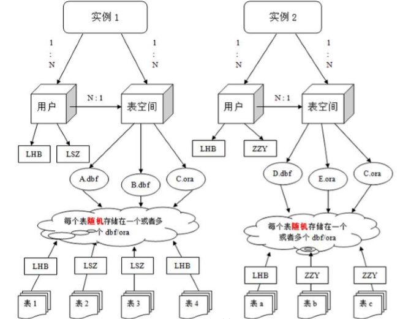
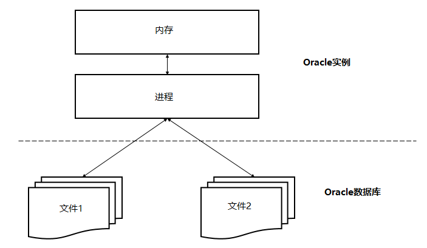
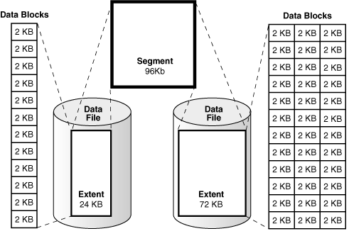
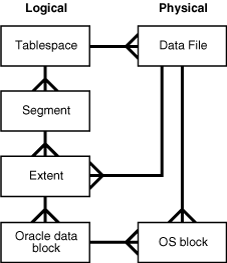
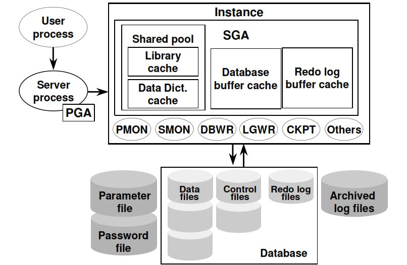

# 1.oracle基本概述

## 1.1 了解

ORACLE数据库系统是美国ORACLE公司（甲骨文）提供的以分布式数据库为核心的一组软件产品，是目前最流行的客户/服务器(CLIENT/SERVER)或B/S体系结构的数据库之一。

> Oracle 是一种高效率、可靠性好的、适应高吞吐量的数据库解决方案。

Oracle 数据库主要有四个版本，如下所示。

- 企业版:它是最强大和最安全的版本。它提供所有功能，包括卓越的性能和安全性。
- 标准版：它为不需要企业版强大软件包，提供用户基本功能。
- 易捷版(XE):它是轻量级，免费且有限的 Windows 和 Linux 版本。
- Oracle Lite：专为移动设备而设计。

ORACLE数据库的**优势**所在：

1. 完整的数据管理功能：

   - 数据的大量性
   - 数据的保存的持久性
   - 数据的共享性
   - 数据的可靠性

2.  完备关系的产品：

   - 信息准则---关系型DBMS的所有信息都应在逻辑上用一种方法，即表中的值显式地表示
   - 保证访问的准则
   - 视图更新准则---只要形成视图的表中的数据变化了，相应的视图中的数据同时变化
   - 数据物理性和逻辑性独立准则

3.  分布式处理功能：

   ORACLE数据库自第5版起提供了分布式处理能力，到第7版有比较完善的分布式数据库功能了，一个ORACLE分布式数据库由oraclerdbms、sql*Net、SQL*CONNECT和其他非ORACLE的关系型产品构成。

4. 用ORACLE能轻松的实现数据仓库的操作以上是Oracle数据库的优势，从这些优势中不难看出这是一款功能强大的数据库系统。

**优点：**

- 可用性强
- 可扩展性强
- 数据安全性强
- 稳定性强
- 开放性：oracle可以在所有主流的平台上运行，完全支持工业标准对开发商全力支持
- 安全性：获得最高认证级别的ISO标准认证
- 客户端支持以及应用模式：Oracle多层次网路计算机支持多种工业标准用ODBC，JDBC，OCI等网路客户链接
- 使用风险：Oracle长时间使用向下兼容得到广泛使用的风险

**缺点:**

- 对硬件要求高，价格也比较贵，管理也麻烦 操作比较复杂，技术要求比较高

## 1.2 简介

Oracle数据库是什么？

> Oracle Database，又名 Oracle RDBMS，简称 Oracle。Oracle 数据库系统是美国 Oracle 公司（甲骨文）提供的以**分布式数据库为核心**的一组软件产品，是目前最流行的客户/服务器（client/server）或**B/S体系结构**的数据库之一，比如 SilverStream 就是基于数据库的一种中间件。Oracle 数据库是目前世界上使用最为广泛的数据库管理系统，作为一个通用的数据库系统，它具有完整的数据管理功能；作为一个关系型数据库，它是一个完备关系的产品；作为分布式数据库它实现了分布式处理功能，但它的所有知识，只要在一种机型上学习了Oracle知识，便能在各种类型的机器上使用它。

- DDL：数据库定义语言：create、drop
- DML：数据库的操作语言：insert、update、delete
- DQL：数据库的查询语言：select
- DCL：数据库的控制语言：grant、revoke

1. 数据文件（dbf）

   **数据文件是数据库的物理存储单位**。数据库的数据是存储在表空间中的，真正是在某一个或者多个数据文件中，而一个表空间可以由一个或多个数据文件组成，一个数据文件只能属于一个表空间。一旦数据文件被加入到某个表空间后，就不能删除这个文件，如果要删除某个数据文件，只能删除其所属于的表空间才行。

2. 表空间

   **表空间是Oracle对物理数据库上相关数据文件（ORA 或者DBF文件）的逻辑映射**。一个数据库在逻辑上被划分成一到若干个表空间，每个表空包含了在逻辑上相关联的一组结构。每个数据库至少有一个表空间（称之为system表空间）。每个表空间由同一磁盘上的一个或多个文件组成，这些文件叫数据库文件（datafile）。一个数据文件只能属于一个表空间。

   

3. 用户

   用户是在实例下建立的。不同实例中可以建相同名字的用户。

   > 注：表的数据，是由用户放入某一个表空间的，而这个表空间会随机把这些表数据放到一个或者多个数据文件中。由于Oracle的数据库不是普通的概念，oracle是由用户和表空间对数据进行管理和存放的。但是表不是由表空间去查询的，而是由用户去查的。因为不同用户可以在同一个表空间建立同一个名字的表！这里区分就是用户了！

   

   SCOTT和HR（用户）

   scott与hr就是初始的普通用户，这些用户下面都默认存在了表结构

## 1.3 数据库和实例 

Oracle数据库服务器由一个数据库和至少一个数据库实例组成。 数据库是一组存储数据的文件，而数据库实例则是管理数据库文件的内存结构。此外，数据库是由后台进程组成。

**数据库和实例是紧密相连的，所以我们一般说的Oracle数据库，通常指的就是实例和数据库。**

下图说明了Oracle数据库服务器体系结构：



在这种体系结构中，Oracle 数据库服务器包括两个主要部分：文件(Oracle数据库)和内存(Oracle实例)。

### 1.3.1 Oracle数据库 

Oracle 数据库的一个基本任务是存储数据，以下部分简要地介绍 Oracle 数据库的物理和逻辑存储结构。

1. 物理存储结构

   物理存储结构是存储数据的纯文件。当执行一个 CREATE DATABASE 语句来创建一个新的数据库时，将创建下列文件：

   - **数据文件**：数据文件包含真实数据，例如销售订单和客户等。逻辑数据库结构(如表和索引)的数据被物理存储在数据文件中。

   - **控制文件**：每个 Oracle 数据库都有一个包含元数据的控制文件。元数据用来描述包括数据库名称和数据文件位置的数据库物理结构。

   - **联机重做日志文件**：每个 Oracle 数据库都有一个联机重做日志，里面包含两个或多个联机重做日志文件。联机重做日志由重做条目组成，能够记录下所有对数据所做的更改。

   > 除这些文件外，Oracle 数据库还包括如参数文件、网络文件、备份文件以及用于备份和恢复的归档重做日志文件等重要文件。

2. 逻辑存储结构

   Oracle 数据库使用逻辑存储结构对磁盘空间使用情况进行精细控制。以下是 Oracle 数据库中的逻辑存储结构：

   - **数据块(Data blocks)**：Oracle 将数据存储在数据块中。数据块也被称为逻辑块，Oracle 块或页，对应于磁盘上的字节数。

   - **范围(Extents)**：范围是用于存储特定类型信息的逻辑连续数据块的具体数量。

   - **段(Segments)**：段是分配用于存储用户对象(例如表或索引)的一组范围。

   - **表空间(Tablespaces)**：数据库被分成称为表空间的逻辑存储单元。 表空间是段的逻辑容器。 每个表空间至少包含一个数据文件。

下图说明了表空间中的段，范围和数据块：



下图显示了逻辑和物理存储结构之间的关系：



### 1.3.2 Oracle实例

Oracle 实例是客户端应用程序(用户)和数据库之间的接口。**Oracle 实例由三个主要部分组成：系统全局区 (SGA)，程序全局区 (PGA) 和后台进程**。如下图所示 ：



SGA 是实例启动时分配的共享内存结构，关闭时释放。 SGA 是一组包含一个数据库实例的数据和控制信息的共享内存结构。

不同于所有进程都可用的 SGA，PGA 是会话开始时为每个会话分配的私有内存区，当会话结束时释放。

**主要的Oracle数据库的后台进程**

以下是 Oracle 实例的主要后台进程：

- PMON 是Oracle数据库中最活跃的一个进程，是调节所有其他进程的进程监视器。PMON 能够清理异常连接的数据库连接，并自动向侦听器进程注册数据库实例。
-  SMON 是执行系统级清理操作的系统监视进程。它有两个主要职责，包括在发生故障的情况下自动恢复实例，例如断电和清理临时文件。
- DBWn 是数据库编写器。Oracle 在内存中执行每个操作而不是磁盘。因为在内存中的处理速度比在磁盘上快。DBWn 进程从磁盘读取数据并将其写回到磁盘。 一个 Oracle 实例有许多数据库编写器，如：DBW0，DBW1，DBW2等等。
- CKPT 是检查点过程。 在 Oracle 中，磁盘上的数据称为块，内存中的数据称为缓冲区。 当该块写入缓冲区并更改时，缓冲区变脏，需要将其写入磁盘。CKPT 进程使用检查点信息更新控制和数据文件头，并向脏盘写入脏缓冲区的信号。 请注意，Oracle 12c 允许全面和增量检查点。
- LGWR 是日志写入过程，是可恢复架构的关键。 在数据库中发生的每一个变化都被写出到一个名为 redo 日志文件中用于恢复目的。 而这些变化是由 LGWR 进程编写和记录的。 LGWR 进程首先将更改写入内存，然后将磁盘写入重做日志，然后将其用于恢复。
- ARCn 是归档进程，它将重做日志的内容复制到归档重做日志文件。存档程序进程可以有多个进程，如：ARC0，ARC1 和 ARC3，允许存档程序写入多个目标，如 D：驱动器，E：驱动器或其他存储。
- MMON 是收集性能指标的可管理性监控流程。
- MMAN 是自动管理 Oracle 数据库内存的内存管理器。
- LREG 是监听器注册过程，它使用 Oracle Net Listener 在数据库实例和调度程序进程上注册信息。

# 2. oracle 表空间的创建

oracle 11g已经安装在了本机的docker中，所以这里不再重复，具体可查看docker笔记部分

1. 创建新用户并授予权限

   - 启动sqlplus

     > 注：由于是在docker安装，所以启动前别忘了执行`source /home/oracle/.bash_profile`

   - 登录超级管理员用户

     ```
     账户: sys as sysdba
     密码：sys (密码是更改后的)
     ```

   - 创建新用户

     使用以下 CREATE USER 语句创建一个新用户

     ```sql
     -- 创建用户
     create user docker_test_user
     --- 指定密码
     identified by docker_test_pass
     -- 指定此用户的表空间
     default tablespace docker_test;
     ```

     > oracle 数据库与其它数据库产品的区别在于，表和其它的数据库对象都是存储在用户下的

   - 授权

     通过使用以下 GRANT 语句授予 test_user 用户权限：

     > 注：必须是system管理员或者sys超级管理员才可以给用户赋予权限

     ```sql
     -- 给用户授权
     -- oracle 数据库中常用角色有：
     -- connect -- 连接角色，基本角色
     -- resource -- 开发者角色
     -- dba -- 超级管理员角色
     
     --- 给docker_test_user用户授予权限
     grant connect,resource,dba to docker_test_user;
     ```

     > 新创建的用户没有任何权限，登陆后会提示
     >
     > ```
     > ORA-01045: user WATERUSER lacks CREATE SESSION privilege; logon denied
     > ORA-01045：用户WATERUSER缺少CREATE SESSION权限； 登录被拒绝
     > ```

     Oracle 中已存在三个重要的角色：connect 角色，resource 角色，dba 角色

     ```
     CONNECT 角色： --是授予最终用户的典型权利，最基本的
         ALTER SESSION --修改会话
         CREATE CLUSTER --建立聚簇
         CREATE DATABASE LINK --建立数据库链接
         CREATE SEQUENCE --建立序列
         CREATE SESSION --建立会话
         CREATE SYNONYM --建立同义词
         CREATE VIEW --建立视图
         
     RESOURCE 角色： --是授予开发人员的
         CREATE CLUSTER --建立聚簇
         CREATE PROCEDURE --建立过程
         CREATE SEQUENCE --建立序列
         CREATE TABLE --建表
         CREATE TRIGGER --建立触发器
         CREATE TYPE --建立类型
         
     DBA 角色：拥有全部特权，是系统最高权限，只有 DBA 才可以创建数据库结构，并且系统权限也需要 DBA 授出，且 DBA 用户可以操作全体用户的任意基表，包括删除
     ```

     

2. 登录新帐号

   使用test_user用户帐户连接到数据库(ORCL)。 当 SQL Plus 提示输入用户名和密码时，输入：test_user和 123456。

   对于 Oracle 11g/12c，使用如下命令切换用户：

   ```
   SQL> CONNECT test_user@orcl
   输入口令:
   已连接。
   ```

   > 注意，test_user用户仅存在于 ORCL 数据库中，因此，必须在 CONNECT 命令中明确指定用户名为 ot@orcl。

   > 说明：docker中在连接测试用户时指定orcl数据库时出错，只要不指定就没问题，或者指定@helowin，
   >
   > 原因好像是我的oracle数据库的服务名和sid是helowin，有待研究
   >
   > ```
   > SQL> connect test_user@orcl
   > Enter password:
   > ERROR:
   > ORA-12154: TNS:could not resolve the connect identifier specified
   > ORA-12154：TNS：无法解析指定的连接标识符
   > 
   > Warning: You are no longer connected to ORACLE.
   > 警告：您不再连接到ORACLE。
   > 
   > SQL> show user
   > USER is ""
   > 
   > SQL> connect test_user;
   > Enter password:
   > Connected.
   > 
   > SQL> connect test_user@helowin
   > Enter password:
   > Connected.
   > 
   > SQL>
   > ```

3. 创建表空间

   通过命令行创建

   ```sql
   -- 创建表空间
   create tablespace docker_test
   -- 指定数据文件所在位置，虚拟机路径
   datafile '/home/oracle/app/oracle/oradata/helowin/docker_tablespace/docker_test.dbf'
   -- 表空间初始大小
   size 1mb
   -- 自动扩展大小
   autoextend on
   -- 每次扩展1mb
   next 1m;
   ```

   > 说明：Oracle数据库是通过表空间来存储物理表的，一个数据库下可以建立多个表空间，一个表空间可以建立多个用户、一个用户下可以建立多个表。
   >
   > **表空间(tablespace)是数据库的逻辑划分**，每个数据库至少有一个表空间（称作SYSTEM表空间）。为了便于管理和提高运行效率，可以使用一些附加表空间来划分用户和应用程序。例如：USER表空间供一般用户使用，RBS表空间供回滚段使用。一个表空间只能属于一个数据库。

   删除表空间

   ```sql
   -- 删除空的表空间，但是不包含物理文件
   drop tablespace docker_test;
   ```

# 3. Oracle数据类型

| 数据类型        | 参数                   | 描述                                                         |
| --------------- | ---------------------- | ------------------------------------------------------------ |
| char(n)         | n=1 to 2000字节        | 定长字符串，n字节长，如果不指定长度，缺省为1个字节长（一个汉字为2字节） |
| varchar2(n)     | n=1 to 4000字节        | 可变长的字符串，具体定义时指明最大长度n， 这种数据类型可以放数字、字母以及ASCII码字符集(或者EBCDIC等数据库系统接受的字符集标准)中的所有符号。 如果数据长度没有达到最大值n，Oracle 8i会根据数据大小自动调节字段长度， 如果你的数据前后有空格，Oracle 8i会自动将其删去。VARCHAR2是最常用的数据类型。 可做索引的最大长度3209。 |
| number(m,n)     | m=1 to 38 n=-84 to 127 | 可变长的数值列，允许0、正值及负值，m是所有有效数字的位数，n是小数点以后的位数。 如：number(5,2)，则这个字段的最大值是99,999，如果数值超出了位数限制就会被截取多余的位数。 如：number(5,2)，但在一行数据中的这个字段输入575.316，则真正保存到字段中的数值是575.32。 如：number(3,0)，输入575.316，真正保存的数据是575。 |
| date            | 无                     | 从公元前4712年1月1日到公元4712年12月31日的所有合法日期， Oracle 8i其实在内部是按7个字节来保存日期数据，在定义中还包括小时、分、秒。 缺省格式为DD-MON-YY，如07-11月-00 表示2000年11月7日。 |
| long            | 无                     | 可变长字符列，最大长度限制是2GB，用于不需要作字符串搜索的长串数据，如果要进行字符搜索就要用varchar2类型。 long是一种较老的数据类型，将来会逐渐被BLOB、CLOB、NCLOB等大的对象数据类型所取代。 |
| raw(n)          | n=1 to 2000            | 可变长二进制数据，在具体定义字段的时候必须指明最大长度n，Oracle 8i用这种格式来保存较小的图形文件或带格式的文本文件，如Miceosoft Word文档。 raw是一种较老的数据类型，将来会逐渐被BLOB、CLOB、NCLOB等大的对象数据类型所取代。 |
| long raw        | 无                     | 可变长二进制数据，最大长度是2GB。Oracle 8i用这种格式来保存较大的图形文件或带格式的文本文件，如Miceosoft Word文档，以及音频、视频等非文本文件。 在同一张表中不能同时有long类型和long raw类型，long raw也是一种较老的数据类型，将来会逐渐被BLOB、CLOB、NCLOB等大的对象数据类型所取代。 |
| blob clob nclob | 无                     | 三种大型对象(LOB)，用来保存较大的图形文件或带格式的文本文件，如Miceosoft Word文档，以及音频、视频等非文本文件，最大长度是4GB。 LOB有几种类型，取决于你使用的字节的类型，Oracle 8i实实在在地将这些数据存储在数据库内部保存。 可以执行读取、存储、写入等特殊操作。 |
| bfile           | 无                     | 在数据库外部保存的大型二进制对象文件，最大长度是4GB。 这种外部的LOB类型，通过数据库记录变化情况，但是数据的具体保存是在数据库外部进行的。 Oracle 8i可以读取、查询BFILE，但是不能写入。 大小由操作系统决定。‘ |

当你在数据库中创建数据表的时候，你需要定义表中所有字段的类型。**ORACLE**有许多种**数据类型**以满足你的需要。**数据类型**大约分为：character, number, date, LOB, 和RAW等类型。虽然**ORACLE**8i也允许你自定义**数据类型**，但是它们是最基本的数据类型。 

# 4. 表的管理

1. 建表

   语法：

   ```sql
   Create table 表名(
       字段 1 数据类型 [default 默认值],
       字段 2 数据类型 [default 默认值],
       ...
       字段 n 数据类型 [default 默认值]
   );
   ```

   示例：

   ```sql
   -- 新建person表
   create table person(
   	pid number(20),
   	pname VARCHAR2(10)
   );
   ```

   > 注：表会被创建在当前所在用户下

2. 表删除

   语法：

   ```sql
   DROP TABLE 表名
   ```

   示例：

   ```sql
   -- 三个删除
   -- 删除表中全部记录
   delete from person;
   
   -- 删除表结构
   drop table person;
   
   -- 先删除表，再次创建表。效果等同于删除表中全部记录
   -- 在数据量大的情况下，尤其是在表中带有索引的情况下，此操作效率极高
   -- 索引可以提供查询效率，但是会影响增删改效率
   truncate table person;
   ```

3. 表的修改

   在 sql 中使用 alter 可以修改表

   ```sql
   添加语法：
   ALTER TABLE 表名称 ADD(列名 1 类型 [DEFAULT 默认值]，列名 1 类型
   [DEFAULT 默认值]...)
   
   修改语法：
   ALTER TABLE 表名称 MODIFY(列名 1 类型 [DEFAULT 默认值]，列名 1 类型
   [DEFAULT 默认值]...)
   
   修改列名:
   ALTER TABLE 表名称 RENAME 列名 1 TO 列名 2
   ```

   示例：

   ```sql
   -- 修改表结构
   -- 添加一列，仅一列
   alter table person add gender number(1);
   -- 添加多列，使用逗号分割，并添加括号
   alter table person add (phone VARCHAR2(11),message VARCHAR2(55));
   -- 修改列类型
   alter table person modify gender char(1);
   -- 修改列名称
   alter table person rename column gender to sex;
   -- 删除一列
   alter table person drop column message;
   ```

4. 数据库表数据的更新

   - INSERT（增加）

     ```sql
     标准写法：
     INSERT INTO 表名[(列名 1，列名 2，...)]VALUES(值 1，值 2，...)
     简单写法（不建议）
     INSERT INTO 表名 VALUES(值 1，值 2，...)
     ```

     > 注意：使用简单的写法必须按照表中的字段的顺序来插入值，而且如果有为空的字段使用 null

     示例：

     ```sql
     -- 添加一条记录
     insert into person (pid,pname,sex,phone) values (1,'小明',1,'123456789');
     ```

   - UPDATE（修改）

     ```sql
     全部修改：UPDATE 表名 SET 列名 1=值 1，列名 2=值 2，....
     
     局部修改：UPDATE 表名 SET 列名 1=值 1，列名 2=值 2，....WHERE 修改条件；
     ```

     示例：

     ```sql
     -- 修改一条记录
     update person set pname = '小马' where pid = 1;
     ```

   - DELETE（删除）

     ```sql
     语法 : DELETE FROM 表名 WHERE 删除条
     ```

     > 注：在删除语句中如果不指定删除条件的话就会删除所有的数据

   因为 oracle 的事务对数据库的变更的处理，我们必须做提交事务才能让数据真正的插入到数据库中，在同样在执行完数据库变更的操作后还可以把 事务进行回滚，这样就不会插入到数据库。如果事务提交后则不可以再回滚

   > 提交：commit
   > 回滚：rollback

5. 序列

   在很多数据库中都存在一个自动增长的列，如果现在要想在 oracle 中完成自动增长的功能，则只能依靠序列完成，所有的自动增长操作，需要用户手工完成处理。

   语法：

   ```sql
   语法：
   CREATE SEQUENCE 序列名
   [INCREMENT BY n] 
   [START WITH n] 
   [{MAXVALUE/ MINVALUE n|NOMAXVALUE}] 
   [{CYCLE|NOCYCLE}] 
   [{CACHE n|NOCACHE}];
   ```

   示例：创建一个 seqpersonid 的序列,验证自动增长的操作

   ```sql
   -- 序列：默认从1开始，依次递增，主要用来给主键赋值使用
   -- 这里是逻辑上的关系，包括起名也是一样，s代表sequence
   create sequence s_person;
   ```

   序列创建完成之后,所有的自动增长应该由用户自己处理,所以在序列中提供了以下的两种操作：

   - nextval ：取得序列的下一个内容

   - currval ：取得序列的当前内容

   ```sql
   -- 序列不真的属于任何一张表，但是可以逻辑和表做绑定
   -- dul：虚表，只是为了补语法，没有任何意义。
   select s_person.nextval from dual; -- 自增一个
   select s_person.currval from dual; -- 查询当前序列
   ```

   在插入数据时需要自增的主键中可以这样使用

   ```sql
   -- 添加了主键自增的插入语法
   insert into person (pid,pname,sex,phone) values (s_person.nextval,'小明',1,'123456789');
   ```

   > 在实际项目中每一张表会配一个序列，但是表和序列是没有必然的联系的，一个序列被哪一张表使用都可以，但是我们一般都是一张表用一个序列。
   >
   > 序列的管理一般使用工具来管理

# 5. 函数

## 5.1 单行函数

1. 字符函数

   接收字符输入返回字符或者数值，dual 是伪表

   - 把小写的字符转换成大小的字符

     ```sql
     select upper('yes') from dual; --- 小写变大写
     ```

   - 把大写字符变成小写字符

     ```sql
     select lower('YES') from dual; --- 大写变小写
     ```

2. 数值函数

   四舍五入函数：ROUND()

   默认情况下 ROUND 四舍五入取整，可以自己指定保留的位数

   ```sql
   --数值函数
   select round(26.12,-1) from dual; -- 四舍五入，后面的参数表示保留的位数
   select trunc(26.12,-1) from dual; -- 直接截取，不再看后面的位数的数字
   select mod(10,3) from dual; -- 求余数
   ```

3. 日期函数

   Oracle 中提供了很多和日期相关的函数，包括日期的加减，在日期加减时有一些规律：

   日期 – 数字 = 日期

   日期 + 数字 = 日期

   日期 – 日期 = 数字

   - 查询雇员的进入公司的周数。

     分析：查询雇员进入公司的天数(sysdate – 入职日期)/7就是周数

     ```sql
     -- 查询EMP表中，所有员工入职距离现在几周
     select round((sysdate-e.hiredate) / 7) from emp e;
     ```

   - 获得两个时间段中的月数：MONTHS_BETWEEN()

     范例：查询所有雇员进入公司的月数

     ```sql
     -- 查询EMP表中，所有员工入职距离现在几月
     select months_between(sysdate,e.hiredate) from emp e; 
     ```

   - 查询EMP表中，所有员工入职距离现在几天 

     ```sql
     -- 查询EMP表中，所有员工入职距离现在几天  
     select sysdate-e.hiredate from emp e; -- sysdate 拿系统时间，且日期可以直接加减，最终的单位是天
     ```

   - 查询EMP表中，所有员工入职距离现在几年

     ```sql
     -- 查询EMP表中，所有员工入职距离现在几年
     select months_between(sysdate,e.hiredate) / 12 from emp e; 
     ```

   - 算出明天的这个时候

     ```sql
     -- 算出明天的这个时候
     select sysdate + 1 from dual;
     ```

4. 转换函数

   - TO_CHAR：字符串转换函数

     范例：查询所有的雇员将将年月日分开，此时可以使用 TO_CHAR 函数来拆分，拆分时需要使用通配符

     年：y, 年是四位使用 yyyy

     月：m, 月是两位使用 mm

     日：d, 日是两位使用 dd

     ```sql
     -- 转换函数，主要还是对日期的转换
     -- 日期转字符串
     select to_char(sysdate,'fm yyyy-mm-dd hh24:mi:ss') from dual; -- 注意，这里不区分大小写，所以不要重复，24表示变为24小时制，fm表示去掉08前面的0
     ```

     > 在结果中 10 以下的月前面被被补了前导零，可以使用 fm 去掉前导零

   - TO_DATE:日期转换函数

     TO_DATE 可以把字符串的数据转换成日期类型

     ```sql
     -- 字符串转日期
     select to_date('2020-11-22 08:56:17','fm yyyy-mm-dd hh24:mi:ss') from dual;
     ```

5. 通用函数

   - 空值处理 nvl

     范例：查询所有的雇员

     ```sql
     --算出EMP表中所有员工的年薪，如果null值和任意数字做算数运算，结果都是null
     select e.sal*12 + nvl(e.comm,0) from emp e; -- nvl 表示如果参数1里面有null值，则使用第二位参数
     ```

   - Decode 函数

     该函数类似 if....else if...esle

     ```sql
     语法：DECODE(col/expression, [search1,result1],[search2, result2]....[default])
     ```

     - Col/expression:列名或表达式
     - Search1，search2...:用于比较的条件
     - Result1, result2...:返回值

     如果 col/expression 和 Searchi 匹配就返回 resulti，否则返回 default 的默认值

     范例：查询出所有雇员的职位的中文名

     ```sql
     select ename,
     	decode(job,
     		'CLERK','业务员',
     		'SALESMAN','销售',
     		'MANAGER','分析员',
     		'MANAGER','经理',
     		'无业'
     		)
     	from emp;
     ```

   - case when

     语法：

     ```sql
     CASE expr WHEN comparison_expr1 THEN return_expr1
         [WHEN comparison_expr2 THEN return_expr2
         WHEN comparison_exprn THEN return_exprn 
         ELSE else_expr]
     END
     ```

     示例

     ```sql
     -- 给emp表中员工起中文名，通用写法，mysql和oracle都可以
     select e.ename, 
     	-- 只要不加逗号，写的再长也是一列内容
     	case e.ename
     		when 'SMITH' then '德玛'  -- 可以有无限个when then
     			when 'ALLEN' then '德邦'
     				else '提莫'
     				end
     
     from emp e;
     
     -- 判断emp表中员工工资，如果高与3000显示高收入，如果高于1500低于300 显示中收入，其余显示低收入
     select e.ename, 
     	case 
     		when e.sal > 3000 then '高收入' 
     			when e.sal > 1500 then '中收入'
     				else '低收入'
     				end
     
     from emp e;
     
     -- oracle 专用条件表达式
     -- oracle 中除了起别名，都用单引号
     select e.ename, 
     	decode(e.ename,
     		 'SMITH' , '德玛',
     			 'ALLEN' , '德邦',
     				 '提莫') "中文名" -- 不能加单引号，会报错，双引号可以
     
     from emp e;
     ```

     

## 5.2 多行函数（聚合函数）

1. 统计记录数

   ```sql
   -- 多行函数[聚合函数]：作用于多行，返回一个值
   select count(1) from emp; -- 查询总数量(推荐)
   select count(*) from emp; -- 不建议使用 count(*)，可以使用一个具体的列以免影响性能
   select count(empno) from emp; -- 查询总数量（等价上面的写法）
   ```

2. 最值查询

   ```sql
   select max(sal) from emp; -- 最大工资
   select sum(sal) from emp; -- 工资总和
   select min(sal) from emp; -- 最小工资
   select avg(sal) from emp; -- 平均工资
   ```

# 6. 分组统计

分组统计需要使用 GROUP BY 来分组

语法：

```sql
SELECT * |列名 FROM 表名 {WEHRE 查询条件} {GROUP BY 分组字段} ORDER BY 列名 1 ASC|DESC，列名 2...ASC|DESC
```

示例：

1. 查询出每个部门的平均工资

   ```sql
   -- 心得：复杂查询不要一次写完，先先出关键字再填写内容
   -- 分组查询中，出现在group by后面的原始列，才能出现在select后面，没有出现在group by后面的列，想在select后面出现，则必须加上聚合函数
   -- 聚合函数有一个特性，可以把多行记录变为一个值
   -- deptno是部门编号 department No. 的简写 
   select e.deptno,avg(e.sal) --,e.ename
   from emp e
   group by e.deptno;
   ```

2. 查询出平均工资高于2000的部门信息

   ```sql
   -- 查询出平均工资高于2000的部门信息
   select e.deptno,avg(e.sal) asal
   from emp e
   group by e.deptno
   
   -- 所有条件都不能使用别名来判断，条件优于select，即先看条件，再看其他
   -- having avg(e.asal) > 2000;
   having avg(e.sal) > 2000;
   
   -- 错误示例
   select ename,sal s from emp where s > 2000;
   --报错内容：ORA-00904: "S": invalid identifier（无效的标识符）
   ```

3. 查询每个部门的人数

   ```sql
   -- 查询每个部门的人数
   select e.deptno,count(1)
   from emp e
   group by e.deptno
   
   -- 注意：小心以下写法
   select DEPTNO,count(ename) from emp;
   --报错：not a single-group group function  不是单组分组函数
   
   原因：
   1.如果使用分组函数，SQL 只可以把 GOURP BY 分组条件字段和分组函数查询出来，不能有其他字段。 
   2. 如果使用分组函数，不使用 GROUP BY 只可以查询出来分组函数的值 
   ```

4. 查询出每个部门工资高于800的员工的平均工资

   ```sql
   -- 查询出每个部门工资高于800的员工的平均工资
   select e.deptno,avg(e.sal) asal
   from emp e
   where e.sal > 800 -- where 过滤分组前的数据
   group by e.deptno;
    -- having 过滤分组后的数据
    -- 表现形式为：where在group by之前，having在group by之后
   ```

5. 查询出每个部门工资高于800的员工的平均工资，查询出平均工资高于2000的部门

   ```sql
   -- 查询出每个部门工资高于800的员工的平均工资，查询出平均工资高于2000的部门
   select e.deptno,avg(e.sal) asal
   from emp e
   where e.sal > 800  
   group by e.deptno 
   having avg(sal) > 2000 
   ```

   

# 7. 多表查询

## 7.1 多表连接基本查询

使用一张以上的表做查询就是多表查询

语法： 

```sql
SELECT {DISTINCT} *|列名.. FROM 表名 别名，表名 1 别名 {WHERE 限制条件 ORDER BY 排序字段 ASC|DESC...}
```

范例：查询员工表和部门表

```sql
select * from emp,dept;
```

我们发现最终产生的记录数是 56 条，我们还会发现 emp 表是 14 条，dept 表是 4 条，56 正是 emp表和 dept 表的记录数的乘积，我们称其为**笛卡尔积**

如果多张表进行一起查询而且每张表的数据很大的话笛卡尔积就会变得非常大，对性能造成影响，**想要去掉笛卡尔积我们需要关联查询。**

在两张表中我们发现有一个共同的字段是 depno，depno 就是两张表的关联的字段，我们可以使用这个字段来做限制条件，**两张表的关联查询字段一般是其中一张表的主键，另一张表的外键**

```sql
select * 
from emp e ,dept d
where e.deptno = d.deptno;
```

关联之后我们发现数据条数是 14 条，不在是 56 条。

范例：

1. 查询出雇员的编号，姓名，部门的编号和名称，地址

   ```sql
   -- 查询出雇员的编号，姓名，部门的编号和名称，地址
   select e.EMPNO,e.ENAME,d.DEPTNO,d.dname,d.loc
   from emp e ,dept d
   where e.deptno = d.DEPTNO
   ```

2. 查询出每个员工的上级领导

   > 分析：emp 表中的 mgr字段是当前雇员的上级领导的编号，所以该字段对 emp表产生了自身关联，可以使用 mgr 字段和 empno 来关联

   ```sql
   -- 查询出员工姓名，员工领导姓名
   -- 自连接：其实就是站在不同的角度把一张表看成多张表
   select e1.ename,e2.ename
   from emp e1,emp e2
   where e1.mgr = e2.empno;
   ```

3. 查询出员工姓名，员工部门名称，员工领导姓名，员工领导部门名称

   ```sql
   -- 查询出员工姓名，员工部门名称，员工领导姓名，员工领导部门名称
   select e1.ename,d1.dname,e2.ename,d2.dname
   from emp e1,emp e2，dept d1,dept d2
   where e1.mgr = e2.empno
   and e1.deptno = d1.deptno;
   and e2.deptno = d2.deptno;
   ```

   

## 7.2 外连接

左右连接其实是一个概念

当我们在做基本连接查询的时候，查询出所有的部门下的员工，我们发现编号为 40 的部门下没有员工，但是要求把该部门也展示出来，我们发现上面的基本查询是办不到的

```sql
-- 查询所有员工信息，以及员工所属部门
select *
from emp e left join dept d
on e.deptno = d.deptno;

-- oracle 专属外连接
select * 
from emp e ,dept d
where e.deptno(+) = d.deptno; 
```

> 使用(+)表示左连接或者右连接，当(+)在左边表的关联条件字段上时是左连接，如果是在右边表的关联条件字段上就是右连接

示例：查询出所有员工的上级领导

> 我们发现使用我们以前的做法发现 KING 的上级领导没有被展示，我们需要使用左右连接把他查询出来

```sql
select e.EMPNO,e.ENAME,m.EMPNO,m.ename
from emp e,emp m
where e.MGR = m.empno(+);
```


# 8. 子查询

子查询：在一个查询的内部还包括另一个查询，则此查询称为子查询。

> Sql的任何位置都可以加入子查询。

示例：查询比 7654 工资高的雇员

> 先查询出 7654 员工的工资是多少，把它作为条件

```
select * 
from emp t1
where t1.sal > (select t.sal from emp t where t.empno = 7654)
```


子查询在操作中有三类：

- 单列子查询：返回的结果是一列的一个内容

  示例：查询工资和scott一样的员工信息

  ```sql
  -- 查询工资和scott一样的员工信息
  select * from emp where sal in --=  -- 这里的 = 号是有隐患的，因为条件中的名字可能重复，保险其间可以写in
  (select sal from emp where ename = 'SCOTT');
  ```

- 单行子查询：返回多个列，有可能是一个完整的记录

  ```sql
  -- 子查询返回一个集合
  -- 查询出工资和10号部门任意员工一样的员工信息
  select * from emp where sal in 
  (select sal from emp where deptno = 10);
  ```

  

- 多行子查询：返回多条

  > 在返回多条记录的子查询可以把它的结果集当做一张表，给起个别名， 如下 

  ```sql
  -- 子查询返回一张表
  -- 查询出每个部门最低工资，和最低工资员工姓名和该员工所在部门名称
  -- 1. 先查询每个部门最低工资，当作子查询的内容
  select deptno,min(sal) msal
  from emp
  group by deptno
  
  -- 2. 三表联查，得到最终结果
  select t.deptno,t.msal,e.ename,d.dname
  from (
  	-- 子查询先执行里面的内容
  	select deptno,min(sal) msal
  	from emp
  	group by deptno
  ) t,emp e,dept d
  where t.deptno = e.deptno
  and t.msal = e.sal
  and e.deptno = d.deptno;
  ```


# 9. Rownum与分页查询 

ROWNUM：表示行号，实际上此是一个列，但是这个列是一个伪列，此列可以在每张表中出现。

oracle 中的分页：

- rownum行号：当我们做select操作的时候，每查询出一行记录，就会在该行上加上一个行号

- 行号从1开始，一次递增，不能跳着走


范例：查询 emp 表带有 rownum 列

```sql
select rownum, t.* from emp t
```

我们可以根据 rownum 来取结果集的前几行，比如前 5 行

```sql
select rownum, t.* from emp t where rownum < 6;
```

但是我们不能取到中间几行，**因为rownum不支持大于号，只支持小于号**，如果想 实现我们的需求怎么办呢？答案是**使用子查询**，也正是oracle分页的做法

```sql
-- emp表工资倒序排列后，每页五条记录，查询第二页
-- 排序操作会影响rownum顺序
select rownum,e.* from emp e order by e.sal desc;

-- 解决方法，先排序，再加序号
select rownum,t.* from (
	-- 如果涉及到排序，但是还要使用rownum的话，我们可以再次嵌套查询
	select rownum,e.* from emp e order by e.sal desc
) t;

-- 答案：(有点复杂，但是这是分页查询的最基本的格式，区别只是内容可能不同罢了）
-- 注意：rownum行号不能写上大于一个正数
select * from (
	select rownum rn,tt.* from (
		select * from emp order by sal desc
	) tt where rownum < 11 
) where rn > 5

-- 第二种写法：
select * 
from (select rownum r ,emp.* from emp) b
where b.r >5 and b.r <11
```

# 10. 视图

视图就是封装了一条复杂查询的语句。

语法 1：

```sql
CREATE VIEW 视图名称 AS 子查询
```

范例：建立一个视图，此视图包括了员工的名字和工作信息

```sql
-- 创建视图[必须有dba权限]，视图内的数据源自于原表。
create view v_emp as select ename,job from emp;
```

语法 2：

```sql
CREATE OR REPLACE VIEW 视图名称 AS 子查询
```

> 如果视图已经存在我们可以使用语法 2 来创建视图，这样已有的视图会被覆盖。

```sql
create or replace view empvd20 as select * from emp t where t.deptno = 20
```

视图的查询与修改

```sql
-- 查询视图
select * from v_emp;

-- 修改视图，修改了视图的数据相当于修改了原表的数据[不推荐修改视图]
update v_emp set job = 'CLERK' where ename = 'ALLEN';
```

语法3：

```sql
-- 创建只读视图
create view v_emp1 as select ename,job from emp with read only;
```

视图的作用：

1. 屏蔽一些敏感字段
2. 保证总不和分部数据及时统一

# 11. 索引

**索引是用于加速数据存取的数据对象**。合理的使用索引可以大大降低 i/o 次数,从而提高数据访问性能。索引有很多种，我们主要介绍常用的几种：

1. 单列索引单列索引是基于单个列所建立的索引

   ```sql
   CREATE index 索引名 on 表名(列名)
   ```

   ```sql
   -- 创建单列索引
   create index idx_ename on emp(ename);
   -- 单列索引触发规则，条件必须是索引列中的原始值
   -- 单行函数，模糊查询，都会影响索引的触发
   select * from emp where ename = 'SCOTT';
   ```

2. 复合索引

   **复合索引是基于两个列或多个列的索引**。在同一张表上可以有多个索引，但是要求**列的组合必须不同**

   ```sql
   -- 复合索引
   -- 创建复合索引，多个列的组合必须不同
   create index idx_ename_job on emp(ename,job);
   create index idx_ename_job on emp(job,ename);
   
   -- 复合索引中第一列为优先检索列
   -- 如果要触发复合索引，则必须包含有优先检索列中的原始值
   select * from emp where ename = 'SCOTT' and job = 'CLERK'; -- 触发复合索引
   select * from emp where ename = 'SCOTT' or job = 'CLERK'; -- 不触发索引
   select * from emp where ename = 'SCOTT'; -- 只触发单列索引
   ```

   

索引的使用原则：

- 在大表上建立索引才有意义
- 在 where 子句后面或者是连接条件上的字段建立索引
- 表中数据修改频率高时不建议建立索引

# 12. pl/sql 基本语法

什么是 PL/SQL?

PL/SQL（Procedure Language/SQL）

PLSQL 是 Oracle 对 sql 语言的过程化扩展，**指在 SQL 命令语言中增加了过程处理语句（如分支、循环等）**，使 SQL 语言具有过程处理能力。把 SQL 语言的数据操纵能力与过程语言的数据处理能力结合起来，使得 PLSQL 面向过程但比过程语言简单、高效、灵活和实用

## 12.1 pl/sql 程序语法

```plsql
declare
 说明部分 （变量说明，游标申明，例外说明 〕
begin
 语句序列 （DML 语句〕… 
exception
 例外处理语句 
End;
```

## 12.2 常量和变量定义

在程序的声明阶段可以来定义常量和变量

1. 变量的基本类型就是 oracle 中的建表时字段的变量如 char, varchar2, date, number, boolean, long

   定义语法：

   ```plsql
   varl char(15);
   Psal number(9,2)
   ```

   > 说明变量名、数据类型和长度后用分号结束说明语句。

2. 引用变量

   ```plsql
   Myname emp.ename%type;
   ```

   > 引用型变量，即 my_name 的类型与 emp 表中 ename 列的类型一样在 sql中使用 into 来赋值

   ```plsql
   declare
    emprec emp.ename%type;
   begin
    select t.ename into emprec from emp t where t.empno = 7369;
    dbms_output.put_line(emprec);
   end;
   ```

3. 记录型变量

   ```plsql
   Emprec emp%rowtype
   ```

   记录变量分量的引用

   ```plsql
   emp_rec.ename:='ADAMS'; 
   ```

   ```plsql
   declare
    p emp%rowtype;
   begin
    select * into p from emp t where t.empno = 7369;
    dbms_output.put_line(p.ename || ' ' || p.sal);
   end;
   ```

总览：

```plsql
-- 声明方法
declare
	-- 定义变量
	i number(2) := 10; -- := 表示赋值操作
	
	s varchar2(10) := '小明';
	
	-- 赋值操作可以用:= 也可以用into查询语句赋值
	ena emp.ename % type; -- 引用型变量
	
	emprow emp%rowtype; -- 记录型变量
begin
	-- 处理业务逻辑
	dbms_output.put_line(i);
	dbms_output.put_line(s);
	
	-- 查询语句赋值
	select ename into ena from emp where empno = 7788; 
  dbms_output.put_line(ena);
	
	-- 赋值
	select * into emprow from emp where empno = 7788;
  dbms_output.put_line(emprow.ename || '的工作为：' ||  emprow.job); -- plsql连接符是 ||
	
end;

```

## 12.3 if分支

1. 语法1

   ```plsql
   IF 条件 THEN 语句 1;
    语句 2;
    END IF;
   ```

2. 语法2

   ```plsql
   IF 条件 THEN 语句序列 1； 
    ELSE 语句序列 2；
    END IF;
   ```

3. 语法3

   ```plsql
   IF 条件 THEN 语句;
   ELSIF 语句 THEN 语句;
   ELSE 语句;
   END IF;
   ```


示例：

```plsql
-- if 判断
-- 输入小于18的数字，输出未成年
-- 输出大于18小于40的数字，输入中年人
-- 输入大于40的数字，输出老年人


declare
-- 这里报错 未解决：PLS-00103: Encountered the symbol "&" when expecting one of the following:
	i number(3):= &num;-- 输入一个值要用&号，&后可以跟任意变量
begin
	if i < 18 then
		dbms_output.put_line('未成年');
	elsif i < 40 then -- elsif是连起来写的，相当于 else if
		dbms_output.put_line('中成年');
	else
		dbms_output.put_line('老年人');
	end if;
end;

```

## 12.4 loop循环

```plsql
-- while循环
declare 
i number(2) := 1;
begin

	while i < 11 loop
			dbms_output.put_line(i);
			i := i + 1;
	end loop;
end;

-- exit循环
declare 
i number(2) := 1;
begin

	loop 
		exit when i > 10;
		dbms_output.put_line(i);
		i := i + 1;
	end loop;
end;

-- for 循环
declare 

begin

	for i in 1..10 loop
		dbms_output.put_line(i);
	end loop;
end;
```

## 12.5 游标

在写 java 程序中有集合的概念，那么在 pl/sql 中也会用到多条记录，这时候我们就要用到游标，游标可以存储查询返回的多条数据

语法：

```sql
CURSOR 游标名 [ (参数名 数据类型,参数名 数据类型,...)] IS SELECT 语句;
```

例如：

```plsql
cursor c1 is select ename from emp;
```

游标的使用步骤：

1. 打开游标： `open c1; `(打开游标执行查询)
2. 取一行游标的值：`fetch c1 into pjob;` (取一行到变量中)
3. 关闭游标： `close c1;`(关闭游标释放资源)
4. 游标的结束方式 `exit when c1%notfound`
5. 注意： 上面的 pjob 必须与 emp 表中的 job 列类型一致：

```plsql
-- 游标：可以存放多个对象，多行记录
-- 输出emp表中所有员工的姓名
declare
	-- 定义游标c1，并查询emp表，将所有的数据存入游标
	cursor c1 is select * from emp;
	
	-- 定义记录型变量接收遍历出来的对象
	emprow emp%rowtype;
begin 
 -- 遍历游标
	open c1;
		loop
			-- 从游标取值
			fetch c1 into emprow;
			-- 查不到的数据时候自动退出
			exit when c1%notfound;
			dbms_output.put_line(emprow.ename);
		end loop;
	close c1;
end;


-- 给指定部门员工涨工资
declare
	-- 定义一个带参数的游标，并赋值
	cursor c2(eno emp.deptno%type) is select empno from emp where deptno = eno;
	en emp.empno%type;
begin
	-- 打开游标的时候别忘了参数
	open c2(10);
		loop
			fetch c2 into en;
			exit when c2%notfound;
			
			update emp set sal = sal+100 where empno = en;
			commit;
		end loop;
	close c2;
end;

```

# 13. 存储过程

存储过程（Stored Procedure）是在大型数据库系统中，**一组为了完成特定功能的 SQL 语句集，经编译后存储在数据库中，用户通过指定存储过程的名字并给出参数（如果该存储过程带有参数）来执行它**。存储过程是数据库中的一个重要对象，任何一个设计良好的数据库应用程序都应该用到存储过程。

示例1：

```plsql
-- 存储过程
-- 存储过程：存储过程就是提前已经编译好的一段pl/sql语言，放在数据库端，可以被直接调用
-- 这一段pl/sql一般都是固定步骤的业务

-- 给指定员工涨100块钱
create or replace procedure p1(eno emp.empno%type)
is

begin
	update emp set sal = sal + 100 where empno = eno;
end;

-- 测试p1
declare

begin
	p1(7788);
end;

select * from emp where empno  = 7788;
```


# 14. 存储函数

存储过程和存储函数的区别

一般来讲，过程和函数的区别在于函数可以有一个返回值；而过程没有返回值。但过程和函数都可以通过 out 指定一个或多个输出参数。我们可以利用 out 参数，在过程和函数中实现返回多个值。

```plsql
-- 通过存储函数实现计算指定员工的年薪
-- 存储过程和存储函数的参数都不能带长度
-- 存储函数的返回值类型不能带长度
create or replace function f_yearsal(eno emp.empno%type) return number -- 注意number没有长度
is
	s number(10);
begin 
	select sal * 12 + nvl(comm,0) into s from emp where empno = eno;
	return s;
end;

-- 测试f_yearsal
declare
	s number(10);
begin
	-- 存储函数在调用的时候，返回值需要接收
	s := f_yearsal(7788);
	dbms_output.put_line(s);
end;

-- out类型参数如何使用

-- 使用存储过程来计算年薪
create or replace procedure p_yearsal(eno emp.empno%type,yearsal out number)
is
	s number(10);
	c emp.comm%type;
begin 
	select sal * 12,nvl(comm,0) into s,c from emp where empno = eno;
	yearsal := s + c;
end;

-- 测试p_yearsal
declare
	yearsal number(10);
begin
	p_yearsal(7788,yearsal);
	dbms_output.put_line(yearsal);
end;
```

in 和 out 类型参数的区别是什么？

凡是涉及到into查询语句赋值，或者`:=`赋值操作的参数，都必须使用out来修饰，其余都用in

1. 存储过程和存储函数的区别

2. 语法区别：关键字不同

3. 存储函数比存储过程多了两个return

4. 本质区别：存储函数有返回值，而存储过程没有返回值

5. 如果存储过程想要实现有返回值的业务，我们就必须使用out类型的参数

   即便是存储过程使用了out类型的参数，其本质也不是真的有了返回值，

   而是在存储过程内部给out类型参数赋值，然后在执行完毕后，直接拿到输出类型参数的值

```plsql
-- 案例需求：查询出员工姓名，员工所在部门及名称
select e.ename,dname
from emp e, dept d
where e.deptno = d.deptno;

-- 使用存储函数来实现提供一个部门编号，输出一个部门名称
create or replace function fdna(dno dept.deptno%type) return dept.dname%type
is
	dna  dept.dname%type;

begin
	select dname into dna from dept where deptno = dno;

	return dna;
end;

-- 使用fdna存储函数来实现案例需求：查询出员工姓名，员工所在部门及名称
select e.ename,fdna(e.deptno)
from emp e;

-- 存储过程无法做到上述操作
```

# 15. 触发器

数据库触发器是一个与表相关联的、存储的 PL/SQL 程序。每当一个特定的数据操作语句(Insert,update,delete)在指定的表上发出时，Oracle 自动地执行触发器中定义的语句序列。

触发器可用于

- 数据确认
- 实施复杂的安全性检查
- 做审计，跟踪表上所做的数据操作等
- 数据的备份和同步

触发器的类型

- 语句级触发器 ：在指定的操作语句操作之前或之后执行一次，不管这条语句影响了多少行 。
- 行级触发器（FOR EACH ROW） ：触发语句作用的每一条记录都被触发。在行级触 发器中使用 old 和 new 伪记录变量, 识别值的状态。

```plsql
-- 触发器，就是制定规则，在我们做增删改操作的时候，只要满足该规则，则自动触发无需调用

-- 语句触发器：不包含for each row的触发器
-- 行级触发器：包含for each row的就是行级触发器

-- 加for each row是为了使用:old或者:new对象或者一行记录

-- 语句触发器
-- 插入一条记录，输出一个新员工入职
create or replace trigger t1
after 
insert 
on person
declare
begin
	dbms_output.put_line('一个新员工入职');
end;

select * from person;

-- 触发t1
insert into person values(4,'小马',2,'123123');
commit;

-- 行级触发器
-- 不能给员工降薪

create or replace trigger t2
before
update
on emp
for each row
declare
begin
	if :old.sal > :new.sal then 
	  -- 抛异常，参数1为错误编号-20001--20999之间，参数2为错误内容
		raise_application_error(-20001,'不能给员工降薪');
	end if;
end;

-- 触发t2
update emp set sal = sal - 1 where empno = 7788;
commit;


-- 触发器实现主键自增
-- 在用户插入数据之前，拿到即将插入的数据，给该数据中的主键列赋值
create or replace trigger auid
before
insert
on person
for each row
declare

begin
	select s_person.nextval into :new.pid  from dual;
end;

-- 使用auid实现主键自增
insert into person (pname) values ('aaa');
commit;

select * from person;

SELECT INSTANCE_NAME FROM v$instance;
```

# 16. java程序调用存储过程

1. 导入坐标

   ```xml
   <dependencies>
       <!-- https://mvnrepository.com/artifact/com.oracle/ojdbc6 -->
       <dependency>
           <groupId>com.oracle</groupId>
           <artifactId>ojdbc6</artifactId>
           <version>11.2.0.4.0-atlassian-hosted</version>
       </dependency>
       <dependency>
           <groupId>junit</groupId>
           <artifactId>junit</artifactId>
           <version>4.13</version>
       </dependency>
   
   </dependencies>
   ```

2. 代码开发

   ```java
   import oracle.jdbc.OracleTypes;
   import org.junit.Test;
   
   import java.sql.*;
   
   /**
    * @Class:docker_oracle.PACKAGE_NAME.oracle
    * @Descript:
    * @Author:宋天
    * @Date:2020/11/22
    */
   public class OracleDemo {
       String driver="oracle.jdbc.driver.OracleDriver";
       // 使用此命令查询sid名：SELECT INSTANCE_NAME FROM v$instance;
       String url="jdbc:oracle:thin:@//localhost:1521/helowin";
       // 注意：要查询的表必须是在当前用户下才可
       String username="scott";
       String password="tiger";
   
       @Test
       public void javaCallOracle() throws Exception {
           // 加载数据库驱动
           Class.forName(driver);
           // 得到connection连接
           Connection connection = DriverManager.getConnection(url, username, password);
   
           // 得到预编译的Statement对象
           PreparedStatement ps = connection.prepareStatement("select * from emp where empno = ?");
   
           // 给参数赋值
           ps.setObject(1,7788);
   
           // 执行操作
           ResultSet resultSet = ps.executeQuery();
   
           while(resultSet.next()){
               System.out.println(resultSet.getString("ename"));
           }
   
           // 释放资源
   
           resultSet.close();
           ps.close();
           connection.close();
   
   
       }
   
       // java调用存储过程
       @Test
       public void javaCallProcedure() throws Exception {
           // 加载数据库驱动
           Class.forName(driver);
           // 得到connection连接
           Connection connection = DriverManager.getConnection(url, username, password);
   
           // 得到预编译的Statement对象
           CallableStatement cs = connection.prepareCall("{call p_yearsal(?,?)}");
   
           // 给参数赋值
           cs.setObject(1,7788);
           cs.registerOutParameter(2, OracleTypes.NUMBER);
   
           // 执行操作
           cs.execute();
           System.out.println(cs.getObject(2));
   
           // 释放资源
           cs.close();
           connection.close();
       }
   
       // java调用存储函数
       @Test
       public void javaCallFunction() throws Exception {
           // 加载数据库驱动
           Class.forName(driver);
           // 得到connection连接
           Connection connection = DriverManager.getConnection(url, username, password);
   
           // 得到预编译的Statement对象
           CallableStatement cs = connection.prepareCall("{?= call f_yearsal(?)}");
   
           // 给参数赋值
           cs.setObject(2,7788);
           cs.registerOutParameter(1, OracleTypes.NUMBER);
   
           // 执行操作
           cs.execute();
           System.out.println(cs.getObject(1));
   
           // 释放资源
           cs.close();
           connection.close();
       }
   }
   
   ```

   

