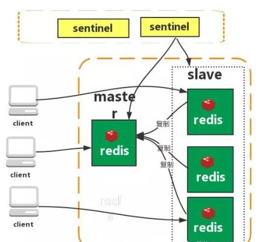

# 1. redis 简介

Redis 是完全开源免费的，遵守 BSD 协议，是一个灵活的高性能 key-value 数据结构存储，可以用来作为数据库、缓存和消息队列。

Redis 比其他 key-value 缓存产品有以下三个特点：

- Redis 支持数据的持久化，可以将内存中的数据保存在磁盘中，重启的时候可以再次加载到内存使用。
- Redis 不仅支持简单的 key-value 类型的数据，同时还提供 list，set，zset，hash 等数据结构的存储。
- Redis 支持主从复制，即 master-slave 模式的数据备份。


## 1.1 Redis 的特点

- **高性能**： Redis 将所有数据集存储在内存中，可以在入门级 Linux 机器中每秒写（SET）11 万次，读（GET）8.1 万次。Redis 支持 Pipelining 命令，可一次发送多条命令来提高吞吐率，减少通信延迟。
- **持久化**：当所有数据都存在于内存中时，可以根据自上次保存以来经过的时间和/或更新次数，使用灵活的策略将更改异步保存在磁盘上。Redis 支持仅附加文件（AOF）持久化模式。
- **数据结构**： Redis 支持各种类型的数据结构，例如字符串、散列、集合、列表、带有范围查询的有序集、位图、超级日志和带有半径查询的地理空间索引。
- **原子操作**：处理不同数据类型的 Redis 操作是原子操作，因此可以安全地 [SET](https://www.redis.com.cn/commands/set.html) 或 [INCR](https://www.redis.com.cn/commands/incr.html) 键，添加和删除集合中的元素等。
- **支持的语言**： Redis 支持许多语言，如 C、C++、Erlang、Go、Haskell、Java、JavaScript（Node.js)、Lua、Objective-C、Perl、PHP、Python、R、Ruby、Rust、Scala、Smalltalk 等。
- **主/从复制**： Redis 遵循非常简单快速的主/从复制。配置文件中只需要一行来设置它，而 Slave 在 Amazon EC2 实例上完成 10 MM key 集的初始同步只需要 21 秒。
- **分片**： Redis 支持分片。与其他键值存储一样，跨多个 Redis 实例分发数据集非常容易。
- **可移植**： Redis 是用 C 编写的，适用于大多数 POSIX 系统，如 Linux、BSD、Mac OS X、Solaris 等。

## 1.2 Redis 与其他 key-value 存储有什么不同？

- Redis 有着更为复杂的数据结构并且提供对它们的原子性操作，这是一个不同于其他数据库的进化路径。Redis 的数据类型都是基于基本数据结构的同时对程序员透明，无需进行额外的抽象。
- Redis **运行在内存中但是可以持久化到磁盘**，所以在对不同数据集进行高速读写时需要权衡内存，因为数据量不能大于硬件内存。在内存数据库方面的另一个优点是，相比在磁盘上相同的复杂的数据结构，在内存中操作起来非常简单，这样 Redis 可以做很多内部复杂性很强的事情。同时，因 RDB 和 AOF 两种磁盘持久化方式是不适合随机访问，因为它们是顺序写入的。


# 2. redis 配置

在 Redis 中，Redis 的根目录中有一个配置文件（redis.conf）。可以通过` Redis CONFIG` 命令获取和设置所有 Redis 配置。

语法：

```shell
CONFIG GET CONFIG_SETTING_NAME
```

示例：

```shell
127.0.0.1:6379> config get loglevel
1) "loglevel"
2) "notice"
```

要获取所有配置设置，请使用 `*` 代替 `CONFIG_SETTING_NAME`

```shell
127.0.0.1:6379> config get *
  1) "rdbchecksum"
  2) "yes"
  3) "daemonize"
  4) "no"
  5) "io-threads-do-reads"
  6) "no"
  7) "lua-replicate-commands"
  8) "yes"
  9) "always-show-logo"
  
  省略。。。。。。
```

要更新配置，可以直接编辑 redis.conf 文件，也可以通过 CONFIG set 命令更新配置。

语法：

```shell
 CONFIG SET CONFIG_SETTING_NAME NEW_CONFIG_VALUE
```


> ## 常用配置参数说明

1. Redis 默认不是以守护进程的方式运行，可以通过该配置项修改，使用 yes 启用守护进程

   ```
   daemonize no
   ```

2. 当 Redis 以守护进程方式运行时，Redis 默认会把 pid 写入 /var/run/redis.pid 文件，可以通过 pidfile 指定

   ```
   pidfile /var/run/redis.pid
   ```

3. 指定 Redis 监听端口，默认端口为 6379

   ```
   port 6379
   ```

4. 绑定的主机地址

   ```
   bind 127.0.0.1
   ```

5. 当客户端闲置多长时间后关闭连接，如果指定为 0，表示关闭该功能

   ```
   timeout 300
   ```

6. 指定日志记录级别，Redis 总共支持四个级别：debug、verbose、notice、warning，默认为 verbose

   ```
   loglevel verbose
   ```

7. .日志记录方式，默认为标准输出，如果配置 Redis 为守护进程方式运行，而这里又配置为日志记录方式为标准输出，则日志将会发送给 /dev/null

   ```
     logfile stdout
   ```

8. 设置数据库的数量，默认数据库为 0，可以使用 SELECT `<dbid>` 命令在连接上指定数据库 id

   ```
    databases 16
   ```

9. 指定在多长时间内，有多少次更新操作，就将数据同步到数据文件，可以多个条件配合

   ```
   save <seconds> <changes>
   ```

   >  Redis 默认配置文件中提供了三个条件：
   >
   > **save 900 1**
   >
   >  **save 300 10**
   >
   >  **save 60 10000**
   >
   > 分别表示 90 0 秒（15 分钟）内有 1 个更改，300 秒（5 分钟）内有 10 个更改以及 60 秒内有 10000 个更改。

10. 指定存储至本地数据库时是否压缩数据，默认为 yes，Redis 采用 LZF 压缩，如果为了节省 CPU 时间，可以关闭该选项，但会导致数据库文件变的巨大

    ```
    rdbcompression yes
    ```

11. 指定本地数据库文件名，默认值为 dump.rdb

    ```
    dbfilename dump.rdb
    ```

12. 指定本地数据库存放目录

    ```
    dir ./
    ```

13. 设置当本机为 slave 服务时，设置 master 服务的 IP 地址及端口，在 Redis 启动时，它会自动从 master 进行数据同步

    ```
    slaveof <masterip> <masterport>
    ```

14. 当 master 服务设置了密码保护时，slave 服务连接 master 的密码

    ```
    masterauth <master-password>
    ```

15. 设置 Redis 连接密码，如果配置了连接密码，客户端在连接 Redis 时需要通过 AUTH `<password>`命令提供密码，默认关闭

    ```
    requirepass foobared
    ```

16. 设置同一时间最大客户端连接数，默认无限制，Redis 可以同时打开的客户端连接数为 Redis 进程可以打开的最大文件描述符数，如果设置 maxclients 0，表示不作限制。当客户端连接数到达限制时，Redis 会关闭新的连接并向客户端返回 max number of clients reached 错误信息

    ```
    maxclients 128
    ```

17. 指定 Redis 最大内存限制，Redis 在启动时会把数据加载到内存中，达到最大内存后，Redis 会先尝试清除已到期或即将到期的 Key，当此方法处理后，仍然到达最大内存设置，将无法再进行写入操作，但仍然可以进行读取操作。Redis 新的 vm 机制，会把 Key 存放内存，Value 会存放在 swap 区

    ```
    maxmemory <bytes>
    ```

18. 指定是否在每次更新操作后进行日志记录，Redis 在默认情况下是异步的把数据写入磁盘，如果不开启，可能会在断电时导致一段时间内的数据丢失。因为 redis 本身同步数据文件是按上面 save 条件来同步的，所以有的数据会在一段时间内只存在于内存中。默认为 no

    ```
    appendonly no
    ```

19. 指定更新日志文件名，默认为 appendonly.aof

    ```
    appendfilename appendonly.aof
    ```

20. 指定更新日志条件，共有 3 个可选值： 

    > - no：表示等操作系统进行数据缓存同步到磁盘（快）  
    > - always：表示每次更新操作后手动调用 fsync() 将数据写到磁盘（慢，安全）
    > - everysec：表示每秒同步一次（折衷，默认值）

    ```
      appendfsync everysec
    ```

21. 指定是否启用虚拟内存机制，默认值为 no，简单的介绍一下，VM 机制将数据分页存放，由 Redis 将访问量较少的页即冷数据 swap 到磁盘上，访问多的页面由磁盘自动换出到内存中

    ```
     vm-enabled no
    ```

22. 虚拟内存文件路径，默认值为 /tmp/redis.swap，不可多个 Redis 实例共享

    ```
    vm-swap-file /tmp/redis.swap
    ```

23. 将所有大于 vm-max-memory 的数据存入虚拟内存,无论 vm-max-memory 设置多小,所有索引数据都是内存存储的( Redis 的索引数据就是 keys ),也就是说,当 vm-max-memory 设置为 0 的时候,其实是所有 value 都存在于磁盘。默认值为 0

    ```
    vm-max-memory 0
    ```

24. Redis swap 文件分成了很多的 page，一个对象可以保存在多个 page 上面，但一个 page 上不能被多个对象共享，vm-page-size 是要根据存储的数据大小来设定的，作者建议如果存储很多小对象，page 大小最好设置为 32 或者 64 bytes；如果存储很大大对象，则可以使用更大的 page，如果不确定，就使用默认值

    ```
    vm-page-size 32
    ```

25. .设置 swap 文件中的 page 数量，由于页表（一种表示页面空闲或使用的 bitmap）是在放在内存中的，在磁盘上每 8 个 pages 将消耗 1byte 的内存。

    ```
    vm-pages 134217728
    ```

26. 设置访问 swap 文件的线程数,最好不要超过机器的核数,如果设置为 0,那么所有对 swap 文件的操作都是串行的，可能会造成比较长时间的延迟。默认值为 4

    ```
    vm-max-threads 4
    ```

27. 设置在向客户端应答时，是否把较小的包合并为一个包发送，默认为开启

    ```
    glueoutputbuf yes
    ```

28. 指定在超过一定的数量或者最大的元素超过某一临界值时，采用一种特殊的哈希算法

    ```
    hash-max-zipmap-entries 64
    
    hash-max-zipmap-value 512
    ```

29. 指定是否激活重置哈希，默认为开启

    ```
       activerehashing yes
    ```

30. 指定包含其它的配置文件，可以在同一主机上多个 Redis 实例之间使用同一份配置文件，而同时各个实例又拥有自己的特定配置文件

    ```
      include /path/to/local.conf
    ```

    

# 3. redis支持的数据类型

Redis 数据库支持五种数据类型。

- 字符串（string）
- 哈希（hash）
- 列表（list）
- 集合（set）
- 有序集合（sorted set）
- 位图 ( Bitmaps )
- 基数统计 ( HyperLogLogs )

## 3.1 字符串

String 是一组字节。在 Redis 数据库中，字符串是二进制安全的。这意味着它们具有已知长度，并且不受任何特殊终止字符的影响。可以在一个字符串中存储最多 512 兆字节的内容。

示例：

> 使用 SET 命令在 name 键中存储字符串 `redis`，然后使用 GET 命令查询 name。

```shell
127.0.0.1:6379> set name redis
OK
127.0.0.1:6379> get name
"redis"
```

> SET 和 GET 是 Redis 命令，name 是 Redis 中使用的 key，`"redis"` 是存储在 Redis 中的字符串值。
>
> string类型一共有三种存储方式：
>
> 1. 当字符串长度小于等于44，底层采用**embstr**；
> 2. 当字符串长度大于44，底层采用**raw**；
> 3. 当设置是**整数**，底层则采用**int**。

## 3.2 哈希

哈希是键值对的集合。在 Redis 中，哈希是字符串字段和字符串值之间的映射。因此，它们适合表示对象。

示例：

> 让我们存储一个用户的对象，其中包含用户的基本信息。

```shell
127.0.0.1:6379> hmset user:1 username:xiaobai passworld:123
OK
127.0.0.1:6379> hgetall user:1
1) "username:xiaobai"
2) "passworld:123"
```

> HMSET 和 HGETALL 是 Redis 的命令，而 user：1 是键

## 3.3 列表

Redis 列表定义为字符串列表，按插入顺序排序。可以将元素添加到 Redis 列表的头部或尾部。

示例：

```shell
127.0.0.1:6379> lpush list java
(integer) 1
127.0.0.1:6379> lpush list php
(integer) 2
127.0.0.1:6379> lpush list flink
(integer) 3
127.0.0.1:6379> lpush list spark
(integer) 4
127.0.0.1:6379> lpush list python
(integer) 5
127.0.0.1:6379> lrange list 0 5
1) "python"
2) "spark"
3) "flink"
4) "php"
5) "java"
```

> lpush 和 lrange 是Redis的命令，而list是键

## 3.4 集合

集合（set）是 Redis 数据库中的无序字符串集合。在 Redis 中，添加，删除和查找的时间复杂度是 O(1)。

示例：

```shell
127.0.0.1:6379> sadd set java
(integer) 1
127.0.0.1:6379> sadd set java
(integer) 0
127.0.0.1:6379> sadd set java
(integer) 0
127.0.0.1:6379> sadd set php
(integer) 1
127.0.0.1:6379> sadd set pyhton
(integer) 1
127.0.0.1:6379> smembers set
1) "pyhton"
2) "php"
3) "java"
```

> 在上面的示例中，您可以看到 java 被添加了三次，但由于该集的唯一属性，它只添加一次。
>
> sadd和 smembers 是Redis的命令，而 set是键

## 3.5 有序集合

Redis 有序集合类似于 Redis 集合，也是一组非重复的字符串集合。但是，排序集的每个成员都与一个分数相关联，该分数用于获取从最小到最高分数的有序排序集。虽然成员是独特的，但可以重复分数。

示例：

```shell
127.0.0.1:6379> zadd orderSet 0 reids
(integer) 1
127.0.0.1:6379> zadd orderSet 1 mysql
(integer) 1
127.0.0.1:6379> zadd orderSet 1 nosql
(integer) 1
127.0.0.1:6379> zadd orderSet 2 hbase
(integer) 1
127.0.0.1:6379> zadd orderSet 0 hbase
(integer) 0
127.0.0.1:6379> zrangebyscore orderSet 0 5
1) "hbase"
2) "reids"
3) "mysql"
4) "nosql"
```

## 3.6 位图

Redis Bitmap 通过类似 map 结构存放 0 或 1 ( bit 位 ) 作为值。

Redis Bitmap 可以用来统计状态，如`日活`是否浏览过某个东西。


Redis setbit 命令：Redis setbit 命令用于设置或者清除一个 bit 位。

语法：

```
SETBIT key offset value
```

示例：

```shell
127.0.0.1:6379> setbit aaa:001 10001 1 # 返回操作之前的数值
(integer) 0
127.0.0.1:6379> setbit aaa:001 10002 2 # 如果值不是0或1就报错
(error) ERR bit is not an integer or out of range
127.0.0.1:6379> setbit aaa:001 10002 0
(integer) 0
127.0.0.1:6379> setbit aaa:001 10002 1
(integer) 0
127.0.0.1:6379> setbit aaa:001 10003 1
(integer) 0
```

## 3.7 基数统计

Redis HyperLogLog 可以接受多个元素作为输入，并给出输入元素的基数估算值

- 基数

  集合中不同元素的数量，比如 {'apple', 'banana', 'cherry', 'banana', 'apple'} 的基数就是 3

- 估算值

  算法给出的基数并不是精确的，可能会比实际稍微多一些或者稍微少一些，但会控制在合 理的范围之内

HyperLogLog 的优点是：**即使输入元素的数量或者体积非常非常大，计算基数所需的空间总是固定的、并且是很小的**。

Redis PFADD 命令：Redis PFADD 命令将元素添加至 HyperLogLog

语法：

```
PFADD key element [element ...]
```

示例：

```shell
127.0.0.1:6379> PFADD unique::ip::counter '192.168.0.1'
(integer) 1
127.0.0.1:6379> PFADD unique::ip::counter '127.0.0.1'
(integer) 1
127.0.0.1:6379> PFADD unique::ip::counter '255.255.255.255'
(integer) 1
127.0.0.1:6379> PFCOUNT unique::ip::counter
(integer) 3
```


# 4. redis 命令

命令手册：https://www.redis.com.cn/commands.html

Redis 命令用于在 redis 服务上执行操作。

Redis 客户端的基本语法为：

```
redis-cli
```

> 该命令会连接本地的 redis 服务

示例：

```shell
redis-cli

127.0.0.1:6379> auth 123456
OK
127.0.0.1:6379> ping
PONG
```

>  **PING** 命令，该命令用于检测 redis 服务是否启动。

在远程服务上执行命令

语法：

```shell
redis-cli -h host -p port -a password
```

示例：

```
$redis-cli -h 127.0.0.1 -p 6379 -a "mypass"
redis 127.0.0.1:6379>
redis 127.0.0.1:6379> PING

PONG
```

## 4.1 key 命令

Redis Keys 作为参数与 Redis 命令配合使用。

语法：

```
COMMAND KEY_NAME 
```

示例：

> 让我们以 Redis DEL 命令为例。如果键被删除，它将给出输出 1，否则它将为 0

```shell
127.0.0.1:6379> set name xiaobai
OK
127.0.0.1:6379> del name
(integer) 1
127.0.0.1:6379> del name
(integer) 0
```

> 这里，DEL是 Redis 命令，而 name 是键。

下表列出来Redis 键相关的命令

| 命令                                                         | 描述                                                  |
| ------------------------------------------------------------ | ----------------------------------------------------- |
| [DEL](https://www.redis.com.cn/commands/del.html)            | 用于删除 key                                          |
| [DUMP](https://www.redis.com.cn/commands/dump.html)          | 序列化给定 key ，并返回被序列化的值                   |
| [EXISTS](https://www.redis.com.cn/commands/exists.html)      | 检查给定 key 是否存在                                 |
| [EXPIRE](https://www.redis.com.cn/commands/expire.html)      | 为给定 key 设置过期时间                               |
| [EXPIREAT](https://www.redis.com.cn/commands/expireat.html)  | 用于为 key 设置过期时间，接受的时间参数是 UNIX 时间戳 |
| [PEXPIRE](https://www.redis.com.cn/commands/pexpire.html)    | 设置 key 的过期时间，以毫秒计                         |
| [PEXPIREAT](https://www.redis.com.cn/commands/pexpireat.html) | 设置 key 过期时间的时间戳(unix timestamp)，以毫秒计   |
| [KEYS](https://www.redis.com.cn/commands/keys.html)          | 查找所有符合给定模式的 key                            |
| [MOVE](https://www.redis.com.cn/commands/move.html)          | 将当前数据库的 key 移动到给定的数据库中               |
| [PERSIST](https://www.redis.com.cn/commands/persist.html)    | 移除 key 的过期时间，key 将持久保持                   |
| [PTTL](https://www.redis.com.cn/commands/pttl.html)          | 以毫秒为单位返回 key 的剩余的过期时间                 |
| [TTL](https://www.redis.com.cn/commands/ttl.html)            | 以秒为单位，返回给定 key 的剩余生存时间(              |
| [RANDOMKEY](https://www.redis.com.cn/commands/randomkey.html) | 从当前数据库中随机返回一个 key                        |
| [RENAME](https://www.redis.com.cn/commands/rename.html)      | 修改 key 的名称                                       |
| [RENAMENX](https://www.redis.com.cn/commands/renamenx.html)  | 仅当 newkey 不存在时，将 key 改名为 newkey            |
| [TYPE](https://www.redis.com.cn/commands/type.html)          | 返回 key 所储存的值的类型                             |

## 4.2 字符串命令

Redis 字符串命令用于管理 Redis 中的字符串值。

语法：

```
COMMAND KEY_NAME 
```

示例：

```
127.0.0.1:6379> set name xiaobai
OK
127.0.0.1:6379> get name
"xiaobai"
```

> SET 和 GET 是命令，name 是键。

以下是一些用于在 Redis 中管理字符串的基本命令的列表：

| 命令                                                         | 描述                                                        |
| ------------------------------------------------------------ | ----------------------------------------------------------- |
| [SET](https://www.redis.com.cn/commands/set.html)            | 设置指定 key 的值                                           |
| [GET](https://www.redis.com.cn/commands/get.html)            | 获取指定 key 的值                                           |
| [GETRANGE](https://www.redis.com.cn/commands/getrange.html)  | 返回 key 中字符串值的子字符                                 |
| [GETSET](https://www.redis.com.cn/commands/getset.html)      | 将给定 key 的值设为 value ，并返回 key 的旧值 ( old value ) |
| [GETBIT](https://www.redis.com.cn/commands/getbit.html)      | 对 key 所储存的字符串值，获取指定偏移量上的位 ( bit )       |
| [MGET](https://www.redis.com.cn/commands/mget.html)          | 获取所有(一个或多个)给定 key 的值                           |
| [SETBIT](https://www.redis.com.cn/commands/setbit.html)      | 对 key 所储存的字符串值，设置或清除指定偏移量上的位(bit)    |
| [SETEX](https://www.redis.com.cn/commands/setex.html)        | 设置 key 的值为 value 同时将过期时间设为 seconds            |
| [SETNX](https://www.redis.com.cn/commands/setnx.html)        | 只有在 key 不存在时设置 key 的值                            |
| [SETRANGE](https://www.redis.com.cn/commands/setrange.html)  | 从偏移量 offset 开始用 value 覆写给定 key 所储存的字符串值  |
| [STRLEN](https://www.redis.com.cn/commands/strlen.html)      | 返回 key 所储存的字符串值的长度                             |
| [MSET](https://www.redis.com.cn/commands/mset.html)          | 同时设置一个或多个 key-value 对                             |
| [MSETNX](https://www.redis.com.cn/commands/msetnx.html)      | 同时设置一个或多个 key-value 对                             |
| [PSETEX](https://www.redis.com.cn/commands/psetex.html)      | 以毫秒为单位设置 key 的生存时间                             |
| [INCR](https://www.redis.com.cn/commands/incr.html)          | 将 key 中储存的数字值增一                                   |
| [INCRBY](https://www.redis.com.cn/commands/incrby.html)      | 将 key 所储存的值加上给定的增量值 ( increment )             |
| [INCRBYFLOAT](https://www.redis.com.cn/commands/incrbyfloat.html) | 将 key 所储存的值加上给定的浮点增量值 ( increment )         |
| [DECR](https://www.redis.com.cn/commands/decr.html)          | 将 key 中储存的数字值减一                                   |
| [DECRBY](https://www.redis.com.cn/commands/decrby.html)      | 将 key 所储存的值减去给定的减量值 ( decrement )             |
| [APPEND](https://www.redis.com.cn/commands/append.html)      | 将 value 追加到 key 原来的值的末尾                          |

## 4.3 哈希命令

Redis hash 是一个 string 类型的 field 和 value 的映射表，hash 特别适合用于存储对象。

每个哈希键中可以存储多达 40 亿个字段值对。

示例：

```shell
127.0.0.1:6379> HMSET rediscomcn name "redis" url "http://www.redis.com.cn" rank 1 visitors 240000000
OK
127.0.0.1:6379> HGETALL rediscomcn
1) "name"
2) "redis"
3) "url"
4) "http://www.qq.com"
5) "rank"
6) "1"
7) "visitors"
8) "230000000"
```

> 在上面的例子中，“rediscomcn” 是 Redis 哈希，它包含详细信息（name，url，rank，visitors）属性。

Redis哈希命令

| 命令                                                         | 描述                                                      |
| ------------------------------------------------------------ | --------------------------------------------------------- |
| [HDEL](https://www.redis.com.cn/commands/hdel.html)          | 删除一个或多个哈希表字段                                  |
| [HEXISTS](https://www.redis.com.cn/commands/hexists.html)    | 查看哈希表 key 中，指定的字段是否存在                     |
| [HGET](https://www.redis.com.cn/commands/hget.html)          | 获取存储在哈希表中指定字段的值                            |
| [HGETALL](https://www.redis.com.cn/commands/hgetall.html)    | 获取在哈希表中指定 key 的所有字段和值                     |
| [HINCRBY](https://www.redis.com.cn/commands/hincrby.html)    | 为哈希表 key 中的指定字段的整数值加上增量 increment       |
| [HINCRBYFLOAT](https://www.redis.com.cn/commands/hincrbyfloat.html) | 为哈希表 key 中的指定字段的浮点数值加上增量 increment     |
| [HKEYS](https://www.redis.com.cn/commands/hkeys.html)        | 获取所有哈希表中的字段                                    |
| [HLEN](https://www.redis.com.cn/commands/hlen.html)          | 获取哈希表中字段的数量                                    |
| [HMGET](https://www.redis.com.cn/commands/hmget.html)        | 获取所有给定字段的值                                      |
| [HMSET](https://www.redis.com.cn/commands/hmset.html)        | 同时将多个 field-value (域-值)对设置到哈希表 key 中       |
| [HSET](https://www.redis.com.cn/commands/hset.html)          | 将哈希表 key 中的字段 field 的值设为 value                |
| [HSETNX](https://www.redis.com.cn/commands/hsetnx.html)      | 只有在字段 field 不存在时，设置哈希表字段的值             |
| [HVALS](https://www.redis.com.cn/commands/hvals.html)        | 获取哈希表中所有值                                        |
| [HSCAN](https://www.redis.com.cn/commands/hscan.html)        | 迭代哈希表中的键值对                                      |
| [HSTRLEN](https://www.redis.com.cn/commands/hstrlen.html)    | 返回哈希表 key 中， 与给定域 field 相关联的值的字符串长度 |

## 4.4 列表命令

Redis 列表是按插入顺序排序的字符串列表。可以在列表的头部（左边）或尾部（右边）添加元素。

示例：

> 用 LPUSH 命令将三个值插入了名为 language 的列表当中:

```shell
redis 127.0.0.1:6379> LPUSH javatpoint sql  
(integer) 1  
redis 127.0.0.1:6379> LPUSH javatpoint mysql  
(integer) 2  
redis 127.0.0.1:6379> LPUSH javatpoint cassandra  
(integer) 3  
redis 127.0.0.1:6379> LRANGE javatpoint 0 10  
1) "cassandra"  
2) "mysql"  
3) "sql"  
redis 127.0.0.1:6379>  
```

下表列出了列表相关命令：

| 命令                                                         | 描述                                                     |
| ------------------------------------------------------------ | -------------------------------------------------------- |
| [BLPOP](https://www.redis.com.cn/commands/blpop.html)        | 移出并获取列表的第一个元素                               |
| [BRPOP](https://www.redis.com.cn/commands/brpop.html)        | 移出并获取列表的最后一个元素                             |
| [BRPOPLPUSH](https://www.redis.com.cn/commands/brpoplpush.html) | 从列表中弹出一个值，并将该值插入到另外一个列表中并返回它 |
| [LINDEX](https://www.redis.com.cn/commands/lindex.html)      | 通过索引获取列表中的元素                                 |
| [LINSERT](https://www.redis.com.cn/commands/linsert.html)    | 在列表的元素前或者后插入元素                             |
| [LLEN](https://www.redis.com.cn/commands/llen.html)          | 获取列表长度                                             |
| [LPOP](https://www.redis.com.cn/commands/lpop.html)          | 移出并获取列表的第一个元素                               |
| [LPUSH](https://www.redis.com.cn/commands/lpush.html)        | 将一个或多个值插入到列表头部                             |
| [LPUSHX](https://www.redis.com.cn/commands/lpushx.html)      | 将一个值插入到已存在的列表头部                           |
| [LRANGE](https://www.redis.com.cn/commands/lrange.html)      | 获取列表指定范围内的元素                                 |
| [LREM](https://www.redis.com.cn/commands/lrem.html)          | 移除列表元素                                             |
| [LSET](https://www.redis.com.cn/commands/lset.html)          | 通过索引设置列表元素的值                                 |
| [LTRIM](https://www.redis.com.cn/commands/ltrim.html)        | 对一个列表进行修剪(trim)                                 |
| [RPOP](https://www.redis.com.cn/commands/rpop.html)          | 移除并获取列表最后一个元素                               |
| [RPOPLPUSH](https://www.redis.com.cn/commands/rpoplpush.html) | 移除列表的最后一个元素，并将该元素添加到另一个列表并返回 |
| [RPUSH](https://www.redis.com.cn/commands/rpush.html)        | 在列表中添加一个或多个值                                 |
| [RPUSHX](https://www.redis.com.cn/commands/rpushx.html)      | 为已存在的列表添加值                                     |

## 4.5 集合命令

Redis 的 Set 是 string 类型的无序集合。

集合成员是唯一的，这就意味着集合中没有重复的数据。

在 Redis 中，添加、删除和查找的时间复杂都是 O(1)（不管 Set 中包含多少元素）。

示例：

> 通过 SADD 命令向名为 rediscomcn 的集合插入的三个元素:

```shell
redis 127.0.0.1:6379> SADD rediscomcn db2  
(integer) 1  
redis 127.0.0.1:6379> SADD rediscomcn mongodb  
(integer) 1  
redis 127.0.0.1:6379> SADD rediscomcn db2  
(integer) 0  
redis 127.0.0.1:6379> SADD rediscomcn cassandra  
(integer) 1  
redis 127.0.0.1:6379> SMEMBERS rediscomcn  
1) "cassandra"  
2) "db2"  
3) "mongodb"  
```

> 们使用 SADD 命令在集合中添加了 4 个元素。但是，使用 SMEMBERS 命令只检索了 3 个元素，因为有一个元素是重复的，Redis 集合只含唯一元素。

下表列出了 Redis 集合相关命令：

| 命令                                                         | 描述                                                |
| ------------------------------------------------------------ | --------------------------------------------------- |
| [SADD](https://www.redis.com.cn/commands/sadd.html)          | 向集合添加一个或多个成员                            |
| [SCARD](https://www.redis.com.cn/commands/scard.html)        | 获取集合的成员数                                    |
| [SDIFF](https://www.redis.com.cn/commands/sdiff.html)        | 返回给定所有集合的差集                              |
| [SDIFFSTORE](https://www.redis.com.cn/commands/sdiffstore.html) | 返回给定所有集合的差集并存储在 destination 中       |
| [SINTER](https://www.redis.com.cn/commands/sinter.html)      | 返回给定所有集合的交集                              |
| [SINTERSTORE](https://www.redis.com.cn/commands/sinterstore.html) | 返回给定所有集合的交集并存储在 destination 中       |
| [SISMEMBER](https://www.redis.com.cn/commands/sismember.html) | 判断 member 元素是否是集合 key 的成员               |
| [SMEMBERS](https://www.redis.com.cn/commands/smembers.html)  | 返回集合中的所有成员                                |
| [SMOVE](https://www.redis.com.cn/commands/smove.html)        | 将 member 元素从 source 集合移动到 destination 集合 |
| [SPOP](https://www.redis.com.cn/commands/spop.html)          | 移除并返回集合中的一个随机元素                      |
| [SRANDMEMBER](https://www.redis.com.cn/commands/srandmember.html) | 返回集合中一个或多个随机数                          |
| [SREM](https://www.redis.com.cn/commands/srem.html)          | 移除集合中一个或多个成员                            |
| [SUNION](https://www.redis.com.cn/commands/sunion.html)      | 返回所有给定集合的并集                              |
| [SUNIONSTORE](https://www.redis.com.cn/commands/sunionstore.html) | 所有给定集合的并集存储在 destination 集合中         |
| [SSCAN](https://www.redis.com.cn/commands/sscan.html)        | 迭代集合中的元素                                    |

## 4.6 有序集合命令

Redis 有序集合和集合一样也是 string 类型元素的集合，且不允许重复的成员。

不同的是每个元素都会关联一个 double 类型的分数。Redis 正是通过分数来为集合中的成员进行从小到大的排序。

有序集合的成员是唯一的,但分数 ( score ) 却可以重复。

集合是通过哈希表实现的，所以添加，删除，查找的复杂度都是 O(1)。

示例：

> 通过 ZADD 命令向 Redis 的有序集合中添加了三个值并关联分数:

```shell
redis 127.0.0.1:6379> ZADD rediscomcn 1 redis  
(integer) 0  
redis 127.0.0.1:6379> ZADD rediscomcn 2 cassandra  
(integer) 1  
redis 127.0.0.1:6379> ZADD rediscomcn 3 cassandra  
(integer) 0  
redis 127.0.0.1:6379> ZADD rediscomcn 3 mysql  
(integer) 1  
redis 127.0.0.1:6379> ZADD rediscomcn 4 mysql  
(integer) 0  
redis 127.0.0.1:6379> ZRANGE rediscomcn 0 10 WITHSCORES  
1) "redis"  
2) "1"  
3) "cassandra"  
4) "3"  
5) "mysql"  
6) "4" 
```

下表列出了 Redis 有序集合的基本命令

| 命令                                                         | 描述                                                         |
| ------------------------------------------------------------ | ------------------------------------------------------------ |
| [ZADD](https://www.redis.com.cn/commands/zadd.html)          | 向有序集合添加一个或多个成员，或者更新已存在成员的分数       |
| [ZCARD](https://www.redis.com.cn/commands/zcard.html)        | 获取有序集合的成员数                                         |
| [ZCOUNT](https://www.redis.com.cn/commands/zcount.html)      | 计算在有序集合中指定区间分数的成员数                         |
| [ZINCRBY](https://www.redis.com.cn/commands/zincrby.html)    | 有序集合中对指定成员的分数加上增量 increment                 |
| [ZINTERSTORE](https://www.redis.com.cn/commands/zinterstore.html) | 计算给定的一个或多个有序集的交集并将结果集存储在新的有序集合 key 中 |
| [ZLEXCOUNT](https://www.redis.com.cn/commands/zlexcount.html) | 在有序集合中计算指定字典区间内成员数量                       |
| [ZRANGE](https://www.redis.com.cn/commands/zrange.html)      | 通过索引区间返回有序集合成指定区间内的成员                   |
| [ZRANGEBYLEX](https://www.redis.com.cn/commands/zrangebylex.html) | 通过字典区间返回有序集合的成员                               |
| [ZRANGEBYSCORE](https://www.redis.com.cn/commands/zrangebyscore.html) | 通过分数返回有序集合指定区间内的成员                         |
| [ZRANK](https://www.redis.com.cn/commands/zrank.html)        | 返回有序集合中指定成员的索引                                 |
| [ZREM](https://www.redis.com.cn/commands/zrem.html)          | 移除有序集合中的一个或多个成员                               |
| [ZREMRANGEBYLEX](https://www.redis.com.cn/commands/zremrangebylex.html) | 移除有序集合中给定的字典区间的所有成员                       |
| [ZREMRANGEBYRANK](https://www.redis.com.cn/commands/zremrangebyrank.html) | 移除有序集合中给定的排名区间的所有成员                       |
| [ZREMRANGEBYSCORE](https://www.redis.com.cn/commands/zremrangebyscore.html) | 移除有序集合中给定的分数区间的所有成员                       |
| [ZREVRANGE](https://www.redis.com.cn/commands/zrevrange.html) | 返回有序集中指定区间内的成员，通过索引，分数从高到底         |
| [ZREVRANGEBYSCORE](https://www.redis.com.cn/commands/zrevrangebyscore.html) | 返回有序集中指定分数区间内的成员，分数从高到低排序           |
| [ZREVRANK](https://www.redis.com.cn/commands/zrevrank.html)  | 返回有序集合中指定成员的排名，有序集成员按分数值递减(从大到小)排序 |
| [ZSCORE](https://www.redis.com.cn/commands/zscore.html)      | 返回有序集中，成员的分数值                                   |
| [ZUNIONSTORE](https://www.redis.com.cn/commands/zunionstore.html) | 计算一个或多个有序集的并集，并存储在新的 key 中              |
| [ZSCAN](https://www.redis.com.cn/commands/zscan.html)        | 迭代有序集合中的元素（包括元素成员和元素分值）               |

## 4.7 事务

事务是指：**一个完整的动作，要么全部执行，要么什么也没有做**。

**Redis 事务不是严格意义上的事务，只是用于帮助用户在一个步骤中执行多个命令**。单个 Redis 命令的执行是原子性的，但 Redis 没有在事务上增加任何维持原子性的机制，所以 Redis 事务的执行并不是原子性的。

Redis 事务可以理解为一个打包的批量执行脚本，但批量指令并非原子化的操作，中间某条指令的失败不会导致前面已做指令的回滚，也不会造成后续的指令不做。


Redis 事务可以一次执行多个命令， 并且带有以下三个重要的保证：

- 批量操作在发送 EXEC 命令前被放入队列缓存。
- 收到 EXEC 命令后进入事务执行，事务中任意命令执行失败，其余的命令依然被执行。
- 在事务执行过程，其他客户端提交的命令请求不会插入到事务执行命令序列中。


一个事务从开始到执行会经历以下三个阶段：

- 开始事务。
- 命令入队。
- 执行事务。


MULTI、EXEC、DISCARD、WATCH 这四个指令构成了 redis 事务处理的基础。

1. MULTI 用来组装一个事务；
2. EXEC 用来执行一个事务；
3. DISCARD 用来取消一个事务；
4. WATCH 用来监视一些 key，一旦这些 key 在事务执行之前被改变，则取消事务的执行。

在 Redis 中，通过使用**MULTI**命令启动事务，然后需要传递应在事务中执行的命令列表，之后整个事务由**EXEC**命令执行。

示例：

> 如何启动和执行 Redis 事务。

```shell
127.0.0.1:6379> multi
OK
127.0.0.1:6379> exec
(empty array)
127.0.0.1:6379> multi
OK
127.0.0.1:6379> set name xiaohei
QUEUED
127.0.0.1:6379> get name
QUEUED
127.0.0.1:6379> incr visitors
QUEUED
127.0.0.1:6379> exec
1) OK
2) "xiaohei"
3) (integer) 1
```

> INCR key命令
>
> 为键 `key` 储存的数字值加上一。
>
> 如果键 `key` 不存在， 那么它的值会先被初始化为 `0` ， 然后再执行 `INCR` 命令。
>
> 如果键 `key` 储存的值不能被解释为数字， 那么 `INCR` 命令将返回一个错误。
>
> `INCR` 命令会返回键 `key` 在执行加一操作之后的值。

> 在上面的例子中，我们看到了 QUEUED 的字样，这表示我们在用 MULTI 组装事务时，每一个命令都会进入到内存队列中缓存起来，如果出现 QUEUED 则表示我们这个命令成功插入了缓存队列，在将来执行 EXEC 时，这些被 QUEUED 的命令都会被组装成一个事务来执行。
>
> 对于事务的执行来说，如果 redis 开启了 AOF 持久化的话，那么一旦事务被成功执行，事务中的命令就会通过 write 命令一次性写到磁盘中去，如果在向磁盘中写的过程中恰好出现断电、硬件故障等问题，那么就可能出现只有部分命令进行了 AOF 持久化，这时 AOF 文件就会出现不完整的情况，这时，我们可以使用 redis-check-aof 工具来修复这一问题，这个工具会将 AOF 文件中不完整的信息移除，确保 AOF 文件完整可用。


redis事务错误

有关事务，大家经常会遇到的是两类错误：

1. 调用 EXEC 之前的错误

   > **调用 EXEC 之前的错误**，有可能是由于语法有误导致的，也可能时由于内存不足导致的。只要出现某个命令无法成功写入缓冲队列的情况，redis 都会进行记录，在客户端调用 EXEC 时，redis 会拒绝执行这一事务。（这是 2.6.5 版本之后的策略。在 2.6.5 之前的版本中，redis 会忽略那些入队失败的命令，只执行那些入队成功的命令）。我们来看一个这样的例子：

   ```shell
   127.0.0.1:6379> multi
   OK
   127.0.0.1:6379> haha  # 一个明显错误的指令
   (error) ERR unknown command 'haha'
   127.0.0.1:6379> ping
   QUEUED
   127.0.0.1:6379> exec
   # redis无情的拒绝了事务的执行，原因是“之前出现了错误”
   (error) EXECABORT Transaction discarded because of previous errors.
   ```

2. 调用 EXEC 之后的错误

   > 而对于**调用 EXEC 之后的错误**，redis 则采取了完全不同的策略，即 redis 不会理睬这些错误，而是继续向下执行事务中的其他命令。这是因为，对于应用层面的错误，并不是 redis 自身需要考虑和处理的问题，所以一个事务中如果某一条命令执行失败，并不会影响接下来的其他命令的执行。我们也来看一个例子：

   ```shell
   127.0.0.1:6379> multi
   OK
   127.0.0.1:6379> set age 23
   QUEUED
   # age不是集合，所以如下是一条明显错误的指令
   127.0.0.1:6379> sadd age 15 
   QUEUED
   127.0.0.1:6379> set age 29
   QUEUED
   127.0.0.1:6379> exec # 执行事务时，redis不会理睬第2条指令执行错误
   1) OK
   2) (error) WRONGTYPE Operation against a key holding the wrong kind of value
   3) OK
   127.0.0.1:6379> get age
   "29" # 可以看出第3条指令被成功执行了
   ```


我们来说说最后一个指令**WATCH**，这是一个很好用的指令，它可以帮我们实现类似于“乐观锁”的效果，即`CAS（check and set）`。

WATCH 本身的作用是**监视 key 是否被改动过**，而且支持同时监视多个 key，只要还没真正触发事务，WATCH 都会尽职尽责的监视，一旦发现某个 key 被修改了，在执行 EXEC 时就会返回 nil，表示事务无法触发。

```shell
127.0.0.1:6379> set age 23
OK
127.0.0.1:6379> watch age //开始监视age
OK
127.0.0.1:6379> set age 24 //在EXEC之前，age的值被修改了
OK
127.0.0.1:6379> multi
OK
127.0.0.1:6379> set age 25
QUEUED
127.0.0.1:6379> get age
QUEUED
127.0.0.1:6379> exec # 触发EXEC
(nil) # 事务无法被执行
```

下表列出了 Redis 事务的相关命令

| 命令                                                      | 描述                                 |
| --------------------------------------------------------- | ------------------------------------ |
| [DISCARD](https://www.redis.com.cn/commands/discard.html) | 取消事务，放弃执行事务块内的所有命令 |
| [EXEC](https://www.redis.com.cn/commands/exec.html)       | 执行所有事务块内的命令               |
| [MULTI](https://www.redis.com.cn/commands/multi.html)     | 标记一个事务块的开始                 |
| [UNWATCH](https://www.redis.com.cn/commands/unwatch.html) | 取消 WATCH 命令对所有 key 的监视     |
| [WATCH](https://www.redis.com.cn/commands/watch.html)     | 监视一个(或多个) key                 |

## 4.8 连接

Redis 连接命令用于控制和管理到 Redis Server 的客户端连接。

```shell
127.0.0.1:6379> auth 123456
OK
127.0.0.1:6379> ping
PONG
```

下表列出了用于 Redis 连接相关的命令

| 命令                                                         | 描述               |
| ------------------------------------------------------------ | ------------------ |
| [AUTH password](https://www.redis.com.cn/commands/auth.html) | 验证密码是否正确   |
| [ECHO message](https://www.redis.com.cn/commands/echo.html)  | 打印字符串         |
| [PING](https://www.redis.com.cn/commands/ping.html)          | 查看服务是否运行   |
| [QUIT](https://www.redis.com.cn/commands/quit.html)          | 关闭当前连接       |
| [SELECT index](https://www.redis.com.cn/commands/select.html) | 切换到指定的数据库 |

## 4.9 redis 服务器

下表列出了管理 redis 服务相关的命令

| 命令                                                         | 描述                                             |
| ------------------------------------------------------------ | ------------------------------------------------ |
| [BGREWRITEAOF](https://www.redis.com.cn/commands/bgrewriteaof.html) | 异步执行一个 AOF（AppendOnly File） 文件重写操作 |
| [BGSAVE](https://www.redis.com.cn/commands/bgsave.html)      | 在后台异步保存当前数据库的数据到磁盘             |
| [CLIENT](https://www.redis.com.cn/commands/client-kill.html) | 关闭客户端连接                                   |
| [CLIENT LIST](https://www.redis.com.cn/commands/client-list.html) | 获取连接到服务器的客户端连接列表                 |
| [CLIENT GETNAME](https://www.redis.com.cn/commands/client-getname.html) | 获取连接的名称                                   |
| [CLIENT PAUSE](https://www.redis.com.cn/commands/client-pause.html) | 在指定时间内终止运行来自客户端的命令             |
| [CLIENT SETNAME](https://www.redis.com.cn/commands/client-setname.html) | 设置当前连接的名称                               |
| [CLUSTER SLOTS](https://www.redis.com.cn/commands/cluster-slots.html) | 获取集群节点的映射数组                           |
| [COMMAND](https://www.redis.com.cn/commands/command.html)    | 获取 Redis 命令详情数组                          |
| [COMMAND COUNT](https://www.redis.com.cn/commands/command-count.html) | 获取 Redis 命令总数                              |
| [COMMAND GETKEYS](https://www.redis.com.cn/commands/command-getkeys.html) | 获取给定命令的所有键                             |
| [TIME](https://www.redis.com.cn/commands/time.html)          | 返回当前服务器时间                               |
| [COMMAND INFO](https://www.redis.com.cn/commands/command-info.html) | 获取指定 Redis 命令描述的数组                    |
| [CONFIG GET](https://www.redis.com.cn/commands/config-get.html) | 获取指定配置参数的值                             |
| [CONFIG REWRITE](https://www.redis.com.cn/commands/config-rewrite.html) | 修改 redis.conf 配置文件                         |
| [CONFIG SET](https://www.redis.com.cn/commands/config-set.html) | 修改 redis 配置参数，无需重启                    |
| [CONFIG RESETSTAT](https://www.redis.com.cn/commands/config-resetstat.html) | 重置 INFO 命令中的某些统计数据                   |
| [DBSIZE](https://www.redis.com.cn/commands/dbsize.html)      | 返回当前数据库的 key 的数量                      |
| [DEBUG OBJECT](https://www.redis.com.cn/commands/debug-object.html) | 获取 key 的调试信息                              |
| [DEBUG SEGFAULT](https://www.redis.com.cn/commands/debug-segfault.html) | 让 Redis 服务崩溃                                |
| [FLUSHALL](https://www.redis.com.cn/commands/flushall.html)  | 删除所有数据库的所有 key                         |
| [FLUSHDB](https://www.redis.com.cn/commands/flushdb.html)    | 删除当前数据库的所有 key                         |
| [INFO](https://www.redis.com.cn/commands/info.html)          | 获取 Redis 服务器的各种信息和统计数值            |
| [LASTSAVE](https://www.redis.com.cn/commands/lastsave.html)  | 返回最近一次 Redis 成功将数据保存到磁盘上的时间  |
| [MONITOR](https://www.redis.com.cn/commands/monitor.html)    | 实时打印出 Redis 服务器接收到的命令，调试用      |
| [ROLE](https://www.redis.com.cn/commands/role.html)          | 返回主从实例所属的角色                           |
| [SAVE](https://www.redis.com.cn/commands/save.html)          | 异步保存数据到硬盘                               |
| [SHUTDOWN](https://www.redis.com.cn/commands/shutdown.html)  | 异步保存数据到硬盘，并关闭服务器                 |
| [SLAVEOF](https://www.redis.com.cn/commands/slaveof.html)    | 将当前服务器转变从属服务器(slave server)         |
| [SLOWLOG](https://www.redis.com.cn/commands/showlog.html)    | 管理 redis 的慢日志                              |
| [SYNC](https://www.redis.com.cn/commands/sync.html)          | 用于复制功能 ( replication ) 的内部命令          |

# 5. redis 高级功能

## 5.1 备份和恢复

SAVE 命令用于创建当前 Redis 数据库的备份。此命令将通过执行同步 SAVE 在 Redis 目录中创建 dump.rdb 文件。

备份示例：

```
127.0.0.1:6379> save
OK
```

> 它将在 Redis 目录中创建 dump.rdb 文件。
>
> 可以看到 dump.rdb 文件已创建

还原示例：

> 将 Redis 备份文件（dump.rdb）移动到 Redis 目录中并启动服务器以恢复 Redis 数据。
>
> 查找 Redis 的安装目录，使用 Redis 的 CONFIG 命令，如下所示。

```
127.0.0.1:6379> config get dir
1) "dir"
2) "/data"
```

> 因为是docker环境，所以数据目录为/data

BGSAVE命令

BGSAVE 是创建 Redis 备份的备用命令。

此命令将启动备份过程并在后台运行。

示例：

```shell
127.0.0.1:6379> bgsave
Background saving started
```

## 5.2 redis安全

对于数据库来说，安全性是非常必要的，以确保数据的安全性。它提供身份验证，因此如果客户端想要建立连接，则需要在执行命令之前进行身份验证。

您需要在配置文件中设置密码以保护 Redis 数据库。

示例：

```shell
127.0.0.1:6379> config get requirepass
1) "requirepass"
2) "123456"
```

您可以看到上面的属性为123456，表示我们有此实例的密码。您可以通过执行以下命令来更改此属性并为此实例设置密码。

```shell
127.0.0.1:6379> config set requirepass "123456"
OK
```

> 当您设置此密码时，如果客户端在未经身份验证的情况下运行该命令，则会收到错误“NOAUTH Authentication required。”。因此，客户端需要使用 AUTH 命令来验证自己。

```shell
127.0.0.1:6379> AUTH "123456"  
OK  
127.0.0.1:6379> SET mykey "hindi100" 
OK  
127.0.0.1:6379> GET mykey  
"hindi100"  
127.0.0.1:6379>  
```

## 5.3 基准测试

Redis 基准测试 redis-benchmark 是一种实用工具，用于通过同时使用 multiple(n) 命令来检查 Redis 的性能。

语法：

```
redis-benchmark [option] [option value]
```

示例：

```shell
redis-benchmark -n 100000
```

redis 性能测试工具可选参数如下所示：

| 选项  | 描述                                       | 默认值    |
| ----- | ------------------------------------------ | --------- |
| -h    | 指定服务器主机名                           | 127.0.0.1 |
| -p    | 指定服务器端口                             | 6379      |
| -s    | 指定服务器 socket                          |           |
| -c    | 指定并发连接数                             | 50        |
| -n    | 指定请求数                                 | 10000     |
| -d    | 以字节的形式指定 SET/GET 值的数据大小      | 2         |
| -k    | 1=keep alive 0=reconnect                   | 1         |
| -r    | SET/GET/INCR 使用随机 key, SADD 使用随机值 |           |
| -P    | 通过管道传输 <numreq> 请求                 | 1         |
| -q    | 强制退出 redis。仅显示 query/sec 值        |           |
| --csv | 以 CSV 格式输出                            |           |
| -l    | 生成循环，永久执行测试                     |           |
| -t    | 仅运行以逗号分隔的测试命令列表             |           |
| -I    | Idle 模式。仅打开 N 个 idle 连接并等待     |           |

实例：

> 以下实例我们使用了多个参数来测试 redis 性能：主机为 127.0.0.1，端口号为 6379，执行的命令为 set,lpush，请求数为 10000，通过 -q 参数让结果只显示每秒执行的请求数。

```
redis-benchmark -h 127.0.0.1 -p 6379 -t set,lpush -n 100000 -q
```

## 5.4 redis 客户端连接

Redis 可以在配置的监听 TCP 端口和 Unix 套接字上接受不同类型的客户端连接。

接受新客户端连接时，它将执行以下操作：

- 由于 Redis 使用多路复用和非阻塞 I/O，因此客户端套接字处于非阻塞状态。
- 设置 TCP_NODELAY 选项是为了确保我们的连接没有延迟。
- 创建可读文件事件，以便一旦可以在套接字上读取新数据，Redis 就能够收集客户端查询。

最大客户端数：

> 在 Redis config（redis.conf）中，有一个名为 `maxclients` 的属性，它指定可以连接到 Redis 的客户端数量。

以下是命令的基本语法。

```
Config get maxclients  
"maxclients"  
"4064"  
```

> 最大客户端数取决于 OS 的最大文件描述符数限制。它的默认值为 10000，但您可以更改此属性

Redis 客户端命令

| 命令                                                         | 描述                                       |
| ------------------------------------------------------------ | ------------------------------------------ |
| [CLIENT LIST](https://www.redis.com.cn/commands/client-list.html) | 返回连接到 redis 服务的客户端列表          |
| [CLIENT SETNAME](https://www.redis.com.cn/commands/client-setname.html) | 设置当前连接的名称                         |
| [CLIENT GETNAME](https://www.redis.com.cn/commands/client-getname.html) | 获取通过 CLIENT SETNAME 命令设置的服务名称 |
| [CLIENT PAUSE](https://www.redis.com.cn/commands/client-pause.html) | 挂起客户端连接，指定挂起的时间以毫秒计     |
| [CLIENT KILL](https://www.redis.com.cn/commands/client-kill.html) | 关闭客户端连接                             |

## 5.5 Redis Pipelining 流水线

在了解流水线之前，首先要了解 Redis 的概念：

Redis 是一个支持请求/响应协议的 TCP 服务器。在 Redis 中，请求分两步完成：

- 客户端通常以阻塞方式向服务器发送命令。
- 服务器处理该命令并将响应发送回客户端。

什么是流水线？

流水线操作有助于客户端向服务器发送多个请求，而无需等待回复，最后只需一步即可读取回复。

示例：

> 让我们看一下 Redis 流水线的例子。在这个例子中，我们将向 Redis 提交一次命令，Redis 将在一个步骤中提供所有命令的输出。

打开 Redis 终端并使用以下命令：

```
（echo -en  “PING \ r \ n SET sssit javatraining \ r \ n GET sssit \ r \ n INCR visitor \ r \ n INCR visitor \ r \ n INCR visitor \ r \ n” ; sleep  10 ）|  
 nc localhost  6379  
```

这里：

- PING 命令用于检查 Redis 连接。
- 设置名为“sssit”的字符串，其值为“javatraining”。
- 获得了 key 值并将访问者数量增加了三倍。

每次增加值时都可以看到。


流水线的优势

> Redis 流水线操作的主要优点是提高了 Redis 的性能。由于多个命令同时执行，它极大地提高了协议性能。

Pipelining vs Scripting

> Redis Scripting 可在 Redis 2.6 或更高版本中使用。
>
> 脚本的主要优点是它可以以最小的延迟同时读取和写入数据。它使读取，计算，写入等操作变得非常快。
>
> 在流水线操作中，客户端在调用 write 命令之前需要 read 命令的回复。

## 5.6 redis分区

分区用于将 Redis 数据拆分为多个 Redis 实例，以便每个实例仅包含一部分 key。它通常用于大型数据库。

redis 中有两种类型的分区：

- 范围分区

  > 范围分区是执行分区的最简单方法之一。它通过将对象的范围映射到特定的 Redis 实例来完成。
  >
  > 示例：
  >
  > 假设您有 3000 个用户。因此，您可以说从 ID 0 到 ID 1000 的用户将进入实例 R0，而用户表单 ID 1001 到 ID 2000 将进入实例 R1，用户表单 ID 2001 到 ID 3000 将进入实例 R2，依此类推。

- 哈希分区

  > 散列分区是 Range 分区的替代方法。在散列分区中，散列函数用于将 key 转换为数字，然后将数据存储在不同的 Redis 实例中。

  

Redis分区的优点

- 分区有助于您使用多台计算机的集体内存。例如：对于较大的数据库，您需要大量内存，因此分区可以提供来自不同计算机的内存总和。如果不进行分区，则只能使用单台计算机可以支持的有限内存量。
- 分区还用于将计算能力扩展到多个核心和多个计算机，以及网络带宽扩展到多个计算机和网络适配器。

Redis分区的缺点

分区存在一些缺点，因为 Redis 的某些功能受到分区的阻碍。

- 分区通常不支持具有多个键的操作。例如，如果两个集合存储在映射到不同 Redis 实例的键中，则无法执行它们之间的交集。
- 分区不支持具有多个 key 的事务。
- 分区粒度是关键，因此不可能使用单个巨大的 key（如非常大的有序集）对数据集进行分片。
- 使用分区时，数据处理更复杂，例如，您必须处理多个 RDB / AOF 文件，并且需要从多个实例和主机聚合持久性文件来备份数据。
- 添加和删除容量可能很复杂。例如，Redis Cluster 支持大多数透明的数据重新平衡，能够在运行时添加和删除节点，但客户端分区和代理等其他系统不支持此功能。然而，一种称为预分片的技术在这方面有所帮助。

# redis面试点

## 1. 什么是redis

Redis(Remote Dictionary Server) Redis 是一个开源的使用 ANSI C 语言编写、遵守 BSD 协议、支持网络、可基于内存亦可持久化的日志型、Key-Value 数据库，并提供多种语言的 [API](https://www.redis.com.cn/clients.html) 的非关系型数据库。

传统数据库遵循 ACID 规则。而 Nosql（Not Only SQL 的缩写，是对不同于传统的关系型数据库的数据库管理系统的统称） 一般为分布式而分布式一般遵循 CAP 定理。

与传统数据库不同的是 Redis 的数据是存在内存中的，所以读写速度非常快，因此 redis 被广泛应用于缓存，每秒可以处理超过 10 万次读写操作，是已知性能最快的 Key-Value 数据库。另外，Redis 也经常用来做分布式锁。除此之外，Redis 支持事务、持久化、LUA 脚本、LRU 驱动事件、多种集群方案。

## 2. redis支持的数据类型

Redis 可以存储键和不同类型的值之间的映射。键的类型只能为字符串，值常见有五种数据类型：字符串、列表、集合、散列表、有序集合。

- **String字符串**：

  ```
  set key value
  ```

  string类型是二进制安全的。意思是redis的string可以包含任何数据。比如jpg图片或者序列化的对象 。

  string类型是Redis最基本的数据类型，一个键最大能存储512MB。

- **Hash（哈希）**

  ```
  hmset name key1 value1 key2 value2
  ```

  Redis hash 是一个键值(key=>value)对集合。

  Redis hash是一个string类型的field和value的映射表，hash特别适合用于存储对象。

- **List（列表）**

  Redis 列表是简单的字符串列表，按照插入顺序排序。你可以添加一个元素到列表的头部（左边）或者尾部（右边）

  ```
   lpush name value
  ```

  在 key 对应 list 的头部添加字符串元素

  ```
  rpush name value
  ```

  在 key 对应 list 的尾部添加字符串元素

  ```
   lrem name index
  ```

  key 对应 list 中删除 count 个和 value 相同的元素

  ```
  llen name
  ```

  返回 key 对应 list 的长度

- **Set（集合）**

  ```
  sadd name value
  ```

  Redis的Set是string类型的无序集合。

  集合是通过哈希表实现的，所以添加，删除，查找的复杂度都是O(1)。

- **zset(sorted set：有序集合)**

  ```
  zadd name score value
  ```

  Redis zset 和 set 一样也是string类型元素的集合,且不允许重复的成员。

  不同的是每个元素都会关联一个double类型的分数。redis正是通过分数来为集合中的成员进行从小到大的排序。

  zset的成员是唯一的,但分数(score)却可以重复。

## 3. 什么是Redis持久化？Redis有哪几种持久化方式？优缺点是什么？

持久化就是把内存的数据写到磁盘中去，防止服务宕机了内存数据丢失。

Redis 提供了两种持久化方式:RDB（默认） 和AOF

**RDB：**

> rdb是Redis DataBase缩写
>
> 功能核心函数rdbSave(生成RDB文件)和rdbLoad（从文件加载内存）两个函数


**AOF:**

Aof是Append-only file缩写


每当执行服务器(定时)任务或者函数时flushAppendOnlyFile 函数都会被调用， 这个函数执行以下两个工作

aof写入保存：

WRITE：根据条件，将 aof_buf 中的缓存写入到 AOF 文件

SAVE：根据条件，调用 fsync 或 fdatasync 函数，将 AOF 文件保存到磁盘中。

**存储结构:**

内容是redis通讯协议(RESP )格式的命令文本存储。

**比较**：

1、aof文件比rdb更新频率高，优先使用aof还原数据。

2、aof比rdb更安全也更大

3、rdb性能比aof好

4、如果两个都配了优先加载AOF

## 4. 刚刚上面你有提到redis通讯协议(RESP )，能解释下什么是RESP？有什么特点？

RESP 是redis客户端和服务端之前使用的一种通讯协议；

RESP 的特点：实现简单、快速解析、可读性好

For Simple Strings the first byte of the reply is "+" 回复

For Errors the first byte of the reply is "-" 错误

For Integers the first byte of the reply is ":" 整数

For Bulk Strings the first byte of the reply is "$" 字符串

For Arrays the first byte of the reply is "*" 数组

## 5. Redis 有哪些架构模式？讲讲各自的特点

1. 单机

   

   特点：简单

   问题：

   1、内存容量有限 2、处理能力有限 3、无法高可用。

2. 主从复制

   

   Redis 的复制（replication）功能允许用户根据一个 Redis 服务器来创建任意多个该服务器的复制品，其中被复制的服务器为主服务器（master），而通过复制创建出来的服务器复制品则为从服务器（slave）。 只要主从服务器之间的网络连接正常，主从服务器两者会具有相同的数据，主服务器就会一直将发生在自己身上的数据更新同步 给从服务器，从而一直保证主从服务器的数据相同。

   - 特点：

     1、master/slave 角色

     2、master/slave 数据相同

     3、降低 master 读压力在转交从库

   - 问题：

     无法保证高可用

     没有解决 master 写的压力

3. 哨兵

   

   Redis sentinel 是一个分布式系统中监控 redis 主从服务器，并在主服务器下线时自动进行故障转移。其中三个特性：

   - 监控（Monitoring）： Sentinel 会不断地检查你的主服务器和从服务器是否运作正常。

   - 提醒（Notification）： 当被监控的某个 Redis 服务器出现问题时， Sentinel 可以通过 API 向管理员或者其他应用程序发送通知。

   - 自动故障迁移（Automatic failover）： 当一个主服务器不能正常工作时， Sentinel 会开始一次自动故障迁移操作。

   

   - 特点：

     1、保证高可用

     2、监控各个节点

     3、自动故障迁移

   - 缺点：主从模式，切换需要时间丢数据

     没有解决 master 写的压力

4. 集群

   

   Twemproxy 是一个 Twitter 开源的一个 redis 和 memcache 快速/轻量级代理服务器； Twemproxy 是一个快速的单线程代理程序，支持 Memcached ASCII 协议和 redis 协议。

   - 特点：

     1、多种 hash 算法：MD5、CRC16、CRC32、CRC32a、hsieh、murmur、Jenkins

     2、支持失败节点自动删除

     3、后端 Sharding 分片逻辑对业务透明，业务方的读写方式和操作单个 Redis 一致

   - 缺点：

     增加了新的 proxy，需要维护其高可用。

     failover 逻辑需要自己实现，其本身不能支持故障的自动转移可扩展性差，进行扩缩容都需要手动干预

5. 集群（直连）

   

   从redis 3.0之后版本支持redis-cluster集群，Redis-Cluster采用无中心结构，每个节点保存数据和整个集群状态,每个节点都和其他所有节点连接。

   - 特点：

     1、无中心架构（不存在哪个节点影响性能瓶颈），少了 proxy 层。

     2、数据按照 slot 存储分布在多个节点，节点间数据共享，可动态调整数据分布。

     3、可扩展性，可线性扩展到 1000 个节点，节点可动态添加或删除。

     4、高可用性，部分节点不可用时，集群仍可用。通过增加 Slave 做备份数据副本

     5、实现故障自动 failover，节点之间通过 gossip 协议交换状态信息，用投票机制完成 Slave到 Master 的角色提升。

   - 缺点：

     1、资源隔离性较差，容易出现相互影响的情况。

     2、数据通过异步复制,不保证数据的强一致性

## 6. 什么是一致性哈希算法？什么是哈希槽？

参考：

https://www.cnblogs.com/lpfuture/p/5796398.html

http://www.jasontec.cn/articles/2020/04/11/1586586130767.html

## 7. 使用过Redis分布式锁么，它是怎么实现的？

先拿setnx来争抢锁，抢到之后，再用expire给锁加一个过期时间防止锁忘记了释放。

**如果在setnx之后执行expire之前进程意外crash或者要重启维护了，那会怎么样？**

set指令有非常复杂的参数，这个应该是可以同时把setnx和expire合成一条指令来用的！

## 8. 什么是缓存穿透？如何避免？什么是缓存雪崩？何如避免？

**缓存穿透**

一般的缓存系统，都是按照key去缓存查询，如果不存在对应的value，就应该去后端系统查找（比如DB）。一些恶意的请求会故意查询不存在的key,请求量很大，就会对后端系统造成很大的压力。这就叫做缓存穿透。

如何避免？

1：对查询结果为空的情况也进行缓存，缓存时间设置短一点，或者该key对应的数据insert了之后清理缓存。

2：对一定不存在的key进行过滤。可以把所有的可能存在的key放到一个大的Bitmap中，查询时通过该bitmap过滤。

**缓存雪崩**

当缓存服务器重启或者大量缓存集中在某一个时间段失效，这样在失效的时候，会给后端系统带来很大压力。导致系统崩溃。

如何避免？

1：在缓存失效后，通过加锁或者队列来控制读数据库写缓存的线程数量。比如对某个key只允许一个线程查询数据和写缓存，其他线程等待。

2：做二级缓存，A1为原始缓存，A2为拷贝缓存，A1失效时，可以访问A2，A1缓存失效时间设置为短期，A2设置为长期

3：不同的key，设置不同的过期时间，让缓存失效的时间点尽量均匀。

## 9. Redis的用途是什么？

**计数器** 可以对 String 进行自增自减运算，从而实现计数器功能。Redis 这种内存型数据库的读写性能非常高，很适合存储频繁读写的计数量。

**缓存**将热点数据放到内存中，设置内存的最大使用量以及淘汰策略来保证缓存的命中率。

**会话缓存** 可以使用 Redis 来统一存储多台应用服务器的会话信息。当应用服务器不再存储用户的会话信息，也就不再具有状态，一个用户可以请求任意一个应用服务器，从而更容易实现高可用性以及可伸缩性。

**全页缓存（FPC）** 除基本的会话 token 之外，Redis 还提供很简便的 FPC 平台。以 Magento 为例，Magento 提供一个插件来使用 Redis 作为全页缓存后端。此外，对 WordPress 的用户来说，Pantheon 有一个非常好的插件 wp-redis，这个插件能帮助你以最快速度加载你曾浏览过的页面。

**查找表** 例如 DNS 记录就很适合使用 Redis 进行存储。查找表和缓存类似，也是利用了Redis快速的查找特性。但是查找表的内容不能失效，而缓存的内容可以失效，因为缓存不作为可靠的数据来源。

**消息队列(发布/订阅功能)** List 是一个双向链表，可以通过 lpush 和 rpop 写入和读取消息。不过最好使用 Kafka、RabbitMQ 等消息中间件。

**分布式锁实现** 在分布式场景下，无法使用单机环境下的锁来对多个节点上的进程进行同步。可以使用 Redis 自带的 SETNX 命令实现分布式锁，除此之外，还可以使用官方提供的 RedLock 分布式锁实现。

**其它** Set 可以实现交集、并集等操作，从而实现共同好友等功能。ZSet可以实现有序性操作，从而实现排行榜等功能。

## 10. Redis的主要特点是什么？

以下是 Redis 的主要功能：

- 读写性能优异， Redis 能读的速度是 110000 次/s，写的速度是 81000 次/s。
- 支持数据持久化，支持 AOF 和 RDB 两种持久化方式。
- 支持事务，Redis 的所有操作都是原子性的，同时 Redis 还支持对几个操作合并后的原子性执行。
- 数据结构丰富，除了支持 string 类型的 value 外还支持 hash、set、zset、list 等数据结构。
- 支持主从复制，主机会自动将数据同步到从机，可以进行读写分离。

## 11.解释Redis的复制功能？

Redis 可以使用主从同步，从从同步。第一次同步时，主节点做一次 bgsave，并同时将后续修改操作记录到内存 buffer，待完成后将 rdb 文件全量同步到复制节点，复制节点接受完成后将 rdb 镜像加载到内存。加载完成后，再通知主节点将期间修改的操作记录同步到复制节点进行重放就完成了同步过程。

## 12. 为什么Redis不同于其他的键值存储数据库？

有两个主要原因：

- Redis发展方向不同与其他键值数据库，**它能包含很多复杂数据类型，对这些数据类型操作都是原子的**。Redis数据类型与基本数据结构强相关，直接暴露给程序员，没有增加抽象层。
- Redis是一个基于内存的，能够持久化到硬盘的数据库，**因此为了实现高速读写，数据集大小不能超过内存**。内存数据库另一个优点是，内存数据库相对于硬盘数据库非常容易操作复杂数据结构，因此Redis的可以做很多事情，内部复杂性低。与此同时两款磁盘存储格式（RDB和AOF）不需要支持随机访问，因此他们是紧凑的，而且总是以追加形式生成（甚至AOF日志轮换也是一个追加操作，因为新版本是由内存中的副本生成）。比起基于磁盘的数据存储， Redis 用来处理重要数据时需要确保数据集及时落盘刷新。