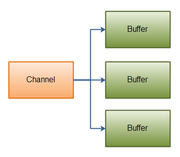

# 1. IO概述

一般来说I/O模型可以分为：同步阻塞（BIO），同步非阻塞（NIO），异步非阻塞IO（AIO）


- 同步阻塞IO：在此种方式下，用户进程在发起一个IO操作以后，必须等待IO操作的完成，只有当真正完成了IO操作以后，用户进程才能运行。JAVA传统的IO模型属于此种方式！
- 同步非阻塞IO:在此种方式下，用户进程发起一个IO操作以后边可返回做其它事情，但是用户进程需要时不时的询问IO操作是否就绪，这就要求用户进程不停的去询问，从而引入不必要的CPU资源浪费。其中目前JAVA的NIO就属于同步非阻塞IO。
- 异步非阻塞IO:在此种模式下，用户进程只需要发起一个IO操作然后立即返回，等IO操作真正的完成以后，应用程序会得到IO操作完成的通知，此时用户进程只需要对数据进行处理就好了，不需要进行实际的IO读写操作，因为真正的IO读取或者写入操作已经由内核完成了。

## 1.1 BIO

在 JDK1.4 之前，我们建立网络连接的时候只能采用 BIO，需要先在服务端启动一个
ServerSocket，然后在客户端启动 Socket 来对服务端进行通信，默认情况下服务端需要对每
个请求建立一个线程等待请求，而客户端发送请求后，先咨询服务端是否有线程响应，如果
没有则会一直等待或者遭到拒绝，如果有的话，客户端线程会等待请求结束后才继续执行，
这就是阻塞式 IO。

**在使用同步I/O的网络应用中**，如果要同时处理多个客户端请求，或是在客户端要同时和多个服务器进行通讯，就必须使用多线程来处理。也就是说，将每一个客户端请求分配给一个线程来单独处理。这样做虽然可以达到我们的要求，但同时又会带来另外一个问题。由于每创建一个线程，就要为这个线程分配一定的内存空间（也叫工作存储器），而且操作系统本身也对线程的总数有一定的限制。如果客户端的请求过多，服务端程序可能会因为不堪重负而拒绝客户端的请求，甚至服务器可能会因此而瘫痪。

> 简单来说就是有一个人（连接请求）去餐厅（服务端）吃饭，餐厅内每来一个人，就给这个人分配一个服务员（线程）去处理这个人的所有问题。

接下来通过一个例子复习回顾一下 BIO 的基本用法（基于 TCP）。

1. 服务端开发：

   > 绑定端口号 9999，accept 方法用来监听客户端连接，
   > 如果没有客户端连接，就一直等待，程序会阻塞到这里。

   ```java
   import java.io.IOException;
   import java.io.InputStream;
   import java.io.OutputStream;
   import java.net.ServerSocket;
   import java.net.Socket;
   
   public class BioServer {
       public static void main(String[] args) throws Exception {
           // 1. 创建serverSocket对象
           ServerSocket socket = new ServerSocket(9999);
   
           // 阻塞
           while(true){
               // 2. 监听客户端
               Socket accept = socket.accept();
               // 3. 获取输入流
               InputStream inputstream = accept.getInputStream();
               byte[] bytes = new byte[1024];
               // 将读取到的流通过字节的方式写入缓冲区
               inputstream.read(bytes);
               // 获取客户端地址
               String address = socket.getInetAddress().getHostAddress();
               // trim() 方法用于删除字符串的头尾空白符
               System.out.println(address +"说："+ new String(bytes).trim());
   
               // 4. 获取输出流
               OutputStream outputStream = accept.getOutputStream();
               // 写入内容
               outputStream.write("服务端已收到消息！".getBytes());
   
               // 关闭流
               accept.close();
           }
       }
   }
   ```

2. 客户端开发：

   > 通过 9999 端口连接服务器端，getInputStream 方法用来等待服务器端返回数据，如果没有返回，就一直等待，程序会阻塞到这里。

   ```java
   import java.io.IOException;
   import java.io.InputStream;
   import java.io.OutputStream;
   import java.net.Socket;
   import java.util.Scanner;
   
   public class BioClient {
       public static void main(String[] args) throws Exception {
           // 1. 创建socket对象
           Socket socket = new Socket("127.0.0.1",9999);
           while (true){
               // 2. 从连接中取出输出流并发送消息
               OutputStream outputStream = socket.getOutputStream();
               System.out.println("请输入需要发送的消息：");
               Scanner scanner = new Scanner(System.in);
               String msg = scanner.nextLine();
               // 3. 将消息写入输出流
               outputStream.write(msg.getBytes());
   
               // 4. 从连接中取出输出流并接收回话
               InputStream inputStream = socket.getInputStream();
               byte[] bytes = new byte[1024];
               // 5. 将消息读取到缓冲区
               inputStream.read(bytes);
   
               // trim() 方法用于删除字符串的头尾空白符
               System.out.println("客户端收到回话："+new String(bytes).trim());
   
               // 6. 关闭流
   //            socket.close();
           }
       }
   }
   
   ```

   

## 1.2 NIO（掌握）

NIO本身是基于事件驱动思想来完成的，其主要想解决的是BIO的大并发问题，即有很多请求访问服务器，此时服务器压力会非常大

BIO与NIO一个比较**重要的不同之处：**

1. 是我们使用**BIO**的时候往往会引入多线程，**每个连接一个单独的线程**；
2. 而**NIO**则是使用单线程或者只使用少量的多线程，**每个连接共用一个线程**。

NIO的最重要的地方是当一个连接创建后，不需要对应一个线程，**这个连接会被注册到多路复用器**上面，所以所有的连接只需要一个线程就可以搞定，当这个线程中的多路复用器进行轮询的时候，发现连接上有请求的话，才开启一个线程进行处理，也就是一个请求一个线程模式。

## 1.3 AIO

与NIO不同，当进行读写操作时，只须直接调用API的read或write方法即可，这两种方法均为异步的。

1. 对于读操作而言，当有流可读取时，操作系统会将可读的流传入read方法的缓冲区，并通知应用程序；
2. 对于写操作而言，当操作系统将write方法传递的流写入完毕时，操作系统主动通知应用程序。

即可以理解为，read/write方法都是异步的，完成后会主动调用回调函数。 在JDK1.7中，这部分内容被称作NIO.2，主要在`java.nio.channels`包下增加了下面四个异步通道：

- `AsynchronousSocketChannel`
- `AsynchronousServerSocketChannel`
- `AsynchronousFileChannel`
- `AsynchronousDatagramChannel`

归纳一下IO的三种使用方式：

- BIO是一个连接一个线程。
- NIO是一个请求一个线程。
- AIO是一个有效请求一个线程。

## 1.4 Java对三种IO模型的支持

- Java BIO ： 同步并阻塞，服务器实现模式为一个连接一个线程，即客户端有连接请求时服务器端就需要启动一个线程进行处理，如果这个连接不做任何事情会造成不必要的线程开销，当然可以通过线程池机制改善。
- Java NIO ： 同步非阻塞，服务器实现模式为一个请求一个线程，即客户端发送的连接请求都会注册到多路复用器上，多路复用器轮询到连接有I/O请求时才启动一个线程进行处理。
- Java AIO(NIO.2) ： 异步非阻塞，服务器实现模式为一个有效请求一个线程，客户端的I/O请求都是由OS先完成了再通知服务器应用去启动线程进行处理，

BIO、NIO、AIO适用场景分析:

- BIO方式适用于连接数目比较小且固定的架构，这种方式对服务器资源要求比较高，并发局限于应用中，JDK1.4以前的唯一选择，但程序直观简单易理解。
- NIO方式适用于连接数目多且连接比较短（轻操作）的架构，比如聊天服务器，并发局限于应用中，编程比较复杂，JDK1.4开始支持。
- AIO方式使用于连接数目多且连接比较长（重操作）的架构，比如相册服务器，充分调用OS参与并发操作，编程比较复杂，JDK7开始支持。

另外，I/O属于底层操作，需要操作系统支持，并发也需要操作系统的支持，所以性能方面不同操作系统差异会比较明显。

AIO与NIO的区别，在Client端体现为用户线程得到通知的时间点 在NIO中，当发生相应读写事件时，用户线程得到通知，表明数据已就绪，开始同步调用非阻塞读写函数 在AIO中，当发生相应事件时，用户线程得到通知，表明I/O操作已经由操作系统异步完成，用户线程只需事先向内核申明I/O缓冲区、注册handler并定义回调的completed方法即可 AIO与NIO的区别，在Server端体现为Reactor/Proactor的区别，在NIO中，监控的事件通常为数据的到达；在AIO中，监控的是事件通常为I/O的完成 -

# 2. NIO编程

java.nio 全称 java non-blocking IO，是指 JDK 提供的新 API。从 JDK1.4 开始，Java 提供了
一系列改进的输入/输出的新特性，被统称为 NIO(即 New IO)。新增了许多用于处理输入输出
的类，这些类都被放在 java.nio 包及子包下，并且对原 java.io 包中的很多类进行改写，新增
了满足 NIO 的功能

Non-blocking IO**（NIO是同步非阻塞式模型）**

> Java NIO使我们可以进行非阻塞IO操作。比如说，单线程中从通道读取数据到buffer，同时可以继续做别的事情，当数据读取到buffer中后，线程再继续处理数据。写数据也是一样的。

NIO 和 BIO 有着相同的目的和作用，但是它们的实现方式完全不同，

- BIO 以流的方式处理数据
- NIO 以块的方式处理数据，块 I/O 的效率比流 I/O 高很多。
- NIO 是同步非阻塞式的，BIO 是同步阻塞式的，使用NIO可以提供非阻塞式的高伸缩性网络。

三个重要的概念：

## 2.1 Channels**（管道）**

通常来说NIO中的所有IO都是从Channel开始的。Channel和流有点类似。通过Channel，我们即可以从Channel把数据写到Buffer中，也可以把数据从Buffer写入到Channel

Channel有很多类型。下面列举了主要的几种：

```
FileChannel 用于文件的数据读写
DatagramChannel 用于UDP的数据读写
SocketChannel  用于TCP的数据读写。 
ServerSocketChannel 允许我们监听TCP链接请求，每个请求会创建会一个SocketChannel.
```

Java NIO Channel通道和流非常相似，主要有以下几点区别：

- 通道可以读也可以写，流一般来说是单向的（只能读或者写）。
- 通道可以异步读写。
- 通道总是基于缓冲区Buffer来读写。

我们可以从通道中读取数据，写入到buffer；也可以中buffer内读数据，写入到通道中。下面有个示意图：


案例：读取文件中的数据

```java
@Test
public void test02() throws Exception {
    // 创建file对象
    File file = new File("basic.txt");
    // 创建文件输入流，读取文件
    FileInputStream inputStream = new FileInputStream(file);
    // 获取通道
    FileChannel channel = inputStream.getChannel();
    // 设置缓冲区，allocate方法设置缓冲区初始大小
    ByteBuffer buffer = ByteBuffer.allocate((int) file.length());
    // 通过缓冲区读取数据
    channel.read(buffer);
    System.out.println(new String(buffer.array()));
    // 关闭流
    inputStream.close();
}
```


## 2.2 Buffer **（缓冲区）**

Buffer 是一个顶层父类，它是一个抽象类，每一种基本 Java 类型都对应一种缓冲区类型：

> 这些Buffer涵盖了可以通过IO操作的基础类型：byte，short，int，long，float，double以及characters。 NIO实际上还包含一种MappedBytesBuffe，一般用于和内存映射的文件。

```
ByteBuffer，存储字节数据到缓冲区
ShortBuffer，存储字符串数据到缓冲区
CharBuffer，存储字符数据到缓冲区
IntBuffer，存储整数数据到缓冲区
LongBuffer，存储长整型数据到缓冲区
DoubleBuffer，存储小数到缓冲区
FloatBuffer，存储小数到缓冲区
```

Java NIO Buffers用于和NIO Channel交互。正如你已经知道的，我们从channel中读取数据到buffers里，从buffer把数据写入到channels.

buffer本质上就是一块内存区，可以用来写入数据，并在稍后读取出来。这块内存被NIO Buffer包裹起来，对外提供一系列的读写方便开发的接口。

**Buffer的基本用法：**利用Buffer读写数据，通常遵循四个步骤：

- 把数据写入buffer；

- 调用`flip()`方法：翻转缓冲区

  > `flip()`使缓冲区为新的通道写入或相对get操作序列做好准备：将限制设置为当前位置，然后将位置设置为零。

- 从Buffer中读取数据；

- 调用`buffer.clear()`或者`buffer.compact()`清空缓存区

当读取完数据后，需要清空buffer，以满足后续写入操作。清空buffer有两种方式：调用clear()或compact()方法。clear会清空整个buffer，compact则只清空已读取的数据，未被读取的数据会被移动到buffer的开始位置，写入位置则近跟着未读数据之后。

案例：写入数据至文件  ，复制文件

```java
@Test
public void test01() throws Exception {
    String str="hello nio";
    // 创建输出流
    FileOutputStream fos = new FileOutputStream("basic.txt");
    // 获取通道
    FileChannel channel = fos.getChannel();
    // 获取缓冲区
    ByteBuffer buffer = ByteBuffer.allocate(1024);
    // 写入数据
    buffer.put(str.getBytes());
    // 反转缓冲区
    buffer.flip();
    // 将缓冲区内容写入通道
    channel.write(buffer);
    // 释放缓冲区
    buffer.clear();
    // 关闭流
    fos.close();
}

@Test
public void test03() throws Exception{
    // 创建文件输入流，读取文件
    FileInputStream fis=new FileInputStream("F:\\学习\\NettyServer\\basic.txt");
    // 创建文件输出流，创建文件
    FileOutputStream fos=new FileOutputStream("F:\\学习\\NettyServer\\basic_1.txt");
    // 创建缓冲区
    byte[] b=new byte[1024];

    while (true) {
        // 读取文件至缓冲区
        int res=fis.read(b);
        if(res==-1){
            break;
        }
        // 将缓冲区的文件写入输出流
        fos.write(b,0,res);
    }
    // 关闭流
    fis.close();
    fos.close();
}
```

### 2.2.1 容量，位置，上限

buffer缓冲区实质上就是一块内存，用于写入数据，也供后续再次读取数据。这块内存被NIO Buffer管理，并提供一系列的方法用于更简单的操作这块内存。

一个Buffer有三个属性是必须掌握的，分别是：

- 容量（Capacity）

  > 作为一块内存，buffer有一个固定的大小，叫做capacity容量。也就是最多只能写入容量值的字节。一旦buffer写满了就需要清空已读数据以便下次继续写入新的数据。

- 位置（Position）

  > 当写入数据到Buffer的时候需要中一个确定的位置开始，默认初始化时这个位置position为0，一旦写入了数据，比如一个字节，那么position的值就会指向数据之后的一个单元，position最大可以到capacity-1.
  >
  > 当从Buffer读取数据时，也需要从一个确定的位置开始。buffer从写入模式变为读取模式时，position会归零，每次读取后，position向后移动。

- 上限（Limit）

  > 在写模式，limit的含义是我们所能写入的最大数据量。它等同于buffer的容量。
  >
  > 一旦切换到读模式，limit则代表我们所能读取的最大数据量，他的值等同于写模式下position的位置。
  >
  > 数据读取的上限时buffer中已有的数据，也就是limit的位置（原position所指的位置）。

position和limit的具体含义取决于当前buffer的模式。capacity在两种模式下都表示容量。

下面有张示例图，描述了不同模式下position和limit的含义：


### 2.2.2 buffer 的操作

1. 分配一个buffer

   > 为了获取一个Buffer对象，你必须先分配。每个Buffer实现类都有一个allocate()方法用于分配内存。如下案例：分配一个1024字节大小的buffer：

   ```java
   ByteBuffer buffer = ByteBuffer.allocate(1024);
   ```

2. 写入数据到buffer

   写数据到Buffer有两种方法：

   - 从Channel中写数据到Buffer，使用read方法

     ```java
     // 从通道读取数据并放到缓冲区中
     // 返回值：读取的字节数，为零或者-1时表示读取完毕
     int bytesRead = fileChannel.read(buffer);
     ```

   - 手动写数据到Buffer，调用put方法

     > put方法有很多不同版本，对应不同的写数据方法。例如把数据写到特定的位置，或者把一个字节数据写入buffer。看考JavaDoc文档可以查阅的更多数据。
     >
     > https://docs.oracle.com/en/java/javase/11/docs/api/java.base/java/nio/ByteBuffer.html

     ```java
     // 写入数据
     buffer.put(str.getBytes());
     ```

3. 翻转缓冲区

   定义：

   ```java
   Buffer	flip()	翻转此缓冲区。
   ```

   翻转此缓冲区。将限制设置为当前位置，然后将该位置设置为零。如果定义了标记，则将其丢弃。在执行一系列通道读取或放置操作之后，调用此方法以准备一系列通道写入或相对 get操作。例如：

   ```java
    buf.put(magic);    // 直接写入数据到buffer
    in.read(buf);      // 从管道读取数据到buffer
    buf.flip();        // 翻转缓冲区
    out.write(buf);    // 将缓冲区内容写入通道
   ```

4. 从buffer读取数据

   从Buffer读数据也有两种方式。

   - 从buffer读数据到channel

     ```java
     int bytesWritten = channel.write(buffer);
     ```

   - 从buffer直接读取数据，调用get方法

     ```java
     byte aByte = buffer.get();    
     ```

5. rewind()

   Buffer.rewind()方法将position置为0，这样我们可以重复读取buffer中的数据。limit保持不变。

6. clear() 和 compact()

   一旦我们从buffer中读取完数据，需要复用buffer为下次写数据做准备。只需要调用clear或compact方法。

   > clear方法会重置position为0，limit为capacity，也就是整个Buffer清空。实际上Buffer中数据并没有清空，我们只是把标记人为修改了。

   如果Buffer还有一些数据没有读取完，调用clear就会导致这部分数据被“遗忘”，因为我们没有标记这部分数据未读。

   > 针对这种情况，如果需要保留未读数据，那么可以使用compact。 因此compact和clear的区别就在于对未读数据的处理，是保留这部分数据还是一起清空。

7. mark() 和 reset()

   通过mark方法可以标记当前的position，通过reset来恢复mark的位置

   ```java
   buffer.mark();
   buffer.reset();  //set position back to mark.    
   ```

8. equals() 和 compareTo()

   可以用eqauls和compareTo比较两个buffer

   注意：

   - equals()

     判断两个buffer相对，需满足：

     - 类型相同
     - buffer中剩余字节数相同
     - 所有剩余字节相等

     从上面的三个条件可以看出，**equals只比较buffer中的部分内容，并不会去比较每一个元素。**

   - compareTo()

     compareTo也是比较buffer中的剩余元素，只不过**这个方法适用于比较排序的：**

## 2.3 Selectors**（选择器）**

Selector是Java NIO中的一个组件，用于检查一个或多个NIO Channel的状态是否处于可读、可写。如此可以实现单线程管理多个channels，也就是可以管理多个网络链接。

> 要使用Selector的话，我们必须把Channel注册到Selector上，然后就可以调用Selector的`select()`方法。**这个方法会进入阻塞**，直到有一个channel的状态符合条件。当方法返回后，线程可以处理这些事件。

**为什么使用Selector？**

用单线程处理多个channels的好处是我需要更少的线程来处理channel。实际上，你甚至可以用一个线程来处理所有的channels。从操作系统的角度来看，切换线程开销是比较昂贵的，并且每个线程都需要占用系统资源，因此占用线程越少越好。

需要留意的是，现代操作系统和CPU在多任务处理上已经变得越来越好，所以多线程带来的影响也越来越小。如果一个CPU是多核的，如果不执行多任务反而是浪费了机器的性能。不过这些设计讨论是另外的话题了。简而言之，通过Selector我们可以实现单线程操作多个channel。

这有一幅示意图，描述了单线程处理三个channel的情况：


创建一个selecotor

```java
Selector selector = Selector.open();
```

### 2.3.1 注册Channel到Selector上

| **修饰符和类型**        | 方法                                          | 描述                                       |
| :---------------------- | --------------------------------------------- | ------------------------------------------ |
| `SelectionKey`          | `register(Selector sel, int ops)`             | 使用给定的选择器注册此通道，并返回选择键。 |
| `abstract SelectionKey` | `register(Selector sel, int ops, Object att)` | 使用给定的选择器注册此通道，并返回选择键。 |

为了在Selector挂载Channel，我们必须先把Channel注册到Selector上

```java
// 设置阻塞方式为非阻塞
channel.configureBlocking(false);
SelectionKey key = channel.register(selector, SelectionKey.OP_READ);
```

> **Channel必须是非阻塞的。所以FileChannel不适用Selector，因为FileChannel不能切换为非阻塞模式**。Socket channel可以正常使用。

注意register的第二个参数，这个参数是一个“关注集合”，代表我们关注的channel状态，有四种基础类型可供监听：

```
Connect 连接
Accept 接收
Read 读
Write 写

上述的四种就绪状态用SelectionKey中的常量表示如下：

SelectionKey.OP_CONNECT
SelectionKey.OP_ACCEPT
SelectionKey.OP_READ
SelectionKey.OP_WRITE
```

一个channel触发了一个事件也可视作该事件处于就绪状态。因此当channel与server连接成功后，那么就是“连接就绪”状态。server channel接收请求连接时处于“可连接就绪”状态。channel有数据可读时处于“读就绪”状态。channel可以进行数据写入时处于“写就绪”状态。

### 2.3.2 SelectionKey

上面我们利用register方法把Channel注册到了Selectors上，这个方法的返回值是SelectionKey

具体方法参考：https://docs.oracle.com/en/java/javase/11/docs/api/java.base/java/nio/channels/SelectionKey.html

这个返回的对象包含了一些比较有价值的属性：

- The interest set

  > 这个“关注集合”实际上就是我们希望处理的事件的集合，它的值就是注册时传入的参数，我们可以用按为与运算把每个事件取出来：

  ```java
  int interestSet = selectionKey.interestOps();
  
  boolean isInterestedInAccept  = interestSet & SelectionKey.OP_ACCEPT;
  boolean isInterestedInConnect = interestSet & SelectionKey.OP_CONNECT;
  boolean isInterestedInRead    = interestSet & SelectionKey.OP_READ;
  boolean isInterestedInWrite   = interestSet & SelectionKey.OP_WRITE; 
  ```

- The ready set

  > "就绪集合"中的值是当前channel处于就绪的值，一般来说在调用了select方法后都会需要用到就绪状态

  ```java
  int readySet = selectionKey.readyOps();
  ```

  从“就绪集合”中取值的操作类似月“关注集合”的操作，当然还有更简单的方法，SelectionKey提供了一系列返回值为boolean的的方法：

  ```
  selectionKey.isAcceptable();
  selectionKey.isConnectable();
  selectionKey.isReadable();
  selectionKey.isWritable();
  ```

- The Channel 和 The Selector

  从SelectionKey操作Channel和Selector非常简单：

  ```
  Channel  channel  = selectionKey.channel();
  Selector selector = selectionKey.selector();    
  ```

- An attached object (optional)

  我们可以给一个SelectionKey附加一个Object，这样做一方面可以方便我们识别某个特定的channel，同时也增加了channel相关的附加信息。例如，可以把用于channel的buffer附加到SelectionKey上：

  ```
  selectionKey.attach(theObject);
  
  Object attachedObj = selectionKey.attachment();
  ```

  附加对象的操作也可以在register的时候就执行：

  ```
  SelectionKey key = channel.register(selector, SelectionKey.OP_READ, theObject);
  ```

### 2.3.3 从Selector中选择channel

一旦我们向Selector注册了一个或多个channel后，就可以调用select来获取channel。select方法会返回所有处于就绪状态的channel。 select方法具体如下：

| **修饰符和类型** | 方法                   | 描述                                            |
| :--------------- | ---------------------- | ----------------------------------------------- |
| `abstract int`   | `select()`             | 选择一组键，其相应的通道已准备好进行I / O操作。 |
| `abstract int`   | `select(long timeout)` | 选择一组键，其相应的通道已准备好进行I / O操作。 |
| `abstract int`   | `selectNow()`          | 选择一组键，其相应的通道已准备好进行I / O操作。 |

select()方法在返回channel之前处于阻塞状态。 select(long timeout)和select做的事一样，不过他的阻塞有一个超时限制。

selectNow()不会阻塞，根据当前状态立刻返回合适的channel。

select()方法的返回值是一个int整形，**代表有多少channel处于就绪了**。也就是自上一次select后有多少channel进入就绪。举例来说，假设第一次调用select时正好有一个channel就绪，那么返回值是1，并且对这个channel做任何处理，接着再次调用select，此时恰好又有一个新的channel就绪，那么返回值还是1，现在我们一共有两个channel处于就绪，但是在每次调用select时只有一个channel是就绪的。

### 2.3.4 selectedKeys

在调用select并返回了有channel就绪之后，可以通过选中的key集合来获取channel，这个操作通过调用`selectedKeys()`方法：

```
Set<SelectionKey> selectedKeys = selector.selectedKeys();    
```

还记得在register时我们向Selector注册了channel，而register后的返回值就是SelectionKey实例，也就是我们现在通过selectedKeys()方法所返回的SelectionKey。

遍历这些SelectionKey可以通过如下方法：

```java
Set<SelectionKey> selectedKeys = selector.selectedKeys();

Iterator<SelectionKey> keyIterator = selectedKeys.iterator();

while(keyIterator.hasNext()) {

    SelectionKey key = keyIterator.next();

    if(key.isAcceptable()) {
        // ServerSocketChannel接受了一个连接。

    } else if (key.isConnectable()) {
        // 与远程服务器建立了连接。

    } else if (key.isReadable()) {
        // 通道已准备就绪，可以阅读

    } else if (key.isWritable()) {
        // 通道已准备好进行编写
    }

    keyIterator.remove();
}
```

上述循环会迭代key集合，针对每个key我们单独判断他是处于何种就绪状态。

注意`keyIterater.remove()`方法的调用，Selector本身并不会移除SelectionKey对象，这个操作需要我们收到执行。当下次channel处于就绪时，Selector任然会把这些key再次加入进来。

`SelectionKey.channel()`返回的channel实例需要强转为我们实际使用的具体的channel类型，例如ServerSocketChannel或SocketChannel.

示例：

```java
SocketChannel channel = (SocketChannel) key.channel();
```

## 2.4 Scatter / Gather

Java NIO发布时内置了对scatter / gather的支持。scatter / gather是通过通道读写数据的两个概念。

- Scattering read 指的是**从通道读取的操作能把数据写入多个buffer**，也就是sctters代表了数据从一个channel到多个buffer的过程。
- gathering write则正好相反，表示的是**从多个buffer把数据写入到一个channel中**。

Scatter/gather在有些场景下会非常有用，比如需要处理多份分开传输的数据。举例来说，假设一个消息包含了header和body，我们可能会把header和body保存在不同独立buffer中，这种分开处理header与body的做法会使开发更简明。

- **Scattering Reads**

  > "scattering read"是把数据从单个Channel写入到多个buffer，下面是示意图：

  

  ```java
  ByteBuffer header = ByteBuffer.allocate(128);
  ByteBuffer body   = ByteBuffer.allocate(1024);
  
  ByteBuffer[] bufferArray = { header, body };
  
  channel.read(bufferArray);
  ```

  观察代码可以发现，我们把多个buffer写在了一个数组中，然后把数组传递给channel.read()方法。read()方法内部会负责把数据按顺序写进传入的buffer数组内。一个buffer写满后，接着写到下一个buffer中。

  > 实际上，scattering read内部必须写满一个buffer后才会向后移动到下一个buffer，因此这并不适合消息大小会动态改变的部分，也就是说，如果你有一个header和body，并且header有一个固定的大小（比如128字节），这种情形下可以正常工作。

- Gathering Writes

  > "gathering write"把多个buffer的数据写入到同一个channel中，下面是示意图：

  

  ```java
  ByteBuffer header = ByteBuffer.allocate(128);
  ByteBuffer body   = ByteBuffer.allocate(1024);
  
  //write data into buffers
  
  ByteBuffer[] bufferArray = { header, body };
  
  channel.write(bufferArray);
  ```

  类似的传入一个buffer数组给write，内部机会按顺序将数组内的内容写进channel，这里需要注意，写入的时候针对的是buffer中position到limit之间的数据。也就是如果buffer的容量是128字节，但它只包含了58字节数据，那么写入的时候只有58字节会真正写入。因此gathering write是可以适用于可变大小的message的，这和scattering reads不同。

## 2.5 Channel Transfers通道传输接口

在Java NIO中如果一个channel是FileChannel类型的，那么他可以直接把数据传输到另一个channel。逐个特性得益于FileChannel包含的transferTo和transferFrom两个方法。

| 返回类型      | 方法                                                         | 描述                                             |
| :------------ | ------------------------------------------------------------ | ------------------------------------------------ |
| abstract long | transferFrom(ReadableByteChannel src, long position, long count) | 从给定的可读字节通道将字节传输到此通道的文件中。 |
| abstract long | transferTo(long position, long count, WritableByteChannel target) | 将字节从该通道的文件传输到给定的可写字节通道。   |

- transferFrom()

  `FileChannel.transferFrom()`方法把数据从通道源传输到FileChannel：

  ```java
  // RandomAccessFile 是 Java提供的对文件内容的访问，既可以读文件也可以写文件，可以访问文件的任意位置适用于由大小已知的记录组成的文件
  RandomAccessFile fromFile = new RandomAccessFile("fromFile.txt", "rw");
  FileChannel fromChannel = fromFile.getChannel();
  
  RandomAccessFile toFile = new RandomAccessFile("toFile.txt", "rw");
  FileChannel toChannel = toFile.getChannel();
  
  long position = 0;
  long count = fromChannel.size();
  
  toChannel.transferFrom(fromChannel, position, count);
  ```

  > transferFrom的参数position和count表示目标文件的写入位置和最多写入的数据量。如果通道源的数据小于count那么就传实际有的数据量。 另外，有些SocketChannel的实现在传输时只会传输哪些处于就绪状态的数据，即使SocketChannel后续会有更多可用数据。因此，这个传输过程可能不会传输整个的数据。

- transferTo()

  transferTo方法把FileChannel数据传输到另一个channel,下面是案例：

  ```java
  andomAccessFile fromFile = new RandomAccessFile("fromFile.txt", "rw");
  FileChannel fromChannel = fromFile.getChannel();
  
  RandomAccessFile toFile = new RandomAccessFile("toFile.txt", "rw");
  FileChannel toChannel = toFile.getChannel();
  
  long position = 0;
  long count = fromChannel.size();
  
  fromChannel.transferTo(position, count, toChannel);
  ```

## 2.6 FileChannel文件通道

Java NIO中的FileChannel是用于连接文件的通道。通过文件通道可以读、写文件的数据。Java NIO的FileChannel是相对标准Java IO API的可选接口。

**FileChannel不可以设置为非阻塞模式，他只能在阻塞模式下运行。**

1. 打开文件通道

   > 在使用FileChannel前必须打开通道，打开一个文件通道需要通过输入/输出流或者RandomAccessFile，下面是通过RandomAccessFile打开文件通道的案例：

   ```java
   RandomAccessFile aFile = new RandomAccessFile("data/nio-data.txt", "rw");
   FileChannel inChannel = aFile.getChannel();
   ```

2. 从文件通道内读取数据

   > 读取文件通道的数据可以通过read方法：

   ```java
   ByteBuffer buf = ByteBuffer.allocate(48);
   int bytesRead = inChannel.read(buf);
   ```

   首先开辟一个Buffer，从通道中读取的数据会写入Buffer内。接着就可以调用read方法，read的返回值代表有多少字节被写入了Buffer，返回-1则表示已经读取到文件结尾了。

3. 向文件通道写入数据

   写数据用write方法，入参是Buffer：

   ```java
   @Test
   public void test01() throws Exception {
       String str="hello nio";
       // 创建输出流
       FileOutputStream fos=new FileOutputStream("basic.txt");
       // 获取通道
       FileChannel channel =fos.getChannel();
       // 获取缓冲区
       ByteBuffer buffer=ByteBuffer.allocate(1024);
       // 写入数据
       buffer.put(str.getBytes());
       // 反转缓冲区
       buffer.flip();
       // 将缓冲区内容写入通道
       channel.write(buffer);
       // 释放缓冲区
       buffer.clear();
       // 关闭流
       fos.close();
   }
   ```

4. 关闭通道

   操作完毕后，需要把通道关闭：

   ```
   channel.close();  
   ```

5. FileChannel Position

   > 当操作FileChannel的时候读和写都是基于特定起始位置的（position），获取当前的位置可以用FileChannel的position()方法，设置当前位置可以用带参数的position(long pos)方法。

   ```
   long pos channel.position();
   
   channel.position(pos +123);
   ```

   假设我们把当前位置设置为文件结尾之后，那么当我们视图从通道中读取数据时就会发现返回值是-1，表示已经到达文件结尾了。 如果把当前位置设置为文件结尾之后，在向通道中写入数据，文件会自动扩展以便写入数据，但是这样会导致文件中出现类似空洞，即文件的一些位置是没有数据的。

6. FileChannel Size

   size()方法可以返回FileChannel对应的文件的文件大小：

   ```
   long fileSize = channel.size();    
   ```

7. FileChannel Truncate

   利用truncate方法可以截取指定长度的文件：

   ```
   channel.truncate(1024);
   ```
   
8. FileChannel Force

   force方法会把所有未写磁盘的数据都强制写入磁盘。这是因为在操作系统中出于性能考虑回把数据放入缓冲区，所以不能保证数据在调用write写入文件通道后就及时写到磁盘上了，除非手动调用force方法。 force方法需要一个布尔参数，代表是否把meta data也一并强制写入。

   ```
   channel.force(true);
   ```

## 2.7  SocketChannel套接字通道

在Java NIO体系中，SocketChannel是用于TCP网络连接的套接字接口，相当于Java网络编程中的Socket套接字接口。创建SocketChannel主要有两种方式，如下：

1. 打开一个SocketChannel并连接网络上的一台服务器。
2. 当ServerSocketChannel接收到一个连接请求时，会创建一个SocketChannel。

示例：

1. 建立一个SocketChannel连接

   打开一个SocketChannel可以这样操作：

   ```java
   SocketChannel socketChannel = SocketChannel.open();
   socketChannel.connect(new InetSocketAddress("127.0.0.1", 80)); 
   ```

2. 关闭一个SocketChannel连接

   关闭一个SocketChannel只需要调用他的close方法，如下：

   ```
   socketChannel.close();
   ```

3. 从SocketChannel中读数据

   从一个SocketChannel连接中读取数据，可以通过read()方法，如下：

   ```
   ByteBuffer buf = ByteBuffer.allocate(48);
   
   int bytesRead = socketChannel.read(buf);
   ```
   
   > 首先需要开辟一个Buffer。从SocketChannel中读取的数据将放到Buffer中。
   >
   > 接下来就是调用SocketChannel的read()方法.这个read()会把通道中的数据读到Buffer中。read()方法的返回值是一个int数据，代表此次有多少字节的数据被写入了Buffer中。如果返回的是-1,那么意味着通道内的数据已经读取完毕，到底了（链接关闭）。
   
4. 向SocketChannel写数据

   向SocketChannel中写入数据是通过write()方法，write也需要一个Buffer作为参数。

   ```java
   socketChannel.write(ByteBuffer.wrap(msg.getBytes()));
   ```

5. 非阻塞模式

   我们可以吧SocketChannel设置为non-blocking（非阻塞）模式。这样的话在调用connect(), read(), write()时都是异步的。

   ```
   socketChannel.configureBlocking(false);
   ```

6. connect

   如果我们设置了一个SocketChannel是非阻塞的，那么调用connect()后，方法会在链接建立前就直接返回。为了检查当前链接是否建立成功，我们可以调用finishConnect(),如下：

   ```java
   socketChannel.configureBlocking(false);
   socketChannel.connect(new InetSocketAddress("http://jenkov.com", 80));
   
   while(! socketChannel.finishConnect() ){
       //wait, or do something else...    
   }
   ```

7. write

   在非阻塞模式下，调用write()方法不能确保方法返回后写入操作一定得到了执行。因此我们需要把write()调用放到循环内。这和前面在讲write()时是一样的，此处就不在代码演示。

8. read()

   在非阻塞模式下，调用read()方法也不能确保方法返回后，确实读到了数据。因此我们需要自己检查的整型返回值，这个返回值会告诉我们实际读取了多少字节的数据。

9. Selector结合非阻塞模式

   SocketChannel的非阻塞模式可以和Selector很好的协同工作。把一个或多个SocketChannel注册到一个Selector后，我们可以通过Selector指导哪些channels通道是处于可读，可写等等状态的

## 2.8 ServerSocketChannel服务端套接字通道

在Java NIO中，ServerSocketChannel是用于监听TCP链接请求的通道，正如Java网络编程中的ServerSocket一样。

ServerSocketChannel实现类位于java.nio.channels包下面。 下面是一个示例程序：

```java
public static void main(String[] args) throws Exception{
    //  得到网络通道
    ServerSocketChannel channel = ServerSocketChannel.open();

    //  绑定端口
    channel.bind(new InetSocketAddress(9999));

    //  设置非阻塞方式
    channel.configureBlocking(false);

    //  实现通信逻辑
    while(true){
        // do something with socketChannel...
    }
}
```

示例方法：

1. 打开ServerSocketChannel

   打开一个ServerSocketChannel我们需要调用他的open()方法，例如：

   ```
   ServerSocketChannel serverSocketChannel = ServerSocketChannel.open();
   ```

2. 关闭ServerSocketChannel

   关闭一个ServerSocketChannel我们需要调用他的close()方法，例如：

   ```
   serverSocketChannel.close();
   ```

3. 监听连接

   通过调用accept()方法，我们就开始监听端口上的请求连接。当accept()返回时，他会返回一个SocketChannel连接实例，实际上accept()是阻塞操作，他会阻塞带去线程知道返回一个连接； 很多时候我们是不满足于监听一个连接的，因此我们会把accept()的调用放到循环中，就像这样：

   ```
   while(true){
       SocketChannel socketChannel = serverSocketChannel.accept();
       //do something with socketChannel...
   }
   ```

   当然我们可以在循环体内加上合适的中断逻辑，而不是单纯的在while循环中写true，以此来结束循环监听；

4. 非阻塞模式

   实际上ServerSocketChannel是可以设置为非阻塞模式的。在非阻塞模式下，调用accept()函数会立刻返回，如果当前没有请求的链接，那么返回值为空null。因此我们需要手动检查返回的SocketChannel是否为空，例如：

   ```java
   ServerSocketChannel serverSocketChannel = ServerSocketChannel.open();
   
   serverSocketChannel.socket().bind(new InetSocketAddress(9999));
   serverSocketChannel.configureBlocking(false);
   
   while(true){
       SocketChannel socketChannel = serverSocketChannel.accept();
   
       if(socketChannel != null){
           //do something with socketChannel...
       }
   }
   ```

## 2.9 NIO 和 IO  比较

NIO和IO之间的主要差异

| IO     | NIO      |
| :----- | :------- |
| 面向流 | 面向缓冲 |
| 阻塞IO | 非阻塞IO |
|        | 选择器   |

- 面向流和面向缓冲区比较

  **Java IO面向流意思是我们每次从流当中读取一个或多个字节**。怎么处理读取到的字节是我们自己的事情。他们不会再任何地方缓存。再有就是我们不能在流数据中向前后移动。如果需要向前后移动读取位置，那么我们需要首先为它创建一个缓存区。

  **Java NIO是面向缓冲区的，数据是被读取到缓存当中以便后续加工**。我们可以在缓存中向向后移动。这个特性给我们处理数据提供了更大的弹性空间。当然我们任然需要在使用数据前检查缓存中是否包含我们需要的所有数据。另外需要确保在往缓存中写入数据时避免覆盖了已经写入但是还未被处理的数据。

- 阻塞和非阻塞IO比较

  **Java IO的各种流都是阻塞的**。这意味着一个线程一旦调用了read()，write()方法，那么该线程就被阻塞住了，知道读取到数据或者数据完整写入了。在此期间线程不能做其他任何事情。

  **Java NIO的非阻塞模式使得线程可以通过channel来读数据，并且是返回当前已有的数据**，或者什么都不返回如果线程没有数据可读的话。这样一来线程不会被阻塞住，它可以继续向下执行。

  通常线程在调用非阻塞操作后，会通知处理其他channel上的IO操作。因此一个线程可以管理多个channel的输入输出。

- Selectors

  Java NIO的selector允许一个单一线程监听多个channel输入。我们可以注册多个channel到selector上，然后然后用一个线程来挑出一个处于可读或者可写状态的channel。selector机制使得单线程管理过个channel变得容易。

**NIO和IO是如何影响程序设计的：**

开发中选择NIO或者IO会在多方面影响程序设计：

1. 使用NIO、IO的API调用类
2. 数据处理
3. 处理数据需要的线程数

**总结：**

NIO允许我们只用一条线程来管理多个通道（网络连接或文件），随之而来的代价是解析数据相对于阻塞流来说可能会变得更加的复杂。

如果你需要同时管理成千上万的链接，这些链接只发送少量数据，例如聊天服务器，用NIO来实现这个服务器是有优势的。类似的，如果你需要维持大量的链接，例如P2P网络，用单线程来管理这些 链接也是有优势的。这种单线程多连接的设计可以用下图描述：


如果链接数不是很多，但是每个链接的占用较大带宽，每次都要发送大量数据，那么使用传统的IO设计服务器可能是最好的选择。下面是经典IO服务设计图：


# 3. NIO 入门案例

1. 客户端开发

   ```java
   public class NIOClient {
       public static void main(String[] args) throws Exception {
           // 1. 得到一个网络通道
           SocketChannel channel = SocketChannel.open();
   
           // 2，设置非阻塞方式
           channel.configureBlocking(false);
   
           // 3. 提供服务器的ip地址和端口号
           InetSocketAddress address = new InetSocketAddress("127.0.0.1", 9999);
   
           // 4. 开始连接服务器
           if (!channel.connect(address)){
               // 程序执行到此，说明第一次连接失败。下面重新进行连接
   
               while(!channel.finishConnect()){
                   // 一直进行连接，直到连接成功为止
                   // nio的特性：连接的同时可以去干别的事情
                   System.out.println("连接重试中~"+" 来玩会游戏吧！");
               }
           }
   
           // 5. 得到缓冲区并存入数据
           // wrap() 把一个现成的数组放到缓冲区中使用
           String msg = "hello nio";
           ByteBuffer buffer = ByteBuffer.wrap(msg.getBytes());
   
           // 6. 通过管道发送数据
           channel.write(buffer);
   
           // 暂时不关客户端连接，这里一旦连接关闭，服务端会出现异常
   //        channel.close();
           System.in.read();
       }
   }
   
   ```

2. 服务端开发

   ```java
   public class NIOServer {
       public static void main(String[] args) throws Exception{
           // 1. 得到网络通道
           ServerSocketChannel channel = ServerSocketChannel.open();
   
           // 2. 得到selector对象
           Selector selector = Selector.open();
   
           // 3. 绑定端口
           channel.bind(new InetSocketAddress(9999));
   
           // 4. 设置非阻塞方式
           channel.configureBlocking(false);
   
           // 5. 注册管道对象给selector
           /**
            * SelectionKey，代表了 Selector 和网络通道的注册关系,一共四种：
            *  int OP_ACCEPT：有新的网络连接可以 accept，值为 16
            *  int OP_CONNECT：代表连接已经建立，值为 8
            *  int OP_READ 和 int OP_WRITE：代表了读、写操作，值为 1 和 4
            */
           channel.register(selector, SelectionKey.OP_ACCEPT);
   
           // 6. 实现通信逻辑
           while(true){
               // 6.1 监控客户端，单位：毫秒
               if(selector.select(2000) == 0){
                   // 非阻塞式的优势，这里还可以干点别的事。。。
                   System.out.println("此时没有客户端连接。。。");
                   continue;
               }
   
               // 6.2 得到selectionKey 判断通道里的事件
               Iterator<SelectionKey> iterator = selector.selectedKeys().iterator();
               while (iterator.hasNext()) {
                   SelectionKey key = iterator.next();
   
                   // 客户端连接请求事件
                   if (key.isAcceptable()){
                       System.out.println("OP_ACCEPT"+" 客户端已经成功连接");
                       // 接收这个通道
                       SocketChannel socketChannel = channel.accept();
                       // 设置非阻塞
                       socketChannel.configureBlocking(false);
                       // 注册
                       // 参数1:选择器，参数2:事件类型，参数3:客户端传过来的数据都在缓冲区
                       socketChannel.register(selector,SelectionKey.OP_READ, ByteBuffer.allocate(1024));
                   }
   
                   // 读取客户端数据事件
                   if (key.isReadable()){
                       // 得到网络通道
                       SocketChannel readChannel = (SocketChannel)key.channel();
                       // 得到附件（数据）
                       ByteBuffer buffer = (ByteBuffer) key.attachment();
                       // 将数据放入缓冲区
                       readChannel.read(buffer);
   
                       System.out.println("客户端发来数据："+new String(buffer.array()));
                   }
   
                   // 6.3 手动从集合中移除当前key，防止重复处理
                   iterator.remove();
               }
           }
       }
   }
   
   ```

3. 测试

   先启动服务端，在启动客户端，查看控制台输出

# 4. NIO聊天室案例

1. 服务端开发

   ```java
   public class ChatServer {
       private Selector selector;
       private ServerSocketChannel socketChannel;
       private static final int PORT = 9999;
   
       public ChatServer(){
           try {
               // 1. 得到选择器
               selector = Selector.open();
               // 2. 开启监听，监听通道
               socketChannel = ServerSocketChannel.open();
               // 3. 绑定端口
               socketChannel.bind(new InetSocketAddress(PORT));
               // 4. 设置非阻塞
               socketChannel.configureBlocking(false);
               // 5. 将选择器注册到通道，并指定客户端连接事件
               socketChannel.register(selector, SelectionKey.OP_ACCEPT);
   
               System.out.println("网络聊天室准备就绪。。。。");
   
           }catch (Exception e){
               e.printStackTrace();
           }
       }
   
       public void start(){
           try{
               // 轮询
               while (true){
                   // 得到就绪管道数量
                   int count = selector.select();
                   // count 大于0 表示有客户端连接
                   if(count > 0){
                       Iterator<SelectionKey> keyIterator = selector.selectedKeys().iterator();
                       while (keyIterator.hasNext()){
                           SelectionKey key = keyIterator.next();
   
                           // 客户端连接请求事件
                           if (key.isAcceptable()){
                               // 如果有连接请求，则获取连接
                               SocketChannel channel = socketChannel.accept();
                               // 设置非阻塞
                               channel.configureBlocking(false);
                               // 注册到选择器，并监听
                               // 参数1:选择器，参数2:事件类型，参数3:客户端传过来的数据都在缓冲区
                               channel.register(selector,SelectionKey.OP_READ, ByteBuffer.allocate(1024));
                               System.out.println(channel.getRemoteAddress().toString().substring(1)+"上线了...");
                               // 将此channel设置为accept，准备接收其他客户端请求
                               key.interestOps(SelectionKey.OP_ACCEPT);
                           }
   
                           // 读取客户端数据事件
                           if (key.isReadable()){
                               // 读取客户端发送的数据
                               readMsg(key);
                           }
   
                           // 删除当前key，防止重复处理
                           keyIterator.remove();
                       }
                   }else{
                       System.out.println("么有客户端来连接。。。");
                   }
               }
           }catch (Exception e){
               e.printStackTrace();
           }
       }
   
       public void readMsg(SelectionKey key){
           SocketChannel channel = null;
   
           try {
               // 获取关联的通道
               channel = (SocketChannel) key.channel();
               // 设置缓冲区
               ByteBuffer buffer = ByteBuffer.allocate(1024);
               // 从通道中读取数据并存储到缓冲区
               int count = channel.read(buffer);
               // count 不为0 表示读取到了数据
               if(count > 0){
                   // 把缓冲区数据转换为字符串
                   String msg = new String(buffer.array());
                   System.out.println(msg);
   
                   // 将关联的管道设置为read，准备继续接收数据
                   key.interestOps(SelectionKey.OP_READ);
                   // 向所有客户端广播数据
                   BroadCast(channel,msg);
               }
   
               // 清理缓存
               buffer.clear();
           } catch (IOException e) {
               e.printStackTrace();
   
               try{
                   // 当客户端关闭了channel时，服务端会抛出错误，需要进行异常处理
                   System.out.println(channel.getRemoteAddress().toString().substring(1)+" 已经下线。。。");
                   // 取消注册
                   key.cancel();
                   // 关闭通道
                   channel.close();
               } catch (IOException ioException) {
                   ioException.printStackTrace();
               }
           }
       }
   
       private void BroadCast(SocketChannel except, String msg) throws IOException {
           System.out.println("发送广播数据");
           // 广播数据到所有的socketChannel中
           for (SelectionKey key : selector.keys()) {
               // 拿到管道
               Channel targetChannel = key.channel();
               // 排除自身
               if (targetChannel instanceof SocketChannel && targetChannel != except){
                   SocketChannel dest = (SocketChannel) targetChannel;
                   // 把数据存储到缓冲区
                   ByteBuffer buffer = ByteBuffer.wrap(msg.getBytes());
                   // 往通道中写入数据
                   dest.write(buffer);
               }
           }
       }
   
       public static void main(String[] args) {
           ChatServer server = new ChatServer();
           server.start();
       }
   }
   
   ```

2. 客户端开发

   ```java
   public class ChatClient {
       //服务器地址
       private final String HOST = "127.0.0.1";
       //服务器端口
       private int PORT = 9999;
       private Selector selector;
       private SocketChannel socketChannel;
       private String userName;
   
       public ChatClient() throws IOException {
           // 得到选择器
           selector = Selector.open();
           // 连接远程服务器
           socketChannel = SocketChannel.open(new InetSocketAddress(HOST, PORT));
           // 设置非阻塞
           socketChannel.configureBlocking(false);
           // 注册选择器，并设置为read
           socketChannel.register(selector, SelectionKey.OP_READ);
           // 得到客户端IP地址和端口信息，作为聊天用户名使用
           userName = socketChannel.getLocalAddress().toString().substring(1);
   
           System.out.println("用户："+userName+" 已经准备就绪！");
       }
   
       // 向服务器发送数据
       public void sendMsg(String msg) throws IOException {
           // 如果控制台输入bye就关闭通道，结束聊天
           if (msg.equalsIgnoreCase("bye")){
               socketChannel.close();
               socketChannel = null;
               return;
           }
   
           msg = userName + "说："+msg;
   
           try{
               // 向通道中写入数据
               socketChannel.write(ByteBuffer.wrap(msg.getBytes()));
           }catch (Exception e){
               e.printStackTrace();
           }
       }
   
       // 从服务端接收数据
       public void receiveMsg(){
           try {
               int count = selector.select();
               if (count > 0){
                   // 大于0 表示有可用通道
                   Iterator<SelectionKey> keyIterator = selector.selectedKeys().iterator();
                   while (keyIterator.hasNext()){
                       SelectionKey key = (SelectionKey) keyIterator.next();
                       // 读取事件
                       if (key.isReadable()){
                           // 得到关联的通道
                           SocketChannel channel = (SocketChannel) key.channel();
                           // 得到缓冲区
                           ByteBuffer buffer = ByteBuffer.allocate(1024);
                           // 读取数据，并添加到缓冲区
                           channel.read(buffer);
                           // 将缓冲区内容转为字符串
                           String msg = new String(buffer.array());
                           System.out.println("客户端收到消息："+msg.trim());
                       }
                       // 删除当前key，防止重复读取
                       keyIterator.remove();
                   }
               }else{
                   System.out.println("客户端静置中。。。");
               }
   
           } catch (IOException e) {
               e.printStackTrace();
           }
       }
   
   }
   
   ```

3. 测试

   ```java
   public class TestChat1 {
       public static void main(String[] args) throws IOException{
           // 创建客户端对象
           ChatClient client = new ChatClient();
   
           //单独开一个线程不断的接收服务器端广播的数据
           new Thread(){
               @Override
               public void run() {
                   while (true){
                       // 启动客户端接收消息
                       client.receiveMsg();
                       try {
                           Thread.sleep(1000);
                       } catch (InterruptedException e) {
                           e.printStackTrace();
                       }
                   }
               }
           }.start();
   
   
           Scanner scanner = new Scanner(System.in);
           //在控制台输入数据并发送到服务器端
           while (scanner.hasNextLine()) {
               String msg = scanner.nextLine();
               client.sendMsg(msg);
           }
       }
   
   }
   
   ```

4. 启动，

   启动服务端的主方法，然后可以启动多个客户端测试类，进行测试

# 5. AIO 概述

AIO 也就是 NIO 2。在 Java 7 中引入了 NIO 的改进版 NIO 2,它是异步非阻塞的IO模型。异步 IO 是基于事件和回调机制实现的，也就是应用操作之后会直接返回，不会堵塞在那里，当后台处理完成，操作系统会通知相应的线程进行后续的操作。

AIO 是异步IO的缩写，虽然 NIO 在网络操作中，提供了非阻塞的方法，但是 NIO 的 IO 行为还是同步的。对于 NIO 来说，我们的业务线程是在 IO 操作准备好时，得到通知，接着就由这个线程自行进行 IO 操作，IO操作本身是同步的。

1. 创建AsynchronousFileChannel

   AsynchronousFileChannel的创建可以通过open()静态方法：

   ```
   Path path = Paths.get("data/test.xml");
   
   AsynchronousFileChannel fileChannel =
       AsynchronousFileChannel.open(path, StandardOpenOption.READ);
   ```

   > open()的第一个参数是一个Path实体，指向我们需要操作的文件。 第二个参数是操作类型。上述示例中我们用的是StandardOpenOption.READ，表示以读的形式操作文件。

2. 读取数据（Reading Data）

   读取AsynchronousFileChannel的数据有两种方式。每种方法都会调用AsynchronousFileChannel的一个read()接口。下面分别看一下这两种写法。

   - 通过Future读取数据 

     第一种方式是调用返回值为Future的read()方法：

     ```
     Future<Integer> operation = fileChannel.read(buffer, 0);
     ```

     > 这种方式中，read()接受一个ByteBuffer座位第一个参数，数据会被读取到ByteBuffer中。第二个参数是开始读取数据的位置。

     read()方法会立刻返回，即使读操作没有完成。我们可以通过isDone()方法检查操作是否完成。

     示例：

     ```java
     AsynchronousFileChannel fileChannel = 
         AsynchronousFileChannel.open(path, StandardOpenOption.READ);
     
     ByteBuffer buffer = ByteBuffer.allocate(1024);
     long position = 0;
     
     Future<Integer> operation = fileChannel.read(buffer, position);
     
     while(!operation.isDone());
     
     buffer.flip();
     byte[] data = new byte[buffer.limit()];
     buffer.get(data);
     System.out.println(new String(data));
     buffer.clear();
     ```

     > 在这个例子中我们创建了一个AsynchronousFileChannel，然后创建一个ByteBuffer作为参数传给read。接着我们创建了一个循环来检查是否读取完毕isDone()。这里的循环操作比较低效，它的意思是我们需要等待读取动作完成。
     >
     > 一旦读取完成后，我们就可以把数据写入ByteBuffer，然后输出。

   - 通过CompletionHandler读取数据

     另一种方式是调用接收CompletionHandler作为参数的read()方法。下面是具体的使用：

     ```java
     fileChannel.read(buffer, position, buffer, new CompletionHandler<Integer, ByteBuffer>() {
         @Override
         public void completed(Integer result, ByteBuffer attachment) {
             System.out.println("result = " + result);
     
             attachment.flip();
             byte[] data = new byte[attachment.limit()];
             attachment.get(data);
             System.out.println(new String(data));
             attachment.clear();
         }
     
         @Override
         public void failed(Throwable exc, ByteBuffer attachment) {
     
         }
     });
     ```

     > 这里，一旦读取完成，将会触发CompletionHandler的completed()方法，并传入一个Integer和ByteBuffer。前面的整形表示的是读取到的字节数大小。第二个ByteBuffer也可以换成其他合适的对象方便数据写入。 如果读取操作失败了，那么会触发failed()方法。

3. 写数据 

   和读数据类似某些数据也有两种方式，调动不同的的write()方法，下面分别看介绍这两种方法。

   - 通过Future写数据（Writing Data Via a Future）

     通过AsynchronousFileChannel我们可以一步写数据

     ```
     Path path = Paths.get("data/test-write.txt");
     AsynchronousFileChannel fileChannel = 
         AsynchronousFileChannel.open(path, StandardOpenOption.WRITE);
     
     ByteBuffer buffer = ByteBuffer.allocate(1024);
     long position = 0;
     
     buffer.put("test data".getBytes());
     buffer.flip();
     
     Future<Integer> operation = fileChannel.write(buffer, position);
     buffer.clear();
     
     while(!operation.isDone());
     
     System.out.println("Write done");
     ```

     首先把文件已写方式打开，接着创建一个ByteBuffer座位写入数据的目的地。再把数据进入ByteBuffer。最后检查一下是否写入完成。 需要注意的是，这里的文件必须是已经存在的，否者在尝试write数据是会抛出一个java.nio.file.NoSuchFileException.

     检查一个文件是否存在可以通过下面的方法：

     ```
     if(!Files.exists(path)){
         Files.createFile(path);
     }
     ```

   - 通过CompletionHandler写数据（Writing Data Via a CompletionHandler）

     我们也可以通过CompletionHandler来写数据：

     ```
     Path path = Paths.get("data/test-write.txt");
     if(!Files.exists(path)){
         Files.createFile(path);
     }
     AsynchronousFileChannel fileChannel = 
         AsynchronousFileChannel.open(path, StandardOpenOption.WRITE);
     
     ByteBuffer buffer = ByteBuffer.allocate(1024);
     long position = 0;
     
     buffer.put("test data".getBytes());
     buffer.flip();
     
     fileChannel.write(buffer, position, buffer, new CompletionHandler<Integer, ByteBuffer>() {
     
         @Override
         public void completed(Integer result, ByteBuffer attachment) {
             System.out.println("bytes written: " + result);
         }
     
         @Override
         public void failed(Throwable exc, ByteBuffer attachment) {
             System.out.println("Write failed");
             exc.printStackTrace();
         }
     });
     ```

     同样当数据吸入完成后completed()会被调用，如果失败了那么failed()会被调用。