# 1. Netty概述

Netty是一个开源的**异步事件驱动**的网络应用程序框架，用于**快速开发可维护的高性能**协议服务器和客户端。

Netty的特点：

> - 高并发：Netty 是一款基于 NIO（Nonblocking IO，非阻塞IO）开发的网络通信框架，对比于 BIO（Blocking I/O，阻塞IO），他的并发性能得到了很大提高。
> - 传输快：Netty 的传输依赖于零拷贝特性，尽量减少不必要的内存拷贝，实现了更高效率的传输。
> - 封装好：Netty 封装了 NIO 操作的很多细节，提供了易于使用调用接口。

Netty的优势：

> - 使用简单：封装了 NIO 的很多细节，使用更简单。
> - 功能强大：预置了多种编解码功能，支持多种主流协议。
> - 定制能力强：可以通过 ChannelHandler 对通信框架进行灵活地扩展。
> - 性能高：通过与其他业界主流的 NIO 框架对比，Netty 的综合性能最优。
> - 稳定：Netty 修复了已经发现的所有 NIO 的 bug，让开发人员可以专注于业务本身。
> - 社区活跃：Netty 是活跃的开源项目，版本迭代周期短，bug 修复速度快。

Netty高性能表现在哪些方面？

> - IO 线程模型：同步非阻塞，用最少的资源做更多的事。
> - 内存零拷贝：尽量减少不必要的内存拷贝，实现了更高效率的传输。
> - 内存池设计：申请的内存可以重用，主要指直接内存。内部实现是用一颗二叉查找树管理内存分配情况。
> - 串形化处理读写：避免使用锁带来的性能开销。
> - 高性能序列化协议：支持 protobuf 等高性能序列化协议。

**BIO、NIO和AIO的区别是什么？**

这三个概念分别对应三种通讯模型：阻塞、非阻塞、非阻塞异步，网上好多博客说Netty对应既可以是NIO，也可以是AIO，就看你怎么实现，这三个的区别如下：

> - BIO：一个连接一个线程，客户端有连接请求时服务器端就需要启动一个线程进行处理,线程开销大。伪异步IO：将请求连接放入线程池，一对多，但线程还是很宝贵的资源。
> - NIO：一个请求一个线程，但客户端发送的连接请求都会注册到多路复用器上，多路复用器轮询到连接有I/O请求时才启动一个线程进行处理。
> - AIO：一个有效请求一个线程，客户端的I/O请求都是由OS先完成了再通知服务器应用去启动线程进行处理。

BIO是面向流的，NIO是面向缓冲区的；BIO的各种流是阻塞的。而NIO是非阻塞的；BIO的Stream是单向的，而NIO的channel是双向的。

NIO的特点：事件驱动模型、单线程处理多任务、非阻塞I/O，I/O读写不再阻塞，而是返回0、基于block的传输比基于流的传输更高效、更高级的IO函数zero-copy、IO多路复用大大提高了Java网络应用的可伸缩性和实用性。基于Reactor线程模型。

**Netty特性总结：**

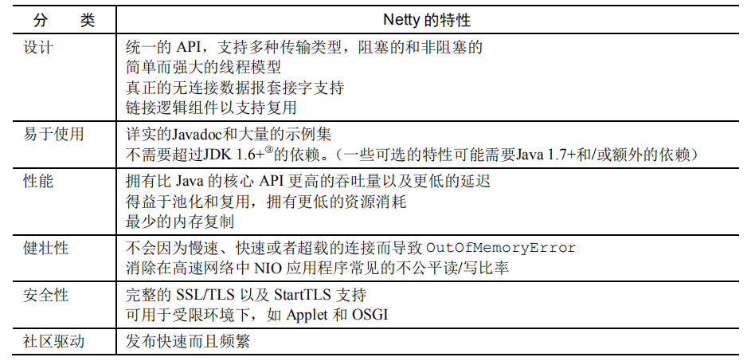

# 2. Netty整体设计

**实际上Netty线程模型就是Reactor模式的一个实现**

netty 的线程模型并不是一成不变的，它实际取决于用户的启动参数配置。通过设置不同的启动参数，Netty 可以同时支持 Reactor 单线程模型、多线程模型。

Netty的架构模型：

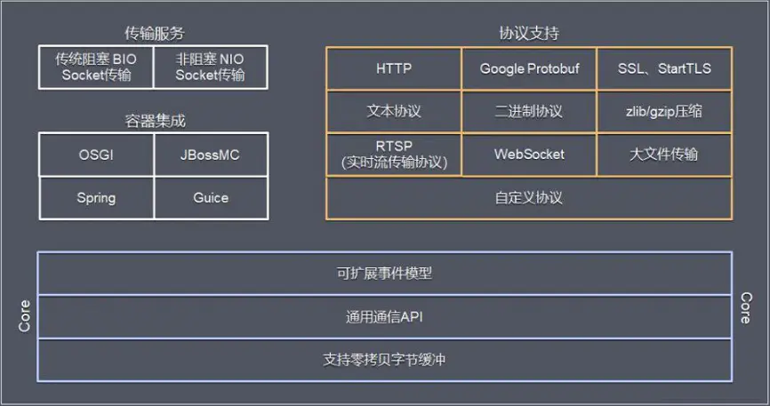

**I/O**：各种各样的流（文件、数组、缓冲、管道。。。）的处理（输入输出）。

**Channel**：通道，代表一个连接，每个Client请对会对应到具体的一个Channel。

**ChannelPipeline**：责任链，每个Channel都有且仅有一个ChannelPipeline与之对应，里面是各种各样的Handler。

**handler**：用于处理出入站消息及相应的事件，实现我们自己要的业务逻辑。

**EventLoopGroup**：I/O线程池，负责处理Channel对应的I/O事件。

**ServerBootstrap**：服务器端启动辅助对象。

**Bootstrap**：客户端启动辅助对象。

**ChannelInitializer**：Channel初始化器。

**ChannelFuture**：代表I/O操作的执行结果，通过事件机制，获取执行结果，通过添加监听器，执行我们想要的操作。

**ByteBuf**：字节序列，通过ByteBuf操作基础的字节数组和缓冲区。

## 2.1 Reactor线程模型

**Reactor是反应堆的意思，Reactor模型，是指通过一个或多个输入同时传递给服务处理器的服务请求的事件驱动处理模式。** 服务端程序处理传入多路请求，并将它们同步分派给请求对应的处理线程，Reactor模式也叫Dispatcher（调度/派遣）模式，即I/O多了复用统一监听事件，收到事件后分发(Dispatch给某进程)，是编写高性能网络服务器的必备技术之一。

**Reactor模式是基于事件驱动开发的**，核心组成部分包括Reactor和线程池，其中Reactor负责监听和分配事件，线程池负责处理事件，而根据Reactor的数量和线程池的数量，又将Reactor分为三种模型

- 单线程模型 (单Reactor单线程)
- 多线程模型 (单Reactor多线程)
- 主从多线程模型 (多Reactor多线程)

**Reactor模型中有2个关键部分：**

- Reactor 

  > 在一个单独的线程中运行，负责监听和分发事件，分发给适当的处理程序来对IO事件做出反应。 它就像公司的电话接线员，它接听来自客户的电话并将线路转移到适当的联系人

- Handlers 

  > 处理程序执行I/O事件要完成的实际事件，类似于客户想要与之交谈的公司中的实际官员。Reactor通过调度适当的处理程序来响应I/O事件，处理程序执行非阻塞操作

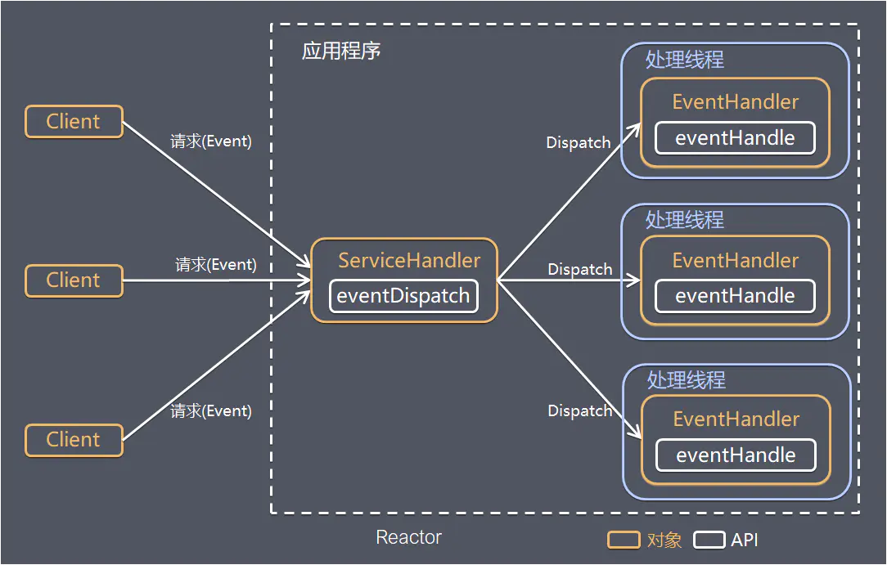


### 2.1.1 Reactor单线程模型

> Reactor 单线程模型，是指所有的 I/O 操作都在同一个 NIO 线程上面完成的，此时NIO线程职责包括：接收新建连接请求、读写操作等。

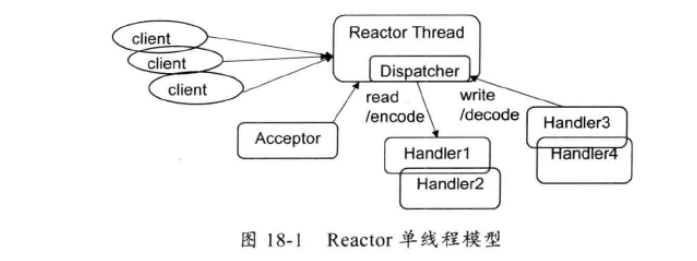


**方案说明**

- Reactor对象通过select监控客户端请求事件，收到事件后通过dispatch进行分发
- 如果是建立连接请求事件，则由Acceptor通过accept处理连接请求，然后创建一个Handler对象处理连接完成后的后续业务处理
- 如果不是建立连接事件，则Reactor会分发调用连接对应的Handler来响应
- Handler会完成read-->业务处理-->send的完整业务流程

**优点**
 模型简单，没有多线程、进程通信、竞争的问题，全部都在一个线程中完成

**缺点**

- 性能问题：只有一个线程，无法完全发挥多核CPU的性能
   Handler在处理某个连接上的业务时，整个进程无法处理其他连接事件，很容易导致性能瓶颈
- 可靠性问题：线程意外跑飞，或者进入死循环，会导致整个系统通信模块不可用，不能接收和处理外部消息，造成节点故障

**使用场景**
 客户端的数量有限，业务处理非常快速，比如Redis，业务处理的时间复杂度O(1)


### 2.1.2 Reactor多线程模型

> Rector 多线程模型与单线程模型最大的区别就是有一组 NIO 线程来处理连接读写操作，一个NIO线程处理Accept。一个NIO线程可以处理多个连接事件，一个连接的事件只能属于一个NIO线程。

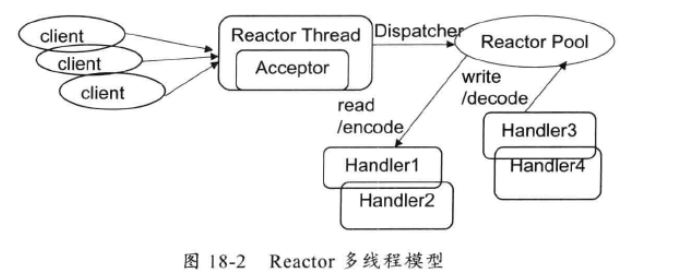

**方案说明**

- 主线程中，Reactor对象通过select监控客户端请求事件，收到事件后通过dispatch进行分发
- 如果是建立连接请求事件，则由Acceptor通过accept处理连接请求，然后创建一个Handler对象处理连接完成后的续各种事件，如果不是建立连接事件，则Reactor会分发调用连接对应的Handler来响应
- Handler只负责响应事件，不做具体业务处理，通过read读取数据后，会分发给后面的Worker线程池进行业务处理
- Worker线程池会分配独立的线程完成真正的业务处理，如何将响应结果发给Handler进行处理
- Handler收到响应结果后通过send将响应结果返回给client

**优点**
 可以充分利用多核CPU的处理能力

**缺点**

- 多线程数据共享和访问比较复杂
- Reactor承担所有事件的监听和响应，在单线程中运行，高并发场景下容易成为性能瓶颈

### 2.1.3 Reactor主从多线程模型

> 针对单Reactor多线程模型中，Reactor在单线程中运行，高并发场景下容易成为性能瓶颈，可以让Reactor在多线程中运行
>
> 主从 Reactor 线程模型的特点是：服务端用于接收客户端连接的不再是一个单独的 NIO 线程，而是一个独立的 NIO 线程池。

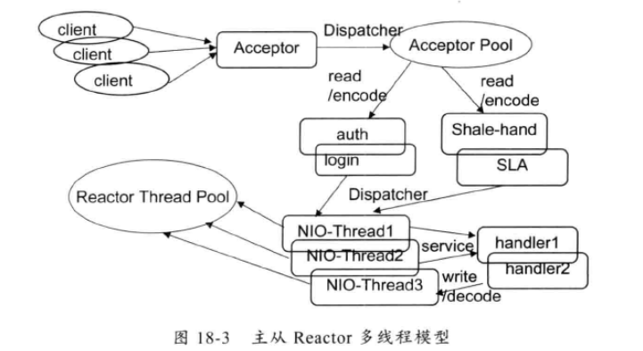

**方案说明**

- 存在多个Reactor，**每个Reactor都有自己的selector选择器**，线程和dispatch
- Reactor主线程MainReactor对象通过自己的select监控建立连接事件，收到事件后通过Acceptor接收，处理建立连接事件
- Accepto处理建立连接事件后，MainReactor将连接分配Reactor子线程给SubReactor进行处理
- SubReactor将连接加入连接队列进行监听，并创建一个Handler用于处理各种连接事件
- 当有新的事件发生时，SubReactor会调用连接对应的Handler进行响应
- Handler通过read读取数据后，会分发给后面的Worker线程池进行业务处理
- Worker线程池会分配独立的线程完成真正的业务处理，如何将响应结果发给Handler进行处理
- Handler收到响应结果后通过send将响应结果返回给client
- Handler完成read->业务处理->send的完整业务流程

**优点**

- 父线程与子线程的数据交互简单职责明确，父线程只需要接收新连接，子线程完成后续的业务处理
- 父线程与子线程的数据交互简单，Reactor主线程只需要把新连接传给子线程，子线程无需返回数据

这种模型在许多项目中广泛使用，包括Nginx主从Reactor多进程模型，Memcached主从多线程，Netty主从多线程模型的支持

### 2.1.4 总结

3种模式可以用个比喻来理解：1
 餐厅常常雇佣接待员负责迎接顾客，当顾客入坐后，侍应生专门为这张桌子服务

- 单Reactor单线程
   接待员和侍应生是同一个人，全程为顾客服务
- 单Reactor多线程
   1个接待员，多个侍应生，接待员只负责接待
- 主从Reactor多线程
   多个接待员，多个侍应生

Reactor模式具有如下的优点：

- 响应快，不必为单个同步时间所阻塞，虽然Reactor本身依然是同步的
- 编程相对简单，可以最大程度的避免复杂的多线程及同步问题，并且避免了多线程/进程的切换开销；
- 可扩展性，可以方便的通过增加Reactor实例个数来充分利用CPU资源
- 可复用性，Reactor模型本身与具体事件处理逻辑无关，具有很高的复用性

## 2.2 Proactor线程模型

在Reactor模式中，Reactor等待某个事件或者可应用或个操作的状态发生（比如文件描述符可读写，或者是socket可读写），然后把这个事件传给事先注册的Handler（事件处理函数或者回调函数），由后者来做实际的读写操作，其中的读写操作都需要应用程序同步操作，所以Reactor是非阻塞同步网络模型。如果把I/O操作改为异步，即交给操作系统来完成就能进一步提升性能，这就是异步网络模型Proactor

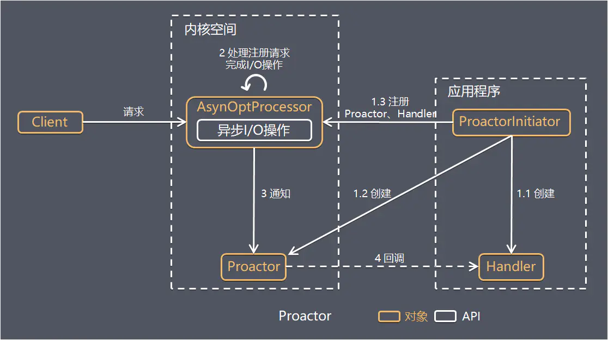

Proactor是和异步I/O相关的，**详细方案**如下：

- ProactorInitiator创建Proactor和Handler对象，并将Proactor和Handler都通过AsyOptProcessor（Asynchronous Operation Processor）注册到内核
- AsyOptProcessor处理注册请求，并处理I/O操作
- AsyOptProcessor完成I/O操作后通知Proactor
- Proactor根据不同的事件类型回调不同的Handler进行业务处理
- Handler完成业务处理

可以看出Proactor和Reactor的区别：Reactor是在事件发生时就通知事先注册的事件（读写在应用程序线程中处理完成）；Proactor是在事件发生时基于异步I/O完成读写操作（由内核完成），待I/O操作完成后才回调应用程序的处理器来处理进行业务处理

理论上Proactor比Reactor效率更高，异步I/O更加充分发挥DMA(Direct Memory Access，直接内存存取)的优势，但是有如下缺点：

- 编程复杂性
   由于异步操作流程的事件的初始化和事件完成在时间和空间上都是相互分离的，因此开发异步应用程序更加复杂。应用程序还可能因为反向的流控而变得更加难以Debug
- 内存使用
   缓冲区在读或写操作的时间段内必须保持住，可能造成持续的不确定性，并且每个并发操作都要求有独立的缓存，相比Reactor模式，在socket已经准备好读或写前，是不要求开辟缓存的
- 操作系统支持
   Windows 下通过 IOCP 实现了真正的异步 I/O，而在 Linux 系统下，Linux2.6才引入，目前异步I/O还不完善

因此在Linux下实现高并发网络编程都是以Reactor模型为主

## 2.3 Netty 的线程模型

Netty的线程模型并不是一成不变的，它实际取决于用户的启动参数配置。通过设置不同的启动参数，Netty 可以同时支持Reactor单线程模型、多线程模型和主从Reactor多线层模型。下面让我们通过一张原理图来快速了解Netty的线程模型。

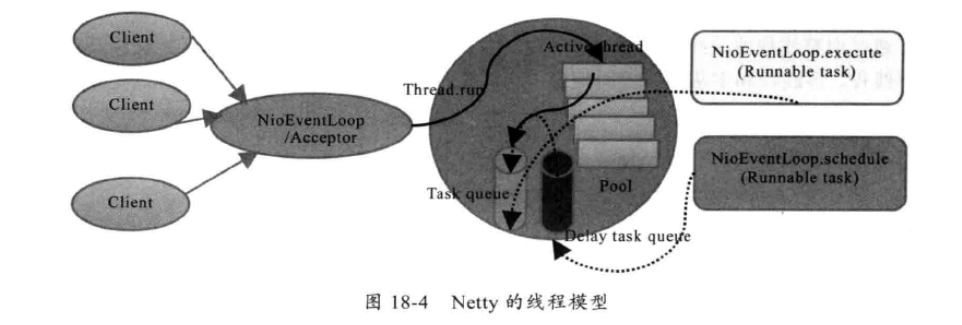

可以通过下面的Netty服务端启动代码来了解它的线程模型

```java
NioEventLoopGroup boss = new NioEventLoopGroup();
NioEventLoopGroup worker = new NioEventLoopGroup();
ServerBootstrap bootstrap = new ServerBootstrap();
bootstrap.group(boss, worker)
    .channel(NioServerSocketChannel.class)
    .childOption(ChannelOption.SO_KEEPALIVE, true)
    .childHandler(new ChannelInitializer<SocketChannel>() {
        。。。。。
    });
```

服务端启动的时候，创建了两个NioEventLoopGroup，它们实际是两个独立的Reactor线程池。一个用于接收客户端的TCP连接，另一个用于处理1/O相关的读写操作，或者执行系统Task、定时任务Task等。

Netty用于接收客户端请求的线程池职责如下：

1. 接收客户端TCP连接，初始化Channel参数:
2. 将链路状态变更事件通知给ChannelPipeline.

Netty处理I/O操作的Reactor线程池职责如下。

1. 异步读取通信对端的数据报，发送读事件到ChannelPipeline;
2. 异步发送消息到通信对端，调用ChannelPipeline的消息发送接口; 
3. 执行系统调用Task;
4. 执行定时任务Task，例如链路空闲状态监测定时任务。

通过调整线程池的线程个数、是否共享线程池等方式，Netty的Reactor线程模型可以在单线程、多线程和主从多线程间切换，这种灵活的配置方式可以最大程度地满足不同用户的个性化定制。

## 2.3 Netty实现三种模型

说明：Netty主要靠NioEventLoopGroup线程池来实现具体的线程模型的

1. 单线程模型

   > 单线程模型就是只指定一个线程执行客户端连接和读写操作，也就是在一个Reactor中完成，对应在Netty中的实现就是将NioEventLoopGroup线程数设置为1，核心代码是：

   ```java
    NioEventLoopGroup group = new NioEventLoopGroup(1);
           ServerBootstrap bootstrap = new ServerBootstrap();
           bootstrap.group(group)
                   .channel(NioServerSocketChannel.class)
                   .channel(NioServerSocketChannel.class)
                   .option(ChannelOption.TCP_NODELAY, true)
                   .option(ChannelOption.SO_BACKLOG, 1024)
                   .childHandler(new ServerHandlerInitializer());
   
   ```

   工作流程：

   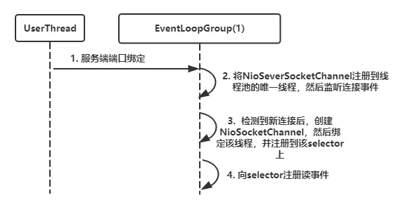

   > 上述单线程模型就对应了Reactor的单线程模型

2. 多线程模型

   > 多线程模型就是在一个单Reactor中进行客户端连接处理，然后业务处理交给线程池，核心代码如下：

   ```java
   NioEventLoopGroup eventGroup = new NioEventLoopGroup();
   ServerBootstrap bootstrap = new ServerBootstrap();
   bootstrap.group(eventGroup)
           .channel(NioServerSocketChannel.class)
           .option(ChannelOption.TCP_NODELAY, true)
           .option(ChannelOption.SO_BACKLOG, 1024)
           .childHandler(new ServerHandlerInitializer());
   
   ```

   走进group方法可以发现我们平时设置的bossGroup和workerGroup就是使用了同一个group

   ```java
   @Override
   public ServerBootstrap group(EventLoopGroup group) {
       return this.group(group, group);
   }
   ```

   工作流程

   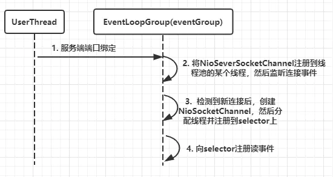

3. 主从多线程模型

   > 主从多线程模型是有多个Reactor，也就是存在多个selector，所以我们定义一个bossGroup和一个workGroup，核心代码如下：

   ```java
   NioEventLoopGroup bossGroup = new NioEventLoopGroup();
   NioEventLoopGroup workerGroup = new NioEventLoopGroup();
   ServerBootstrap bootstrap = new ServerBootstrap();
   bootstrap.group(bossGroup,workerGroup)
           .channel(NioServerSocketChannel.class)
           .option(ChannelOption.TCP_NODELAY, true)
           .option(ChannelOption.SO_BACKLOG, 1024)
           .childHandler(new ServerHandlerInitializer());
   
   ```

   工作流程

   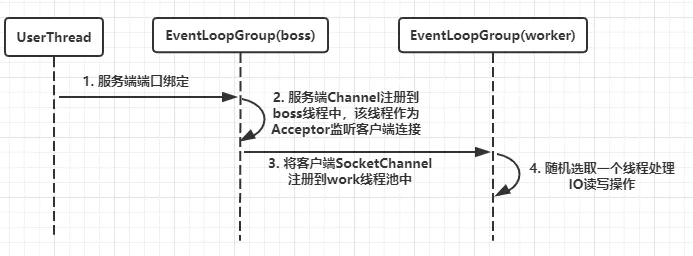


**注意：其实在Netty中，bossGroup线程池最终还是只会随机选择一个线程用于处理客户端连接，与此同时，NioServerSocetChannel绑定到bossGroup的线程中，NioSocketChannel绑定到workGroup的线程中**


# 3. Netty核心API

## 3.1 ChannelHandler及其实现类

ChannelHandler 接口定义了许多事件处理的方法，我们可以通过重写这些方法去实现具
体的业务逻辑。API 关系如下图所示：

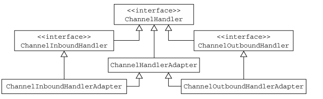

我们经常需要自定义一个 Handler 类去继承 ChannelInboundHandlerAdapter，然后通过
重写相应方法实现业务逻辑，我们接下来看看一般都需要重写哪些方法：

- public void channelActive(ChannelHandlerContext ctx)，通道就绪事件
- public void channelRead(ChannelHandlerContext ctx, Object msg)，通道读取数据事件
- public void channelReadComplete(ChannelHandlerContext ctx) ，数据读取完毕事件
- public void exceptionCaught(ChannelHandlerContext ctx, Throwable cause)，通道发生异常事件

## 3.2 Pipeline 和 ChannelPipeli

ChannelPipeline 是一个 Handler 的集合，它负责处理和拦截 inbound 或者 outbound 的事件和操作，相当于一个贯穿 Netty 的链。

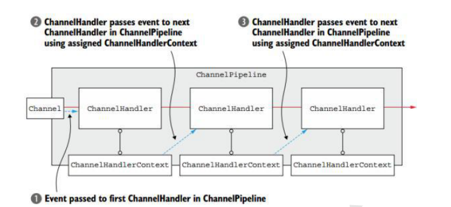

- ChannelPipeline addFirst(ChannelHandler... handlers)，把一个业务处理类（handler）添加
  到链中的第一个位置
- ChannelPipeline addLast(ChannelHandler... handlers)，把一个业务处理类（handler）添加
  到链中的最后一个位置

## 3.3 ChannelHandlerContext

这 是 事 件 处 理 器 上 下 文 对 象 ， Pipeline 链 中 的 实 际 处 理 节 点 。 每 个 处 理 节 点ChannelHandlerContext 中 包 含 一 个 具 体 的 事 件 处 理 器 ChannelHandler ， 同 时ChannelHandlerContext 中也绑定了对应的 pipeline 和 Channel 的信息，方便对 ChannelHandler进行调用。常用方法如下所示

- ChannelFuture close()，关闭通道
- ChannelOutboundInvoker flush()，刷新
- ChannelFuture writeAndFlush(Object msg) ， 将 数 据 写 到 ChannelPipeline 中 当 前
- ChannelHandler 的下一个 ChannelHandler 开始处理（出站）

## 3.4 ChannelOption

Netty 在创建 Channel 实例后,一般都需要设置 ChannelOption 参数。ChannelOption 是
Socket 的标准参数，而非 Netty 独创的。常用的参数配置有：

1. ChannelOption.SO_BACKLOG

  > 对应 TCP/IP 协议 listen 函数中的 backlog 参数，用来初始化服务器可连接队列大小。服
  > 务端处理客户端连接请求是顺序处理的，所以同一时间只能处理一个客户端连接。多个客户
  > 端来的时候，服务端将不能处理的客户端连接请求放在队列中等待处理，backlog 参数指定
  > 了队列的大小。

2. ChannelOption.SO_KEEPALIVE ，一直保持连接活动状态。

## 3.5 ChannelFuture

表示 Channel 中异步 I/O 操作的结果，在 Netty 中所有的 I/O 操作都是异步的，I/O 的调用会直接返回，调用者并不能立刻获得结果，但是可以通过 ChannelFuture 来获取 I/O 操作的处理状态。

常用方法如下所示：

- Channel channel()，返回当前正在进行 IO 操作的通道
- ChannelFuture sync()，等待异步操作执行完毕传

## 3.6 EventLoopGroup 和其实现类 NioEventLoopGroup

EventLoopGroup 是一组 EventLoop 的抽象，Netty 为了更好的利用多核 CPU 资源，一般会有多个 EventLoop 同时工作，每个 EventLoop 维护着一个 Selector 实例。

EventLoopGroup 提供 next 接口，可以从组里面按照一定规则获取其中一个 EventLoop来处理任务。在 Netty 服务器端编程中，我们一般都需要提供两个 EventLoopGroup，例如：BossEventLoopGroup 和 WorkerEventLoopGroup。

通常一个服务端口即一个 ServerSocketChannel对应一个Selector 和一个EventLoop线程。BossEventLoop 负责接收客户端的连接并将 SocketChannel 交给 WorkerEventLoopGroup 来进行 IO 处理，如下图所示

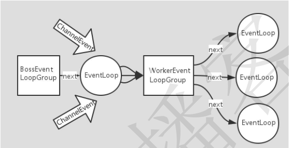

BossEventLoopGroup 通常是一个单线程的 EventLoop，EventLoop 维护着一个注册了ServerSocketChannel 的 Selector 实例，BossEventLoop 不断轮询 Selector 将连接事件分离出来，通常是 OP_ACCEPT 事件，然后将接收到的 SocketChannel 交给 WorkerEventLoopGroup，WorkerEventLoopGroup 会由 next 选择其中一个 EventLoopGroup 来将这个 SocketChannel 注册到其维护的 Selector 并对其后续的 IO 事件进行处理。

常用方法如下所示：

- public NioEventLoopGroup()，构造方法
- public Future<?> shutdownGracefully()，断开连接，关闭线程

## 3.7  ServerBootstrap 和 Bootstrap

ServerBootstrap 是 Netty 中的服务器端启动助手，通过它可以完成服务器端的各种配置；Bootstrap 是 Netty 中的客户端启动助手，通过它可以完成客户端的各种配置。

常用方法如下所示： 

- public ServerBootstrap group(EventLoopGroup parentGroup, EventLoopGroup childGroup)，该方法用于服务器端，用来设置两个 EventLoop
- public B group(EventLoopGroup group) ，该方法用于客户端，用来设置一个 EventLoop
- public B channel(Class<? extends C> channelClass)，该方法用来设置一个服务器端的通道实现
- public <T> B option(ChannelOption<T> option, T value)，用来给 ServerChannel 添加配置
- public <T> ServerBootstrap childOption(ChannelOption<T> childOption, T value)，用来给接收到的通道添加配置
- public ServerBootstrap childHandler(ChannelHandler childHandler)，该方法用来设置业务处理类（自定义的 handler）

## 3.8 Unpooled 类

这是 Netty 提供的一个专门用来操作缓冲区的工具类，常用方法如下所示：

- public static ByteBuf copiedBuffer(CharSequence string, Charset charset)，通过给定的数据
  和字符编码返回一个 ByteBuf 对象（类似于 NIO 中的 ByteBuffer 对象）

# 3. Netty 入门案例

## 3.1 代码实现

1. 导入坐标

   ```xml
   <dependency>
       <groupId>io.netty</groupId>
       <artifactId>netty-all</artifactId>
       <version>4.1.17.Final</version>
   </dependency>
   ```

2. 服务端开发

   ```java
   // Netty服务器程序
   public class NettyServer {
       public static void main(String[] args) throws InterruptedException {
           // 1. 创建一个线程组，用于处理网络事件（接收客户端连接）
           NioEventLoopGroup boss = new NioEventLoopGroup();
           // 2. 创建一个线程组，用于处理IO事件（通道IO操作）
           NioEventLoopGroup worker = new NioEventLoopGroup();
           // 上面两个线程组实际上 就是Reactor线程组（主从）
   
           // 3. 创建服务器端辅助启动类，目的是降低服务端开发复杂度
           ServerBootstrap bootstrap = new ServerBootstrap();
           // 设置两个线程组
           ServerBootstrap serverBootstrap = bootstrap.group(boss, worker)
                   // 使用NioServerSocketChannel 作为服务器端通道实现
                   .channel(NioServerSocketChannel.class)
                   // 设置线程队列中等待连接的个数
                   .option(ChannelOption.SO_BACKLOG, 1024)
                   // 保持活动连接状态
                   .childOption(ChannelOption.SO_KEEPALIVE, true)
                   // 创建一个通道初始化对象
                   .childHandler(new ChannelInitializer<SocketChannel>() {
                       @Override
                       protected void initChannel(SocketChannel socketChannel) throws Exception {
                             // 往Pipeline链中添加自定义的业务处理handler
                           socketChannel.pipeline().addLast(new NettyServerHandler());
                           System.out.println("服务已经准备就绪！");
                       }
                   });
   
           // 4. 异步地绑定服务器，调用 sync()方法阻塞，等待直到绑定完成
           // 返回ChannelFuture对象 主要用于异步操作的通知回调
           ChannelFuture future = bootstrap.bind(9999).sync();
           System.out.println("服务器已经成功启动。。。。");
   
           // 5. 进行阻塞，等待服务端链路关闭之后main函数才退出
           future.channel().closeFuture().sync();
           // 6. 优雅退出，释放线程池资源
           boss.shutdownGracefully();
           worker.shutdownGracefully();
       }
   }
   
   ```

   ```java
   // 自定义服务器端业务处理类
   public class NettyServerHandler extends ChannelInboundHandlerAdapter {
   
       /**
        *  读取数据事件
        * @param ctx
        * @param msg
        * @throws Exception
        */
       @Override
       public void channelRead(ChannelHandlerContext ctx, Object msg) throws Exception {
           // server: ChannelHandlerContext(NettyServerHandler#0, [id: 0x489923c9, L:/127.0.0.1:9999 - R:/127.0.0.1:58139])
           System.out.println("server: " +ctx);
           /**
            * 类型转换，将msg对象转为netty的ByteBuf对象，此对象类似与JDK中的ByteBuffer对象，
            * 不过ByteBuf对象提供了更加强大和灵活的功能
            */
           ByteBuf buffer = (ByteBuf) msg;
           System.out.println("客户端传来消息："+buffer.toString(CharsetUtil.UTF_8));
       }
   
       /**
        * 数据读取完毕事件
        * @param ctx
        * @throws Exception
        */
       @Override
       public void channelReadComplete(ChannelHandlerContext ctx) throws Exception {
           /**
            * writeAndFlush顾名思义这是两个方法 write和flush
            * Netty的Write方法并不直接将详细写入SocketChannel中，调用write方法只是把待发送的消息放到发送缓存数组中，
            * 再通过flush方法，将发送缓冲区中的消息全部写如到SocketChannel中
            */
           ctx.writeAndFlush(Unpooled.copiedBuffer("发过来的数据已经读取完毕！",CharsetUtil.UTF_8));
   
       }
   
       /**
        * 异常发生事件
        * @param ctx
        * @param cause
        * @throws Exception
        */
       @Override
       public void exceptionCaught(ChannelHandlerContext ctx, Throwable cause) throws Exception {
           // 打印异常信息
           cause.printStackTrace();
           /**
            * 关闭ChannelHandlerContext 释放和ChannelHandlerContext相关连的资源
            */
           ctx.close();
       }
   }
   
   ```

3. 客户端开发

   ```java
   // Netty客户端程序
   public class NettyClient {
       public static void main(String[] args) throws InterruptedException {
           // 1. 创建客户端NIO线程组
           NioEventLoopGroup group = new NioEventLoopGroup();
           // 2. 创建客户端启动助手
           Bootstrap bootstrap = new Bootstrap();
           // 设置线程组
           bootstrap.group(group)
                   // 使用NioSocketChannel作为客户端通道实现
                   .channel(NioSocketChannel.class)
                   // 创建一个通道初始化对象
               	// 作用：当创建NioSocketChannel成功之后，在进行初始化时，将它的ChannelHandler设置到ChannelPipeline中，用于处理网络IO事件
                   .handler(new ChannelInitializer<SocketChannel>() {
                       @Override
                       protected void initChannel(SocketChannel socketChannel) throws Exception {
                           // 往 Pipeline 链中添加自定义的业务处理 handler
                           socketChannel.pipeline().addLast(new NettyClientHandler());
                           System.out.println("客户端已经准备就绪！");
                       }
                   });
   
           // 3. 启动客户端，调用connect异步连接操作，再调用sync同步方法等待连接成功
           ChannelFuture future = bootstrap.connect("127.0.0.1", 9999).sync();
           // 4. 等待连接关闭（非阻塞）
           future.channel().closeFuture().sync();
           
   		// 5. 优雅退出，释放NIO线程组
           group.shutdownGracefully();
           
       }
   }
   
   ```

   ```java
   // 自定义客户端业务处理类
   public class NettyClientHandler extends SimpleChannelInboundHandler {
   
       /**
        * 当客户端和服务端TCP连接成功建立之后，Netty的NIO线程就会调用channelActive方法
        * 通道就绪事件
        * @param ctx
        * @throws Exception
        */
       @Override
       public void channelActive(ChannelHandlerContext ctx) throws Exception {
           // client: ChannelHandlerContext(NettyClientHandler#0, [id: 0x9581ec4d, L:/127.0.0.1:58139 - R:/127.0.0.1:9999])
           System.out.println("client: "+ctx);
   
           // 发送请求方法给服务端
           ctx.writeAndFlush(Unpooled.copiedBuffer("这是一条来自客户端的消息！", CharsetUtil.UTF_8));
   
       }
   
       /**
        * 当服务器端返回应答消息后channelRead被调用
        * 通道读取数据事件
        * @param ctx
        * @param msg
        * @throws Exception
        */
       @Override
       protected void channelRead0(ChannelHandlerContext ctx, Object msg) throws Exception {
           ByteBuf buffer = (ByteBuf) msg;
           System.out.println("来自服务器端的消息："+buffer.toString(CharsetUtil.UTF_8));
       }
   
       /**
        * 数据读取完毕事件
        * @param ctx
        * @throws Exception
        */
       @Override
       public void channelReadComplete(ChannelHandlerContext ctx) throws Exception {
           ctx.flush();
       }
   
       /**
        * 异常发生事件
        * @param ctx
        * @param cause
        * @throws Exception
        */
       @Override
       public void exceptionCaught(ChannelHandlerContext ctx, Throwable cause) throws Exception {
           ctx.close();
       }
   }
   ```

## 3.2 核心组件

1. Channel

   Channel 是 Java NIO 的一个基本构造。

   > 它代表一个到实体（如一个硬件设备、一个文件、一个网络套接字或者一个能够执
   > 行一个或者多个不同的I/O操作的程序组件）的开放连接，如读操作和写操作

   目前，可以把 Channel 看作是传入（入站）或者传出（出站）数据的载体。因此，它可以
   被打开或者被关闭，连接或者断开连接

2. 回调

   一个回调其实就是一个方法，一个指向已经被提供给另外一个方法的方法的引用。这使得后
   者可以在适当的时候调用前者。回调在广泛的编程场景中都有应用，而且也是在操作完成后通
   知相关方最常见的方式之一。

   > Netty 在内部使用了回调来处理事件；当一个回调被触发时，相关的事件可以被一个 interface-ChannelHandler 的实现处理。在Netty入门案例当中，当一个新的连接已经被建立时，ChannelHandler 的 channelActive()回调方法将会被调用，并将打印出一条信息。

   ```java
   public class NettyClientHandler extends ChannelInboundHandlerAdapter {
   
       /**
        * 当客户端和服务端TCP连接成功建立之后，Netty的NIO线程就会调用channelActive方法
        * 通道就绪事件
        * @param ctx
        * @throws Exception
        */
       @Override
       public void channelActive(ChannelHandlerContext ctx) throws Exception {
           // 当新的连接被建立时，channelActive方法将被调用
           System.out.println("Client " + ctx.channel().remoteAddress() + " connected");
   
       }
   ```

3. Future

   Future 提供了另一种在操作完成时通知应用程序的方式。这个对象可以看作是一个异步操
   作的结果的占位符；它将在未来的某个时刻完成，并提供对其结果的访问。

   > JDK 预置了 interface java.util.concurrent.Future，但是其所提供的实现，只允许手动检查对应的操作是否已经完成，或者一直阻塞直到它完成。这是非常繁琐的，所以 Netty提供了它自己的实现——ChannelFuture，用于在执行异步操作的时候使用。

   > ChannelFuture提供了几种额外的方法，这些方法使得我们能够注册一个或者多个ChannelFutureListener实例。监听器的回调方法operationComplete()，将会在对应的操作完成时被调用。然后监听器可以判断该操作是成功地完成了还是出错了。如果是后者，我们可以检索产生的Throwable。简而 言之 ，由ChannelFutureListener提供的通知机制消除了手动检查对应的操作是否完成的必要。

   每个 Netty 的出站 I/O 操作都将返回一个 ChannelFuture；也就是说，它们都不会阻塞。正如我们前面所提到过的一样，Netty 完全是异步和事件驱动的。

   ```java
   // 异步的连接到远程服务器，connect()方法将会直接返回，而不会阻塞
   ChannelFuture future = bootstrap.connect("127.0.0.1", 9999);
   //检查连接的状态
   future.addListener(new ChannelFutureListener() {
       // 检查操作的状态
       @Override
       public void operationComplete(ChannelFuture channelFuture) throws Exception {
           if (channelFuture.isSuccess()){
               // 操作成功
               ByteBuf buffer = Unpooled.copiedBuffer("Hello", Charset.defaultCharset());
               // 发送异步数据到服务器
               future.channel().writeAndFlush(buffer);
           }else{
               // 如果发生错误，则访问描述原因的 Throwable
               Throwable cause = future.cause();
               cause.printStackTrace();
           }
       }
   });
   ```

4. 事件和ChannelHandler

   Netty 使用不同的事件来通知我们状态的改变或者是操作的状态。这使得我们能够基于已经发生的事件来触发适当的动作。这些动作可能是

   - 记录日志；
   - 数据转换；
   - 流控制；
   - 应用程序逻辑。

   Netty 是一个网络编程框架，所以事件是按照它们与入站或出站数据流的相关性进行分类的。可能由入站数据或者相关的状态更改而触发的事件包括：

   - 连接已被激活或者连接失活；
   - 数据读取；
   - 用户事件；
   - 错误事件

   每个事件都可以被分发给 ChannelHandler 类中的某个用户实现的方法。这是一个很好的将事件驱动范式直接转换为应用程序构件块的例子。下图展示了一个事件是如何被一个这样的ChannelHandler 链处理的。

   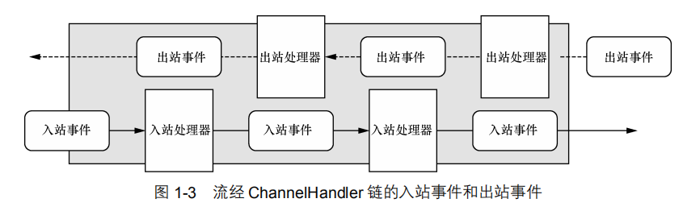

   Netty 的 ChannelHandler 为处理器提供了基本的抽象，但是目前你可以认为每个ChannelHandler 的实例都类似于一种为了响应特定事件而被执行的回调，Netty 提供了大量预定义的可以开箱即用的 ChannelHandler 实现

5. 选择器、事件和 EventLoop

   Netty 通过触发事件将 Selector 从应用程序中抽象出来，消除了所有本来将需要手动编写的派发代码。在内部，将会为每个 Channel 分配一个 EventLoop，用以处理所有事件，包括：

   - 注册感兴趣的事件；
   - 将事件派发给 ChannelHandler；
   - 安排进一步的动作。

   EventLoop 本身只由一个线程驱动，其处理了一个 Channel 的所有 I/O 事件，并且在该EventLoop 的整个生命周期内都不会改变

## 3.3 深入入门案例实现

### 3.3.1 服务器端实现

所有的Netty服务器都需要以下两个部分：

- 至少一个 ChannelHandler—该组件实现了服务器对从客户端接收的数据的处理，即
  它的业务逻辑。
- 引导—这是配置服务器的启动代码。至少，它会将服务器绑定到它要监听连接请求的
  端口上。

**ChannelHandler 和业务逻辑**

ChannelHandler，它是一个接口族的父接口，它的实现**负责接收并响应事件通知。**在 Netty 应用程序中，所有的数据处理逻辑都包含在这些核心抽象的实现中。

因为服务器会响应传入的消息，所以它需要实现 ChannelInboundHandler 接口，用来定义响应入站事件的方法。这个简单的应用程序只需要用到少量的这些方法，所以继承ChannelInboundHandlerAdapter 类也就足够了，它提供了 ChannelInboundHandler 的默认实现。

我们感兴趣的方法是：

- `channelRead()`—对于每个传入的消息都要调用；
- `channelReadComplete()`—通知ChannelInboundHandler最后一次对channelRead()的调用是当前批量读取中的最后一条消息，即当传入服务器的消息读取完毕的时候调用；
- `exceptionCaught()`—在读取操作期间，有异常抛出时会调用。

ChannelInboundHandlerAdapter 有一个直观的 API，并且它的每个方法都可以被重写以挂钩到事件生命周期的恰当点上。因为需要处理所有接收到的数据，所以你重写了 channelRead()方法。在这个服务器应用程序中，你将数据简单地回送给了远程节点。

重写 exceptionCaught()方法允许你对 Throwable 的任何子类型做出反应，在这里你记录了异常并关闭了连接。虽然一个更加完善的应用程序也许会尝试从异常中恢复，但在这个场景下，只是通过简单地关闭连接来通知远程节点发生了错误。

> **如果不捕获异常，会发生什么**
>
> 每个 Channel 都拥有一个与之相关联的 ChannelPipeline，其持有一个 ChannelHandler 的实例链。在默认的情况下，ChannelHandler 会把对它的方法的调用转发给链中的下一个ChannelHandler。因此，如果 exceptionCaught()方法没有被该链中的某处实现，那么所接收的异常将会被传递到 ChannelPipeline 的尾端并被记录。为此，你的应用程序应该提供至少有一个实现了exceptionCaught()方法的 ChannelHandler。

**引导服务器**

在讨论过由 NettyServerHandler实现的核心业务逻辑之后，我们现在可以探讨引导服务器本身的过程了，具体涉及以下内容：

- 绑定到服务器将在其上监听并接受传入连接请求的端口；
- 配置 Channel，以将有关的入站消息通知给 NettyServerHandler 实例。

在上述的入门案例中，

1. 首先创建了一个 ServerBootstrap 实例，因为你正在使用的是 NIO 传输，所以指定了 NioEventLoopGroup来接受和处理新的连接

   > 这里使用了主从架构，即一个NioEventLoopGroup用于处理连接，一个NioEventLoopGroup用于处理通道IO操作，

2. 并且将 Channel 的类型指定为NioServerSocketChannel

3. 在此之后，可以将本地地址设置为一个具有选定端口的 InetSocketAddress 。服务器将绑定到这个地址以监听新的连接请求。

   与上面案例中的区别在于，可以直接在这里指定端口，而不必在`bind()`方法中指定

   ```java
   grroup.localAddress(new InetSocketAddress(port))
   ```

4. 接下来，使用了一个特殊的类——ChannelInitializer。这是关键。**当一个新的连接被接受时，一个新的子 Channel 将会被创建**，而 ChannelInitializer 将会把一个你的NettyServerHandler的实例添加到该 Channel 的 ChannelPipeline 中。正如我们之前所解释的，这个 ChannelHandler 将会收到有关入站消息的通知。

5. 然后你绑定了服务器，并等待绑定完成。（对 sync()方法的调用将导致当前 Thread阻塞，一直到绑定操作完成为止）。

6. 最后调用了channel的closeFuture方法，该应用程序将会阻塞等待直到服务器的 Channel关闭（因为你在 Channel 的 CloseFuture 上调用了 sync()方法）。然后，你将可以关闭EventLoopGroup，并释放所有的资源，包括所有被创建的线程

至此，入门案例的服务端开发已经完成，接下来我们回顾一下其中的重要代码组件：

1. NettyServerHandler实现了业务逻辑；
2. main()方法引导了服务器，引导过程所需步骤如下：
   - 创建一个 ServerBootstrap 的实例以引导和绑定服务器；
   - 创建并分配一个 NioEventLoopGroup 实例以进行事件的处理，如接受新连接以及读/写数据；
   - 指定服务器绑定的本地的 InetSocketAddress；
   - 使用一个 EchoServerHandler 的实例初始化每一个新的 Channel；
   - 调用 ServerBootstrap.bind()方法以绑定服务器。

### 3.3.2 客户端实现

Netty 客户端将会：

1. 连接到服务器；
2. 发送一个或者多个消息；
3. 对于每个消息，等待并接收从服务器发回的相同的消息；
4. 关闭连接。

编写客户端所涉及的两个主要代码部分也是业务逻辑和引导，和你在服务器中看到的一样

如同服务器，客户端将拥有一个用来处理数据的 ChannelInboundHandler。在这个场景下，你将扩展 SimpleChannelInboundHandler 类以处理所有必须的任务

需要被关注的方法：

- channelActive()——在到服务器的连接已经建立之后将被调用；
- channelRead0()——当从服务器接收到一条消息时被调用；
- exceptionCaught()——在处理过程中引发异常时被调用。

**业务逻辑处理：**

具体实现：

1. 首先，重写了 channelActive()方法，其将在一个连接建立时被调用。这确保了数据将会被尽可能快地写入服务器

2. 接下来，重写了 channelRead0()方法。每当接收数据时，都会调用这个方法。需要注意的是，由服务器发送的消息可能会被分块接收。

   > 也就是说，如果服务器发送了 5 字节，那么不能保证这 5 字节会被一次性接收。即使是对于这么少量的数据，channelRead0()方法也可能会被调用两次，第一次使用一个持有 3 字节的 ByteBuf（Netty 的字节容器），第二次使用一个持有 2 字节的 ByteBuf。作为一个面向流的协议，TCP 保证了字节数组将会按照服务器发送它们的顺序被接收。

3. 重写的第三个方法是 exceptionCaught()。如同在 NettyServerHandler中所示，记录 Throwable，关闭 Channel，在这个场景下，终止到服务器的连接。

**SimpleChannelInboundHandler 与 ChannelInboundHandler**

你可能会想：为什么我们在客户端使用的是 SimpleChannelInboundHandler，而不是在 EchoServerHandler 中所使用的 ChannelInboundHandlerAdapter 呢？**这和两个因素的相互作用有关：业务逻辑如何处理消息以及 Netty 如何管理资源。** 

- 在客户端，当 channelRead0()方法完成时，你已经有了传入消息，并且已经处理完它了。当该方法返回时，SimpleChannelInboundHandler 负责释放指向保存该消息的 ByteBuf 的内存引用。
- 在 NettyServerHandler中，你仍然需要将传入消息回送给发送者，而 write()操作是异步的，直到 channelRead()方法返回后可能仍然没有完成。为此，NettyServerHandler扩展了 ChannelInboundHandlerAdapter，其在这个时间点上不会释放消息。
- 消息在 NettyServerHandler的 channelReadComplete()方法中，当 writeAndFlush()方法被调用时被释放

**引导客户端：**

引导客户端类似于引导服务器，不同的是，客户端是使用主机和端口参数来连接远程地址，也就是这里的 Netty服务器的地址，而不是绑定到一个一直被监听的端口

和之前一样，使用了 NIO 传输。注意，你可以在客户端和服务器上分别使用不同的传输。例如，在服务器端使用 NIO 传输，而在客户端使用 OIO 传输。

其他代码实现和服务器端没有太大区别，这里不再展开说明

回顾要点：

1. 为初始化客户端，创建了一个 Bootstrap 实例；
2. 为进行事件处理分配了一个 NioEventLoopGroup 实例，其中事件处理包括创建新的连接以及处理入站和出站数据；
3. 为服务器连接创建了一个 InetSocketAddress 实例；
4. 当连接被建立时，一个 NettyClientHandler实例会被安装到（该 Channel 的）ChannelPipeline 中；
5. 在一切都设置完成后，调用 Bootstrap.connect()方法连接到远程节点；
6. 完成了客户端，你便可以着手开始测试该系统了。

# 4. 编解码技术

## 4.1 java序列化的缺点

1. 无法跨语言

   对于跨进程的服务调用而言，服务提供者可能使用其他语言进行开发，此时，java序列化就难以胜任

2. 序列化后的码流太大

   在同等情况下，编码后的字节数组越大，存储的时候就越占空间，存储的硬件成本也就越高，并且在网络传输时更占带宽，导致系统的吞吐量降低

3. 序列化性能太低

   java序列化的性能只有二进制编码的6.17%左右

## 4.2  业界主流的编解码框架

1. Google的protobuf概述

   Protobuf全称Google Protocol Buffers，它由谷歌开源而来，在谷歌内部久经考验。它将数据结构以`.proto`文件进行描述，通过代码生成工具可以生成对应数据结构的POJO对象和Protobuf相关的方法和属性。

   它的特点如下：

   - 结构化数据存储格式(XML，JSON等);
   - 高效的编解码性能;
   - 语言无关、平台无关、扩展性好
   - 官方支持 Java、C++和Python三种语言。

   Protobuf另一个比较吸引人的地方就是它的数据描述文件和代码生成机制，利用数据描述文件对数据结构进行说明的优点如下：

   - 文本化的 数据结构描述语言，可以实现语言和平台无关，特别适合异构系统间的集成;
   - 通过标识字 段的顺序，可以实现协议的前向兼容;
   - 自动代码生成， 不需要手工编写同样数据结构的C++和Java版本;
   - 方便后续的管理和维护。相比于代码，结构化的文档更容易管理和维护。

2. FaceBook的Thrift概述

   Thrift支持三种比较典型的编解码方式。

   - 通用的二进制编解码;
   - 压缩二进制编解码;
   - 优化的可选字段压缩编解码。

3. JBoos的 Marshalling概述

   JBoss Marshalling 是一个Java对象的序列化API包，修正了JDK自带的序列化包的很多问题，但又保持跟java.io.Serializable 接口的兼容。同时，增加了一些可调的参数和附加的特性，并且这些参数和特性可通过工厂类进行配置。相比于传统的Java序列化机制，它的优点如下。

   - 可插拔 的类解析器，提供更加便捷的类加载定制策略，通过一个接口即可实现定制:
   - 可插拔的对象替换技术， 不需要通过继承的方式;
   - 可插拔的预定义类缓存表，可以减小序列化的字节数组长度，提升常用类型的对象序列化性能;
   - 无须 实现java.io.Serializable接口，即可实现Java序列化;
   - 通过缓存技 术提升对象的序列化性能。

   相比于前面介绍的两种编解码框架，JBossMarshalling更多是在JBoss内部使用，应用范围有限。

# 5. 使用Google的Protobuf编解码技术

## 5.1 protobuf入门测试

1. 下载protobuf安装包

   https://github.com/protocolbuffers/protobuf/releases/tag/v3.14.0

2. 创建Book.proto的文件

   ```protobuf
   // 设置版本号
   syntax = "proto3";
   // 生成的java类名
   option java_outer_classname = "BookMessage";
   // 内部类的类名，真正的pojo
   message Book{
   // 设置类中的属性，等号后是序号，不是属性值
      int32 id = 1;
      string name = 2;
   }
   ```

3. 通过protoc.exe根据描述文件生成java类

   将创建的Book.proto文件放在protoc.exe目录下，在其所在目录打开命令行工具执行如下命令

   ```
   protoc --java_out=./ Book.proto
   ```

4. 将生成的BookMessage.java文件拷贝到项目中（不要改变这个文件任何内容）

5. maven工程导入坐标

   ```xml
   <dependency>
       <groupId>com.google.protobuf</groupId>
       <artifactId>protobuf-java</artifactId>
       <version>3.14.0</version>
   </dependency>
   ```

6. 创建测试文件

   ```java
   public class TestProtobuf {
   
       private static byte[] encode(BookMessage.Book book){
           return book.toByteArray();
       }
       
       private static BookMessage.Book decode(byte[] body) throws InvalidProtocolBufferException {
           return BookMessage.Book.parseFrom(body);
       }
       
       private static BookMessage.Book createBook(){
           BookMessage.Book.Builder builder = BookMessage.Book.newBuilder();
           builder.setId(1);
           builder.setName("java从入门到如土");
           return builder.build();
       }
   
       public static void main(String[] args) throws InvalidProtocolBufferException {
           BookMessage.Book book = createBook();
           System.out.println("before encode："+ book.toString());
   
           BookMessage.Book decode = decode(encode(book));
           System.out.println("after decode："+ book.toString());
           System.out.println("assert equal:--->"+decode.equals(book));
       }
   }
   
   ```

   

## 5.2 Netty的protobuf开发

说明：本次开发基于上面的Netty入门案例，这里只讲具体代码插入的地方

1. 使用protobuf之前还是生成通过protobuf工具生成自己的JOPO类

2. 客户端插入

   - 客户端程序类插入

     ```java
     // 设置线程组
     bootstrap.group(group)
         // 使用NioSocketChannel作为客户端通道实现
         .channel(NioSocketChannel.class)
         // 创建一个通道初始化对象
         .handler(new ChannelInitializer<SocketChannel>() {
             @Override
             protected void initChannel(SocketChannel socketChannel) throws Exception {
                 // 测试编码
                 socketChannel.pipeline().addLast("encoder",new ProtobufEncoder());
                 // 往 Pipeline 链中添加自定义的业务处理 handler
                 socketChannel.pipeline().addLast(new NettyClientHandler());
                 System.out.println("客户端已经准备就绪！");
             }
         });
     ```

   -  自定义客户端业务处理类插入

     ```java
     @Override
     public void channelActive(ChannelHandlerContext ctx) throws Exception {
         // 测试编码
         BookMessage.Book.Builder builder = BookMessage.Book.newBuilder();
         builder.setId(1);
         builder.setName("java从入门到如土");
         BookMessage.Book message = builder.build();
         
         ctx.writeAndFlush(message);
     
     }
     ```

3. 服务端插入

   - Netty服务器程序

     ```java
     // 设置两个线程组
     bootstrap.group(boss, worker)
         // 使用NioServerSocketChannel 作为服务器端通道实现
         .channel(NioServerSocketChannel.class)
         // 设置线程队列中等待连接的个数
         .option(ChannelOption.SO_BACKLOG, 128)
         // 保持活动连接状态
         .childOption(ChannelOption.SO_KEEPALIVE, true)
         // 创建一个通道初始化对象
         .childHandler(new ChannelInitializer<SocketChannel>() {
             @Override
             protected void initChannel(SocketChannel socketChannel) throws Exception {
                 // 测试解码
                 socketChannel.pipeline().addLast("decoder",new ProtobufDecoder(BookMessage.Book.getDefaultInstance()));
     
                 // 往Pipeline链中添加自定义的业务处理handler
                 socketChannel.pipeline().addLast(new NettyServerHandler());
                 System.out.println("服务已经准备就绪！");
             }
         });
     ```

   - 自定义服务端业务处理类

     ```java
     @Override
     public void channelRead(ChannelHandlerContext ctx, Object msg) throws Exception {
         // 打印解码后的消息
         BookMessage.Book message = (BookMessage.Book) msg;
         System.out.println("解码后的消息: "+message.getName());
     }
     ```

4. 测试：

   分别启动服务端和客户端，查看控制台输出

# 6. 多人聊天室案例

1. 服务端开发

   ```java
   public class ChatServer {
       private int PORT;
       public ChatServer(int port){
           this.PORT = port;
       }
   
       public void run() throws Exception{
           // 创建两个线程，一个处理连接请求，一个处理网络io
           NioEventLoopGroup boss = new NioEventLoopGroup();
           NioEventLoopGroup worker = new NioEventLoopGroup();
   
           try {
               ServerBootstrap bootstrap = new ServerBootstrap();
               bootstrap.group(boss,worker)
                       // 使用NioServerSocketChannel 作为服务器端通道实现
                       .channel(NioServerSocketChannel.class)
                       // 设置线程队列中等待连接的个数
                       .option(ChannelOption.SO_BACKLOG,128)
                       // 保持活动连接状态
                       .childOption(ChannelOption.SO_KEEPALIVE,true)
                       // 创建一个通道初始化对象
                       .childHandler(new ChannelInitializer<SocketChannel>() {
                           @Override
                           protected void initChannel(SocketChannel socketChannel) throws Exception {
                               // 得到pipeline链
                               ChannelPipeline pipeline = socketChannel.pipeline();
                               // 添加解码器
                               pipeline.addLast("decoder",new StringDecoder());
                               // 添加编码器
                               pipeline.addLast("encoder",new StringEncoder());
                               //  添加自定义业务处理对象
                               pipeline.addLast("handler",new ChatServerHandler());
                           }
                       });
   
   
               System.out.println("netty多人聊天系统已启动~");
               // 绑定端口（非阻塞）
               ChannelFuture future = bootstrap.bind(PORT).sync();
               future.channel().closeFuture().sync();
   
           }catch (Exception e){
               e.printStackTrace();
           }finally {
               worker.shutdownGracefully();
               boss.shutdownGracefully();
               System.out.println("多人聊天服务已关闭~");
           }
       }
   
       public static void main(String[] args) throws Exception {
           new ChatServer(9999).run();
       }
   }
   
   ```

   ```java
   public class ChatServerHandler extends SimpleChannelInboundHandler<String> {
       // 存储管道
       public static List<Channel> channels =  new ArrayList<Channel>();
   
       /**
        * 通道就绪
        * @param ctx
        * @throws Exception
        */
       @Override
       public void channelActive(ChannelHandlerContext ctx) throws Exception {
           Channel channel = ctx.channel();
           channels.add(channel);
           System.out.println("server:"+channel.remoteAddress().toString().substring(1)+"已上线");
       }
   
       /**
        * 通道未就绪
        * @param ctx
        * @throws Exception
        */
       @Override
       public void channelInactive(ChannelHandlerContext ctx) throws Exception {
           Channel channel = ctx.channel();
           channels.remove(channel);
           System.out.println("server: "+channel.remoteAddress().toString().substring(1)+"已离线");
       }
   
       /**
        * 读取数据
        * @param ctx
        * @param s
        * @throws Exception
        */
       @Override
       protected void channelRead0(ChannelHandlerContext ctx, String s) throws Exception {
           // 这里的channel代表当前发送消息的chanel
           Channel channel = ctx.channel();
           // 进行广播
           // 得到全部管道
           for (Channel c : channels) {
               // 排除当前管道
               if(c != channel){
                   c.writeAndFlush("广播数据："+channel.remoteAddress().toString().substring(1)+"说："+ s +"\n");
               }
           }
       }
   
       /**
        * 发生异常
        * @param ctx
        * @param cause
        * @throws Exception
        */
       @Override
       public void exceptionCaught(ChannelHandlerContext ctx, Throwable cause) throws Exception {
           Channel channel = ctx.channel();
           System.out.println("异常："+channel.remoteAddress().toString().substring(1)+"出现了异常~");
           channel.close();
       }
   }
   
   ```

2. 客户端实现

   ```java
   public class ChatClient {
       private final String host;
       private final int port;
   
       public ChatClient(String host, int port) {
           this.host = host;
           this.port = port;
       }
   
       public void run(){
           // 创建一个线程组
           NioEventLoopGroup worker = new NioEventLoopGroup();
           try{
               // 创建客户端启动助手
               Bootstrap bootstrap = new Bootstrap();
               bootstrap.group(worker)
                       // 使用NioSocketChannel作为客户端通道实现
                       .channel(NioSocketChannel.class)
                       // 创建一个通道初始化对象
                       .handler(new ChannelInitializer<SocketChannel>() {
                           @Override
                           protected void initChannel(SocketChannel socketChannel) throws Exception {
                               // 得到pipeline链
                               ChannelPipeline pipeline = socketChannel.pipeline();
                               // 添加Netty自己的解码器
                               pipeline.addLast("decoder",new StringDecoder());
                               // 添加编码器
                               pipeline.addLast("encoder",new StringEncoder());
                               // 添加自定义业务处理对象
                               pipeline.addLast("handler",new ChatClientHandler());
                           }
                       });
   
               Channel channel = bootstrap.connect(host, port).sync().channel();
               System.out.println(channel.localAddress().toString().substring(1)+"连接成功，你可以发送悄悄话了~");
               Scanner scanner = new Scanner(System.in);
               while (scanner.hasNextLine()){
                   String msg = scanner.nextLine();
                   channel.writeAndFlush(msg+"\r\n");
               }
           }catch (Exception e){
               e.printStackTrace();
           }finally {
               worker.shutdownGracefully();
           }
       }
   
       public static void main(String[] args) {
           new ChatClient("127.0.0.1",9999).run();
       }
   }
   
   ```

   ```java
   public class ChatClientHandler extends SimpleChannelInboundHandler<String> {
   
       @Override
       protected void channelRead0(ChannelHandlerContext channelHandlerContext, String s) throws Exception {
           System.out.println(s.trim());
       }
   }
   
   ```

3. 测试，启动一个服务端和多个客户端进行通信

# 7. 基于web socket实现聊天室

1. 服务端

   ```java
   public class WebsocketServer {
       public static void main(String[] args){
           // 创建两个线程池，一个主线程池，一个从线程池
           NioEventLoopGroup mainGrp = new NioEventLoopGroup();
           NioEventLoopGroup subGrp = new NioEventLoopGroup();
           ChannelFuture future = null;
   
           try {
               // 创建Netty服务器启动对象
               ServerBootstrap serverBootstrap = new ServerBootstrap();
   
               // 初始化服务器启动对象
               serverBootstrap
                       // 指定使用上面创建的两个线程池
                       .group(mainGrp,subGrp)
                       // 指定Netty通道模型，这里使用Nio模型（同步非阻塞）
                       .channel(NioServerSocketChannel.class)
                       // 指定通道初始化器
                       // 用来加载当channel收到事件消息后如何进行业务处理
                       .childHandler(new WebSocketChannelInitalizer());
   
               // 绑定服务器端口，以同步的方式启动服务器
               future = serverBootstrap.bind(9090).sync();
               // 等待服务器关闭
               future.channel().closeFuture().sync();
           } catch (InterruptedException e) {
               e.printStackTrace();
           } finally {
               // 优雅关闭服务器
               mainGrp.shutdownGracefully();
               subGrp.shutdownGracefully();
           }
   
   
   
       }
   }
   
   ```

   ```java
   //  通道初始化器，用于加载通道处理器（channelHandler）
   public class WebSocketChannelInitalizer extends ChannelInitializer<SocketChannel> {
       /**
        * 初始化通道
        * 在此方法中加载对应的channelHandler
        * @param socketChannel
        * @throws Exception
        */
       @Override
       protected void initChannel(SocketChannel socketChannel) throws Exception {
           // 获取管道，将一个一个的ChannelHandler添加到管道中
           ChannelPipeline pipeline = socketChannel.pipeline();
   
           // 用于支持Http协议
           // 添加一个http的编解码器，websocket基于http协议，需要有http的编解码器
           pipeline.addLast(new HttpServerCodec());
           // 添加一个用于支持大数据流的支持
           pipeline.addLast(new ChunkedWriteHandler());
           // 添加对http请求和响应的聚合器：只要使用Netty进行Http编程都需要使用
           // 这个聚合器主要是将HttpMessage聚合成FullHttpRequest或者FullHttpResponse
           pipeline.addLast(new HttpObjectAggregator(1024 * 64));
   
   
           // 用于支持websocket
   
           // websocket服务器处理的协议，用于指定给客户端连接访问的路由: /ws
           // 本handler会帮你处理一些握手动作: handshaking(close, ping, pong) ping + pong = 心跳
           // 对于websocket来讲，都是以frames进行传输的，不同的数据类型对应的frames也不同
           pipeline.addLast(new WebSocketServerProtocolHandler("/ws"));
   
           // 添加自定义Handler
           pipeline.addLast(new ChatHandler());
       }
   }
   
   ```

   ```java
   // 处理消息的handler
   // TextWebSocketFrame: 在netty中，是用于为websocket专门处理文本的对象，frame是消息的载体
   public class ChatHandler extends SimpleChannelInboundHandler<TextWebSocketFrame> {
       /**
        * 用于记录和管理所有客户端的Channel
        */
       private static ChannelGroup clients = new DefaultChannelGroup(GlobalEventExecutor.INSTANCE);
       /**
        * 日期格式化器
        */
       private SimpleDateFormat sdf = new SimpleDateFormat("yyyy-MM-dd HH:mm");
   
       /**
        * 当channel中有新的事件消息时会自动调用
        * @param ctx
        * @param msg
        * @throws Exception
        */
       @Override
       protected void channelRead0(ChannelHandlerContext ctx, TextWebSocketFrame msg) throws Exception {
           // 获取到客户端发送的文本消息
           String text = msg.text();
           System.out.println("接收到的消息为："+text);
   
           // 遍历clients，将接收到消息发送到所有客户端
           for (Channel client:clients) {
               // 将消息发送到所有的客户端，并刷新
               // 注意所有的websocket数据都应该以TextWebSocketFrame进行封装
               client.writeAndFlush(new TextWebSocketFrame(sdf.format(new Date())+": " + text));
   
           }
       }
   
       /**
        * 当有新的客户端连接服务器后，会自动调用这个方法
        * @param ctx
        * @throws Exception
        */
       @Override
       public void handlerAdded(ChannelHandlerContext ctx) throws Exception {
           // 将新通道加入到clients
           clients.add(ctx.channel());
       }
   
       /**
        * 当有客户端断开连接的时候调用此方法
        * @param ctx
        * @throws Exception
        */
       @Override
       public void handlerRemoved(ChannelHandlerContext ctx) throws Exception {
           // 当触发handlerRemoved，ChannelGroup会自动移除对应客户端的channel
   //        clients.remove(ctx.channel());
   
           // 客户端断开, channel对应的长id为:645d86fffe2b50ed-00005554-00000001-2ad6c0da11fab970-45e64cbb
           System.out.println("客户端断开, channel对应的长id为:" + ctx.channel().id().asLongText());
           // 客户端断开, channel对应的短id为:45e64cbb
           System.out.println("客户端断开, channel对应的短id为:" + ctx.channel().id().asShortText());
       }
   }
   
   ```

2. web页面

   ```html
   <!DOCTYPE html>
   <html>
   <head>
       <meta charset="UTF-8">
       <title></title>
   </head>
   <body>
   <div>发送消息</div>
   <input type="text" id="msgContent" />
   <input type="button" value="点击发送" onclick="CHAT.chat()"/>
   
   <div>接收消息:</div>
   <div id="recMsg" style="background-color: gainsboro;"></div>
   
   <script type="application/javascript">
       window.CHAT = {
           socket: null,
           init: function() {
               // 判断浏览器是否支持websocket
               if(window.WebSocket) {
                   // 支持WebScoekt
                   // 连接创建socket，注意要添加ws后缀
                   CHAT.socket = new WebSocket("ws://127.0.0.1:9090/ws");
                   CHAT.socket.onopen = function() {
                       console.log("连接建立成功");
                   };
   
                   CHAT.socket.onclose = function() {
                       console.log("连接关闭")
                   };
   
                   CHAT.socket.onerror = function() {
                       console.log("发生错误");
                   };
   
                   CHAT.socket.onmessage = function(e) {
                       console.log("接收到消息:" + e.data);
                       var recMsg = document.getElementById("recMsg");
                       var html = recMsg.innerHTML;
                       recMsg.innerHTML = html + "<br/>" + e.data;
                   };
   
               }
               else {
                   alert("浏览器不支持websocket协议");
               }
           },
           chat: function() {
               var msg = document.getElementById("msgContent");
               CHAT.socket.send(msg.value);
           }
       }
   
       CHAT.init();
   </script>
   </body>
   </html>
   ```

3. 测试：

   启动服务端，在打开web页面发送消息进行测试


# 8. Netty 组件和设计

## 8.1 Channel、EventLoop 和 ChannelFuture

- Channel—Socket；
- EventLoop—控制流、多线程处理、并发；
- ChannelFuture—异步通知。

1. Channel

   基本的 I/O 操作（bind()、connect()、read()和 write()）依赖于底层网络传输所提供的原语。在基于 Java 的网络编程中，其基本的构造是 class Socket。Netty 的 Channel 接口所提供的 API，大大地降低了直接使用 Socket 类的复杂性。此外，Channel 也是拥有许多预定义的、专门化实现的广泛类层次结构的根，下面是一个简短的部分清单

   - EmbeddedChannel；
   - LocalServerChannel；
   - NioDatagramChannel；
   - NioSctpChannel；
   - NioSocketChannel

2. EventLoop 接口

   EventLoop 定义了 Netty 的核心抽象，用于处理连接的生命周期中所发生的事件

   下图在高层次上说明了 Channel、EventLoop、Thread 以及 EventLoopGroup 之间的关系

   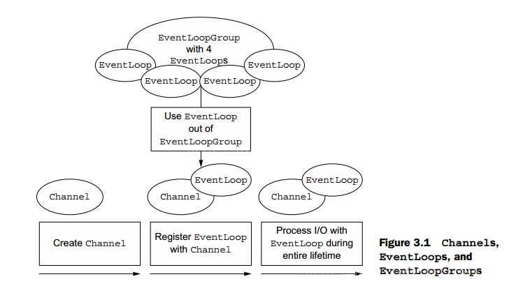

   ​	

   这些关系是：

   - 一个 EventLoopGroup 包含一个或者多个 EventLoop；
   - 一个 EventLoop 在它的生命周期内只和一个 Thread 绑定；
   - 所有由 EventLoop 处理的 I/O 事件都将在它专有的 Thread 上被处理；
   - 一个 Channel 在它的生命周期内只注册于一个 EventLoop；
   - 一个 EventLoop 可能会被分配给一个或多个 Channel。

   注意，在这种设计中，一个给定 Channel 的 I/O 操作都是由相同的 Thread 执行的，实际
   上消除了对于同步的需要

3. ChannelFuture 接口

   Netty 中所有的 I/O 操作都是异步的。因为一个操作可能不会立即返回，所以我们需要一种用于在之后的某个时间点确定其结果的方法。为此，Netty 提供了ChannelFuture 接口，其 addListener()方法注册了一个 ChannelFutureListener，以便在某个操作完成时（无论是否成功）得到通知

## 8.2 ChannelHandler 和 ChannelPipeline

现在，我们将更加细致地看一看那些管理数据流以及执行应用程序处理逻辑的组件

1. ChannelHandler 接口

   从应用程序开发人员的角度来看，Netty 的主要组件是 ChannelHandler，它充当了所有处理入站和出站数据的应用程序逻辑的容器。这是可行的，因为 ChannelHandler 的方法是由网络事件（其中术语“事件”的使用非常广泛）触发的。事实上，ChannelHandler 可专门用于几乎任何类型的动作，例如将数据从一种格式转换为另外一种格式，或者处理转换过程中所抛出的异常。

   > 举例来说，ChannelInboundHandler 是一个你将会经常实现的子接口。这种类型的ChannelHandler 接收入站事件和数据，这些数据随后将会被你的应用程序的业务逻辑所处理。当你要给连接的客户端发送响应时，也可以从 ChannelInboundHandler 冲刷数据。你的应用程序的业务逻辑通常驻留在一个或者多个 ChannelInboundHandler 中。

2. ChannelPipeline 接口

   ChannelPipeline 为 ChannelHandler 链提供了一个容器并定义了用于沿着链传播入站和出站事件流的 API。一个数据或者事件可能会被多个 Handler 处理，在这个过程中，数据或者事件经流 ChannelPipeline，由 ChannelHandler 处理。在这个处理过程中，一个 ChannelHandler 接收数据后处理完成后交给下一个 ChannelHandler，或者什么都不做直接交给下一个 ChannelHandler。

   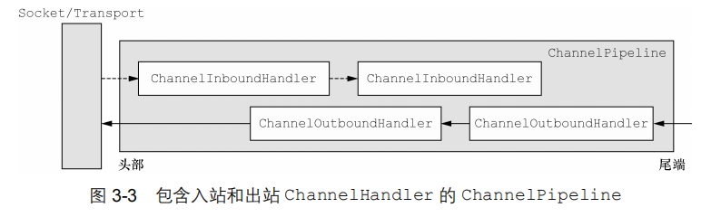

   当一个数据流进入 ChannlePipeline 时，它会从 ChannelPipeline 头部开始传给第一个 ChannelInboundHandler ，当第一个处理完后再传给下一个，一直传递到管道的尾部。与之相对应的是，当数据被写出时，它会从管道的尾部开始，先经过管道尾部的 “最后” 一个ChannelOutboundHandler，当它处理完成后会传递给前一个 ChannelOutboundHandler 。

   > 当 ChannelHandler 被添加到 ChannelPipeline 时，它将会被分配一个 ChannelHandlerContext，它代表了 ChannelHandler 和 ChannelPipeline 之间的绑定。虽然这个对象可以被用于获取底层的 Channel，但是它主要还是被用于写出站数据。

   其中 ChannelHandler 添加到 ChannelPipeline 过程如下：

   - 一个 ChannelInitializer 的实现被注册到了 ServerBootStrap中

   - 当 ChannelInitializer.initChannel() 方法被调用时，ChannelInitializer 将在 ChannelPipeline 中安装一组自定义的 ChannelHandler

   - ChannelInitializer 将它自己从 ChannelPipeline 中移除

# 9. ByteBuf

网络数据的基本单位总是字节。Java NIO 提供了 ByteBuffer 作为它的字节容器，但是这个类使用起来过于复杂，而且也有些繁琐。

Netty 的 ByteBuffer 替代品是 ByteBuf，一个强大的实现，既解决了 JDK API 的局限性，又为网络应用程序的开发者提供了更好的 API。

Netty 的数据处理 API 通过两个组件暴露——abstract class ByteBuf 和 interface 
ByteBufHolder。

下面是一些 ByteBuf API 的**优点**：

- 它可以被用户自定义的缓冲区类型扩展；
- 通过内置的复合缓冲区类型实现了透明的零拷贝；
- 容量可以按需增长（类似于 JDK 的 StringBuilder）；
- 在读和写这两种模式之间切换不需要调用 ByteBuffer 的 flip()方法；
- 读和写使用了不同的索引；
- 支持方法的链式调用；

## 9.1 ByteBuf类---Netty的数据容器

因为所有的网络通信都涉及字节序列的移动，所以高效易用的数据结构明显是必不可少的。Netty 的 ByteBuf 实现满足并超越了这些需求

### 9.1.1 工作过程

ByteBuf 维护了两个不同的**索引**：**一个用于读取，一个用于写入。**当你从 ByteBuf 读取时，它的 readerIndex 将会被递增已经被读取的字节数。同样地，当你写入 ByteBuf 时，它的writerIndex 也会被递增。下图展示了一个空 ByteBuf 的布局结构和状态。

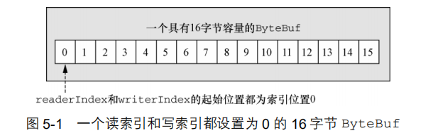

名称以 read 或者 write 开头的 ByteBuf 方法，将会推进其对应的索引，而名称以 set 或者 get 开头的操作则不会。后面的这些方法将在作为一个参数传入的一个相对索引上执行操作。可以指定 ByteBuf 的最大容量。试图移动写索引（即 writerIndex）超过这个值将会触发一个异常。（默认的限制是 Integer.MAX_VALUE。）

### 9.1.2  ByteBuf的使用模式

在使用 Netty 时，你将遇到几种常见的围绕 ByteBuf 而构建的使用模式 

1. 堆缓冲区

   最常用的 ByteBuf 模式是将数据存储在 JVM 的堆空间中。这种模式被称为支撑数组（backing array），它能在没有使用池化的情况下提供快速的分配和释放。这种方式，非常适合于有遗留的数据需要处理的情况

   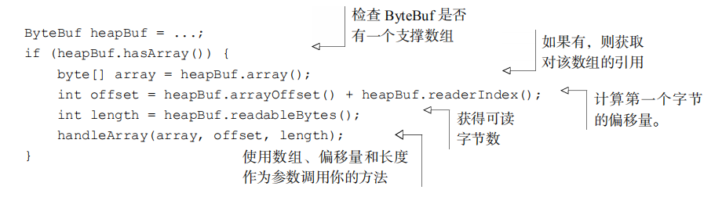

   > 注意：当 hasArray()方法返回 false 时，尝试访问支撑数组将触发一个 Unsupported
   > OperationException。这个模式类似于 JDK 的 ByteBuffer 的用法

2. 直接缓冲区

   直接缓冲区是另外一种 ByteBuf 模式。

   直接缓冲区的主要缺点是，相对于基于堆的缓冲区，它们的分配和释放都较为昂贵。如果你正在处理遗留代码，你也可能会遇到另外一个缺点：因为数据不是在堆上，所以你不得不进行一次复制，如图所示，访问直接缓冲区的数据

   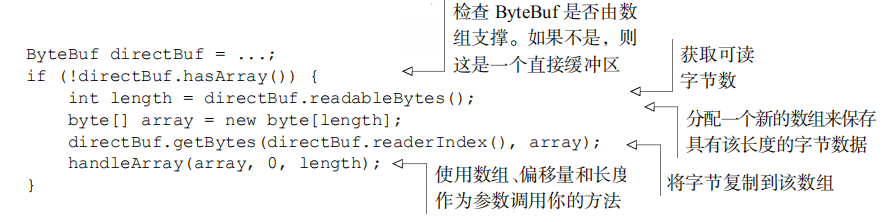

3. 复合缓冲区

   第三种也是最后一种模式使用的是复合缓冲区，它为多个 ByteBuf 提供一个聚合视图。在这里你可以根据需要添加或者删除 ByteBuf 实例，这是一个 JDK 的 ByteBuffer 实现完全缺失的特性

   Netty 通过一个 ByteBuf 子类——CompositeByteBuf——实现了这个模式，它提供了一个将多个缓冲区表示为单个合并缓冲区的虚拟表

   

## 9.2 字节级操作

ByteBuf 提供了许多超出基本读、写操作的方法用于修改它的数据。

1. 随机访问索引

   如同在普通的 Java 字节数组中一样，ByteBuf 的索引是从零开始的：第一个字节的索引是0，最后一个字节的索引总是 capacity() - 1。如图所示，对存储机制的封装使得遍历 ByteBuf 的内容非常简单

   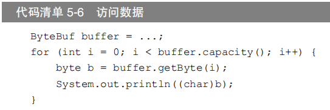

   需要注意的是，使用那些需要一个索引值参数的方法（的其中）之一来访问数据既不会改变readerIndex 也不会改变 writerIndex。如果有需要，也可以通过调用 readerIndex(index)或者 writerIndex(index)来手动移动这两者

2. 顺序访问索引

   虽然 ByteBuf 同时具有读索引和写索引，但是 JDK 的 ByteBuffer 却只有一个索引，这也就是为什么必须调用 flip()方法来在读模式和写模式之间进行切换的原因。图 5-3 展示了ByteBuf 是如何被它的两个索引划分成 3 个区域的。

   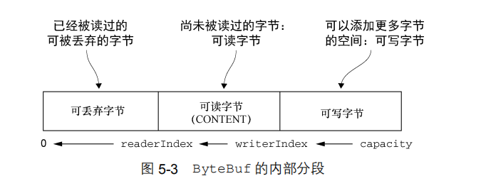

3. 可丢弃字节

   在图 5-3 中标记为可丢弃字节的分段包含了已经被读过的字节。通过调用 discardReadBytes()方法，可以丢弃它们并回收空间。这个分段的初始大小为 0，存储在 readerIndex 中，会随着 read 操作的执行而增加（get*操作不会移动 readerIndex）。

   图 5-4 展示了图 5-3 中所展示的缓冲区上调用discardReadBytes()方法后的结果。可以看
   到，可丢弃字节分段中的空间已经变为可写的了。注意，在调用discardReadBytes()之后，对
   可写分段的内容并没有任何的保证 

   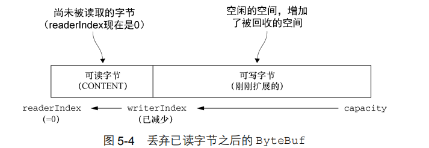

4. 可读字节

   ByteBuf 的可读字节分段存储了实际数据。新分配的、包装的或者复制的缓冲区的默认的readerIndex 值为 0。任何名称以 read 或者 skip 开头的操作都将检索或者跳过位于当前readerIndex 的数据，并且将它增加已读字节数。

   如果被调用的方法需要一个 ByteBuf 参数作为写入的目标，并且没有指定目标索引参数，那么该目标缓冲区的 writerIndex 也将被增加，例如：

   ```java
   readBytes(ByteBuf dest);
   ```

   > 如果尝试在缓冲区的可读字节数已经耗尽时从中读取数据，那么将会引发一个IndexOutOfBoundsException

5. 可写字节

   可写字节分段是指一个拥有未定义内容的、写入就绪的内存区域。新分配的缓冲区的writerIndex 的默认值为 0。任何名称以 write 开头的操作都将从当前的 writerIndex 处开始写数据，并将它增加已经写入的字节数。如果写操作的目标也是 ByteBuf，并且没有指定源索引的值，则源缓冲区的 readerIndex 也同样会被增加相同的大小。这个调用如下所示：

   ```java
   writeBytes(ByteBuf dest);
   ```

   > 如果尝试往目标写入超过目标容量的数据，将会引发一个IndexOutOfBoundException

6. 索引管理

   JDK 的 InputStream 定义了 mark(int readlimit)和 reset()方法，这些方法分别被用来将流中的当前位置标记为指定的值，以及将流重置到该位置

   同样，可以通过调用 markReaderIndex()、markWriterIndex()、resetWriterIndex()和 resetReaderIndex()来标记和重置 ByteBuf 的 readerIndex 和 writerIndex。这些和InputStream 上的调用类似，只是没有 readlimit 参数来指定标记什么时候失效

   可以通过调用 clear()方法来将 readerIndex 和 writerIndex 都设置为 0。注意，这
   并不会清除内存中的内容。

   调用 clear()比调用 discardReadBytes()轻量得多，因为它将只是重置索引而不会复
   制任何的内存。

7. 查找操作

   在ByteBuf中有多种可以用来确定指定值的索引的方法。最简单的是使用indexOf()方法。较复杂的查找可以通过那些需要一个ByteBufProcessor作为参数的方法达成。这个接口只定义了一个方法：

   ```
   boolean process(byte value)
   ```

   它将检查输入值是否是正在查找的值。

8. 派生缓冲区

   派生缓冲区为 ByteBuf 提供了以专门的方式来呈现其内容的视图。这类视图是通过以下方
   法被创建的：

   ```
   duplicate()；
   slice()；
   slice(int, int)；
   Unpooled.unmodifiableBuffer(…)；
   order(ByteOrder)；
   readSlice(int)
   ```

   每个这些方法都将返回一个新的 ByteBuf 实例，它具有自己的读索引、写索引和标记索引。其内部存储和 JDK 的 ByteBuffer 一样也是共享的。这使得派生缓冲区的创建成本是很低廉的，但是这也意味着，如果你修改了它的内容，也同时修改了其对应的源实例，所以要小心

9. 读/写操作

   - get()和 set()操作，从给定的索引开始，并且保持索引不变；

     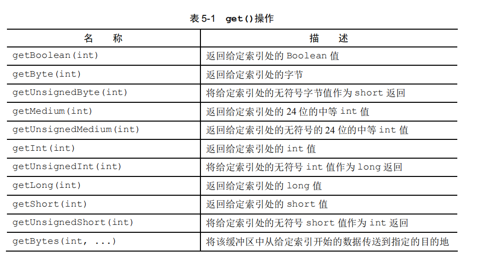

     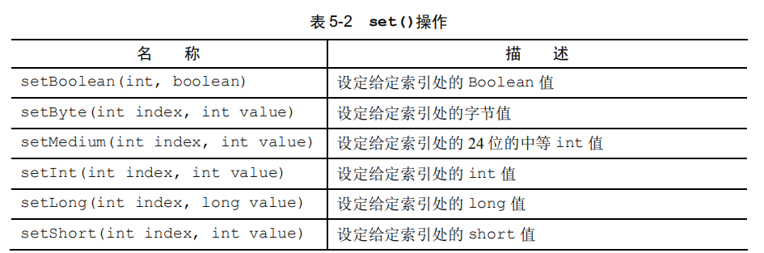

   - read()和 write()操作，从给定的索引开始，并且会根据已经访问过的字节数对索引进行调整。

     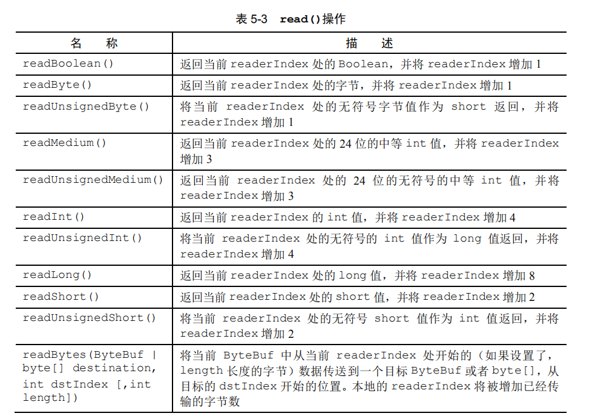

     

## 9.3 ByteBufHolder 接口

我们经常发现，除了实际的数据负载之外，我们还需要存储各种属性值。HTTP 响应便是一个很好的例子，除了表示为字节的内容，还包括状态码、cookie 等。

为了处理这种常见的用例，Netty 提供了 ByteBufHolder。ByteBufHolder 也为 Netty 的高级特性提供了支持，如缓冲区池化，其中可以从池中借用 ByteBuf，并且在需要时自动释放。ByteBufHolder 只有几种用于访问底层数据和引用计数的方法。表 5-6 列出了它们（这里不包括它继承自 ReferenceCounted 的那些方法）。

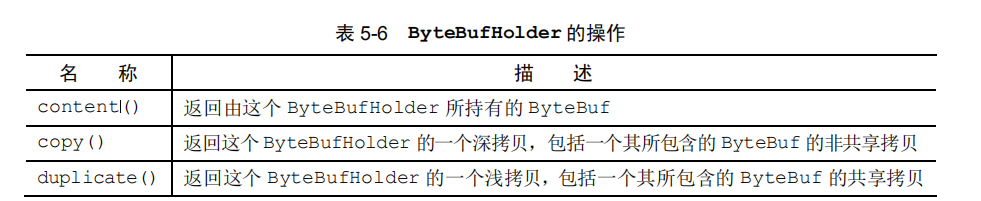

如果想要实现一个将其有效负载存储在 ByteBuf 中的消息对象，那么 ByteBufHolder 将是个不错的选择。

## 9.4 引用计数

引用计数是一种通过在某个对象所持有的资源不再被其他对象引用时释放该对象所持有的资源来优化内存使用和性能的技术。Netty 在第 4 版中为 ByteBuf 和 ByteBufHolder 引入了引用计数技术，它们都实现了 interface ReferenceCounted

示例：引用计数

```java
Channel channel = ...;
// 从 Channel 获取ByteBufAllocator
ByteBufAllocator allocator = channel.alloc();
....
    
// 从 ByteBufAllocator分配一个 ByteBuf
ByteBuf buffer = allocator.directBuffer();
// 检查引用计数是否为预期的 1 
assert buffer.refCnt() == 1; 
```

示例：释放引用计数的对象

``` java
// 减少到该对象的活动引用。当减少到 0 时，该对象被释放，并且该方法返回 true
ByteBuf buffer = ...;
boolean released = buffer.release();
```

> 试图访问一个已经被释放的引用计数的对象，将会导致一个 IllegalReferenceCountException。

注意，一个特定的（ReferenceCounted 的实现）类，可以用它自己的独特方式来定义它的引用计数规则。例如，我们可以设想一个类，其 release()方法的实现总是将引用计数设为零，而不用关心它的当前值，从而一次性地使所有的活动引用都失效

# 10. Netty 的整体流程

从功能上，流程可以分为服务启动、建立连接、读取数据、业务处理、发送数据、关闭连接以及关闭服务。整体流程如下所示

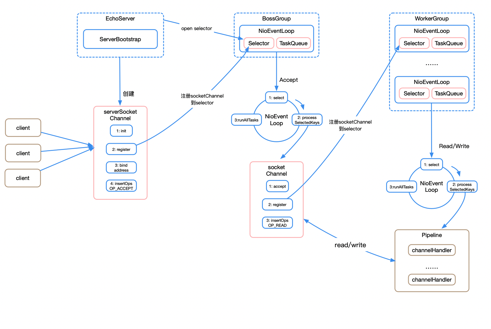

## 10.1 服务端工作原理

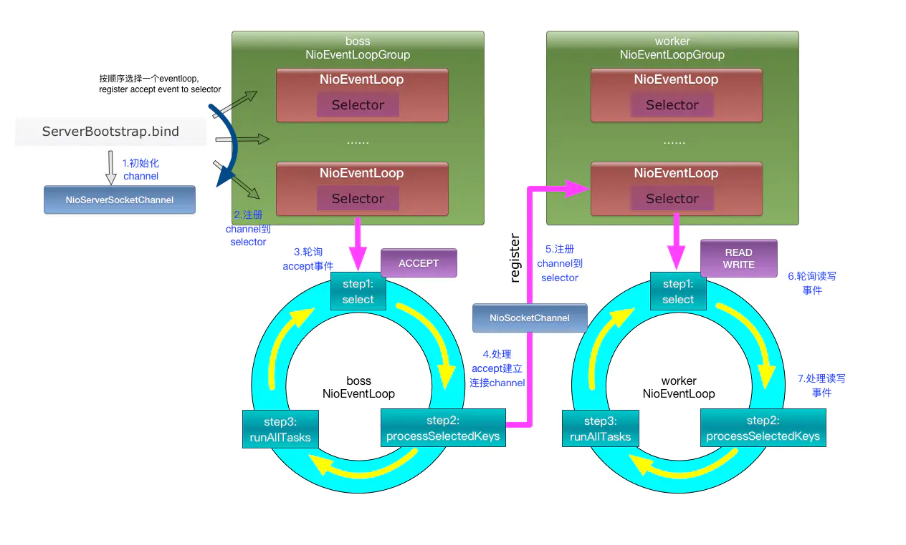

server端启动时绑定本地某个端口，将自己NioServerSocketChannel注册到某个boss NioEventLoop的selector上。
 server端包含1个boss NioEventLoopGroup和1个worker NioEventLoopGroup，NioEventLoopGroup相当于1个事件循环组，这个组里包含多个事件循环NioEventLoop，每个NioEventLoop包含1个selector和1个事件循环线程。
 每个boss NioEventLoop循环执行的任务包含3步：

- 第1步：轮询accept事件；
- 第2步：处理io任务，即accept事件，与client建立连接，生成NioSocketChannel，并将NioSocketChannel注册到某个worker NioEventLoop的selector上；
- 第3步：处理任务队列中的任务，runAllTasks。任务队列中的任务包括用户调用eventloop.execute或schedule执行的任务，或者其它线程提交到该eventloop的任务。

每个worker NioEventLoop循环执行的任务包含3步：

- 第1步：轮询read、write事件；
- 第2步：处理io任务，即read、write事件，在NioSocketChannel可读、可写事件发生时进行处理；
- 第3步：处理任务队列中的任务，runAllTasks。

比较类似于下面的线程池模型，Netty 抽象出两组线程池，BossGroup 专门负责接收客户端连接，WorkerGroup 专门负责网络读写操作。NioEventLoop 表示一个不断循环执行处理任务的线程，每个 NioEventLoop 都有一个 selector，用于监听绑定在其上的 socket 网络通道。NioEventLoop 内部采用串行化设计，从消息的读取->解码->处理->编码->发送，始终由 IO 线程 NioEventLoop 负责。

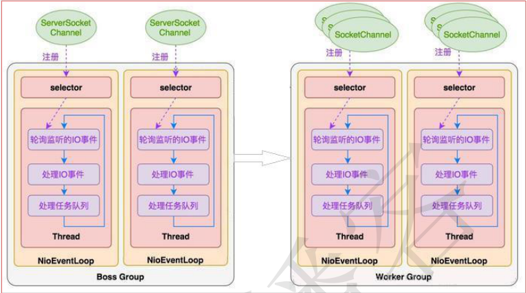

- 一个 NioEventLoopGroup 下包含多个 NioEventLoop
-  每个 NioEventLoop 中包含有一个 Selector，一个 taskQueue
- 每个 NioEventLoop 的 Selector 上可以注册监听多个 NioChannel
- 每个 NioChannel 只会绑定在唯一的 NioEventLoop 上
- 每个 NioChannel 都绑定有一个自己的 ChannelPipeline

## 10.2 client端工作原理

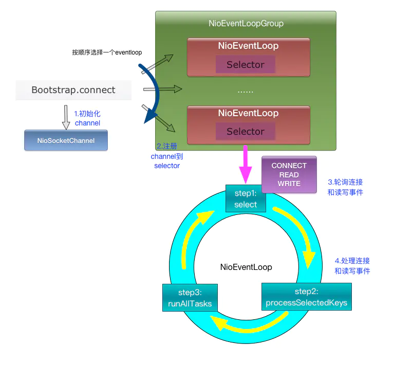

client端启动时connect到server，建立NioSocketChannel，并注册到某个NioEventLoop的selector上。
 client端只包含1个NioEventLoopGroup，每个NioEventLoop循环执行的任务包含3步：

- 第1步：轮询connect、read、write事件；
- 第2步：处理io任务，即connect、read、write事件，在NioSocketChannel连接建立、可读、可写事件发生时进行处理；
- 第3步：处理非io任务，runAllTasks。