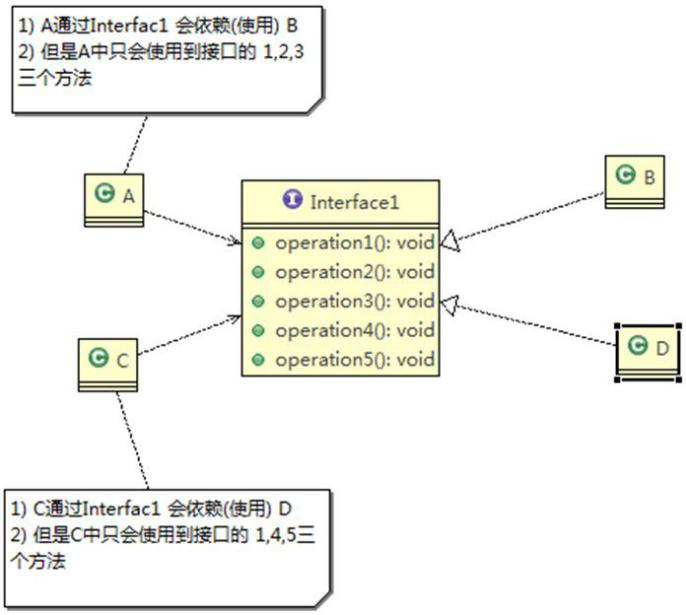
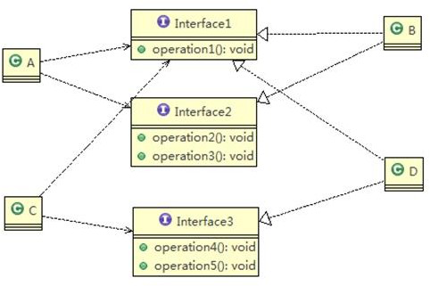
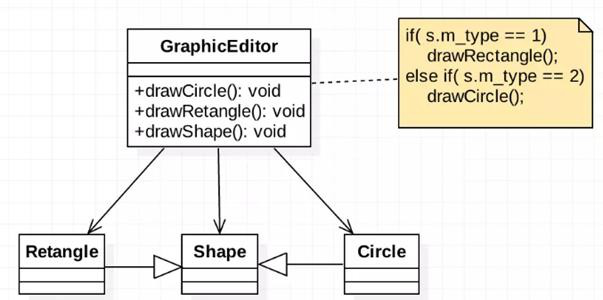
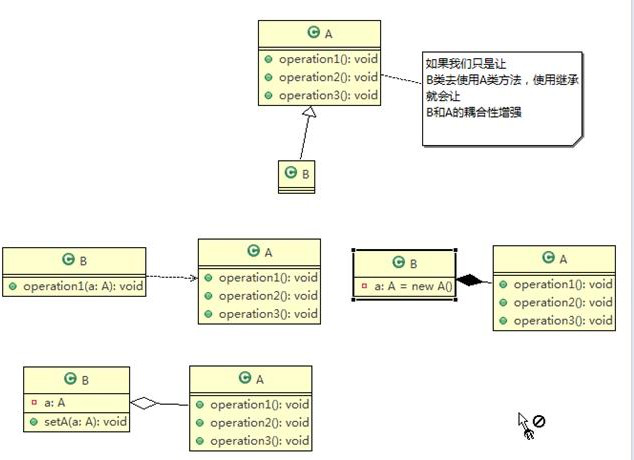

# 1. 设计模式的目的

编写软件过程中，程序员面临着来自 耦合性，内聚性以及可维护性，可扩展性，重用性，灵活性 等多方面的挑战，设计模式是为了让程序(软件)，具有更好

1. 代码重用性 (即：相同功能的代码，不用多次编写)

2. 可读性 (即：编程规范性, 便于其他程序员的阅读和理解)

3. 可扩展性 (即：当需要增加新的功能时，非常的方便，称为可维护)

4. 可靠性 (即：当我们增加新的功能后，对原来的功能没有影响)

5. 使程序呈现高内聚，低耦合的特性

   

设计模式包含了面向对象的精髓，“懂了设计模式，你就懂了面向对象分析和设计（OOA/D）的精要

# 2. 单一职责原则

概述：对类来说的，即一个类应该只负责一项职责。如类A负责两个不同职责：职责1，职责2。当职责1需求变更而改变A时，可能造成职责2执行错误，所以需要将类A的粒度分解为A1，A2

1. 错误示例

   ```java
   public class test {
       public static void main(String[] args) {
           Vehicle vehicle = new Vehicle();
           vehicle.run("飞机");
           vehicle.run("汽车");
           vehicle.run("轮船");
       }
   }
   class Vehicle{
       public void run (String vehicle){
           System.out.println(vehicle+"在公路上运行。。。");
       }
   }
   ```

   分析 ：

   上述案例违反了单一职责原则，原因是Vehicle类负责了多项职责

   解决方案：根据交通工具运行的方法分解为不同的类即可

2. 改进案例

   ```java
   public class test {
       public static void main(String[] args) {
           RoadVehicle roadVehicle = new RoadVehicle();
           roadVehicle.run("汽车");
           
           AirVehicle airVehicle = new AirVehicle();
           airVehicle.run("飞机");
   
           WaterVehicle waterVehicle = new WaterVehicle();
           waterVehicle.run("轮船");
       }
   }
   class RoadVehicle{
       public void run (String vehicle){
           System.out.println(vehicle+"在公路上运行。。。");
       }
   }
   class AirVehicle{
       public void run (String vehicle){
           System.out.println(vehicle+"在天上运行。。。");
       }
   }
   class WaterVehicle{
       public void run (String vehicle){
           System.out.println(vehicle+"在水上运行。。。");
       }
   }
   
   ```

   分析：这样的改进需要的修改较多，需要同时修改客户端

   改进：在方法级别修改为遵守单一职责原则

3. 再次改进

   ```java
   public class test {
       public static void main(String[] args) {
           Vehicle vehicle = new Vehicle();
           vehicle.runAir("飞机");
           vehicle.runRoad("汽车");
           vehicle.runWater("轮船");
       }
   }
   class Vehicle{
       public void runRoad (String vehicle){
           System.out.println(vehicle+"在公路上运行。。。");
       }
       public void runAir(String vehicle){
           System.out.println(vehicle+"在天上运行。。。");
       }
       public void runWater (String vehicle){
           System.out.println(vehicle+"在水上运行。。。");
       }
   }
   ```

   

单一职责原则注意事项和细节：

1. 降低类的复杂度，一个类只负责一项职责。
2. 提高类的可读性，可维护性
3. 降低变更引起的风险
4. 通常情况下，我们应当遵守单一职责原则，只有逻辑足够简单，才可以在代码级违反单一职责原则；只有类中方法数量足够少，可以在方法级别保持单一职责原则

# 3. 接口隔离原则

概述：客户端不应该依赖它不需要的接口，即一个类对另一个类的依赖应该建立在最小的接口上，如下图



类 A 通过接口 Interface1 依赖类 B，类 C 通过接口 Interface1 依赖类 D，如果接口 Interface1 对于类 A 和类 C来说不是最小接口，那么类 B 和类 D 必须去实现他们不需要的方法。

按隔离原则应当这样处理：

> 将接口 **Interface1** 拆分为独立的几个接口（这里我们拆分成3个接口），类 A 和类 C 分别与他们需要的接口建立依赖关系。也就是采用接口隔离原则

示例：

1. 没有使用接口隔离原则代码

   ```java
   public class test {
       public static void main(String[] args) {
           A a = new A();
           a.depend1(new B());
           a.depend2(new B());
           a.depend3(new B());
   
           C c = new C();
           c.depend1(new D());
           c.depend2(new D());
           c.depend3(new D());
       }
   }
   interface Interface1{
       void operation1();
       void operation2();
       void operation3();
       void operation4();
       void operation5();
   }
   class B implements Interface1{
   
       @Override
       public void operation1() {
           System.out.println("B 实现了operation1");
       }
   
       @Override
       public void operation2() {
           System.out.println("B 实现了operation2");
       }
   
       @Override
       public void operation3() {
           System.out.println("B 实现了operation3");
       }
   
       @Override
       public void operation4() {
           System.out.println("B 实现了operation4");
       }
   
       @Override
       public void operation5() {
           System.out.println("B 实现了operation5");
       }
   }
   
   class D implements Interface1{
   
       @Override
       public void operation1() {
           System.out.println("D 实现了operation1");
       }
   
       @Override
       public void operation2() {
           System.out.println("D 实现了operation2");
       }
   
       @Override
       public void operation3() {
           System.out.println("D 实现了operation3");
       }
   
       @Override
       public void operation4() {
           System.out.println("D 实现了operation4");
       }
   
       @Override
       public void operation5() {
           System.out.println("D 实现了operation5");
       }
   }
   // A通过接口Interface1 使用B类，但是只用到了123方法
   class A{
       public void depend1(Interface1 i){
           i.operation1();
       }
       public void depend2(Interface1 i){
           i.operation2();
       }
       public void depend3(Interface1 i){
           i.operation3();
       }
   }
   // C通过接口Interface1 使用D类，但是只用到了145方法
   class C{
       public void depend1(Interface1 i){
           i.operation1();
       }
       public void depend2(Interface1 i){
           i.operation4();
       }
       public void depend3(Interface1 i){
           i.operation5();
       }
   }
   ```

   分析：

   - 类 A 通过接口 Interface1 依赖类 B，类 C 通过接口 Interface1 依赖类 D，如果接口 Interface1 对于类 A 和类 C来说不是最小接口，那么类 B 和类 D 必须去实现他们不需要的方法
   - 将接口 Interface1拆分为独立的几个接口，类 A 和类 C 分别与他们需要的接口建立依赖关系。也就是采用接口隔离原则
   - 接口 Interface1 中出现的方法，根据实际情况拆分为三个接口

   

2. 改进案例

   ```java
   public class test {
       public static void main(String[] args) {
           A a = new A();
           a.depend1(new B());
           a.depend2(new B());
           a.depend3(new B());
   
           C c = new C();
           c.depend1(new D());
           c.depend2(new D());
           c.depend3(new D());
       }
   }
   interface Interface1{
       void operation1();
   }
   interface Interface2{
       void operation2();
       void operation3();
   }
   interface Interface3{
       void operation4();
       void operation5();
   }
   class B implements Interface1,Interface2{
   
       @Override
       public void operation1() {
           System.out.println("B 实现了operation1");
       }
   
       @Override
       public void operation2() {
           System.out.println("B 实现了operation2");
       }
   
       @Override
       public void operation3() {
           System.out.println("B 实现了operation3");
       }
   }
   
   class D implements Interface1,Interface3{
   
       @Override
       public void operation1() {
           System.out.println("D 实现了operation1");
       }
   
       @Override
       public void operation4() {
           System.out.println("D 实现了operation4");
       }
   
       @Override
       public void operation5() {
           System.out.println("D 实现了operation5");
       }
   }
   // A通过接口Interface1 使用B类，但是只用到了123方法
   class A{
       public void depend1(Interface1 i){
           i.operation1();
       }
       public void depend2(Interface2 i){
           i.operation2();
       }
       public void depend3(Interface2 i){
           i.operation3();
       }
   }
   // C通过接口Interface1 使用D类，但是只用到了145方法
   class C{
       public void depend1(Interface1 i){
           i.operation1();
       }
       public void depend2(Interface3 i){
           i.operation4();
       }
       public void depend3(Interface3 i){
           i.operation5();
       }
   }
   
   ```

# 4. 依赖倒置原则

依赖倒转原则(Dependence Inversion Principle)是指：

1. 高层模块不应该依赖低层模块，二者都应该依赖其抽象

2. 抽象不应该依赖细节，细节应该依赖抽象

3. 依赖倒转(倒置)的中心思想是面向接口编程

4. 依赖倒转原则是基于这样的设计理念：

   > 相对于细节的多变性，抽象的东西要稳定的多。以抽象为基础搭建的架构比以细节为基础的架构要稳定的多。在 java 中，抽象指的是接口或抽象类，细节就是具体的实现类

5. 使用接口或抽象类的目的是制定好规范，而不涉及任何具体的操作，把展现细节的任务交给他们的实现类去完成

示例：

1. 案例

   ```java
   public class test {
       public static void main(String[] args) {
           Person person = new Person();
           person.receive(new Email());
       }
   }
   class Email{
       public String getInfo(){
           return "电子邮件信息：hello world";
       }
   }
   
   // 完成person接收消息的功能
   // 问题：如果我们获取的对象是 微信，短信等等，则新增类，同时 Perons 也要增加相应的接收方法
   class Person{
       public void receive(Email email){
           System.out.println(email.getInfo());
       }
   }
   ```

   分析：

   > 如果在上述案例中我们需要获取的不仅仅是电子邮件，可能还有微信，短信等，那么就需要新增不同的类，同时person也需要增加响应的接收方法。

   解决思路：

   > 引入一个抽象的接口 IReceiver, 表示接收者, 这样 Person 类与接口 IReceiver 发生依赖
   >
   > 因为 Email, WeiXin 等等属于接收的范围，他们各自实现 IReceiver 接口就 ok,  这样我们就符合依赖倒转原则

2. 改进案例

   ```java
   public class test {
       public static void main(String[] args) {
           Person person = new Person();
           person.receive(new Email());
           person.receive(new WeChat());
       }
   }
   // 定义接口类
   interface IReceive{
       String getInfo();
   }
   // 邮件消息
   class Email implements IReceive{
       @Override
       public String getInfo() {
           return "电子邮件信息：hello world";
       }
   }
   // 增加微信
   class WeChat implements IReceive{
   
       @Override
       public String getInfo() {
           return "微信消息：hello ok";
       }
   }
   class Person{
       public void receive(IReceive receive){
           System.out.println(receive.getInfo());
       }
   }
   ```

依赖关系传递的三种方式

1. 接口传递

   ```java
   public class test {
       public static void main(String[] args) {
           OpenAndClose openAndClose = new OpenAndClose();
           openAndClose.open(new ChangHong());
       }
   }
   // 通过接口传递实现依赖
   interface IOpenAndClose{
       void open(ITV tv);
   }
   interface ITV{
       void play();
   }
   class ChangHong implements ITV{
       @Override
       public void play() {
           System.out.println("长虹电视机，开机");
       }
   }
   class OpenAndClose implements IOpenAndClose{
   
       @Override
       public void open(ITV tv) {
           tv.play();
       }
   }
   ```

   

2. 构造方法传递

   ```java
   public class test {
       public static void main(String[] args) {
           OpenAndClose openAndClose = new OpenAndClose(new ChangHong());
           openAndClose.open();
       }
   }
   // 通过接口传递实现依赖
   interface IOpenAndClose{
       void open();
   }
   interface ITV{
       void play();
   }
   class ChangHong implements ITV{
       @Override
       public void play() {
           System.out.println("长虹电视机，开机");
       }
   }
   class OpenAndClose implements IOpenAndClose{
       public ITV tv;
       // 构造方法
       public OpenAndClose(ITV tv){
           this.tv = tv;
       }
   
       @Override
       public void open() {
           this.tv.play();
       }
   }
   ```

   

3. setter方式传递

   ```java
   public class test {
       public static void main(String[] args) {
           OpenAndClose openAndClose = new OpenAndClose();
           openAndClose.setTv(new ChangHong());
           openAndClose.open();
       }
   }
   // 通过接口传递实现依赖
   interface IOpenAndClose{
       void open();
       void setTv(ITV tv);
   }
   interface ITV{
       void play();
   }
   class ChangHong implements ITV{
       @Override
       public void play() {
           System.out.println("长虹电视机，开机");
       }
   }
   class OpenAndClose implements IOpenAndClose{
       private ITV tv;
   
       @Override
       public void open() {
           this.tv.play();
       }
   
       @Override
       public void setTv(ITV tv) {
           this.tv = tv;
       }
   }
   ```

依赖倒转原则的注意事项和细节

1. 低层模块尽量都要有抽象类或接口，或者两者都有，程序稳定性更好。
2. 变量的声明类型尽量是抽象类或接口，这样我们的变量引用和实际对象间，就存在一个缓冲层，利于程序扩展和优化
3. 继承时遵循里氏替换原则

# 5. 里氏替换原则

 OO（面向对象）中的继承性的思考和说明

1. 继承包含这样一层含义：父类中凡是已经实现好的方法，实际上是在设定规范和契约，虽然它不强制要求所有的子类必须遵循这些契约，但是如果子类对这些已经实现的方法任意修改，就会对整个继承体系造成破坏。
2. 继承在给程序设计带来便利的同时，也带来了弊端。比如使用继承会给程序带来侵入性，程序的可移植性降低， 增加对象间的耦合性，如果一个类被其他的类所继承，则当这个类需要修改时，必须考虑到所有的子类，并且父类修改后，所有涉及到子类的功能都有可能产生故障
3. 问题提出：在编程中，如何正确的使用继承? => 里氏替换原则

里氏替换原则基本概念：

1. 里氏替换原则(Liskov Substitution Principle)在 1988 年，由麻省理工学院的以为姓里的女士提出的。
2. 如果对每个类型为 T1 的对象 o1，都有类型为 T2 的对象 o2，使得以 T1 定义的所有程序 P 在所有的对象 o1 都代换成 o2 时，程序 P 的行为没有发生变化，那么类型 T2 是类型 T1 的子类型。换句话说，所有引用基类的地方必须能透明地使用其子类的对象。
3. 在使用继承时，遵循里氏替换原则，**在子类中尽量不要重写父类的方法**
4. 里氏替换原则告诉我们，继承实际上让两个类耦合性增强了，在适当的情况下，可**以通过聚合，组合，依赖 来解决问题。**

示例：

1. 案例

   ```java
   public class test {
       public static void main(String[] args) {
           A a = new A();
           System.out.println("11-3="+a.func(11,3)); // 11-3=8
           System.out.println("1-8="+a.func(1,8)); // 1-8=-7
   
           B b = new B();
           // 这里本意是求减法
           System.out.println("11-3="+b.func(11,3)); // 11-3=14
           System.out.println("1-8="+b.func(1,8)); // 1-8=9
   
           System.out.printf("11+3+9="+b.func2(11,3)); // 11+3+9=23
       }
   }
   class A{
       // 减法
       public int func(int num1,int num2){
           return num1-num2;
       }
   }
   // B类继承A类
   // 增加新功能
   class B extends A{
       // 可能无意识重写了A类的方法
       @Override
       public int func(int num1, int num2) {
           return num1 + num2;
       }
   
       // 完成两数相加，然后加9求和
       public int func2(int num1,int num2){
           return func(num1,num2)+9;
       }
   }
   ```

   分析：

   - 我们发现原来运行正常的相减功能发生了错误。原因就是类 B 无意中重写了父类的方法，造成原有功能出现错误。在实际编程中，我们常常会通过重写父类的方法完成新的功能，这样写起来虽然简单，但整个继承体系的复用性会比较差。特别是运行多态比较频繁的时候
   - 通用的做法是：原来的父类和子类都继承一个更通俗的基类，原有的继承关系去掉，采用依赖，聚合，组合等关系代替.

2. 改进方案

   ```java
   public class test {
       public static void main(String[] args) {
           A a = new A();
           System.out.println("11-3="+a.func(11,3)); // 11-3=8
           System.out.println("1-8="+a.func(1,8)); // 1-8=-7
   
           B b = new B();
           // 因为 B 类不再继承 A 类，因此调用者，不会再 func1 是求减法
           // 调用完成的功能就会很明确
           System.out.println("11+3="+b.func(11,3));
           System.out.println("1+8="+b.func(1,8));
           System.out.println("11+3+9="+b.func2(11,3));
   
           //使用组合仍然可以使用到 A 类相关方法
           System.out.println("11-3=" + b.func3(11, 3));// 这里本意是求出 11-3
       }
   }
   // 创建一个更加基础的基类
   class Base{
       // 把更加基础的方法和成员写到Base类
   }
   
   class A{
       // 减法
       public int func(int num1,int num2){
           return num1-num2;
       }
   }
   // B类继承Base类
   // 增加新功能
   class B extends Base{
       // 如果B需要使用A类的方法，使用组合关系
       private A a = new A();
   
       // 可能无意识重写了A类的方法
       public int func(int num1, int num2) {
           return num1 + num2;
       }
   
       // 完成两数相加，然后加9求和
       public int func2(int num1,int num2){
           return func(num1,num2)+9;
       }
   
       // 这里我们还想使用原本A类的方法
       public int func3(int num1,int num2){
           return this.a.func(num1,num2);
       }
   }
   ```

# 6. 开闭原则（ocp）

1. 开闭原则（Open Closed Principle）是编程中最基础、最重要的设计原则
2.  一个软件实体如类，模块和函数应该对扩展开放（对提供方），对修改关闭（对使用方）。用抽象构建框架，用实现扩展细节。
3.  当软件需要变化时，尽量通过扩展软件实体的行为来实现变化，而不是通过修改已有的代码来实现变化。
4. 编程中遵循其它原则，以及使用设计模式的目的就是遵循开闭原则。



示例：

1. 案例

   ```java
   public class test {
       public static void main(String[] args) {
           GraphicEditor graphicEditor = new GraphicEditor();
           graphicEditor.drawShape(new Rectangle());
           graphicEditor.drawShape(new Circle());
           graphicEditor.drawShape(new Triangle());
       }
   }
   
   // 用于绘图的类
   class GraphicEditor {
       // 接收shape 对象，根据type，绘制不同的图形
       public void drawShape(Shape s){
           if (s.m_type == 1){
               drawRectangle(s);
           }else if(s.m_type == 2){
               drawCircle(s);
           }else if(s.m_type == 3){
               drawTriangle(s);
           }
       }
   
       private void drawTriangle(Shape s) {
           System.out.println(" 绘制三角形 ");
       }
   
       private void drawCircle(Shape s) {
           System.out.println(" 绘制圆形 ");
       }
   
       private void drawRectangle(Shape s) {
           System.out.println(" 绘制矩形 ");
       }
   }
   class Shape{
       int m_type;
   }
   
   // 画矩形
   class Rectangle extends Shape{
       public Rectangle(){
           super.m_type = 1;
       }
   }
   // 画圆形
   class Circle extends Shape {
       public Circle() {
           super.m_type = 2;
       }
   }
   //新增画三角形
   class Triangle extends Shape {
       public Triangle() {
           super.m_type = 3;
       }
   }
   ```

   分析优缺点：

   - 优点是比较好理解，简单易操作。
   - 缺点是违反了设计模式的 ocp 原则，即对扩展开放(提供方)，对修改关闭(使用方)。即当我们给类增加新功能的时候，尽量不修改代码，或者尽可能少修改代码.
   - 比如我们这时要新增加一个图形种类 三角形，我们需要做很多修改

   改进思路：

   > 把创建Shape类做成抽象类，并提供一个抽象的draw 方法，让子类去实现即可，这样我们有新的图形种类时，只需要让新的图形类继承 Shape，并实现 draw 方法即可，使用方的代码就不需要修改，满足了开闭原则

2. 改进案例

   ```java
   public class test {
       public static void main(String[] args) {
           GraphicEditor graphicEditor = new GraphicEditor();
           graphicEditor.drawShape(new Rectangle());
           graphicEditor.drawShape(new Circle());
           graphicEditor.drawShape(new Triangle());
           graphicEditor.drawShape(new OtherGraphic());
       }
   }
   
   // 用于绘图的类
   class GraphicEditor {
       // 接收shape 对象，根据type，绘制不同的图形
       public void drawShape(Shape s) {
           s.draw();
       }
   }
   // Shape 类，基类
   abstract class Shape{
       int m_type;
   
       public abstract void draw();
   }
   
   // 画矩形
   class Rectangle extends Shape{
       public Rectangle(){
           super.m_type = 1;
       }
   
       @Override
       public void draw() {
           System.out.println(" 绘制矩形 ");
       }
   }
   // 画圆形
   class Circle extends Shape {
       public Circle() {
           super.m_type = 2;
       }
       @Override
       public void draw() {
           System.out.println(" 绘制圆形  ");
       }
   }
   //新增画三角形
   class Triangle extends Shape {
       public Triangle() {
           super.m_type = 3;
       }
       @Override
       public void draw() {
           System.out.println(" 绘制三角形  ");
       }
   }
   
   // 新增其他图形
   class OtherGraphic extends Shape{
       public OtherGraphic(){
           super.m_type = 4;
       }
   
       @Override
       public void draw() {
           System.out.println("绘制其他图形");
       }
   }
   ```

   

# 7. 迪米特法则

概念：

1. 一个对象应该对其他对象保持最少的了解
2. 类与类关系越密切，耦合度越大
3. 迪米特法则(Demeter Principle)又叫最少知道原则，即一个类对自己依赖的类知道的越少越好。也就是说，对于被依赖的类不管多么复杂，都尽量将逻辑封装在类的内部。对外除了提供的 public 方法，不对外泄露任何信息
4. 迪米特法则还有个更简单的定义：只与直接的朋友通信
5. 直接的朋友：每个对象都会与其他对象有耦合关系，只要两个对象之间有耦合关系，我们就说这两个对象之间是朋友关系。耦合的方式很多，依赖，关联，组合，聚合等。其中，我们称出现成员变量，方法参数，方法返回值中的类为直接的朋友，而出现在局部变量中的类不是直接的朋友。也就是说，陌生的类最好不要以局部变量的形式出现在类的内部。

示例：

有一个学校，下属有各个学院和总部，现要求打印出学校总部员工 ID 和学院员工的 id

1. 案例

   ```java
   public class test {
       public static void main(String[] args) {
           //创建了一个 SchoolManager 对象
           SchoolManager schoolManager = new SchoolManager();
           //输出学院的员工 id 和 学校总部的员工信息
           schoolManager.printAllEmployee(new CollegeManager());
       }
   }
   // 学校总部类
   class Employee{
       private String id;
       public void setId(String id){
           this.id = id;
       }
   
       public String getId() {
           return id;
       }
   }
   // 学院的员工类
   class CollegeEmployee{
       private String id;
       public void setId(String id){
           this.id = id;
       }
   
       public String getId() {
           return id;
       }
   }
   
   //管理学院员工的管理类
   class CollegeManager{
       //返回学院的所有员工
       public List<CollegeEmployee> getAllEmployee() {
           List<CollegeEmployee> list = new ArrayList<CollegeEmployee>();
           for (int i = 0; i < 10; i++) { //这里我们增加了 10 个员工到 list
               CollegeEmployee emp = new CollegeEmployee();
               emp.setId("学院员工 id= " + i);
               list.add(emp);
           }
           return list;
       }
   }
   //分析 SchoolManager 类的直接朋友类有哪些 Employee、CollegeManager
   //CollegeEmployee 不是 直接朋友 而是一个陌生类，这样违背了 迪米特法则
   // 学校管理类
   class SchoolManager{
       //返回学校总部的员工
       public List<Employee> getAllEmployee() {
           List<Employee> list = new ArrayList<>();
   
           //这里我们增加了 5 个员工到 list
           for (int i = 0; i < 5; i++) {
               Employee emp = new Employee();
               emp.setId("学校总部员工 id= " + i);
               list.add(emp);
           }
           return list;
       }
       
       //输出学校总部和学院员工信息(id)
       public void printAllEmployee(CollegeManager sub){
           /**
            * 分析问题
            * 1. 这里的CollegeEmployee不是SchoolManager 的直接朋友
            * 2. CollegeEmployee是以局部变量方式出现在SchoolManager
            * 3. 违反了迪米特法则
            */
   
           //获取到学院员工
           List<CollegeEmployee> list1 = sub.getAllEmployee();
           System.out.println("------------学院员工------------");
           for (CollegeEmployee e : list1) {
               System.out.println(e.getId());
           }
           //获取到学校总部员工
           List<Employee> list2 = this.getAllEmployee();
           System.out.println("------------学校总部员工------------");
           for (Employee e : list2) {
               System.out.println(e.getId());
           }
       }
   }
   ```

2. 改进案例

   分析：

   - 前面设计的问题在于SchoolManager中，CollegeEmployee 类并不是SchoolManager类的直接朋友 

   - 按照迪米特法则，应该避免类中出现这样非直接朋友关系的耦合

   ```java
   public class test {
       public static void main(String[] args) {
           //创建了一个 SchoolManager 对象
           SchoolManager schoolManager = new SchoolManager();
           //输出学院的员工 id 和 学校总部的员工信息
           schoolManager.printAllEmployee(new CollegeManager());
       }
   }
   // 学校总部类
   class Employee{
       private String id;
       public void setId(String id){
           this.id = id;
       }
   
       public String getId() {
           return id;
       }
   }
   // 学院的员工类
   class CollegeEmployee{
       private String id;
       public void setId(String id){
           this.id = id;
       }
   
       public String getId() {
           return id;
       }
   }
   //管理学院员工的管理类
   class CollegeManager{
       //返回学院的所有员工
       public List<CollegeEmployee> getAllEmployee() {
           List<CollegeEmployee> list = new ArrayList<CollegeEmployee>();
           for (int i = 0; i < 10; i++) { //这里我们增加了 10 个员工到 list
               CollegeEmployee emp = new CollegeEmployee();
               emp.setId("学院员工 id= " + i);
               list.add(emp);
           }
           return list;
       }
       //输出学校总部和学院员工信息(id)
       public void printAllEmployee(){
           //获取到学院员工
           List<CollegeEmployee> list1 = this.getAllEmployee();
           System.out.println("------------学院员工------------");
           for (CollegeEmployee e : list1) {
               System.out.println(e.getId());
           }
       }
   }
   
   // 学校管理类
   class SchoolManager {
       //返回学校总部的员工
       public List<Employee> getAllEmployee() {
           List<Employee> list = new ArrayList<>();
   
           //这里我们增加了 5 个员工到 list
           for (int i = 0; i < 5; i++) {
               Employee emp = new Employee();
               emp.setId("学校总部员工 id= " + i);
               list.add(emp);
           }
           return list;
       }
   
       //输出学校总部和学院员工信息(id)
       public void printAllEmployee(CollegeManager sub){
           // 将输出学院的员工方法，封装到 CollegeManager
           // 输出学院员工
           sub.printAllEmployee();
           //获取到学校总部员工
           List<Employee> list2 = this.getAllEmployee();
           System.out.println("------------学校总部员工------------");
           for (Employee e : list2) {
               System.out.println(e.getId());
           }
       }
   }
   ```

迪米特法则注意事项和细节

1. 迪米特法则的核心是降低类之间的耦合
2. 但是注意：由于每个类都减少了不必要的依赖，因此迪米特法则只是要求降低类间（对象间）耦合关系， 并不是要求完全没有依赖关系

# 8. 合成复用原则

概念：原则是尽量使用合成/聚合的方式，而不是使用继承



- 方式1：依赖

  假设B类要使用A类的方法，可以创建一个方法，使用A类作为参数

  ```java
  public class test {
      public static void main(String[] args) {
          B b = new B();
          b.findUser(new A());
      }
  }
  class A{
      public void findUser(){
          System.out.println("恭喜你，找到我了！");
      }
  }
  
  class B{
      public void findUser(A a){
          a.findUser();
      }
  }
  ```

- 方式2：聚合

  ```java
  public class test {
      public static void main(String[] args) {
          B b = new B();
          b.setA(new A());
          b.findUser();
      }
  }
  class A{
      public void findUser(){
          System.out.println("恭喜你，找到我了！");
      }
  }
  
  class B{
      private A a;
  
      public void setA(A a){
          this.a = a;
      }
  
      public void findUser(){
          a.findUser();
      }
  }
  ```

- 方式3：组合

  ```java
  public class test {
      public static void main(String[] args) {
          B b = new B();
          b.findUser();
      }
  }
  class A{
      public void findUser(){
          System.out.println("恭喜你，找到我了！");
      }
  }
  
  class B{
      private A a = new A();
      
      public void findUser(){
          a.findUser();
      }
  }
  ```

  

核心思想：

1. 找出应用中可能需要变化之处，把它们独立出来，不要和那些不需要变化的代码混在一起。
2. 针对接口编程，而不是针对实现编程。
3. 为了交互对象之间的松耦合设计而努力

# 9. 概括7大设计原则

1. 单一职责原则

   一个类只负责一项职责，只有逻辑足够简单，才可以在代码级违反单一职责原则；只有类中方法数量足够少，可以在方法级别保持单一职责原则

2. 接口隔离原则

   假设你要使用一个接口，而这个接口有多个实现类，但是现在我们只需要只用这个接口的部分方法，接口的实现类是需要实现接口的全部的方法，除非，这个实现类是抽象类，所以，我们再使用接口的时候就需要尽量避免去实现不需要实现的接口。

   > 也可以说需要为各个类建立其专用的接口

3. 依赖倒置原则

   尽量使用接口或者抽象类去定制规范，具体的细节交由实现类去实现

   > 依赖关系传递的方式有三种：接口传递，构造传递，setter传递

   要面向接口编程，不要面向实现编程

4. 里氏替换原则

   在子类中尽量避免重写父类中的方法，原来的父类和子类都可以继承一个更通俗的基类，原有的继承关系去掉，采用依赖，聚合，组合等关系代替。

   > 继承必须确保超类（父类）所拥有的性质在子类中仍然成立

5. 开闭原则

   对扩展开放，对修改关闭。用抽象构建框架，用实现扩展细节

6. 迪米特原则

   我们称出现成员变量，方法参数，方法返回值中的类为直接的朋友，而出现在局部变量中的类不是直接的朋友，也就是说，陌生的类最好不要以局部变量的形式出现在类的内部。

   > 简单来说就是：只与你的直接朋友交谈，不跟陌生人说话

7. 合成复用原则

   尽量避免使用继承的方式去使用某一类中的方法，因为使用继承会使得耦合性增大，可以使用依赖，组合，聚合的方式