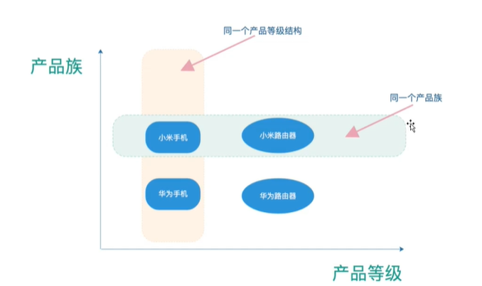
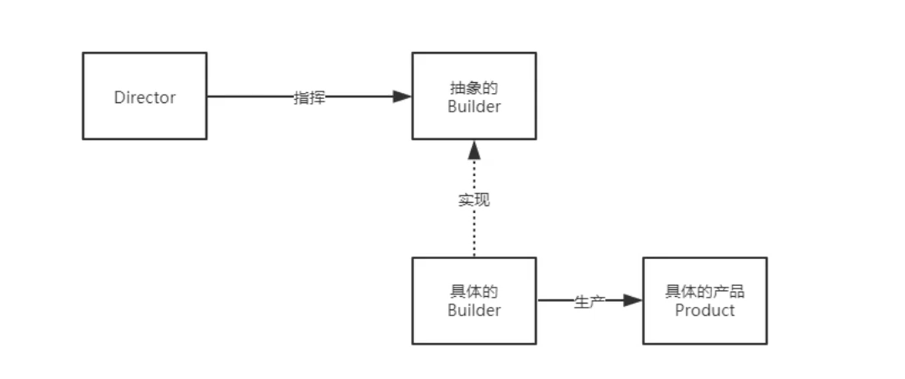

# 1. 设计模式概述

设计模式分为三种类型，共23种

1. 创建型模式：单例模式、抽象工厂模式、原型模式、建造者模式、工厂模式。
2. 结构型模式：适配器模式、桥接模式、装饰模式、组合模式、外观模式、享元模式、代理模式。
3. 行为型模式：模版方法模式、命令模式、访问者模式、迭代器模式、观察者模式、中介者模式、备忘录模式、解释器模式（Interpreter 模式）、状态模式、策略模式、职责链模式(责任链模式)。

参考菜鸟教程：https://www.runoob.com/design-pattern/design-pattern-tutorial.html

# 2. 单列模式

概念：

> 所谓类的单例设计模式，就是**采取一定的方法保证在整个的软件系统中，对某个类只能存在一个对象实例**， 并且该类只提供一个取得其对象实例的方法（静态方法）。
>

比如 Hibernate 的 SessionFactory，它充当数据存储源的代理，并负责创建 Session 对象。SessionFactory 并不是轻量级的，一般情况下，一个项目通常只需要一个 SessionFactory 就够，这是就会使用到单例模式。

**注意：**

- 单例类只能有一个实例。
- 单例类必须自己创建自己的唯一实例。
- 单例类必须给所有其他对象提供这一实例。

作用：保证一个类仅有一个实例，并提供一个访问它的全局访问点。

**主要解决：**一个全局使用的类频繁地创建与销毁。

**何时使用：**当您想控制实例数目，节省系统资源的时候。

**如何解决：**判断系统是否已经有这个单例，如果有则返回，如果没有则创建。

**关键代码：**构造函数是私有的。

**优点：**

- 在内存里只有一个实例，减少了内存的开销，尤其是频繁的创建和销毁实例（比如管理学院首页页面缓存）。
- 避免对资源的多重占用（比如写文件操作）。

**缺点：**没有接口，不能继承，与单一职责原则冲突，一个类应该只关心内部逻辑，而不关心外面怎么样来实例化。

**使用场景：**

- 要求生产唯一序列号。
- WEB 中的计数器，不用每次刷新都在数据库里加一次，用单例先缓存起来。
- 创建的一个对象需要消耗的资源过多，比如 I/O 与数据库的连接等。

## 2.1 饿汉式

示例代码：

```java
public class Singleton {
    // 1. 构造器私有化，使得外部无法通过new创建此对象
    private Singleton() {
    }
    
    // 2. 本类内部创建对象实例
    private final static Singleton instance = new Singleton();
    
    // 3. 给外部提供一个可以获取实例的方法
    public static Singleton getInstance(){
        return instance;
    }
}

```

优缺点说明：

1. 优点：这种写法比较简单，就是在类装载的时候就完成实例化。避免了线程同步问题。
2. 缺点：这种方式会在类装载的时候完成实例化，没有达到懒加载（只有在使用的时候去创建）的效果，可能会造成内存的浪费

## 2.2 懒汉式

示例：

```java
public class Singleton {
    // 1. 创建静态成员变量
    private static Singleton instance;
    
    // 2. 构造器私有化，使得外部无法通过new创建此对象
    private Singleton() {
    }
    
    // 3. 提供一个静态的公有方法，只有使用到这个方法时，才会去创建实例
    public static Singleton getInstance(){
        if (instance == null){
            instance = new Singleton();
        }
        return instance;
    }
    
}
```

优缺点说明：

- 上述方式确实是起到了懒加载效果，但是只能在单线程环境下使用。
- 在多线程环境下，可能会创建多个实例，造成内存浪费

解决：可以在getInstance上添加synchronized 关键字确保线程安全，但同时synchronized 是个重量级操作，加锁会影响效率

## 2.3 双重检查

示例代码

```java
public class Singleton {
    // 1. 创建静态成员变量
    // 添加volatile关键字防止指令重排序
    private volatile static Singleton instance;

    // 2. 构造器私有化，使得外部无法通过new创建此对象
    private Singleton() {
    }

    // 3. 提供一个静态的公有方法，加入双重检查代码，解决线程安全问题, 同时解决懒加载问题
    // 同时也保证了效率, 推荐使用，也称为DCL懒汉式
    public static Singleton getInstance(){
        /**
         * 分析：
         *  为了防止获取锁之前就被两个线程拿到，需要进行两次判断，
         *  这里需要注意需要确保锁住的对象有 volatile 关键字，用于防止指令重排序
         */
        if (instance == null){ // 检测1
            synchronized (Singleton.class){
                if (instance == null){ // 检测2
                    instance = new Singleton(); // 不加volatile 问题： 这不是一个原子性操作
                    //  如果没有volatile 关键字，可能发生如下问题
                    /**
                     * 回顾一下创建对象的三个步骤：
                     *  1. 分配内存空间
                     *  2. 执行构造方法
                     *  3. 把对象指向这个空间
                     */
                }
            }
        }
        return instance;
    }

}

```

优缺点说明：

- 双重检查可以保证多线程开发的安全性。
- 但是我们需要知道，使用反射可以破坏这种单列模式

## 2.4 静态内部类

示例代码：

```java
public class Singleton {
    // 1. 构造器私有化，使得外部无法通过new创建此对象
    private Singleton() {
    }

    // 2. 使用静态内部类，类中有一个静态属性Singleton
    // 原理是使用jvm内存装载机制，保证线程安全性
    private static class SingletonInstance{
        private static final Singleton INGLETON = new Singleton();
    }

    // 3. 提供一个静态的公有方法，返回实例对象
    public static Singleton getInstance(){
        return SingletonInstance.INGLETON;
    }
}
```

优缺点分析：

- 这种方式采用了类装载的机制来保证初始化实例时只有一个线程。
- 静态内部类方式在 Singleton 类被装载时并不会立即实例化，在调用 getInstance 方法时装载 SingletonInstance 静态内部类，从而完成 Singleton 的实例化。
- 避免了线程不安全，利用静态内部类特点实现延迟加载，效率高

## 2.5 枚举

示例：

```java
public enum Singleton {
    INGSTANCE; // 属性

    public Singleton getIngstance(){
        return INGSTANCE;
    }
}
```

优缺点说明：

- 这借助 JDK1.5 中添加的枚举来实现单例模式。不仅能避免多线程同步问题，而且还能防止反序列化重新创建新的对象。
- 强烈推荐使用，因为使用枚举获取示例对象是反射无法被破坏的

# 3. 工厂模式

概念：工厂模式（Factory Pattern）是 Java 中最常用的设计模式之一。这种类型的设计模式属于创建型模式，它提供了一种创建对象的最佳方式。

> 在工厂模式中，我们在创建对象时不会对客户端暴露创建逻辑，并且是通过使用一个共同的接口来指向新创建的对象。

**意图：**定义一个创建对象的接口，让其子类自己决定实例化哪一个工厂类，工厂模式使其创建过程延迟到子类进行。

**主要解决：**主要解决接口选择的问题。

**何时使用：**我们明确地计划不同条件下创建不同实例时。

**如何解决：**让其子类实现工厂接口，返回的也是一个抽象的产品。

**关键代码：**创建过程在其子类执行。

**优点：** 	

1. 一个调用者想创建一个对象，只要知道其名称就可以了。 
2. 扩展性高，如果想增加一个产品，只要扩展一个工厂类就可以。 
3. 屏蔽产品的具体实现，调用者只关心产品的接口。

**缺点：**

1. 每次增加一个产品时，都需要增加一个具体类和对象实现工厂，使得系统中类的个数成倍增加，在一定程度上增加了系统的复杂度，同时也增加了系统具体类的依赖。这并不是什么好事。

作用：

- 实现了创建者和调用者分离

- 详细分类

  - 简单工厂模式（静态工厂模式）

    用来生产同一等级结构中的任意产品（对于新增加的产品，需要修改已有代码）

    > 虽然某种程度上不符合设计原则，但实际使用比较多

  - 工厂方法模式

    用来生产同一结构中的固定产品（支持增加任意产品）

    > 不修改已有类的前提下，通过增加新的工厂类实现扩展


应用场景：

- JDK中Calendar的getInstance方法
- JDBC中的Connection对象的获取
- Spring中IOC容器创建与管理bean对象
- 反射中Class对象的new Instance方法

核心本质：

- 实例化对象不使用new，用工厂方法代替
- 将选择实现类，创建对象统一管理和控制。从而将调用者和实现类解耦

工厂模式需要满足oop七大原则中的如下：

- 开闭原则

  对扩展开放，对修改关闭。用抽象构建框架，用实现扩展细节

- 迪米特原则

  我们称出现成员变量，方法参数，方法返回值中的类为直接的朋友，而出现在局部变量中的类不是直接的朋友，也就是说，陌生的类最好不要以局部变量的形式出现在类的内部。

  > 简单来说就是：只与你的直接朋友交谈，不跟陌生人说话

- 依赖倒转原则

  针对接口编程，不要针对实现编程

## 3.1 简单工厂模式

简单工厂模式也称为静态工厂模式

1. 初始代码

   - 创建一个接口

     汽车接口

     ```java
     interface Car {
         void getName();
     }
     ```

   - 创建实现接口的实现类

     五菱汽车

     ```java
     public class WuLing implements Car {
         @Override
         public void getName() {
             System.out.println("五菱");
         }
     }
     ```

     特斯拉汽车

     ```java
     public class Tesla implements Car{
         @Override
         public void getName() {
             System.out.println("特斯拉");
         }
     }
     ```

   - 测试

     ```java
     public class Test {
         public static void main(String[] args) {
             Car wuling = new WuLing();
             Car tesla = new Tesla();
     
             wuling.getName();
             tesla.getName();
         }
     }
     ```


   分析：

   每次我们都需要new一个对象，如果涉及到很多类似的操作，对开发而言是极为不便的

2. 改进代码

   改进点：创建一个汽车工厂，所有的创建操作交给工厂去执行

   ```java
   public class SimpleFactory {
       // 方式一：统一判断管理
       public static Car getCar(String name){
           if (name.equals("五菱")){
               return new WuLing();
           }else if(name.equals("特斯拉")){
               return new Tesla();
           }else{
               return null;
           }
       }
   
       // 方式2:分开管理
       public static Tesla getTesla(){
           return new Tesla();
       }
       public static WuLing getWuLing(){
           return new WuLing();
       }
   }
   ```

   测试：

   ```java
   public class Test {
       public static void main(String[] args) {
           // 使用方式1
           Car car = SimpleFactory.getCar("特斯拉");
           car.getName();
   
           // 使用方式2:
           WuLing wuLing = SimpleFactory.getWuLing();
           wuLing.getName();
       }
   }
   ```

   分析：

   - 这样的方式不满足开闭原则（即对扩展开放，对修改关闭）
   - 不修改代码无法做到，新增新产品

## 3.2  工厂方法模式

示例代码：

汽车接口

```java
interface Car {
    void getName();
}
```

汽车工厂

```java
public interface CarFactory {
    Car getCar();
}
```

五菱汽车

```java
public class WuLing implements Car {
    @Override
    public void getName() {
        System.out.println("五菱");
    }
}
```

五菱汽车工厂

```java
public class WulingFactory implements CarFactory{
    @Override
    public Car getCar() {
        return new WuLing();
    }
}
```

特斯拉汽车

```java
public class Tesla implements Car{
    @Override
    public void getName() {
        System.out.println("特斯拉");
    }
}
```

特斯拉工厂

```java
public class TeslaFactory implements CarFactory{
    @Override
    public Car getCar() {
        return new Tesla();
    }
}
```

分析：

- 可以发现，使用工厂方法模式实现了开闭原则。每个扩展类只需要实现car接口和carFactory工厂即可
- 问题是，使用工厂方法模式，可能会需要创建很多类
- 具体使用需要看实际需求，简单工厂相比而言更加简单些

# 4. 抽象工厂模式

抽象工厂模式（Abstract Factory Pattern）是围绕一个超级工厂创建其他工厂。该超级工厂又称为其他工厂的工厂。这种类型的设计模式属于创建型模式，它提供了一种创建对象的最佳方式。

在抽象工厂模式中，接口是负责创建一个相关对象的工厂，不需要显式指定它们的类。每个生成的工厂都能按照工厂模式提供对象。

**概念：**提供一个创建一系列相关或相互依赖对象的接口，而无需指定它们具体的类。

**主要解决：**主要解决接口选择的问题。

**何时使用：**系统的产品有多于一个的产品族，而系统只消费其中某一族的产品。

**如何解决：**在一个产品族里面，定义多个产品。

**关键代码：**在一个工厂里聚合多个同类产品。

适用场景：

- 客户端（应用层）不依赖于产品类实例如何被创建、实现等细节
- 强调一系列相关的产品对象（属于同一产品族）一起使用创建对象需要大量的重复代码
- 提供一个产品类的库，所有的产品以同样的接口出现，从而使得客户端不依赖于具体的实现

优点：

- 具体的产品在应用层的代码隔离，无需关心创建的细节
- 将一个系列的产品统一到一起创建

缺点：

- 规定了所有可能被创建的产品集合，产品簇中扩展新的产品困难
- 增加了系统的抽象性和理解难度



实例代码：

1. 创建产品接口

   - 手机类

     ```java
     public interface IPhoneProduct {
         void start();
         void shutdown();
     }
     ```

   - 路由器类

     ```java
     public interface IRouterProduct {
         void start();
         void shutdown();
     }
     ```

2. 创建产品实现类，实现接口

   - 手机产品实现

     ```java
     public class XiaomiPhone implements IPhoneProduct {
         @Override
         public void start() {
             System.out.println("小米手机开机");
         }
     
         @Override
         public void shutdown() {
             System.out.println("小米手机关机");
         }
     }
     ```

     ```java
     public class HuaweiPhone implements IPhoneProduct {
         @Override
         public void start() {
             System.out.println("华为手机开机");
         }
     
         @Override
         public void shutdown() {
             System.out.println("华为手机关机");
         }
     }
     ```

   - 路由器产品实现

     ```java
     public class XiaomiRouter implements IRouterProduct{
         @Override
         public void start() {
             System.out.println("小米路由器开机");
         }
     
         @Override
         public void shutdown() {
             System.out.println("小米路由器关机");
         }
     }
     ```

     ```java
     public class HuaweiRouter implements IRouterProduct{
         @Override
         public void start() {
             System.out.println("华为路由器开机");
         }
     
         @Override
         public void shutdown() {
             System.out.println("华为路由器关机");
         }
     }
     ```

3. 创建抽象的工厂类，实现产品的生产

   ```java
   // 抽象工厂用于生产设备
   public interface IProductFactory {
       // 生产手机
       IPhoneProduct phoneProduct();
       // 生产路由器
       IRouterProduct routerProduct();
   }
   ```

4. 创建工厂的具体实现类，生产具体的产品

   - 小米产品

     ```java
     public class XiaomiFactory implements IProductFactory{
         @Override
         public IPhoneProduct phoneProduct() {
             return new XiaomiPhone();
         }
     
         @Override
         public IRouterProduct routerProduct() {
             return new XiaomiRouter();
         }
     }
     ```

   - 华为产品

     ```java
     public class HuaweiFactory implements IProductFactory{
         @Override
         public IPhoneProduct phoneProduct() {
             return new HuaweiPhone();
         }
     
         @Override
         public IRouterProduct routerProduct() {
             return new HuaweiRouter();
         }
     }
     ```

5. 测试

   ```java
   public class test {
       public static void main(String[] args) {
           IPhoneProduct huawei = new HuaweiFactory().phoneProduct();
           huawei.start();
           huawei.shutdown();
   
           IPhoneProduct xiaomi = new XiaomiFactory().phoneProduct();
           xiaomi.start();
           xiaomi.shutdown();
   
           IRouterProduct xiaomiRouter = new XiaomiFactory().routerProduct();
           xiaomiRouter.start();
           xiaomiRouter.shutdown();
       }
   }
   ```

   

# 5. 建造者模式

建造者模式（Builder Pattern）使用多个简单的对象一步一步构建成一个复杂的对象。建造者模式也属于创建型模式，它提供了一种创建对象的最佳方式

定义：将一个复杂对象的构建与它的表示分离，使得同样的构建过程可以创建不同的表示

主要作用：在用户不知道对象的建造过程和细节的情况下就可以直接创建复杂的对象

> 用户只需要给出指定复杂对象的类型和内容，建造者模式负责按顺序创建复杂对象（把内部建造过程和细节隐藏起来）

**关键代码：**建造者：创建和提供实例，导演：管理建造出来的实例的依赖关系。

举例：

- 工厂（建造者模式）：负责制造汽车（组装过程和细节在工厂内）
- 汽车购买者（用户）：你只需要说出你需要的型号（对象类型和内容，然后直接购买就可以使用了（不需要知道汽车是如何组装的）



文字说明：

如果需要建造一座房子

1. 首先需要找一个建筑公司或者承包商（指挥者）
2. 然后承包商指挥工人（具体的建造者）过来建造产品，最后验收

优缺点：

- 优点
  - 产品的建造和表示分离，实现了解耦。使用建造者模式可以使客户端不必知道产品内部组成的细节。
  - 将复 杂产品的创建步骤分解在不同的方法中，使得创建过程更加清晰
  - 具体的建造者类之间是相互独立的，这有利于系统的扩展。增加新的具体建造者无需修改原有类库的代码，符合“开闭原则"
- 缺点:
  - 建造者模式所创建的产品一般具有较多的共同点，其组成部分相似；如果产品之间的差异性很大，则不适合使用建造者模式，因此其使用范围受到一定的限制。
  - 如果产品的内部变化复杂，可能会导致需要定义很多具体建造者类来实现这种变化，导致系统变得很庞大。

应用场景: .

- 需要生成的产品对象有复杂的内部结构,这些产品对象具备共性;
- 隔离复杂对象的创建和使用，并使得相同的创建过程可以创建不同的产品。
- 适合于一个具有较多的零件(属性)的产品(对象)的创建过程。

建造者与抽象工厂模式的比较:

- 与抽象工厂 模式相比，建造者模式返回一个组装好的完整产品，而抽象工厂模式返回一系列相关的产品，这些产品位于不同的产品等级结构,构成了一个产品族。
- 在抽象工厂模式中，客户端实例化工厂类,然后调用工厂方法获取所需产品对象，而在建造者模式中，客户端可以不直接调用建造者的相关方法，而是通过指挥者类来指导如何生成对象，包括对象的组装过程和建造步骤,它侧重于一步步构造一 个复杂对象， 返回一个完整的对象。
- 如果将抽象工厂模式看成汽车配件生产工厂，生产个产品族的产品，那么建造者模式就是一个汽车组装工厂，通过对部件的组装可以返回一辆完整的汽车！

> 与工厂模式的区别是：建造者模式更加关注与零件装配的顺序。

示例代码1：

1. 构建抽象类，创建建造方法，所有的工人需要根据建造方法去干具体的活

   > 定义生成实例所需要的所有方法；

   ```java
   // 构建一个抽象的建造方法，所有的工人根据方法去干活
   public abstract class Builder {
       abstract void builderA();
       abstract void builderB();
       abstract void builderC();
       abstract void builderD();
   
       // 完工，得到产品
       abstract Product getProduct();
   }
   ```

2. 创建产品类

   ```java
   // 具体的产品：根据抽象规范所制作出来的产品
   public class Product {
       private String buildA;
       private String buildB;
       private String buildC;
       private String buildD;
   	
       // 省略getter、setter和toString方法
   }
   ```

3. 创建工人，需要根据规范去实现产品

   > 实现生成实例所需要的所有方法，并且定义获取最终生成实例的方法；

   ```java
   // 具体的建造者：工人
   public class Worker extends Builder {
       private Product product;
   
       public Worker(){
           // 注意：这里是由工人创建产品
           product = new Product();
       }
   
       @Override
       void builderA() {
           product.setBuildA("设计图纸");
           System.out.println("设计图纸");
       }
   
       @Override
       void builderB() {
           product.setBuildB("建造地基");
           System.out.println("建造地基");
       }
   
       @Override
       void builderC() {
           product.setBuildC("建造主体");
           System.out.println("建造主体");
       }
   
       @Override
       void builderD() {
           product.setBuildD("完结撒花");
           System.out.println("完结撒花");
       }
   
       @Override
       Product getProduct() {
           return product;
       }
   }
   ```

4. 创建管理类（承包商/监工）

   > 定义使用建造者角色中的方法来生成实例的方法

   ```java
   // 指挥者，核心。负责指挥构建一个工程，具体如何构建，由此决定
   public class Director {
       public Product build(Builder builder){
           builder.builderA();
           builder.builderB();
           builder.builderC();
           builder.builderD();
   
           return builder.getProduct();
       }
   }
   ```

5. 测试

   ```java
   public class Test {
       public static void main(String[] args) {
           // 创建指挥者
           Director director = new Director();
           // 指挥者指挥工人去实现具体的产品，最终将成品返回
           Product product = director.build(new Worker());
           System.out.println(product);
   
       }
   }
   ```


案例说明：

上面的示例Builder模式的常规用法，导演类Director在Builder模式中具有很重要的作用，它用于指导具体构建者如何构建产品，控制调用先后次序，并向调用者返回完整的产品类，但在有些情况下需要简化系统结构，可以把Director和抽象建造者进行结合

示例代码2：

1. 创建建造者

   ```java
   // 建造者
   public abstract class Builder {
       abstract Builder buildA(String msg);
       abstract Builder buildB(String msg);
       abstract Builder buildC(String msg);
       abstract Builder buildD(String msg);
   
       // 返回生产好的对象
       abstract Product getProduct();
   }
   ```

2. 创建产品

   ```java
   public class Product{
       private String buildA = "薯条";
       private String buildB = "可乐";
       private String buildC = "汉堡";
       private String buildD = "鸡肉卷";
       // 省略getter、setter和toString方法
   }
   ```

3. 创建工人

   ```java
   public class Worker extends Builder {
       private Product product;
       public Worker(){
           this.product = new Product();
       }
   
       @Override
       Builder buildA(String msg) {
           product.setBuildA(msg);
           return this;
       }
   
       @Override
       Builder buildB(String msg) {
           product.setBuildB(msg);
           return this;
       }
   
       @Override
       Builder buildC(String msg) {
           product.setBuildC(msg);
           return this;
       }
   
       @Override
       Builder buildD(String msg) {
           product.setBuildD(msg);
           return this;
       }
   
       @Override
       Product getProduct() {
           return product;
       }
   }
   ```

4. 测试

   ```java
   public class Test {
       public static void main(String[] args) {
           // 自定义需求，可以链式操作
           Builder builder = new Worker().buildA("汉堡");
           Product product = builder.getProduct();
           System.out.println(product.toString());
   
           // 即便不去自定义需求，也有默认的套餐实现
           Product product1 = new Worker().getProduct();
           System.out.println(product1.toString());
       }
   }
   ```

   

通过静态内部类方式实现零件无序装配构造，这种方式使用更加灵活，更符合定义。内部有复杂对象的默认实现，使用时可以根据用户需求自定义更改内容，并且无需改变具体的构造方式。就可以生产出不同复杂的产品

> 比如：麦当劳的套餐，服务员（具体的建造者）可以随意搭配任意几种产品（套餐）组成一款套餐（产品），然后出售给客户。比第一种方式少了指挥者，主要是因为第二种方式把指挥者交给用户操作，使得产品的创建更加灵活

# 6. 原型模式

原型模式（Prototype Pattern）是**用于创建重复的对象，同时又能保证性能。**这种类型的设计模式属于创建型模式，它提供了一种创建对象的最佳方式。

这种模式是实现了一个原型接口，该接口用于创建当前对象的克隆。当直接创建对象的代价比较大时，则采用这种模式。例如，一个对象需要在一个高代价的数据库操作之后被创建。我们可以缓存该对象，在下一个请求时返回它的克隆，在需要的时候更新数据库，以此来减少数据库调用。

**意图：**用原型实例指定创建对象的种类，并且通过拷贝这些原型创建新的对象。

**主要解决：**在运行期建立和删除原型。

**如何解决：**利用已有的一个原型对象，快速地生成和原型对象一样的实例。

**关键代码：** 

1. 实现克隆操作，在 JAVA 继承 Cloneable，重写 clone()，在 .NET 中可以使用 Object 类的 MemberwiseClone() 方法来实现对象的浅拷贝或通过序列化的方式来实现深拷贝。 
2. 原型模式同样用于隔离类对象的使用者和具体类型（易变类）之间的耦合关系，它同样要求这些"易变类"拥有稳定的接口。

**优点：** 

- 性能提高。
- 逃避构造函数的约束。

**缺点：** 

- 配备克隆方法需要对类的功能进行通盘考虑，这对于全新的类不是很难，但对于已有的类不一定很容易，特别当一个类引用不支持串行化的间接对象，或者引用含有循环结构的时候。
- 必须实现 Cloneable 接口。

**注意事项：**与通过对一个类进行实例化来构造新对象不同的是，原型模式是通过拷贝一个现有对象生成新对象的。浅拷贝实现 Cloneable，重写，深拷贝是通过实现 Serializable 读取二进制流。

补充知识点：

- 浅拷贝：浅拷贝是按位拷贝对象，它会创建一个新对象，这个对象有着原始对象属性值的一份精确拷贝。

  > 如果属性是基本类型，拷贝的就是基本类型的值；如果属性是内存地址（引用类型），拷贝的就是内存地址 ，因此如果其中一个对象改变了这个地址，就会影响到另一个对象。
  >
  > 需要注意的是String虽然是引用类，但实际上是final修饰的字节数组，因此可以无视

  实现方法，实现Cloneable 接口，重写clone方法（下面有示例）

- 深拷贝会拷贝所有的属性。并拷贝属性指向的动态分配的内存。当对象和它所引用的对象一起拷贝时即发生深拷贝。深拷贝相比于浅拷贝速度较慢并且花销较大。

  实现方式：在clone方法里重写所有引用类型的变量，对这些变量也进行clone（下面有示例）

  

示例代码：

1. 创建类，实现Cloneable接口

   ```java
   /**
    * 实现clone
    *  1. 实现接口Cloneable
    *  2. 重写clone方法
    */
   public class Video implements Cloneable {
       private String name;
       private Date date;
   
       @Override
       protected Object clone() throws CloneNotSupportedException {
           return super.clone();
       }
   
       public Video(String name, Date date) {
           this.name = name;
           this.date = date;
       }
   
   
       // 省略setter、getter和toString方法
   }
   ```

2. 测试

   ```java
   public class Prototype {
       public static void main(String[] args) throws CloneNotSupportedException {
           // 创建普通对象
           Date date = new Date();
           Video v1 = new Video("VGA",date);
   
           // 克隆对象
           Video v2 = (Video) v1.clone();
   
           System.out.println("v1: " + v1);
           System.out.println("v1的hashcode: " + v1.hashCode());
           System.out.println("v2: " + v2);
           System.out.println("v2的hashcode: " + v2.hashCode());
   
       }
   }
   ```

   测试结果可以发现，两个对象内容是一样的，但是hashcode是不一样的，说明这是两个对象

3. 假设这里我们修改了日期对象后，结果会有什么变化呢？

   ```java
   public class Prototype {
       public static void main(String[] args) throws CloneNotSupportedException {
           // 创建普通对象
           Date date = new Date();
           Video v1 = new Video("VGA",date);
           // 克隆对象
           Video v2 = (Video) v1.clone();
   
           System.out.println("修改之前");
           System.out.println("v1: " + v1);
           System.out.println("v1的hashcode: " + v1.hashCode());
           System.out.println("v2: " + v2);
           System.out.println("v2的hashcode: " + v2.hashCode());
   
           // 修改时间
           date.setTime(123123123);
   
           System.out.println("修改之后");
           System.out.println("v1: " + v1);
           System.out.println("v1的hashcode: " + v1.hashCode());
           System.out.println("v2: " + v2);
           System.out.println("v2的hashcode: " + v2.hashCode());
   
       }
   }
   ```

   此时我们可以发现，克隆后的v2对象时间也是V1的时间了，也就是说V1和V2对象同时指向了一个date，这也是一种浅拷贝。

   那么假设我们需要进行深拷贝，即需要date也不是一个对象应该如何去做？

4. 实现深拷贝

   修改上述的clone方法即可

   ```java
   @Override
   protected Object clone() throws CloneNotSupportedException {
       Object obj = super.clone();
   
       Video video = (Video) obj;
       // 将这个对象的属性也进行克隆
       video.date = (Date) this.date.clone();
   
       return obj;
   }
   ```

   

