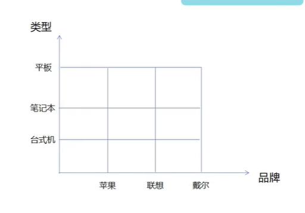

# 1. 适配器模式

适配器模式（Adapter Pattern）是作为两个不兼容的接口之间的桥梁。这种类型的设计模式属于结构型模式，它结合了两个独立接口的功能。

将一个类的接口转换成客户希望的另外一个接口。Adapter模式使得原本由于接口不兼容而不能一起工作的那些类可以在一起工作!

**何时使用：**

1. 系统需要使用现有的类，而此类的接口不符合系统的需要。

2. 想要建立一个可以重复使用的类，用于与一些彼此之间没有太大关联的一些类，包括一些可能在将来引进的类一起工作，这些源类不一定有一致的接口。 

3. 通过接口转换，将一个类插入另一个类系中。

   > 比如老虎和飞禽，现在多了一个飞虎，在不增加实体的需求下，增加一个适配器，在里面包容一个虎对象，实现飞的接口。

**如何解决：**继承或依赖（推荐）。

**关键代码：**适配器继承或依赖已有的对象，实现想要的目标接口。

**注意事项：**适配器不是在详细设计时添加的，而是解决正在服役的项目的问题。

角色分析

- 目标接口：客户所期待的接口，目标可以是具体的或抽象的类,也可以是接口。
- 需要适配的类：需要适配的类或适配者类。
- 适配器：通过包装一个需要适配的对象， 把原接口转换成目标对象!

对象适配器优点

- 可以让任何两个没有关联的类一起运行。
- 提高了类的复用。
- 增加了类的透明度。
- 灵活性好。

类适配器缺点

- 过多地使用适配器，会让系统非常零乱，不易整体进行把握。

  > 比如，明明看到调用的是 A 接口，其实内部被适配成了 B 接口的实现，一个系统如果太多出现这种情况，无异于一场灾难。因此如果不是很有必要，可以不使用适配器，而是直接对系统进行重构。

- 由于 JAVA 至多继承一个类，所以至多只能适配一个适配者类，而且目标类必须是抽象类。

适用场景

- 系统需要使用一些些现有的类，而这些类的接口(如方法名)不符合系统的需要，甚至没有这些类的源代码。
- 想创建一个可以重复使用的类，用于与一些彼此之间没有太大关联的一些类，包括一些可能在将来引进的类一起工作。

示例代码：

1. 创建网线类

   ```java
   // 网线
   public class Cable {
       public void req(){
           System.out.println("上网冲浪。。。");
       }
   }
   ```

2. 创建电脑类

   ```java
   // 电脑
   public class Computer {
       // 开始上网
       public void netWork(Converter converter){
           // 电脑没有网线接口，需要通过转换器接入网线，
           converter.handlerRequest();
       }
   }
   ```

3. 创建转换器接口

   ```java
   // 转换器
   public interface Converter {
       void handlerRequest();
   }
   ```

4. 实现转换器接口，完成转换

   ```java
   // 具体实现类，实现具体的逻辑
   public class Adapter extends Cable implements Converter{
       @Override
       public void handlerRequest() {
           super.req();
       }
   }
   ```

5. 测试

   在电脑类中进行测试，添加代码如下

   ```java
   public static void main(String[] args) {
       // 测试笔记本上网功能
       Computer computer = new Computer();
       computer.netWork(new Adapter());
   }
   ```

   分析：通过转换器进行上网功能已经实现，但是我们发现使用了继承去实现网线类，这不符合依赖倒置设计原则

6. 改进实现类

   ```java
   // 具体实现类，实现具体的逻辑
   public class Adapter implements Converter{
       /**
        * java只能单继承，所以可以使用组合的方式去使用网线
        */
       private Cable cable;
       public Adapter(Cable cable){
           this.cable = cable;
       }
   
       @Override
       public void handlerRequest() {
           cable.req();
       }
   }
   ```

7. 测试

   ```java
   public class Computer {
   
       // 开始上网
       public void netWork(Converter converter){
           // 电脑没有网线接口，需要通过转换器接入网线，
           converter.handlerRequest();
   
       }
   
       public static void main(String[] args) {
           // 测试笔记本上网功能
           Computer computer = new Computer();
           computer.netWork(new Adapter(new Cable()));
       }
   }
   ```

   

# 2. 桥接模式

桥接（Bridge）是用于把抽象化与实现化解耦，使得二者可以独立变化。这种类型的设计模式属于结构型模式，它通过提供抽象化和实现化之间的桥接结构，来实现二者的解耦。

这种模式涉及到一个作为桥接的接口，使得实体类的功能独立于接口实现类。这两种类型的类可被结构化改变而互不影响。

桥接模式是将抽象部分与它的实现部分分离，使它们都可以独立地变化。它是一种对象结构型模式， 又称为柄体(Handle and Body)模式或接口(Interfce)模式。

原本的多层继承结构：


使用桥接模式：

> 把类型和品牌分开



**意图：**将抽象部分与实现部分分离，使它们都可以独立的变化。

**主要解决：**在有多种可能会变化的情况下，用继承会造成类爆炸问题，扩展起来不灵活。

**何时使用：**实现系统可能有多个角度分类，每一种角度都可能变化。

**如何解决：**把这种多角度分类分离出来，让它们独立变化，减少它们之间耦合。

**关键代码：**抽象类依赖实现类。

**优点：**

1. 抽象和实现的分离。
2. 优秀的扩展能力。
3. 实现细节对客户透明。

**缺点：**桥接模式的引入会增加系统的理解与设计难度，由于聚合关联关系建立在抽象层，要求开发者针对抽象进行设计与编程。

使用代码实现：

1. 创建品牌接口

   ```java
   // 电脑品牌类
   public interface Brand {
        void info();
   }
   ```

2. 创建两个具体的品牌实现接口

   ```java
   public class Apple implements Brand{
       @Override
       public void info() {
           System.out.println("这是一台苹果电脑。。。");
       }
   }
   ```

   ```java
   public class Leglon implements Brand{
       @Override
       public void info() {
           System.out.println("这是一台联想电脑。。。");
       }
   }
   ```

3. 创建抽象电脑类

   ```java
   // 抽象的电脑类型
   public abstract class Computer {
       // 组合品牌
       protected Brand brand;
   
       public Computer(Brand brand){
           this.brand = brand;
       }
   
       public void info(){
           brand.info();
       }
   }
   
   ```

4. 创建两个不同类型的电脑（笔记本和台式电脑）继承抽象类

   ```java
   // 台式机
   class Desktop extends Computer{
       public Desktop(Brand brand) {
           super(brand);
       }
   
       @Override
       public void info() {
           super.info();
           System.out.println("台式机");
       }
   }
   ```

   ```java
   // 笔记本
   class Laptop extends Computer{
       public Laptop(Brand brand) {
           super(brand);
       }
   
       @Override
       public void info() {
           super.info();
           System.out.println("笔记本");
       }
   }
   ```

5. 测试

   ```java
   public class Test {
       public static void main(String[] args) {
   
           // 苹果笔记本
           Computer computer = new Laptop(new Apple());
           computer.info();
   
           // 联想台式机
           Computer computer1 = new Desktop(new Leglon());
           computer1.info();
       }
   }
   ```

整体结构分析


分析：

- 好处分析:

  - 桥接模式偶尔类似于多继承方案，但是多继承方案违背了类的单一职责原则，复用性比较
    差，类的个数也非常多，桥接模式是比多继承方案更好的解决方法。 极大的减少了子类的
    个数，从而降低管理和维护的成本

  - 桥接模式提高了系统的可扩充性，在两个变化维度中任意扩展一个维度，都不需要修改原
    有系统。符合开闭原则，就像一座桥，可以把两个变化的维度连接起来!

- 劣势分析:

  - 桥接模式的引入会增加系统的理解与设计难度，由于聚合关联关系建立在抽象层，要求开
    发者针对抽象进行设计与编程。
  - 桥接模式要求正确识别出系统中两个独立变化的维度，因此其使用范围具有一定的局限性。

最佳实践:

- 如果一个系统需要在构建的抽象化角色和具体化角色之间增加更多的灵活性，避免在两个层次之间建立静态的继承联系，通过桥接模式可以使它们在抽象层建立一个关联关系。抽象化角色和实现化角色可以以继承的方式独立扩展而互不影响，在程序运行时可以动态将一个抽象化子类的对象和一个实现化子类的对象进行组合，即系统需要对抽象化角色和实现化角色进行动态耦合。
- 一个类存在两个独立变化的维度，且这两个维度都需要进行扩展。
- 虽然在系统中使用继承是没有问题的，但是由于抽象化角色和具体化角色需要独立变化,设计要求需要独立管理这两者。对于那些不希望使用继承或因为多层次继承导致系统类的个数急剧增加的系统，桥接模式尤为适用。

场景:

- Java语言通过Java虚拟机实现了平台的无关性。
- AWT中的Peer架构
- JDBC驱动程序也是桥接模式的应用之一。

# 3. 代理模式

在代理模式（Proxy Pattern）中，一个类代表另一个类的功能。这种类型的设计模式属于结构型模式。

在代理模式中，我们创建具有现有对象的对象，以便向外界提供功能接口。

**意图：**为其他对象提供一种代理以控制对这个对象的访问。

**主要解决：**在直接访问对象时带来的问题

**何时使用：**想在访问一个类时做一些控制。

**如何解决：**增加中间层。

**关键代码：**实现与被代理类组合。

**优点：** 

1. 职责清晰。
2. 高扩展性。
3. 智能化。

**缺点：** 

1. 由于在客户端和真实主题之间增加了代理对象，因此有些类型的代理模式可能会造成请求的处理速度变慢。
2. 实现代理模式需要额外的工作，有些代理模式的实现非常复杂。

**注意事项：** 

1. 和适配器模式的区别：适配器模式主要改变所考虑对象的接口，而代理模式不能改变所代理类的接口。
2. 和装饰器模式的区别：装饰器模式为了增强功能，而代理模式是为了加以控制。

代理模式的分类

- 静态代理
- 动态代理

## 9.1 静态代理

角色分析：

- 抽象角色：一般会使用接口或者抽象类来解决
- 真实角色：被代理的角色
- 代理角色：代理真实角色，代理真实角色后，一般会做一些附属操作
- 客户：访问代理对象的人

缺点：

- 每一个真实角色都会产生一个代理角色，开发效率会降低

示例代码：

1. 创建租房中介接口

   ```java
   // 租房接口
   public interface rent {
       void rent();
   }
   ```

2. 创建房东类，想要出租房屋

   ```java
   // 房东 要出租房子
   public class Host implements rent{
   
       @Override
       public void rent(){
           System.out.println("房东要出租房子！");
       }
   }
   ```

3. 创建代理类，代理房东出租，还可以做一些附属操作

   ```java
   // 代理类，帮助房东出租房子，帮助租客挑选房子
   public class proxy implements rent {
   
       // 代理真实对象
       private Host host;
   
       public proxy(Host host){
           this.host = host;
       }
   
       @Override
       public void rent() {
           before();
           host.rent();
           after();
       }
   
       private void after() {
           System.out.println("收钱跑路。。");
       }
   
       private void before() {
           System.out.println("带客户看房");
       }
   
   }
   ```

4. 创建客户类，需要找中介租房

   ```java
   // 客户 需要租房子
   public class Client {
       public static void main(String[] args) {
           proxy proxy = new proxy(new Host());
           proxy.rent();
       }
   }
   ```


## 9.2 动态代理

spirng aop就是动态代理

- 动态代理和静态代理角色一样
- 动态代理的代理类是动态生成的
- 动态代理分为两大类
  - 基于接口的动态代理——JDK动态代理
  - 基于类的动态代理——cglib

示例代码：使用JDK动态代理

> spring部分有这里的笔记，可以参考

1. 创建租房接口

   ```java
   // 租房接口
   public interface rent {
       void rent();
   }
   ```

2. 创建房东，实现租房接口

   ```java
   // 房东 要出租房子
   public class Host implements rent{
   
       @Override
       public void rent(){
           System.out.println("房东要出租房子！");
       }
   }
   ```

3. 创建代理类

   ```java
   public class ProxyInvocationHandler implements InvocationHandler {
   
       // 被代理的接口
       private Object target;
       public void setRent(Object target){
           this.target = target;
       }
       // 生成代理类
       public Object getProxy(){
           return Proxy.newProxyInstance(
                   this.getClass().getClassLoader(), // ClassLoader 类加载器
                   target.getClass().getInterfaces(), // 被代理类的接口
                   this); // InvocationHandler
       }
   
       // 处理代理实例，返回结果
       @Override
       public Object invoke(Object proxy, Method method, Object[] args) throws Throwable {
           before();
           // 动态代理的本质就是使用反射机制实现
           Object result = method.invoke(target, args);
           after();
           return result;
       }
   
       private void after() {
           System.out.println("完事跑路。。");
       }
   
       private void before() {
           System.out.println("带客户看房");
       }
   }
   ```

4. 创建客户，找代理租房

   ```java
   // 客户 需要租房子
   public class Client {
       public static void main(String[] args) {
   
           // 真实角色
           Host host = new Host();
           // 代理角色
           ProxyInvocationHandler handler = new ProxyInvocationHandler();
           // 通过调用程序处理角色来处理我们要调用的接口对象
           handler.setRent(host);
   
           rent proxy = (rent) handler.getProxy();
           proxy.rent();
   
       }
   }
   ```

   

# 4. 过滤器模式

过滤器模式（Filter Pattern）或标准模式（Criteria Pattern）是一种设计模式，这种模式允**许开发人员使用不同的标准来过滤组对象，通过逻辑运算以解压缩的方式将其连接起来**。这种类型的设计模式属于结构型模式，它结合多个标准来获得单一标准。

示例代码：

我们将创建一个 Person 对象、Criteria 接口和实现了该接口的实体类，来过滤 Person 对象的列表。CriteriaPatternDemo 类使用 Criteria 对象，基于各种标准和它们的结合来过滤 Person 对象的列表。

1. 创建Person类

   ```java
   public class Person {
       private String name; // 姓名
       private String gender; // 性别
       private String maritalStatus; // 婚姻状况
       
       // 省略getter和全参构造
   }
   ```

2. 创建标准类接口，过滤标准都需要实现这个类

   ```java
   // 标准类
   public interface Criteria {
       List<Person> meetCriteria(List<Person> persons);
   }
   ```

3. 设置不同标准去过滤对象

   - 过滤男性

     ```java
     // 男性
     public class CriteriaMale implements Criteria{
         @Override
         public List<Person> meetCriteria(List<Person> persons) {
             List<Person> list = new ArrayList<>();
             for (Person person : persons) {
                 if (person.getGender().equalsIgnoreCase("男")){
                     list.add(person);
                 }
             }
             return list;
         }
     }
     ```

   - 过滤女性

     ```java
     // 女性
     public class CriteriaFemale implements Criteria{
     
         @Override
         public List<Person> meetCriteria(List<Person> persons) {
             List<Person> list = new ArrayList<>();
             for (Person person : persons) {
                 if (person.getGender().equals("女")){
                     list.add(person);
                 }
             }
             return list;
         }
     }
     ```

4. 测试过滤

   ```java
   public class CriteriaPatternDemo {
       public static void main(String[] args) {
           List<Person> persons = new ArrayList<Person>();
           persons.add(new Person("Robert","男", "单身"));
           persons.add(new Person("John","男", "已婚"));
           persons.add(new Person("Laura","女", "已婚"));
           persons.add(new Person("Diana","女", "单身"));
           persons.add(new Person("Mike","男", "单身"));
           persons.add(new Person("Bobby","男", "单身"));
   
   
           CriteriaFemale female = new CriteriaFemale();
           
           CriteriaMale male = new CriteriaMale();
           // 调用方法进行过滤
           printPersons(male.meetCriteria(persons));
       }
   
       public static void printPersons(List<Person> persons){
           for (Person person : persons) {
               System.out.println("Person : [ Name : " + person.getName()
                       +", Gender : " + person.getGender()
                       +", Marital Status : " + person.getMaritalStatus()
                       +" ]");
           }
       }
   }
   
   ```

# 5. 组合模式

组合模式（Composite Pattern），又叫部分整体模式，**是用于把一组相似的对象当作一个单一的对象。**组合模式依据树形结构来组合对象，用来表示部分以及整体层次。这种类型的设计模式属于结构型模式，它创建了对象组的树形结构。

这种模式创建了一个包含自己对象组的类。该类提供了修改相同对象组的方式。

**意图：**将对象组合成树形结构以表示"部分——整体"的层次结构。组合模式使得用户对单个对象和组合对象的使用具有一致性。

**主要解决：**它在我们树型结构的问题中，模糊了简单元素和复杂元素的概念，客户程序可以像处理简单元素一样来处理复杂元素，从而使得客户程序与复杂元素的内部结构解耦。

**何时使用：** 

1. 您想表示对象的 部分——整体 层次结构（树形结构）。
2. 您希望用户忽略组合对象与单个对象的不同，用户将统一地使用组合结构中的所有对象。

**如何解决：**树枝和叶子实现统一接口，树枝内部组合该接口。

**关键代码：**树枝内部组合该接口，并且含有内部属性 List，里面放 Component。

示例代码：

我们有一个类 *Employee*，该类被当作组合模型类。*CompositePatternDemo* 类使用 *Employee* 类来添加部门层次结构，并打印所有员工。

1. 创建职工类

   ```java
   public class Employee {
       private String name; // 姓名
       private String dept; // 部门
       private int salary; // 薪水
       private List<Employee> subordinates; // 下属
   
       public Employee(String name, String dept, int salary) {
           this.name = name;
           this.dept = dept;
           this.salary = salary;
           this.subordinates = new ArrayList<>();
       }
   
       public void add(Employee e) {
           subordinates.add(e);
       }
   
       public void remove(Employee e) {
           subordinates.remove(e);
       }
   
       public List<Employee> getSubordinates(){
           return subordinates;
       }
   
       @Override
       public String toString(){
           return ("Employee :[ Name : "+ name
                   +", dept : "+ dept + ", salary :"
                   + salary+" ]");
       }
   }
   ```

2. 测试

   ```java
   public class Test {
       public static void main(String[] args) {
           // ceo
           Employee CEO = new Employee("John","CEO", 30000);
           // 销售主管
           Employee headSales = new Employee("Robert","Head Sales", 20000);
           // 营销主管
           Employee headMarketing = new Employee("Michel","Head Marketing", 20000);
   
           // 职员
           Employee clerk1 = new Employee("Richard","Sales", 10000);
           Employee clerk2 = new Employee("Rob","Sales", 10000);
           Employee clerk3 = new Employee("Laura","Marketing", 10000);
           Employee clerk4 = new Employee("Bob","Marketing", 10000);
   
           // 添加CEO的下属
           CEO.add(headSales);
           CEO.add(headMarketing);
   
           // 添加销售主管的下属
           headSales.add(clerk1);
           headSales.add(clerk2);
   
           // 添加营销主管的下属
           headMarketing.add(clerk3);
           headMarketing.add(clerk4);
   
           // 打印这个组织所有员工
           System.out.println(CEO); // 打印ceo
           for (Employee subordinate : CEO.getSubordinates()) {
               System.out.println(subordinate); // 打印ceo的下属
               for (Employee employee : subordinate.getSubordinates()) {
                   System.out.println(employee); // 打印下属的下属
               }
           }
   
       }
   }
   ```

# 6. 装饰器模式

装饰器模式（Decorator Pattern）允许向一个现有的对象添加新的功能，同时又不改变其结构。这种类型的设计模式属于结构型模式，它是作为现有的类的一个包装。

这种模式创建了一个装饰类，用来包装原有的类，并在保持类方法签名完整性的前提下，提供了额外的功能。

**意图：**动态地给一个对象添加一些额外的职责。就增加功能来说，装饰器模式相比生成子类更为灵活。

**主要解决：**一般的，我们为了扩展一个类经常使用继承方式实现，由于继承为类引入静态特征，并且随着扩展功能的增多，子类会很膨胀。

**何时使用：**在不想增加很多子类的情况下扩展类。

**如何解决：**将具体功能职责划分，同时继承装饰者模式。

**关键代码：**

1. Component 类充当抽象角色，不应该具体实现。 
2. 修饰类引用和继承 Component 类，具体扩展类重写父类方法。

**优点：**装饰类和被装饰类可以独立发展，不会相互耦合，装饰模式是继承的一个替代模式，装饰模式可以动态扩展一个实现类的功能。

**缺点：**多层装饰比较复杂。

**使用场景：** 1、扩展一个类的功能。 2、动态增加功能，动态撤销。

**注意事项：**可代替继承。

示例代码：

1. 创建一个形状接口

   ```java
   // 形状接口
   public interface Shape {
       void draw();
   }
   ```

2. 实现这个形状

   - 圆形

     ```java
     // 圆
     public class Circle implements Shape{
         @Override
         public void draw() {
             System.out.println("形状：圆形");
         }
     }
     ```

   - 长方形

     ```java
     // 长方形
     public class Rectangle implements Shape{
         @Override
         public void draw() {
             System.out.println("形状：长方形");
         }
     }
     ```

3. 创建装饰器

   ```java
   // 装饰器
   public abstract class ShapeDecorator implements Shape {
       protected Shape shape;
   
       public ShapeDecorator(Shape shape) {
           this.shape = shape;
       }
   
       @Override
       public void draw(){
           shape.draw();
       }
   }
   ```

4. 创建扩展了装饰器类的实体装饰类

   ```java
   // 扩展实体装饰器
   public class RedShapeDecorator extends ShapeDecorator {
   
       public RedShapeDecorator(Shape shape) {
           super(shape);
       }
   
       @Override
       public void draw() {
           // 调用父类的draw方法，因为这里构造函数将shape对象传入了父类，直接super调用即可
           super.draw();
           // 对需要装饰的类进行装饰，设置边框颜色
           setRedBorder(shape);
       }
   
       private void setRedBorder(Shape decoratedShape){
           System.out.println("边框颜色：红色");
       }
   }
   ```

5. 测试装饰

   ```java
   public class test {
       public static void main(String[] args) {
           // 使用RedShapeDecorator对象装饰shape对象
           RedShapeDecorator redCircle = new RedShapeDecorator(new Circle());
           RedShapeDecorator redRectangle = new RedShapeDecorator(new Rectangle());
   
           redCircle.draw();
           redRectangle.draw();
       }
   }
   ```

6. 输出

   ```
   形状：圆形
   边框颜色：红色
   形状：长方形
   边框颜色：红色
   ```

# 7. 外观模式

外观模式（Facade Pattern）隐藏系统的复杂性，并向客户端提供了一个客户端可以访问系统的接口。这种类型的设计模式属于结构型模式，它向现有的系统添加一个接口，来隐藏系统的复杂性。

这种模式涉及到一个单一的类，该类提供了客户端请求的简化方法和对现有系统类方法的委托调用。

**意图：**为子系统中的一组接口提供一个一致的界面，外观模式定义了一个高层接口，这个接口使得这一子系统更加容易使用。

**主要解决：**降低访问复杂系统的内部子系统时的复杂度，简化客户端与之的接口。

**何时使用：** 

1. 客户端不需要知道系统内部的复杂联系，整个系统只需提供一个"接待员"即可。
2. 定义系统的入口。

**如何解决：**客户端不与系统耦合，外观类与系统耦合。

**关键代码：**在客户端和复杂系统之间再加一层，这一层将调用顺序、依赖关系等处理好。

**优点：** 1、减少系统相互依赖。 2、提高灵活性。 3、提高了安全性。

**缺点：**不符合开闭原则，如果要改东西很麻烦，继承重写都不合适。

**使用场景：** 1、为复杂的模块或子系统提供外界访问的模块。 2、子系统相对独立。 3、预防低水平人员带来的风险。

**注意事项：**在层次化结构中，可以使用外观模式定义系统中每一层的入口。

示例代码：

假设我们要给一些形状统一的访问接口

1. 创建一个形状接口

   ```java
   // 形状接口
   public interface Shape {
       void draw();
   }
   ```

2. 实现这个形状

   - 圆形

     ```java
     // 圆
     public class Circle implements Shape{
         @Override
         public void draw() {
             System.out.println("形状：圆形");
         }
     }
     ```

   - 长方形

     ```java
     // 长方形
     public class Rectangle implements Shape{
         @Override
         public void draw() {
             System.out.println("形状：长方形");
         }
     }
     ```

3. 创建外观类

   ```java
   // 外观类
   public class ShapeMaker {
       private Shape circle;
       private Shape rectangle;
   
       public ShapeMaker() {
           this.circle = new Circle();
           this.rectangle = new Rectangle();
       }
   
       public void drawCircle(){
           circle.draw();
       }
   
       public void drawRectangle(){
           rectangle.draw();
       }
   }
   ```

4. 测试

   ```java
   public class test {
       public static void main(String[] args) {
           ShapeMaker shapeMaker = new ShapeMaker();
   
           shapeMaker.drawCircle();
           shapeMaker.drawRectangle();
       }
   }
   ```

# 8. 享元模式

享元模式（Flyweight Pattern）主要用于减少创建对象的数量，以减少内存占用和提高性能。这种类型的设计模式属于结构型模式，它提供了减少对象数量从而改善应用所需的对象结构的方式。

享元模式尝试重用现有的同类对象，如果未找到匹配的对象，则创建新对象。我们将通过创建 5 个对象来画出 20 个分布于不同位置的圆来演示这种模式。由于只有 5 种可用的颜色，所以 color 属性被用来检查现有的 *Circle* 对象。

**意图：**运用共享技术有效地支持大量细粒度的对象。

**主要解决：**在有大量对象时，有可能会造成内存溢出，我们把其中共同的部分抽象出来，如果有相同的业务请求，直接返回在内存中已有的对象，避免重新创建。

**何时使用：** 1、系统中有大量对象。 2、这些对象消耗大量内存。 3、这些对象的状态大部分可以外部化。 4、这些对象可以按照内蕴状态分为很多组，当把外蕴对象从对象中剔除出来时，每一组对象都可以用一个对象来代替。 5、系统不依赖于这些对象身份，这些对象是不可分辨的。

**如何解决：**用唯一标识码判断，如果在内存中有，则返回这个唯一标识码所标识的对象。

**关键代码：**用 HashMap 存储这些对象。

**优点：**大大减少对象的创建，降低系统的内存，使效率提高。

**缺点：**提高了系统的复杂度，需要分离出外部状态和内部状态，而且外部状态具有固有化的性质，不应该随着内部状态的变化而变化，否则会造成系统的混乱。

**使用场景：** 1、系统有大量相似对象。 2、需要缓冲池的场景。

**注意事项：** 1、注意划分外部状态和内部状态，否则可能会引起线程安全问题。 2、这些类必须有一个工厂对象加以控制。

示例代码：

1. 创建形状类接口

   ```java
   public interface Shape {
       void draw();
   }
   ```

2. 实现这个接口

   ```java
   public class Circle implements Shape{
       private String color;
       private int x;
       private int y;
       private int radius; // 半径
   
       public Circle(String color){
           this.color = color;
       }
   
       public void setX(int x) {
           this.x = x;
       }
   
       public void setY(int y) {
           this.y = y;
       }
   
       public void setRadius(int radius) {
           this.radius = radius;
       }
   
   
       @Override
       public void draw() {
           System.out.println("圆形: [Color : " + color
                   +", x : " + x +", y :" + y +", radius :" + radius);
       }
   }
   ```

3. 创建图形工厂

   ```java
   // 创建一个工厂，生成基于给定信息的实体类的对象。
   public class ShapeFactory {
       private static final HashMap<String,Shape> circleMap = new HashMap<>();
   
       public static Shape getCircle(String color){
           Circle circle = (Circle) circleMap.get(color);
           if (circle == null){
               circle = new Circle(color);
               circleMap.put(color,circle);
               System.out.println("已创建颜色为："+color+"的圆形");
           }
           return circle;
       }
   }
   ```

4. 测试

   ```java
   public class test {
       public static void main(String[] args) {
           Circle redCircle = (Circle)ShapeFactory.getCircle("red");
           redCircle.setX(11);
           redCircle.setY(11);
           redCircle.setRadius(20);
           redCircle.draw();
           System.out.println(redCircle.hashCode());
   
           Circle redCircle2 = (Circle)ShapeFactory.getCircle("red");
           redCircle2.setX(12);
           redCircle2.setY(12);
           redCircle2.setRadius(22);
           redCircle2.draw();
           System.out.println(redCircle2.hashCode());
       }
   }
   ```

5. 输出

   ```
   已创建颜色为：red的圆形
   圆形: [Color : red, x : 11, y :11, radius :20
   110992469
   圆形: [Color : red, x : 12, y :12, radius :22
   110992469
   ```

   观察输出我们发现readCircle对象只创建了一次。