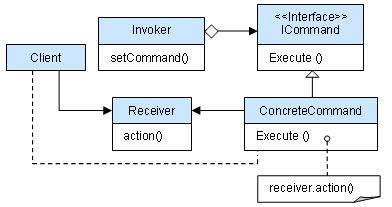

# 1. 责任链模式

顾名思义，责任链模式（Chain of Responsibility Pattern）为请求创建了一个接收者对象的链。这种模式给予请求的类型，对请求的发送者和接收者进行解耦。这种类型的设计模式属于行为型模式。

在这种模式中，通常每个接收者都包含对另一个接收者的引用。如果一个对象不能处理该请求，那么它会把相同的请求传给下一个接收者，依此类推。

**意图：**避免请求发送者与接收者耦合在一起，让多个对象都有可能接收请求，将这些对象连接成一条链，并且沿着这条链传递请求，直到有对象处理它为止。

**主要解决：**职责链上的处理者负责处理请求，客户只需要将请求发送到职责链上即可，无须关心请求的处理细节和请求的传递，所以职责链将请求的发送者和请求的处理者解耦了。

**何时使用：**在处理消息的时候以过滤很多道。

**如何解决：**拦截的类都实现统一接口。

**关键代码：**Handler 里面聚合它自己，在 HandlerRequest 里判断是否合适，如果没达到条件则向下传递，向谁传递之前 set 进去。

**优点：** 1、降低耦合度。它将请求的发送者和接收者解耦。 2、简化了对象。使得对象不需要知道链的结构。 3、增强给对象指派职责的灵活性。通过改变链内的成员或者调动它们的次序，允许动态地新增或者删除责任。 4、增加新的请求处理类很方便。

**缺点：** 1、不能保证请求一定被接收。 2、系统性能将受到一定影响，而且在进行代码调试时不太方便，可能会造成循环调用。 3、可能不容易观察运行时的特征，有碍于除错。

**使用场景：** 1、有多个对象可以处理同一个请求，具体哪个对象处理该请求由运行时刻自动确定。 2、在不明确指定接收者的情况下，向多个对象中的一个提交一个请求。 3、可动态指定一组对象处理请求。

**注意事项：**在 JAVA WEB 中遇到很多应用。

示例代码：

我们创建抽象类 *AbstractLogger*，带有详细的日志记录级别。然后我们创建三种类型的记录器，都扩展了 *AbstractLogger*。每个记录器消息的级别是否属于自己的级别，如果是则相应地打印出来，否则将不打印并把消息传给下一个记录器。

1. 定义抽象的记录器类

   ```java
   public abstract class AbstractLogger {
       // 定义日志级别
       public static int INFO = 1;
       public static int DEBUG = 2;
       public static int ERROR = 3;
   
       protected int level;
   
       // 责任链中的下一个元素
       protected AbstractLogger nextLogger;
   
       // 设置下一个责任人
       public void setNextLogger(AbstractLogger nextLogger) {
           this.nextLogger = nextLogger;
       }
   
       public void logMessage(int level,String message){
           if (this.level <= level){
               write(message);
           }
           if (nextLogger != null){
               nextLogger.logMessage(level,message);
           }
       }
   
       protected abstract void write(String message);
   }
   ```

2. 创建扩展了记录器类的实体类

   ```java
   public class ConsoleLogger extends AbstractLogger{
       public ConsoleLogger(int level) {
           this.level = level;
       }
   
       @Override
       protected void write(String message) {
           System.out.println("console logger: "+ message);
       }
   }
   ```

   ```java
   public class ErrorLogger extends AbstractLogger{
   
       public ErrorLogger(int level){
           this.level = level;
       }
   
       @Override
       protected void write(String message) {
           System.out.println("error logger: " + message);
       }
   }
   ```

   ```java
   public class FileLogger extends AbstractLogger {
   
       public FileLogger(int level){
           this.level = level;
       }
   
       @Override
       protected void write(String message) {
           System.out.println("file logger: " + message);
       }
   }
   ```

3. 创建不同类型的记录器。赋予它们不同的错误级别，并在每个记录器中设置下一个记录器。每个记录器中的下一个记录器代表的是链的一部分。

   ```java
   public class Test {
       private static AbstractLogger getChainOfLoggers(){
           ConsoleLogger console = new ConsoleLogger(AbstractLogger.INFO);
           ErrorLogger error = new ErrorLogger(AbstractLogger.ERROR);
           FileLogger file = new FileLogger(AbstractLogger.DEBUG);
   
           // 设置责任链
           console.setNextLogger(error);
           error.setNextLogger(file);
   
           return console;
       }
   
       public static void main(String[] args) {
           AbstractLogger logger = getChainOfLoggers();
           logger.logMessage(AbstractLogger.INFO,"这是info消息");
           logger.logMessage(AbstractLogger.ERROR,"这是一条error消息");
           logger.logMessage(AbstractLogger.DEBUG,"这是一条debug消息");
   
       }
   }
   
   ```

   

# 2. 命令模式

命令模式（Command Pattern）是一种数据驱动的设计模式，它属于行为型模式。 在软件设计中，我们经常需要向某些对象发送请求，但是并不知道请求的接收者是谁，也不知道被请求的操作是哪个

> 我们只需在程序运行时指定具体的请求接收者即可，此时，可以使用命令模式来进行设计

**意图：**在命名模式中，会将一个请求封装为一个对象，以便使用不同参数来表示不同的请求(即命名)，同时命令模式也支持可撤销的操作。

**主要解决：**在软件系统中，行为请求者与行为实现者通常是一种紧耦合的关系，但某些场合，比如需要对行为进行记录、撤销或重做、事务等处理时，这种无法抵御变化的紧耦合的设计就不太合适。

**何时使用：**在某些场合，比如要对行为进行"记录、撤销/重做、事务"等处理，这种无法抵御变化的紧耦合是不合适的。在这种情况下，如何将"行为请求者"与"行为实现者"解耦？将一组行为抽象为对象，可以实现二者之间的松耦合。

**如何解决：**通过调用者调用接受者执行命令，顺序：调用者→命令→接受者。

**关键代码：**将军发布命令，士兵去执行。其中有几个角色：将军（命令发布者）、士兵（命令的具体执行者）、命令(连接将军和士兵)。

- Invoker 是调用者（将军）
- Receiver 是被调用者（士兵）
- Command 是命令，实现了 Command 接口，持有接收对象

**优点：** 1、降低了系统耦合度。 2、新的命令可以很容易添加到系统中去。

**缺点：**使用命令模式可能会导致某些系统有过多的具体命令类。

**使用场景：**认为是命令的地方都可以使用命令模式，比如： 1、GUI 中每一个按钮都是一条命令。 2、模拟 CMD。

**注意事项：**系统需要支持命令的撤销(Undo)操作和恢复(Redo)操作，也可以考虑使用命令模式，见命令模式的扩展。

命令模式结构示意图:



示例代码：

我们首先创建作为命令的接口Order，然后创建作为请求的 Stock 类。实体命令类 BuyStock 和 SellStock，实现了 Order 接口，将执行实际的命令处理。创建作为调用对象的类 Broker，它接受订单并能下订单。

1. 创建命令接口

   ```java
   // 命令接口
   public interface Order {
       void execute();
   }
   ```

2. 创建请求

   ```java
   // 请求类
   public class Stock {
       private String name = "琴女";
       private int quantity = 10;
   
       public void buy(){
           System.out.println("请求 [ Name: "+name+", 数量: " + quantity +" ] 买入");
       }
       
       public void sell(){
           System.out.println("请求 [ Name: "+name+", 数量: " + quantity +" ] 出售");
       }
   }
   ```

3. 创建实现了 Order接口的实体类。

   ```java
   // 实体命令类，执行实际的命令处理
   public class BuyStock implements Order{
       private Stock stock;
       public BuyStock(Stock stock){
           this.stock = stock;
       }
   
       @Override
       public void execute() {
           stock.buy();
       }
   }
   ```

   ```java
   // 实体命令类，执行实际的命令处理
   public class SellStock implements Order{
       private Stock stock;
       public SellStock (Stock stock){
           this.stock = stock;
       }
   
       @Override
       public void execute() {
           stock.sell();
       }
   }
   ```

4. 创建命令调用类

   ```java
   // 命令调用类，接受命令，并调用
   public class Broker {
       private List<Order> orderList = new ArrayList<>();
   
        // 创建订单
       public void takeOrder(Order order){
           orderList.add(order);
       }
   
       // 执行订单
       public void placeOrders(){
           for (Order order : orderList) {
               order.execute();
           }
           orderList.clear();
       }
   }
   ```

5. 测试

   使用 Broker 类来接受并执行命令。

   ```java
   public class Test {
       public static void main(String[] args) {
         	// 创建命令
           Stock stock = new Stock();
           BuyStock buyStock = new BuyStock(stock);
           SellStock sellStock = new SellStock(stock);
   
           // broker可以基于命令的类型确定哪个对象执行哪个命令
           Broker broker = new Broker();
           // 根据需要创建不同的订单（买/卖）
           broker.takeOrder(buyStock);
           broker.takeOrder(sellStock);
           // 执行订单
           broker.placeOrders();
       }
   }

   ```
   
   

# 3. 解释器模式

解释器模式（Interpreter Pattern）提供了评估语言的语法或表达式的方式，它属于行为型模式。这种模式实现了一个表达式接口，该接口解释一个特定的上下文。这种模式被用在 SQL 解析、符号处理引擎等。

**意图：**给定一个语言，定义它的文法表示，并定义一个解释器，这个解释器使用该标识来解释语言中的句子。

**主要解决：**对于一些固定文法构建一个解释句子的解释器。

**何时使用：**如果一种特定类型的问题发生的频率足够高，那么可能就值得将该问题的各个实例表述为一个简单语言中的句子。这样就可以构建一个解释器，该解释器通过解释这些句子来解决该问题。

**如何解决：**构建语法树，定义终结符与非终结符。

**关键代码：**构建环境类，包含解释器之外的一些全局信息，一般是 HashMap。

**应用实例：**编译器、运算表达式计算。

**优点：** 1、可扩展性比较好，灵活。 2、增加了新的解释表达式的方式。 3、易于实现简单文法。

**缺点：** 1、可利用场景比较少。 2、对于复杂的文法比较难维护。 3、解释器模式会引起类膨胀。 4、解释器模式采用递归调用方法。

**使用场景：** 1、可以将一个需要解释执行的语言中的句子表示为一个抽象语法树。 2、一些重复出现的问题可以用一种简单的语言来进行表达。 3、一个简单语法需要解释的场景。

**注意事项：**可利用场景比较少，JAVA 中如果碰到可以用 expression4J 代替。

示例代码：

1. 创建表达式接口

   ```java
   // 表达式接口，声明一个抽象的解释操作
   public interface Expression {
       public boolean interpret(String context);
   }
   ```

2. 创建实现类

   ```java
   // 实现类，存储数据信息
   public class TerminalExpression  implements Expression{
       private String data;
   
       public TerminalExpression(String data) {
           this.data = data;
       }
   
       @Override
       public boolean interpret(String context) {
           if (context.contains(data)){
               return true;
           }
           return false;
       }
   }
   ```

   ```java
   // 或表达式
   public class OrExpression implements Expression{
       private Expression expr1 = null;
       private Expression expr2 = null;
   
       public OrExpression(Expression expr1, Expression expr2) {
           this.expr1 = expr1;
           this.expr2 = expr2;
       }
   
   
       @Override
       public boolean interpret(String context) {
   
           return expr1.interpret(context) || expr2.interpret(context);
       }
   }
   ```

   ```java
   // 和表达式
   public class AndExpression implements Expression{
   
       private Expression expr1 = null;
       private Expression expr2 = null;
   
       public AndExpression(Expression expr1, Expression expr2) {
           this.expr1 = expr1;
           this.expr2 = expr2;
       }
   
   
       @Override
       public boolean interpret(String context) {
           return expr1.interpret(context) && expr2.interpret(context);
       }
   }
   ```

3. 使用 *Expression* 类来创建规则，并解析它们。

   ```java
   public class InterpreterPatternDemo {
       //规则：Robert 和 John 是男性
       public static Expression getMaleExpression(){
           Expression robert = new TerminalExpression("Robert");
           Expression john = new TerminalExpression("John");
           return new OrExpression(robert, john);
       }
   
       //规则：Julie 是一个已婚的女性
       public static Expression getMarriedWomanExpression(){
           Expression julie = new TerminalExpression("Julie");
           Expression married = new TerminalExpression("Married");
           return new AndExpression(julie, married);
       }
   
       public static void main(String[] args) {
           Expression isMale = getMaleExpression();
           Expression isMarriedWoman = getMarriedWomanExpression();
   
           System.out.println("John is male? " + isMale.interpret("John"));
           System.out.println("Julie is a married women? "
                   + isMarriedWoman.interpret("Married Julie"));
       }
   }
   ```

   

# 4. 迭代器模式

迭代器模式（Iterator Pattern）是 Java 和 .Net 编程环境中非常常用的设计模式。这种模式用于顺序访问集合对象的元素，不需要知道集合对象的底层表示。

迭代器模式属于行为型模式。

**意图：**提供一种方法顺序访问一个聚合对象中各个元素, 而又无须暴露该对象的内部表示。

**主要解决：**不同的方式来遍历整个整合对象。

**何时使用：**遍历一个聚合对象。

**如何解决：**把在元素之间游走的责任交给迭代器，而不是聚合对象。

**关键代码：**定义接口：hasNext, next。

**应用实例：**JAVA 中的 iterator。

**优点：** 1、它支持以不同的方式遍历一个聚合对象。 2、迭代器简化了聚合类。 3、在同一个聚合上可以有多个遍历。 4、在迭代器模式中，增加新的聚合类和迭代器类都很方便，无须修改原有代码。

**缺点：**由于迭代器模式将存储数据和遍历数据的职责分离，增加新的聚合类需要对应增加新的迭代器类，类的个数成对增加，这在一定程度上增加了系统的复杂性。

**使用场景：** 1、访问一个聚合对象的内容而无须暴露它的内部表示。 2、需要为聚合对象提供多种遍历方式。 3、为遍历不同的聚合结构提供一个统一的接口。

**注意事项：**迭代器模式就是分离了集合对象的遍历行为，抽象出一个迭代器类来负责，这样既可以做到不暴露集合的内部结构，又可让外部代码透明地访问集合内部的数据。

示例代码：

我们将创建一个叙述导航方法的 Iterator 接口和一个返回迭代器的 Container 接口。实现了 Container 接口的实体类将负责实现 Iterator 接口。

IteratorPatternDemo，我们的演示类使用实体类 NamesRepository 来打印 NamesRepository 中存储为集合的 Names。

1. 创建接口

   ```java
   public interface Iterator {
       // 判断下一个值是否存在
       public boolean hasNext();
       // 指向下一个值
       public Object next();
   }
   ```

   ```java
   public interface Container {
       public Iterator getIterator();
   }
   ```

2. 创建实现了 Container 接口的实体类。该类有实现了 Iterator 接口的内部类 NameIterator。

   ```java
   public class NameRepository implements Container{
       public String[] names = {"Robert" , "John" ,"Julie" , "Lora"};
   
       @Override
       public Iterator getIterator() {
           return new NameIterator();
       }
   
       private class NameIterator implements Iterator{
           int index;
   
           @Override
           public boolean hasNext() {
               if (index < names.length){
                   return true;
               }
               return false;
           }
   
           @Override
           public Object next() {
               if (this.hasNext()){
                   return names[index++];
               }
               return null;
           }
       }
   }
   ```

3. 使用 NameRepository来获取迭代器，并打印名字。

   ```java
   public class IteratorPatternDemo {
       public static void main(String[] args) {
           NameRepository nameRepository = new NameRepository();
           for (Iterator iter =  nameRepository.getIterator(); iter.hasNext();) {
               String name = (String)iter.next();
               System.out.println("Name : " + name);
           }
       }
   }
   ```

# 5. 中介者模式

中介者模式（Mediator Pattern）是用来降低多个对象和类之间的通信复杂性。这种模式提供了一个中介类，该类通常处理不同类之间的通信，并支持松耦合，使代码易于维护。中介者模式属于行为型模式。

**意图：**用一个中介对象来封装一系列的对象交互，中介者使各对象不需要显式地相互引用，从而使其耦合松散，而且可以独立地改变它们之间的交互。

**主要解决：**对象与对象之间存在大量的关联关系，这样势必会导致系统的结构变得很复杂，同时若一个对象发生改变，我们也需要跟踪与之相关联的对象，同时做出相应的处理。

**何时使用：**多个类相互耦合，形成了网状结构。

**如何解决：**将上述网状结构分离为星型结构。

**关键代码：**对象 Colleague 之间的通信封装到一个类中单独处理。

**应用实例：** 1、中国加入 WTO 之前是各个国家相互贸易，结构复杂，现在是各个国家通过 WTO 来互相贸易。 2、机场调度系统。 3、MVC 框架，其中C（控制器）就是 M（模型）和 V（视图）的中介者。

**优点：** 1、降低了类的复杂度，将一对多转化成了一对一。 2、各个类之间的解耦。 3、符合迪米特原则。

**缺点：**中介者会庞大，变得复杂难以维护。

**使用场景：** 1、系统中对象之间存在比较复杂的引用关系，导致它们之间的依赖关系结构混乱而且难以复用该对象。 2、想通过一个中间类来封装多个类中的行为，而又不想生成太多的子类。

**注意事项：**不应当在职责混乱的时候使用。

示例代码：

我们通过聊天室实例来演示中介者模式。实例中，多个用户可以向聊天室发送消息，聊天室向所有的用户显示消息。我们将创建两个类 ChatRoom 和 User。User 对象使用 ChatRoom 方法来分享他们的消息。

MediatorPatternDemo，我们的演示类使用 User 对象来显示他们之间的通信。

1. 创建中介类

   ```java
   // 中介类
   public class ChatRoom {
       public static void showMessage(User user, String message){
           System.out.println(new Date().toString()
                   + " [" + user.getName() +"] : " + message);
       }
   }
   ```

2. 创建user类

   ```java
   public class User {
       private String name;
   
       public String getName() {
           return name;
       }
   
       public void setName(String name) {
           this.name = name;
       }
   
       public User(String name){
           this.name  = name;
       }
   
       public void sendMessage(String message){
           ChatRoom.showMessage(this,message);
       }
   }
   
   ```

3. 测试

   ```java
   public class Test {
       public static void main(String[] args) {
           User robert = new User("Robert");
           User john = new User("John");
   
           robert.sendMessage("Hi! John!");
           john.sendMessage("Hello! Robert!");
       }
   }
   ```

# 6. 备忘录模式

备忘录模式（Memento Pattern）保存一个对象的某个状态，以便在适当的时候恢复对象。备忘录模式属于行为型模式。


**意图：**在不破坏封装性的前提下，捕获一个对象的内部状态，并在该对象之外保存这个状态。

**主要解决：**所谓备忘录模式就是在不破坏封装的前提下，捕获一个对象的内部状态，并在该对象之外保存这个状态，这样可以在以后将对象恢复到原先保存的状态。

**何时使用：**很多时候我们总是需要记录一个对象的内部状态，这样做的目的就是为了允许用户取消不确定或者错误的操作，能够恢复到他原先的状态，使得他有"后悔药"可吃。

**如何解决：**通过一个备忘录类专门存储对象状态。

**关键代码：**客户不与备忘录类耦合，与备忘录管理类耦合。

**应用实例：** 1、后悔药。 2、打游戏时的存档。 3、Windows 里的 ctri + z。 4、IE 中的后退。 4、数据库的事务管理。

**优点：** 1、给用户提供了一种可以恢复状态的机制，可以使用户能够比较方便地回到某个历史的状态。 2、实现了信息的封装，使得用户不需要关心状态的保存细节。

**缺点：**消耗资源。如果类的成员变量过多，势必会占用比较大的资源，而且每一次保存都会消耗一定的内存。

**使用场景：** 1、需要保存/恢复数据的相关状态场景。 2、提供一个可回滚的操作。

**注意事项：** 1、为了符合迪米特原则，还要增加一个管理备忘录的类。 2、为了节约内存，可使用原型模式+备忘录模式。

示例代码：

备忘录模式使用三个类 *Memento*、*Originator* 和 *CareTaker*。

1. Memento 包含了要被恢复的对象的状态。

   ```java
   // 备忘录类
   public class Memento {
       private String state;
       public Memento(String state){
           this.state = state;
       }
   
       public String getState(){
           return state;
       }
   }
   
   ```

2. Originator 创建并在 Memento 对象中存储状态。

   ```java
   public class Originator {
       // 状态信息
       private String state;
   
       public void setState(String state){
           this.state = state;
       }
   
       public String getState(){
           return state;
       }
   
       // 保存状态到备忘录
       public Memento saveStateToMemento(){
           return new Memento(state);
       }
   
       // 获取备忘录内容
       public void getStateFromMemento(Memento Memento){
           state = Memento.getState();
       }
   }
   ```

3. Caretaker 对象负责从 Memento 中恢复对象的状态。

   ```java
   public class CareTaker {
       private List<Memento> mementoList = new ArrayList<Memento>();
   
       public void add(Memento state){
           mementoList.add(state);
       }
   
       public Memento get(int index){
           return mementoList.get(index);
       }
   }
   
   ```

4. 演示类使用 *CareTaker* 和 *Originator* 对象来显示对象的状态恢复。

   ```java
   public class Test {
       public static void main(String[] args) {
           Originator originator = new Originator();
           CareTaker careTaker = new CareTaker();
           originator.setState("State #1");
           originator.setState("State #2");
           careTaker.add(originator.saveStateToMemento());
           originator.setState("State #3");
           careTaker.add(originator.saveStateToMemento());
           originator.setState("State #4");
   
           System.out.println("Current State: " + originator.getState());
           originator.getStateFromMemento(careTaker.get(0));
           System.out.println("First saved State: " + originator.getState());
           originator.getStateFromMemento(careTaker.get(1));
           System.out.println("Second saved State: " + originator.getState());
       }
   }
   
   ```

5. 输出

   ```
   Current State: State #4
   First saved State: State #2
   Second saved State: State #3
   ```

   

# 7. 观察者模式

当对象间存在一对多关系时，则使用观察者模式（Observer Pattern）。比如，当一个对象被修改时，则会自动通知依赖它的对象。观察者模式属于行为型模式。


**意图：**定义对象间的一种一对多的依赖关系，当一个对象的状态发生改变时，所有依赖于它的对象都得到通知并被自动更新。

**主要解决：**一个对象状态改变给其他对象通知的问题，而且要考虑到易用和低耦合，保证高度的协作。

**何时使用：**一个对象（目标对象）的状态发生改变，所有的依赖对象（观察者对象）都将得到通知，进行广播通知。

**如何解决：**使用面向对象技术，可以将这种依赖关系弱化。

**关键代码：**在抽象类里有一个 ArrayList 存放观察者们。

**应用实例：** 1、拍卖的时候，拍卖师观察最高标价，然后通知给其他竞价者竞价。 2、西游记里面悟空请求菩萨降服红孩儿，菩萨洒了一地水招来一个老乌龟，这个乌龟就是观察者，他观察菩萨洒水这个动作。

**优点：** 1、观察者和被观察者是抽象耦合的。 2、建立一套触发机制。

**缺点：** 1、如果一个被观察者对象有很多的直接和间接的观察者的话，将所有的观察者都通知到会花费很多时间。 2、如果在观察者和观察目标之间有循环依赖的话，观察目标会触发它们之间进行循环调用，可能导致系统崩溃。 3、观察者模式没有相应的机制让观察者知道所观察的目标对象是怎么发生变化的，而仅仅只是知道观察目标发生了变化。

**注意事项：** 1、JAVA 中已经有了对观察者模式的支持类。 2、避免循环引用。 3、如果顺序执行，某一观察者错误会导致系统卡壳，一般采用异步方式。

示例代码：

对象之间多对一依赖的一种设计方案，被依赖的对象为 Subject，依赖的对象为 Observer，Subject

通知 Observer 变化，比如这里的 Subject是 1 的一方。Observer是多的一方。

> 当 Subject 对象的状态发生改变时，所有依赖于该 Subject 对象的 Observer 对象都会得到通知；
>
> Observer 对象得到通知后，会自动更新，而不是被动；

1. 创建subject类（被依赖对象，依赖ObServer）

   作用：登记注册、移除和通知
   
   ```java
   // 被观察者
   public class Subject {
   	
       // 观察者集合
       private List<Observer> observers = new ArrayList<>();
       // 数据
       private int state;
   
       // 获取数据
       public int getState() {
           return state;
       }
   
       // 设置数据
       public void setState(int state) {
           this.state = state;
           notifyAllObservers();
       }
   
       // 添加到通知列表中去
       public void attach(Observer observer){
           observers.add(observer);
       }
   
       // 通知所有依赖的对象
       public void notifyAllObservers(){
           for (Observer observer : observers) {
               observer.update();
           }
       }
   }
   ```
   
2. 创建 Observer 抽象类。（依赖对象）

   作用：接收收入

   ```java
   // 观察者类
   public abstract class Observer {
       protected Subject subject;
       public abstract void update();
   }
   ```

3. 创建实体观察者类

   ```java
   public class BinaryObserver extends Observer
   {
       public BinaryObserver(Subject subject){
           this.subject = subject;
           this.subject.attach(this);
       }
   
       // 打印二进制字符串
       @Override
       public void update() {
           System.out.println( "Binary String: "
                   + Integer.toBinaryString( subject.getState() ) );
       }
   }
   
   ```

   ```java
   public class HexaObserver extends Observer{
       public HexaObserver(Subject subject){
           this.subject = subject;
           this.subject.attach(this);
       }
   
       // 打印十六进制字符串
       @Override
       public void update() {
           System.out.println( "Hex String: "
                   + Integer.toHexString( subject.getState()));
       }
   }
   ```

   ```java
   public class OctalObserver extends Observer{
       public OctalObserver(Subject subject){
           this.subject = subject;
           this.subject.attach(this);
       }
   
       // 打印八进制字符串
       @Override
       public void update() {
           System.out.println( "Octal String: "
                   + Integer.toOctalString( subject.getState() ) );
       }
   }
   ```

4. 测试

   ```java
   public class Test {
       public static void main(String[] args) {
           Subject subject = new Subject();
   
           new HexaObserver(subject);
           new OctalObserver(subject);
           new BinaryObserver(subject);
   
           System.out.println("First state change: 15");
           subject.setState(15);
           System.out.println("Second state change: 10");
           subject.setState(10);
       }
   }
   ```

   

# 8. 模板模式

在模板模式（Template Pattern）中，一个抽象类公开定义了执行它的方法的方式/模板。它的子类可以按需要重写方法实现，但调用将以抽象类中定义的方式进行。这种类型的设计模式属于行为型模式。

**意图：**定义一个操作中的算法的骨架，而将一些步骤延迟到子类中。模板方法使得子类可以不改变一个算法的结构即可重定义该算法的某些特定步骤。

**主要解决：**一些方法通用，却在每一个子类都重新写了这一方法。

**何时使用：**有一些通用的方法。

**如何解决：**将这些通用算法抽象出来。

**关键代码：**在抽象类实现，其他步骤在子类实现。

**应用实例：** 1、在造房子的时候，地基、走线、水管都一样，只有在建筑的后期才有加壁橱加栅栏等差异。 2、西游记里面菩萨定好的 81 难，这就是一个顶层的逻辑骨架。 3、spring 中对 Hibernate 的支持，将一些已经定好的方法封装起来，比如开启事务、获取 Session、关闭 Session 等，程序员不重复写那些已经规范好的代码，直接丢一个实体就可以保存。

**优点：** 1、封装不变部分，扩展可变部分。 2、提取公共代码，便于维护。 3、行为由父类控制，子类实现。

**缺点：**每一个不同的实现都需要一个子类来实现，导致类的个数增加，使得系统更加庞大。

**使用场景：** 1、有多个子类共有的方法，且逻辑相同。 2、重要的、复杂的方法，可以考虑作为模板方法。

**注意事项：**为防止恶意操作，一般模板方法都加上 final 关键词。

示例代码：

我们将创建一个定义操作的 Game 抽象类，其中，模板方法设置为 final，这样它就不会被重写。Cricket 和 Football 是扩展了 Game 的实体类，它们重写了抽象类的方法。

1. 创建抽象类，设置模板方法为final

   ```java
   public abstract class Game {
       abstract void initialize();
       abstract void startPlay();
       abstract void endPlay();
   
       // 模板
       public final void play(){
           // 初始化游戏
           initialize();
           // 开始游戏
           startPlay();
           // 结束游戏
           endPlay();
       }
   }
   ```

2. 扩展实体类

   ```java
   public class LOL extends Game {
       @Override
       void initialize() {
           System.out.println("LOL加载游戏中。。。");
       }
   
       @Override
       void startPlay() {
           System.out.println("LOL游戏开始。。。");
       }
   
       @Override
       void endPlay() {
           System.out.println("LOL游戏结束。。。");
       }
   }
   ```

   ```java
   public class Football extends Game {
       @Override
       void initialize() {
           System.out.println("加载足球游戏。。");
       }
   
       @Override
       void startPlay() {
           System.out.println("足球游戏开始。。。");
       }
   
       @Override
       void endPlay() {
           System.out.println("足球游戏结束");
       }
   }
   ```

3. 使用模板来开始游戏

   ```java
   public class TemplateDemo {
       public static void main(String[] args) {
           Game lol = new LOL();
           lol.play();
   
           Game football = new Football();
           football.play();
   
       }
   }
   ```

   

# 9. 访问者模式

在访问者模式（Visitor Pattern）中，我们使用了一个访问者类，它改变了元素类的执行算法。通过这种方式，元素的执行算法可以随着访问者改变而改变。这种类型的设计模式属于行为型模式。根据模式，元素对象已接受访问者对象，这样访问者对象就可以处理元素对象上的操作。

**意图：**封装一些作用于某种数据结构的各元素的操作，它可以在不改变数据结构的前提下定义作用于这些元素的新的操作。

> 主要将数据结构与数据操作分离，解决 数据结构和操作耦合性问题

**主要解决：**稳定的数据结构和易变的操作耦合问题。

**何时使用：**需要对一个对象结构中的对象进行很多不同的并且不相关的操作，而需要避免让这些操作"污染"这些对象的类，使用访问者模式将这些封装到类中。

**如何解决：**在被访问的类里面加一个对外提供接待访问者的接口。

**关键代码：**在数据基础类里面有一个方法接受访问者，将自身引用传入访问者。

**应用实例：**您在朋友家做客，您是访问者，朋友接受您的访问，您通过朋友的描述，然后对朋友的描述做出一个判断，这就是访问者模式。

**优点：** 1、符合单一职责原则。 2、优秀的扩展性。 3、灵活性。

**缺点：** 1、具体元素对访问者公布细节，违反了迪米特原则。 2、具体元素变更比较困难。 3、违反了依赖倒置原则，依赖了具体类，没有依赖抽象。

示例代码：

1. 定义一个表示元素的接口。

   ```java
   // 定义接受操作的接口
   public interface ComputerPart {
       void accept(ComputerPartVisitor computerPartVisitor);
   }
   ```

2. 定义访问接口

   ```java
   // 访问接口
   public interface ComputerPartVisitor {
       public void visit(Computer computer);
       public void visit(Mouse mouse);
       public void visit(Keyboard keyboard);
       public void visit(Monitor monitor);
   }
   ```

3. 扩展接受操作接口

   ```java
   // 键盘
   public class Keyboard implements ComputerPart{
       @Override
       public void accept(ComputerPartVisitor computerPartVisitor) {
           computerPartVisitor.visit(this);
       }
   }
   ```

   ```java
   // 显示器
   public class Monitor implements ComputerPart{
       @Override
       public void accept(ComputerPartVisitor computerPartVisitor) {
           computerPartVisitor.visit(this);
       }
   }
   ```

   ```java
   // 鼠标
   public class Mouse implements ComputerPart {
       @Override
       public void accept(ComputerPartVisitor computerPartVisitor) {
           computerPartVisitor.visit(this);
       }
   }
   ```

   ```java
   // 组装计算机
   public class Computer implements ComputerPart{
       ComputerPart[] parts;
       public Computer(){
           parts = new ComputerPart[]{new Monitor(),new Keyboard(),new Mouse()};
       }
   
       // 接受访问者，将自身引用传入访问者。
       @Override
       public void accept(ComputerPartVisitor computerPartVisitor) {
           for (int i = 0; i < parts.length; i++) {
               parts[i].accept(computerPartVisitor);
           }
           computerPartVisitor.visit(this);
       }
   }
   ```

4. 扩展访问接口

   ````java
   public class ComputerPartDisplayVisitor implements ComputerPartVisitor{
       @Override
       public void visit(Computer computer) {
           System.out.println("组装计算机");
       }
   
       @Override
       public void visit(Mouse mouse) {
           System.out.println("接入鼠标");
       }
   
       @Override
       public void visit(Keyboard keyboard) {
           System.out.println("接入键盘");
       }
   
       @Override
       public void visit(Monitor monitor) {
           System.out.println("接入显示器");
       }
   }
   
   ````

5. 测试

   ```java
   public class Test {
       public static void main(String[] args) {
           Computer computer = new Computer();
           computer.accept(new ComputerPartDisplayVisitor());
       }
   }
   ```

# 10. 状态模式

在状态模式（State Pattern）中，类的行为是基于它的状态改变的。这种类型的设计模式属于行为型模式。

在状态模式中，我们创建表示各种状态的对象和一个行为随着状态对象改变而改变的 context 对象。


**意图：**允许对象在内部状态发生改变时改变它的行为，对象看起来好像修改了它的类。

**主要解决：**对象的行为依赖于它的状态（属性），并且可以根据它的状态改变而改变它的相关行为。

**何时使用：**代码中包含大量与对象状态有关的条件语句。

**如何解决：**将各种具体的状态类抽象出来。

**关键代码：**通常命令模式的接口中只有一个方法。而状态模式的接口中有一个或者多个方法。而且，状态模式的实现类的方法，一般返回值，或者是改变实例变量的值。也就是说，状态模式一般和对象的状态有关。实现类的方法有不同的功能，覆盖接口中的方法。状态模式和命令模式一样，也可以用于消除 if...else 等条件选择语句。

**应用实例：** 1、打篮球的时候运动员可以有正常状态、不正常状态和超常状态。 2、曾侯乙编钟中，'钟是抽象接口','钟A'等是具体状态，'曾侯乙编钟'是具体环境（Context）。

**优点：** 1、封装了转换规则。 2、枚举可能的状态，在枚举状态之前需要确定状态种类。 3、将所有与某个状态有关的行为放到一个类中，并且可以方便地增加新的状态，只需要改变对象状态即可改变对象的行为。 4、允许状态转换逻辑与状态对象合成一体，而不是某一个巨大的条件语句块。 5、可以让多个环境对象共享一个状态对象，从而减少系统中对象的个数。

**缺点：** 1、状态模式的使用必然会增加系统类和对象的个数。 2、状态模式的结构与实现都较为复杂，如果使用不当将导致程序结构和代码的混乱。 3、状态模式对"开闭原则"的支持并不太好，对于可以切换状态的状态模式，增加新的状态类需要修改那些负责状态转换的源代码，否则无法切换到新增状态，而且修改某个状态类的行为也需修改对应类的源代码。

**使用场景：** 1、行为随状态改变而改变的场景。 2、条件、分支语句的代替者。

**注意事项：**在行为受状态约束的时候使用状态模式，而且状态不超过 5 个。

示例代码：

1. 创建表示状态的接口

   ```java
   // 抽象状态角色
   public interface State {
       void doAction(Context context);
   }
   ```

2. 创建 Context 类，表示带有某个状态

   ```java
   // 环境角色，维护state实例，用于定义当前状态
   public class Context {
       private State state;
       public Context(){
           state = null;
       }
   
       public void setState(State state){
           this.state = state;
       }
   
       public State getState() {
           return state;
       }
   }
   ```

3. 创建实现类

   ```java
   // 启动
   public class StartState implements State{
       @Override
       public void doAction(Context context) {
           System.out.println("播放器处于开始状态");
           context.setState(this);
       }
   
       @Override
       public String toString(){
           return "开启状态";
       }
   }
   
   ```

   ```java
   public class StopState implements State{
   
       @Override
       public void doAction(Context context) {
           System.out.println("播放器处于停止状态");
           context.setState(this);
       }
   
       @Override
       public String toString() {
           return "停止状态";
       }
   }
   ```

4. 测试

   ```java
   public class Test {
       public static void main(String[] args) {
           // 创建一个状态
           Context context = new Context();
           // 设置为启动状态
           StartState startState = new StartState();
           startState.doAction(context);
           System.out.println(context.getState().toString());
   
           // 设置停止状态
           StopState stopState = new StopState();
           stopState.doAction(context);
           System.out.println(context.getState().toString());
       }
   }
```
   
   

# 11. 策略模式

在策略模式（Strategy Pattern）中，一个类的行为或其算法可以在运行时更改。这种类型的设计模式属于行为型模式。

在策略模式中，我们创建表示各种策略的对象和一个行为随着策略对象改变而改变的 context 对象。策略对象改变 context 对象的执行算法。


**意图：**定义一系列的算法，把它们一个个封装起来，并且使它们可相互替换。

**主要解决：**在有多种算法相似的情况下，使用 if...else 所带来的复杂和难以维护。

**何时使用：**一个系统有许多许多类，而区分它们的只是他们直接的行为。

**如何解决：**将这些算法封装成一个一个的类，任意地替换。

**关键代码：**实现同一个接口。

**应用实例：** 1、诸葛亮的锦囊妙计，每一个锦囊就是一个策略。 2、旅行的出游方式，选择骑自行车、坐汽车，每一种旅行方式都是一个策略。 3、JAVA AWT 中的 LayoutManager。

**优点：** 1、算法可以自由切换。 2、避免使用多重条件判断。 3、扩展性良好。

**缺点：** 1、策略类会增多。 2、所有策略类都需要对外暴露。

**使用场景：** 1、如果在一个系统里面有许多类，它们之间的区别仅在于它们的行为，那么使用策略模式可以动态地让一个对象在许多行为中选择一种行为。 2、一个系统需要动态地在几种算法中选择一种。 3、如果一个对象有很多的行为，如果不用恰当的模式，这些行为就只好使用多重的条件选择语句来实现。

**注意事项：**如果一个系统的策略多于四个，就需要考虑使用混合模式，解决策略类膨胀的问题。

示例代码：

创建一个定义活动的 *Strategy* 接口和实现了 *Strategy* 接口的实体策略类。*Context* 是一个使用了某种策略的类。

1. 创建接口

   ```java
   public interface Strategy {
       public int doOperation(int num1, int num2);
   }
   ```

2. 创建实现类

   ```java
   public class OperationAdd implements Strategy{
       @Override
       public int doOperation(int num1, int num2) {
           return num1 + num2;
       }
   }
   ```

   ```java
   public class OperationMultiply implements Strategy{
       @Override
       public int doOperation(int num1, int num2) {
           return num1*num2;
       }
   }
   ```

   ```java
   public class OperationSubtract implements Strategy{
       @Override
       public int doOperation(int num1, int num2) {
           return num1-num2;
       }
   }
   ```

3. 创建context

   ```java
   public class Context {
       private Strategy strategy;
   
       public Context(Strategy strategy){
           this.strategy = strategy;
       }
   
       public int executeStrategy(int num1, int num2){
           return strategy.doOperation(num1, num2);
       }
   }
   ```

4. 测试

   ```java
   public class Test {
       public static void main(String[] args) {
           Context context = new Context(new OperationAdd());
           System.out.println("10 + 5 = " + context.executeStrategy(10, 5));
   
           context = new Context(new OperationSubtract());
           System.out.println("10 - 5 = " + context.executeStrategy(10, 5));
   
           context = new Context(new OperationMultiply());
           System.out.println("10 * 5 = " + context.executeStrategy(10, 5));
       }
   }
   ```

5. 输出

   ```
   10 + 5 = 15
   10 - 5 = 5
   10 * 5 = 50
   ```

   